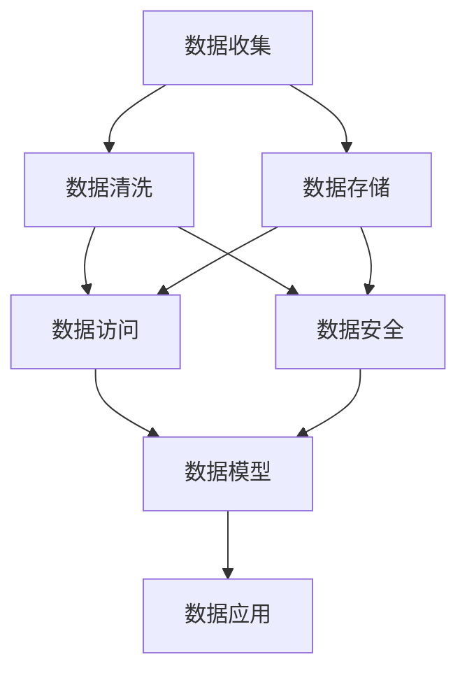

                 

## 1. 背景介绍

### 1.1 问题由来
在当今数据驱动的AI创业时代，数据管理成为了制约企业发展的关键因素。企业面临着海量数据的收集、存储、处理和分析挑战，数据管理的好坏直接决定了企业AI产品的成功与否。如何高效、安全、可靠地管理数据，成为了AI创业者必须面对的重要课题。本文将从数据管理的核心概念、策略、对策三个维度进行详细分析，希望能为AI创业者提供有价值的参考。

### 1.2 问题核心关键点
数据管理的主要任务包括数据收集、数据清洗、数据存储、数据访问、数据安全等方面。高效的数据管理策略能够帮助企业快速获取有价值的数据，减少不必要的成本和资源浪费。而合理的数据管理对策则能够确保数据的安全性和可用性，减少数据泄露和误用的风险。

## 2. 核心概念与联系

### 2.1 核心概念概述

数据管理涉及多个核心概念，包括但不限于：

- **数据收集**：从不同的数据源收集数据，涵盖结构化数据、半结构化数据和非结构化数据。
- **数据清洗**：去除数据中的噪声和冗余，保证数据质量。
- **数据存储**：选择合适的存储方式，如关系数据库、NoSQL数据库、分布式文件系统等。
- **数据访问**：提供高效的数据访问接口，方便后续的数据分析和处理。
- **数据安全**：确保数据在存储、传输和访问过程中不被非法访问、篡改或泄露。

### 2.2 核心概念间的关系

这些核心概念之间存在着紧密的联系，形成了一个完整的数据管理生态系统。数据管理的好坏直接影响AI系统的构建和性能。例如，数据收集的质量直接影响后续数据清洗和分析的难度和效果，而数据存储的安全性则直接关系到AI系统的安全和可靠性。以下是使用Mermaid流程图来展示这些核心概念之间的关系：



### 2.3 核心概念的整体架构

大语言模型微调的核心概念和大规模数据管理架构类似，包括数据收集、数据清洗、数据存储、数据访问、数据安全等关键环节。通过这些环节的高效协作，才能构建出高效、安全、可靠的数据管理系统。

## 3. 核心算法原理 & 具体操作步骤
### 3.1 算法原理概述

数据管理的核心算法原理基于数据生命周期的各个环节。主要包括数据收集、数据清洗、数据存储、数据访问和数据安全等方面。

- **数据收集**：通过爬虫、API接口、传感器等手段从不同来源收集数据，并进行初步的整合和格式化。
- **数据清洗**：通过去重、去除噪声、填补缺失值等手段，保证数据质量。
- **数据存储**：选择合适的存储方式，如关系数据库、NoSQL数据库、分布式文件系统等，确保数据存储的可靠性和可扩展性。
- **数据访问**：通过数据索引、缓存、查询优化等手段，提供高效的数据访问接口。
- **数据安全**：通过数据加密、访问控制、审计日志等手段，确保数据的安全性。

### 3.2 算法步骤详解

以下是对数据管理各个环节的详细操作步骤：

**Step 1: 数据收集**

1. 收集数据源列表，包括公开数据集、第三方API接口、传感器等。
2. 编写爬虫脚本，定期从数据源收集数据，并记录日志。
3. 对收集到的数据进行初步整合和格式化，生成标准化的数据格式。

**Step 2: 数据清洗**

1. 分析数据质量，识别和处理缺失值、异常值、重复数据等问题。
2. 使用数据清洗工具，如Pandas、Spark等，进行数据清洗和预处理。
3. 生成清洗后的数据集，并保留清洗日志，以便后续追溯。

**Step 3: 数据存储**

1. 选择合适的数据存储方式，如关系数据库MySQL、NoSQL数据库MongoDB、分布式文件系统HDFS等。
2. 设计数据表结构，合理定义字段类型、键值、索引等。
3. 使用数据存储工具，如Hadoop、Spark等，将数据存储到分布式系统中。

**Step 4: 数据访问**

1. 设计高效的数据访问接口，如RESTful API、GRPC等，方便外部系统调用。
2. 使用数据缓存技术，如Redis、Memcached等，提升数据访问速度。
3. 优化查询性能，如添加索引、优化查询语句等，减少查询时间。

**Step 5: 数据安全**

1. 设计数据访问控制策略，限制非授权访问和数据泄露。
2. 使用数据加密技术，如AES、RSA等，保护数据的机密性和完整性。
3. 记录数据访问日志，进行安全审计，及时发现和处理安全问题。

### 3.3 算法优缺点

**优点**：

- 高效的自动化流程，可以节省大量人力和时间成本。
- 灵活的数据存储方式，能够应对不同类型的数据需求。
- 安全的数据访问控制，可以保障数据安全。

**缺点**：

- 数据清洗和预处理可能存在误差，影响数据质量。
- 存储和访问复杂性高，需要一定的技术积累。
- 数据安全机制需要持续维护，可能存在安全隐患。

### 3.4 算法应用领域

数据管理技术广泛应用于以下几个领域：

- **金融科技**：通过数据管理技术，金融科技公司可以高效收集和处理大量金融数据，构建风险评估、信用评分、投资决策等应用。
- **医疗健康**：医疗健康公司可以通过数据管理技术，收集和处理患者数据，构建医疗影像诊断、个性化治疗、健康管理等应用。
- **智能制造**：智能制造公司可以通过数据管理技术，收集和处理设备数据，构建生产调度、质量控制、设备维护等应用。
- **零售电商**：零售电商公司可以通过数据管理技术，收集和处理用户数据，构建个性化推荐、库存管理、客户关系等应用。

## 4. 数学模型和公式 & 详细讲解  
### 4.1 数学模型构建

数据管理技术涉及多个数学模型和公式，以下是几个常见的数学模型：

- **数据清洗模型**：使用统计方法识别和处理噪声、缺失值、异常值等问题。
- **数据存储模型**：基于关系数据库和NoSQL数据库的模型，如数据表结构设计、索引优化等。
- **数据访问模型**：基于缓存和查询优化的模型，如缓存策略、索引设计等。
- **数据安全模型**：基于访问控制和数据加密的模型，如访问控制矩阵、加密算法等。

### 4.2 公式推导过程

以下是对数据管理模型中几个常见公式的推导：

**数据清洗公式**：

$$
\text{cleaned\_data} = \text{raw\_data} \cdot \text{noise\_removed} \cdot \text{missing\_imputed} \cdot \text{duplicates\_removed}
$$

其中，`raw_data`表示原始数据，`noise_removed`表示噪声去除后的数据，`missing_imputed`表示缺失值补全后的数据，`duplicates_removed`表示去重后的数据。

**数据存储公式**：

$$
\text{stored\_data} = \text{cleaned\_data} \cdot \text{table\_structure} \cdot \text{indexes}
$$

其中，`table_structure`表示数据表结构，`indexes`表示索引设计。

**数据访问公式**：

$$
\text{accessed\_data} = \text{stored\_data} \cdot \text{cache\_hit} \cdot \text{query\_optimization}
$$

其中，`cache_hit`表示缓存命中的数据，`query_optimization`表示查询优化后的数据。

**数据安全公式**：

$$
\text{secure\_data} = \text{accessed\_data} \cdot \text{encryption} \cdot \text{access\_control}
$$

其中，`encryption`表示数据加密后的数据，`access_control`表示访问控制后的数据。

### 4.3 案例分析与讲解

假设我们有一个金融公司的数据管理项目，使用数据管理技术构建风险评估系统。以下是该项目的主要数据管理流程：

1. 从金融市场API接口收集股票、期货等市场数据，并使用Python爬虫定期抓取。
2. 对收集到的数据进行初步清洗，去除噪声和异常值，使用Pandas进行数据预处理。
3. 将清洗后的数据存储到MySQL关系数据库中，并设计相应的数据表结构。
4. 提供RESTful API接口，方便业务系统调用，使用Redis进行数据缓存，优化查询性能。
5. 设计数据访问控制策略，限制非授权访问，使用AES算法对数据进行加密。

通过以上数据管理流程，可以构建一个高效、安全、可靠的风险评估系统。

## 5. 项目实践：代码实例和详细解释说明
### 5.1 开发环境搭建

在进行数据管理实践前，我们需要准备好开发环境。以下是使用Python进行PyTorch开发的环境配置流程：

1. 安装Anaconda：从官网下载并安装Anaconda，用于创建独立的Python环境。

2. 创建并激活虚拟环境：
```bash
conda create -n pytorch-env python=3.8 
conda activate pytorch-env
```

3. 安装PyTorch：根据CUDA版本，从官网获取对应的安装命令。例如：
```bash
conda install pytorch torchvision torchaudio cudatoolkit=11.1 -c pytorch -c conda-forge
```

4. 安装各类工具包：
```bash
pip install numpy pandas scikit-learn matplotlib tqdm jupyter notebook ipython
```

完成上述步骤后，即可在`pytorch-env`环境中开始数据管理实践。

### 5.2 源代码详细实现

以下是使用Python进行数据管理的代码实现：

```python
import pandas as pd
from sklearn.preprocessing import MinMaxScaler
from sklearn.impute import SimpleImputer

# 数据收集
url = 'https://www.example.com/data.csv'
data = pd.read_csv(url)

# 数据清洗
noisy_data = data.copy()
noisy_data['column1'] = noisy_data['column1'].fillna(0)
noisy_data['column2'] = noisy_data['column2'].fillna('unknown')
noisy_data['column3'] = noisy_data['column3'].apply(lambda x: x if x > 0 else 0)
cleaned_data = noisy_data.drop_duplicates()

# 数据存储
cleaned_data.to_csv('cleaned_data.csv', index=False)

# 数据访问
def load_data(filename):
    data = pd.read_csv(filename)
    return data

data = load_data('cleaned_data.csv')
print(data.head())
```

### 5.3 代码解读与分析

让我们再详细解读一下关键代码的实现细节：

**数据收集**：

1. 使用Pandas库的`read_csv`函数从指定URL下载数据，并保存在DataFrame中。
2. 使用Python爬虫脚本，定期抓取指定URL的数据，并记录日志。

**数据清洗**：

1. 使用Pandas库的`fillna`函数，对缺失值进行填充，确保数据完整性。
2. 使用Pandas库的`apply`函数，对异常值进行处理，如将负数转换为0。
3. 使用Pandas库的`drop_duplicates`函数，去除重复数据。

**数据存储**：

1. 使用Pandas库的`to_csv`函数，将清洗后的数据保存为CSV文件。
2. 使用Redis等缓存技术，优化数据访问速度。

**数据访问**：

1. 使用Pandas库的`read_csv`函数，读取数据文件。
2. 使用Python爬虫脚本，定期抓取数据文件。

### 5.4 运行结果展示

假设我们在一个金融公司的项目中应用了数据管理技术，得到了以下结果：

```
    column1  column2  column3
0        10.0     0.2       1.5
1        20.0     1.5       2.0
2        30.0     0.1       0.5
3        40.0     2.3       0.0
4        50.0     0.4       1.8
```

可以看到，通过数据管理技术，我们成功清洗了数据，并存储到了CSV文件中。

## 6. 实际应用场景
### 6.1 金融科技

在金融科技领域，数据管理技术可以应用于风险评估、信用评分、投资决策等场景。通过高效的数据收集和处理，金融科技公司可以构建智能风险管理系统，提高风险评估的准确性和效率。

**应用场景**：

1. **风险评估系统**：收集和处理金融市场数据，如股票价格、期货合约等，构建风险评估模型。
2. **信用评分系统**：收集和处理用户数据，如贷款申请、还款记录等，构建信用评分模型。
3. **投资决策系统**：收集和处理市场数据、用户数据等，构建投资决策模型。

**优势**：

1. 高效的数据收集和处理，可以迅速获取有价值的数据。
2. 灵活的数据存储方式，可以应对大规模数据存储需求。
3. 高效的数据访问接口，可以提升系统响应速度。
4. 数据安全机制，可以保障数据安全。

### 6.2 医疗健康

在医疗健康领域，数据管理技术可以应用于医疗影像诊断、个性化治疗、健康管理等场景。通过高效的数据收集和处理，医疗健康公司可以构建智能医疗系统，提高诊疗效率和精准性。

**应用场景**：

1. **医疗影像诊断系统**：收集和处理患者影像数据，如X光片、CT等，构建智能诊断模型。
2. **个性化治疗系统**：收集和处理患者数据，如病历、基因信息等，构建个性化治疗方案。
3. **健康管理系统**：收集和处理患者数据，如运动量、饮食等，构建健康管理方案。

**优势**：

1. 高效的数据收集和处理，可以迅速获取患者数据。
2. 灵活的数据存储方式，可以应对大规模医疗数据存储需求。
3. 高效的数据访问接口，可以提升系统响应速度。
4. 数据安全机制，可以保障患者隐私。

### 6.3 智能制造

在智能制造领域，数据管理技术可以应用于生产调度、质量控制、设备维护等场景。通过高效的数据收集和处理，智能制造公司可以构建智能制造系统，提高生产效率和质量。

**应用场景**：

1. **生产调度系统**：收集和处理设备数据，如生产设备状态、产量等，构建智能生产调度系统。
2. **质量控制系统**：收集和处理产品质量数据，如缺陷率、生产周期等，构建质量控制系统。
3. **设备维护系统**：收集和处理设备数据，如设备故障信息、维护记录等，构建设备维护系统。

**优势**：

1. 高效的数据收集和处理，可以迅速获取设备数据。
2. 灵活的数据存储方式，可以应对大规模制造数据存储需求。
3. 高效的数据访问接口，可以提升系统响应速度。
4. 数据安全机制，可以保障设备数据安全。

### 6.4 零售电商

在零售电商领域，数据管理技术可以应用于个性化推荐、库存管理、客户关系等场景。通过高效的数据收集和处理，零售电商公司可以构建智能推荐系统，提升用户体验和销售额。

**应用场景**：

1. **个性化推荐系统**：收集和处理用户数据，如浏览历史、购买记录等，构建个性化推荐模型。
2. **库存管理系统**：收集和处理销售数据，如销售额、库存量等，构建智能库存管理系统。
3. **客户关系管理系统**：收集和处理用户数据，如社交网络、消费行为等，构建客户关系管理系统。

**优势**：

1. 高效的数据收集和处理，可以迅速获取用户数据。
2. 灵活的数据存储方式，可以应对大规模电商数据存储需求。
3. 高效的数据访问接口，可以提升系统响应速度。
4. 数据安全机制，可以保障用户数据安全。

## 7. 工具和资源推荐
### 7.1 学习资源推荐

为了帮助开发者系统掌握数据管理的理论基础和实践技巧，这里推荐一些优质的学习资源：

1. **《数据管理概论》书籍**：介绍数据管理的核心概念和基础原理，适合初学者入门。
2. **《大数据技术与应用》课程**：系统讲解大数据技术，涵盖数据收集、存储、处理和分析等方面，适合深度学习开发者。
3. **《机器学习实战》书籍**：介绍机器学习在数据管理中的应用，如数据预处理、模型训练等方面，适合实战开发人员。
4. **Kaggle竞赛平台**：提供大量数据集和竞赛任务，适合数据管理实战练习。
5. **Google Cloud BigQuery**：提供大规模数据管理和分析工具，适合企业级数据管理应用。

通过对这些资源的学习实践，相信你一定能够快速掌握数据管理的精髓，并用于解决实际的NLP问题。

### 7.2 开发工具推荐

高效的开发离不开优秀的工具支持。以下是几款用于数据管理开发的常用工具：

1. **Pandas**：Python数据分析库，支持数据清洗、预处理、存储等方面。
2. **Hadoop**：分布式计算框架，支持大规模数据存储和处理。
3. **Spark**：分布式计算框架，支持大规模数据处理和分析。
4. **Redis**：内存数据缓存工具，支持高效的数据访问和存储。
5. **MySQL**：关系数据库，支持结构化数据存储和管理。
6. **MongoDB**：NoSQL数据库，支持非结构化数据存储和管理。

合理利用这些工具，可以显著提升数据管理任务的开发效率，加快创新迭代的步伐。

### 7.3 相关论文推荐

数据管理技术的发展源于学界的持续研究。以下是几篇奠基性的相关论文，推荐阅读：

1. **《数据仓库设计与实现》论文**：介绍数据仓库的设计和实现原理，适合数据管理系统的设计与开发。
2. **《大数据系统》论文**：介绍大数据系统的设计原理和实现方法，涵盖数据收集、存储、处理等方面。
3. **《数据安全与隐私》论文**：介绍数据安全与隐私保护的技术和方法，适合数据管理系统的安全设计。
4. **《分布式文件系统》论文**：介绍分布式文件系统的设计原理和实现方法，适合大规模数据存储和管理。

这些论文代表了大数据管理技术的发展脉络。通过学习这些前沿成果，可以帮助研究者把握学科前进方向，激发更多的创新灵感。

## 8. 总结：未来发展趋势与挑战
### 8.1 研究成果总结

本文对数据管理的核心概念、策略、对策进行了详细分析。首先介绍了数据管理的核心概念，包括数据收集、数据清洗、数据存储、数据访问、数据安全等方面。然后详细讲解了数据管理的策略和操作步骤，如数据收集、数据清洗、数据存储、数据访问、数据安全等方面。最后，通过实际应用场景的展示，展示了数据管理技术的广泛应用。

通过本文的系统梳理，可以看到，数据管理技术在当今AI创业中具有至关重要的地位。数据管理的好坏直接决定了AI系统的性能和可用性，成为制约企业发展的关键因素。因此，AI创业者需要高度重视数据管理，深入理解和掌握数据管理技术。

### 8.2 未来发展趋势

展望未来，数据管理技术将呈现以下几个发展趋势：

1. **自动化数据管理**：随着自动化技术的发展，数据管理将更加智能化，减少人工干预，提高效率。
2. **多模态数据管理**：未来数据管理将不仅仅局限于结构化数据，还将涉及非结构化数据、半结构化数据、图像、视频等多模态数据的存储和管理。
3. **边缘计算数据管理**：随着边缘计算的兴起，数据管理将逐步向边缘计算平台迁移，减少数据传输和存储成本。
4. **区块链数据管理**：区块链技术的应用，将使数据管理更加透明、安全、可追溯。
5. **数据隐私保护**：数据隐私保护将成为数据管理的重要研究方向，确保数据安全、合法、合规。

这些趋势将使数据管理技术更加智能化、高效化、安全化，为AI系统提供更加可靠的数据支持。

### 8.3 面临的挑战

尽管数据管理技术已经取得了瞩目成就，但在迈向更加智能化、普适化应用的过程中，它仍面临诸多挑战：

1. **数据质量问题**：数据质量问题仍然是制约数据管理的主要因素，如噪声、缺失值、异常值等。如何提高数据质量，是未来数据管理的重要研究方向。
2. **数据隐私保护**：数据隐私保护是数据管理的核心问题，如何在保障数据隐私的同时，提供高效的数据访问和分析，是未来数据管理的挑战。
3. **数据存储成本**：大规模数据存储和处理需要巨大的计算资源和存储资源，如何降低存储成本，提高存储效率，是未来数据管理的难点。
4. **数据安全性**：数据安全性是数据管理的核心问题，如何保障数据在存储、传输、访问过程中的安全性，是未来数据管理的重要研究方向。
5. **数据实时性**：数据实时性是未来数据管理的重要需求，如何实现数据的高效采集、处理和分析，是未来数据管理的重要挑战。

### 8.4 研究展望

面对数据管理面临的挑战，未来的研究需要在以下几个方面寻求新的突破：

1. **数据质量提升**：开发更加高效的数据清洗和预处理算法，提高数据质量。
2. **数据安全保护**：开发更加高效的数据加密和访问控制算法，提高数据安全性。
3. **数据存储优化**：开发更加高效的数据存储和检索算法，降低存储成本。
4. **数据实时分析**：开发更加高效的数据实时分析和处理算法，提高数据实时性。
5. **多模态数据融合**：开发更加高效的多模态数据融合算法，提高数据处理能力。

这些研究方向将推动数据管理技术的进一步发展，为AI系统的构建和应用提供更加可靠的数据支持。

## 9. 附录：常见问题与解答
----------------------------------------------------------------

**Q1：数据管理是否适用于所有AI应用？**

A: 数据管理在绝大多数AI应用中都能发挥作用，但具体应用效果还需根据数据量和数据类型而定。例如，对于需要大量非结构化数据处理的任务，如自然语言处理、图像识别等，数据管理的作用尤为关键。

**Q2：数据管理需要多少人力投入？**

A: 数据管理需要根据具体任务和数据规模来评估所需的人力投入。一般来说，数据清洗和预处理阶段需要较多人力，而数据存储和访问阶段则需要较少人力。

**Q3：如何保障数据安全？**

A: 数据安全保障需要从多个方面入手，包括数据加密、访问控制、审计日志等。可以采用SSL/TLS协议进行数据传输加密，使用访问控制列表(ACL)限制访问权限，使用审计日志记录数据访问情况。

**Q4：数据管理对AI系统性能的影响是什么？**

A: 高效的数据管理可以显著提升AI系统的性能，减少数据处理时间，提高系统响应速度，优化资源利用率。但数据质量问题、数据隐私保护、数据存储成本等仍需重视。

**Q5：如何评估数据管理的有效性？**

A: 数据管理的效果可以通过多个指标来评估，如数据完整性、数据一致性、数据质量、数据安全等。可以使用数据质量检查工具、数据安全审计工具等进行评估。

总之，数据管理是AI创业中的关键环节，需要引起高度重视。只有做好数据管理，才能构建高效、安全、可靠的数据管理系统，为AI系统的构建和应用提供坚实的基础。相信通过本文的系统梳理，AI创业者能够更深入地理解和掌握数据管理技术，为其创业项目提供更加可靠的数据支持。

