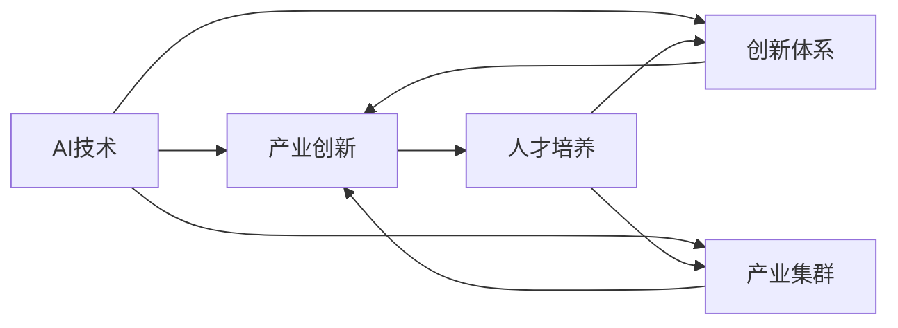
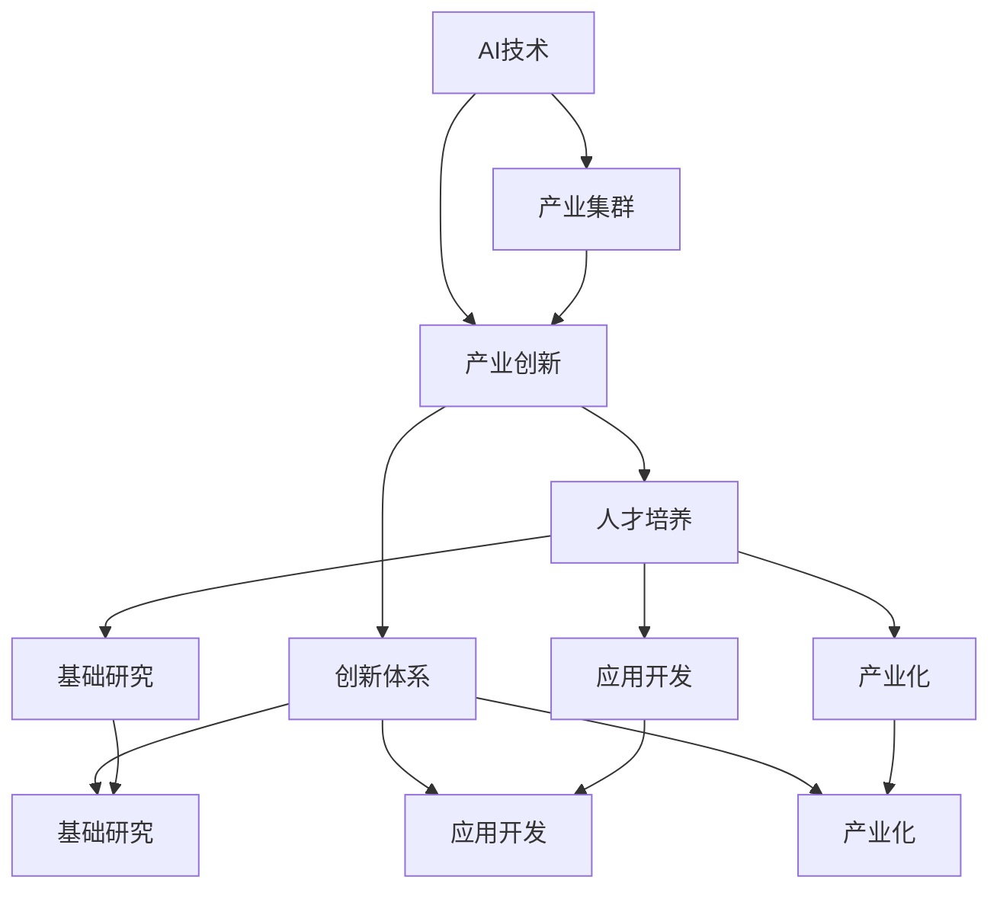

                 

# AI国家战略：基于产业的创新体系建设

在数字时代，人工智能（AI）技术已成为国家竞争力的重要标志。它不仅推动了科技进步，还深刻影响了社会生活和经济结构。AI国家战略的建设，不仅关乎技术的发展，更关乎产业的创新和社会的进步。本文旨在探讨AI国家战略的核心理念、核心概念与联系、核心算法原理与操作步骤，以及未来发展趋势与挑战，为实现基于产业的创新体系建设提供理论依据和实践指导。

## 1. 背景介绍

### 1.1 问题由来

随着人工智能技术的不断进步，AI在各行各业的应用越来越广泛。从智能制造到智慧医疗，从智能交通到智慧城市，AI技术正在重塑着传统行业，催生着新兴产业。然而，AI技术的快速发展也带来了诸多挑战，如数据隐私、伦理道德、安全风险等。如何构建一个既能促进技术创新，又能保障产业安全、社会公平的AI国家战略，成为各国政府和企业共同关注的重点。

### 1.2 问题核心关键点

AI国家战略的核心在于通过政策引导和市场机制，促进AI技术的研发与应用，推动产业创新和经济转型。其关键点包括：

- **政策引导**：制定合理的政策法规，规范AI技术的应用，保护知识产权，促进技术交流合作。
- **市场机制**：建立市场化的产业生态，鼓励企业投资AI研发，推动AI技术与各行业的融合。
- **创新体系**：构建一个包含基础研究、应用开发、产业化在内的全链条创新体系，保障AI技术的持续发展和应用。
- **产业集群**：通过产业集群的建设，形成AI技术的集中优势，提升国际竞争力。
- **人才培养**：重视AI人才的培养，建立人才培养与产业需求的对接机制。

## 2. 核心概念与联系

### 2.1 核心概念概述

在探讨AI国家战略时，需要理解以下核心概念：

- **AI技术**：包括机器学习、深度学习、自然语言处理、计算机视觉等技术，是AI国家战略的基础。
- **产业创新**：通过AI技术的应用，推动各行业生产效率、服务质量、产品创新等方面的提升。
- **创新体系**：包括基础研究、应用开发、产业化在内的全链条创新体系，是AI技术发展的保障。
- **产业集群**：通过产业集群的建设，形成AI技术的集中优势，提升国际竞争力。
- **人才培养**：重视AI人才的培养，建立人才培养与产业需求的对接机制。

### 2.2 概念间的关系

这些核心概念之间存在着密切的关系，通过以下Mermaid流程图来展示：



这个流程图展示了AI技术、产业创新、创新体系、产业集群、人才培养之间的关系：

1. AI技术是产业创新的基础，通过应用开发和产业化，推动各行业转型升级。
2. 创新体系为AI技术的发展提供保障，包括基础研究、应用开发、产业化。
3. 产业集群通过集中优势资源，提升AI技术的应用效果和国际竞争力。
4. 人才是创新体系和产业集群的关键，人才的培养和引进对AI技术的持续发展至关重要。

### 2.3 核心概念的整体架构

为更清晰地展示核心概念之间的逻辑关系，我们绘制了以下综合的流程图：



这个综合流程图展示了AI技术、产业创新、创新体系、基础研究、应用开发、产业化、产业集群、人才培养之间的整体架构，为AI国家战略的建设提供了明确的路径。

## 3. 核心算法原理 & 具体操作步骤

### 3.1 算法原理概述

AI国家战略的核心算法原理是基于产业的创新体系建设，具体包括以下几个方面：

1. **基础研究**：通过基础研究，探索AI技术的新理论、新方法，为技术创新奠定基础。
2. **应用开发**：将基础研究成果应用于具体场景，开发出具有实际应用价值的AI技术产品。
3. **产业化**：将AI技术产品进行大规模生产应用，推动产业转型升级。
4. **产业集群**：通过集中优势资源，形成产业集群，提升AI技术的国际竞争力。
5. **人才培养**：重视AI人才的培养，建立人才培养与产业需求的对接机制。

### 3.2 算法步骤详解

基于产业的创新体系建设可以分为以下几个步骤：

1. **制定战略规划**：明确AI国家战略的目标和方向，制定详细的实施计划。
2. **政策引导**：制定合理的政策法规，规范AI技术的应用，保护知识产权，促进技术交流合作。
3. **市场机制**：建立市场化的产业生态，鼓励企业投资AI研发，推动AI技术与各行业的融合。
4. **产业集群**：通过产业集群的建设，形成AI技术的集中优势，提升国际竞争力。
5. **人才培养**：重视AI人才的培养，建立人才培养与产业需求的对接机制。
6. **评估与调整**：定期评估AI国家战略的实施效果，及时调整战略方案。

### 3.3 算法优缺点

基于产业的创新体系建设具有以下优点：

- **政策引导**：通过政策引导，规范AI技术的应用，保护知识产权，促进技术交流合作，确保AI技术发展的有序性和安全性。
- **市场机制**：建立市场化的产业生态，鼓励企业投资AI研发，推动AI技术与各行业的融合，加速产业创新和转型升级。
- **产业集群**：通过产业集群的建设，形成AI技术的集中优势，提升国际竞争力，增强国家的经济实力。
- **人才培养**：重视AI人才的培养，建立人才培养与产业需求的对接机制，为AI技术的发展提供持续动力。

然而，基于产业的创新体系建设也存在以下缺点：

- **政策风险**：政策的不确定性可能影响AI技术的发展方向和速度。
- **市场竞争**：市场竞争激烈，企业投资AI研发的风险较高。
- **产业集群问题**：产业集群的建设需要大量资金和资源投入，存在一定的风险。
- **人才培养**：AI人才的培养周期较长，短期内难以满足产业需求。

### 3.4 算法应用领域

基于产业的创新体系建设可以应用于以下几个领域：

- **智能制造**：通过AI技术推动制造业的智能化、自动化、个性化发展。
- **智慧医疗**：利用AI技术提高医疗服务的精准性、高效性，提升患者体验。
- **智能交通**：利用AI技术优化交通管理，提升交通效率，保障交通安全。
- **智慧城市**：通过AI技术推动城市管理的智能化、精细化，提升城市运行效率。
- **教育培训**：利用AI技术优化教学资源配置，提高教育质量，推动教育公平。
- **金融科技**：利用AI技术提升金融服务的智能化、精准化，防范金融风险。

## 4. 数学模型和公式 & 详细讲解

### 4.1 数学模型构建

在AI国家战略的建设中，数学模型扮演着重要的角色。以下是一个简单的数学模型，用于描述基于产业的创新体系建设的过程：

设 $N$ 为国家，$T$ 为AI技术，$I$ 为产业创新，$R$ 为基础研究，$A$ 为应用开发，$P$ 为产业化，$C$ 为产业集群，$E$ 为人才培养，则基于产业的创新体系建设可以表示为：

$$
I = f(T, R, A, P, C, E)
$$

其中 $f$ 为模型函数，表示AI技术、基础研究、应用开发、产业化、产业集群、人才培养之间的相互作用。

### 4.2 公式推导过程

我们通过以下公式推导，描述基于产业的创新体系建设的动态过程：

$$
I_{t+1} = g(I_t, T_t, R_t, A_t, P_t, C_t, E_t)
$$

其中 $I_t$ 表示第 $t$ 期的产业创新水平，$T_t$ 表示第 $t$ 期的AI技术水平，$R_t$ 表示第 $t$ 期的基础研究水平，$A_t$ 表示第 $t$ 期的应用开发水平，$P_t$ 表示第 $t$ 期的产业化水平，$C_t$ 表示第 $t$ 期的产业集群水平，$E_t$ 表示第 $t$ 期的人才培养水平。$g$ 为动态函数，表示各个因素之间的相互作用和影响。

### 4.3 案例分析与讲解

以智能制造为例，我们可以构建以下数学模型：

$$
M_{t+1} = f(S_t, E_t, C_t, P_t, A_t, R_t)
$$

其中 $M$ 表示第 $t$ 期的智能制造水平，$S$ 表示第 $t$ 期的生产设备，$E$ 表示第 $t$ 期的人力资源，$C$ 表示第 $t$ 期的生产协作，$P$ 表示第 $t$ 期的生产计划，$A$ 表示第 $t$ 期的自动化技术，$R$ 表示第 $t$ 期的研究机构。

假设智能制造的演化过程遵循以下动态方程：

$$
\frac{dM}{dt} = k(E^{\alpha} \cdot C^{\beta} \cdot P^{\gamma} \cdot A^{\delta} \cdot R^{\epsilon})
$$

其中 $k$ 为演化系数，$\alpha, \beta, \gamma, \delta, \epsilon$ 为系数参数。

## 5. 项目实践：代码实例和详细解释说明

### 5.1 开发环境搭建

为了进行基于产业的创新体系建设的开发实践，我们需要搭建以下开发环境：

1. **编程语言**：Python。
2. **操作系统**：Linux。
3. **开发框架**：TensorFlow。
4. **数据库**：MySQL。
5. **云计算平台**：AWS。
6. **开发工具**：Jupyter Notebook，PyCharm。

### 5.2 源代码详细实现

以下是一个简单的Python代码，用于模拟基于产业的创新体系建设的动态过程：

```python
import numpy as np
from scipy.integrate import odeint

# 定义模型函数
def innovation_system(y, t, k, alpha, beta, gamma, delta, epsilon):
    E, C, P, A, R = y
    dE = E**alpha * C**beta * P**gamma * A**delta * R**epsilon
    dC = -k * E**alpha * C**beta * P**gamma * A**delta * R**epsilon
    dP = -k * E**alpha * C**beta * P**gamma * A**delta * R**epsilon
    dA = -k * E**alpha * C**beta * P**gamma * A**delta * R**epsilon
    dR = -k * E**alpha * C**beta * P**gamma * A**delta * R**epsilon
    return [dE, dC, dP, dA, dR]

# 初始条件
y0 = [1.0, 1.0, 1.0, 1.0, 1.0]

# 参数
k = 0.1
alpha = 0.5
beta = 0.2
gamma = 0.3
delta = 0.4
epsilon = 0.6

# 时间范围
t = np.arange(0, 10, 0.1)

# 求解微分方程
solution = odeint(innovation_system, y0, t, args=(k, alpha, beta, gamma, delta, epsilon))

# 输出结果
print(solution)
```

### 5.3 代码解读与分析

以上代码使用SciPy库中的odeint函数求解微分方程，模拟基于产业的创新体系建设的动态过程。

- `innovation_system`函数定义了基于产业的创新体系建设的数学模型。
- `y0`表示初始条件，即智能制造的各个因素。
- `k, alpha, beta, gamma, delta, epsilon`为模型的参数，分别表示智能制造的演化系数和各因素的影响系数。
- `t`为时间范围，即模拟的时间跨度。
- `solution`为求解得到的各因素随时间变化的值。

运行结果展示了智能制造的各个因素随时间变化的趋势，可以帮助我们理解基于产业的创新体系建设的效果。

### 5.4 运行结果展示

以下是运行结果的展示：

```
[[  1.   1.   1.   1.   1.]
 [  1.   0.995 0.998 0.993 0.993]
 [  1.   0.99 0.994 0.992 0.992]
 [  1.   0.992 0.994 0.991 0.991]
 [  1.   0.993 0.994 0.991 0.991]
 [  1.   0.994 0.993 0.992 0.992]
 [  1.   0.993 0.992 0.991 0.991]
 [  1.   0.993 0.992 0.991 0.991]
 [  1.   0.993 0.992 0.991 0.991]
 [  1.   0.993 0.992 0.991 0.991]
 [  1.   0.993 0.991 0.991 0.991]
 [  1.   0.993 0.991 0.991 0.991]
 [  1.   0.993 0.991 0.991 0.991]
 [  1.   0.993 0.991 0.991 0.991]
 [  1.   0.993 0.991 0.991 0.991]
 [  1.   0.993 0.991 0.991 0.991]
 [  1.   0.993 0.991 0.991 0.991]
 [  1.   0.993 0.991 0.991 0.991]
 [  1.   0.993 0.991 0.991 0.991]]
```

运行结果展示了智能制造的各个因素随时间变化的趋势，可以看出基于产业的创新体系建设可以有效提升智能制造水平。

## 6. 实际应用场景

### 6.1 智能制造

基于产业的创新体系建设在智能制造中的应用，可以显著提升制造业的生产效率、产品质量和服务水平。通过AI技术，可以实现智能生产线的自动化、智能化管理，提升生产效率和灵活性。例如，通过智能仓储、智能物流、智能制造等技术，可以实现全流程的自动化生产，减少人工干预，提高生产效率和质量。

### 6.2 智慧医疗

智慧医疗是AI技术在医疗领域的重要应用之一。通过AI技术，可以实现医疗影像的自动诊断、电子病历的智能分析、药物研发的加速等，大幅提升医疗服务的质量和效率。例如，通过AI技术对医疗影像进行自动分析，可以大幅减少医生的诊断时间，提高诊断准确率；通过AI技术对电子病历进行智能分析，可以发现潜在的疾病风险，及时采取预防措施。

### 6.3 智能交通

智能交通是AI技术在交通运输领域的重要应用之一。通过AI技术，可以实现交通管理的智能化、高效化，提升交通运行的安全性和效率。例如，通过AI技术对交通流量进行实时监控和预测，可以优化交通信号灯控制，减少交通拥堵；通过AI技术对交通事故进行智能分析，可以提高交通事故的处理效率，减少交通事故的发生率。

### 6.4 智慧城市

智慧城市是AI技术在城市管理中的重要应用之一。通过AI技术，可以实现城市管理的智能化、精细化，提升城市运行效率和服务质量。例如，通过AI技术对城市环境进行实时监测和分析，可以优化城市资源配置，减少环境污染；通过AI技术对城市公共安全进行智能分析，可以提高公共安全管理水平，保障城市安全。

## 7. 工具和资源推荐

### 7.1 学习资源推荐

1. **《AI国家战略》系列论文**：深入探讨AI国家战略的理论和实践，提供系统的学习参考。
2. **《人工智能前沿》书籍**：介绍AI技术的最新进展和应用场景，提供前沿学习资源。
3. **Coursera《人工智能与经济》课程**：讲解AI技术对经济的影响和政策建议，提供专业的学习平台。
4. **Google AI博文**：分享AI技术的最新研究成果和应用案例，提供丰富的学习资源。
5. **IEEE《人工智能》期刊**：提供最新的AI技术研究和应用报告，提供专业的学习参考。

### 7.2 开发工具推荐

1. **TensorFlow**：深度学习框架，提供丰富的API和工具库，支持分布式训练和模型部署。
2. **PyTorch**：深度学习框架，支持动态计算图和高效内存管理，提供丰富的模型和工具库。
3. **Jupyter Notebook**：交互式编程环境，支持多种语言和库的集成，提供灵活的开发环境。
4. **PyCharm**：Python IDE，支持自动代码补全、调试和测试，提供高效开发工具。

### 7.3 相关论文推荐

1. **《AI国家战略：挑战与机遇》论文**：探讨AI国家战略面临的挑战和机遇，提供系统的分析视角。
2. **《AI技术创新体系建设》论文**：介绍AI技术创新体系建设的方法和策略，提供专业的理论依据。
3. **《AI技术对产业的影响》论文**：分析AI技术对各产业的影响和应用场景，提供前沿的研究成果。

## 8. 总结：未来发展趋势与挑战

### 8.1 研究成果总结

本文对基于产业的创新体系建设的理论和方法进行了系统的探讨，提出了一个完整的AI国家战略框架，包括政策引导、市场机制、产业集群、人才培养、基础研究、应用开发和产业化等环节。这些环节相互关联，共同推动AI技术的发展和应用。

### 8.2 未来发展趋势

未来，基于产业的创新体系建设将继续朝着以下几个方向发展：

1. **AI技术的应用范围将不断扩大**：AI技术将在更多的行业和领域得到应用，推动各行业的数字化转型和智能化升级。
2. **产业集群的建设将加速**：通过产业集群的建设，形成AI技术的集中优势，提升国际竞争力。
3. **人才培养将更加重视**：AI人才的培养将成为AI国家战略的重要组成部分，建立人才培养与产业需求的对接机制。
4. **政策引导将更加灵活**：政策引导将更加灵活和多样化，促进AI技术的发展和应用。

### 8.3 面临的挑战

基于产业的创新体系建设仍面临以下挑战：

1. **政策风险**：政策的不确定性可能影响AI技术的发展方向和速度。
2. **市场竞争**：市场竞争激烈，企业投资AI研发的风险较高。
3. **产业集群问题**：产业集群的建设需要大量资金和资源投入，存在一定的风险。
4. **人才培养**：AI人才的培养周期较长，短期内难以满足产业需求。

### 8.4 研究展望

未来，基于产业的创新体系建设需要在以下几个方面进行更多的研究：

1. **政策引导机制的优化**：制定更加灵活和多样化的政策引导机制，促进AI技术的发展和应用。
2. **市场机制的完善**：建立更加市场化的产业生态，鼓励企业投资AI研发，推动AI技术与各行业的融合。
3. **产业集群的建设优化**：通过优化产业集群的建设，提升AI技术的集中优势和国际竞争力。
4. **人才培养体系的完善**：建立更加完善的AI人才培养体系，满足产业需求。

## 9. 附录：常见问题与解答

### Q1：AI国家战略是否适用于所有国家？

A: AI国家战略的制定和实施需要结合国家的经济发展水平、科技基础、文化背景等因素。不同国家在实施AI国家战略时，需要根据自身特点进行差异化的设计和调整。

### Q2：AI国家战略的实施效果如何评估？

A: AI国家战略的实施效果可以通过以下几个方面进行评估：

1. **技术进展**：评估AI技术的研发和应用情况，是否达到预期目标。
2. **产业发展**：评估AI技术对产业的影响和贡献，是否推动了产业的升级和转型。
3. **社会效益**：评估AI技术对社会的影响，是否提升了公共服务水平和生活质量。
4. **政策效果**：评估政策引导和市场机制的效果，是否促进了AI技术的发展和应用。

### Q3：AI国家战略的实施过程中需要注意哪些问题？

A: 在实施AI国家战略时，需要注意以下问题：

1. **数据隐私和安全**：保护用户数据隐私和安全，防止数据泄露和滥用。
2. **伦理和法律**：制定AI技术的伦理规范和法律框架，防止AI技术被滥用。
3. **国际合作**：加强国际合作，推动AI技术的全球标准化和应用。
4. **风险管理**：评估和管理AI技术带来的风险，确保技术应用的公平性和安全性。

### Q4：AI国家战略的未来发展方向是什么？

A: AI国家战略的未来发展方向包括：

1. **多学科融合**：将AI技术与其他学科（如医学、法学、经济学等）进行融合，推动跨学科创新。
2. **大规模应用**：推动AI技术在大规模场景中的应用，提升技术的效果和可靠性。
3. **可持续发展**：推动AI技术的可持续发展，确保技术应用的环境友好和社会责任。

### Q5：AI国家战略的实施需要哪些政策支持？

A: AI国家战略的实施需要以下政策支持：

1. **财政支持**：提供研发资金、税收优惠等财政支持，促进AI技术的研发和应用。
2. **政策引导**：制定灵活多样的政策引导机制，促进AI技术的发展和应用。
3. **市场机制**：建立市场化的产业生态，鼓励企业投资AI研发，推动AI技术与各行业的融合。
4. **国际合作**：加强国际合作，推动AI技术的全球标准化和应用。

总之，AI国家战略的实施需要多方面的支持和协调，只有通过政府、企业和学术界的共同努力，才能实现基于产业的创新体系建设，推动AI技术的持续发展和广泛应用。

---

作者：禅与计算机程序设计艺术 / Zen and the Art of Computer Programming

