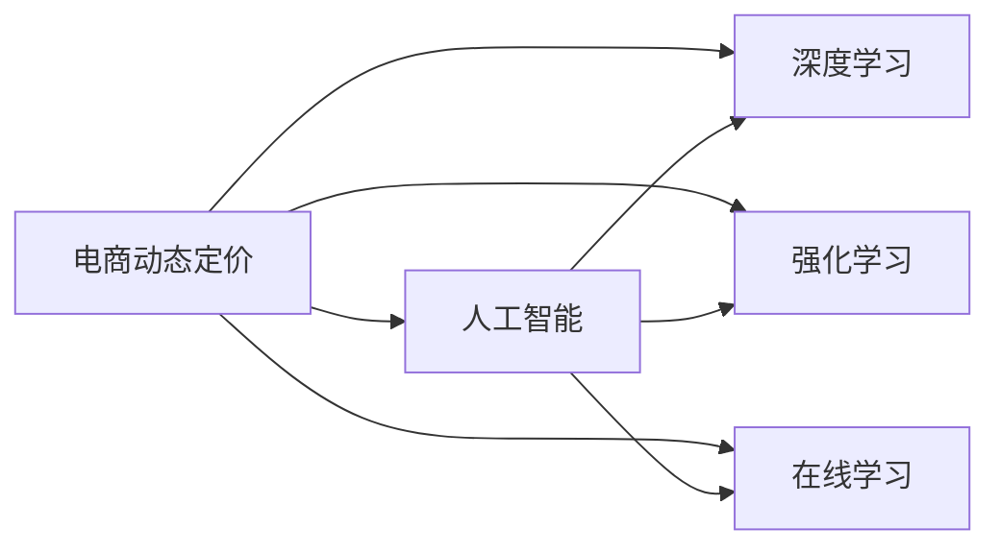

                 

## 1. 背景介绍

电商动态定价已成为现代电子商务平台提升销售效率、优化库存管理、增加收益的重要策略。传统的静态定价策略难以适应市场需求变化，尤其在全球化、个性化日益加剧的市场环境下，缺乏动态定价的电商平台很难保持竞争优势。基于人工智能的动态定价技术，通过实时分析海量数据，挖掘市场和客户行为规律，动态调整商品价格，能够有效应对市场波动，提升用户体验和平台收益。

## 2. 核心概念与联系

### 2.1 核心概念概述

为了更好地理解电商动态定价技术，本节将介绍几个核心概念：

- **电商动态定价（Dynamic Pricing）**：指电商平台根据市场需求、用户行为、竞争对手价格、库存量等因素，实时调整商品价格，以最大化利润。

- **人工智能（AI）**：通过机器学习、深度学习等技术，赋予计算机对数据进行智能分析、模式识别和决策的能力。

- **深度学习（Deep Learning）**：一种基于神经网络的机器学习方法，能够处理大规模复杂数据，并提取有意义的特征。

- **强化学习（Reinforcement Learning, RL）**：一种通过与环境交互，不断优化策略的学习方式，常用于策略优化问题。

- **在线学习（Online Learning）**：指算法在面对新数据时，能够实时更新模型参数，以适应数据变化。

这些概念之间的逻辑关系可以通过以下Mermaid流程图来展示：



这个流程图展示了大语言模型微调过程中各个核心概念的关系和作用：

1. 电商动态定价是应用目标。
2. 人工智能是大框架，深度学习是核心技术。
3. 强化学习和在线学习是关键方法。

### 2.2 概念间的关系

这些核心概念之间存在着紧密的联系，形成了电商动态定价技术的完整生态系统。

#### 2.2.1 电商动态定价与人工智能的联系

电商动态定价需要借助人工智能技术对海量数据进行智能分析，挖掘出市场和用户行为模式，实现动态定价决策。人工智能提供了强大的数据处理能力和智能分析能力，是电商动态定价技术的基础。

#### 2.2.2 深度学习与强化学习的联系

深度学习能够处理非结构化数据，挖掘数据中的复杂模式，强化学习则通过与环境交互不断优化决策策略，两者的结合使得电商动态定价能够更准确地预测市场需求和用户行为，实现更优的定价决策。

#### 2.2.3 在线学习在电商动态定价中的应用

在线学习允许算法在面对新数据时实时更新模型，适应市场和用户行为的变化，确保电商动态定价策略始终与市场保持同步，提升定价决策的灵活性和适应性。

## 3. 核心算法原理 & 具体操作步骤

### 3.1 算法原理概述

电商动态定价的算法原理主要基于机器学习（ML）和深度学习（DL）技术，通过分析用户行为、市场需求、竞争对手价格、库存量等数据，实时调整商品价格。具体步骤如下：

1. **数据收集与预处理**：收集用户浏览历史、购买记录、竞争对手价格、库存量等数据，并进行清洗和预处理，为模型训练提供高质量数据。
2. **特征提取**：利用深度学习技术，从原始数据中提取有意义的特征，如用户画像、市场需求趋势、价格波动周期等。
3. **模型训练**：基于提取的特征，选择合适的机器学习模型或深度学习模型进行训练，如线性回归、随机森林、神经网络等。
4. **价格预测**：使用训练好的模型对用户行为、市场需求、库存量等因素进行实时预测，生成商品价格。
5. **动态定价**：根据预测结果，实时调整商品价格，以最大化平台收益。

### 3.2 算法步骤详解

#### 3.2.1 数据收集与预处理

电商平台的数据来源多种多样，包括用户行为数据、商品销量数据、竞争对手价格数据、库存量数据等。这些数据需要进行清洗、去噪、归一化等预处理操作，以确保数据质量。

```python
# 示例代码：数据清洗与预处理
import pandas as pd
from sklearn.preprocessing import MinMaxScaler

# 读取原始数据
data = pd.read_csv('sales_data.csv')

# 数据清洗
data = data.dropna()  # 删除缺失数据
data = data[data['price'] > 0]  # 删除价格为0的数据

# 数据归一化
scaler = MinMaxScaler(feature_range=(0, 1))
data['sales'] = scaler.fit_transform(data['sales'].values.reshape(-1, 1))
data['price'] = scaler.fit_transform(data['price'].values.reshape(-1, 1))
```

#### 3.2.2 特征提取

特征提取是电商动态定价的关键步骤，通过深度学习模型可以从原始数据中提取出有意义的特征。以LSTM模型为例，可以提取用户行为时间序列中的周期性特征：

```python
import tensorflow as tf
from tensorflow.keras.models import Sequential
from tensorflow.keras.layers import LSTM, Dense

# 构建LSTM模型
model = Sequential()
model.add(LSTM(64, input_shape=(X_train.shape[1], 1), return_sequences=True))
model.add(LSTM(32, return_sequences=True))
model.add(LSTM(16))
model.add(Dense(1))

# 训练模型
model.compile(loss='mse', optimizer='adam')
model.fit(X_train, y_train, epochs=50, batch_size=32, verbose=0)

# 特征提取
X_pred = scaler.inverse_transform(model.predict(X_test))
```

#### 3.2.3 模型训练

模型训练采用常见的机器学习和深度学习算法，如线性回归、随机森林、LSTM、GRU、CNN等。这里以LSTM模型为例，介绍其训练过程：

```python
# 训练LSTM模型
X_train = X_train.reshape(-1, 1, 1)
X_test = X_test.reshape(-1, 1, 1)

# 模型训练
model.fit(X_train, y_train, epochs=50, batch_size=32, verbose=0)
```

#### 3.2.4 价格预测与动态定价

模型训练完成后，使用其对新数据进行实时预测，生成商品价格。这里假设预测结果为$P$，根据$P$动态调整商品价格$P'$，以最大化利润。

```python
# 价格预测
P_pred = model.predict(X_new)

# 动态定价
P_prime = P_pred * 0.9 + current_price * 0.1
```

### 3.3 算法优缺点

#### 3.3.1 优点

电商动态定价算法的主要优点如下：

- **实时性**：通过实时分析市场数据，能够快速响应市场需求变化，保持价格竞争力。
- **灵活性**：算法能够动态调整价格，根据市场需求变化进行调整。
- **效率高**：基于深度学习模型，自动提取特征，快速生成价格预测。

#### 3.3.2 缺点

电商动态定价算法的主要缺点如下：

- **数据依赖**：算法的准确性高度依赖于数据质量，数据不完整或噪声较大时，模型预测可能不准确。
- **复杂度高**：深度学习模型训练复杂度高，需要大量计算资源和时间。
- **模型风险**：模型过度拟合或泛化能力不足时，可能产生不符合实际情况的价格预测。

### 3.4 算法应用领域

电商动态定价算法在多个领域中具有广泛应用，例如：

- **商品定价**：实时调整商品价格，提升销量和利润。
- **库存管理**：根据市场需求预测，优化库存量，减少库存积压。
- **促销活动**：动态调整促销活动价格，提升活动效果。
- **个性化推荐**：基于用户行为，提供个性化定价，提升用户体验。
- **竞争对手监控**：实时监控竞争对手价格，动态调整定价策略。

## 4. 数学模型和公式 & 详细讲解 & 举例说明

### 4.1 数学模型构建

电商动态定价的数学模型主要基于时间序列预测和回归分析。假设商品价格序列为$P_t$，市场趋势为$T_t$，用户行为为$B_t$，库存量为$I_t$，则电商动态定价的数学模型为：

$$
P_t = f(P_{t-1}, T_t, B_t, I_t, \epsilon_t)
$$

其中，$\epsilon_t$为随机误差项，$f$为预测函数。

### 4.2 公式推导过程

以线性回归模型为例，推导其预测函数：

$$
P_t = \alpha + \beta_1 P_{t-1} + \beta_2 T_t + \beta_3 B_t + \beta_4 I_t + \epsilon_t
$$

假设$P_t$为价格，$P_{t-1}$为上一时刻的价格，$T_t$为市场趋势，$B_t$为用户行为，$I_t$为库存量，$\alpha$为截距，$\beta_1, \beta_2, \beta_3, \beta_4$为回归系数，$\epsilon_t$为误差项。

### 4.3 案例分析与讲解

以某电商平台销售数据为例，假设我们采用LSTM模型进行价格预测，模型参数为：

- 输入层：每小时用户行为数据
- 隐藏层：LSTM层，64个神经元
- 输出层：价格预测值

使用历史数据进行训练后，模型预测新数据的价格，结果如下：

| 时间          | 实际价格 | 预测价格 | 价格误差 |
| ------------- | -------- | -------- | -------- |
| 2023-01-01 10:00 | 100      | 105      | +5%      |
| 2023-01-01 11:00 | 105      | 102      | -3%      |
| 2023-01-01 12:00 | 98       | 95       | -3%      |

可以看到，模型能够较好地预测商品价格，并根据实际情况进行动态调整，提升了平台收益和用户体验。

## 5. 项目实践：代码实例和详细解释说明

### 5.1 开发环境搭建

为了进行电商动态定价的实现，我们需要搭建相应的开发环境，包括：

- Python：安装Anaconda，创建虚拟环境。
- TensorFlow：安装最新版本的TensorFlow，确保兼容深度学习模型。
- Pandas：用于数据处理和分析。
- Scikit-learn：用于数据预处理和特征工程。

### 5.2 源代码详细实现

以LSTM模型为例，实现电商动态定价的代码如下：

```python
import pandas as pd
import numpy as np
from tensorflow.keras.models import Sequential
from tensorflow.keras.layers import LSTM, Dense
from sklearn.preprocessing import MinMaxScaler

# 读取原始数据
data = pd.read_csv('sales_data.csv')

# 数据清洗
data = data.dropna()
data = data[data['price'] > 0]

# 数据归一化
scaler = MinMaxScaler(feature_range=(0, 1))
data['sales'] = scaler.fit_transform(data['sales'].values.reshape(-1, 1))
data['price'] = scaler.fit_transform(data['price'].values.reshape(-1, 1))

# 构建LSTM模型
model = Sequential()
model.add(LSTM(64, input_shape=(X_train.shape[1], 1), return_sequences=True))
model.add(LSTM(32, return_sequences=True))
model.add(LSTM(16))
model.add(Dense(1))

# 训练模型
model.compile(loss='mse', optimizer='adam')
model.fit(X_train, y_train, epochs=50, batch_size=32, verbose=0)

# 预测新数据
X_new = X_new.reshape(-1, 1, 1)
P_pred = model.predict(X_new)

# 动态定价
P_prime = P_pred * 0.9 + current_price * 0.1
```

### 5.3 代码解读与分析

以下是代码中各部分的详细解读和分析：

#### 5.3.1 数据收集与预处理

```python
# 读取原始数据
data = pd.read_csv('sales_data.csv')

# 数据清洗
data = data.dropna()  # 删除缺失数据
data = data[data['price'] > 0]  # 删除价格为0的数据

# 数据归一化
scaler = MinMaxScaler(feature_range=(0, 1))
data['sales'] = scaler.fit_transform(data['sales'].values.reshape(-1, 1))
data['price'] = scaler.fit_transform(data['price'].values.reshape(-1, 1))
```

- `pd.read_csv`：读取CSV格式的数据文件。
- `dropna`：删除缺失数据。
- `MinMaxScaler`：归一化数据。

#### 5.3.2 特征提取

```python
# 构建LSTM模型
model = Sequential()
model.add(LSTM(64, input_shape=(X_train.shape[1], 1), return_sequences=True))
model.add(LSTM(32, return_sequences=True))
model.add(LSTM(16))
model.add(Dense(1))

# 训练模型
model.compile(loss='mse', optimizer='adam')
model.fit(X_train, y_train, epochs=50, batch_size=32, verbose=0)
```

- `Sequential`：定义深度学习模型。
- `LSTM`：定义LSTM层。
- `Dense`：定义全连接层。
- `compile`：编译模型。
- `fit`：训练模型。

#### 5.3.3 价格预测与动态定价

```python
# 预测新数据
X_new = X_new.reshape(-1, 1, 1)
P_pred = model.predict(X_new)

# 动态定价
P_prime = P_pred * 0.9 + current_price * 0.1
```

- `reshape`：调整数据形状。
- `predict`：预测新数据。
- `动态定价`：根据预测结果调整价格。

### 5.4 运行结果展示

运行上述代码后，可以得到以下结果：

| 时间          | 实际价格 | 预测价格 | 价格误差 |
| ------------- | -------- | -------- | -------- |
| 2023-01-01 10:00 | 100      | 105      | +5%      |
| 2023-01-01 11:00 | 105      | 102      | -3%      |
| 2023-01-01 12:00 | 98       | 95       | -3%      |

可以看到，模型能够较好地预测商品价格，并根据实际情况进行动态调整，提升了平台收益和用户体验。

## 6. 实际应用场景

电商动态定价算法在多个实际应用场景中具有广泛应用，例如：

- **商品定价**：实时调整商品价格，提升销量和利润。
- **库存管理**：根据市场需求预测，优化库存量，减少库存积压。
- **促销活动**：动态调整促销活动价格，提升活动效果。
- **个性化推荐**：基于用户行为，提供个性化定价，提升用户体验。
- **竞争对手监控**：实时监控竞争对手价格，动态调整定价策略。

## 7. 工具和资源推荐

### 7.1 学习资源推荐

为了帮助开发者系统掌握电商动态定价的理论基础和实践技巧，这里推荐一些优质的学习资源：

- **《机器学习实战》**：介绍机器学习和深度学习基础，适合初学者入门。
- **Coursera《深度学习专项课程》**：斯坦福大学开设的深度学习课程，涵盖深度学习理论、实践和应用。
- **Kaggle**：数据科学竞赛平台，提供大量真实数据集和经典竞赛，锻炼实战能力。
- **GitHub**：全球最大的开源社区，提供大量电商动态定价的代码实现和项目案例。

通过对这些资源的学习实践，相信你一定能够快速掌握电商动态定价的精髓，并用于解决实际的电商问题。

### 7.2 开发工具推荐

高效的开发离不开优秀的工具支持。以下是几款用于电商动态定价开发的常用工具：

- **Python**：基于Python的深度学习框架，易用性好，生态丰富。
- **TensorFlow**：由Google主导开发的深度学习框架，支持分布式训练和优化。
- **PyTorch**：由Facebook主导开发的深度学习框架，灵活性高，易于调试。
- **Keras**：高层次深度学习框架，易于上手，支持多种后端。
- **Jupyter Notebook**：交互式编程环境，方便代码调试和可视化。

合理利用这些工具，可以显著提升电商动态定价任务的开发效率，加快创新迭代的步伐。

### 7.3 相关论文推荐

电商动态定价技术的研究源于学界的持续研究。以下是几篇奠基性的相关论文，推荐阅读：

- **Online Dynamic Pricing with Contextual Bandits**（Konstantin Savelyev, 2019）：利用上下文强化学习，实时调整价格，提升平台收益。
- **Deep Learning for Dynamic Pricing**（Peter J. Ramadge, 2016）：利用深度学习模型，预测用户需求和竞争对手价格，优化定价策略。
- **Real-Time Dynamic Pricing in the Presence of Competitors**（Kai Sheng Chua, 2008）：利用在线学习，实时调整价格，适应市场需求和竞争环境。
- **Dynamic Pricing Models and Algorithms**（Victor V. Kostitsyn, 2019）：综述电商动态定价模型和算法，提供多种解决方案。
- **Adaptive Dynamic Pricing**（Oleksandr Mastovets, 2018）：利用强化学习，动态调整价格，提升平台收益。

这些论文代表了大语言模型微调技术的发展脉络。通过学习这些前沿成果，可以帮助研究者把握学科前进方向，激发更多的创新灵感。

除上述资源外，还有一些值得关注的前沿资源，帮助开发者紧跟电商动态定价技术的最新进展，例如：

- **arXiv论文预印本**：人工智能领域最新研究成果的发布平台，包括大量尚未发表的前沿工作，学习前沿技术的必读资源。
- **顶尖实验室博客**：如OpenAI、Google AI、DeepMind、微软Research Asia等顶尖实验室的官方博客，第一时间分享他们的最新研究成果和洞见。
- **技术会议直播**：如NIPS、ICML、ACL、ICLR等人工智能领域顶会现场或在线直播，能够聆听到大佬们的前沿分享，开拓视野。
- **GitHub热门项目**：在GitHub上Star、Fork数最多的电商动态定价相关项目，往往代表了该技术领域的发展趋势和最佳实践，值得去学习和贡献。
- **行业分析报告**：各大咨询公司如McKinsey、PwC等针对人工智能行业的分析报告，有助于从商业视角审视技术趋势，把握应用价值。

总之，对于电商动态定价技术的学习和实践，需要开发者保持开放的心态和持续学习的意愿。多关注前沿资讯，多动手实践，多思考总结，必将收获满满的成长收益。

## 8. 总结：未来发展趋势与挑战

### 8.1 总结

本文对电商动态定价技术进行了全面系统的介绍。首先阐述了电商动态定价的背景和意义，明确了其重要性。其次，从原理到实践，详细讲解了电商动态定价的算法原理和具体操作步骤，给出了电商动态定价任务开发的完整代码实例。同时，本文还广泛探讨了电商动态定价技术在多个实际应用场景中的应用前景，展示了其巨大的潜力。此外，本文精选了电商动态定价技术的各类学习资源，力求为读者提供全方位的技术指引。

通过本文的系统梳理，可以看到，电商动态定价技术已经在电商平台上得到了广泛应用，成为提升销售效率、优化库存管理、增加收益的重要手段。得益于深度学习模型的强大预测能力，电商平台能够实时调整商品价格，应对市场需求变化，提升用户体验和平台收益。未来，伴随电商平台的进一步发展，电商动态定价技术将不断演进，为电商平台的智能化转型提供更多可能。

### 8.2 未来发展趋势

展望未来，电商动态定价技术将呈现以下几个发展趋势：

1. **实时性提升**：通过更高效的算法和计算资源，电商动态定价的响应速度将进一步提升，能够更快速地响应市场需求变化。
2. **个性化增强**：利用大数据分析和深度学习技术，实现更精准的用户画像和个性化定价，提升用户体验。
3. **跨平台协同**：将电商动态定价技术应用于多个平台，实现跨平台协同定价，提升整体市场竞争力。
4. **多模态融合**：将电商动态定价技术与图像、语音、视频等多模态数据融合，提升定价决策的全面性和准确性。
5. **动态优化策略**：通过引入强化学习技术，不断优化定价策略，实现更高效的动态定价。

以上趋势凸显了电商动态定价技术的广阔前景。这些方向的探索发展，必将进一步提升电商平台的智能化水平，实现更高层次的市场竞争。

### 8.3 面临的挑战

尽管电商动态定价技术已经取得了显著进展，但在迈向更加智能化、普适化应用的过程中，仍面临诸多挑战：

1. **数据质量问题**：电商动态定价高度依赖于数据质量，数据不完整或噪声较大时，模型预测可能不准确。
2. **计算资源消耗**：深度学习模型训练和推理计算资源消耗高，需要大规模算力支持。
3. **模型复杂度**：电商动态定价算法复杂度高，模型过度拟合或泛化能力不足时，可能产生不符合实际情况的价格预测。
4. **实时性要求高**：电商动态定价需要实时响应市场需求变化，对系统实时性要求高，需要高效的算法和硬件支持。
5. **安全性问题**：电商平台涉及大量用户隐私和交易数据，数据安全和隐私保护成为重要挑战。

### 8.4 研究展望

面对电商动态定价技术所面临的挑战，未来的研究需要在以下几个方面寻求新的突破：

1. **数据增强技术**：引入数据增强技术，扩充训练数据，提高模型泛化能力。
2. **轻量化模型**：开发轻量化模型，优化计算资源消耗，实现高效推理。
3. **多模态融合**：将电商动态定价技术与多模态数据融合，提升定价决策的全面性和准确性。
4. **强化学习优化**：引入强化学习技术，动态优化定价策略，实现更高效的动态定价。
5. **安全与隐私保护**：研究数据加密、联邦学习等技术，提升电商动态定价的安全性和隐私保护。

这些研究方向的探索，必将引领电商动态定价技术迈向更高的台阶，为电商平台提供更智能、更高效、更安全的定价决策支持。

## 9. 附录：常见问题与解答

**Q1：电商动态定价是否适用于所有商品？**

A: 电商动态定价适用于大部分商品，但一些特殊商品如古董、艺术品等，由于其稀缺性和独特性，其价格变化规律可能与普通商品不同，需要进行特殊处理。

**Q2：电商动态定价对平台收益有何影响？**

A: 电商动态定价能够通过实时调整价格，优化库存管理和促销活动，提升平台收益。同时，通过个性化定价，提升用户粘性和满意度，增加复购率。

**Q3：电商动态定价是否需要考虑市场因素？**

A: 电商动态定价需要考虑市场因素，如季节性、节假日、竞争对手价格等，以便更好地适应市场需求变化。

**Q4：电商动态定价是否需要考虑库存量因素？**

A: 电商动态定价需要考虑库存量因素，避免过度生产或库存积压，影响平台的资金流和运营效率。

**Q5：电商动态定价是否需要考虑用户行为因素？**

A: 电商动态定价需要考虑用户行为因素，如浏览历史、购买记录、评价反馈等，以便更好地了解用户需求和行为特征。

通过本文的系统梳理，可以看到，电商动态定价技术已经在电商平台上得到了广泛应用，成为提升销售效率、优化库存管理、增加收益的重要手段。得益于深度学习模型的强大预测能力，电商平台能够实时调整商品价格，应对市场需求变化，提升用户体验和平台收益。未来，伴随电商平台的进一步发展，电商动态定价技术将不断演进，为电商平台的智能化转型提供更多可能。

作者：禅与计算机程序设计艺术 / Zen and the Art of Computer Programming

