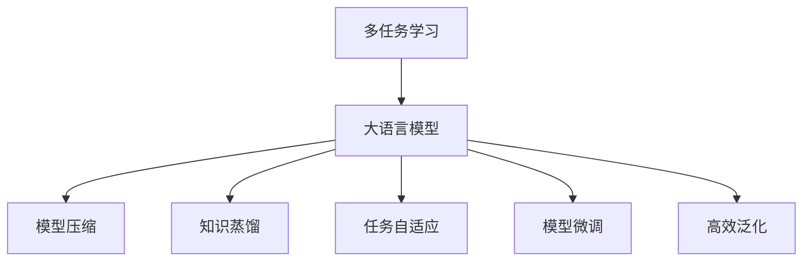
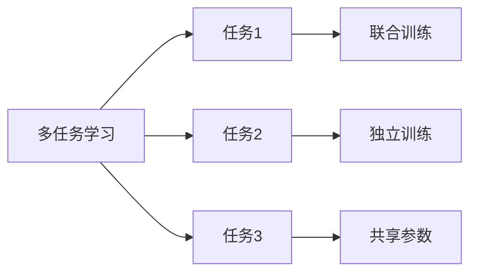
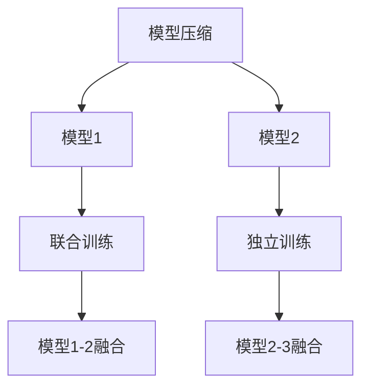
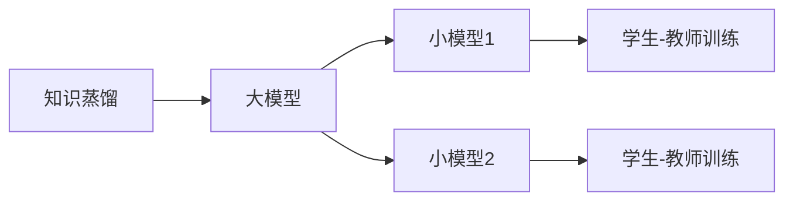
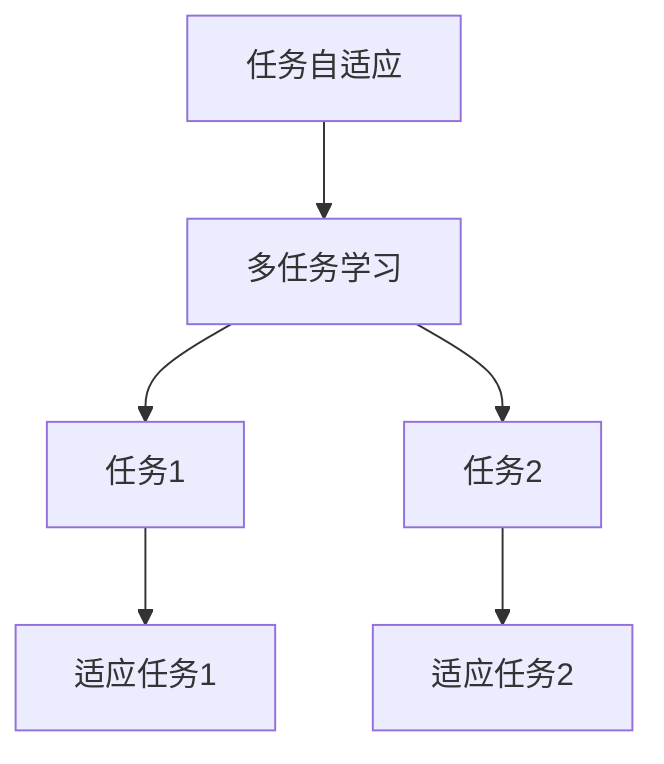
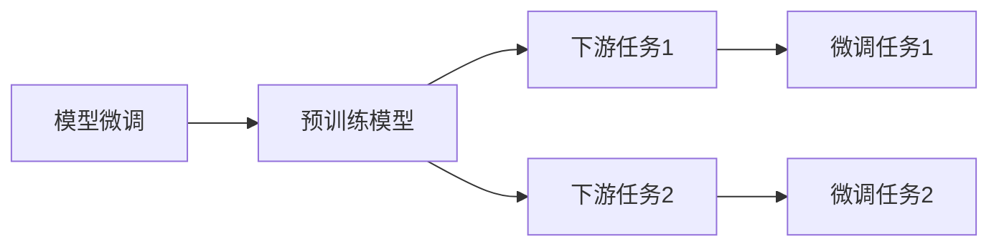
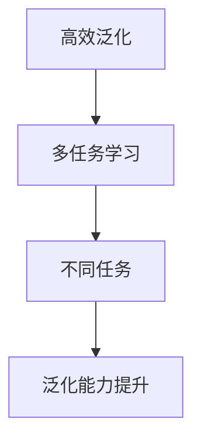
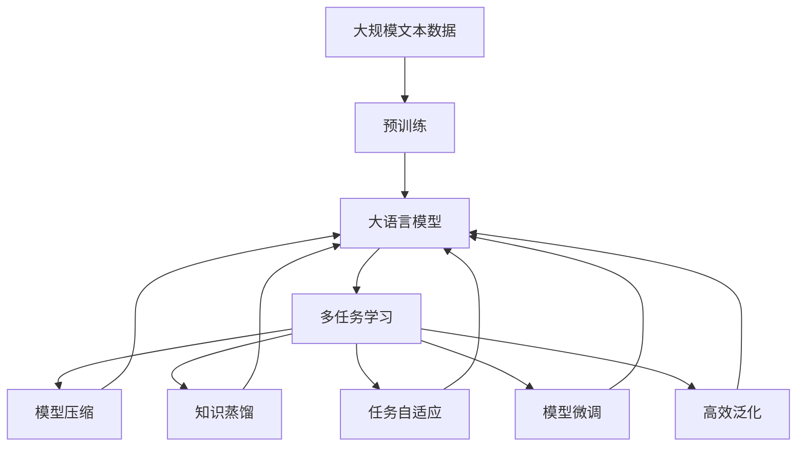

                 

# AI大模型中的多任务学习：一石多鸟

> 关键词：多任务学习(MTL), 大语言模型(LLMs), 模型压缩, 知识蒸馏, 任务自适应, 模型微调

## 1. 背景介绍

### 1.1 问题由来
近年来，深度学习技术的快速发展，推动了大模型（如GPT-3、BERT等）在自然语言处理（NLP）、计算机视觉（CV）、语音识别（ASR）等领域取得卓越的性能。这些大模型通过在海量无标签数据上进行预训练，学习到广泛的知识和能力，然后在特定任务上进行微调，可以显著提升模型的表现。然而，单个大模型的应用领域通常较为局限，无法满足复杂多变的现实需求。

多任务学习（MTL）作为一种在多个相关任务上共同优化模型的方法，通过学习多个任务的知识，可以在不增加额外计算成本的情况下提升模型的泛化能力。同时，多任务学习还可以利用不同任务之间的知识迁移，提高模型在不同场景下的适应性。

### 1.2 问题核心关键点
多任务学习在大模型中的应用，可以总结为以下几个关键点：
1. **模型压缩**：通过在多个任务上训练模型，可以在保证性能的同时减小模型规模，降低计算成本。
2. **知识蒸馏**：多任务学习可以利用不同任务之间的知识，提升模型的综合能力。
3. **任务自适应**：多任务学习模型可以自动适应不同任务的特点，避免单一任务的过拟合。
4. **模型微调**：多任务学习可以在特定任务上进行微调，进一步提升模型性能。
5. **高效泛化**：多任务学习模型具有更好的泛化能力，可以在不同场景下快速迁移应用。

### 1.3 问题研究意义
研究大模型中的多任务学习，对于拓展大模型的应用范围，提升模型在复杂多变环境下的性能，加速人工智能技术落地应用具有重要意义：

1. **提升模型性能**：多任务学习可以通过共同训练模型，在多个任务上提升模型的泛化能力。
2. **降低应用成本**：多任务学习模型可以同时处理多个任务，减少单独训练和微调的成本。
3. **促进跨领域迁移**：多任务学习模型可以自动适应不同领域的数据，提高模型的迁移能力。
4. **加速技术创新**：多任务学习促进了对预训练-微调的深入研究，催生了提示学习、零样本学习等新的研究方向。
5. **赋能产业升级**：多任务学习模型可以为各行各业提供通用的智能服务，推动产业升级。

## 2. 核心概念与联系

### 2.1 核心概念概述

为了更好地理解多任务学习在大模型中的应用，本节将介绍几个密切相关的核心概念：

- **多任务学习（MTL）**：指在多个相关任务上共同优化模型，通过学习多个任务的知识提升模型性能。常见的方法包括联合训练、独立训练等。

- **大语言模型（LLMs）**：指以自回归（如GPT）或自编码（如BERT）模型为代表的大规模预训练语言模型。通过在大规模无标签文本语料上进行预训练，学习到丰富的语言知识和常识。

- **模型压缩（Model Compression）**：指在不增加模型复杂度的情况下，减小模型规模、提高推理速度的技术。多任务学习可以同时训练多个任务，提升模型压缩的效果。

- **知识蒸馏（Knowledge Distillation）**：指通过在大模型和小模型之间进行知识转移，提高小模型的性能。多任务学习可以利用不同任务之间的知识，实现知识蒸馏。

- **任务自适应（Task Adaptation）**：指模型能够自动适应不同任务的特点，避免在特定任务上的过拟合。多任务学习模型可以通过训练多个相关任务，增强模型的泛化能力。

- **模型微调（Fine-Tuning）**：指在预训练模型的基础上，使用下游任务的少量标注数据，通过有监督地训练优化模型在该任务上的性能。多任务学习模型可以通过微调进一步提升特定任务的效果。

- **高效泛化（Efficient Generalization）**：指模型能够在不同场景下快速迁移应用，提升模型的泛化能力。多任务学习模型可以通过学习多个任务的知识，提高泛化能力。

这些核心概念之间的逻辑关系可以通过以下Mermaid流程图来展示：



这个流程图展示了大模型中的多任务学习的核心概念及其之间的关系：

1. 大模型通过预训练获得基础能力。
2. 多任务学习通过在多个相关任务上共同训练，提升模型的泛化能力和性能。
3. 模型压缩可以通过多任务学习减小模型规模，提高推理速度。
4. 知识蒸馏可以利用多任务学习实现不同任务之间的知识转移。
5. 任务自适应可以通过多任务学习自动适应不同任务的特点。
6. 模型微调可以在特定任务上进行微调，进一步提升模型效果。
7. 高效泛化可以通过多任务学习提高模型在不同场景下的适应性。

### 2.2 概念间的关系

这些核心概念之间存在着紧密的联系，形成了多任务学习在大模型中的应用框架。下面我通过几个Mermaid流程图来展示这些概念之间的关系。

#### 2.2.1 多任务学习的基本原理



这个流程图展示了多任务学习的基本原理，即在多个任务上共同训练模型，提升模型在不同任务上的性能。

#### 2.2.2 模型压缩与多任务学习的结合



这个流程图展示了模型压缩与多任务学习的结合方式，即通过多任务学习同时训练多个模型，然后通过融合技术将它们合并，减小模型规模，提高推理速度。

#### 2.2.3 知识蒸馏与多任务学习的联系



这个流程图展示了知识蒸馏与多任务学习的联系，即通过在大模型和小模型之间进行知识转移，提升小模型的性能。

#### 2.2.4 任务自适应与多任务学习的协同



这个流程图展示了任务自适应与多任务学习的协同工作方式，即通过多任务学习模型自动适应不同任务的特点。

#### 2.2.5 模型微调与多任务学习的互补



这个流程图展示了模型微调与多任务学习的互补关系，即通过多任务学习提升模型基础能力，然后通过微调进一步优化特定任务的效果。

#### 2.2.6 高效泛化与多任务学习的关联



这个流程图展示了高效泛化与多任务学习的关联关系，即通过多任务学习提升模型在不同场景下的适应性。

### 2.3 核心概念的整体架构

最后，我们用一个综合的流程图来展示这些核心概念在大模型多任务学习中的应用：



这个综合流程图展示了从预训练到多任务学习，再到高效泛化的完整过程。大模型首先在大规模文本数据上进行预训练，然后通过多任务学习共同训练模型，减小模型规模，提高推理速度，实现知识蒸馏。同时，多任务学习模型可以自动适应不同任务的特点，通过模型微调进一步提升特定任务的效果，最终提高模型在不同场景下的适应性。

## 3. 核心算法原理 & 具体操作步骤
### 3.1 算法原理概述

多任务学习在大模型中的应用，其核心思想是：将预训练大模型视作一个强大的“特征提取器”，通过在多个相关任务上共同训练模型，学习多个任务的知识，提升模型在不同任务上的性能。

形式化地，假设预训练模型为 $M_{\theta}$，其中 $\theta$ 为预训练得到的模型参数。给定 $N$ 个相关任务 $T=\{T_1, T_2, \ldots, T_N\}$ 的训练数据集 $D=\{(x_i, y_i^t)\}_{i=1}^N, x_i \in \mathcal{X}, y_i^t \in \mathcal{Y}_t$，多任务学习的优化目标是最小化联合损失函数，即：

$$
\min_{\theta} \sum_{t=1}^N \mathcal{L}^t(M_{\theta}(x_i),y_i^t)
$$

其中 $\mathcal{L}^t$ 为第 $t$ 个任务的损失函数，用于衡量模型预测输出与真实标签之间的差异。常见的损失函数包括交叉熵损失、均方误差损失等。

通过梯度下降等优化算法，多任务学习过程不断更新模型参数 $\theta$，最小化联合损失函数，使得模型输出逼近真实标签。由于 $\theta$ 已经通过预训练获得了较好的初始化，因此即便在多个任务上训练，也能较快收敛到理想的模型参数 $\hat{\theta}$。

### 3.2 算法步骤详解

多任务学习在大模型中的应用一般包括以下几个关键步骤：

**Step 1: 准备预训练模型和数据集**
- 选择合适的预训练语言模型 $M_{\theta}$ 作为初始化参数，如 BERT、GPT 等。
- 准备多个相关任务的标注数据集 $D=\{(x_i, y_i^t)\}_{i=1}^N, x_i \in \mathcal{X}, y_i^t \in \mathcal{Y}_t$，划分为训练集、验证集和测试集。

**Step 2: 设计任务适配层**
- 根据任务类型，在预训练模型顶层设计合适的输出层和损失函数。
- 对于分类任务，通常在顶层添加线性分类器和交叉熵损失函数。
- 对于生成任务，通常使用语言模型的解码器输出概率分布，并以负对数似然为损失函数。

**Step 3: 设置多任务超参数**
- 选择合适的优化算法及其参数，如 AdamW、SGD 等，设置学习率、批大小、迭代轮数等。
- 设置正则化技术及强度，包括权重衰减、Dropout、Early Stopping等。
- 确定冻结预训练参数的策略，如仅微调顶层，或全部参数都参与多任务训练。

**Step 4: 执行联合训练**
- 将训练集数据分批次输入模型，前向传播计算损失函数。
- 反向传播计算参数梯度，根据设定的优化算法和学习率更新模型参数。
- 周期性在验证集上评估模型性能，根据性能指标决定是否触发 Early Stopping。
- 重复上述步骤直到满足预设的迭代轮数或 Early Stopping 条件。

**Step 5: 测试和部署**
- 在测试集上评估多任务学习后的模型 $M_{\hat{\theta}}$ 的性能，对比多任务前后的精度提升。
- 使用多任务学习后的模型对新样本进行推理预测，集成到实际的应用系统中。
- 持续收集新的数据，定期重新多任务学习模型，以适应数据分布的变化。

以上是多任务学习在大模型中的应用的一般流程。在实际应用中，还需要针对具体任务的特点，对多任务过程的各个环节进行优化设计，如改进训练目标函数，引入更多的正则化技术，搜索最优的超参数组合等，以进一步提升模型性能。

### 3.3 算法优缺点

多任务学习在大模型中的应用具有以下优点：
1. **资源利用率高**。多个任务共享同一个模型，避免了单独训练和微调所需的计算资源和时间成本。
2. **泛化能力强**。多任务学习模型能够利用不同任务之间的知识，提升模型的泛化能力和迁移能力。
3. **模型压缩效果显著**。多任务学习可以同时训练多个任务，减小模型规模，提高推理速度。
4. **任务自适应性好**。多任务学习模型可以自动适应不同任务的特点，避免在特定任务上的过拟合。
5. **模型微调效率高**。多任务学习可以在特定任务上进行微调，进一步提升模型效果。

同时，多任务学习在大模型中也存在一些局限性：
1. **任务间耦合复杂**。多任务学习需要处理不同任务之间的耦合关系，增加了模型设计的复杂度。
2. **优化问题复杂**。多任务学习需要最小化联合损失函数，优化问题更加复杂。
3. **参数冗余**。多任务学习模型可能包含冗余参数，增加了模型的复杂度。
4. **任务平衡**。多任务学习需要平衡不同任务之间的训练数据量，避免某一任务的过拟合。
5. **模型解释性差**。多任务学习模型通常是一个黑盒，难以解释其内部工作机制和决策逻辑。

尽管存在这些局限性，但就目前而言，多任务学习仍然是大模型应用的重要范式之一。未来相关研究的重点在于如何进一步降低任务间的耦合复杂度，提高多任务学习的效率和效果。

### 3.4 算法应用领域

多任务学习在大模型中的应用已经涵盖了多个领域，包括但不限于：

- **文本分类**：如情感分析、主题分类、意图识别等。通过多任务学习提升模型的泛化能力和性能。
- **命名实体识别**：识别文本中的人名、地名、机构名等特定实体。多任务学习可以同时训练命名实体识别和词性标注任务，提升模型的效果。
- **关系抽取**：从文本中抽取实体之间的语义关系。多任务学习可以利用关系抽取任务提升模型的知识抽取能力。
- **问答系统**：对自然语言问题给出答案。多任务学习可以同时训练问答系统和机器翻译系统，提升模型的综合能力。
- **机器翻译**：将源语言文本翻译成目标语言。多任务学习可以同时训练机器翻译和文本摘要任务，提升模型的泛化能力。
- **文本摘要**：将长文本压缩成简短摘要。多任务学习可以同时训练摘要生成和文本分类任务，提升模型的效果。
- **对话系统**：使机器能够与人自然对话。多任务学习可以同时训练对话系统和情感分析任务，提升模型的交互能力。

除了上述这些经典任务外，多任务学习在大模型中的应用还在不断拓展，为NLP技术带来了更多的创新和突破。

## 4. 数学模型和公式 & 详细讲解  
### 4.1 数学模型构建

本节将使用数学语言对多任务学习在大模型中的应用进行更加严格的刻画。

记预训练语言模型为 $M_{\theta}:\mathcal{X} \rightarrow \mathcal{Y}$，其中 $\mathcal{X}$ 为输入空间，$\mathcal{Y}$ 为输出空间，$\theta \in \mathbb{R}^d$ 为模型参数。假设多任务学习涉及 $N$ 个相关任务，任务 $t$ 的训练集为 $D^t=\{(x_i^t,y_i^t)\}_{i=1}^N, x_i^t \in \mathcal{X}, y_i^t \in \mathcal{Y}_t$。

定义模型 $M_{\theta}$ 在数据样本 $(x,y^t)$ 上的损失函数为 $\ell^t(M_{\theta}(x),y^t)$，则在数据集 $D^t$ 上的经验风险为：

$$
\mathcal{L}^t(\theta) = \frac{1}{N}\sum_{i=1}^N \ell^t(M_{\theta}(x_i^t),y_i^t)
$$

多任务学习的优化目标是最小化联合损失函数，即找到最优参数：

$$
\theta^* = \mathop{\arg\min}_{\theta} \sum_{t=1}^N \mathcal{L}^t(\theta)
$$

在实践中，我们通常使用基于梯度的优化算法（如AdamW、SGD等）来近似求解上述最优化问题。设 $\eta$ 为学习率，$\lambda$ 为正则化系数，则参数的更新公式为：

$$
\theta \leftarrow \theta - \eta \nabla_{\theta}\sum_{t=1}^N\mathcal{L}^t(\theta) - \eta\lambda\theta
$$

其中 $\nabla_{\theta}\mathcal{L}^t(\theta)$ 为损失函数对参数 $\theta$ 的梯度，可通过反向传播算法高效计算。

### 4.2 公式推导过程

以下我们以二分类任务为例，推导多任务学习中的联合损失函数及其梯度的计算公式。

假设模型 $M_{\theta}$ 在输入 $x$ 上的输出为 $\hat{y}=M_{\theta}(x) \in [0,1]$，表示样本属于正类的概率。真实标签 $y \in \{0,1\}$。则二分类交叉熵损失函数定义为：

$$
\ell^t(M_{\theta}(x),y) = -[y\log \hat{y} + (1-y)\log (1-\hat{y})]
$$

将其代入经验风险公式，得：

$$
\mathcal{L}^t(\theta) = -\frac{1}{N}\sum_{i=1}^N [y_i^t\log M_{\theta}(x_i^t)+(1-y_i^t)\log(1-M_{\theta}(x_i^t))]
$$

根据链式法则，损失函数对参数 $\theta_k$ 的梯度为：

$$
\frac{\partial \mathcal{L}^t(\theta)}{\partial \theta_k} = -\frac{1}{N}\sum_{i=1}^N (\frac{y_i^t}{M_{\theta}(x_i^t)}-\frac{1-y_i^t}{1-M_{\theta}(x_i^t)}) \frac{\partial M_{\theta}(x_i^t)}{\partial \theta_k}
$$

其中 $\frac{\partial M_{\theta}(x_i^t)}{\partial \theta_k}$ 可进一步递归展开，利用自动微分技术完成计算。

在得到损失函数的梯度后，即可带入参数更新公式，完成模型的迭代优化。重复上述过程直至收敛，最终得到适应多个任务的最优模型参数 $\theta^*$。

## 5. 项目实践：代码实例和详细解释说明
### 5.1 开发环境搭建

在进行多任务学习实践前，我们需要准备好开发环境。以下是使用Python进行PyTorch开发的环境配置流程：

1. 安装Anaconda：从官网下载并安装Anaconda，用于创建独立的Python环境。

2. 创建并激活虚拟环境：
```bash
conda create -n pytorch-env python=3.8 
conda activate pytorch-env
```

3. 安装PyTorch：根据CUDA版本，从官网获取对应的安装命令。例如：
```bash
conda install pytorch torchvision torchaudio cudatoolkit=11.1 -c pytorch -c conda-forge
```

4. 安装Transformers库：
```bash
pip install transformers
```

5. 安装各类工具包：
```bash
pip install numpy pandas scikit-learn matplotlib tqdm jupyter notebook ipython
```

完成上述步骤后，即可在`pytorch-env`环境中开始多任务学习实践。

### 5.2 源代码详细实现

下面我们以命名实体识别(NER)和关系抽取(RE)任务为例，给出使用Transformers库对BERT模型进行多任务学习的PyTorch代码实现。

首先，定义多任务数据处理函数：

```python
from transformers import BertTokenizer, BertForTokenClassification, BertForRelationExtraction
from torch.utils.data import Dataset
import torch

class MultiTaskDataset(Dataset):
    def __init__(self, texts, tags, rel_tags, tokenizer, max_len=128):
        self.texts = texts
        self.tags = tags
        self.rel_tags = rel_tags
        self.tokenizer = tokenizer
        self.max_len = max_len
        
    def __len__(self):
        return len(self.texts)
    
    def __getitem__(self, item):
        text = self.texts[item]
        tags = self.tags[item]
        rel_tags = self.rel_tags[item]
        
        encoding = self.tokenizer(text, return_tensors='pt', max_length=self.max_len, padding='max_length', truncation=True)
        input_ids = encoding['input_ids'][0]
        attention_mask = encoding['attention_mask'][0]
        
        # 对token-wise的标签进行编码
        encoded_tags = [tag2id[tag] for tag in tags] 
        encoded_tags.extend([tag2id['O']] * (self.max_len - len(encoded_tags)))
        labels = torch.tensor(encoded_tags, dtype=torch.long)
        
        # 对关系三元组的标签进行编码
        encoded_rel_tags = [rel2id[rel] for rel in rel_tags] 
        encoded_rel_tags.extend([rel2id['O']] * (self.max_len - len(encoded_rel_tags)))
        rel_labels = torch.tensor(encoded_rel_tags, dtype=torch.long)
        
        return {'input_ids': input_ids, 
                'attention_mask': attention_mask,
                'tags': labels,
                'rel_labels': rel_labels}

# 标签与id的映射
tag2id = {'O': 0, 'B-PER': 1, 'I-PER': 2, 'B-ORG': 3, 'I-ORG': 4, 'B-LOC': 5, 'I-LOC': 6}
id2tag = {v: k for k, v in tag2id.items()}
rel2id = {'O': 0, 'PER-PER': 1, 'LOC-LOC': 2, 'ORG-ORG': 3, 'LOC-PER': 4, 'LOC-ORG': 5, 'ORG-PER': 6}
id2rel = {v: k for k, v in rel2id.items()}

# 创建dataset
tokenizer = BertTokenizer.from_pretrained('bert-base-cased')

train_dataset = MultiTaskDataset(train_texts, train_tags, train_rel_tags, tokenizer)
dev_dataset = MultiTaskDataset(dev_texts, dev_tags, dev_rel_tags, tokenizer)
test_dataset = MultiTaskDataset(test_texts, test_tags, test_rel_tags, tokenizer)
```

然后，定义模型和优化器：

```python
from transformers import BertForTokenClassification, BertForRelationExtraction, AdamW

model = BertForTokenClassification.from_pretrained('bert-base-cased', num_labels=len(tag2id))
rel_model = BertForRelationExtraction.from_pretrained('bert-base-cased', num_labels=len(rel2id))

model.add_module('rel_model', rel_model)

optimizer = AdamW(model.parameters(), lr=2e-5)
```

接着，定义训练和评估函数：

```python
from torch.utils.data import DataLoader
from tqdm import tqdm
from sklearn.metrics import classification_report

device = torch.device('cuda') if torch.cuda.is_available() else torch.device('cpu')
model.to(device)

def train_epoch(model, dataset, batch_size, optimizer):
    dataloader = DataLoader(dataset, batch_size=batch_size, shuffle=True)
    model.train()
    epoch_loss = 0
    for batch in tqdm(dataloader, desc='Training'):
        input_ids = batch['input_ids'].to(device)
        attention_mask = batch['attention_mask'].to(device)
        tags = batch['tags'].to(device)
        rel_labels = batch['rel_labels'].to(device)
        model.zero_grad()
        outputs = model(input_ids, attention_mask=attention_mask, labels=tags, relation_labels=rel_labels)
        loss = outputs.loss
        epoch_loss += loss.item()
        loss.backward()
        optimizer.step()
    return epoch_loss / len(dataloader)

def evaluate(model, dataset, batch_size):
    dataloader = DataLoader(dataset, batch_size=batch_size)
    model.eval()
    preds, labels = [], []
    with torch.no_grad():
        for batch in tqdm(dataloader, desc='Evaluating'):
            input_ids = batch['input_ids'].to(device)
            attention_mask = batch['attention_mask'].to(device)
            batch_tags = batch['tags']
            batch_rel_labels = batch['rel_labels']
            outputs = model(input_ids, attention_mask=attention_mask)
            batch_pred_tags = outputs.logits.argmax(dim=2

