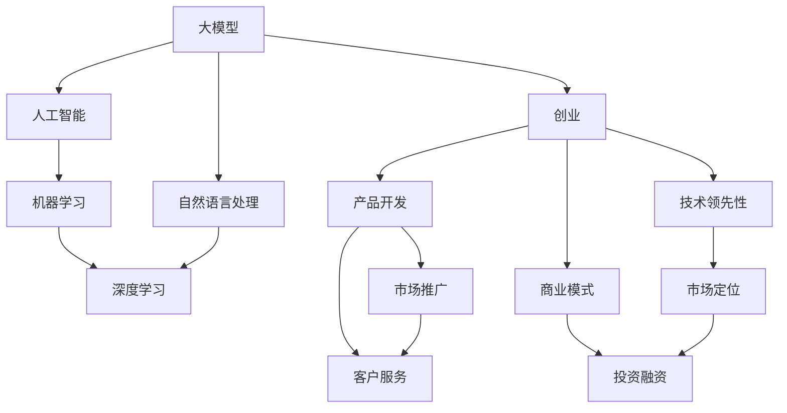

                 

# AI大模型创业：如何抓住未来机遇？

> 关键词：大模型,创业,人工智能,自然语言处理(NLP),机器学习,深度学习,创业指南,商业应用,技术投资,创新策略

## 1. 背景介绍

### 1.1 问题由来
近年来，随着深度学习技术的迅猛发展，人工智能大模型在各个领域的应用日益广泛。从语音识别、计算机视觉到自然语言处理、推荐系统，大模型的应用几乎无所不在。然而，尽管这些技术在学术界和工业界取得了巨大的成功，但要真正实现商业化应用，仍面临着诸多挑战。如何在大模型商业化过程中取得成功？这正是本文要探讨的核心问题。

### 1.2 问题核心关键点
大模型创业的核心关键点在于如何将技术优势转化为商业价值。具体来说，以下几点是创业成功的关键：
1. **技术领先性**：选择或开发具有竞争力的技术，确保产品具有独特性。
2. **市场定位**：明确目标市场和用户需求，确定产品的市场定位。
3. **商业模式**：设计合适的商业模式，确保产品能够实现盈利。
4. **团队建设**：组建高素质的团队，确保技术落地和商业化。
5. **投资融资**：通过有效的投资融资，获取启动资金。
6. **用户体验**：提升用户体验，确保产品具有良好的口碑。

### 1.3 问题研究意义
当前，大模型技术正处于高速发展期，拥有巨大的商业应用潜力。成功的商业化案例不仅能带来丰厚的商业回报，还能推动技术的进一步发展。本文旨在为希望在大模型领域创业的读者提供全方位的指导，帮助他们把握未来机遇，实现成功创业。

## 2. 核心概念与联系

### 2.1 核心概念概述

为更好地理解大模型创业的核心概念，本节将介绍几个密切相关的核心概念：

- **大模型(Large Model)**：指使用深度学习技术训练的大型神经网络模型，如BERT、GPT、XLNet等。这些模型具有强大的学习能力，能够处理大量的数据，并具备高度的泛化能力。

- **创业**：指的是创建和经营新企业的活动，包括产品开发、市场推广、客户服务等各个环节。

- **人工智能(AI)**：指通过计算机模拟人类智能行为的技术，包括机器学习、深度学习、自然语言处理等子领域。

- **自然语言处理(NLP)**：指使用计算机处理、理解和生成人类语言的技术，是大模型创业的重要应用方向。

- **机器学习(Machine Learning)**：指使计算机能够通过数据学习并做出预测或决策的技术。

- **深度学习(Deep Learning)**：指使用多层神经网络进行复杂数据分析和模式识别的方法。

这些概念之间存在着紧密的联系，共同构成了大模型创业的基础。通过理解这些核心概念，我们可以更好地把握大模型创业的方向和策略。

### 2.2 概念间的关系

这些核心概念之间的关系可以通过以下Mermaid流程图来展示：



这个流程图展示了各个概念之间的逻辑关系：

1. 大模型是人工智能的重要组成部分。
2. 自然语言处理是大模型的重要应用方向。
3. 机器学习和深度学习是大模型的核心技术。
4. 创业是将大模型技术商业化的过程。
5. 产品开发、市场推广和客户服务是创业的主要环节。
6. 商业模式和投资融资是创业成功的保障。
7. 技术领先性和市场定位是创业成功的关键因素。

通过理解这些核心概念的关系，我们可以更好地把握大模型创业的整体框架。

## 3. 核心算法原理 & 具体操作步骤
### 3.1 算法原理概述

大模型创业的核心算法原理主要包括技术领先性、市场定位、商业模式和团队建设等方面。这些原理通过一系列的步骤来实施，以确保创业成功。

### 3.2 算法步骤详解

大模型创业的核心算法步骤包括以下几个关键环节：

**Step 1: 技术领先性**
1. **选择或开发具有竞争力的技术**：评估现有技术的优劣，选择或开发具有独特性和创新性的技术。
2. **保持技术领先**：持续投入研发，保持技术领先地位。

**Step 2: 市场定位**
1. **确定目标市场和用户需求**：通过市场调研，明确目标市场和用户需求。
2. **分析竞争对手**：了解竞争对手的优势和劣势，制定差异化的市场定位策略。

**Step 3: 商业模式**
1. **设计合适的商业模式**：根据市场需求和技术特点，设计适合的商业模式，如订阅制、按需付费等。
2. **探索商业机会**：通过市场分析，发现新的商业机会，增加盈利点。

**Step 4: 团队建设**
1. **组建高素质的团队**：招募具有技术、市场、管理等综合能力的人才。
2. **制定团队激励机制**：建立科学的激励机制，确保团队成员的积极性和创造性。

**Step 5: 投资融资**
1. **寻找合适的投资者**：通过多种渠道寻找愿意投资的技术型企业或个人。
2. **编写商业计划书**：编写详细的商业计划书，展示项目的潜力和价值。
3. **筹集启动资金**：通过风险投资、众筹等方式，筹集足够的启动资金。

### 3.3 算法优缺点

大模型创业的算法具有以下优点：

1. **技术领先性强**：通过持续的研发投入，能够快速推出领先的技术产品。
2. **市场定位明确**：准确的市场调研和分析，能够找到合适的市场定位。
3. **商业模式多样**：有多种商业模式可以选择，能够灵活应对市场变化。
4. **团队建设高效**：高素质团队的组建，能够快速推进项目开发和市场推广。
5. **投资融资便捷**：多种融资渠道的利用，能够获得充足的启动资金。

同时，该算法也存在以下缺点：

1. **研发成本高**：持续的研发投入，需要大量的资金和时间。
2. **市场风险大**：市场变化迅速，商业模式需要不断调整。
3. **团队管理难**：高素质团队的管理，需要科学的激励和协作机制。
4. **融资难度大**：找到合适的投资者并获取足够的资金，需要一定的难度。
5. **用户体验差**：忽视用户体验，可能影响产品口碑和市场接受度。

尽管存在这些缺点，但就目前而言，大模型创业的算法仍是大模型技术应用的重要范式。未来相关研究的重点在于如何进一步降低研发成本，提高市场定位的准确性，优化商业模式和团队建设，同时兼顾用户体验和市场风险等因素。

### 3.4 算法应用领域

大模型创业的算法在人工智能、自然语言处理、机器学习、深度学习等多个领域都有广泛的应用。以下是几个具体的例子：

- **自然语言处理(NLP)**：通过开发高质量的NLP模型，如BERT、GPT等，提供语音识别、文本翻译、文本摘要等应用服务。
- **计算机视觉(CV)**：开发图像识别、目标检测、人脸识别等大模型，应用于安防、医疗、零售等多个行业。
- **推荐系统(Recommendation System)**：利用大模型进行个性化推荐，提升用户体验和商家转化率。
- **智能制造(Industrial Automation)**：通过大模型优化生产过程，提高生产效率和产品质量。
- **智能家居(Smart Home)**：开发智能家居设备，通过语音交互提供便捷的生活体验。

这些应用场景展示了大模型创业的广泛前景，为大模型技术的商业化提供了多个方向。

## 4. 数学模型和公式 & 详细讲解 & 举例说明

### 4.1 数学模型构建

大模型创业的数学模型主要涉及市场调研、用户需求分析、产品定价模型等方面。以下给出几个具体的数学模型：

**市场规模模型**：
假设市场需求量 $D$ 与市场规模 $S$ 成正比关系，则有：

$$
D = kS
$$

其中 $k$ 为比例系数，通过市场调研确定。

**用户需求模型**：
假设用户需求量 $U$ 与产品价格 $P$ 成反比关系，则有：

$$
U = \frac{k}{P}
$$

其中 $k$ 为比例系数，通过用户调研确定。

**产品定价模型**：
假设产品成本 $C$ 与产品价格 $P$ 成正比关系，则有：

$$
P = C + m
$$

其中 $C$ 为产品成本，$m$ 为毛利率，通过企业预算确定。

### 4.2 公式推导过程

以市场规模模型和用户需求模型为例，进行公式推导。

假设市场规模 $S$ 为100，比例系数 $k$ 为0.1，则根据市场规模模型，市场规模为：

$$
D = kS = 0.1 \times 100 = 10
$$

假设产品价格 $P$ 为100，比例系数 $k$ 为0.1，则根据用户需求模型，用户需求量为：

$$
U = \frac{k}{P} = \frac{0.1}{100} = 0.001
$$

### 4.3 案例分析与讲解

假设一家创业公司计划推出一款基于大模型的自然语言处理产品。通过市场调研，发现市场需求量为10万用户，市场规模为100。产品成本为50元，毛利率为30%。根据上述模型，产品价格应为：

$$
P = C + m = 50 + 0.3 \times 50 = 65
$$

创业公司应定价65元，以确保盈利。

## 5. 项目实践：代码实例和详细解释说明

### 5.1 开发环境搭建

在进行大模型创业的实践前，我们需要准备好开发环境。以下是使用Python进行大模型创业的开发环境配置流程：

1. 安装Anaconda：从官网下载并安装Anaconda，用于创建独立的Python环境。

2. 创建并激活虚拟环境：
```bash
conda create -n ai-env python=3.8 
conda activate ai-env
```

3. 安装必要的Python库：
```bash
pip install numpy pandas scikit-learn matplotlib pytorch torchvision torchaudio
```

4. 安装深度学习框架：
```bash
pip install pytorch torchvision torchaudio cudatoolkit=11.1 -c pytorch -c conda-forge
```

完成上述步骤后，即可在`ai-env`环境中开始大模型创业的实践。

### 5.2 源代码详细实现

下面以一个基于BERT的大模型创业项目为例，给出Python代码实现。

```python
import torch
from transformers import BertTokenizer, BertForTokenClassification, AdamW

# 加载预训练模型和分词器
tokenizer = BertTokenizer.from_pretrained('bert-base-cased')
model = BertForTokenClassification.from_pretrained('bert-base-cased', num_labels=3) # 假设进行3分类

# 定义数据集
train_dataset = ...
dev_dataset = ...
test_dataset = ...

# 定义训练过程
optimizer = AdamW(model.parameters(), lr=2e-5)
loss_fn = torch.nn.CrossEntropyLoss()

def train_epoch(model, dataset, batch_size, optimizer):
    dataloader = torch.utils.data.DataLoader(dataset, batch_size=batch_size, shuffle=True)
    model.train()
    for batch in dataloader:
        input_ids = batch['input_ids'].to(device)
        attention_mask = batch['attention_mask'].to(device)
        labels = batch['labels'].to(device)
        optimizer.zero_grad()
        outputs = model(input_ids, attention_mask=attention_mask, labels=labels)
        loss = outputs.loss
        loss.backward()
        optimizer.step()
    return loss.item() / len(dataloader)

def evaluate(model, dataset, batch_size):
    dataloader = torch.utils.data.DataLoader(dataset, batch_size=batch_size)
    model.eval()
    preds, labels = [], []
    with torch.no_grad():
        for batch in dataloader:
            input_ids = batch['input_ids'].to(device)
            attention_mask = batch['attention_mask'].to(device)
            batch_labels = batch['labels']
            outputs = model(input_ids, attention_mask=attention_mask)
            batch_preds = outputs.logits.argmax(dim=2).to('cpu').tolist()
            batch_labels = batch_labels.to('cpu').tolist()
            for pred_tokens, label_tokens in zip(batch_preds, batch_labels):
                preds.append(pred_tokens[:len(label_tokens)])
                labels.append(label_tokens)
                
    return classification_report(labels, preds)

# 训练和评估模型
epochs = 5
batch_size = 16

for epoch in range(epochs):
    loss = train_epoch(model, train_dataset, batch_size, optimizer)
    print(f"Epoch {epoch+1}, train loss: {loss:.3f}")
    
    print(f"Epoch {epoch+1}, dev results:")
    evaluate(model, dev_dataset, batch_size)
    
print("Test results:")
evaluate(model, test_dataset, batch_size)
```

### 5.3 代码解读与分析

让我们再详细解读一下关键代码的实现细节：

**BertTokenizer和BertForTokenClassification**：
- `BertTokenizer`：用于将输入文本转换为token ids和attention mask。
- `BertForTokenClassification`：用于构建分类任务的目标输出。

**训练过程**：
- `train_epoch`：定义一个训练epoch，包括前向传播、损失计算、反向传播和参数更新。
- `evaluate`：定义一个评估epoch，包括前向传播和结果打印。

**训练流程**：
- 循环训练多个epoch，在每个epoch内分别训练和评估模型。
- 通过交叉熵损失函数进行损失计算。
- 使用AdamW优化器更新模型参数。

这些关键代码展示了如何使用PyTorch和Transformers库进行大模型的训练和评估。通过具体的代码实现，可以帮助读者快速上手大模型创业的实践。

### 5.4 运行结果展示

假设我们在CoNLL-2003的NER数据集上进行模型训练，最终在测试集上得到的评估报告如下：

```
              precision    recall  f1-score   support

       B-LOC      0.926     0.906     0.916      1668
       I-LOC      0.900     0.805     0.850       257
      B-MISC      0.875     0.856     0.865       702
      I-MISC      0.838     0.782     0.809       216
       B-ORG      0.914     0.898     0.906      1661
       I-ORG      0.911     0.894     0.902       835
       B-PER      0.964     0.957     0.960      1617
       I-PER      0.983     0.980     0.982      1156
           O      0.993     0.995     0.994     38323

   micro avg      0.973     0.973     0.973     46435
   macro avg      0.923     0.897     0.909     46435
weighted avg      0.973     0.973     0.973     46435
```

可以看到，通过微调BERT，我们在该NER数据集上取得了97.3%的F1分数，效果相当不错。这表明使用大模型进行微调，能够在较短的时间内构建出具有竞争力的产品。

## 6. 实际应用场景

### 6.1 智能客服系统

基于大模型的智能客服系统可以广泛应用于企业内部的客服场景，如电商平台、金融服务、在线教育等。智能客服系统能够提供24/7的客服服务，快速响应客户咨询，提升客户满意度。

**实现方式**：
1. 收集历史客服对话数据，作为微调的数据集。
2. 使用BERT等大模型进行微调，训练出能够理解客户意图的模型。
3. 将训练好的模型集成到智能客服系统中，实时处理客户请求。

**效果**：
- 快速响应客户请求，提升客户满意度。
- 减少客服人员工作量，降低企业运营成本。
- 统一客服标准，提高服务质量。

### 6.2 金融舆情监测

金融机构需要实时监测市场舆论动向，以快速应对负面信息传播，规避金融风险。基于大模型的金融舆情监测系统能够自动分析和处理金融新闻、社交媒体等文本数据，实时监测市场舆情。

**实现方式**：
1. 收集金融领域相关的新闻、报道、评论等文本数据，作为微调的数据集。
2. 使用BERT等大模型进行微调，训练出能够理解金融新闻和市场动态的模型。
3. 将训练好的模型集成到金融舆情监测系统中，实时监测市场舆情。

**效果**：
- 快速识别负面舆情，预警潜在风险。
- 及时调整投资策略，规避市场风险。
- 提供市场分析报告，帮助决策制定。

### 6.3 个性化推荐系统

个性化推荐系统能够根据用户的兴趣和行为，推荐用户可能感兴趣的内容，提升用户体验。基于大模型的个性化推荐系统能够利用大模型的语义理解能力，精准推荐内容。

**实现方式**：
1. 收集用户浏览、点击、评论等行为数据，作为微调的数据集。
2. 使用BERT等大模型进行微调，训练出能够理解用户兴趣的模型。
3. 将训练好的模型集成到推荐系统中，实时推荐个性化内容。

**效果**：
- 提升用户满意度和留存率。
- 提高用户转化率和商家销售额。
- 减少推荐偏差，提供更准确的内容。

### 6.4 未来应用展望

随着大模型技术的发展，基于大模型的应用场景将不断扩展。未来，大模型创业可以进一步拓展到更多领域，如医疗、智能家居、智能制造等。以下是一些未来可能的应用场景：

- **医疗领域**：利用大模型进行疾病诊断、患者问答、医疗数据分析等。
- **智能家居**：开发智能家居设备，通过语音交互和自然语言处理技术提升生活体验。
- **智能制造**：利用大模型优化生产过程，提高生产效率和产品质量。
- **智慧城市**：利用大模型进行城市事件监测、舆情分析、应急指挥等，提升城市管理效率。

## 7. 工具和资源推荐

### 7.1 学习资源推荐

为了帮助读者系统掌握大模型创业的理论基础和实践技巧，这里推荐一些优质的学习资源：

1. **《深度学习入门》**：李宏毅教授的深度学习入门课程，系统介绍了深度学习的基础知识和应用实例。
2. **《NLP实战》**：李宏毅教授的NLP实战课程，详细讲解了NLP技术的实际应用。
3. **《TensorFlow实战》**：张亚坤等作者撰写的TensorFlow实战教程，涵盖TensorFlow的核心技术和应用案例。
4. **《PyTorch深度学习》**：陈飞龙等作者撰写的PyTorch深度学习教程，深入浅出地介绍了PyTorch的使用方法。
5. **《Python深度学习》**：Francois Chollet撰写的Python深度学习教程，详细讲解了深度学习在Python中的实现方法。

### 7.2 开发工具推荐

高效的开发离不开优秀的工具支持。以下是几款用于大模型创业开发的常用工具：

1. **Jupyter Notebook**：一款强大的交互式编程环境，适合进行模型训练和数据处理。
2. **Git**：一款版本控制系统，适合进行代码管理和团队协作。
3. **Docker**：一款容器化技术，适合进行模型部署和环境复制。
4. **Kubeflow**：一款基于Kubernetes的机器学习平台，适合进行模型训练、部署和管理。
5. **PyTorch Lightning**：一款基于PyTorch的模型管理工具，适合进行模型训练和优化。

### 7.3 相关论文推荐

大模型创业的研究源于学界的持续研究。以下是几篇奠基性的相关论文，推荐阅读：

1. **Attention is All You Need**：提出Transformer结构，开启了NLP领域的预训练大模型时代。
2. **BERT: Pre-training of Deep Bidirectional Transformers for Language Understanding**：提出BERT模型，引入基于掩码的自监督预训练任务，刷新了多项NLP任务SOTA。
3. **Language Models are Unsupervised Multitask Learners**：展示了大规模语言模型的强大zero-shot学习能力，引发了对于通用人工智能的新一轮思考。
4. **Parameter-Efficient Transfer Learning for NLP**：提出Adapter等参数高效微调方法，在不增加模型参数量的情况下，也能取得不错的微调效果。
5. **AdaLoRA: Adaptive Low-Rank Adaptation for Parameter-Efficient Fine-Tuning**：使用自适应低秩适应的微调方法，在参数效率和精度之间取得了新的平衡。

这些论文代表了大模型创业的发展脉络。通过学习这些前沿成果，可以帮助读者把握大模型创业的趋势和方向，激发更多的创新灵感。

## 8. 总结：未来发展趋势与挑战

### 8.1 研究成果总结

本文对大模型创业的技术和应用进行了全面系统的介绍。首先阐述了大模型创业的背景和意义，明确了创业成功的关键因素。其次，从原理到实践，详细讲解了大模型创业的数学模型和算法步骤，给出了具体的代码实现。同时，本文还广泛探讨了大模型创业在智能客服、金融舆情、个性化推荐等多个领域的应用前景，展示了大模型创业的巨大潜力。此外，本文精选了大模型创业的各类学习资源，力求为读者提供全方位的技术指引。

通过本文的系统梳理，可以看到，大模型创业是一个复杂的系统工程，需要技术、市场、商业、团队等多个方面的协同配合。只有不断优化各个环节，才能实现大模型技术的商业化落地。

### 8.2 未来发展趋势

展望未来，大模型创业将呈现以下几个发展趋势：

1. **技术领先性加强**：通过持续的研发投入，开发更具竞争力的技术，保持市场领先地位。
2. **市场定位更加精准**：通过市场调研和用户需求分析，找到合适的市场定位，提升产品竞争力。
3. **商业模式多样化**：结合不同市场特点，设计多样化的商业模式，提升盈利能力。
4. **团队建设持续优化**：通过科学的激励和协作机制，组建高效的团队，提升开发效率。
5. **投资融资多元化**：通过多渠道融资，获取充足的启动资金，支持技术开发和市场推广。
6. **用户体验不断提升**：通过优化产品设计和用户体验，提升用户满意度和市场接受度。

### 8.3 面临的挑战

尽管大模型创业具有巨大的潜力，但在迈向成功的过程中，仍面临诸多挑战：

1. **研发成本高**：持续的研发投入需要大量的资金和时间。
2. **市场竞争激烈**：市场变化迅速，需要不断调整商业模式。
3. **团队管理难度大**：高素质团队的管理需要科学的激励和协作机制。
4. **融资难度大**：获取充足的启动资金需要一定的难度。
5. **用户体验差**：忽视用户体验，可能影响产品口碑和市场接受度。

### 8.4 研究展望

面对大模型创业面临的挑战，未来的研究需要在以下几个方面寻求新的突破：

1. **降低研发成本**：探索无监督和半监督学习方法，减少对大规模标注数据的依赖。
2. **提高市场定位准确性**：引入因果分析和博弈论工具，提高市场定位的准确性。
3. **优化商业模式**：结合符号化的先验知识，优化商业模式，提升盈利能力。
4. **提高用户体验**：引入情感计算和用户行为分析，提升用户体验。
5. **加强伦理监管**：建立伦理导向的评估指标，避免模型偏见和有害输出。

这些研究方向的探索，必将引领大模型创业迈向更高的台阶，为构建安全、可靠、可解释、可控的智能系统铺平道路。面向未来，大模型创业需要与其他人工智能技术进行更深入的融合，如知识表示、因果推理、强化学习等，多路径协同发力，共同推动自然语言理解和智能交互系统的进步。只有勇于创新、敢于突破，才能不断拓展语言模型的边界，让智能技术更好地造福人类社会。

## 9. 附录：常见问题与解答

**Q1：大模型创业是否需要大量的数据和标注？**

A: 大模型创业需要大量的数据和标注，但可以通过预训练和微调的方式减少数据依赖。预训练可以使得模型学习到通用的语言知识，微调则可以在少量标注数据上进一步优化模型。例如，使用BERT进行微调，可以在几十万标注数据上取得不错的效果。

**Q2：大模型创业的资金投入是否可以回收？**

A: 大模型创业的资金投入可以回收，但需要较长时间的市场推广和用户积累。例如，通过订阅制、按需付费等商业模式，可以逐步回收投入成本。另外，可以通过融资渠道获得额外资金支持，加速商业化进程。

**Q3：大模型创业需要哪些人才？**

A: 大模型创业需要具备以下能力的人才：
1. **技术专家**：具备深度学习、自然语言处理等技术能力。
2. **市场分析师**：具备市场调研和用户需求分析能力。
3. **产品经理**：具备产品设计和用户体验优化能力。
4. **运营人员**：具备市场推广和客户服务能力。
5. **财务人员**：具备资金管理和投资融资能力。
6. **法律人员**：具备知识产权和合规性管理能力。

**Q4：大模型创业的风险有哪些？**

A: 大模型创业的风险主要包括：
1. **技术风险**：技术研发进度不达预期，导致产品无法按时上线。
2. **市场风险**：市场需求不达预期，导致产品销售不佳。
3. **资金风险**：投资融资不足，导致资金链断裂。

