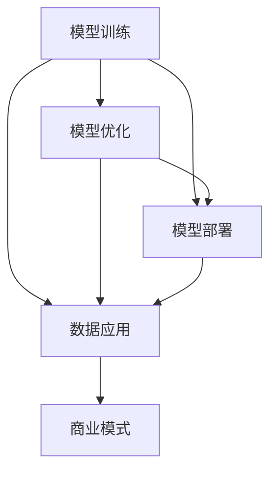

                 

# AI大模型创业：如何抓住未来机遇？

> 关键词：
1. AI大模型
2. 创业机会
3. 技术趋势
4. 商业模式
5. 市场策略
6. 数据应用
7. 风险防范

## 1. 背景介绍

### 1.1 人工智能的兴起与挑战

随着人工智能技术的飞速发展，AI大模型已成为科技创新的重要驱动力。AI大模型如GPT-3、BERT等，通过深度学习技术，在自然语言处理、计算机视觉、推荐系统等多个领域展现出了强大的能力。然而，尽管大模型的性能令人瞩目，但其应用面临诸如数据隐私、算法透明性、偏见和伦理等多个挑战。如何在这些挑战中脱颖而出，抓住AI大模型的创业机遇？本文将从多个维度进行深入探讨。

### 1.2 AI大模型的定义与特性

AI大模型是指那些规模庞大、参数众多的深度学习模型，如BERT、GPT-3等。这些模型通过在海量数据上进行的自监督预训练，能够捕捉到复杂的语言或视觉特征，从而在各种NLP和计算机视觉任务上取得了前所未有的性能。它们的特性包括：

1. **预训练能力**：在大量的无标签数据上进行自监督预训练，学习到通用特征。
2. **通用性与适应性**：能够适应多种下游任务，只需微调或小改动即可。
3. **高效性**：在推理速度和模型压缩方面有较大优化空间。
4. **可扩展性**：可以应用在大规模数据上，通过分布式训练进行扩展。
5. **灵活性**：通过灵活的接口设计，可以方便地集成到各类应用场景中。

### 1.3 AI大模型创业的必要性

AI大模型的创业成为一种必然趋势，原因如下：

1. **市场规模巨大**：AI大模型在智能客服、金融科技、智能制造、智慧城市等领域的应用需求不断增加。
2. **技术壁垒较高**：AI大模型的研发需要深厚的数学、计算机科学和领域知识。
3. **应用前景广阔**：AI大模型不仅可以在企业内部使用，还可以提供云服务，为第三方企业提供智能解决方案。
4. **创新驱动力**：AI大模型为开发者提供了更高效、更灵活的创新平台，催生出更多新的应用场景和商业模式。

## 2. 核心概念与联系

### 2.1 核心概念概述

AI大模型的创业涉及众多关键概念，包括模型训练、部署、优化、应用等多个方面。本文将详细介绍这些核心概念及其相互关系。

- **模型训练**：通过深度学习算法在大规模数据上训练大模型，学习其特征表示。
- **模型优化**：通过微调、剪枝、量化等技术优化模型，提升推理速度和精度。
- **模型部署**：将训练好的模型部署到服务器或云端，供应用系统调用。
- **数据应用**：从数据采集、清洗、标注到数据增强，数据是大模型训练和应用的核心。
- **商业模式**：包括SaaS、PaaS、产品即服务等多种方式。

### 2.2 概念间的关系

AI大模型的创业是一个多层次、多维度、多要素协同的系统工程。各概念之间的关系通过以下Mermaid流程图展示：



这个流程图展示了AI大模型创业的基本流程：从数据应用开始，通过模型训练和优化，最终部署到应用中，形成完整的商业生态。

## 3. 核心算法原理 & 具体操作步骤

### 3.1 算法原理概述

AI大模型创业的核心在于如何构建和优化大模型，使其能够适应不同场景的需求。这涉及以下几个关键算法原理：

- **自监督预训练**：在大规模无标签数据上进行预训练，学习通用特征。
- **微调**：在特定任务数据集上进行有监督训练，适应新任务。
- **剪枝和量化**：优化模型结构，减少计算资源消耗。
- **模型集成**：通过模型融合，提升系统鲁棒性和精度。

### 3.2 算法步骤详解

AI大模型的创业具体操作步骤如下：

1. **需求分析**：明确应用场景和具体需求，选择适合的AI大模型。
2. **数据准备**：收集、清洗、标注数据，确保数据集质量。
3. **模型选择与训练**：选择合适的大模型，在数据集上进行训练。
4. **模型优化**：通过微调、剪枝、量化等技术提升模型性能。
5. **模型部署与集成**：将优化后的模型部署到应用环境中，并集成到各类应用系统。
6. **业务上线与运营**：上线应用，进行持续优化和迭代。

### 3.3 算法优缺点

AI大模型创业的优势包括：

- **高效性**：利用现有的大模型，减少了从零开始开发的时间和经济成本。
- **通用性**：大模型能够适应多种任务，减少任务定制的复杂性。
- **可扩展性**：通过分布式训练，模型可以在大规模数据上不断提升。

然而，大模型也存在以下缺点：

- **数据依赖**：模型效果很大程度上取决于数据质量。
- **计算资源需求高**：训练和推理需要大量的计算资源。
- **透明度不足**：模型的决策过程难以解释。
- **偏见与伦理问题**：模型可能存在偏见，导致伦理问题。

### 3.4 算法应用领域

AI大模型的创业应用广泛，涵盖以下多个领域：

- **智能客服**：利用大模型进行智能对话，提高客户服务效率和质量。
- **金融科技**：通过大模型进行欺诈检测、信用评分、市场预测等。
- **医疗健康**：进行病历分析、智能诊断、药物研发等。
- **智慧城市**：在交通管理、公共安全、环境监测等方面提供智能解决方案。
- **教育培训**：辅助个性化教学、自动评分、学习路径推荐等。
- **工业制造**：用于设备预测维护、质量控制、生产优化等。

## 4. 数学模型和公式 & 详细讲解  
### 4.1 数学模型构建

AI大模型的创业涉及众多数学模型，以BERT为例，其核心模型结构为Transformer。

设输入为 $x$，输出为 $y$，BERT的数学模型可以表示为：

$$
y = M_\theta(x)
$$

其中 $M_\theta$ 为模型参数，$\theta$ 为模型权重。模型训练的目标是使损失函数最小化，常用的损失函数包括交叉熵损失和均方误差损失。

### 4.2 公式推导过程

假设有一个二分类任务，模型预测为 $y$，真实标签为 $y^*$，损失函数为交叉熵损失：

$$
L(y, y^*) = -(y^* \log y + (1 - y^*) \log(1 - y))
$$

通过反向传播算法，计算梯度并进行参数更新，公式如下：

$$
\theta \leftarrow \theta - \eta \frac{\partial L(y, y^*)}{\partial \theta}
$$

其中 $\eta$ 为学习率。

### 4.3 案例分析与讲解

以情感分析任务为例，假设有一个文本 $x$，标签 $y$ 为正向或负向。使用BERT模型，将其输入进行预训练和微调。通过交叉熵损失函数，对模型进行优化，最终得到预测结果 $y$。

## 5. 项目实践：代码实例和详细解释说明

### 5.1 开发环境搭建

1. **环境配置**：安装Python、TensorFlow、PyTorch等工具，配置GPU/TPU。
2. **数据准备**：收集、清洗、标注数据，分为训练集、验证集和测试集。
3. **模型选择**：选择BERT、GPT等模型，并进行微调。
4. **模型训练**：在数据集上进行模型训练，优化模型参数。
5. **模型评估**：在测试集上进行模型评估，调整超参数。
6. **模型部署**：将训练好的模型部署到服务器或云端。

### 5.2 源代码详细实现

以下是一个简单的AI大模型创业代码实例：

```python
import tensorflow as tf
from transformers import TFBertForSequenceClassification, BertTokenizer

# 准备数据
train_data = ...
val_data = ...
test_data = ...

# 模型选择与训练
model = TFBertForSequenceClassification.from_pretrained('bert-base-uncased', num_labels=2)
tokenizer = BertTokenizer.from_pretrained('bert-base-uncased')
train_dataset = ...
val_dataset = ...
test_dataset = ...

# 模型训练与优化
model.compile(optimizer=tf.keras.optimizers.Adam(learning_rate=2e-5),
              loss=tf.keras.losses.SparseCategoricalCrossentropy(from_logits=True),
              metrics=['accuracy'])
history = model.fit(train_dataset, epochs=5, validation_data=val_dataset)

# 模型评估与部署
model.evaluate(test_dataset)
model.save('model.h5')

# 模型部署
app = Flask(__name__)
@app.route('/')
def predict():
    # 数据预处理
    input_data = ...
    encoded_input = tokenizer.encode(input_data, add_special_tokens=True)
    input_ids = tf.convert_to_tensor(encoded_input)
    inputs = tf.expand_dims(input_ids, 0)
    outputs = model(inputs)
    predictions = tf.argmax(outputs[0], axis=-1)
    return predictions.numpy()

if __name__ == '__main__':
    app.run(debug=True)
```

### 5.3 代码解读与分析

代码中，我们使用了TensorFlow和BERT模型进行情感分析任务的微调。首先，准备数据集，选择合适的模型，然后进行模型训练与优化。最后，模型评估与部署，并将部署到服务器上供应用调用。

## 6. 实际应用场景

### 6.1 智能客服

智能客服系统通过大模型进行智能对话，显著提高了客户服务效率。具体应用场景包括：

1. **智能问答**：客户提出问题，系统自动匹配答案，并提供相关推荐。
2. **情绪分析**：通过分析客户的情绪状态，提供个性化服务。
3. **多语言支持**：支持多语言输入输出，提高国际化服务能力。

### 6.2 金融科技

金融科技领域通过大模型进行风险评估、欺诈检测、信用评分等任务。具体应用场景包括：

1. **信用评分**：通过分析客户的信用记录和行为，提供综合信用评分。
2. **欺诈检测**：通过分析交易行为，识别潜在的欺诈行为。
3. **市场预测**：通过分析市场数据，进行股票、基金等投资预测。

### 6.3 医疗健康

医疗健康领域通过大模型进行疾病诊断、病历分析、药物研发等任务。具体应用场景包括：

1. **疾病诊断**：通过分析病人的症状和病历，提供初步诊断结果。
2. **病历分析**：通过分析病人的病历数据，提供治疗建议。
3. **药物研发**：通过分析化合物数据，加速新药研发进程。

### 6.4 智慧城市

智慧城市领域通过大模型进行交通管理、公共安全、环境监测等任务。具体应用场景包括：

1. **交通管理**：通过分析交通数据，优化交通流量。
2. **公共安全**：通过分析监控视频，识别异常行为。
3. **环境监测**：通过分析气象数据，预测天气变化。

## 7. 工具和资源推荐

### 7.1 学习资源推荐

1. **《深度学习》书籍**：李航教授的深度学习经典教材，涵盖深度学习的基本原理和应用。
2. **Coursera《深度学习专项课程》**：由斯坦福大学Andrew Ng教授主讲，涵盖深度学习的基础和应用。
3. **Kaggle**：数据科学竞赛平台，提供大量数据集和算法竞赛，提高实战能力。
4. **GitHub**：代码托管平台，提供丰富的开源项目和社区支持。
5. **Google Colab**：免费的在线Jupyter Notebook环境，方便进行深度学习实验。

### 7.2 开发工具推荐

1. **TensorFlow**：Google开源的深度学习框架，支持GPU/TPU加速。
2. **PyTorch**：Facebook开源的深度学习框架，灵活性高，适合研究和实验。
3. **Jupyter Notebook**：交互式编程工具，方便进行数据分析和模型训练。
4. **TensorBoard**：可视化工具，展示模型训练过程中的各项指标。
5. **Hugging Face Transformers**：预训练语言模型的开源库，提供丰富的预训练模型和微调方法。

### 7.3 相关论文推荐

1. **《BERT: Pre-training of Deep Bidirectional Transformers for Language Understanding》**：BERT模型及其预训练方法。
2. **《Attention is All You Need》**：Transformer模型的原理和应用。
3. **《GPT-3: Language Models are Unsupervised Multitask Learners》**：GPT-3模型及其自监督训练方法。
4. **《Parameter-Efficient Transfer Learning for NLP》**：参数高效微调方法。
5. **《AdaLoRA: Adaptive Low-Rank Adaptation for Parameter-Efficient Fine-Tuning》**：自适应低秩适应的微调方法。

## 8. 总结：未来发展趋势与挑战

### 8.1 研究成果总结

AI大模型创业在过去几年中取得了显著进展，特别是在自然语言处理、计算机视觉等领域。模型的性能不断提升，应用场景越来越广泛。

### 8.2 未来发展趋势

1. **多模态融合**：将视觉、语音等多模态数据与自然语言处理技术结合，提升系统的综合能力。
2. **联邦学习**：通过分布式训练，保护数据隐私，提升模型的泛化能力。
3. **自监督学习**：通过无监督学习，减少对标注数据的依赖。
4. **可解释性**：提升模型的可解释性，提高系统的透明度和可信度。
5. **伦理与安全性**：在模型开发中引入伦理和安全性考量，确保模型的公平性和可靠性。

### 8.3 面临的挑战

1. **数据隐私保护**：保护用户数据隐私，避免数据泄露和滥用。
2. **模型偏见与公平性**：避免模型偏见，确保系统公平性。
3. **计算资源成本**：大模型的训练和推理需要大量计算资源，成本较高。
4. **模型解释与透明性**：提升模型的可解释性，确保模型的透明性。
5. **用户体验**：提升用户的使用体验，确保系统易用性和友好性。

### 8.4 研究展望

1. **自监督预训练**：通过自监督学习，提升模型的通用性和泛化能力。
2. **参数高效微调**：在固定大部分预训练参数的情况下，只更新少量参数，提高微调效率。
3. **多任务学习**：通过多任务学习，提升模型的任务适应能力。
4. **混合模型**：结合传统机器学习算法和深度学习模型，提升系统的综合能力。
5. **在线学习**：通过在线学习，实现模型的实时更新和优化。

## 9. 附录：常见问题与解答

**Q1：如何选择适合的AI大模型？**

A: 根据具体应用场景和需求，选择适合的大模型。对于大规模预训练模型，如BERT、GPT-3等，适合进行多任务微调；对于特定领域模型，如MedBERT、TinyBERT等，适合进行特定任务微调。

**Q2：如何优化AI大模型的性能？**

A: 优化模型性能的关键在于数据预处理、模型训练和模型评估。在数据预处理阶段，需要进行数据清洗、标注、分词等；在模型训练阶段，需要选择适当的优化器和超参数，进行数据增强和正则化；在模型评估阶段，需要选择合适的评估指标和测试集。

**Q3：如何部署AI大模型？**

A: 部署AI大模型需要选择合适的云平台，如AWS、阿里云、腾讯云等，进行模型训练和推理。同时，需要考虑模型的可扩展性和可维护性，进行模型压缩和剪枝，提升模型的推理速度。

**Q4：如何保护AI大模型的数据隐私？**

A: 通过联邦学习、差分隐私等技术，保护用户数据隐私，确保数据不被泄露和滥用。

**Q5：如何应对AI大模型的计算资源成本？**

A: 通过分布式训练、混合精度训练、模型压缩等技术，降低模型的计算资源需求，提高模型的推理速度和效率。

---

作者：禅与计算机程序设计艺术 / Zen and the Art of Computer Programming

