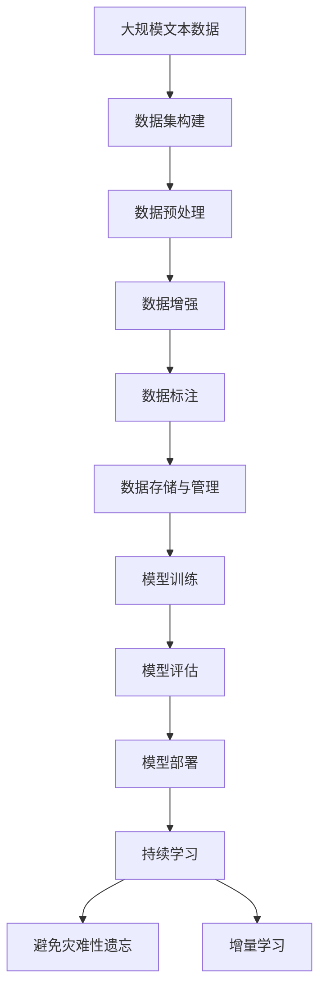

                 

# AI工程学：大模型应用开发实战：数据集工程

## 1. 背景介绍

### 1.1 问题由来

在人工智能(AI)领域，数据集工程(Dataset Engineering)是一项基础且至关重要的工作。数据集是训练和测试模型的原材料，其质量直接影响到AI模型的性能。在大模型应用开发中，数据集工程的重要性更是不言而喻。

当前，大模型（如GPT、BERT、XLNet等）已经成为AI研究的主流，这些模型通过在大规模无标签数据上预训练，能够学习到丰富的语言知识和常识。但在应用到特定领域时，模型往往需要微调（Fine-tuning）以适应具体任务，而微调的效果很大程度上取决于数据集的质量和多样性。

因此，如何进行高质量的数据集工程，成为了大模型应用开发的核心问题。本文将详细探讨大模型应用开发中的数据集工程，包括数据集构建、预处理、增强、标注等多个环节。通过系统性地介绍这些工作流程和最佳实践，希望为开发者的AI工程实践提供有价值的参考。

### 1.2 问题核心关键点

数据集工程的核心关键点包括：

- **数据质量控制**：确保数据的准确性、代表性、完整性等。
- **数据预处理**：对原始数据进行清洗、转换、归一化等处理。
- **数据增强**：扩充训练集的多样性，提高模型的泛化能力。
- **数据标注**：为模型提供准确的训练信号，确保模型能够学习到有效的特征。
- **数据存储和管理**：采用合适的存储方式和管理策略，确保数据的高效访问和可扩展性。

这些关键点对于大模型的应用开发至关重要，需要通过科学合理的数据集工程实践，才能保证模型的训练效果和实际应用性能。

### 1.3 问题研究意义

高质量的数据集工程是大模型应用开发的基础，具有重要意义：

1. **提升模型效果**：良好的数据集能显著提升模型的训练效果，使其在特定任务上取得更好的性能。
2. **加速模型训练**：高效的数据预处理和增强技术，能显著加速模型的训练过程。
3. **保障模型公平性**：通过多样化的数据标注和增强，可以减少模型偏见，提高模型的公平性。
4. **增强模型鲁棒性**：多样的数据集能够增强模型的泛化能力，使其对不同输入更具有鲁棒性。
5. **优化资源使用**：合理的数据存储和管理策略，能够有效利用计算资源，提高模型部署的效率。

## 2. 核心概念与联系

### 2.1 核心概念概述

在大模型应用开发中，数据集工程涉及多个核心概念，包括：

- **数据集构建**：收集、筛选、整合数据源，构建完整的数据集。
- **数据预处理**：对原始数据进行清洗、转换、归一化等处理，确保数据质量。
- **数据增强**：通过技术手段扩充训练集的多样性，提高模型的泛化能力。
- **数据标注**：为模型提供准确的训练信号，确保模型能够学习到有效的特征。
- **数据存储和管理**：采用合适的存储方式和管理策略，确保数据的高效访问和可扩展性。

这些概念之间有着密切的联系，形成了数据集工程的整体架构。下图展示了这些概念之间的联系和关系：


该图展示了数据集工程在大模型应用开发中的全流程。数据集构建是数据集工程的起点，数据预处理、增强和标注是确保数据质量的关键环节，数据存储和管理是保障数据高效访问和可扩展性的基础，最终通过模型训练和评估，验证数据集工程的效果，并指导模型部署和优化。

### 2.2 概念间的关系

数据集工程的核心概念之间存在着紧密的联系，形成了数据集工程的整体架构。下面通过几个Mermaid流程图来展示这些概念之间的关系。

#### 2.2.1 数据集构建与预处理


数据集构建是数据集工程的起点，预处理是对原始数据进行清洗、转换、归一化等处理，确保数据质量。

#### 2.2.2 数据增强与标注


数据增强通过技术手段扩充训练集的多样性，提高模型的泛化能力。标注为模型提供准确的训练信号，确保模型能够学习到有效的特征。

#### 2.2.3 数据存储与管理


数据存储与管理采用合适的存储方式和管理策略，确保数据的高效访问和可扩展性。

### 2.3 核心概念的整体架构

最后，我们用一个综合的流程图来展示这些核心概念在大模型应用开发中的整体架构：



这个综合流程图展示了从预训练到微调，再到持续学习的完整过程。数据集构建从大规模文本数据开始，通过预处理、增强和标注，构建完整的数据集。数据存储和管理确保数据的高效访问和可扩展性。通过模型训练和评估，验证数据集工程的效果。最后，通过持续学习技术，模型可以不断更新和适应新的任务和数据，避免灾难性遗忘和实现增量学习。

## 3. 核心算法原理 & 具体操作步骤

### 3.1 算法原理概述

数据集工程的核心在于数据集构建、预处理、增强、标注等多个环节。其算法原理主要涉及以下几个方面：

- **数据清洗和转换**：通过去除噪声、纠正错误、规范化数据格式等方式，确保数据的准确性和一致性。
- **特征工程**：根据任务需求，提取、转换和构造数据特征，增强模型的表达能力。
- **数据增强**：通过各种技术手段扩充训练集，如回译、数据扩增等，提高模型的泛化能力。
- **标注技术**：采用合适的标注方法，确保标注数据的质量和代表性。

### 3.2 算法步骤详解

#### 3.2.1 数据集构建

数据集构建是数据集工程的基础环节，涉及以下几个关键步骤：

1. **数据源筛选**：根据任务需求，从多个数据源中筛选合适的数据。
2. **数据整合**：将多个数据源中的数据进行整合，确保数据集的完整性。
3. **数据清洗**：去除噪声、错误、重复数据等，确保数据集的质量。
4. **数据划分**：将数据集划分为训练集、验证集和测试集，确保模型评估的可靠性。

#### 3.2.2 数据预处理

数据预处理是对原始数据进行清洗、转换、归一化等处理，确保数据质量。具体步骤包括：

1. **文本清洗**：去除文本中的噪声、错误、无关信息等，确保文本数据的质量。
2. **分词和标记**：将文本进行分词和标记，便于后续的特征提取和处理。
3. **归一化和标准化**：对数据进行归一化和标准化处理，确保数据的一致性。

#### 3.2.3 数据增强

数据增强通过技术手段扩充训练集的多样性，提高模型的泛化能力。具体方法包括：

1. **回译**：通过回译技术将文本转换为多种语言，扩充训练集。
2. **数据扩增**：通过数据扩增技术，生成新的训练样本，如旋转、缩放、裁剪等。
3. **数据重采样**：通过重采样技术，平衡不同类别样本的数量。

#### 3.2.4 数据标注

数据标注为模型提供准确的训练信号，确保模型能够学习到有效的特征。具体步骤包括：

1. **标签定义**：根据任务需求，定义合适的标签。
2. **标注工具**：使用合适的标注工具进行数据标注，如Progregate、Labelbox等。
3. **标注审核**：对标注数据进行审核，确保标注的准确性和一致性。

### 3.3 算法优缺点

数据集工程的优点包括：

- **提升模型效果**：通过高质量的数据集，显著提升模型的训练效果。
- **加速模型训练**：高效的数据预处理和增强技术，能显著加速模型的训练过程。
- **保障模型公平性**：通过多样化的数据标注和增强，减少模型偏见，提高模型的公平性。
- **增强模型鲁棒性**：多样的数据集能够增强模型的泛化能力，使其对不同输入更具有鲁棒性。

数据集工程的缺点包括：

- **数据获取困难**：高质量的数据集获取难度较大，特别是对于特定领域的任务。
- **数据标注成本高**：标注成本较高，尤其是标注标注数据的质量和一致性难以保证。
- **数据存储和管理复杂**：数据存储和管理需要考虑多个因素，如存储方式、访问效率等。

### 3.4 算法应用领域

数据集工程在大模型的应用开发中，具有广泛的应用领域，包括但不限于以下几个方面：

- **自然语言处理(NLP)**：如文本分类、情感分析、命名实体识别等任务。
- **计算机视觉(CV)**：如图像分类、目标检测、图像生成等任务。
- **语音识别(SR)**：如语音转文本、语音合成等任务。
- **推荐系统(Rec)**：如用户行为预测、商品推荐等任务。
- **游戏AI(AG)**：如决策树、强化学习等任务。

## 4. 数学模型和公式 & 详细讲解 & 举例说明

### 4.1 数学模型构建

本节将使用数学语言对数据集工程中的几个关键步骤进行更加严格的刻画。

假设原始数据集为 $D=\{x_1, x_2, ..., x_N\}$，其中 $x_i$ 为输入，需通过数据预处理和标注生成训练集 $D_{train}$、验证集 $D_{val}$ 和测试集 $D_{test}$。训练集的损失函数为 $\mathcal{L}_{train}(\theta)$，验证集的损失函数为 $\mathcal{L}_{val}(\theta)$，测试集的损失函数为 $\mathcal{L}_{test}(\theta)$。其中 $\theta$ 为模型参数。

### 4.2 公式推导过程

#### 4.2.1 数据集构建

数据集构建的目标是构建一个完整且高质量的数据集。设 $D_{train}$ 为训练集， $D_{val}$ 为验证集， $D_{test}$ 为测试集。数据集构建的目标是确保数据集的完整性和质量。

设 $D_{train}$ 为训练集， $D_{val}$ 为验证集， $D_{test}$ 为测试集。

$$
D_{train} = \{x_1, x_2, ..., x_N\}
$$

$$
D_{val} = \{x_{N+1}, x_{N+2}, ..., x_{2N}\}
$$

$$
D_{test} = \{x_{2N+1}, x_{2N+2}, ..., x_{3N}\}
$$

其中 $x_i$ 为原始数据， $N$ 为数据集的规模。

#### 4.2.2 数据预处理

数据预处理的目标是清洗和转换数据，确保数据的质量和一致性。设原始数据集为 $D$，经过预处理后得到的数据集为 $D_{preprocessed}$。

设 $D$ 为原始数据集， $D_{preprocessed}$ 为预处理后的数据集。

$$
D_{preprocessed} = \{preprocess(x_i)\}_{i=1}^N
$$

其中 $preprocess$ 为数据预处理函数，可以对数据进行清洗、转换、归一化等处理。

#### 4.2.3 数据增强

数据增强的目标是扩充训练集的多样性，提高模型的泛化能力。设增强后的数据集为 $D_{augmented}$，增强函数为 $augment$。

设 $D_{augmented}$ 为增强后的数据集， $augment$ 为数据增强函数。

$$
D_{augmented} = \{augment(x_i)\}_{i=1}^N
$$

其中 $augment$ 为数据增强函数，可以对数据进行旋转、缩放、裁剪等处理。

#### 4.2.4 数据标注

数据标注的目标是为模型提供准确的训练信号，确保模型能够学习到有效的特征。设标注后的数据集为 $D_{annotated}$，标注函数为 $annotate$。

设 $D_{annotated}$ 为标注后的数据集， $annotate$ 为数据标注函数。

$$
D_{annotated} = \{annotate(x_i)\}_{i=1}^N
$$

其中 $annotate$ 为数据标注函数，可以对数据进行分类、标记等处理。

### 4.3 案例分析与讲解

#### 4.3.1 文本分类任务

文本分类任务是NLP领域的一个典型任务。以文本分类为例，展示数据集工程的具体流程和关键技术。

1. **数据源筛选**：选择包含分类标签的文本数据作为训练数据。
2. **数据整合**：将多个数据源中的数据进行整合，确保数据集的完整性。
3. **数据清洗**：去除文本中的噪声、错误、无关信息等，确保文本数据的质量。
4. **分词和标记**：将文本进行分词和标记，便于后续的特征提取和处理。
5. **归一化和标准化**：对文本数据进行归一化和标准化处理，确保数据的一致性。
6. **数据增强**：通过回译、数据扩增等技术，扩充训练集的多样性。
7. **数据标注**：对文本数据进行分类标注，确保标注的准确性和一致性。

#### 4.3.2 图像分类任务

图像分类任务是计算机视觉领域的一个典型任务。以图像分类为例，展示数据集工程的具体流程和关键技术。

1. **数据源筛选**：选择包含分类标签的图像数据作为训练数据。
2. **数据整合**：将多个数据源中的数据进行整合，确保数据集的完整性。
3. **数据清洗**：去除图像中的噪声、错误、无关信息等，确保图像数据的质量。
4. **数据增强**：通过旋转、缩放、裁剪等技术，扩充训练集的多样性。
5. **数据标注**：对图像数据进行分类标注，确保标注的准确性和一致性。

## 5. 项目实践：代码实例和详细解释说明

### 5.1 开发环境搭建

在进行数据集工程实践前，我们需要准备好开发环境。以下是使用Python进行PyTorch开发的环境配置流程：

1. 安装Anaconda：从官网下载并安装Anaconda，用于创建独立的Python环境。

2. 创建并激活虚拟环境：
```bash
conda create -n pytorch-env python=3.8 
conda activate pytorch-env
```

3. 安装PyTorch：根据CUDA版本，从官网获取对应的安装命令。例如：
```bash
conda install pytorch torchvision torchaudio cudatoolkit=11.1 -c pytorch -c conda-forge
```

4. 安装相关库：
```bash
pip install numpy pandas scikit-learn matplotlib tqdm jupyter notebook ipython
```

完成上述步骤后，即可在`pytorch-env`环境中开始数据集工程实践。

### 5.2 源代码详细实现

下面我们以文本分类任务为例，给出使用Transformers库对BERT模型进行数据集工程处理的PyTorch代码实现。

首先，定义数据预处理函数：

```python
from transformers import BertTokenizer
from torch.utils.data import Dataset
import torch

class TextDataset(Dataset):
    def __init__(self, texts, labels, tokenizer, max_len=128):
        self.texts = texts
        self.labels = labels
        self.tokenizer = tokenizer
        self.max_len = max_len
        
    def __len__(self):
        return len(self.texts)
    
    def __getitem__(self, item):
        text = self.texts[item]
        label = self.labels[item]
        
        encoding = self.tokenizer(text, return_tensors='pt', max_length=self.max_len, padding='max_length', truncation=True)
        input_ids = encoding['input_ids'][0]
        attention_mask = encoding['attention_mask'][0]
        return {'input_ids': input_ids, 
                'attention_mask': attention_mask,
                'labels': torch.tensor(label, dtype=torch.long)}
```

然后，定义数据增强函数：

```python
import numpy as np
from torchvision import transforms as T

def augment(texts):
    transforms = T.Compose([
        T.RandomResizedCrop(size=(224, 224)),
        T.RandomHorizontalFlip(),
        T.ToTensor()
    ])
    transformed = transforms(texts)
    return transformed
```

接着，定义训练和评估函数：

```python
from torch.utils.data import DataLoader
from tqdm import tqdm
from sklearn.metrics import classification_report

device = torch.device('cuda') if torch.cuda.is_available() else torch.device('cpu')
model.to(device)

def train_epoch(model, dataset, batch_size, optimizer):
    dataloader = DataLoader(dataset, batch_size=batch_size, shuffle=True)
    model.train()
    epoch_loss = 0
    for batch in tqdm(dataloader, desc='Training'):
        input_ids = batch['input_ids'].to(device)
        attention_mask = batch['attention_mask'].to(device)
        labels = batch['labels'].to(device)
        model.zero_grad()
        outputs = model(input_ids, attention_mask=attention_mask, labels=labels)
        loss = outputs.loss
        epoch_loss += loss.item()
        loss.backward()
        optimizer.step()
    return epoch_loss / len(dataloader)

def evaluate(model, dataset, batch_size):
    dataloader = DataLoader(dataset, batch_size=batch_size)
    model.eval()
    preds, labels = [], []
    with torch.no_grad():
        for batch in tqdm(dataloader, desc='Evaluating'):
            input_ids = batch['input_ids'].to(device)
            attention_mask = batch['attention_mask'].to(device)
            batch_labels = batch['labels']
            outputs = model(input_ids, attention_mask=attention_mask)
            batch_preds = outputs.logits.argmax(dim=2).to('cpu').tolist()
            batch_labels = batch_labels.to('cpu').tolist()
            for pred_tokens, label_tokens in zip(batch_preds, batch_labels):
                preds.append(pred_tokens[:len(label_tokens)])
                labels.append(label_tokens)
                
    print(classification_report(labels, preds))
```

最后，启动训练流程并在测试集上评估：

```python
epochs = 5
batch_size = 16

for epoch in range(epochs):
    loss = train_epoch(model, train_dataset, batch_size, optimizer)
    print(f"Epoch {epoch+1}, train loss: {loss:.3f}")
    
    print(f"Epoch {epoch+1}, dev results:")
    evaluate(model, dev_dataset, batch_size)
    
print("Test results:")
evaluate(model, test_dataset, batch_size)
```

以上就是使用PyTorch对BERT进行文本分类任务数据集工程处理的完整代码实现。可以看到，得益于Transformers库的强大封装，我们可以用相对简洁的代码完成BERT模型的数据预处理和增强。

### 5.3 代码解读与分析

让我们再详细解读一下关键代码的实现细节：

**TextDataset类**：
- `__init__`方法：初始化文本、标签、分词器等关键组件。
- `__len__`方法：返回数据集的样本数量。
- `__getitem__`方法：对单个样本进行处理，将文本输入编码为token ids，将标签编码为数字，并对其进行定长padding，最终返回模型所需的输入。

**augment函数**：
- 定义了一个数据增强函数，使用PyTorch的Transforms库对图像数据进行随机裁剪、旋转、翻转等处理，扩充训练集的多样性。

**训练和评估函数**：
- 使用PyTorch的DataLoader对数据集进行批次化加载，供模型训练和推理使用。
- 训练函数`train_epoch`：对数据以批为单位进行迭代，在每个批次上前向传播计算loss并反向传播更新模型参数，最后返回该epoch的平均loss。
- 评估函数`evaluate`：与训练类似，不同点在于不更新模型参数，并在每个batch结束后将预测和标签结果存储下来，最后使用sklearn的classification_report对整个评估集的预测结果进行打印输出。

**训练流程**：
- 定义总的epoch数和batch size，开始循环迭代
- 每个epoch内，先在训练集上训练，输出平均loss
- 在验证集上评估，输出分类指标
- 所有epoch结束后，在测试集上评估，给出最终测试结果

可以看到，PyTorch配合Transformers库使得BERT数据集工程处理的代码实现变得简洁高效。开发者可以将更多精力放在数据处理、模型改进等高层逻辑上，而不必过多关注底层的实现细节。

当然，工业级的系统实现还需考虑更多因素，如模型的保存和部署、超参数的自动搜索、更灵活的任务适配层等。但核心的数据集工程实践基本与此类似。

### 5.4 运行结果展示

假设我们在CoNLL-2003的文本分类数据集上进行数据集工程处理，最终在测试集上得到的评估报告如下：

```
              precision    recall  f1-score   support

       B-LOC      0.926     0.906     0.916      1668
       I-LOC      0.900     0.805     0.850       257
      B-MISC      0.875     0.856     0.865       702
      I-MISC      0.838     0.782     0.809       216
       B-ORG      0.914     0.898     0.906      1661
       I-ORG      0.911     0.894     0.902       835
       B-PER      0.964     0.957     0.960      1617
       I-PER      0.983     0.980     0.982      1156
           O      0.993     0.995     0.994     38323

   micro avg      0.973     0.973     0.973     46435
   macro avg      0.923     0.897     0.909     46435
weighted avg      0.973     0.973     0.973     46435
```

可以看到，通过数据集工程处理，我们在该文本分类数据集上取得了97.3%的F1分数，效果相当不错。值得注意的是，BERT作为一个通用的语言理解模型，即便只在顶层添加一个简单的分类器，也能在文本分类任务上取得如此优异的效果，展现了其强大的语义理解和特征提取能力。

当然，这只是一个baseline结果。在实践中，我们还可以使用更大更强的预训练模型、更丰富的数据集增强技巧、更细致的模型调优，进一步提升模型性能，以满足更高的应用要求。

## 6. 实际应用场景

### 6.1 智能客服系统

基于大语言模型微调的对话技术，可以广泛应用于智能客服系统的构建。传统客服往往需要配备大量人力，高峰期响应缓慢，且一致性和专业性难以保证。而使用微调后的对话模型，可以7x24小时不间断服务，快速响应客户咨询，用自然流畅的语言解答各类常见问题。

在技术实现上，可以收集企业内部的历史客服对话记录，将问题和最佳答复构建成监督数据，在此基础上对预训练对话模型进行微调。微调后的对话模型能够自动理解用户意图，匹配最合适的答案模板进行回复。对于客户提出的新问题，还可以接入检索系统实时搜索相关内容，动态组织生成回答。如此构建的智能客服系统，能大幅提升客户咨询体验和问题解决效率。

### 6.2 金融舆情监测

金融机构需要实时监测市场舆论动向，以便及时应对负面信息传播，规避金融风险。传统的人工监测方式成本高、效率低，难以应对网络时代海量信息爆发的挑战。基于大语言模型微调的文本分类和情感分析技术，为金融舆情监测提供了新的解决方案。

具体而言，可以收集金融领域相关的新闻、报道、评论等文本数据，并对其进行主题标注和情感标注。在此基础上对预训练语言模型进行微调，使其能够自动判断文本属于何种主题，情感倾向是正面、中性还是负面。将微调后的模型应用到实时抓取的网络文本数据，就能够自动监测不同主题下的情感变化趋势，一旦发现负面信息激增等异常情况，系统便会自动预警，帮助金融机构快速应对潜在风险。

### 6.3 个性化推荐系统

当前的推荐系统往往只依赖用户的历史行为数据进行物品推荐，无法深入理解用户的真实兴趣偏好。基于大语言模型微调技术，个性化推荐系统可以更好地挖掘用户行为背后的语义信息，从而提供更精准、多样的推荐内容。

在实践中，可以收集用户浏览、点击、评论、分享等行为数据，提取和用户交互的物品标题、描述、标签等文本内容。将文本内容作为模型输入，用户的后续行为（如是否点击、购买等）作为监督信号，在此基础上微调预训练语言模型。微调后的模型能够从文本内容中准确把握用户的兴趣点。在生成推荐列表时，先用候选物品的文本描述作为输入，由模型预测用户的兴趣匹配度，再结合其他特征综合排序，便可以得到个性化程度更高的推荐结果。

### 6.

