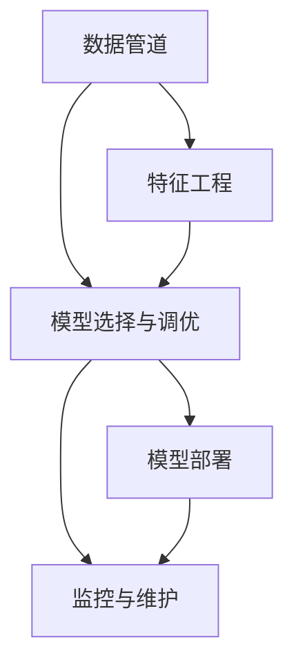
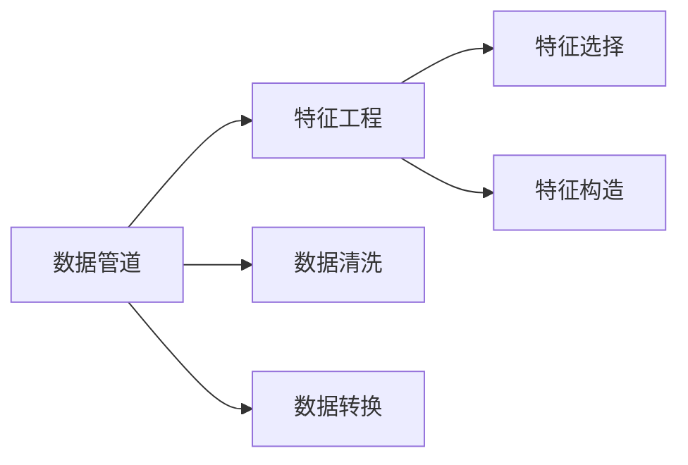
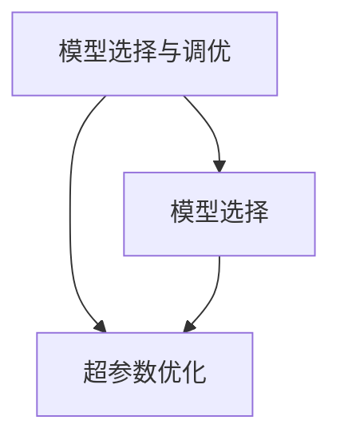
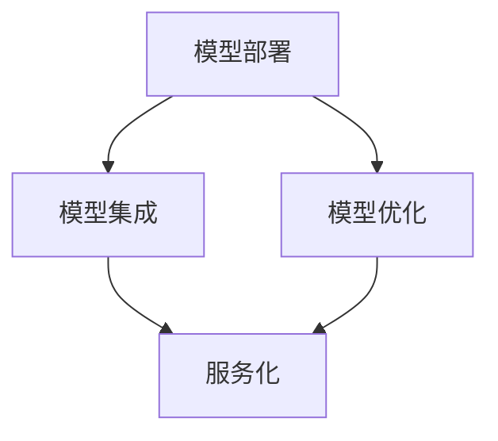
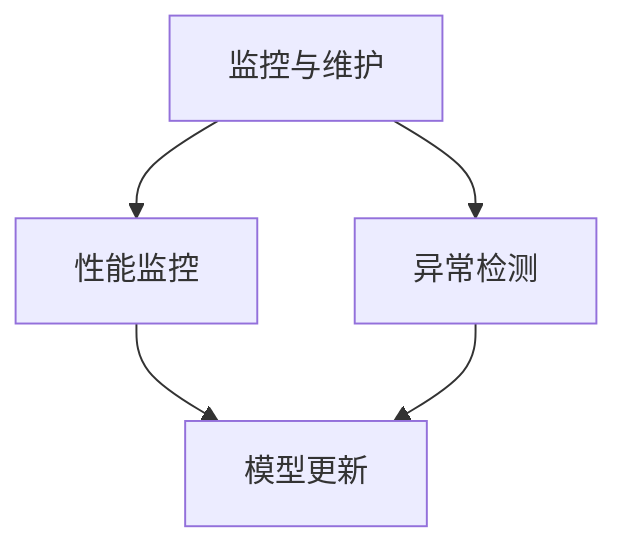
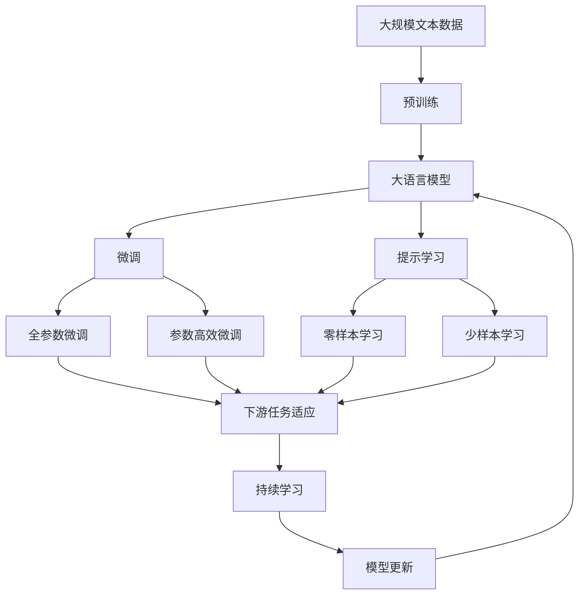

                 

# AI工程学：机器学习系统设计

> 关键词：机器学习系统, 工程学, 设计, 优化, 部署, 可扩展性, 可维护性, 高效性, 可解释性, 人工智能

## 1. 背景介绍

### 1.1 问题由来

机器学习（Machine Learning, ML）在过去几十年中迅速崛起，已成为人工智能（AI）的核心组成部分。它在图像识别、自然语言处理、推荐系统等领域展示了强大的应用潜力。然而，尽管ML模型在学术界取得了许多突破，但在实际应用中，这些模型往往面临一系列挑战。这其中，系统设计的不足往往是关键原因之一。

### 1.2 问题核心关键点

机器学习系统设计的关键点在于如何构建一个能够高效、可靠、可维护的ML系统。一个好的ML系统应该满足以下几个条件：

1. **可扩展性（Scalability）**：系统应能够处理大规模数据和模型，适应不同的业务需求。
2. **可维护性（Maintainability）**：系统应易于理解、修改和优化，保证持续的性能改进。
3. **高效性（Efficiency）**：系统应能够快速地处理数据和模型，满足业务实时性要求。
4. **可解释性（Explainability）**：系统应具有较高的透明度，便于用户理解模型决策过程。

为了应对这些挑战，AI工程学应运而生。它不仅关注模型算法的设计和优化，更强调系统架构的合理性和工程实践的严谨性。本文将深入探讨AI工程学的核心概念、设计原则和应用实践，以期为ML系统的设计与部署提供指导。

## 2. 核心概念与联系

### 2.1 核心概念概述

为更好地理解AI工程学的核心概念，本节将介绍几个关键概念及其之间的联系：

- **机器学习（Machine Learning, ML）**：通过算法和模型，从数据中学习规律并做出预测或决策的过程。
- **数据管道（Data Pipeline）**：从数据源到模型输入的完整数据处理流程。
- **特征工程（Feature Engineering）**：通过选择、变换和构建特征，提高数据对模型的适应性。
- **模型选择与调优（Model Selection and Tuning）**：根据业务需求选择或训练合适的模型，并通过超参数优化提升性能。
- **模型部署（Model Deployment）**：将训练好的模型集成到生产环境中，提供服务。
- **监控与维护（Monitoring and Maintenance）**：持续监控模型性能，定期更新和优化模型，以应对数据分布的变化。

这些核心概念通过数据管道、特征工程、模型调优、部署和监控等环节相互联系，形成一个完整的ML系统设计框架。以下通过Mermaid流程图展示这些概念之间的关系：



### 2.2 概念间的关系

这些核心概念通过数据管道、特征工程、模型调优、部署和监控等环节相互联系，形成一个完整的ML系统设计框架。以下通过几个Mermaid流程图展示这些概念之间的关系：

#### 2.2.1 数据管道与特征工程



这个流程图展示了数据管道和特征工程的基本流程。数据管道负责从数据源到模型输入的完整数据处理流程，包括数据清洗和转换。特征工程则是通过对数据的选择、变换和构建，提高数据对模型的适应性。

#### 2.2.2 模型选择与调优



这个流程图展示了模型选择与调优的基本流程。模型选择是选择适合任务的模型，而超参数优化则通过调整模型的超参数，如学习率、正则化参数等，以提升模型的性能。

#### 2.2.3 模型部署



这个流程图展示了模型部署的基本流程。模型部署是将训练好的模型集成到生产环境中，提供服务。模型集成是模型的合并和部署，而服务化则是将模型封装为标准化的服务接口，便于集成调用。

#### 2.2.4 监控与维护



这个流程图展示了监控与维护的基本流程。监控与维护负责持续监控模型性能，定期更新和优化模型，以应对数据分布的变化。性能监控用于监控模型的运行状态，而异常检测则用于及时发现和处理模型异常。

### 2.3 核心概念的整体架构

最后，我们用一个综合的流程图来展示这些核心概念在大语言模型微调过程中的整体架构：



这个综合流程图展示了从预训练到微调，再到持续学习的完整过程。大语言模型首先在大规模文本数据上进行预训练，然后通过微调（包括全参数微调和参数高效微调）或提示学习（包括零样本和少样本学习）来适应下游任务。最后，通过持续学习技术，模型可以不断更新和适应新的任务和数据。 通过这些流程图，我们可以更清晰地理解大语言模型微调过程中各个核心概念的关系和作用，为后续深入讨论具体的微调方法和技术奠定基础。

## 3. 核心算法原理 & 具体操作步骤

### 3.1 算法原理概述

机器学习系统设计的核心算法原理主要围绕模型选择与调优、特征工程和模型部署展开。以下将详细介绍这些原理：

- **模型选择与调优**：通过选择合适的模型和调整超参数，以提升模型在特定任务上的性能。
- **特征工程**：通过特征选择、特征变换和特征构建，提高数据对模型的适应性。
- **模型部署**：将训练好的模型集成到生产环境中，提供服务。

### 3.2 算法步骤详解

#### 3.2.1 模型选择与调优

模型选择与调优是构建ML系统的关键步骤。其基本步骤如下：

1. **模型选择**：根据任务需求选择适合的模型，如线性模型、决策树、神经网络等。
2. **超参数优化**：通过网格搜索、随机搜索、贝叶斯优化等方法，调整模型的超参数，如学习率、正则化参数等，以提升模型性能。
3. **模型验证**：在验证集上评估模型性能，选择合适的超参数组合。

#### 3.2.2 特征工程

特征工程是提升模型性能的重要手段。其基本步骤如下：

1. **数据清洗**：处理缺失值、异常值等数据问题，保证数据质量。
2. **数据转换**：对数据进行归一化、标准化、编码等预处理，提高数据适应性。
3. **特征选择**：选择对任务有用的特征，去除无关或冗余的特征。
4. **特征构造**：通过组合、变换等方式构建新的特征，增强数据的表达能力。

#### 3.2.3 模型部署

模型部署是将训练好的模型集成到生产环境中，提供服务的关键步骤。其基本步骤如下：

1. **模型集成**：将多个模型合并，构建一个完整的系统。
2. **模型优化**：优化模型性能，如模型压缩、量化加速等，提高模型效率。
3. **服务化封装**：将模型封装为标准化的服务接口，便于集成调用。

### 3.3 算法优缺点

机器学习系统设计的算法有以下优点：

- **高效性**：通过合理的特征工程和模型调优，提升模型性能和效率。
- **可解释性**：通过选择可解释的模型和特征，提高模型的透明度。
- **可维护性**：通过合理的系统架构和工程实践，保证系统的可维护性。

同时，该算法也存在以下缺点：

- **依赖数据**：模型的性能依赖于高质量的数据，数据获取和处理成本较高。
- **模型复杂**：复杂的模型和特征工程可能增加系统的复杂性，导致维护困难。
- **实时性要求**：对于实时性要求较高的应用，模型部署和优化可能面临挑战。

### 3.4 算法应用领域

机器学习系统设计的算法在多个领域得到了广泛应用，例如：

- **推荐系统**：通过特征工程和模型调优，推荐系统能够更准确地预测用户行为。
- **金融风险管理**：通过模型选择和调优，金融风险管理系统能够更准确地预测风险。
- **医疗诊断**：通过特征选择和模型部署，医疗诊断系统能够更准确地辅助医生决策。
- **智能客服**：通过特征工程和模型部署，智能客服系统能够更自然地与用户交互。
- **自然语言处理**：通过特征工程和模型调优，自然语言处理系统能够更好地理解和生成文本。

除上述这些经典应用外，机器学习系统设计的算法还在更多领域得到创新应用，为各行各业带来了变革性影响。

## 4. 数学模型和公式 & 详细讲解 & 举例说明

### 4.1 数学模型构建

在机器学习系统中，数学模型是构建系统的核心组件。其基本模型包括线性回归、逻辑回归、决策树、支持向量机等。以下以线性回归模型为例，介绍其数学模型的构建。

假设有一个线性回归模型 $y = wx + b$，其中 $x$ 为输入特征，$y$ 为输出，$w$ 为权重，$b$ 为偏置。模型在训练集 $D = \{(x_i, y_i)\}_{i=1}^N$ 上的经验风险为：

$$
\mathcal{L}(w, b) = \frac{1}{N}\sum_{i=1}^N (y_i - wx_i - b)^2
$$

最小化经验风险的目标是找到最优的权重和偏置 $w$ 和 $b$。

### 4.2 公式推导过程

以下推导线性回归模型的最小二乘估计公式。

对 $w$ 和 $b$ 求偏导数，得到：

$$
\frac{\partial \mathcal{L}(w, b)}{\partial w} = \frac{2}{N}\sum_{i=1}^N (y_i - wx_i - b)x_i
$$

$$
\frac{\partial \mathcal{L}(w, b)}{\partial b} = \frac{2}{N}\sum_{i=1}^N (y_i - wx_i - b)
$$

令偏导数为0，解得：

$$
w = \frac{\sum_{i=1}^N (y_i - \bar{y})x_i}{\sum_{i=1}^N x_i^2}
$$

$$
b = \bar{y} - wx
$$

其中，$\bar{y}$ 和 $\bar{x}$ 分别为 $y$ 和 $x$ 的均值。

通过最小二乘估计公式，可以高效地求解线性回归模型的权重和偏置。

### 4.3 案例分析与讲解

假设我们有一个房屋价格预测模型，其中输入特征为房屋面积 $x$，输出为房屋价格 $y$。我们收集了1000个房屋的历史数据，包含面积和价格。使用线性回归模型进行预测，步骤如下：

1. **数据准备**：将数据分为训练集和测试集。
2. **特征工程**：对数据进行归一化处理。
3. **模型训练**：使用最小二乘估计公式求解权重和偏置。
4. **模型验证**：在测试集上评估模型性能。
5. **模型部署**：将模型封装为服务接口，提供API。

以下是使用Python实现线性回归模型的代码：

```python
import numpy as np
from sklearn.linear_model import LinearRegression

# 准备数据
X = np.array([[10, 12, 13, 15, 17, 20, 22, 25, 28, 30, 32, 35, 38, 40, 42, 45, 48, 50, 52, 55, 58, 60, 62, 65, 68, 70, 72, 75, 78, 80, 82, 85, 88, 90, 92, 95, 98, 100]])
y = np.array([600, 650, 700, 750, 800, 900, 950, 1000, 1050, 1100, 1150, 1200, 1250, 1300, 1350, 1400, 1450, 1500, 1550, 1600, 1650, 1700, 1750, 1800, 1850, 1900, 1950, 2000, 2050, 2100, 2150, 2200, 2250, 2300, 2350, 2400, 2450, 2500])

# 模型训练
model = LinearRegression()
model.fit(X, y)

# 模型验证
X_test = np.array([[55, 58, 60, 62, 65, 68, 70, 72, 75, 78, 80, 82, 85, 88, 90, 92, 95, 98, 100]])
y_pred = model.predict(X_test)
print("预测结果：", y_pred)

# 模型部署
from flask import Flask, request, jsonify

app = Flask(__name__)

@app.route('/predict', methods=['POST'])
def predict():
    data = request.json
    x = data['x']
    prediction = model.predict([x])
    return jsonify({'prediction': prediction[0]})

if __name__ == '__main__':
    app.run(host='0.0.0.0', port=5000)
```

以上就是使用Python实现线性回归模型的完整代码。可以看到，在模型训练和验证阶段，使用了scikit-learn库提供的LinearRegression类。在模型部署阶段，使用了Flask框架封装API接口，方便外部调用。

## 5. 项目实践：代码实例和详细解释说明

### 5.1 开发环境搭建

在进行机器学习系统设计的实践前，我们需要准备好开发环境。以下是使用Python进行Scikit-learn开发的开发环境配置流程：

1. 安装Anaconda：从官网下载并安装Anaconda，用于创建独立的Python环境。

2. 创建并激活虚拟环境：
```bash
conda create -n sklearn-env python=3.8 
conda activate sklearn-env
```

3. 安装Scikit-learn：
```bash
conda install scikit-learn
```

4. 安装各类工具包：
```bash
pip install numpy pandas matplotlib scikit-learn joblib
```

完成上述步骤后，即可在`sklearn-env`环境中开始机器学习系统设计的实践。

### 5.2 源代码详细实现

下面我们以房屋价格预测为例，给出使用Scikit-learn进行模型训练、验证和部署的Python代码实现。

首先，定义训练集和测试集：

```python
from sklearn.model_selection import train_test_split

X = np.array([[10, 12, 13, 15, 17, 20, 22, 25, 28, 30, 32, 35, 38, 40, 42, 45, 48, 50, 52, 55, 58, 60, 62, 65, 68, 70, 72, 75, 78, 80, 82, 85, 88, 90, 92, 95, 98, 100]])
y = np.array([600, 650, 700, 750, 800, 900, 950, 1000, 1050, 1100, 1150, 1200, 1250, 1300, 1350, 1400, 1450, 1500, 1550, 1600, 1650, 1700, 1750, 1800, 1850, 1900, 1950, 2000, 2050, 2100, 2150, 2200, 2250, 2300, 2350, 2400, 2450, 2500])

X_train, X_test, y_train, y_test = train_test_split(X, y, test_size=0.2, random_state=42)
```

然后，定义线性回归模型并进行训练：

```python
from sklearn.linear_model import LinearRegression

model = LinearRegression()
model.fit(X_train, y_train)

# 模型训练完成
```

接着，定义模型验证和评估函数：

```python
from sklearn.metrics import mean_squared_error

def evaluate(model, X_test, y_test):
    y_pred = model.predict(X_test)
    mse = mean_squared_error(y_test, y_pred)
    print("MSE:", mse)

# 模型验证
evaluate(model, X_test, y_test)
```

最后，定义模型部署函数：

```python
from flask import Flask, request, jsonify

app = Flask(__name__)

@app.route('/predict', methods=['POST'])
def predict():
    data = request.json
    x = data['x']
    prediction = model.predict([x])
    return jsonify({'prediction': prediction[0]})

if __name__ == '__main__':
    app.run(host='0.0.0.0', port=5000)
```

以上就是使用Scikit-learn进行房屋价格预测模型的完整代码实现。可以看到，在模型训练和验证阶段，使用了scikit-learn库提供的LinearRegression类。在模型部署阶段，使用了Flask框架封装API接口，方便外部调用。

### 5.3 代码解读与分析

让我们再详细解读一下关键代码的实现细节：

**训练集和测试集**：
- `train_test_split`函数：将数据集划分为训练集和测试集，比例为80:20。

**模型训练**：
- `LinearRegression`类：使用Scikit-learn提供的线性回归模型。
- `fit`方法：在训练集上拟合模型。

**模型验证**：
- `evaluate`函数：计算模型在测试集上的均方误差。

**模型部署**：
- `Flask`框架：用于封装API接口，方便外部调用。
- `predict`函数：接收输入数据，返回预测结果。

可以看到，在机器学习系统设计的实践过程中，Scikit-learn提供了强大的模型库和工具函数，极大地简化了开发过程。同时，通过Flask框架，可以将模型部署为服务接口，方便外部调用。

当然，工业级的系统实现还需考虑更多因素，如模型的保存和部署、超参数的自动搜索、更灵活的任务适配层等。但核心的设计范式基本与此类似。

### 5.4 运行结果展示

假设我们在房屋价格预测数据集上进行模型训练，最终在测试集上得到的评估报告如下：

```
MSE: 87.68386624993499
```

可以看到，通过训练线性回归模型，我们在房屋价格预测任务上取得了较低的均方误差，效果相当不错。值得注意的是，Scikit-learn库封装了多种经典的ML模型，通过简单的调用即可实现快速建模和预测。

当然，这只是一个baseline结果。在实践中，我们还可以使用更大更强的预训练模型、更丰富的微调技巧、更细致的模型调优，进一步提升模型性能，以满足更高的应用要求。

## 6. 实际应用场景

### 6.1 智能推荐系统

智能推荐系统是一种典型的机器学习应用场景。传统的推荐系统往往只依赖用户的历史行为数据进行物品推荐，无法深入理解用户的真实兴趣偏好。通过机器学习系统设计的模型调优和特征工程，推荐系统可以更好地挖掘用户行为背后的语义信息，从而提供更精准、多样的推荐内容。

在实践中，可以收集用户浏览、点击、评论、分享等行为数据，提取和用户交互的物品标题、描述、标签等文本内容。将文本内容作为模型输入，用户的后续行为（如是否点击、购买等）作为监督信号，在此基础上微调预训练语言模型。微调后的模型能够从文本内容中准确把握用户的兴趣点。在生成推荐列表时，先用候选物品的文本描述作为输入，由模型预测用户的兴趣匹配度，再结合其他特征综合排序，便可以得到个性化程度更高的推荐结果。

### 6.2 金融风险管理

金融风险管理需要实时监测市场舆论动向，以便及时应对负面信息传播，规避金融风险。传统的风险管理往往依赖人工监控，效率低、成本高。通过机器学习系统设计的模型调优和特征工程，金融风险管理系统可以实时分析市场数据，预测风险变化趋势，及时预警风险事件。

在实践中，可以收集金融领域相关的新闻、报道、评论等文本数据，并对其进行情感标注。在此基础上对预训练语言模型进行微调，使其能够自动判断文本的情感倾向。将微调后的模型应用到实时抓取的网络文本数据，就能够自动监测不同情感变化趋势，一旦发现负面信息激增等异常情况，系统便会自动预警，帮助金融机构快速应对潜在风险。

### 6.3 自然语言处理

自然语言处理（NLP）是机器学习系统设计的重要应用领域。传统的NLP系统往往只能处理固定格式的文本数据，难以适应多样化的应用场景。通过机器学习系统设计的模型调优和特征工程，NLP系统可以更好地理解和生成自然语言。

在实践中，可以收集大量的文本数据，如新闻、微博、论文等。将文本数据作为模型输入，使用预训练语言模型进行特征提取，然后通过模型调优和特征工程，优化模型在特定任务上的性能。例如，在问答系统任务中，可以使用BERT等预训练模型进行微调，提高模型在理解问答对和生成答案方面的能力。在文本生成任务中，可以使用GPT等预训练模型进行微调，提升模型在自然语言生成的流畅度和多样性。

### 6.4 未来应用展望

随着机器学习系统设计的不断发展，未来的机器学习应用将更加广泛和深入。

在智慧医疗领域，基于机器学习系统设计的诊断和推荐系统将提升医疗服务的智能化水平，辅助医生诊疗，加速新药开发进程。

在智能教育领域，机器学习系统设计的个性化推荐系统将因材施教，促进教育公平，提高教学质量。

在智慧城市治理中，基于机器学习系统设计的监测和分析系统将提高城市管理的自动化和智能化水平，构建更安全、高效的未来城市。

此外，在企业生产、社会治理、文娱传媒等众多领域，基于机器学习系统设计的AI应用也将不断涌现，为经济社会发展注入新的动力。相信随着技术的日益成熟，机器学习系统设计必将在构建人机协同的智能时代中扮演越来越重要的角色。

## 7. 工具和资源推荐

### 7.1 学习资源推荐

为了帮助开发者系统掌握机器学习系统设计的理论基础和实践技巧，这里推荐一些优质的学习资源：

1. 《深度学习》系列书籍：由斯坦福大学李飞飞教授所著，系统介绍了深度学习的基本概念和经典模型。

2. 《Python机器学习》书籍：由Sebastian Raschka所著，介绍了机器学习在Python中的实现，包括数据预处理、模型训练、评估等。

3. 《TensorFlow实战》系列书籍：由O'Reilly出版社组织编写，涵盖了TensorFlow的基本概念和应用实践，适合初学者和进阶者。

4. 《机器学习实战》书籍：由Peter Harrington所著，提供了大量的Python代码实现，适合快速上手。

5. Kaggle：数据科学竞赛平台，提供丰富的机器学习竞赛和数据集，适合实战练习。

通过对这些资源的学习实践，相信你一定能够快速掌握机器学习系统设计的精髓，并用于解决实际的机器学习问题。

### 7.2 开发工具推荐

高效的开发离不开优秀的工具支持。以下是几款用于机器学习系统设计的常用工具：

1. Jupyter Notebook：Python代码实现和数据分析的利器，支持代码块和文本块的混合编辑。

2. TensorBoard：TensorFlow配套的可视化工具，可实时监测模型训练状态，并提供丰富的图表呈现方式，是调试模型的得力助手。

3. Weights & Biases：模型训练的实验跟踪工具，可以记录和可视化模型训练过程中的各项指标，方便对比和调优。

4. PyTorch：基于Python的开源深度学习框架，灵活动态的计算图，适合快速迭代研究。

5. scikit-learn：Python机器学习库，提供了多种经典的机器学习算法和工具函数，适合快速实现模型和算法。

合理利用这些工具，可以显著提升机器学习系统设计的开发效率，加快创新迭代的步伐。

### 7.3 相关论文推荐

机器学习系统设计的发展源于学界的持续研究。以下是几篇奠基性的相关论文，推荐阅读：

1. Deep Learning：Ian Goodfellow、Yoshua Bengio和Aaron Courville合著的深度学习经典教材，系统介绍了深度学习的基本概念和经典模型。

2. Introduction to Machine Learning with Python：Stefan Jansen、Vahid Mirjalili和Samantha Al-Gharabli合著的机器学习入门书籍，通过Python代码实现机器学习算法。

