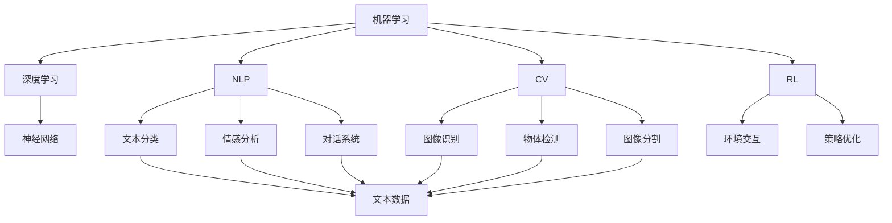
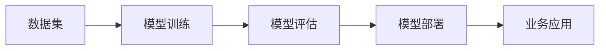
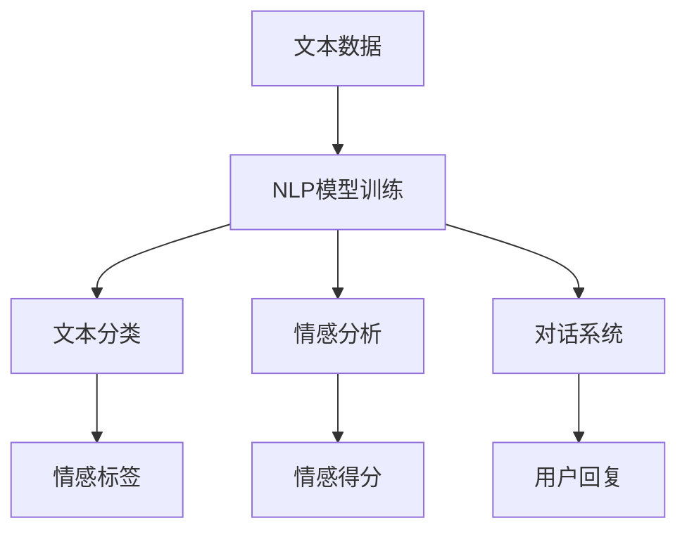
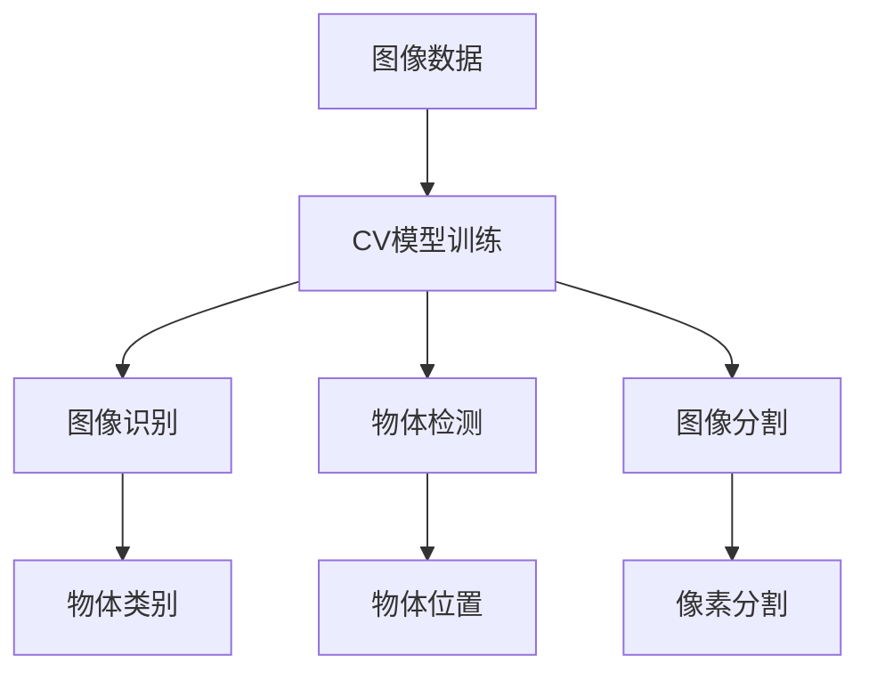
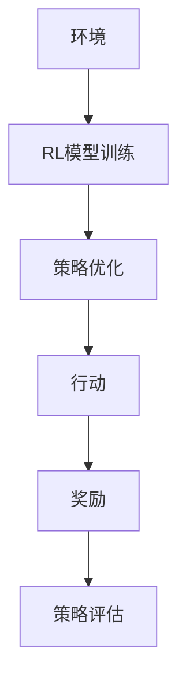

                 

# AI技术在不同场景中的应用

> 关键词：人工智能,机器学习,深度学习,自然语言处理,NLP,计算机视觉,CV,强化学习,RL

## 1. 背景介绍

### 1.1 问题由来
人工智能(AI)技术正在以前所未有的速度改变着人类社会的各个方面。从智能推荐、图像识别，到语音识别、智能驾驶，AI技术在众多领域已经展现出巨大的商业价值和创新潜力。然而，尽管AI技术在许多方面取得了突破性的进展，但其广泛应用和落地仍面临着不少挑战。本文将聚焦于AI技术在不同场景中的应用，探讨其潜力和局限，以及未来发展的趋势和方向。

### 1.2 问题核心关键点
AI技术在各场景中的应用，主要围绕以下几个核心点展开：

- **机器学习**：构建基于数据的模型，使其能够从大量数据中学习，并对未知数据进行预测或分类。
- **深度学习**：一种特殊类型的机器学习，使用多层神经网络模型来处理复杂的数据结构。
- **自然语言处理(NLP)**：使计算机能够理解和生成人类语言的技术，包括文本分类、情感分析、对话系统等。
- **计算机视觉(CV)**：使计算机能够“看”和理解图像和视频的技术，涵盖图像识别、物体检测、图像分割等。
- **强化学习(RL)**：通过试错的方式，让AI系统在特定环境中学习最优策略的技术。

这些技术在大数据和计算资源的支持下，逐渐成为推动产业数字化转型的核心动力。本文将从这些技术的应用实例出发，探讨其在不同场景中的应用和挑战。

## 2. 核心概念与联系

### 2.1 核心概念概述

为更好地理解AI技术在不同场景中的应用，本节将介绍几个密切相关的核心概念：

- **机器学习**：一种通过数据驱动的算法，使计算机系统能够自我学习和适应新数据的技术。
- **深度学习**：使用多层神经网络进行复杂模式识别和预测的机器学习方法。
- **自然语言处理(NLP)**：使计算机能够理解和生成人类语言的技术，涵盖文本分类、情感分析、对话系统等。
- **计算机视觉(CV)**：使计算机能够“看”和理解图像和视频的技术，包括图像识别、物体检测、图像分割等。
- **强化学习(RL)**：通过试错的方式，让AI系统在特定环境中学习最优策略的技术。
- **自动驾驶**：利用AI技术，使汽车等交通工具实现自主导航和驾驶。
- **推荐系统**：根据用户的历史行为数据，推荐可能感兴趣的商品或内容。

这些核心概念之间的逻辑关系可以通过以下Mermaid流程图来展示：



这个流程图展示了大语言模型的核心概念及其之间的关系：

1. 机器学习是大数据背景下，使计算机系统能够自我学习的方法。
2. 深度学习是机器学习的一个分支，使用多层神经网络进行复杂模式识别和预测。
3. NLP、CV和RL分别代表自然语言处理、计算机视觉和强化学习，它们都基于深度学习。
4. 深度学习中的神经网络是这些技术共有的关键组件。
5. NLP、CV和RL各有其特定的应用场景，如文本分类、图像识别和自主驾驶。
6. 推荐系统是AI技术在商业领域的一个重要应用。

通过理解这些核心概念，我们可以更好地把握AI技术的工作原理和优化方向。

### 2.2 概念间的关系

这些核心概念之间存在着紧密的联系，形成了AI技术的应用生态系统。下面我通过几个Mermaid流程图来展示这些概念之间的关系。

#### 2.2.1 AI技术的应用范式



这个流程图展示了AI技术的一般应用流程，即数据集、模型训练、模型评估和模型部署。

#### 2.2.2 AI技术在NLP中的应用



这个流程图展示了NLP技术在文本分类、情感分析、对话系统中的应用。

#### 2.2.3 AI技术在CV中的应用



这个流程图展示了CV技术在图像识别、物体检测、图像分割中的应用。

#### 2.2.4 AI技术在RL中的应用



这个流程图展示了强化学习在环境交互、策略优化中的应用。

## 3. 核心算法原理 & 具体操作步骤
### 3.1 算法原理概述

AI技术在各场景中的应用，涉及多个核心算法原理。以下是对这些算法的详细介绍：

#### 3.1.1 机器学习算法
机器学习算法主要分为监督学习、无监督学习和半监督学习三种类型。

- **监督学习**：使用标注数据进行训练，预测新数据的标签。
- **无监督学习**：使用未标注数据进行训练，发现数据的内在结构和模式。
- **半监督学习**：结合少量标注数据和大量未标注数据进行训练，以提高模型性能。

#### 3.1.2 深度学习算法
深度学习算法主要使用多层神经网络进行特征提取和模式识别。

- **卷积神经网络(CNN)**：用于图像识别、物体检测等任务。
- **循环神经网络(RNN)**：用于序列数据的处理，如自然语言处理中的文本生成、机器翻译等。
- **生成对抗网络(GAN)**：用于生成高质量的图像、音频等。
- **自编码器(AE)**：用于特征压缩和去噪，如自动图像压缩、异常检测等。

#### 3.1.3 自然语言处理算法
NLP算法主要涉及文本数据的处理和分析。

- **词袋模型(BOW)**：将文本表示为词频向量，用于文本分类和情感分析。
- **TF-IDF**：通过计算词频和逆文档频率，对文本进行加权处理。
- **序列模型(RNN, LSTM, GRU)**：用于处理序列数据，如情感分析和机器翻译。
- **Transformer模型**：最新的NLP算法，用于各种文本处理任务，如BERT、GPT等。

#### 3.1.4 计算机视觉算法
CV算法主要涉及图像和视频的处理和分析。

- **特征提取**：使用SIFT、HOG等算法提取图像特征。
- **卷积神经网络(CNN)**：用于图像识别、物体检测等任务。
- **图像分割**：使用FCN、U-Net等算法进行像素级分割。
- **生成对抗网络(GAN)**：用于生成高质量的图像、视频等。

#### 3.1.5 强化学习算法
RL算法主要通过试错的方式，学习最优策略。

- **Q-learning**：用于解决简单环境中的决策问题。
- **策略梯度方法**：用于优化复杂环境中的策略函数。
- **Actor-Critic方法**：结合策略和价值函数，解决更复杂的问题。
- **深度强化学习**：使用深度神经网络进行策略优化。

### 3.2 算法步骤详解

#### 3.2.1 机器学习算法步骤
1. **数据收集和预处理**：收集大量标注数据，并进行清洗、归一化等预处理。
2. **模型选择和设计**：选择适合的机器学习算法，并进行模型设计和调参。
3. **模型训练**：使用训练集对模型进行训练，最小化损失函数。
4. **模型评估和验证**：使用验证集评估模型性能，并进行超参数调整。
5. **模型部署和应用**：将模型部署到实际应用场景中，进行业务处理。

#### 3.2.2 深度学习算法步骤
1. **数据收集和预处理**：收集大量数据，并进行数据增强、归一化等预处理。
2. **模型选择和设计**：选择适合的深度学习架构，如CNN、RNN、Transformer等。
3. **模型训练**：使用训练集对模型进行训练，最小化损失函数。
4. **模型评估和验证**：使用验证集评估模型性能，并进行超参数调整。
5. **模型部署和应用**：将模型部署到实际应用场景中，进行业务处理。

#### 3.2.3 NLP算法步骤
1. **数据收集和预处理**：收集大量文本数据，并进行分词、去噪等预处理。
2. **模型选择和设计**：选择适合的NLP算法，如RNN、LSTM、Transformer等。
3. **模型训练**：使用训练集对模型进行训练，最小化损失函数。
4. **模型评估和验证**：使用验证集评估模型性能，并进行超参数调整。
5. **模型部署和应用**：将模型部署到实际应用场景中，进行业务处理。

#### 3.2.4 CV算法步骤
1. **数据收集和预处理**：收集大量图像数据，并进行图像增强、归一化等预处理。
2. **模型选择和设计**：选择适合的CV算法，如CNN、GAN、FCN等。
3. **模型训练**：使用训练集对模型进行训练，最小化损失函数。
4. **模型评估和验证**：使用验证集评估模型性能，并进行超参数调整。
5. **模型部署和应用**：将模型部署到实际应用场景中，进行业务处理。

#### 3.2.5 RL算法步骤
1. **环境设计**：设计好环境模型和奖励函数。
2. **模型选择和设计**：选择适合的RL算法，如Q-learning、Actor-Critic等。
3. **模型训练**：使用训练集对模型进行训练，最小化损失函数。
4. **模型评估和验证**：使用验证集评估模型性能，并进行超参数调整。
5. **模型部署和应用**：将模型部署到实际应用场景中，进行业务处理。

### 3.3 算法优缺点

#### 3.3.1 机器学习算法优缺点
- **优点**：
  - 能够处理大量标注数据，得到高精度的模型。
  - 算法灵活，适用于多种数据类型。
- **缺点**：
  - 需要大量标注数据，成本较高。
  - 对数据质量要求高，数据偏差可能导致模型性能下降。

#### 3.3.2 深度学习算法优缺点
- **优点**：
  - 能够处理复杂的数据结构，如图像、文本等。
  - 具有很强的特征提取和模式识别能力。
- **缺点**：
  - 需要大量计算资源，训练时间长。
  - 模型复杂，容易出现过拟合。

#### 3.3.3 NLP算法优缺点
- **优点**：
  - 能够处理自然语言数据，具有很强的语义理解能力。
  - 算法灵活，适用于多种文本任务。
- **缺点**：
  - 需要大量标注数据，成本较高。
  - 对数据质量要求高，数据偏差可能导致模型性能下降。

#### 3.3.4 CV算法优缺点
- **优点**：
  - 能够处理图像和视频数据，具有很强的视觉识别能力。
  - 模型高效，推理速度快。
- **缺点**：
  - 需要大量图像数据，成本较高。
  - 对数据质量要求高，数据偏差可能导致模型性能下降。

#### 3.3.5 RL算法优缺点
- **优点**：
  - 能够通过试错学习最优策略，适应性强。
  - 适用于复杂环境下的决策问题。
- **缺点**：
  - 需要大量计算资源，训练时间长。
  - 模型复杂，容易出现过拟合。

### 3.4 算法应用领域

#### 3.4.1 机器学习应用领域
- **金融风控**：利用机器学习算法进行风险评估、信用评分等。
- **医疗诊断**：利用机器学习算法进行疾病诊断、预测等。
- **推荐系统**：利用机器学习算法进行用户兴趣建模，推荐商品或内容。
- **广告投放**：利用机器学习算法进行用户行为分析，优化广告投放策略。

#### 3.4.2 深度学习应用领域
- **图像识别**：使用深度学习算法进行图像分类、物体检测、人脸识别等。
- **自然语言处理**：使用深度学习算法进行文本分类、情感分析、机器翻译等。
- **语音识别**：使用深度学习算法进行语音识别、语音合成等。
- **游戏AI**：使用深度学习算法进行游戏决策、智能控制等。

#### 3.4.3 NLP应用领域
- **文本分类**：利用NLP算法进行文本分类、情感分析等。
- **机器翻译**：利用NLP算法进行文本翻译、语音翻译等。
- **对话系统**：利用NLP算法进行智能对话、客服机器人等。
- **信息检索**：利用NLP算法进行文本检索、知识图谱构建等。

#### 3.4.4 CV应用领域
- **图像识别**：使用CV算法进行图像分类、物体检测、图像分割等。
- **医学影像分析**：使用CV算法进行医学影像分析、病理诊断等。
- **自动驾驶**：使用CV算法进行环境感知、路径规划等。
- **安防监控**：使用CV算法进行行为分析、异常检测等。

#### 3.4.5 RL应用领域
- **游戏AI**：使用RL算法进行游戏决策、智能控制等。
- **机器人控制**：使用RL算法进行机器人路径规划、动作控制等。
- **资源调度**：使用RL算法进行资源分配、调度等。
- **智能推荐**：使用RL算法进行推荐系统优化等。

## 4. 数学模型和公式 & 详细讲解 & 举例说明

### 4.1 数学模型构建

在AI技术的应用中，数学模型扮演着至关重要的角色。本节将通过数学语言对一些关键模型进行详细讲解。

#### 4.1.1 线性回归模型
线性回归模型是最基础的机器学习模型，用于预测连续变量。

$$
y = \beta_0 + \beta_1 x_1 + \beta_2 x_2 + \cdots + \beta_n x_n + \epsilon
$$

其中 $y$ 为预测值，$\beta_i$ 为回归系数，$x_i$ 为自变量，$\epsilon$ 为误差项。

#### 4.1.2 逻辑回归模型
逻辑回归模型用于预测二分类变量。

$$
\ln \frac{P(y=1|x)}{P(y=0|x)} = \beta_0 + \beta_1 x_1 + \beta_2 x_2 + \cdots + \beta_n x_n
$$

其中 $P(y=1|x)$ 为正类概率，$P(y=0|x)$ 为负类概率，$\beta_i$ 为回归系数，$x_i$ 为自变量。

#### 4.1.3 支持向量机(SVM)
支持向量机用于解决分类问题。

$$
\min_{\theta} \frac{1}{2} \sum_{i=1}^N (\theta_i^2) + C \sum_{i=1}^N \max(0, 1 - \theta_i(y_i - \theta_0)) 
$$

其中 $\theta_i$ 为决策边界上的支持向量，$\theta_0$ 为决策边界截距，$C$ 为正则化参数。

#### 4.1.4 卷积神经网络(CNN)
CNN用于图像识别、物体检测等任务。

$$
h_\theta(x) = \max(\theta_1 * \sigma(\theta_2 * \sigma(\theta_3 * x_1 + \theta_4) + \theta_5) + \theta_6)
$$

其中 $h_\theta(x)$ 为输出，$\sigma$ 为激活函数，$\theta_i$ 为卷积核参数。

#### 4.1.5 长短期记忆网络(LSTM)
LSTM用于处理序列数据，如文本生成、机器翻译等。

$$
h_t = \sigma(W_f \cdot [h_{t-1}, x_t] + b_f) \odot \tanh(W_c \cdot [h_{t-1}, x_t] + b_c) \odot \sigma(W_o \cdot [h_{t-1}, x_t] + b_o)
$$

其中 $h_t$ 为状态，$W_i$、$b_i$ 为网络参数，$\odot$ 为元素乘法。

#### 4.1.6 生成对抗网络(GAN)
GAN用于生成高质量的图像、音频等。

$$
G(x) = \begin{cases}
x, & x \sim P_{\text{data}} \\
\mu + \sigma \cdot \epsilon, & \epsilon \sim N(0, I)
\end{cases}
$$

其中 $G(x)$ 为生成器，$\mu$、$\sigma$ 为参数，$x$ 为真实数据。

### 4.2 公式推导过程

以下是对一些关键模型的公式推导过程的详细讲解。

#### 4.2.1 线性回归模型推导
线性回归模型的目标是最小化预测值与真实值之间的平方误差。

$$
\min_{\theta} \sum_{i=1}^N (y_i - \theta_0 - \theta_1 x_{i1} - \theta_2 x_{i2} - \cdots - \theta_n x_{in})^2
$$

通过求解该最小化问题，得到最优的回归系数 $\theta_i$。

#### 4.2.2 逻辑回归模型推导
逻辑回归模型的目标是最小化预测值与真实值之间的交叉熵损失。

$$
\min_{\theta} - \frac{1}{N} \sum_{i=1}^N [y_i \log P(y_i|x) + (1-y_i) \log (1-P(y_i|x))]
$$

通过求解该最小化问题，得到最优的回归系数 $\theta_i$。

#### 4.2.3 支持向量机(SVM)推导
SVM的目标是找到一个最优的超平面，使得所有数据点最大化地远离超平面。

$$
\min_{\theta} \frac{1}{2} \sum_{i=1}^N (\theta_i^2) + C \sum_{i=1}^N \max(0, 1 - \theta_i(y_i - \theta_0))
$$

通过求解该最小化问题，得到最优的决策边界参数 $\theta_i$。

#### 4.2.4 卷积神经网络(CNN)推导
CNN的目标是最小化输出误差。

$$
\min_{\theta} \sum_{i=1}^N ||y_i - h_\theta(x_i)||^2
$$

通过求解该最小化问题，得到最优的卷积核参数 $\theta_i$。

#### 4.2.5 长短期记忆网络(LSTM)推导
LSTM的目标是最小化预测值与真实值之间的误差。

$$
\min_{\theta} \sum_{i=1}^N ||y_i - h_t||^2
$$

通过求解该最小化问题，得到最优的状态参数 $\theta_i$。

#### 4.2.6 生成对抗网络(GAN)推导
GAN的目标是生成与真实数据无法区分的虚假数据。

$$
\min_{G} \max_{D} \frac{1}{N} \sum_{i=1}^N D(G(x))
$$

其中 $G(x)$ 为生成器，$D(x)$ 为判别器，$x$ 为真实数据。

### 4.3 案例分析与讲解

#### 4.3.1 机器学习应用案例
以金融风控为例，机器学习模型可以用于评估客户的信用风险。

1. **数据收集和预处理**：收集客户的财务信息、信用记录等数据，并进行清洗、归一化等预处理。
2. **模型选择和设计**：选择适合的机器学习算法，如逻辑回归、支持向量机等。
3. **模型训练**：使用训练集对模型进行训练，最小化损失函数。
4. **模型评估和验证**：使用验证集评估模型性能，并进行超参数调整。
5. **模型部署和应用**：将模型部署到实际应用场景中，进行业务处理。

#### 4.3.2 深度学习应用案例
以图像识别为例，深度学习模型可以用于识别图像中的物体。

1. **数据收集和预处理**：收集大量的图像数据，并进行数据增强、归一化等预处理。
2. **模型选择和设计**：选择适合的深度学习算法，如CNN、RNN等。
3. **模型训练**：使用训练集对模型进行训练，最小化损失函数。
4. **模型评估和验证**：使用验证集评估模型性能，并进行超参数调整。
5. **模型部署和应用**：将模型部署到实际应用场景中，进行业务处理。

#### 4.3.3 NLP应用案例
以机器翻译为例，NLP模型可以用于将一种语言翻译成另一种语言。

1. **数据收集和预处理**：收集大量的双语文本数据，并进行分词、去噪等预处理。
2. **模型选择和设计**：选择适合的NLP算法，如RNN、Transformer等。
3. **模型训练**：使用训练集对模型进行训练，最小化损失函数。
4. **模型评估和验证**：使用验证集评估模型性能，并进行超参数调整。
5. **模型部署和应用**：将模型部署到实际应用场景中，进行业务处理。

#### 4.3.4 CV应用案例
以医学影像分析为例，CV模型可以用于分析医学影像中的病灶。

1. **数据收集和预处理**：收集大量的医学影像数据，并进行图像增强、归一化等预处理。
2. **模型选择和设计**：选择适合的CV算法，如CNN、FCN等。
3. **模型训练**：使用训练集对模型进行训练，最小化损失函数。
4. **模型评估和验证**：使用验证集评估模型性能，并进行超参数调整。
5. **模型部署和应用**：将模型部署到实际应用场景中，进行业务处理。

#### 4.3.5 RL应用案例
以游戏AI为例，RL模型可以用于训练游戏中的智能角色。

1. **环境设计**：设计好游戏环境，设定奖励函数。
2. **模型选择和设计**：选择适合的RL算法，如Q-learning、Actor-Critic等。
3. **模型训练**：使用训练集对模型进行训练，最小化损失函数。
4. **模型评估和验证**：使用验证集评估模型性能，并进行超参数调整。
5. **模型部署和应用**：将模型部署到实际应用场景中，进行业务处理。

## 5. 项目实践：代码实例和详细解释说明

### 5.1 开发环境搭建

在进行AI技术应用实践前，我们需要准备好开发环境。以下是使用Python进行TensorFlow开发的环境配置流程：

1. 安装Anaconda：从官网下载并安装Anaconda，用于创建独立的Python环境。

2. 创建并激活虚拟环境：
```bash
conda create -n tf-env python=3.8 
conda activate tf-env
```

3. 安装TensorFlow：根据CUDA版本，从官网获取对应的安装命令。例如：
```bash
conda install tensorflow -c pytorch -c conda-forge
```

4. 安装各类工具包：
```bash
pip install numpy pandas scikit-learn matplotlib tqdm jupyter notebook ipython
```

完成上述步骤后，即可在`tf-env`环境中开始AI技术应用实践。

### 5.2 源代码详细实现

这里我们以图像识别为例，给出使用TensorFlow进行卷积神经网络训练的Python代码实现。

首先，定义数据集类：

```python
import tensorflow as tf
from tensorflow.keras import datasets, layers, models

class ImageDataset(tf.data.Dataset):
    def __init__(self, filenames, labels):
        self.filenames = filenames
        self.labels = labels
        
    def __len__(self):
        return len(self.filenames)
    
    def __getitem__(self, index):
        filename = self.filenames[index]
        label = self.labels[index]
        
        image = tf.io.read_file(filename)
        image = tf.image.decode_jpeg(image, channels=3)
        image = tf.image.resize(image, (224, 224))
        image /= 255.0

