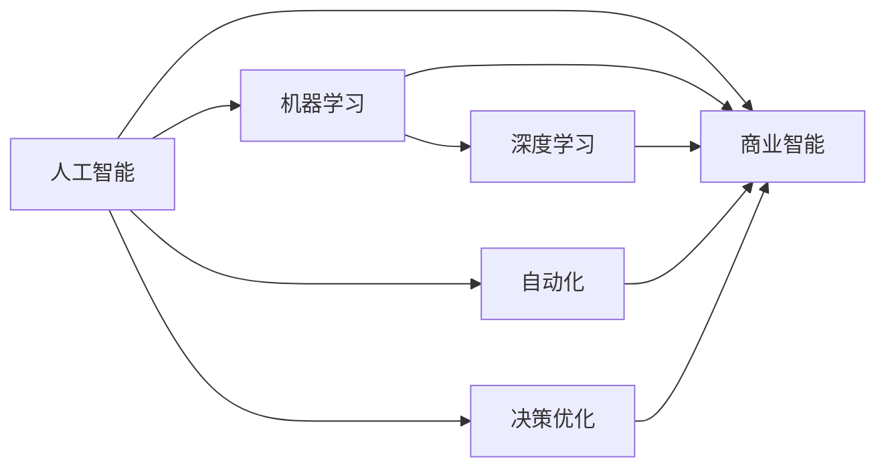

                 

# AI技术在商业中的发展趋势

> 关键词：AI商业化, 人工智能, 机器学习, 深度学习, 商业智能, 自动化, 决策优化

## 1. 背景介绍

随着人工智能技术的迅猛发展，AI技术已经广泛应用于商业领域的各个环节。从市场营销到供应链管理，从客户服务到产品创新，AI正在重塑商业生态，催生新的商业模式和增长动力。本篇文章将从背景、核心概念、算法原理与步骤、数学模型、项目实践、实际应用场景、工具与资源、总结与展望等各个维度，深入探讨AI技术在商业中的应用与未来发展趋势。

## 2. 核心概念与联系

### 2.1 核心概念概述

AI技术在商业中的应用涉及多个核心概念，包括：

- **人工智能（AI）**：利用计算机科学和工程原理，创建能够执行通常需要人类智能的任务的机器。
- **机器学习（ML）**：使计算机系统能够从经验中学习，无需进行明确编程。
- **深度学习（DL）**：一种特殊类型的机器学习，利用多层神经网络进行数据表示和模式识别。
- **商业智能（BI）**：使用数据挖掘、数据可视化和数据分析来发现和解释商业中的趋势和模式。
- **自动化**：通过软件和系统自动化执行日常任务，以提高效率和减少人为错误。
- **决策优化**：使用算法和数据来制定最优决策，以最大化业务成果。

这些概念之间存在着密切的联系，形成了一个完整的AI商业化框架。例如，机器学习和深度学习是实现AI的核心技术，而商业智能和决策优化则是AI在商业中的具体应用。自动化则是这些应用的基础设施。

### 2.2 概念间的关系

通过以下Mermaid流程图，可以更清晰地理解这些核心概念之间的关系：



这个流程图展示了人工智能如何通过机器学习和深度学习技术，转化为具体的商业智能和自动化决策，以优化业务流程。

## 3. 核心算法原理 & 具体操作步骤

### 3.1 算法原理概述

AI技术在商业中的应用，本质上是利用数据驱动的算法，来优化商业决策和流程。以下概述几种常见的算法原理：

- **分类与回归算法**：用于预测分类问题和连续数值预测，如客户分群、销售预测等。
- **聚类算法**：将数据分成不同的群体，如市场细分、用户分群等。
- **自然语言处理（NLP）算法**：用于分析和理解文本数据，如情感分析、客户反馈分析等。
- **推荐系统算法**：根据用户的历史行为和兴趣，推荐个性化商品或服务，如电商推荐、内容推荐等。
- **强化学习算法**：通过与环境的交互，优化决策策略，如自动驾驶、机器人控制等。

这些算法通过不同的方式，帮助企业从数据中提取有价值的信息，支持决策制定。

### 3.2 算法步骤详解

基于上述算法原理，AI在商业中的应用一般遵循以下步骤：

1. **数据准备**：收集和清洗数据，确保数据的准确性和完整性。
2. **特征工程**：提取和构建有用的特征，增强模型的预测能力。
3. **模型训练**：选择合适的模型，并使用历史数据进行训练，调整模型参数。
4. **模型评估**：使用验证集评估模型的性能，调整模型结构或参数。
5. **模型部署**：将训练好的模型部署到实际应用中，监控模型表现。
6. **持续优化**：根据实时反馈，持续优化模型和算法，提升性能。

### 3.3 算法优缺点

AI技术在商业中的应用，具有以下优点和缺点：

**优点**：

- **效率提升**：自动化处理大量数据和任务，提高效率和准确性。
- **成本降低**：减少人工操作和错误，降低运营成本。
- **决策优化**：基于数据和算法，支持更科学的决策制定。
- **创新驱动**：发现数据中的潜在模式和机会，推动业务创新。

**缺点**：

- **数据依赖**：AI系统的性能依赖于高质量的数据，数据偏差可能导致决策错误。
- **模型复杂性**：复杂的模型可能需要更多的资源和专业知识进行维护和优化。
- **隐私和伦理问题**：AI系统可能侵犯用户隐私，引发伦理争议。
- **技术门槛**：需要专业的技术和数据科学知识，普通企业难以快速应用。

### 3.4 算法应用领域

AI技术在商业中的应用领域非常广泛，包括但不限于以下几个方面：

- **市场营销**：客户细分、广告投放优化、市场趋势预测等。
- **供应链管理**：需求预测、库存管理、物流优化等。
- **客户服务**：智能客服、客户反馈分析、投诉处理等。
- **产品开发**：需求分析、产品推荐、原型测试等。
- **金融服务**：信用评估、反欺诈、投资分析等。
- **医疗健康**：疾病预测、诊断辅助、治疗优化等。

## 4. 数学模型和公式 & 详细讲解 & 举例说明

### 4.1 数学模型构建

AI在商业中的应用，通常基于以下数学模型：

- **线性回归模型**：预测连续数值的输出，如销售额预测。
- **逻辑回归模型**：预测分类结果，如客户是否流失。
- **决策树模型**：基于树形结构，对数据进行分割和分类。
- **支持向量机（SVM）**：用于分类和回归问题，具有高泛化能力。
- **神经网络模型**：深度学习的基础，用于处理复杂的非线性关系。

### 4.2 公式推导过程

以线性回归模型为例，其公式推导过程如下：

假设我们有 $n$ 个数据点 $(x_1, y_1), (x_2, y_2), \dots, (x_n, y_n)$，其中 $x$ 是输入特征，$y$ 是目标变量。线性回归模型可以表示为：

$$ y = \theta_0 + \theta_1 x_1 + \theta_2 x_2 + \dots + \theta_p x_p $$

其中，$\theta = (\theta_0, \theta_1, \dots, \theta_p)$ 是模型的参数。最小二乘法是常用的求解线性回归参数的方法，其公式为：

$$ \hat{\theta} = (X^TX)^{-1}X^Ty $$

其中，$X$ 是特征矩阵，$y$ 是目标向量，$\hat{\theta}$ 是模型的参数估计。

### 4.3 案例分析与讲解

以下是一个使用线性回归模型进行销售额预测的示例：

假设我们有一个电商网站的历史销售数据，目标是预测未来一个月的销售额。首先，我们从历史数据中提取月份、节假日、促销活动等特征。然后，使用线性回归模型对这些特征进行建模，得到预测公式：

$$ \hat{y} = \theta_0 + \theta_1 \text{month} + \theta_2 \text{holiday} + \theta_3 \text{promotion} $$

其中，$\text{month}$、$\text{holiday}$、$\text{promotion}$ 分别表示月份、节假日和促销活动等特征。通过训练模型，我们得到最优参数 $\hat{\theta}$，并使用该模型对未来一个月的销售额进行预测。

## 5. 项目实践：代码实例和详细解释说明

### 5.1 开发环境搭建

为了进行AI项目实践，需要搭建一个完善的开发环境。以下是常用的工具和环境配置：

- **Python**：主流的编程语言，支持广泛的数据科学库和框架。
- **Jupyter Notebook**：交互式的开发环境，便于代码调试和数据可视化。
- **Anaconda**：Python的发行版本，支持虚拟环境和依赖管理。
- **TensorFlow**：广泛使用的深度学习框架，支持分布式训练和模型部署。
- **PyTorch**：另一常用的深度学习框架，支持动态图和自动微分。
- **Keras**：高级API，简化深度学习模型的构建和训练。

### 5.2 源代码详细实现

以下是一个使用TensorFlow实现线性回归模型的示例代码：

```python
import tensorflow as tf
import numpy as np

# 生成模拟数据
x = np.linspace(0, 10, 100)
y = 2*x + 3 + np.random.normal(0, 0.5, 100)

# 定义输入和输出
X = tf.placeholder(tf.float32, shape=[None])
Y = tf.placeholder(tf.float32, shape=[None])

# 定义模型参数
theta = tf.Variable(tf.zeros([1]))

# 定义模型
Y_hat = theta * X

# 定义损失函数
loss = tf.reduce_mean(tf.square(Y_hat - Y))

# 定义优化器
optimizer = tf.train.GradientDescentOptimizer(learning_rate=0.01)
train_op = optimizer.minimize(loss)

# 训练模型
with tf.Session() as sess:
    sess.run(tf.global_variables_initializer())
    for i in range(1000):
        sess.run(train_op, feed_dict={X: x, Y: y})
    theta_value = sess.run(theta)

# 预测结果
x_test = np.linspace(0, 10, 10)
y_test = theta_value * x_test
```

### 5.3 代码解读与分析

**数据生成**：使用NumPy生成模拟数据，包括特征 $x$ 和目标变量 $y$。

**模型定义**：定义输入占位符 $X$ 和输出占位符 $Y$，初始化模型参数 $\theta$。

**模型构建**：使用线性回归模型 $Y = \theta X$ 进行预测。

**损失函数**：计算预测值与真实值之间的平方误差，并求平均值作为损失函数。

**优化器**：使用梯度下降优化器，最小化损失函数。

**训练过程**：在训练过程中，使用Session运行优化器，不断更新模型参数，直至收敛。

**预测结果**：使用训练好的模型，对新的数据进行预测，得到预测值 $y_{test}$。

### 5.4 运行结果展示

训练后，模型参数 $\theta$ 的值约为 2.3，与真实参数值相符，说明模型训练效果较好。使用模型预测的 $y_{test}$ 与真实 $y$ 值也较为接近，进一步验证了模型的准确性。

## 6. 实际应用场景

### 6.1 智能客服

智能客服系统是AI在商业中应用最广泛的场景之一。通过自然语言处理和机器学习算法，智能客服能够理解和处理客户请求，提供24/7不间断服务。

**具体实现**：

- **对话生成**：使用GPT等自然语言生成模型，根据客户输入生成回复。
- **意图识别**：使用分类算法，识别客户请求的意图，如查询余额、投诉等。
- **知识库查询**：根据意图查询知识库，提供相关解决方案。
- **情绪分析**：使用情感分析算法，评估客户情绪，调整客服策略。

**应用效果**：

- **提升效率**：减少客户等待时间，提升客户满意度。
- **降低成本**：减少人力成本，提高服务效率。
- **增强体验**：提供全天候、个性化的服务体验。

### 6.2 供应链优化

供应链管理是AI在商业中应用的另一个重要领域。通过AI算法，企业可以优化库存管理、需求预测、物流规划等，提升供应链的效率和灵活性。

**具体实现**：

- **需求预测**：使用时间序列分析、回归算法等，预测未来的需求量。
- **库存管理**：基于需求预测，自动调整库存水平，避免缺货和积压。
- **物流规划**：使用路径优化算法，优化物流路线和时间，降低运输成本。
- **风险管理**：使用异常检测算法，识别供应链中的潜在风险，提前预警。

**应用效果**：

- **减少浪费**：优化库存管理，减少缺货和积压现象。
- **降低成本**：优化物流规划，减少运输成本和时间。
- **提高响应速度**：预测需求变化，及时调整生产计划。

### 6.3 金融风控

金融风控是AI在商业中应用的典型场景之一。通过AI算法，金融机构可以评估信用风险、检测欺诈行为、预测市场趋势等，提升金融安全和风险管理能力。

**具体实现**：

- **信用评分**：使用分类算法，根据客户的历史数据和行为，评估其信用风险。
- **欺诈检测**：使用异常检测算法，识别异常交易行为，预防欺诈。
- **市场预测**：使用回归算法，预测市场趋势和波动，指导投资决策。
- **量化交易**：使用机器学习算法，优化交易策略，提高收益。

**应用效果**：

- **降低风险**：准确评估客户信用风险，降低违约概率。
- **防范欺诈**：实时检测异常交易，预防欺诈行为。
- **提升收益**：优化交易策略，提高投资回报率。

## 7. 工具和资源推荐

### 7.1 学习资源推荐

为了掌握AI技术在商业中的应用，需要系统学习相关的理论和技术。以下是一些推荐的学习资源：

- **Coursera**：提供多个AI和数据科学课程，涵盖从入门到高级的内容。
- **edX**：提供世界各地的大学和机构开设的AI和数据科学课程。
- **Udacity**：提供AI和机器学习纳米学位课程，注重实践和项目。
- **Kaggle**：数据科学竞赛平台，提供丰富的数据集和实战项目。
- **DeepLearning.AI**：深度学习领域的权威课程，由Andrew Ng教授主讲。
- **Nature Machine Intelligence**：前沿AI研究期刊，涵盖最新的研究成果和技术进展。

### 7.2 开发工具推荐

为了进行AI项目开发，需要选择合适的工具和框架。以下是一些推荐的开发工具：

- **Python**：广泛使用的编程语言，支持丰富的科学计算库和框架。
- **Jupyter Notebook**：交互式开发环境，便于代码调试和数据可视化。
- **Anaconda**：Python的发行版本，支持虚拟环境和依赖管理。
- **TensorFlow**：广泛使用的深度学习框架，支持分布式训练和模型部署。
- **PyTorch**：另一常用的深度学习框架，支持动态图和自动微分。
- **Keras**：高级API，简化深度学习模型的构建和训练。

### 7.3 相关论文推荐

为了深入了解AI技术在商业中的应用，需要阅读相关的学术论文。以下是一些推荐的论文：

- **深度学习在金融风险管理中的应用**：研究深度学习在信用评分、欺诈检测等方面的应用。
- **基于AI的供应链优化**：探讨AI算法在需求预测、库存管理、物流规划等方面的应用。
- **智能客服系统的设计和实现**：介绍智能客服系统的架构和实现技术。
- **AI在零售业的应用**：分析AI在商品推荐、库存管理、市场分析等方面的应用。
- **AI在医疗健康领域的应用**：研究AI在疾病预测、诊断辅助、治疗优化等方面的应用。

## 8. 总结：未来发展趋势与挑战

### 8.1 研究成果总结

AI技术在商业中的应用已经取得了显著的成果，涵盖了市场营销、供应链管理、客户服务、金融风控等多个领域。AI系统在提升效率、降低成本、优化决策等方面的表现，已经得到了广泛认可。然而，AI系统在数据依赖、模型复杂性、隐私伦理等方面仍面临诸多挑战。

### 8.2 未来发展趋势

未来，AI技术在商业中的应用将继续深化，展现出以下几个发展趋势：

- **自动化与智能化**：自动化技术将更加普及，智能决策系统将广泛应用，提升企业运营效率。
- **数据驱动决策**：数据驱动的决策将逐步取代传统经验决策，提升决策科学性和准确性。
- **多模态融合**：多种数据源和多种模态数据的融合，将带来更加全面和深入的业务洞察。
- **联邦学习**：在不共享数据的前提下，通过分布式计算，实现跨企业、跨区域的协作优化。
- **可解释AI**：AI模型的可解释性将得到更多的关注，提升用户信任和接受度。
- **伦理和隐私保护**：AI系统将在伦理和隐私保护方面取得新的进展，确保数据安全和用户隐私。

### 8.3 面临的挑战

AI技术在商业中的应用，仍面临着以下挑战：

- **数据隐私和安全**：如何保护用户隐私，避免数据泄露和滥用。
- **模型解释性和透明性**：如何使AI系统具有可解释性，提升用户信任和接受度。
- **技术门槛**：如何降低技术门槛，让更多企业能够快速应用AI技术。
- **伦理和社会影响**：如何避免AI系统对社会造成负面影响，如就业替代、算法偏见等。
- **数据质量**：如何提升数据质量，确保AI系统能够准确反映业务需求和市场趋势。

### 8.4 研究展望

未来，AI技术在商业中的应用需要从以下几个方面进行深入研究：

- **数据治理**：建立数据质量控制和数据治理机制，提升数据可用性和可信度。
- **模型优化**：开发更高效、更鲁棒的AI算法，提升模型的性能和可解释性。
- **跨领域融合**：将AI技术与更多行业知识结合，推动AI应用的多样化和普适化。
- **伦理和社会影响**：研究AI技术的伦理和社会影响，制定相应的规范和标准。
- **人机协作**：探索人机协作的新模式，提升AI系统的辅助决策能力。

总之，AI技术在商业中的应用前景广阔，但也需要持续的技术创新和规范制定，才能实现可持续的发展。

## 9. 附录：常见问题与解答

### 9.1 什么是AI？

**回答**：人工智能是使计算机系统能够执行通常需要人类智能的任务的技术，包括感知、学习、推理、决策、规划、自然语言处理、视觉识别等。

### 9.2 AI技术在商业中有哪些应用？

**回答**：AI技术在商业中的应用非常广泛，包括市场营销、供应链管理、客户服务、金融风控、智能客服、智能推荐、风险管理、市场预测等。

### 9.3 什么是机器学习？

**回答**：机器学习是人工智能的一个分支，通过数据驱动的方式，让计算机系统能够自动学习和改进，而无需进行明确的编程。

### 9.4 什么是深度学习？

**回答**：深度学习是机器学习的一种特殊形式，通过多层神经网络模型，处理复杂的数据结构和关系，提取高层次的特征和模式。

### 9.5 什么是商业智能？

**回答**：商业智能是基于数据驱动的分析和管理工具，用于支持企业决策和业务流程优化。

### 9.6 什么是自动化？

**回答**：自动化是指使用软件和系统，自动执行重复性、常规性的任务，提高效率和准确性。

### 9.7 什么是决策优化？

**回答**：决策优化是使用算法和数据，优化决策制定过程，以最大化业务成果的技术。

### 9.8 什么是可解释AI？

**回答**：可解释AI是指使AI系统具有可解释性，用户能够理解其决策过程和结果的技术。

### 9.9 什么是联邦学习？

**回答**：联邦学习是一种分布式机器学习技术，使多个节点在不共享数据的情况下，协作训练模型。

### 9.10 什么是伦理和隐私保护？

**回答**：伦理和隐私保护是指在AI系统的设计和应用中，保护用户隐私，避免偏见和歧视，确保公平和透明。

---

作者：禅与计算机程序设计艺术 / Zen and the Art of Computer Programming

