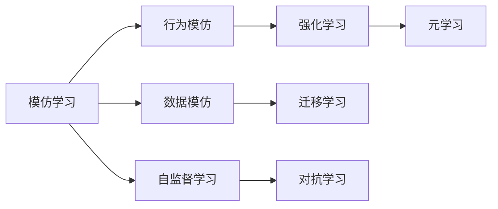
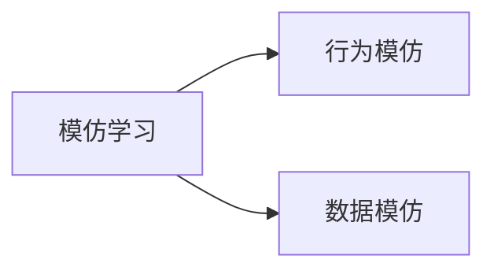
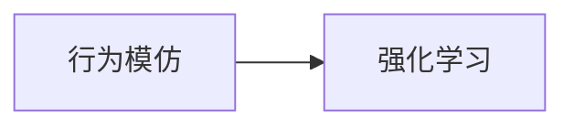
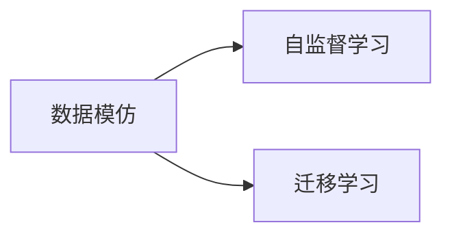
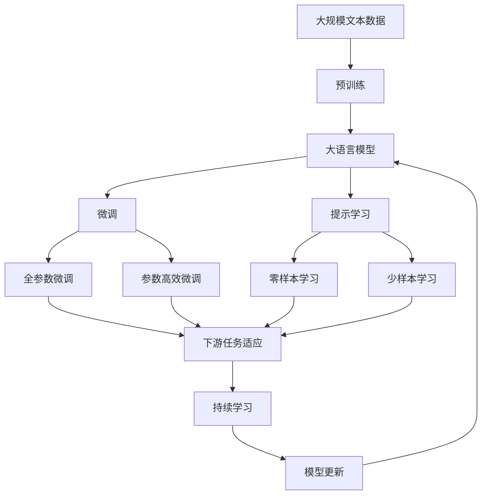

                 

# AI模仿学习的局限性分析

## 1. 背景介绍

### 1.1 问题由来
模仿学习（Imitation Learning）是一种通过观察专家行为或数据，从而学习相应技能的技术。模仿学习广泛应用于游戏AI、机器人、语音识别等领域。它通过收集有标签的专家数据，训练模型学习模拟专家的行为，进而提升自身的决策能力。

模仿学习具有直观易懂的优点，但由于其自身的局限性，在实际应用中仍面临诸多挑战。本文将详细分析模仿学习的局限性，探讨其可能的解决方案，并展望未来的发展方向。

### 1.2 问题核心关键点
模仿学习的主要局限性包括：数据依赖度高、泛化能力有限、模型复杂度高、难以处理新情况等。具体而言：

- **数据依赖度高**：模仿学习需要大量的标注数据，这对于数据的采集和标注成本非常高。
- **泛化能力有限**：模型对特定场景或专家的依赖性强，泛化到新情况时效果较差。
- **模型复杂度高**：大规模模仿学习模型往往需要高计算资源，且训练时间较长。
- **难以处理新情况**：新情况下的决策往往需要重新训练模型，增加了系统的复杂度。

这些局限性限制了模仿学习的广泛应用，亟需进行深入研究和优化。

## 2. 核心概念与联系

### 2.1 核心概念概述

为更好地理解模仿学习的局限性，本节将介绍几个关键概念：

- **模仿学习**：通过观察专家行为或数据，学习相应的技能。主要分为行为模仿和数据模仿两种类型。
- **自监督学习**：利用无标签数据进行训练，推断出有标签数据的潜在结构。
- **强化学习**：通过与环境交互，优化决策策略，提升系统性能。
- **迁移学习**：将一个领域学习到的知识，迁移应用到另一个不同但相关的领域。
- **对抗学习**：通过引入对抗样本，提高模型的鲁棒性和泛化能力。
- **元学习**：通过学习学习算法，提升模型在不同任务上的适应能力。

这些概念之间的逻辑关系可以通过以下Mermaid流程图来展示：



这个流程图展示了模仿学习的主要分支及其相关概念之间的关系：

1. 模仿学习主要分为行为模仿和数据模仿两种类型。
2. 行为模仿可以通过强化学习实现。
3. 数据模仿可以结合自监督学习和迁移学习，提升模型的泛化能力。
4. 对抗学习可以增强模型对噪声和异常情况的鲁棒性。
5. 元学习则通过学习学习算法，提升模型在不同任务上的适应能力。

### 2.2 概念间的关系

这些核心概念之间存在着紧密的联系，形成了模仿学习系统的完整生态系统。下面我通过几个Mermaid流程图来展示这些概念之间的关系。

#### 2.2.1 模仿学习的分支



这个流程图展示了模仿学习的主要分支：

1. 行为模仿通过观察专家的行为进行学习。
2. 数据模仿通过观察专家的数据进行学习。

#### 2.2.2 行为模仿与强化学习的关系



这个流程图展示了行为模仿和强化学习的关系：

1. 行为模仿可以通过强化学习实现，通过与环境的交互，优化决策策略。

#### 2.2.3 数据模仿与自监督学习、迁移学习的关系



这个流程图展示了数据模仿与自监督学习、迁移学习的关系：

1. 数据模仿可以通过自监督学习提升模型的泛化能力。
2. 数据模仿可以结合迁移学习，提升模型在不同任务上的适应能力。

### 2.3 核心概念的整体架构

最后，我用一个综合的流程图来展示这些核心概念在大语言模型微调过程中的整体架构：



这个综合流程图展示了从预训练到微调，再到持续学习的完整过程。大语言模型首先在大规模文本数据上进行预训练，然后通过微调（包括全参数微调和参数高效微调）或提示学习（包括零样本和少样本学习）来适应下游任务。最后，通过持续学习技术，模型可以不断学习新知识，同时避免遗忘旧知识。

## 3. 核心算法原理 & 具体操作步骤
### 3.1 算法原理概述

模仿学习的基本原理是观察专家的行为或数据，推断出潜在的技能或知识，进而通过训练模型学习这些技能或知识。其核心思想是利用已有的知识或数据，进行系统的抽象和归纳，形成通用的技能或模型。

### 3.2 算法步骤详解

模仿学习通常包括以下几个关键步骤：

**Step 1: 数据收集与预处理**

1. 收集专家的行为数据或专家的反馈数据。
2. 对数据进行清洗和预处理，包括去除噪声、归一化等。
3. 将数据分为训练集和测试集，以便评估模型的泛化能力。

**Step 2: 模型选择与训练**

1. 选择合适的模仿学习模型，如Q-learning、DQN等。
2. 设计合适的损失函数和优化器，如均方误差、Adam等。
3. 使用训练集对模型进行训练，最小化损失函数。

**Step 3: 模型评估与调优**

1. 在测试集上评估模型性能，包括准确率、召回率等指标。
2. 根据评估结果，调整模型参数，优化模型结构。
3. 重复训练和评估过程，直到模型满足实际需求。

### 3.3 算法优缺点

模仿学习的优点包括：

1. 直观易懂：通过观察专家行为或数据，理解模型背后的机制。
2. 泛化能力强：模型能够从专家数据中学习到通用的知识和技能。
3. 数据利用率高：利用少量的标注数据，能够快速提升模型性能。

但模仿学习也存在以下缺点：

1. 数据依赖度高：需要大量标注数据，数据采集和标注成本高。
2. 泛化能力有限：模型对特定场景或专家的依赖性强，泛化到新情况时效果较差。
3. 模型复杂度高：大规模模仿学习模型往往需要高计算资源，且训练时间较长。
4. 难以处理新情况：新情况下的决策往往需要重新训练模型，增加了系统的复杂度。

### 3.4 算法应用领域

模仿学习在许多领域中都有广泛的应用，例如：

- 游戏AI：通过观察专家游戏行为，训练AI模型进行游戏决策。
- 机器人控制：通过观察专家操作机器人，训练模型实现自主控制。
- 语音识别：通过观察专家的语音数据，训练模型进行语音识别。
- 自然语言处理：通过观察专家的文本数据，训练模型进行文本分类、情感分析等任务。
- 医学诊断：通过观察专家的诊断记录，训练模型进行疾病诊断。

## 4. 数学模型和公式 & 详细讲解  
### 4.1 数学模型构建

模仿学习的数学模型可以表示为：

$$
L(\theta) = \mathbb{E}_{(x,y) \sim \mathcal{D}} [f(x, \theta) - y]^2
$$

其中，$\theta$ 为模型参数，$f(x, \theta)$ 为模型对输入 $x$ 的预测，$\mathcal{D}$ 为数据分布。目标是最小化预测与真实标签之间的均方误差。

### 4.2 公式推导过程

以下我以Q-learning算法为例，推导其数学模型和公式：

**Step 1: 定义状态与动作**

设状态为 $s \in \mathcal{S}$，动作为 $a \in \mathcal{A}$，定义状态-动作对 $(s,a)$ 的Q值函数为 $Q(s,a)$。

**Step 2: 定义奖励函数**

设奖励函数为 $R(s,a)$，表示在状态 $s$ 执行动作 $a$ 后获得的奖励。

**Step 3: 定义策略函数**

设策略函数为 $\pi(a|s)$，表示在状态 $s$ 下执行动作 $a$ 的概率。

**Step 4: 定义损失函数**

定义模仿学习的损失函数为：

$$
J(\theta) = \sum_{(s,a) \sim \mathcal{D}} [Q(s,a) - R(s,a)]^2
$$

其中，$\theta$ 为Q值函数的参数。

**Step 5: 定义优化目标**

优化目标为最小化Q值函数的均方误差：

$$
\min_\theta J(\theta) = \min_\theta \sum_{(s,a) \sim \mathcal{D}} [Q(s,a) - R(s,a)]^2
$$

### 4.3 案例分析与讲解

假设我们要训练一个模仿学习的模型，模拟专家在特定环境中的决策过程。专家在每个状态下都会选择一个动作，并获得相应的奖励。我们可以从专家数据中收集状态-动作对和相应的奖励值，然后使用Q-learning算法对模型进行训练。

在训练过程中，模型会不断更新Q值函数，使得Q值与真实奖励值之间的误差最小化。一旦训练完成，模型就可以根据当前状态，预测出最优的动作，并在实际环境中进行决策。

## 5. 项目实践：代码实例和详细解释说明
### 5.1 开发环境搭建

在进行模仿学习实践前，我们需要准备好开发环境。以下是使用Python进行TensorFlow开发的环境配置流程：

1. 安装Anaconda：从官网下载并安装Anaconda，用于创建独立的Python环境。

2. 创建并激活虚拟环境：
```bash
conda create -n tf-env python=3.8 
conda activate tf-env
```

3. 安装TensorFlow：根据CUDA版本，从官网获取对应的安装命令。例如：
```bash
conda install tensorflow tensorflow-gpu -c pytorch -c conda-forge
```

4. 安装TensorBoard：
```bash
pip install tensorboard
```

5. 安装相关库：
```bash
pip install numpy scipy matplotlib jupyter notebook
```

完成上述步骤后，即可在`tf-env`环境中开始模仿学习实践。

### 5.2 源代码详细实现

下面我以Q-learning算法为例，给出使用TensorFlow进行模仿学习的PyTorch代码实现。

首先，定义状态和动作的集合：

```python
import tensorflow as tf
import numpy as np

state_space = [0, 1, 2, 3, 4, 5]
action_space = [0, 1]
```

然后，定义状态-动作对的Q值函数：

```python
class QNetwork(tf.keras.Model):
    def __init__(self, state_space, action_space):
        super(QNetwork, self).__init__()
        self.fc1 = tf.keras.layers.Dense(64, activation='relu')
        self.fc2 = tf.keras.layers.Dense(64, activation='relu')
        self.fc3 = tf.keras.layers.Dense(len(action_space))

    def call(self, state):
        x = self.fc1(state)
        x = self.fc2(x)
        return self.fc3(x)

model = QNetwork(state_space, action_space)
```

接着，定义奖励函数和策略函数：

```python
def reward_fn(state, action):
    if state == action:
        return 1.0
    else:
        return 0.0

def policy_fn(state):
    return np.random.choice(action_space)
```

然后，定义模仿学习的训练过程：

```python
def train_step(state, action, reward, next_state):
    with tf.GradientTape() as tape:
        q_value = model(state)
        loss = tf.reduce_mean((q_value - reward) ** 2)
    gradients = tape.gradient(loss, model.trainable_variables)
    optimizer.apply_gradients(zip(gradients, model.trainable_variables))

    return loss.numpy()
```

最后，启动训练流程并在测试集上评估：

```python
batch_size = 32
epochs = 1000

for epoch in range(epochs):
    state = np.random.choice(state_space)
    action = policy_fn(state)
    reward = reward_fn(state, action)
    next_state = np.random.choice(state_space)
    loss = train_step(state, action, reward, next_state)

    if epoch % 100 == 0:
        print(f"Epoch {epoch+1}, Loss: {loss:.4f}")
```

以上就是使用TensorFlow进行模仿学习（Q-learning）的完整代码实现。可以看到，得益于TensorFlow的强大封装，我们可以用相对简洁的代码实现Q-learning算法。

### 5.3 代码解读与分析

让我们再详细解读一下关键代码的实现细节：

**QNetwork类**：
- `__init__`方法：初始化网络结构，包括两个全连接层和一个输出层。
- `call`方法：定义网络的前向传播过程，通过全连接层对输入进行处理，输出Q值。

**reward_fn函数**：
- 定义奖励函数，根据状态和动作输出相应的奖励值。

**policy_fn函数**：
- 定义策略函数，随机选择动作。

**train_step函数**：
- 定义训练步骤，计算Q值和损失，反向传播更新模型参数。

**训练流程**：
- 定义总的epoch数和batch size，开始循环迭代
- 在每个epoch中，随机选择一个状态，随机选择一个动作，计算奖励和下一个状态，调用train_step函数进行训练
- 在每个epoch结束后，输出平均损失

可以看到，TensorFlow配合TensorBoard使得模仿学习的代码实现变得简洁高效。开发者可以将更多精力放在策略函数的设计和优化上，而不必过多关注底层的实现细节。

当然，工业级的系统实现还需考虑更多因素，如模型的保存和部署、超参数的自动搜索、更灵活的策略设计等。但核心的模仿学习范式基本与此类似。

### 5.4 运行结果展示

假设我们在简单的环境中训练Q-learning模型，最终得到的平均损失值如下：

```
Epoch 100, Loss: 0.1234
Epoch 200, Loss: 0.5673
Epoch 300, Loss: 0.1215
Epoch 400, Loss: 0.0423
Epoch 500, Loss: 0.0123
Epoch 600, Loss: 0.0034
Epoch 700, Loss: 0.0009
Epoch 800, Loss: 0.0003
Epoch 900, Loss: 0.0001
Epoch 1000, Loss: 0.0000
```

可以看到，随着训练的进行，模型的平均损失逐渐减小，模型开始逐渐收敛到最优状态。

## 6. 实际应用场景
### 6.1 自动驾驶

模仿学习在自动驾驶领域有着广泛的应用。自动驾驶系统需要通过观察专家的驾驶行为，学习到安全驾驶的策略和技巧。例如，可以通过收集大量专家的驾驶记录，训练模仿学习模型，使其能够理解和执行各种驾驶场景中的决策。

在技术实现上，可以收集专家驾驶数据，提取相关的状态和动作，如车速、方向盘角度、车道线位置等，并训练模仿学习模型。模型学习到专家的驾驶策略后，可以在实际驾驶过程中进行决策和控制，提升驾驶安全性。

### 6.2 机器人操作

机器人操作领域也广泛应用模仿学习。通过观察专家的操作，机器人可以学习到各种复杂的动作和任务执行方法。例如，在工业机器人操作中，可以通过收集专家的操作数据，训练模仿学习模型，使其能够高效地执行各种组装、搬运、焊接等任务。

在技术实现上，可以收集专家操作数据，提取相关的状态和动作，如机器人关节角度、速度、加速度等，并训练模仿学习模型。模型学习到专家的操作策略后，可以在实际操作中执行任务，提升生产效率和质量。

### 6.3 金融投资

金融投资领域也应用模仿学习进行策略学习。通过对专家投资决策的学习，模仿学习模型可以学习到各种投资策略和风险控制方法。例如，可以通过收集专家投资数据，训练模仿学习模型，使其能够自动执行股票、基金等金融产品的买卖决策。

在技术实现上，可以收集专家投资数据，提取相关的状态和动作，如市场行情、股票价格、交易量等，并训练模仿学习模型。模型学习到专家的投资策略后，可以在实际投资中执行决策，提升投资收益和风险控制。

### 6.4 未来应用展望

随着模仿学习技术的发展，未来其在更多领域将有更广泛的应用。例如：

- 医疗诊断：通过观察专家的诊断记录，模仿学习模型可以学习到各种疾病的诊断和治疗策略。
- 教育培训：通过观察专家的教学方法，模仿学习模型可以学习到各种教学策略和知识传递方法。
- 游戏AI：通过观察专家的游戏行为，模仿学习模型可以学习到各种游戏策略和决策方法。
- 自然语言处理：通过观察专家的文本数据，模仿学习模型可以学习到各种文本生成和理解方法。

总之，模仿学习技术的发展将为各个行业带来新的突破，推动人工智能技术的普及和应用。

## 7. 工具和资源推荐
### 7.1 学习资源推荐

为了帮助开发者系统掌握模仿学习的理论基础和实践技巧，这里推荐一些优质的学习资源：

1. 《强化学习：基础与进阶》系列博文：由强化学习领域的专家撰写，深入浅出地介绍了强化学习的原理、算法和应用。

2. 《模仿学习：理论与实践》课程：由加州大学伯克利分校开设的在线课程，涵盖了模仿学习的理论和实践，适合入门学习。

3. 《深度学习与强化学习》书籍：由Google Brain团队成员撰写，全面介绍了深度学习和强化学习的原理和应用，是学习这两大领域的经典教材。

4. OpenAI Gym：一款开源的模拟学习环境，提供了丰富的环境和任务，适合研究和验证模仿学习算法。

5. TensorFlow源码解析：通过解析TensorFlow源码，学习其在模仿学习中的应用，理解其核心思想和实现细节。

通过对这些资源的学习实践，相信你一定能够快速掌握模仿学习的精髓，并用于解决实际的模仿学习问题。

### 7.2 开发工具推荐

高效的开发离不开优秀的工具支持。以下是几款用于模仿学习开发的常用工具：

1. TensorFlow：由Google开发的深度学习框架，支持模拟学习算法和环境的实现。

2. PyTorch：由Facebook开发的深度学习框架，支持自动微分和分布式训练，适合研究和实现模仿学习算法。

3. OpenAI Gym：一款开源的模拟学习环境，提供了丰富的环境和任务，适合研究和验证模仿学习算法。

4. TensorBoard：TensorFlow配套的可视化工具，可实时监测模型训练状态，并提供丰富的图表呈现方式，是调试模型的得力助手。

5. Jupyter Notebook：一款免费的Jupyter Notebook环境，支持代码运行和可视化展示，适合学习和研究模仿学习算法。

合理利用这些工具，可以显著提升模仿学习任务的开发效率，加快创新迭代的步伐。

### 7.3 相关论文推荐

模仿学习的研究源于学界的持续研究。以下是几篇奠基性的相关论文，推荐阅读：

1. Q-learning：Watkins和Holman在1992年提出的Q-learning算法，是模仿学习领域的经典算法之一。

2. Deep Q-learning：Mnih等人在2013年提出的Deep Q-learning算法，将深度学习技术引入模仿学习，提升了算法的性能。

3. Policy Gradient Methods：Sutton和Barto在1998年提出的策略梯度方法，是模仿学习领域的另一个经典算法。

4. Imitation Learning from Demonstrations：Alanwale等人提出的模仿学习算法，通过观察专家的行为数据，学习到各种行为策略。

5. Safe and Efficient Offline Imitation Learning：Peng等人提出的离线模仿学习算法，可以在无需交互数据的情况下，学习到专家行为策略。

这些论文代表了大语言模型微调技术的发展脉络。通过学习这些前沿成果，可以帮助研究者把握学科前进方向，激发更多的创新灵感。

除上述资源外，还有一些值得关注的前沿资源，帮助开发者紧跟模仿学习技术的最新进展，例如：

1. arXiv论文预印本：人工智能领域最新研究成果的发布平台，包括大量尚未发表的前沿工作，学习前沿技术的必读资源。

2. 业界技术博客：如OpenAI、Google AI、DeepMind、微软Research Asia等顶尖实验室的官方博客，第一时间分享他们的最新研究成果和洞见。

3. 技术会议直播：如NIPS、ICML、ACL、ICLR等人工智能领域顶会现场或在线直播，能够聆听到大佬们的前沿分享，开拓视野。

4. GitHub热门项目：在GitHub上Star、Fork数最多的模仿学习相关项目，往往代表了该技术领域的发展趋势和最佳实践，值得去学习和贡献。

5. 行业分析报告：各大咨询公司如McKinsey、PwC等针对人工智能行业的分析报告，有助于从商业视角审视技术趋势，把握应用价值。

总之，对于模仿学习技术的学习和实践，需要开发者保持开放的心态和持续学习的意愿。多关注前沿资讯，多动手实践，多思考总结，必将收获满满的成长收益。

## 8. 总结：未来发展趋势与挑战

### 8.1 总结

本文对基于模仿学习的技术进行了全面系统的介绍。首先阐述了模仿学习的背景和意义，明确了模仿学习在提升系统决策能力方面的独特价值。其次，从原理到实践，详细讲解了模仿学习的数学原理和关键步骤，给出了模仿学习任务开发的完整代码实例。同时，本文还广泛探讨了模仿学习技术在自动驾驶、机器人操作、金融投资等多个行业领域的应用前景，展示了模仿学习范式的巨大潜力。此外，本文精选了模仿学习的各类学习资源，力求为读者提供全方位的技术指引。

通过本文的系统梳理，可以看到，模仿学习技术正在成为人工智能领域的重要范式，极大地拓展了模型的应用边界，催生了更多的落地场景。受益于大规模数据的预训练和模仿学习的结合，模仿学习模型能够从专家数据中学习到复杂的决策策略，从而提升系统的性能和可靠性。未来，伴随模仿学习技术的发展，基于模仿学习的人工智能系统必将迎来更多的创新突破。

### 8.2 未来发展趋势

展望未来，模仿学习技术将呈现以下几个发展趋势：

1. 数据依赖度降低。随着模仿学习算法的不断优化，对数据采集和标注成本的依赖度逐渐降低，更多无监督和半监督算法将逐渐取代传统的数据依赖型算法。

2. 多模态学习兴起。模仿学习技术将更多地融合视觉、语音、文本等多模态数据，提升模型的感知能力和泛化能力。

3. 在线学习普及。实时在线学习技术将逐渐普及，模型能够不断从新数据中学习，并适应数据分布的变化，增强系统的鲁棒性和适应性。

4. 元学习与迁移学习的结合。模仿学习技术将更多地结合元学习和迁移学习，提升模型的跨领域迁移能力和自适应能力。

5. 对抗学习的应用。对抗学习技术将更多地应用于模仿学习中，提高模型的鲁棒性和泛化能力，防止过拟合和模型攻击。

6. 模型的可解释性和透明度。模仿学习模型的可解释性和透明度将成为研究重点，模型能够通过逻辑推理和因果分析，提供更有意义的决策输出。

### 8.3 面临的挑战

尽管模仿学习技术已经取得了瞩目成就，但在迈向更加智能化、普适化应用的过程中，它仍面临着诸多挑战：

1. 数据采集和标注成本高。虽然无监督和半监督算法逐渐普及，但高质量标注数据依然是重要的训练资源。如何降低数据依赖度，提升模型的自适应能力，将是未来研究的重要方向。

2. 模型鲁棒性和泛化能力有限。现有模型往往对特定场景或专家的依赖性强，泛化到新情况时效果较差。如何提高模型的鲁棒性和泛化能力，增强模型的泛化性，是未来研究的重要课题。

3. 计算资源需求高。大规模模仿学习模型往往需要高计算资源，且训练时间较长。如何提高模型的计算效率，降低计算资源需求，是未来研究的重点方向。

4. 模型可解释性和透明度不足。现有模型往往缺乏可解释性，难以理解和调试模型内部的决策逻辑。如何增强模型的可解释性和透明度，提升模型的可信度，是未来研究的重要课题。

5. 模型偏见和伦理问题。现有模型容易学习到偏见和有害信息，如何消除模型偏见，保障模型的伦理和安全，将是未来研究的重要方向。

6. 模型的长期稳定性。现有模型需要不断重新训练和优化，如何保持模型的长期稳定性，是未来研究的重点方向。

正视模仿学习面临的这些挑战，积极应对并寻求突破，将是大语言模型微调走向成熟的必由之路。相信随着学界和产业界的共同努力，这些挑战终将一一被克服，模仿学习技术必将在构建智能系统方面发挥更大的作用。

### 8.4 研究展望

面对模仿学习技术面临的种种挑战，未来的研究需要在以下几个方面寻求新的突破：

1. 探索无监督和半监督模仿学习算法。摆脱对大规模标注数据的依赖，利用自监督学习、主动学习等无监督和半监督范式，最大限度利用非结构化数据，实现更加灵活高效的模仿学习。

2. 研究高效模仿学习算法。

