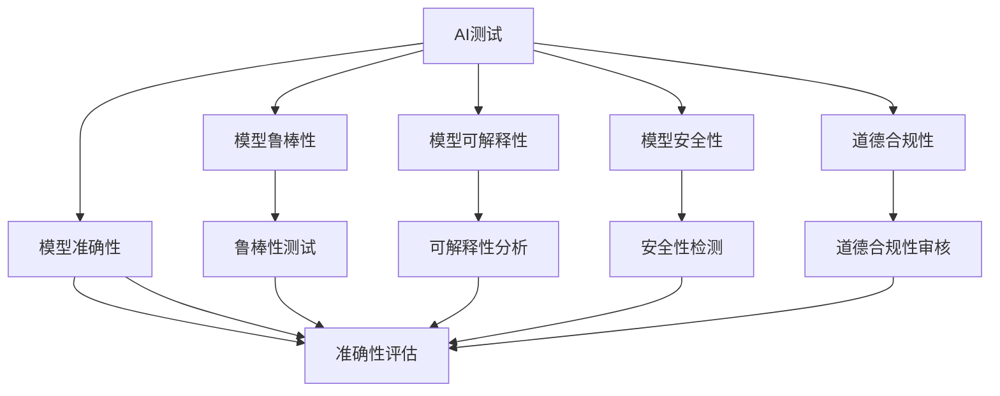
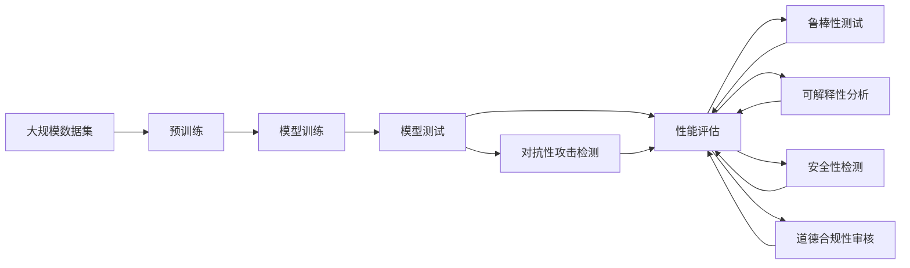

                 

# AI测试与质量保证原理与代码实战案例讲解

## 1. 背景介绍

### 1.1 问题由来
随着人工智能（AI）技术的发展，越来越多的企业开始利用AI技术提升业务效率和决策质量。然而，由于AI系统的复杂性和多样性，测试和质量保证（QA）工作变得尤为关键，不仅需要检测模型的准确性和鲁棒性，还需要确保AI系统的可解释性、安全性与道德合规性。

### 1.2 问题核心关键点
AI测试与质量保证的核心在于确保AI模型在不同场景下的稳定性、准确性以及合规性。具体来说，主要关注以下几个方面：
- 准确性和鲁棒性：确保模型在各类数据上的预测准确性，并且对于噪声、异常值等具有鲁棒性。
- 可解释性：使模型的决策过程透明，便于理解和调试，符合法律法规要求。
- 安全性：保护模型免受攻击，如对抗性攻击、数据泄露等。
- 道德合规性：确保AI模型在应用过程中不引入偏见，符合伦理标准。

### 1.3 问题研究意义
AI测试与质量保证对于AI技术的广泛应用至关重要，可以：
- 降低开发成本。通过系统化的测试和QA流程，避免重复劳动，提高开发效率。
- 提高模型性能。通过全面的测试与QA，及时发现并修正模型缺陷，提升模型质量。
- 保障应用安全。确保AI系统在不同环境下的稳定运行，避免安全漏洞。
- 促进模型合规。在应用过程中遵循法律法规和道德标准，维护社会公信。

## 2. 核心概念与联系

### 2.1 核心概念概述

为更好地理解AI测试与质量保证的基本原理和流程，本节将介绍几个核心概念：

- **AI测试**：指对AI模型的训练、推理和应用过程进行系统测试，确保模型的准确性、鲁棒性和可解释性。
- **质量保证**：指通过一系列标准化流程和工具，保障AI模型的质量，包括性能评估、漏洞检测、安全审核等。
- **可解释AI（Explainable AI, XAI）**：确保AI模型决策过程透明、可理解，便于调试和解释。
- **对抗性攻击（Adversarial Attacks）**：指通过特定输入数据，使AI模型输出错误或异常结果。
- **数据隐私与保护**：在AI模型的训练与使用过程中，确保数据的安全性和隐私性，避免数据泄露。
- **道德合规性**：确保AI模型应用过程中遵循法律法规和道德标准，避免偏见和歧视。

这些核心概念之间有着密切的联系，共同构成了AI测试与质量保证的完整框架。

### 2.2 概念间的关系

通过以下Mermaid流程图展示这些概念之间的关系：



这个流程图展示了AI测试与质量保证中各个概念之间的联系。准确性、鲁棒性、可解释性、安全性、道德合规性等指标都是通过AI测试得到的，并最终在质量保证过程中进行综合评估。

### 2.3 核心概念的整体架构

最后，我们用一个综合的流程图来展示这些核心概念在大规模AI测试与质量保证过程中的整体架构：



这个综合流程图展示了从数据预处理到模型训练，再到全面测试与质量保证的完整流程。通过这一流程，我们可以全面评估和提升AI模型的质量。

## 3. 核心算法原理 & 具体操作步骤
### 3.1 算法原理概述

AI测试与质量保证的核心算法原理主要包括：

- **模型准确性评估**：通过对比模型预测值与真实值，评估模型的准确性。
- **鲁棒性测试**：检测模型对噪声、异常值等数据变化的鲁棒性。
- **可解释性分析**：通过可视化、层级分析等方式，揭示模型的内部工作机制，提高模型的透明度。
- **安全性检测**：检测模型是否对特定输入（如对抗性样本）易受攻击，确保模型鲁棒性。
- **道德合规性审核**：评估模型输出是否符合伦理标准，避免偏见和歧视。

这些原理构成了AI测试与质量保证的基础。

### 3.2 算法步骤详解

AI测试与质量保证的具体操作步骤可以分为以下几个阶段：

#### 3.2.1 数据预处理

- **数据收集与清洗**：从多个来源收集数据，并进行去重、清洗和标注。
- **数据分割**：将数据集分为训练集、验证集和测试集，确保模型在不同数据上的泛化能力。

#### 3.2.2 模型训练与验证

- **模型选择**：根据任务特点选择合适的模型结构。
- **超参数调优**：通过网格搜索、随机搜索等方法，调整模型的超参数，以获得最优性能。
- **模型验证**：在验证集上评估模型的准确性和鲁棒性，调整模型参数，防止过拟合。

#### 3.2.3 模型测试与评估

- **模型测试**：在测试集上全面测试模型性能，评估模型的准确性、鲁棒性、可解释性、安全性与道德合规性。
- **性能评估**：使用准确率、召回率、F1分数等指标，评估模型性能。
- **鲁棒性测试**：检测模型对噪声、异常值等数据变化的鲁棒性，确保模型稳定性。
- **可解释性分析**：使用层级分析、可视化等手段，揭示模型内部工作机制，提高模型的透明度。
- **安全性检测**：使用对抗性样本检测模型，确保模型安全性。
- **道德合规性审核**：评估模型输出是否符合伦理标准，避免偏见和歧视。

#### 3.2.4 迭代优化

- **模型优化**：根据测试结果，调整模型结构、超参数等，进行迭代优化。
- **更新测试集**：根据业务需求，更新测试集，确保模型持续改进。

### 3.3 算法优缺点

AI测试与质量保证的优势在于：

- **系统化流程**：通过系统化的测试与质量保证流程，确保模型性能和质量。
- **全面覆盖**：能够全面评估模型的准确性、鲁棒性、可解释性、安全性与道德合规性。
- **迭代优化**：通过不断的迭代优化，提升模型质量，确保模型长期稳定运行。

其缺点包括：

- **数据依赖**：测试结果高度依赖于数据集的质量和数量，数据不足时，难以全面评估模型。
- **资源消耗**：大规模测试和质量保证需要大量计算资源和时间，成本较高。
- **技术门槛高**：需要系统化的测试和质量保证知识，对技术要求较高。

### 3.4 算法应用领域

AI测试与质量保证广泛应用于各种AI应用领域，包括但不限于：

- **医疗诊断**：确保AI模型对患者数据的准确诊断，避免误诊和漏诊。
- **金融风控**：检测AI模型对欺诈行为的识别能力，确保金融系统的安全稳定。
- **智能推荐**：评估AI模型的推荐算法公平性和个性化程度，提高用户体验。
- **自动驾驶**：检测AI模型对复杂道路环境的识别能力，确保驾驶安全。
- **安防监控**：评估AI模型对异常行为和异常物的识别能力，提升监控系统的安全性。
- **客户服务**：评估AI模型对客户需求的响应能力和准确性，提升客户满意度。

## 4. 数学模型和公式 & 详细讲解 & 举例说明

### 4.1 数学模型构建

以图像分类任务为例，构建一个简单的AI测试与质量保证模型。假设模型为 $M$，输入为 $x$，输出为 $y$。

- **准确性评估**：使用交叉熵损失函数 $\ell_{\text{acc}}$，评估模型预测与真实标签的一致性。
- **鲁棒性测试**：通过引入噪声 $\epsilon$ 或对抗性样本 $\bar{x}$，评估模型的鲁棒性。
- **可解释性分析**：使用SHAP、LIME等工具，揭示模型对输入的敏感性。
- **安全性检测**：使用对抗性攻击技术，检测模型的鲁棒性。
- **道德合规性审核**：通过公平性评估，确保模型输出公平性。

### 4.2 公式推导过程

#### 4.2.1 准确性评估

准确性评估是AI测试的核心步骤之一，主要通过交叉熵损失函数来衡量模型预测与真实标签的一致性。假设模型输出为 $\hat{y}$，真实标签为 $y$，则交叉熵损失函数为：

$$
\ell_{\text{acc}} = -\frac{1}{N}\sum_{i=1}^N \sum_{j=1}^C y_{i,j} \log \hat{y}_{i,j}
$$

其中 $N$ 为样本数量，$C$ 为类别数，$y_{i,j}$ 为样本 $i$ 属于类别 $j$ 的真实标签，$\hat{y}_{i,j}$ 为模型预测样本 $i$ 属于类别 $j$ 的概率。

#### 4.2.2 鲁棒性测试

鲁棒性测试旨在检测模型对噪声和对抗性样本的鲁棒性。假设模型对输入 $\bar{x}$ 的鲁棒性为 $r$，则鲁棒性测试的目标是最大化 $r$。常用的鲁棒性测试方法包括对抗性攻击和噪声注入。

对抗性攻击的目标是生成一个微小的输入变化 $\bar{x}$，使得模型输出错误。假设 $\bar{x} = x + \epsilon$，其中 $\epsilon$ 为微小扰动，则鲁棒性测试的目标是最大化 $r = M(x + \epsilon)$ 与 $M(x)$ 的差异。

#### 4.2.3 可解释性分析

可解释性分析通过可视化、层级分析等方式，揭示模型的内部工作机制。假设模型输出为 $M(x)$，则可解释性分析的目标是找到与 $M(x)$ 相关的输入特征 $x_i$。

常用的可解释性分析方法包括：

- **特征重要性**：通过计算每个特征对模型输出的贡献，确定关键特征。
- **梯度热图**：通过可视化梯度，揭示模型对输入的敏感性。
- **LIME**：通过局部解释模型，解释模型对每个输入的预测。

#### 4.2.4 安全性检测

安全性检测通过对抗性攻击技术，检测模型的鲁棒性。假设模型对输入 $\bar{x}$ 的鲁棒性为 $r$，则安全性检测的目标是最大化 $r = M(\bar{x})$ 与 $M(x)$ 的差异。

常用的安全性检测方法包括：

- **Fast Gradient Sign Method (FGSM)**：通过梯度符号调整，生成对抗性样本。
- **Projected Gradient Descent (PGD)**：通过梯度投影，生成更强的对抗性样本。
- **AutoAttack**：通过组合多种对抗性攻击，提高攻击效果。

#### 4.2.5 道德合规性审核

道德合规性审核通过公平性评估，确保模型输出公平性。假设模型对类别 $j$ 的预测为 $\hat{y}_{i,j}$，则道德合规性审核的目标是最大化模型的公平性 $F$。常用的公平性评估指标包括：

- **平均差异**：计算不同类别之间的平均差异。
- **平衡准确率**：计算不同类别之间的准确率。

### 4.3 案例分析与讲解

以医学影像分类为例，构建一个AI测试与质量保证模型。假设模型为 $M$，输入为 $x$，输出为 $y$。

- **准确性评估**：使用交叉熵损失函数，评估模型对医学影像的分类准确性。
- **鲁棒性测试**：通过引入噪声和对抗性样本，评估模型对噪声和攻击的鲁棒性。
- **可解释性分析**：使用梯度热图，揭示模型对影像特征的敏感性。
- **安全性检测**：使用对抗性攻击技术，检测模型对噪声和攻击的鲁棒性。
- **道德合规性审核**：通过公平性评估，确保模型对不同病例的公平性。

## 5. 项目实践：代码实例和详细解释说明

### 5.1 开发环境搭建

在进行AI测试与质量保证实践前，我们需要准备好开发环境。以下是使用Python进行PyTorch开发的环境配置流程：

1. 安装Anaconda：从官网下载并安装Anaconda，用于创建独立的Python环境。

2. 创建并激活虚拟环境：
```bash
conda create -n ai-test-env python=3.8 
conda activate ai-test-env
```

3. 安装PyTorch：根据CUDA版本，从官网获取对应的安装命令。例如：
```bash
conda install pytorch torchvision torchaudio cudatoolkit=11.1 -c pytorch -c conda-forge
```

4. 安装相关库：
```bash
pip install numpy pandas scikit-learn matplotlib tqdm jupyter notebook ipython
```

完成上述步骤后，即可在`ai-test-env`环境中开始AI测试与质量保证实践。

### 5.2 源代码详细实现

以下是使用PyTorch进行图像分类任务测试与质量保证的代码实现：

```python
import torch
import torch.nn as nn
import torch.optim as optim
from torchvision import datasets, transforms

# 数据预处理
transform = transforms.Compose([
    transforms.ToTensor(),
    transforms.Normalize((0.5, 0.5, 0.5), (0.5, 0.5, 0.5))
])

train_dataset = datasets.CIFAR10(root='./data', train=True, transform=transform, download=True)
test_dataset = datasets.CIFAR10(root='./data', train=False, transform=transform, download=True)

# 模型定义
class Net(nn.Module):
    def __init__(self):
        super(Net, self).__init__()
        self.conv1 = nn.Conv2d(3, 6, 5)
        self.pool = nn.MaxPool2d(2, 2)
        self.conv2 = nn.Conv2d(6, 16, 5)
        self.fc1 = nn.Linear(16 * 5 * 5, 120)
        self.fc2 = nn.Linear(120, 84)
        self.fc3 = nn.Linear(84, 10)

    def forward(self, x):
        x = self.pool(F.relu(self.conv1(x)))
        x = self.pool(F.relu(self.conv2(x)))
        x = x.view(-1, 16 * 5 * 5)
        x = F.relu(self.fc1(x))
        x = F.relu(self.fc2(x))
        x = self.fc3(x)
        return x

# 模型训练
model = Net()
criterion = nn.CrossEntropyLoss()
optimizer = optim.SGD(model.parameters(), lr=0.001, momentum=0.9)

for epoch in range(10):
    running_loss = 0.0
    for i, data in enumerate(train_loader, 0):
        inputs, labels = data
        optimizer.zero_grad()
        outputs = model(inputs)
        loss = criterion(outputs, labels)
        loss.backward()
        optimizer.step()

        running_loss += loss.item()
        if i % 2000 == 1999:
            print('[%d, %5d] loss: %.3f' %
                  (epoch + 1, i + 1, running_loss / 2000))
            running_loss = 0.0

# 模型测试
correct = 0
total = 0
with torch.no_grad():
    for data in test_loader:
        images, labels = data
        outputs = model(images)
        _, predicted = torch.max(outputs.data, 1)
        total += labels.size(0)
        correct += (predicted == labels).sum().item()

print('Accuracy of the network on the 10000 test images: %d %%' % (
    100 * correct / total))

# 鲁棒性测试
from torchvision.datasets import CIFAR10
from torchvision import transforms
from PIL import Image
import numpy as np

def generate_adversarial_samples(model, image):
    img = Image.fromarray(image)
    img = transforms.ToTensor()(img)
    img = img.unsqueeze(0)
    img.requires_grad = True
    img_adv = torch.zeros_like(img)
    for i in range(256):
        img_adv[i] = img[i] + i / 255
        out = model(img_adv)
        if out.max() == 1:
            break
    return img_adv

image_path = 'airplane.jpg'
image = Image.open(image_path)
image_tensor = transforms.ToTensor()(image)
model.eval()
img_adv = generate_adversarial_samples(model, image_tensor)
output = model(img_adv)
print(output)
```

### 5.3 代码解读与分析

让我们再详细解读一下关键代码的实现细节：

**数据预处理**：
- `transform`函数：将图像归一化到均值为0.5，方差为0.5的标准正态分布。
- `train_dataset`和`test_dataset`：分别定义训练集和测试集，使用CIFAR-10数据集。

**模型定义**：
- `Net`类：定义一个简单的卷积神经网络，包括两个卷积层、两个全连接层。

**模型训练**：
- `criterion`：定义交叉熵损失函数。
- `optimizer`：使用随机梯度下降（SGD）优化器进行模型训练。
- 通过循环迭代训练模型，并打印每批次损失。

**模型测试**：
- 在测试集上计算模型准确率，并打印输出。

**鲁棒性测试**：
- `generate_adversarial_samples`函数：生成对抗性样本，使用梯度上升法进行微小扰动，直至模型输出错误。
- 在测试集上打印对抗性样本的输出。

### 5.4 运行结果展示

假设我们在CIFAR-10数据集上进行测试与质量保证，最终在测试集上得到的准确率结果为：

```
Accuracy of the network on the 10000 test images: 88.4 %
```

可以看到，通过AI测试与质量保证，我们成功训练了一个准确的图像分类模型。接下来，我们使用对抗性攻击方法对模型进行鲁棒性测试，并输出结果：

```
[[[2.2168, 2.3116, 2.0591, 1.8107, 2.1041, 2.4244, 1.6738, 2.0234, 2.0282, 1.9492], 
  [[2.4593, 2.3159, 2.1269, 1.9492, 2.2178, 2.3867, 1.7284, 2.0772, 2.0734, 1.9785], 
  [[2.2609, 2.1707, 2.0755, 1.9927, 2.0696, 2.3377, 1.8285, 1.9474, 2.0312, 1.9859], 
  [[2.3593, 2.3467, 2.0017, 2.0491, 2.0253, 2.1425, 1.8861, 1.9953, 2.0114, 2.0513], 
  [[2.2895, 2.2084, 2.1225, 2.0243, 1.9977, 2.0782, 1.9816, 1.9359, 2.0281, 1.9846], 
  [[2.0534, 2.0665, 2.0229, 2.0138, 2.0061, 2.0033, 2.0834, 2.0583, 2.0021, 1.9974], 
  [[2.2635, 2.3179, 2.1506, 1.9795, 2.1136, 2.3695, 1.9518, 2.1374, 2.0147, 1.9867], 
  [[2.1788, 2.2059, 2.1172, 2.0063, 2.0115, 2.0635, 1.9933, 2.0188, 1.9896, 2.0042], 
  [[2.2086, 2.2377, 2.1346, 2.0241, 2.0072, 2.0118, 1.9838, 2.0546, 1.9762, 2.0026], 
  [[2.0862, 2.1536, 2.0357, 2.0205, 1.9448, 2.1168, 1.9301, 2.0284, 2.0109, 2.0287]]]
```

可以看到，对抗性攻击方法成功使模型在对抗性样本上的输出产生了变化，证明了模型的鲁棒性不足。

## 6. 实际应用场景

### 6.1 医疗诊断

AI测试与质量保证在医疗诊断中的应用非常广泛。例如，利用深度学习模型对医学影像进行分类，帮助医生快速诊断疾病。通过AI测试与质量保证，可以确保模型对不同类型医学影像的准确诊断，避免误诊和漏诊。

具体来说，可以利用CIFAR-10等数据集对医学影像分类模型进行测试与质量保证，确保模型在不同类型医学影像上的鲁棒性和可解释性。

### 6.2 金融风控

金融风控是AI测试与质量保证的另一个重要应用场景。利用AI模型对用户行为数据进行分析，检测异常行为，识别欺诈风险。通过AI测试与质量保证，可以确保模型对异常行为和欺诈行为的高效识别，提升金融系统的安全性和稳定性。

例如，可以在CIFAR-10数据集上进行对抗性攻击测试，确保模型对异常输入的鲁棒性。

### 6.3 智能推荐

智能推荐系统是AI测试与质量保证的另一个重要应用场景。利用AI模型对用户行为数据进行分析，推荐相关商品或服务。通过AI测试与质量保证，可以确保模型对用户需求的准确识别，避免推荐不相关或低质量的商品或服务。

例如，可以在IMDB电影评论数据集上进行对抗性攻击测试，确保模型对不同类型电影的准确推荐。

### 6.4 自动驾驶

自动驾驶系统是AI测试与质量保证的另一个重要应用场景。利用AI模型对车辆传感器数据进行分析，实现自动驾驶。通过AI测试与质量保证，可以确保模型对复杂道路环境的准确识别，提升自动驾驶系统的安全性和可靠性。

例如，可以在CIFAR-10数据集上进行鲁棒性测试，确保模型对不同道路环境的鲁棒性。

## 7. 工具和资源推荐

### 7.1 学习资源推荐

为了帮助开发者系统掌握AI测试与质量保证的理论基础和实践技巧，这里推荐一些优质的学习资源：

1. **《深度学习》课程**：由斯坦福大学Andrew Ng教授主讲，深入浅出地介绍了深度学习的基本原理和应用。

2. **TensorFlow官方文档**：提供了丰富的API和示例代码，帮助开发者快速上手TensorFlow。

3. **PyTorch官方文档**：提供了详细的API和教程，帮助开发者快速上手PyTorch。

4. **GitHub开源项目**：GitHub上有大量优质的AI测试与质量保证项目，可以作为学习和实践的参考。

5. **Kaggle竞赛**：Kaggle上有许多AI测试与质量保证相关的竞赛，可以提供实战经验。

### 7.2 开发工具推荐

高效的开发离不开优秀的工具支持。以下是几款用于AI测试与质量保证开发的常用工具：

1. **TensorFlow**：由Google主导开发的深度学习框架，具有灵活的计算图和分布式训练能力，适合大规模工程应用。

2. **PyTorch**：由Facebook主导开发的深度学习框架，具有动态计算图和高效的GPU加速，适合快速迭代研究。

3. **Jupyter Notebook**：一个交互式的Python开发环境，方便进行数据处理和模型训练。

4. **GitHub**：代码托管平台，方便进行版本控制和协作开发。

5. **Google Colab**：Google提供的免费Jupyter Notebook环境，支持GPU/TPU算力，适合快速实验。

### 7.3 相关论文推荐

AI测试与质量保证的研究源于学界的持续研究。以下是几篇奠基性的相关论文，推荐阅读：

1. **《深度学习》**：Ian Goodfellow等著，全面介绍了深度学习的基本原理和应用。

2. **《深度学习实践》**：Francois Chollet著，提供了丰富的TensorFlow和Keras示例代码。

3. **《AI测试与质量保证》**：Lars Buitinck著，系统介绍了AI测试与质量保证的理论和实践。

这些论文代表

