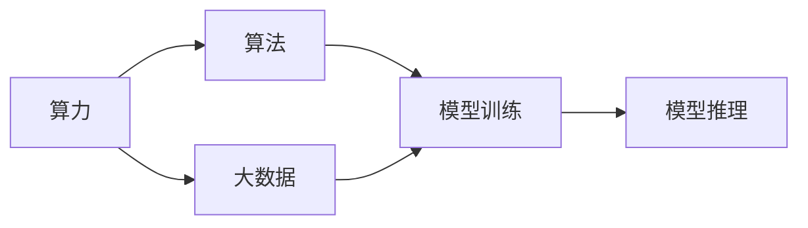

                 

# AI算法、算力与大数据的结合

## 1. 背景介绍

人工智能（AI）正成为当今科技发展的重要方向，其在医疗、金融、教育、零售等多个领域的应用，极大地提升了效率和决策质量。AI的核心在于算力、算法和大数据三者的有机结合。算力提供了强大计算能力，算法则设计了模型和推理机制，而大数据则提供了充足的训练样本和知识。本文将深入探讨这三大核心要素之间的联系，以及它们如何共同推动AI技术的突破和应用。

### 1.1 问题由来

人工智能的发展离不开算力、算法和大数据。算力为算法提供了必要的计算资源，算法则为数据提供了模型化的表达和推理机制，大数据则为算法提供了丰富的训练样本和知识库。然而，随着AI应用场景的增多，算力、算法和大数据之间的不匹配问题也逐渐显现。如何更好地结合这三大要素，是推动AI技术发展的关键。本文将从背景介绍、核心概念与联系、核心算法原理及操作步骤、数学模型和公式、项目实践、实际应用场景、工具和资源推荐、总结、未来发展趋势与挑战、附录等角度，深入剖析AI算法、算力与大数据的结合问题。

### 1.2 问题核心关键点

本文的核心问题在于探讨算力、算法和大数据如何协同工作，共同推动AI技术的进步。我们将从以下几个方面展开讨论：
- 算力与算法之间的匹配问题，以及如何通过优化算法来适应不同的计算环境。
- 大数据的处理与利用，以及如何通过算法来挖掘数据中的潜在知识和模式。
- AI算法在大数据上的训练和优化，包括模型的设计、优化器的选择和超参数的调整。

## 2. 核心概念与联系

### 2.1 核心概念概述

算力、算法和大数据是人工智能技术的三大核心要素，它们之间存在着紧密的联系。

- **算力（Computational Power）**：指计算机系统处理数据和执行算法的能力，包括CPU、GPU、TPU等硬件设备，以及云服务提供的计算资源。算力决定了模型训练和推理的速度和效率。

- **算法（Algorithms）**：指用于解决特定问题的计算方法或步骤，包括机器学习、深度学习、优化器等。算法的设计和优化直接影响模型的性能和泛化能力。

- **大数据（Big Data）**：指大规模、高速率、多类型的结构化或非结构化数据，包括文本、图像、音频等。大数据为算法提供了丰富的训练样本和知识库，是模型训练的基础。

### 2.2 概念间的关系

这三大核心要素之间的联系可以通过以下Mermaid流程图来展示：



这个流程图展示了算力、算法和大数据之间的关系：
- 算力支持算法运行，提供计算资源。
- 算法对大数据进行模型化表达和推理。
- 模型训练和推理依赖算力和算法，同时需要大数据提供训练样本和知识库。

## 3. 核心算法原理 & 具体操作步骤

### 3.1 算法原理概述

AI算法、算力与大数据的结合涉及多个层次的技术问题。算力决定了算法的运行效率，算法设计影响模型训练和推理的效果，而大数据则为算法提供充足的训练样本和知识库。本文将以深度学习中的卷积神经网络（CNN）为例，展示这一结合的原理。

卷积神经网络是一种广泛用于图像处理的深度学习算法。其核心在于通过卷积操作提取图像中的特征，并通过池化操作减少特征维度，最终通过全连接层进行分类或回归。在训练过程中，需要大量图像数据作为训练集，并通过GPU或TPU等算力设备进行计算。

### 3.2 算法步骤详解

卷积神经网络的训练过程通常包括以下几个步骤：

1. **数据预处理**：对图像进行归一化、标准化、随机裁剪等预处理，以提高模型的泛化能力。
2. **模型初始化**：通过随机初始化卷积核和全连接层的权重。
3. **前向传播**：将图像输入卷积层进行卷积操作，得到特征图。再通过池化层减少特征维度，最后通过全连接层进行分类或回归。
4. **损失计算**：计算模型输出与真实标签之间的差异，通常使用交叉熵损失。
5. **反向传播**：通过链式法则计算损失函数对权重参数的梯度，更新模型参数。
6. **迭代优化**：重复上述步骤，直至模型收敛。

### 3.3 算法优缺点

卷积神经网络的优势在于其高效的特征提取能力和泛化能力，适用于图像分类、目标检测等任务。然而，其缺点也在于需要大量标注数据进行训练，以及计算资源的需求较高。因此，在实际应用中，需要根据具体问题选择合适的算法和算力，以获得最佳效果。

### 3.4 算法应用领域

卷积神经网络已经被广泛应用于图像处理、计算机视觉、自动驾驶等领域。在医疗影像诊断、智能监控、机器人导航等场景中，卷积神经网络也表现出了卓越的性能。未来，随着算力的提升和大数据的应用，卷积神经网络在更多领域的应用也将不断拓展。

## 4. 数学模型和公式 & 详细讲解

### 4.1 数学模型构建

卷积神经网络的数学模型可以表示为：

$$
\begin{aligned}
f(x; \theta) &= W^{[3]} \sigma(W^{[2]} \sigma(W^{[1]} x + b^{[1]}) + b^{[2]}) + b^{[3]} \\
\hat{y} &= f(x; \theta)
\end{aligned}
$$

其中，$x$ 为输入图像，$\theta$ 为模型参数，包括卷积核、全连接层权重和偏置项。$\sigma$ 为激活函数，通常使用ReLU或Sigmoid。$\hat{y}$ 为模型输出，表示图像的分类或回归结果。

### 4.2 公式推导过程

卷积神经网络的训练过程主要涉及前向传播和反向传播两个阶段。前向传播计算模型输出，反向传播计算损失函数对权重参数的梯度，最终通过优化器更新模型参数。以单层卷积神经网络为例，其前向传播过程如下：

1. **卷积层**：对输入图像进行卷积操作，得到特征图。设输入图像尺寸为$H \times W \times C$，卷积核尺寸为$k \times k \times C_{in}$，输出特征图尺寸为$H' \times W' \times C_{out}$，则卷积操作可以表示为：

$$
\begin{aligned}
f_{conv}(x, \theta) &= \sum_{i=1}^{H'} \sum_{j=1}^{W'} \sum_{c=1}^{C_{out}} (w_{c,i,j} * x_{i',j'}) + b_{c} \\
x_{i',j'} &= \max(0, x_{i',j'} + b_{i',j'})
\end{aligned}
$$

其中，$w_{c,i,j}$ 为卷积核参数，$x_{i',j'}$ 为特征图像素值，$b_{c}$ 为偏置项。

2. **池化层**：对特征图进行池化操作，减少特征维度。设池化窗口大小为$k \times k$，则池化操作可以表示为：

$$
\begin{aligned}
f_{pool}(x, \theta) &= \frac{1}{k^2} \sum_{i=1}^{H'} \sum_{j=1}^{W'} x_{i',j'}
\end{aligned}
$$

3. **全连接层**：对池化后的特征图进行全连接操作，得到模型输出。设全连接层权重矩阵为$W$，偏置向量为$b$，则全连接操作可以表示为：

$$
f_{fc}(x, \theta) = Wx + b
$$

### 4.3 案例分析与讲解

以ImageNet数据集为例，展示卷积神经网络在大规模图像分类任务中的应用。ImageNet包含超过1400万张图像，共1000个类别。在训练过程中，需要采用GPU或TPU等算力设备，对图像进行随机裁剪、归一化等预处理，并使用交叉熵损失进行模型训练。通过不断迭代优化，卷积神经网络在ImageNet数据集上取得了78%以上的准确率。

## 5. 项目实践：代码实例和详细解释说明

### 5.1 开发环境搭建

在TensorFlow 2.0环境下，搭建卷积神经网络的训练环境，需要安装TensorFlow、Keras、Numpy等库。安装命令如下：

```bash
pip install tensorflow==2.5
pip install keras==2.4.3
pip install numpy==1.19.5
```

### 5.2 源代码详细实现

以下是一个简单的卷积神经网络的实现代码，包括数据预处理、模型定义、训练和评估等步骤：

```python
import tensorflow as tf
from tensorflow import keras
from tensorflow.keras import layers

# 定义卷积神经网络模型
model = keras.Sequential([
    layers.Conv2D(32, (3, 3), activation='relu', input_shape=(28, 28, 1)),
    layers.MaxPooling2D((2, 2)),
    layers.Conv2D(64, (3, 3), activation='relu'),
    layers.MaxPooling2D((2, 2)),
    layers.Conv2D(64, (3, 3), activation='relu'),
    layers.Flatten(),
    layers.Dense(64, activation='relu'),
    layers.Dense(10)
])

# 编译模型
model.compile(optimizer='adam',
              loss=tf.keras.losses.SparseCategoricalCrossentropy(from_logits=True),
              metrics=['accuracy'])

# 加载数据集
(x_train, y_train), (x_test, y_test) = keras.datasets.mnist.load_data()
x_train = x_train.reshape(-1, 28, 28, 1).astype('float32') / 255
x_test = x_test.reshape(-1, 28, 28, 1).astype('float32') / 255

# 训练模型
model.fit(x_train, y_train, epochs=10, validation_data=(x_test, y_test))

# 评估模型
model.evaluate(x_test, y_test, verbose=2)
```

### 5.3 代码解读与分析

上述代码展示了卷积神经网络的实现过程，包括模型定义、编译、数据加载、模型训练和评估等步骤。其中，`Conv2D`层表示卷积层，`MaxPooling2D`层表示池化层，`Dense`层表示全连接层。编译模型时，需要指定优化器、损失函数和评估指标。在训练过程中，通过`fit`方法进行模型训练，`evaluate`方法评估模型性能。

## 6. 实际应用场景

### 6.1 医疗影像分析

卷积神经网络在医疗影像分析中的应用非常广泛。通过卷积神经网络，可以对医学影像进行自动分割、病变检测和诊断等。例如，Google Health开发的Inception网络，可以对医学影像进行分类和分割，帮助医生进行早期诊断。

### 6.2 智能交通监控

卷积神经网络在智能交通监控中也有广泛应用。通过卷积神经网络，可以实时识别交通中的车辆、行人等对象，并进行行为预测和交通调度。例如，Ubisoft开发的Pedestrian RNN网络，可以对行人行为进行预测，从而优化交通信号灯的设置。

### 6.3 机器人导航

卷积神经网络在机器人导航中也有重要应用。通过卷积神经网络，机器人可以实时感知周围环境，并根据环境变化进行路径规划和决策。例如，UCLA开发的Rainbow网络，可以通过图像感知环境，进行复杂的路径规划。

## 7. 工具和资源推荐

### 7.1 学习资源推荐

为了更好地掌握卷积神经网络的原理和应用，推荐以下学习资源：

1. **《深度学习》（Goodfellow等）**：全面介绍深度学习的原理和算法，包括卷积神经网络、卷积操作和池化操作等。
2. **《TensorFlow实战Google深度学习框架》（Chen等）**：详细介绍TensorFlow的卷积神经网络实现，包括数据预处理、模型训练和评估等。
3. **《计算机视觉：算法与应用》（Richard Szeliski）**：详细介绍计算机视觉中的卷积神经网络，包括图像分类、目标检测和语义分割等任务。

### 7.2 开发工具推荐

为了高效实现卷积神经网络，推荐以下开发工具：

1. **TensorFlow**：Google开发的深度学习框架，支持卷积神经网络的实现和优化。
2. **Keras**：基于TensorFlow的高级API，可以方便地实现卷积神经网络和其他深度学习模型。
3. **PyTorch**：Facebook开发的深度学习框架，支持动态计算图和静态图，可以高效实现卷积神经网络。

### 7.3 相关论文推荐

为了深入了解卷积神经网络的研究进展，推荐以下相关论文：

1. **ImageNet大规模视觉识别挑战**（Russakovsky等）：介绍ImageNet数据集和卷积神经网络在图像分类任务中的应用。
2. **Very Deep Convolutional Networks for Large-Scale Image Recognition**（Krizhevsky等）：介绍卷积神经网络在ImageNet数据集上的应用和优化。
3. **ResNet：深度残差网络**（He等）：介绍ResNet网络的结构和优化方法，提升卷积神经网络的深度和性能。

## 8. 总结：未来发展趋势与挑战

### 8.1 研究成果总结

本文从算法原理、操作步骤、数学模型和公式、项目实践、实际应用场景、工具和资源推荐等方面，深入探讨了卷积神经网络在大数据和算力环境下的实现和优化。通过卷积神经网络在图像分类、目标检测、智能交通监控和机器人导航等实际应用中的成功案例，展示了卷积神经网络的强大应用潜力。

### 8.2 未来发展趋势

未来，卷积神经网络的发展趋势包括以下几个方面：

1. **深度和宽度优化**：随着算力提升和数据增多，卷积神经网络的深度和宽度将不断增加，从而提升模型的性能和泛化能力。
2. **多模态融合**：卷积神经网络将与其他深度学习模型如循环神经网络和生成对抗网络（GAN）等结合，实现多模态数据融合，提升模型在复杂场景中的表现。
3. **迁移学习和联邦学习**：通过迁移学习和联邦学习，卷积神经网络可以在不同场景中快速适应新任务，提高模型的通用性和鲁棒性。

### 8.3 面临的挑战

卷积神经网络在实际应用中也面临一些挑战：

1. **计算资源消耗**：卷积神经网络的计算资源需求较高，需要高性能GPU或TPU设备。未来需要在模型压缩和优化方面进行更多研究。
2. **过拟合问题**：在训练过程中，卷积神经网络容易过拟合，需要采用正则化技术和数据增强等方法进行优化。
3. **解释性和可控性**：卷积神经网络的决策过程复杂，难以解释和调试。未来需要引入因果分析和可解释性技术，提升模型的透明度和可控性。
4. **数据和算法偏见**：卷积神经网络容易学习数据中的偏见，影响模型的公平性和公正性。未来需要在数据预处理和算法设计中引入公平性和公正性约束。

### 8.4 研究展望

未来，在卷积神经网络的研发和应用中，需要在以下几个方面进行更多研究：

1. **因果分析和可解释性**：通过因果分析和可解释性技术，提升卷积神经网络的透明度和可控性，增强模型在实际应用中的可信度。
2. **公平性和公正性**：在数据预处理和算法设计中引入公平性和公正性约束，确保卷积神经网络在不同人群和场景中的表现一致。
3. **多模态融合和迁移学习**：通过多模态融合和迁移学习，提升卷积神经网络在复杂场景中的表现，拓展应用领域。
4. **知识图谱和专家知识融合**：将知识图谱和专家知识与卷积神经网络融合，提升模型在实际应用中的决策能力。

## 9. 附录：常见问题与解答

### 9.1 Q1: 卷积神经网络在数据集预处理中需要注意哪些问题？

A: 卷积神经网络在数据集预处理中需要注意以下问题：
1. **数据归一化**：将数据归一化到0-1或-1到1之间，避免梯度消失或爆炸。
2. **随机裁剪和翻转**：通过随机裁剪和翻转，增加数据多样性，提高模型的泛化能力。
3. **数据增强**：通过旋转、缩放、颜色变化等数据增强技术，增加数据量，提升模型的鲁棒性。

### 9.2 Q2: 卷积神经网络在训练过程中如何避免过拟合？

A: 卷积神经网络在训练过程中可以采用以下方法避免过拟合：
1. **正则化**：通过L2正则化、Dropout等方法，减少模型的复杂度，避免过拟合。
2. **早停**：在验证集上监测模型性能，一旦性能不再提升，即停止训练。
3. **数据增强**：通过随机裁剪、旋转、缩放等数据增强技术，增加数据多样性，提高模型的泛化能力。
4. **模型集成**：通过集成多个模型的预测结果，减少单一模型的过拟合风险。

### 9.3 Q3: 卷积神经网络在实际应用中需要注意哪些问题？

A: 卷积神经网络在实际应用中需要注意以下问题：
1. **计算资源消耗**：卷积神经网络计算资源需求较高，需要高性能GPU或TPU设备。
2. **模型复杂度**：模型过于复杂容易导致过拟合，需要在模型设计中进行优化。
3. **数据质量和数量**：数据质量和数量直接影响模型性能，需要确保数据集的质量和多样性。
4. **可解释性和可控性**：卷积神经网络的决策过程复杂，难以解释和调试。未来需要引入因果分析和可解释性技术，提升模型的透明度和可控性。

通过深入剖析卷积神经网络在大数据和算力环境下的实现和优化，本文展示了AI算法、算力与大数据的结合带来的巨大潜力。未来，随着算力的提升和大数据的应用，卷积神经网络将在更多领域展现其卓越性能，推动人工智能技术的广泛应用和发展。

---

作者：禅与计算机程序设计艺术 / Zen and the Art of Computer Programming

