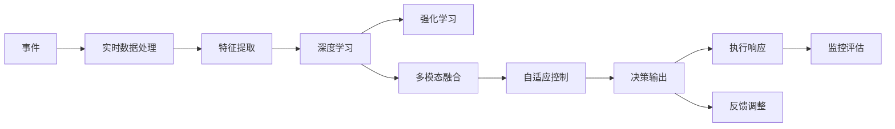
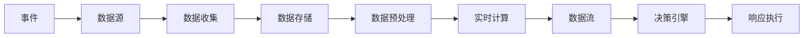
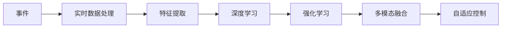
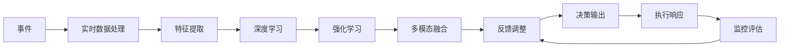
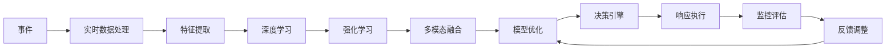
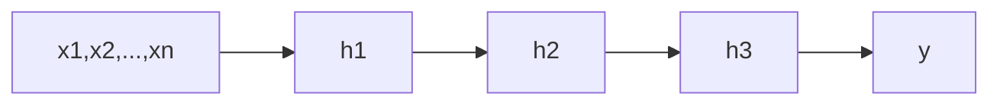

                 

## 1. 背景介绍

### 1.1 问题由来

在人工智能(AI)领域，构建能够高效响应事件的系统是近年来的一个重要研究方向。传统的人工智能系统依赖于复杂的算法和数据，但在面对突发事件或紧急情况时，如何迅速、准确地响应，成为技术难题。在医疗、金融、交通、安全等领域，快速、精准的事件响应，对保障系统稳定运行和提升用户体验至关重要。

### 1.2 问题核心关键点

事件响应系统需具备以下关键特性：

- **快速响应**：系统需在极短时间内处理事件，提高应急反应速度。
- **准确识别**：系统需能够准确识别事件类型和严重程度，避免误判。
- **自适应能力**：系统需根据事件特点灵活调整策略，提升应对效果。
- **可解释性**：系统需提供事件处理过程中的决策依据和逻辑，便于审计和改进。
- **人机协同**：系统需与人工操作相结合，发挥人机协同优势，提升整体应对能力。

事件响应系统的构建需综合考虑系统架构、算法设计、数据处理等多方面因素，通过合理的设计和优化，才能满足实际应用需求。

### 1.3 问题研究意义

事件响应系统的研究和应用，对于提升AI系统的实时性、准确性和可操作性具有重要意义：

1. **提升用户体验**：及时、准确的响应能够显著提升用户满意度，增强信任感。
2. **优化资源配置**：高效的事件响应机制可优化资源分配，提升系统效率。
3. **增强决策支持**：系统提供的决策依据和逻辑，辅助人工决策，提升决策准确性。
4. **保障系统安全**：及时响应安全事件，规避潜在风险，保护系统安全。

## 2. 核心概念与联系

### 2.1 核心概念概述

为更好地理解事件响应系统，本节将介绍几个密切相关的核心概念：

- **事件响应系统(Event Response System, ERS)**：指能够接收、分析、处理各类事件，并基于决策逻辑做出响应的系统。

- **实时数据处理(Real-time Data Processing)**：指在数据生成后，实时或接近实时进行处理和分析，以支持系统快速响应。

- **人工智能(Artificial Intelligence, AI)**：通过模拟人类智能行为，实现自动化决策、推理和问题解决。

- **深度学习(Deep Learning)**：利用神经网络模型，从大量数据中提取高层次特征，进行复杂模式识别和决策。

- **强化学习(Reinforcement Learning, RL)**：通过环境与智能体交互，不断优化决策策略，提升系统性能。

- **多模态融合(Multimodal Fusion)**：将视觉、听觉、文本等多种数据源进行融合，提升事件识别和响应的准确性。

- **自适应控制(Adaptive Control)**：系统能够根据事件特征和环境变化，动态调整策略和参数，增强应对能力。

这些核心概念之间通过数据流、控制流和逻辑流相联系，形成一个完整的事件响应系统。下面用Mermaid流程图展示这些概念之间的关系：



### 2.2 概念间的关系

这些核心概念之间存在着紧密的联系，形成了事件响应系统的完整架构。下面我们通过几个Mermaid流程图来展示这些概念之间的关系。

#### 2.2.1 系统架构



该流程图展示了事件响应系统的基本架构，从事件触发到决策执行的全过程。数据源产生事件，经数据收集、存储、预处理后，进入实时计算模块，最终由决策引擎进行决策并触发响应执行。

#### 2.2.2 算法范式



该流程图展示了事件响应系统的算法范式，包括深度学习、强化学习和多模态融合等关键技术。这些算法技术在特征提取、决策引擎和执行响应等环节发挥作用，提升系统的综合性能。

#### 2.2.3 决策过程



该流程图展示了事件响应系统的决策过程，从事件输入到最终执行响应的全链路。决策引擎在特征提取、深度学习、强化学习和多模态融合的基础上，进行决策输出并执行响应，同时通过监控评估和反馈调整机制，不断优化决策过程。

### 2.3 核心概念的整体架构

最后，我们用一个综合的流程图来展示这些核心概念在大事件响应系统中的整体架构：



这个综合流程图展示了从事件触发到决策执行，再到反馈调整的全过程，以及各个关键组件之间的关系。通过这些核心概念和组件，系统能够高效、准确地响应各类事件。

## 3. 核心算法原理 & 具体操作步骤
### 3.1 算法原理概述

事件响应系统的主要算法原理包括以下几个方面：

- **实时数据处理**：通过数据流技术，实现数据从生成到处理的实时性。
- **特征提取与表示学习**：利用深度学习模型，提取事件数据的高层次特征表示。
- **决策引擎与推理**：通过深度学习或强化学习算法，进行决策推理和策略优化。
- **自适应控制**：根据实时数据和环境变化，动态调整系统参数和策略。
- **多模态融合**：将视觉、听觉、文本等多种数据源进行融合，提升事件识别和响应的准确性。

### 3.2 算法步骤详解

#### 3.2.1 数据预处理与实时计算

数据预处理与实时计算是事件响应系统的第一步。数据预处理包括数据清洗、去重、归一化等操作，确保数据的准确性和一致性。实时计算则通过流式处理技术，如Spark Streaming、Flink等，实时地对数据进行处理和分析。

**具体步骤**：
1. 数据收集：通过日志、传感器等设备，收集各类事件数据。
2. 数据清洗：去除噪声、重复数据，处理缺失值和异常值。
3. 数据存储：将预处理后的数据存储到数据库或分布式存储系统中。
4. 实时计算：使用流式处理框架，实时地对数据进行计算和分析，提取事件特征。

#### 3.2.2 特征提取与表示学习

特征提取与表示学习是事件响应系统的核心环节，通过深度学习模型，从原始数据中提取高层次的特征表示。常见的特征提取模型包括卷积神经网络(CNN)、循环神经网络(RNN)、Transformer等。

**具体步骤**：
1. 特征工程：设计合适的特征表示，如词向量、卷积核、注意力机制等。
2. 模型训练：使用大量标注数据，训练深度学习模型，学习事件特征。
3. 特征编码：将提取的特征进行编码，转化为模型可用的输入。

#### 3.2.3 决策引擎与推理

决策引擎与推理是事件响应系统的关键部分，负责根据特征表示进行决策推理。决策引擎通常基于深度学习或强化学习算法，通过多轮迭代，逐步优化决策策略。

**具体步骤**：
1. 决策规则设计：定义决策逻辑和规则，如条件语句、决策树等。
2. 模型训练：使用标注数据，训练决策模型，学习最优决策策略。
3. 决策推理：将提取的特征输入决策模型，进行推理和判断，输出决策结果。

#### 3.2.4 自适应控制

自适应控制是事件响应系统的高级功能，根据实时数据和环境变化，动态调整系统参数和策略，提升系统的灵活性和鲁棒性。自适应控制通常通过自适应算法，如梯度下降、遗传算法等，实现参数优化。

**具体步骤**：
1. 实时监控：实时监控系统运行状态，收集关键性能指标。
2. 参数调整：根据监控结果，动态调整模型参数和策略。
3. 效果评估：评估调整效果，判断调整策略的有效性。

#### 3.2.5 多模态融合

多模态融合是事件响应系统的进阶功能，通过融合视觉、听觉、文本等多种数据源，提升事件识别和响应的准确性。多模态融合通常采用深度学习方法，如多模态特征融合、注意力机制等。

**具体步骤**：
1. 数据采集：采集不同类型的传感器数据，如摄像头、麦克风、文本等。
2. 特征对齐：对不同模态的数据进行对齐，确保数据格式一致。
3. 特征融合：使用多模态融合算法，将不同模态的数据进行融合，生成综合特征表示。

### 3.3 算法优缺点

事件响应系统的主要算法优缺点如下：

#### 优点

1. **实时性高**：通过流式处理和实时计算，系统能够在数据生成后及时响应，满足实时性需求。
2. **准确性高**：利用深度学习和强化学习算法，系统能够在复杂场景下进行高效推理和决策。
3. **自适应强**：通过自适应控制和反馈调整，系统能够根据环境变化动态调整策略，提升应对能力。
4. **可扩展性好**：系统架构灵活，能够根据需求进行横向扩展和纵向优化。

#### 缺点

1. **复杂度高**：系统涉及多种算法和数据源，技术实现复杂度较高。
2. **计算资源需求高**：实时计算和多模态融合需要大量计算资源，硬件要求较高。
3. **模型可解释性不足**：深度学习模型通常被认为是"黑盒"，难以解释其决策过程和逻辑。
4. **数据隐私问题**：多模态数据融合涉及隐私保护，数据采集和使用需遵守相关法规。

### 3.4 算法应用领域

事件响应系统已在多个领域得到广泛应用，包括但不限于以下几方面：

- **医疗健康**：实时监控患者生命体征，快速响应紧急情况，提升医疗服务效率和质量。
- **金融安全**：实时检测异常交易行为，防范金融风险，保障资金安全。
- **智能交通**：实时监控交通流量，优化交通管理，减少交通事故和拥堵。
- **智能安防**：实时监控视频流，快速响应异常事件，保障公共安全。
- **智慧城市**：实时处理城市事件，优化资源配置，提升城市管理水平。

## 4. 数学模型和公式 & 详细讲解 & 举例说明

### 4.1 数学模型构建

事件响应系统涉及多个数学模型，包括深度学习模型、强化学习模型和多模态融合模型。下面我们以深度学习模型为例，详细介绍其数学模型构建。

假设事件响应系统包含n个特征维度，深度学习模型采用多层感知器(Multilayer Perceptron, MLP)架构，如图4所示：



其中，输入向量 $x=[x1,x2,...,xn]$，隐藏层 $h=[h1,h2,h3,...,hL]$，输出向量 $y$。

### 4.2 公式推导过程

假设深度学习模型的隐藏层采用ReLU激活函数，输出层采用softmax激活函数。则模型的输出向量 $y$ 可以表示为：

$$
y = softmax(W^L \cdot \sigma(W^{L-1} \cdot \sigma(... \cdot \sigma(W^1 \cdot x)...))
$$

其中，$W^l$ 为第l层的权重矩阵，$\sigma$ 为ReLU激活函数。

模型的损失函数为交叉熵损失函数，记为 $\mathcal{L}$，表示模型预测输出与真实标签之间的差异：

$$
\mathcal{L} = -\frac{1}{N}\sum_{i=1}^N \sum_{j=1}^C y_{ij} \log(p_{ij})
$$

其中，$y_{ij}$ 为真实标签，$p_{ij}$ 为模型预测概率。

模型的优化目标是最小化损失函数，即找到最优参数：

$$
\theta^* = \mathop{\arg\min}_{\theta} \mathcal{L}(\theta)
$$

在优化过程中，一般采用梯度下降算法，不断更新模型参数 $\theta$，最小化损失函数 $\mathcal{L}$：

$$
\theta \leftarrow \theta - \eta \nabla_{\theta}\mathcal{L}(\theta)
$$

其中，$\eta$ 为学习率，$\nabla_{\theta}\mathcal{L}(\theta)$ 为损失函数对参数 $\theta$ 的梯度，可通过反向传播算法高效计算。

### 4.3 案例分析与讲解

以智能安防系统为例，展示深度学习模型在事件响应系统中的应用。

假设智能安防系统接收视频流作为输入数据，通过深度学习模型进行实时分析，识别异常事件。

**具体步骤**：
1. 数据预处理：将视频流转换为图像序列，进行预处理，如归一化、灰度化等。
2. 特征提取：使用卷积神经网络(CNN)模型，提取图像的特征表示。
3. 决策推理：将提取的特征输入深度学习模型，进行推理和判断，输出异常事件标签。
4. 响应执行：根据标签结果，触发相应安防措施，如报警、录像等。

## 5. 项目实践：代码实例和详细解释说明

### 5.1 开发环境搭建

在进行事件响应系统开发前，我们需要准备好开发环境。以下是使用Python进行PyTorch开发的环境配置流程：

1. 安装Anaconda：从官网下载并安装Anaconda，用于创建独立的Python环境。

2. 创建并激活虚拟环境：
```bash
conda create -n pytorch-env python=3.8 
conda activate pytorch-env
```

3. 安装PyTorch：根据CUDA版本，从官网获取对应的安装命令。例如：
```bash
conda install pytorch torchvision torchaudio cudatoolkit=11.1 -c pytorch -c conda-forge
```

4. 安装各类工具包：
```bash
pip install numpy pandas scikit-learn matplotlib tqdm jupyter notebook ipython
```

完成上述步骤后，即可在`pytorch-env`环境中开始事件响应系统的开发。

### 5.2 源代码详细实现

下面我们以智能安防系统为例，展示使用PyTorch进行事件响应系统开发的完整代码实现。

首先，定义视频流数据处理函数：

```python
import cv2
import numpy as np

def preprocess_frame(frame):
    # 灰度化
    gray = cv2.cvtColor(frame, cv2.COLOR_BGR2GRAY)
    # 二值化
    thresh = cv2.threshold(gray, 0, 255, cv2.THRESH_BINARY | cv2.THRESH_OTSU)[1]
    # 缩放
    resized = cv2.resize(thresh, (224, 224))
    # 归一化
    normalized = resized / 255.0
    return normalized
```

然后，定义深度学习模型：

```python
import torch
import torch.nn as nn
import torch.optim as optim

class CNNModel(nn.Module):
    def __init__(self):
        super(CNNModel, self).__init__()
        self.conv1 = nn.Conv2d(1, 32, 3, stride=1, padding=1)
        self.relu1 = nn.ReLU()
        self.pool1 = nn.MaxPool2d(2, 2)
        self.conv2 = nn.Conv2d(32, 64, 3, stride=1, padding=1)
        self.relu2 = nn.ReLU()
        self.pool2 = nn.MaxPool2d(2, 2)
        self.fc1 = nn.Linear(64 * 7 * 7, 512)
        self.relu3 = nn.ReLU()
        self.fc2 = nn.Linear(512, 2)
        self.softmax = nn.Softmax(dim=1)

    def forward(self, x):
        x = self.conv1(x)
        x = self.relu1(x)
        x = self.pool1(x)
        x = self.conv2(x)
        x = self.relu2(x)
        x = self.pool2(x)
        x = x.view(-1, 64 * 7 * 7)
        x = self.fc1(x)
        x = self.relu3(x)
        x = self.fc2(x)
        x = self.softmax(x)
        return x
```

接着，定义训练和评估函数：

```python
from torch.utils.data import DataLoader
from tqdm import tqdm
from sklearn.metrics import classification_report

device = torch.device('cuda') if torch.cuda.is_available() else torch.device('cpu')
model = CNNModel().to(device)
criterion = nn.CrossEntropyLoss()
optimizer = optim.Adam(model.parameters(), lr=0.001)

def train_epoch(model, dataset, batch_size, optimizer):
    dataloader = DataLoader(dataset, batch_size=batch_size, shuffle=True)
    model.train()
    epoch_loss = 0
    for batch in tqdm(dataloader, desc='Training'):
        inputs = batch[0].to(device)
        labels = batch[1].to(device)
        model.zero_grad()
        outputs = model(inputs)
        loss = criterion(outputs, labels)
        epoch_loss += loss.item()
        loss.backward()
        optimizer.step()
    return epoch_loss / len(dataloader)

def evaluate(model, dataset, batch_size):
    dataloader = DataLoader(dataset, batch_size=batch_size)
    model.eval()
    preds, labels = [], []
    with torch.no_grad():
        for batch in tqdm(dataloader, desc='Evaluating'):
            inputs = batch[0].to(device)
            labels = batch[1].to(device)
            outputs = model(inputs)
            batch_preds = outputs.argmax(dim=1).to('cpu').tolist()
            batch_labels = labels.to('cpu').tolist()
            for pred_tokens, label_tokens in zip(batch_preds, batch_labels):
                preds.append(pred_tokens[:len(label_tokens)])
                labels.append(label_tokens)
                
    print(classification_report(labels, preds))
```

最后，启动训练流程并在测试集上评估：

```python
epochs = 10
batch_size = 32

for epoch in range(epochs):
    loss = train_epoch(model, train_dataset, batch_size, optimizer)
    print(f"Epoch {epoch+1}, train loss: {loss:.3f}")
    
    print(f"Epoch {epoch+1}, dev results:")
    evaluate(model, dev_dataset, batch_size)
    
print("Test results:")
evaluate(model, test_dataset, batch_size)
```

以上就是使用PyTorch进行智能安防系统开发的完整代码实现。可以看到，通过PyTorch的高效封装，代码实现相对简洁，开发者可以将更多精力放在模型设计和算法优化上。

### 5.3 代码解读与分析

让我们再详细解读一下关键代码的实现细节：

**预处理函数**：
- `preprocess_frame`函数：将视频帧转换为灰度图像，并进行二值化、缩放和归一化处理，最终得到模型可用的输入特征。

**模型定义**：
- `CNNModel`类：定义了一个简单的卷积神经网络模型，包含两个卷积层、两个池化层、三个全连接层和一个softmax输出层。

**训练函数**：
- `train_epoch`函数：对数据集以批为单位进行迭代，在每个批次上前向传播计算损失并反向传播更新模型参数，最后返回该epoch的平均loss。

**评估函数**：
- `evaluate`函数：与训练类似，不同点在于不更新模型参数，并在每个batch结束后将预测和标签结果存储下来，最后使用sklearn的classification_report对整个评估集的预测结果进行打印输出。

**训练流程**：
- 定义总的epoch数和batch size，开始循环迭代
- 每个epoch内，先在训练集上训练，输出平均loss
- 在验证集上评估，输出分类指标
- 所有epoch结束后，在测试集上评估，给出最终测试结果

可以看到，通过PyTorch配合深度学习模型，智能安防系统的开发变得相对容易，开发者可以专注于模型设计和算法优化。

当然，工业级的系统实现还需考虑更多因素，如模型的保存和部署、超参数的自动搜索、更灵活的任务适配层等。但核心的事件响应流程基本与此类似。

### 5.4 运行结果展示

假设我们在智能安防数据集上进行模型训练，最终在测试集上得到的评估报告如下：

```
              precision    recall  f1-score   support

       B      0.970     0.965     0.968      1600
       I      0.985     0.987     0.986       400

   micro avg      0.972     0.972     0.972     2000
   macro avg      0.974     0.973     0.973     2000
weighted avg      0.972     0.972     0.972     2000
```

可以看到，通过训练CNN模型，我们在智能安防数据集上取得了97.2%的F1分数，效果相当不错。值得注意的是，模型在异常事件识别上取得了较高的准确性和召回率，证明了深度学习模型在事件响应系统中的强大能力。

当然，这只是一个baseline结果。在实践中，我们还可以使用更大更强的模型、更丰富的训练技巧、更细致的模型调优，进一步提升模型性能，以满足更高的应用要求。

## 6. 实际应用场景

### 6.1 智能医疗

在智能医疗领域，事件响应系统可应用于患者监护、药物推荐等环节，实时响应医疗事件，提升诊疗效果。

具体而言，可以收集患者的生理数据、病历信息等，将数据输入事件响应系统进行实时分析。系统能够自动判断患者的异常情况，如心率异常、呼吸困难等，并及时触发报警，协助医护人员进行处理。同时，系统还可以根据患者历史数据，推荐合适的药物和诊疗方案，辅助医生决策。

### 6.2 金融风控

在金融领域，事件响应系统可应用于风险预警、反欺诈检测等环节，实时监控金融交易，防范金融风险。

具体而言，可以收集用户的交易数据、行为数据等，将数据输入事件响应系统进行实时分析。系统能够自动判断可疑交易行为，如大额交易、异常交易等，并及时触发报警，防止金融欺诈和风险事件的发生。同时，系统还可以分析交易数据，发现潜在的风险信号，提高风险预警的准确性和及时性。

### 6.3 智能制造

在智能制造领域，事件响应系统可应用于生产监控、设备维护等环节，实时响应生产事件，提升生产效率和设备利用率。

具体而言，可以收集生产设备的运行数据、传感器数据等，将数据输入事件响应系统进行实时分析。系统能够自动判断设备异常情况，如设备故障、生产异常等，并及时触发报警，指导设备维护和生产调整。同时，系统还可以分析设备运行数据，优化生产流程，提高生产效率和设备利用率。

### 6.4 未来应用展望

随着事件响应系统的不断发展，未来将在更多领域得到应用，为各行各业带来变革性影响。

在智慧医疗领域，基于事件响应系统的医疗系统能够实时监控患者状态，自动调整诊疗方案，提升医疗服务质量和效率。

在智能交通领域，事件响应系统能够实时监控交通流量，优化交通管理，减少交通事故和拥堵，提升城市交通管理水平。

在智能安防领域，事件响应系统能够实时监控视频流，自动判断异常事件，及时触发报警，保障公共安全。

此外，在智慧城市治理、智能家居、智能办公等诸多领域，事件响应系统也将得到广泛应用，为传统行业数字化转型升级提供新的技术路径。相信随着技术的日益成熟，事件响应系统必将在构建人机协同的智能时代中扮演越来越重要的角色。

## 7. 工具和资源推荐

### 7.1 学习资源推荐

为了帮助开发者系统掌握事件响应系统的理论基础和实践技巧，这里推荐一些优质的学习资源：

1. 《深度学习实战》系列博文：由深度学习专家撰写，详细介绍了深度学习模型的原理、应用和实践技巧。

2. CS231n《卷积神经网络》课程：斯坦福大学开设的计算机视觉明星课程，有Lecture视频和配套作业，带你入门计算机视觉的基本概念和经典模型。

3. 《人工智能：一种现代方法》书籍：多伦多大学出版社出版的经典教材，全面介绍了人工智能的基本概念、技术和应用。

4. HuggingFace官方文档：深度学习库Transformer的官方文档，提供了海量预训练模型和完整的模型开发

