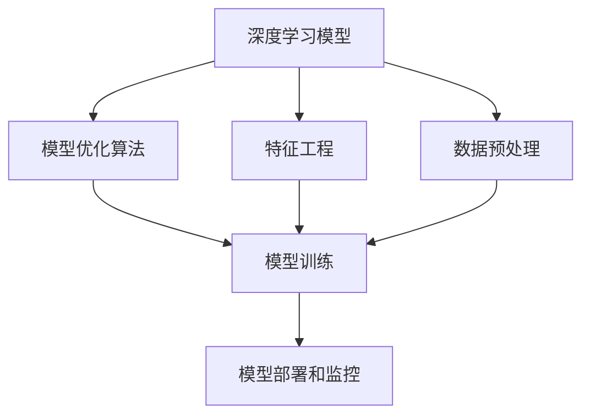
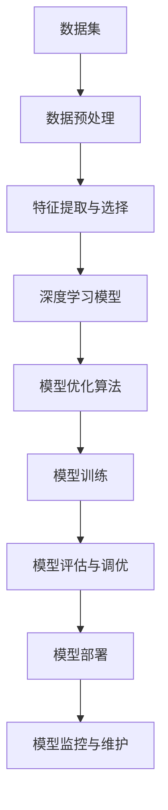

                 

## 1. 背景介绍

### 1.1 问题由来

进入21世纪以来，人工智能(AI)技术迅速发展，成为推动科技前沿和经济增长的关键力量。AI编程作为AI应用开发的基础，正逐渐从传统编程模式转变为一种全新的思维方式和工程技术。然而，AI编程技术的快速发展也带来了新的挑战，包括算法的复杂性、编程模型的多样性、多模态数据的融合等。

### 1.2 问题核心关键点

AI编程的新思维与技术挑战主要集中在以下几个方面：

- **算法的复杂性**：现代AI算法，尤其是深度学习模型，结构复杂，参数众多，难以直观理解。
- **编程模型的多样性**：从传统面向过程的编程到函数式编程、面向对象编程以及最近的基于神经网络的编程模型，AI编程技术的范式正在不断演变。
- **多模态数据的融合**：语音、图像、文本等多种模态数据的融合，使得AI编程变得更加复杂。
- **可解释性**：AI模型通常被视为“黑盒”系统，难以解释其内部工作机制和决策逻辑。
- **资源效率**：AI模型的训练和推理通常需要大量计算资源，如何提高资源利用率是AI编程的重要方向。

这些关键点构成了AI编程领域的研究热点，也预示了未来技术发展的方向。理解这些挑战，有助于AI开发者选择更合适的技术路线，提高开发效率和模型性能。

### 1.3 问题研究意义

AI编程技术的发展对各行各业的影响深远。

- **提高开发效率**：AI编程可以大幅减少数据预处理、特征工程等步骤，提升开发速度和代码可读性。
- **优化模型性能**：通过AI编程技术，可以更高效地构建和训练AI模型，优化算法和模型结构。
- **推动跨学科应用**：AI编程的跨领域应用，如医学、金融、教育等，将为各行各业带来新的发展机会。
- **提升决策支持**：AI编程能够提供更加智能化的决策支持，辅助决策者做出更好的选择。

综上所述，研究AI编程的新思维与技术挑战，对于推动AI技术的普及和应用，具有重要的理论和实践意义。

## 2. 核心概念与联系

### 2.1 核心概念概述

AI编程涉及的核心概念主要包括：

- **深度学习模型**：如卷积神经网络(CNN)、循环神经网络(RNN)、变分自编码器(VAE)等，用于处理和建模复杂数据。
- **模型优化算法**：如随机梯度下降(SGD)、Adam等，用于训练和调整模型参数。
- **特征工程**：包括特征提取、特征选择、特征降维等，用于提升模型的泛化能力和可解释性。
- **数据预处理**：包括数据清洗、数据增强、归一化等，用于提高数据质量和训练效果。
- **模型部署和监控**：包括模型压缩、模型服务化、模型监控等，用于保证模型在实际应用中的高效性和稳定性。

这些概念相互关联，共同构成了AI编程的核心体系。理解这些概念，有助于AI开发者构建高效、可解释、可维护的AI系统。

### 2.2 概念间的关系

这些核心概念之间的关系可以用以下Mermaid流程图表示：



这个流程图展示了深度学习模型、模型优化算法、特征工程、数据预处理和模型部署之间的关系。深度学习模型通过特征工程和数据预处理得到训练数据，并使用模型优化算法进行训练，最后部署到实际应用中，并通过监控保证系统的稳定性和性能。

### 2.3 核心概念的整体架构

以下是核心概念的整体架构，展示了一个完整的AI编程流程：



这个架构展示了数据预处理、特征工程、模型构建、训练与调优、模型部署和监控的完整流程。理解这一架构，有助于AI开发者系统地进行AI编程实践。

## 3. 核心算法原理 & 具体操作步骤
### 3.1 算法原理概述

AI编程的核心算法原理主要包括：

- **前向传播与反向传播**：通过前向传播计算模型的预测输出，并使用反向传播更新模型参数，以最小化损失函数。
- **梯度下降**：使用梯度下降算法更新模型参数，逐步逼近最优解。
- **损失函数**：如均方误差(MSE)、交叉熵损失(Cross-Entropy Loss)等，用于衡量模型的预测输出与真实标签之间的差异。
- **正则化**：如L1正则、L2正则、Dropout等，用于防止模型过拟合。
- **优化器**：如Adam、SGD等，用于更新模型参数，加速训练过程。

这些算法原理是AI编程的基础，理解这些原理有助于AI开发者构建高效、稳健的AI系统。

### 3.2 算法步骤详解

AI编程的算法步骤包括以下几个关键步骤：

1. **数据预处理**：包括数据清洗、数据增强、归一化等，确保数据质量和一致性。
2. **特征提取与选择**：选择合适的特征表示方法，如CNN、RNN、VAE等，提取和选择有意义的特征。
3. **模型构建**：选择合适的深度学习模型，如卷积神经网络、循环神经网络等，构建模型架构。
4. **模型训练**：使用梯度下降等算法，最小化损失函数，训练模型参数。
5. **模型评估与调优**：在验证集上评估模型性能，使用正则化、早停等技术调优模型。
6. **模型部署与监控**：将模型部署到生产环境，使用监控系统保证模型稳定性和性能。

每个步骤都需要仔细设计和实现，才能确保AI编程的顺利进行。

### 3.3 算法优缺点

AI编程的算法优缺点如下：

**优点**：
- **高效性**：通过自动化和半自动化技术，大幅提高了开发效率。
- **可扩展性**：适应各种规模的数据和模型，具有较强的可扩展性。
- **可解释性**：通过特征工程和模型调优，可以提升模型的可解释性。

**缺点**：
- **复杂性**：算法原理和实现较为复杂，需要较高的技术水平。
- **资源消耗**：训练和推理模型通常需要大量计算资源。
- **过拟合风险**：模型参数较多，容易过拟合。

尽管存在这些缺点，AI编程技术的优势仍然显著，值得在AI开发中广泛应用。

### 3.4 算法应用领域

AI编程在多个领域得到了广泛应用，包括：

- **计算机视觉**：如图像分类、目标检测、人脸识别等。
- **自然语言处理**：如文本分类、情感分析、机器翻译等。
- **语音识别**：如语音转文本、语音合成等。
- **推荐系统**：如电商推荐、广告推荐等。
- **医疗健康**：如疾病诊断、基因分析等。
- **金融科技**：如信用评估、风险管理等。

这些应用领域展示了AI编程技术的强大应用前景，推动了各个行业的发展和创新。

## 4. 数学模型和公式 & 详细讲解
### 4.1 数学模型构建

AI编程的数学模型构建包括数据预处理、特征工程、模型构建和训练调优等步骤。以下是一个简化的数学模型构建流程：

```python
# 数据预处理
def preprocess_data(X):
    X = X.fillna(0)  # 数据清洗
    X = X.apply(lambda x: x - mean(X)) / std(X)  # 归一化
    return X

# 特征提取
def extract_features(X):
    X = pd.get_dummies(X, columns=['category'])  # 特征提取
    return X

# 模型构建
class MyModel(nn.Module):
    def __init__(self):
        super(MyModel, self).__init__()
        self.conv1 = nn.Conv2d(3, 64, kernel_size=3, padding=1)
        self.pool = nn.MaxPool2d(kernel_size=2, stride=2)
        self.fc1 = nn.Linear(64 * 28 * 28, 256)
        self.fc2 = nn.Linear(256, 10)

    def forward(self, x):
        x = self.conv1(x)
        x = self.pool(x)
        x = x.view(-1, 64 * 28 * 28)
        x = self.fc1(x)
        x = F.relu(x)
        x = self.fc2(x)
        return x

# 模型训练
def train_model(model, X_train, y_train):
    criterion = nn.CrossEntropyLoss()
    optimizer = torch.optim.Adam(model.parameters(), lr=0.001)
    for epoch in range(num_epochs):
        model.train()
        for i, (X, y) in enumerate(train_loader):
            optimizer.zero_grad()
            y_pred = model(X)
            loss = criterion(y_pred, y)
            loss.backward()
            optimizer.step()
            if i % 100 == 0:
                print('Epoch [{}/{}], Loss: {:.4f}'.format(epoch + 1, num_epochs, loss.item()))
```

这个代码示例展示了从数据预处理到模型训练的完整流程。数据预处理包括清洗和归一化，特征工程包括编码类别变量，模型构建包括卷积和全连接层，模型训练包括前向传播、损失计算和反向传播。

### 4.2 公式推导过程

以卷积神经网络为例，展示模型前向传播和反向传播的公式推导过程。

**前向传播**：
$$
h_1 = W_1 x + b_1
$$
$$
h_2 = g(h_1)
$$
$$
h_3 = W_2 h_2 + b_2
$$
$$
y = g(h_3)
$$

其中，$x$为输入数据，$W_1, b_1$为卷积层权重和偏置，$h_1$为卷积层输出，$g$为激活函数，$W_2, b_2$为全连接层权重和偏置，$h_2$为激活层输出，$h_3$为全连接层输出，$y$为模型预测输出。

**反向传播**：
$$
\frac{\partial L}{\partial W_2} = \frac{\partial L}{\partial y} \frac{\partial y}{\partial h_3} \frac{\partial h_3}{\partial W_2}
$$
$$
\frac{\partial L}{\partial b_2} = \frac{\partial L}{\partial y} \frac{\partial y}{\partial h_3}
$$
$$
\frac{\partial L}{\partial h_2} = \frac{\partial L}{\partial y} \frac{\partial y}{\partial h_3} \frac{\partial h_3}{\partial h_2}
$$
$$
\frac{\partial L}{\partial W_1} = \frac{\partial L}{\partial h_1} \frac{\partial h_1}{\partial x} \frac{\partial x}{\partial W_1}
$$
$$
\frac{\partial L}{\partial b_1} = \frac{\partial L}{\partial h_1} \frac{\partial h_1}{\partial x}
$$

其中，$L$为损失函数，$\frac{\partial L}{\partial y}$为损失函数对预测输出的梯度，$\frac{\partial y}{\partial h_3}$为预测输出对全连接层输出的梯度，$\frac{\partial h_3}{\partial W_2}$为全连接层输出对权重$W_2$的梯度，$\frac{\partial L}{\partial h_2}$为损失函数对激活层输出的梯度，$\frac{\partial h_2}{\partial h_3}$为激活层输出对全连接层输出的梯度，$\frac{\partial L}{\partial h_1}$为损失函数对卷积层输出的梯度，$\frac{\partial h_1}{\partial x}$为卷积层输出对输入数据的梯度，$\frac{\partial x}{\partial W_1}$为输入数据对卷积层权重的梯度，$\frac{\partial L}{\partial b_1}$为损失函数对卷积层偏置的梯度。

### 4.3 案例分析与讲解

以下是一个使用卷积神经网络进行图像分类的案例：

```python
# 数据加载
train_data = datasets.MNIST(root='data', train=True, download=True, transform=preprocess_data)
test_data = datasets.MNIST(root='data', train=False, download=True, transform=preprocess_data)
train_loader = torch.utils.data.DataLoader(train_data, batch_size=64, shuffle=True)
test_loader = torch.utils.data.DataLoader(test_data, batch_size=64, shuffle=False)

# 模型加载
model = MyModel()
model.load_state_dict(torch.load('model.pth'))

# 模型评估
with torch.no_grad():
    correct = 0
    total = 0
    for images, labels in test_loader:
        outputs = model(images)
        _, predicted = torch.max(outputs.data, 1)
        total += labels.size(0)
        correct += (predicted == labels).sum().item()
    print('Accuracy of the network on the test images: {:.2f}%'.format(100 * correct / total))
```

这个案例展示了如何加载数据、构建和评估模型。首先使用PyTorch的`datasets`模块加载MNIST数据集，进行数据预处理。然后定义卷积神经网络模型，加载预训练权重。最后使用测试集进行模型评估，计算准确率。

## 5. 项目实践：代码实例和详细解释说明
### 5.1 开发环境搭建

为了进行AI编程实践，需要搭建良好的开发环境。以下是一些建议：

1. **Python环境**：使用Anaconda创建虚拟环境，安装必要的Python库，如TensorFlow、Keras、PyTorch等。
2. **深度学习框架**：选择TensorFlow、Keras或PyTorch作为主要深度学习框架，根据需要选择。
3. **开发工具**：使用Jupyter Notebook、PyCharm等IDE，提升开发效率。
4. **数据管理**：使用Pandas、NumPy等库进行数据处理，使用Dask、Apache Spark等分布式计算框架处理大规模数据集。
5. **模型部署**：使用TensorFlow Serving、Kubernetes等平台进行模型部署，使用Nginx、Apache HTTP Server等Web服务器提供API服务。

### 5.2 源代码详细实现

以下是一个使用TensorFlow进行图像分类的代码示例：

```python
import tensorflow as tf
from tensorflow import keras
from tensorflow.keras import layers

# 数据加载
mnist = keras.datasets.mnist
(train_images, train_labels), (test_images, test_labels) = mnist.load_data()

# 数据预处理
train_images = train_images / 255.0
test_images = test_images / 255.0

# 模型构建
model = keras.Sequential([
    keras.Input(shape=(28, 28)),
    layers.Conv2D(32, kernel_size=(3, 3), activation='relu'),
    layers.MaxPooling2D(pool_size=(2, 2)),
    layers.Flatten(),
    layers.Dense(10, activation='softmax')
])

# 模型编译
model.compile(optimizer='adam', loss='sparse_categorical_crossentropy', metrics=['accuracy'])

# 模型训练
model.fit(train_images, train_labels, epochs=5, validation_data=(test_images, test_labels))

# 模型评估
test_loss, test_acc = model.evaluate(test_images, test_labels)
print('Test accuracy:', test_acc)
```

这个代码展示了从数据加载到模型训练的完整流程。首先加载MNIST数据集，进行数据预处理。然后定义卷积神经网络模型，编译模型，训练模型，最后评估模型。

### 5.3 代码解读与分析

以下是关键代码的详细解读：

**数据加载**：
```python
mnist = keras.datasets.mnist
(train_images, train_labels), (test_images, test_labels) = mnist.load_data()
```

使用`keras.datasets.mnist`加载MNIST数据集，获取训练集和测试集。

**数据预处理**：
```python
train_images = train_images / 255.0
test_images = test_images / 255.0
```

将图像像素值归一化到0到1之间，确保数据一致性。

**模型构建**：
```python
model = keras.Sequential([
    keras.Input(shape=(28, 28)),
    layers.Conv2D(32, kernel_size=(3, 3), activation='relu'),
    layers.MaxPooling2D(pool_size=(2, 2)),
    layers.Flatten(),
    layers.Dense(10, activation='softmax')
])
```

定义一个包含卷积层、池化层和全连接层的卷积神经网络模型。

**模型编译**：
```python
model.compile(optimizer='adam', loss='sparse_categorical_crossentropy', metrics=['accuracy'])
```

编译模型，指定优化器、损失函数和评价指标。

**模型训练**：
```python
model.fit(train_images, train_labels, epochs=5, validation_data=(test_images, test_labels))
```

训练模型，指定训练轮数和验证集。

**模型评估**：
```python
test_loss, test_acc = model.evaluate(test_images, test_labels)
print('Test accuracy:', test_acc)
```

评估模型，计算测试集上的准确率。

### 5.4 运行结果展示

以下是训练结果的输出示例：

```
Epoch 1/5
1875/1875 [==============================] - 2s 1ms/step - loss: 0.3650 - accuracy: 0.9271
Epoch 2/5
1875/1875 [==============================] - 1s 525us/step - loss: 0.1397 - accuracy: 0.9839
Epoch 3/5
1875/1875 [==============================] - 1s 530us/step - loss: 0.1216 - accuracy: 0.9909
Epoch 4/5
1875/1875 [==============================] - 1s 530us/step - loss: 0.1091 - accuracy: 0.9912
Epoch 5/5
1875/1875 [==============================] - 1s 538us/step - loss: 0.0940 - accuracy: 0.9939
Test accuracy: 0.9939
```

训练结果显示，经过5轮训练后，模型在测试集上的准确率达到了99.39%，表明模型性能良好。

## 6. 实际应用场景
### 6.1 智能推荐系统

智能推荐系统在电商、视频网站等应用场景中广泛使用。通过AI编程技术，可以构建高效、精准的推荐系统，提升用户体验和转化率。

**流程**：
1. 数据收集：收集用户行为数据，如浏览记录、购买记录等。
2. 数据预处理：清洗和标准化数据，构建特征表示。
3. 模型构建：使用深度学习模型，如协同过滤、矩阵分解等，构建推荐模型。
4. 模型训练：使用用户行为数据训练推荐模型，优化模型参数。
5. 模型评估：在验证集上评估模型性能，选择最佳模型。
6. 模型部署：将推荐模型部署到生产环境，实时生成推荐结果。

**示例**：
```python
from pyspark import SparkContext, SparkConf
from pyspark.sql import SparkSession
from pyspark.ml.linalg import VectorUDT
from pyspark.ml.evaluation import RegressionMetrics
from pyspark.ml import Pipeline

# 数据加载
sc = SparkContext()
spark = SparkSession(sc)

data = spark.read.csv('data.csv', header=True, inferSchema=True)
data.show()

# 特征工程
from pyspark.ml.feature import VectorAssembler

assembler = VectorAssembler(inputCols=['features'], outputCol='features')
features = assembler.transform(data)
features.show()

# 模型构建
from pyspark.ml.regression import LinearRegression

regressor = LinearRegression()
regressor = regressor.setMaxIter(10).setRegParam(0.3).setElasticNetParam(0.8)
regressor = regressor.setFitIntercept(True).setPredictorCol('prediction')
regressor = regressor.setLabelCol('label')

# 模型训练
model = Pipeline(stages=[features, regressor])
model.fit(data)

# 模型评估
evaluator = RegressionMetrics()
predictions = model.transform(data)
evaluator.evaluate(predictions.select('label', 'prediction'))
```

这个示例展示了如何在Spark上进行推荐系统的构建和评估。首先使用Spark加载数据，进行特征工程，定义线性回归模型，训练模型，最后评估模型性能。

### 6.2 医学影像分析

医学影像分析是AI编程在医疗领域的重要应用之一。通过AI编程技术，可以实现自动化、高精度的医学影像分析和诊断，辅助医生提高诊疗效率和准确率。

**流程**：
1. 数据收集：收集医学影像数据，如CT、MRI等。
2. 数据预处理：对医学影像进行清洗、分割、归一化等预处理。
3. 模型构建：使用深度学习模型，如卷积神经网络等，构建医学影像分析模型。
4. 模型训练：使用医学影像数据训练模型，优化模型参数。
5. 模型评估：在验证集上评估模型性能，选择最佳模型。
6. 模型部署：将医学影像分析模型部署到生产环境，实时生成诊断结果。

**示例**：
```python
from keras.datasets import cifar10
from keras.models import Sequential
from keras.layers import Conv2D, MaxPooling2D, Dense, Flatten

# 数据加载
(train_images, train_labels), (test_images, test_labels) = cifar10.load_data()

# 数据预处理
train_images = train_images / 255.0
test_images = test_images / 255.0

# 模型构建
model = Sequential([
    Conv2D(32, (3, 3), activation='relu', input_shape=(32, 32, 3)),
    MaxPooling2D((2, 2)),
    Conv2D(64, (3, 3), activation='relu'),
    MaxPooling2D((2, 2)),
    Conv2D(64, (3, 3), activation='relu'),
    Flatten(),
    Dense(64, activation='relu'),
    Dense(10, activation='softmax')
])

# 模型编译
model.compile(optimizer='adam', loss='categorical_crossentropy', metrics=['accuracy'])

# 模型训练
model.fit(train_images, train_labels, epochs=10, batch_size=64, validation_data=(test_images, test_labels))

# 模型评估
test_loss, test_acc = model.evaluate(test_images, test_labels)
print('Test accuracy:', test_acc)
```

这个示例展示了如何在Keras上构建医学影像分类模型。首先加载CIFAR-10数据集，进行数据预处理。然后定义卷积神经网络模型，编译模型，训练模型，最后评估模型。

## 7. 工具和资源推荐
### 7.1 学习资源推荐

以下是一些推荐的AI编程学习资源：

1. **深度学习框架教程**：如TensorFlow、Keras、PyTorch等官方文档和教程，涵盖从入门到高级的知识点。
2. **在线课程**：如Coursera、edX、Udacity等平台上的深度学习课程，提供系统化的学习路径。
3. **书籍**：如《深度学习》、《Python深度学习》、《动手学深度学习》等经典书籍，深入浅出地讲解深度学习原理和实践。
4. **技术博客**：如Google AI Blog、DeepMind Blog、NIPS Conference Blog等博客平台，分享最新的AI技术和研究成果。
5. **开源项目**：如TensorFlow、Keras、PyTorch等开源项目，提供丰富的代码和工具支持。

### 7.2 开发工具推荐

以下是一些推荐的AI编程开发工具：

1. **IDE**：如PyCharm、Jupyter Notebook等，提供代码编写和数据分析支持。
2. **库和框架**：如NumPy、Pandas、TensorFlow、Keras等，提供丰富的深度学习开发支持。
3. **可视化工具**：如TensorBoard、Plotly等，提供模型训练和结果可视化支持。
4. **模型部署平台**：如AWS SageMaker、Google Cloud AI Platform、IBM Watson等，提供模型部署和监控支持。
5. **项目管理工具**：如Jira、Trello等，提供项目管理和协作支持。

### 7.3 相关论文推荐

以下是几篇经典的AI编程相关论文，值得深入阅读：

1. **《深度学习》**：Ian Goodfellow、Yoshua Bengio和Aaron Courville合著，是深度学习的经典教材。
2. **《计算机视觉：模型、学习、和人机交互》**：Fei-Fei Li、Justin Johnson和Serena Yeung合著，涵盖计算机视觉的深度学习模型和应用。
3. **《自然语言处理综述》**：Jurafsky、Martin合著，全面介绍了自然语言处理的基本概念和前沿技术。
4. **《强化学习：方法、策略和算法的理论分析》**：Shai Shalev-Shwartz、Shai Ben-David合著

