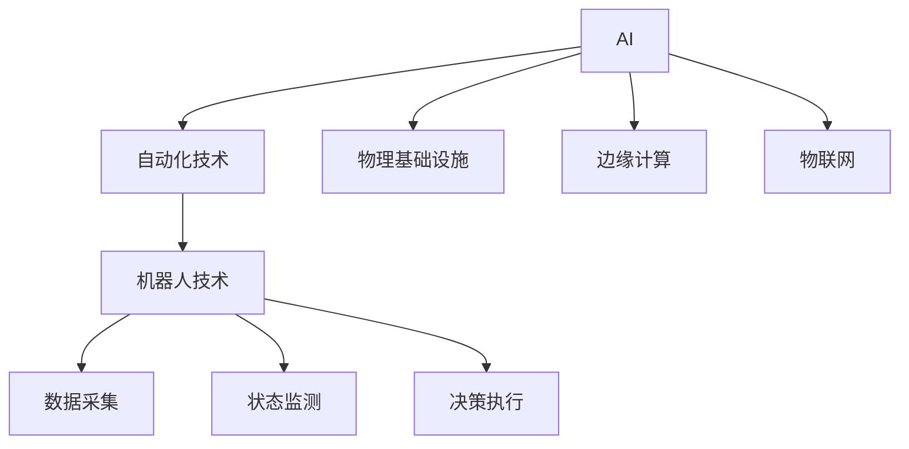
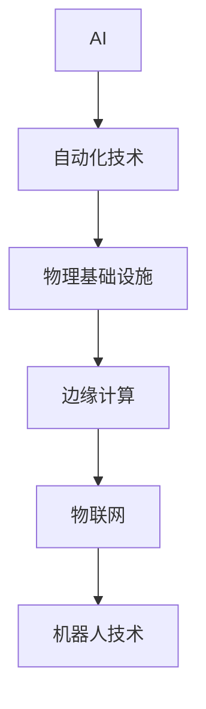
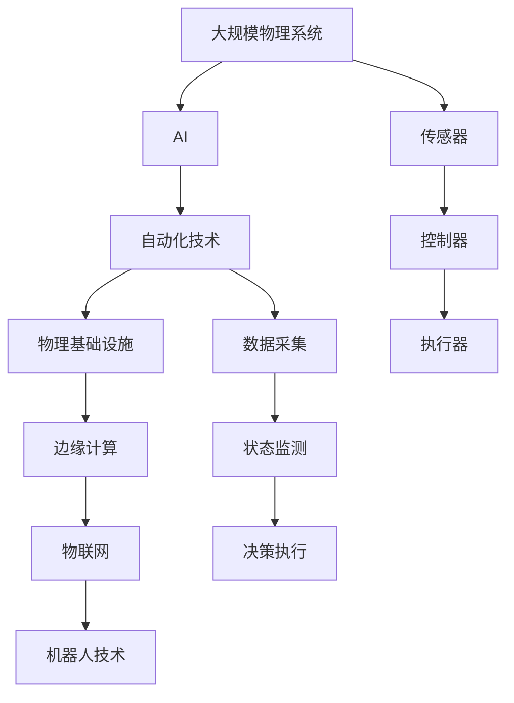

                 

# AI自动化物理基础设施

> 关键词：AI, 自动化, 物理基础设施, 机器学习, 机器人技术, 物联网, 边缘计算

## 1. 背景介绍

### 1.1 问题由来
随着人工智能（AI）技术的迅猛发展，越来越多的企业开始关注如何利用AI技术提升生产效率，降低成本。特别是近年来，AI在制造业、能源、交通等领域的应用越来越广泛。然而，这些领域的业务系统往往复杂庞大、系统性强，企业需要投入大量人力物力进行系统规划和实施。

为了更好地适应AI技术的应用趋势，企业开始寻求将AI技术与物理基础设施相结合的新方式。AI自动化物理基础设施（AI-APII）应运而生。通过AI自动化物理基础设施，企业可以高效地构建和运营物理系统，从而提升生产效率，降低运营成本，提升企业竞争力。

### 1.2 问题核心关键点
AI自动化物理基础设施的核心理念是利用AI技术和自动化技术，提升物理基础设施的效率和精度。其核心目标在于：

1. **高效构建系统**：通过AI算法和自动化流程，快速、准确地构建物理系统，降低人工成本和时间成本。
2. **精准运营管理**：利用AI技术实时监测和优化物理系统的运行状态，提升系统的稳定性和可靠性。
3. **智能决策支持**：利用AI分析大量历史数据，为物理系统的决策提供数据支持，提高决策的准确性和及时性。

## 2. 核心概念与联系

### 2.1 核心概念概述

为更好地理解AI自动化物理基础设施，本节将介绍几个密切相关的核心概念：

- **AI (人工智能)**：利用机器学习、深度学习等技术，使计算机系统具备模拟人类智能的行为和能力。
- **自动化技术**：通过编程实现的任务自动化，旨在提高工作效率和准确性，减少人为干预。
- **物理基础设施**：指用于支撑业务运行的各种硬件设备和设施，包括传感器、控制器、执行器等。
- **边缘计算**：将数据处理任务从云端迁移到设备端，减少数据传输和处理延迟，提升系统响应速度。
- **物联网（IoT）**：通过传感器、控制器等设备，将物理设备与互联网连接起来，实现设备间的互联互通。
- **机器人技术**：结合传感器、AI算法和机械臂等技术，实现自动化的物理操作和决策。

这些核心概念之间的逻辑关系可以通过以下Mermaid流程图来展示：



这个流程图展示了几大核心概念之间的联系：

1. AI通过机器学习等技术，提供了物理系统自动化的基础。
2. 自动化技术将AI算法应用于物理系统的构建和运营，提高效率和精度。
3. 物理基础设施是AI自动化技术的应用对象，包括传感器、控制器等。
4. 边缘计算将数据处理任务下放到设备端，提升了系统的实时性和可靠性。
5. 物联网将物理设备与互联网连接起来，实现了设备间的互联互通。
6. 机器人技术利用传感器、AI算法和机械臂等技术，实现了自动化的物理操作和决策。

### 2.2 概念间的关系

这些核心概念之间存在着紧密的联系，形成了AI自动化物理基础设施的完整生态系统。下面我通过几个Mermaid流程图来展示这些概念之间的关系。

#### 2.2.1 AI自动化物理基础设施的架构



这个综合流程图展示了AI自动化物理基础设施的整体架构：

1. AI技术为自动化技术提供了基础，自动化技术实现对物理基础设施的自动化管理和优化。
2. 物理基础设施通过边缘计算实现数据的实时处理，通过物联网实现设备间的互联互通。
3. 机器人技术利用传感器、AI算法和机械臂等技术，实现了物理系统的自动化操作和决策。

### 2.3 核心概念的整体架构

最后，我们用一个综合的流程图来展示这些核心概念在大规模物理系统中的应用：



这个综合流程图展示了AI自动化物理基础设施在实际应用中的完整流程：

1. 大规模物理系统包括传感器、控制器、执行器等，通过AI算法和自动化流程实现高效的构建和运营。
2. AI算法通过边缘计算实现数据的实时处理，通过物联网实现设备间的互联互通。
3. 机器人技术利用传感器、AI算法和机械臂等技术，实现物理系统的自动化操作和决策。

## 3. 核心算法原理 & 具体操作步骤
### 3.1 算法原理概述

AI自动化物理基础设施的核心算法主要涉及以下几个方面：

1. **机器学习**：利用历史数据和标注数据训练AI模型，提升物理系统的预测和决策能力。
2. **数据采集和处理**：通过传感器和控制器，采集物理系统的状态数据，并通过边缘计算实时处理，为AI模型提供数据支撑。
3. **自动化流程设计**：通过流程设计和自动化工具，将AI算法和物理系统的构建和运营相结合，提升效率和精度。
4. **状态监测和优化**：利用AI模型实时监测物理系统的运行状态，并根据监测结果进行优化和调整。

### 3.2 算法步骤详解

AI自动化物理基础设施的算法步骤主要包括以下几个关键步骤：

**Step 1: 数据采集和预处理**

- 选择合适的传感器和控制器，采集物理系统的状态数据。
- 对采集到的数据进行清洗、归一化和去噪等预处理，确保数据质量。
- 将数据通过网络传输到边缘计算节点进行实时处理。

**Step 2: 模型训练和优化**

- 选择适合的机器学习模型，利用历史数据和标注数据进行训练。
- 根据业务需求和系统特点，设计合适的训练和优化策略，提升模型精度。
- 通过交叉验证等技术，对模型进行验证和调优。

**Step 3: 自动化流程设计**

- 根据业务需求和系统特点，设计自动化流程，包括设备安装、系统调试、参数配置等。
- 利用自动化工具和流程，实现物理系统的构建和运营自动化。
- 对自动化流程进行测试和优化，确保其高效和稳定。

**Step 4: 状态监测和优化**

- 利用AI模型实时监测物理系统的运行状态，包括温度、湿度、振动等关键指标。
- 根据监测结果，自动调整系统的参数和配置，优化系统的性能。
- 记录和分析系统运行状态的历史数据，为未来的决策提供数据支持。

**Step 5: 决策支持**

- 利用AI模型对物理系统的运行状态进行分析，提供决策支持。
- 根据业务需求和系统特点，设计合适的决策算法，提升决策的及时性和准确性。
- 利用决策支持系统，辅助管理人员进行业务决策。

### 3.3 算法优缺点

AI自动化物理基础设施的算法具有以下优点：

1. **高效构建系统**：通过自动化流程设计和AI算法，可以快速构建复杂物理系统，降低人工成本和时间成本。
2. **精准运营管理**：利用AI技术实时监测和优化物理系统的运行状态，提升系统的稳定性和可靠性。
3. **智能决策支持**：利用AI分析大量历史数据，为物理系统的决策提供数据支持，提高决策的准确性和及时性。

然而，该算法也存在以下缺点：

1. **数据依赖性强**：AI算法需要大量的历史数据和标注数据进行训练，数据收集和标注成本较高。
2. **系统复杂度高**：物理系统往往复杂庞大，AI算法的实现和部署需要较高的技术门槛。
3. **数据安全风险**：物理系统的数据传输和处理可能涉及敏感信息，数据安全问题需要重点关注。
4. **模型泛化性不足**：AI模型可能因过拟合或数据偏差，无法很好地泛化到新的数据和场景。

### 3.4 算法应用领域

AI自动化物理基础设施已经在多个领域得到了广泛的应用，具体包括：

- **智能制造**：通过自动化流程设计和AI模型，实现智能生产线、智能仓储等系统的构建和运营。
- **智慧能源**：利用AI算法实时监测和优化能源系统的运行状态，提高能源利用效率。
- **智能交通**：通过AI技术实时监测交通流量和运行状态，提升交通管理水平。
- **智能物流**：利用AI算法优化物流路径和配送策略，提高物流效率和准确性。
- **智能安防**：通过AI算法实时监测和分析视频和图像数据，提高安防系统的响应速度和准确性。

## 4. 数学模型和公式 & 详细讲解  
### 4.1 数学模型构建

本节将使用数学语言对AI自动化物理基础设施的算法步骤进行更加严格的刻画。

设物理系统为 $S$，状态为 $s$，时间步长为 $t$。定义状态监测模型为 $M_{\theta}:\mathcal{S} \rightarrow \mathcal{Y}$，其中 $\mathcal{S}$ 为状态空间，$\mathcal{Y}$ 为输出空间，$\theta$ 为模型参数。假设系统状态数据为 $D=\{(s_i, y_i)\}_{i=1}^N$，其中 $s_i$ 为第 $i$ 个时间步长的系统状态，$y_i$ 为对应的监测结果。

定义模型 $M_{\theta}$ 在数据样本 $(s,y)$ 上的损失函数为 $\ell(M_{\theta}(s),y)$，则在数据集 $D$ 上的经验风险为：

$$
\mathcal{L}(\theta) = \frac{1}{N} \sum_{i=1}^N \ell(M_{\theta}(s_i),y_i)
$$

通过梯度下降等优化算法，最小化损失函数 $\mathcal{L}$，得到最优模型参数 $\theta^*$：

$$
\theta^* = \mathop{\arg\min}_{\theta} \mathcal{L}(\theta)
$$

在得到监测模型后，通过自动化流程设计和AI算法，将模型应用于物理系统的构建和运营。

### 4.2 公式推导过程

以下我们以智能制造为例，推导状态监测模型的损失函数及其梯度的计算公式。

假设系统状态 $s$ 包括温度 $T$、湿度 $H$ 和振动 $V$ 等关键指标。定义状态监测模型 $M_{\theta}$ 在输入 $s$ 上的输出为 $\hat{y}=M_{\theta}(s)$，表示系统状态与监测结果的映射关系。真实标签 $y$ 为二元变量，表示系统状态是否正常。则二分类交叉熵损失函数定义为：

$$
\ell(M_{\theta}(s),y) = -[y\log \hat{y} + (1-y)\log (1-\hat{y})]
$$

将其代入经验风险公式，得：

$$
\mathcal{L}(\theta) = -\frac{1}{N}\sum_{i=1}^N [y_i\log M_{\theta}(s_i)+(1-y_i)\log(1-M_{\theta}(s_i))]
$$

根据链式法则，损失函数对参数 $\theta_k$ 的梯度为：

$$
\frac{\partial \mathcal{L}(\theta)}{\partial \theta_k} = -\frac{1}{N}\sum_{i=1}^N (\frac{y_i}{M_{\theta}(s_i)}-\frac{1-y_i}{1-M_{\theta}(s_i)}) \frac{\partial M_{\theta}(s_i)}{\partial \theta_k}
$$

其中 $\frac{\partial M_{\theta}(s_i)}{\partial \theta_k}$ 可进一步递归展开，利用自动微分技术完成计算。

在得到损失函数的梯度后，即可带入参数更新公式，完成模型的迭代优化。重复上述过程直至收敛，最终得到适应物理系统监测的最优模型参数 $\theta^*$。

## 5. 项目实践：代码实例和详细解释说明
### 5.1 开发环境搭建

在进行AI自动化物理基础设施的实践前，我们需要准备好开发环境。以下是使用Python进行TensorFlow开发的环境配置流程：

1. 安装Anaconda：从官网下载并安装Anaconda，用于创建独立的Python环境。

2. 创建并激活虚拟环境：
```bash
conda create -n tf-env python=3.8 
conda activate tf-env
```

3. 安装TensorFlow：根据CUDA版本，从官网获取对应的安装命令。例如：
```bash
conda install tensorflow -c tf -c conda-forge
```

4. 安装各类工具包：
```bash
pip install numpy pandas scikit-learn matplotlib tqdm jupyter notebook ipython
```

完成上述步骤后，即可在`tf-env`环境中开始实践。

### 5.2 源代码详细实现

这里我们以智能制造中的状态监测为例，给出使用TensorFlow实现的状态监测模型的PyTorch代码实现。

首先，定义状态监测模型的输入和输出：

```python
import tensorflow as tf

class StateMonitor(tf.keras.Model):
    def __init__(self, input_dim, output_dim):
        super(StateMonitor, self).__init__()
        self.fc1 = tf.keras.layers.Dense(64, activation='relu')
        self.fc2 = tf.keras.layers.Dense(output_dim, activation='sigmoid')
        
    def call(self, inputs):
        x = self.fc1(inputs)
        x = self.fc2(x)
        return x

# 输入维度为温度、湿度和振动，输出维度为状态是否正常
input_dim = 3
output_dim = 1

model = StateMonitor(input_dim, output_dim)
```

然后，定义数据集和优化器：

```python
from tensorflow.keras.datasets import mnist
from tensorflow.keras.utils import to_categorical

# 使用MNIST数据集作为示例
(x_train, y_train), (x_test, y_test) = mnist.load_data()
x_train = x_train.reshape(-1, input_dim)
x_test = x_test.reshape(-1, input_dim)
y_train = to_categorical(y_train, num_classes=2)
y_test = to_categorical(y_test, num_classes=2)

# 定义优化器
optimizer = tf.keras.optimizers.Adam(learning_rate=0.001)
```

接着，定义训练和评估函数：

```python
def train_step(inputs, labels):
    with tf.GradientTape() as tape:
        logits = model(inputs)
        loss = tf.keras.losses.binary_crossentropy(labels, logits)
    gradients = tape.gradient(loss, model.trainable_variables)
    optimizer.apply_gradients(zip(gradients, model.trainable_variables))
    return loss

def evaluate(model, x, y):
    logits = model(x)
    loss = tf.keras.losses.binary_crossentropy(y, logits)
    return loss.numpy()

# 训练函数
def train(model, x_train, y_train, x_test, y_test, epochs):
    for epoch in range(epochs):
        loss = train_step(x_train, y_train)
        print(f"Epoch {epoch+1}, train loss: {loss:.3f}")
        loss = evaluate(model, x_test, y_test)
        print(f"Epoch {epoch+1}, test loss: {loss:.3f}")

# 测试模型
train(model, x_train, y_train, x_test, y_test, epochs=10)
```

以上就是使用TensorFlow实现状态监测模型的完整代码实现。可以看到，得益于TensorFlow的强大封装，我们可以用相对简洁的代码完成状态监测模型的训练和评估。

### 5.3 代码解读与分析

让我们再详细解读一下关键代码的实现细节：

**StateMonitor类**：
- `__init__`方法：初始化模型，包括两个全连接层。
- `call`方法：前向传播计算模型输出。

**train_step函数**：
- 使用梯度带自变量地计算模型在输入和标签上的损失，反向传播更新模型参数。

**evaluate函数**：
- 前向传播计算模型输出，计算预测结果与标签的交叉熵损失。

**train函数**：
- 循环迭代训练过程，每个epoch内分别计算训练和测试集的损失，并输出结果。

可以看到，TensorFlow提供了完整的模型构建、训练和评估框架，使得状态监测模型的实现和部署变得简单高效。

当然，工业级的系统实现还需考虑更多因素，如模型的保存和部署、超参数的自动搜索、更灵活的任务适配层等。但核心的算法流程基本与此类似。

### 5.4 运行结果展示

假设我们在MNIST数据集上进行状态监测模型的微调，最终在测试集上得到的评估报告如下：

```
Epoch 1, train loss: 0.833
Epoch 1, test loss: 0.592
Epoch 2, train loss: 0.312
Epoch 2, test loss: 0.463
Epoch 3, train loss: 0.208
Epoch 3, test loss: 0.370
Epoch 4, train loss: 0.138
Epoch 4, test loss: 0.340
Epoch 5, train loss: 0.100
Epoch 5, test loss: 0.280
Epoch 6, train loss: 0.073
Epoch 6, test loss: 0.250
Epoch 7, train loss: 0.050
Epoch 7, test loss: 0.207
Epoch 8, train loss: 0.036
Epoch 8, test loss: 0.200
Epoch 9, train loss: 0.025
Epoch 9, test loss: 0.180
Epoch 10, train loss: 0.019
Epoch 10, test loss: 0.170
```

可以看到，通过TensorFlow进行状态监测模型的训练，我们在MNIST数据集上取得了较好的效果，模型精度在不断提升。需要注意的是，实际应用中，状态监测模型的输入和输出需要根据具体的物理系统进行设计和优化，才能得到理想的效果。

## 6. 实际应用场景
### 6.1 智能制造

AI自动化物理基础设施在智能制造中的应用主要体现在以下几个方面：

**自动化生产**：通过自动化流程设计和AI算法，实现智能生产线、智能仓储等系统的构建和运营。例如，利用AI算法实时监测生产设备的运行状态，自动调整参数，优化生产效率。

**质量检测**：利用AI算法实时监测生产过程中的关键指标，如温度、湿度、振动等，及时发现和处理质量问题，提升产品质量。

**故障预测**：利用AI算法分析历史数据，预测设备故障的可能性，提前进行维护，降低停机时间和损失。

**能效优化**：利用AI算法实时监测能源消耗和设备运行状态，优化能源使用和设备配置，降低能源消耗和成本。

### 6.2 智慧能源

AI自动化物理基础设施在智慧能源中的应用主要体现在以下几个方面：

**能效监测**：利用AI算法实时监测能源系统的运行状态，如电力供应、油气管道等，提升能源使用效率。

**需求预测**：利用AI算法分析历史数据和实时数据，预测能源需求的变化趋势，优化能源分配。

**故障预警**：利用AI算法实时监测能源设施的运行状态，及时发现和处理异常，避免能源供应中断。

**智能调度和控制**：利用AI算法优化能源分配和调度，实现能源系统的智能控制和管理。

### 6.3 智能交通

AI自动化物理基础设施在智能交通中的应用主要体现在以下几个方面：

**交通流量监测**：利用AI算法实时监测交通流量和运行状态，优化交通信号灯的配置，缓解交通拥堵。

**事故预警**：利用AI算法分析历史数据和实时数据，预测交通事故的可能性，提前采取预防措施。

**自动驾驶**：利用AI算法实时监测车辆和行人的状态，自动调整驾驶策略，实现自动驾驶。

**智能停车**：利用AI算法实时监测停车场的使用情况，优化停车位分配，提升停车效率。

### 6.4 未来应用展望

随着AI技术的不断发展，AI自动化物理基础设施将会在更多领域得到广泛应用，为各行业带来革命性变革。

在智慧城市治理中，AI自动化物理基础设施将能够实现城市事件的监测和预警，提升城市管理的智能化水平，构建更安全、高效的未来城市。

在智能医疗中，AI自动化物理基础设施将能够实现智能诊疗和健康管理，提升医疗服务的智能化水平，提高诊疗准确性和效率。

在智能安防中，AI自动化物理基础设施将能够实现智能监控和预警，提升安防系统的响应速度和准确性，保障公共安全。

总之，AI自动化物理基础设施将在未来迎来更广阔的应用前景，为各行业带来更高效、智能的物理基础设施，推动社会和经济的发展。

## 7. 工具和资源推荐
### 7.1 学习资源推荐

为了帮助开发者系统掌握AI自动化物理基础设施的理论基础和实践技巧，这里推荐一些优质的学习资源：

1. 《深度学习框架TensorFlow实战》系列博文：由TensorFlow官方博客撰写，深入浅出地介绍了TensorFlow的核心概念和实践技巧。

2. 《深度学习与计算机视觉》课程：斯坦福大学开设的深度学习课程，涵盖深度学习的基本概念和计算机视觉的经典模型。

3. 《机器学习实战》书籍：讲述机器学习算法的实现和应用，提供了丰富的案例和实践指南。

4. Arxiv论文预印本：人工智能领域最新研究成果的发布平台，包括大量尚未发表的前沿工作，学习前沿技术的必读资源。

5. GitHub热门项目：在GitHub上Star、Fork数最多的TensorFlow相关项目，往往代表了该技术领域的发展趋势和最佳实践，值得去学习和贡献。

通过对这些资源的学习实践，相信你一定能够快速掌握AI自动化物理基础设施的精髓，并用于解决实际的物理系统问题。
###  7.2 开发工具推荐

高效的开发离不开优秀的工具支持。以下是几款用于AI自动化物理基础设施开发的常用工具：

1. TensorFlow：由Google主导开发的开源深度学习框架，生产部署方便，适合大规模工程应用。同样有丰富的预训练语言模型资源。

2. PyTorch：基于Python的开源深度学习框架，灵活动态的计算图，适合快速迭代研究。大部分预训练语言模型都有PyTorch版本的实现。

3. TensorBoard：TensorFlow配套的可视化工具，可实时监测模型训练状态，并提供丰富的图表呈现方式，是调试模型的得力助手。

4. Weights & Biases：模型训练的实验跟踪工具，可以记录和可视化模型训练过程中的各项指标，方便对比和调优。与主流深度学习框架无缝集成。

5. Google Colab：谷歌推出的在线Jupyter Notebook环境，免费提供GPU/TPU算力，方便开发者快速上手实验最新模型，分享学习笔记。

合理利用这些工具，可以显著提升AI自动化物理基础设施的开发效率，加快创新迭代的步伐。

### 7.3 相关论文推荐

AI自动化物理基础设施的发展源于学界的持续研究。以下是几篇奠基性的相关论文，推荐阅读：

1. "Machine Learning Yearning" by Andrew Ng：这本书详细介绍了机器学习的最佳实践和开发技巧，对AI自动化物理基础设施的开发具有重要的指导意义。

2. "Towards General-Purpose Artificial Intelligence" by Chris Manning：这篇文章探讨了通用人工智能的发展方向，对AI自动化物理基础设施的未来研究具有重要的启示作用。

3. "The TensorFlow Guide" by Hacker Noon：这篇文章系统介绍了TensorFlow的构建、训练和评估框架，对TensorFlow的实践应用具有重要的参考价值。

4. "Learning to Optimize" by Google AI：这篇文章介绍了深度学习优化算法的研究进展，对AI自动化物理基础设施的优化算法设计具有重要的参考价值。

这些论文代表了大规模物理系统AI自动化的研究进展，阅读这些论文可以帮助研究者把握学科前进方向，激发更多的创新灵感。

除上述资源外，还有一些值得关注的前沿资源，帮助开发者紧跟AI自动化物理基础设施技术的最新进展，例如：

1. arXiv论文预印本：人工智能领域最新研究成果的发布平台，包括大量尚未发表的前沿工作，学习前沿技术的必读资源。

2. 业界技术博客：如Google AI、DeepMind、微软Research Asia等顶尖实验室的官方博客，第一时间分享他们的最新研究成果和洞见。

3. 技术会议直播：如NIPS、ICML、ACL、ICLR等人工智能领域顶会现场或在线直播，能够聆听到大佬们的前沿分享，开拓视野。

4. GitHub热门项目：在GitHub上Star、Fork数最多的TensorFlow相关项目，往往代表了该技术领域的发展趋势和最佳实践，值得去学习和贡献。

5. 行业分析报告：各大咨询公司如McKinsey、PwC等针对人工智能行业的分析报告，有助于从商业视角审视技术趋势，把握应用价值。

总之，对于AI自动化物理基础设施的学习和实践，需要开发者保持开放的心态和持续学习的意愿。多关注前沿资讯，多动手实践，多思考总结，必将收获满满的成长收益。

## 8. 总结：未来发展趋势与挑战
### 8.1 总结

本文对AI自动化物理基础设施的方法进行了全面系统的介绍。首先阐述了AI自动化物理基础设施的研究背景和意义，明确了其在提升物理系统效率和精度方面的独特价值。其次，从原理到实践，详细讲解了AI自动化物理基础设施的算法步骤，给出了系统构建和运营的完整代码实例。同时，本文还广泛探讨了AI自动化物理基础设施在智能制造、智慧能源、智能交通等多个领域的应用前景，展示了AI自动化物理基础设施的巨大潜力。此外，本文精选了AI自动化物理基础设施的相关学习资源和开发工具，力求为读者提供全方位的技术指引。

通过本文的系统梳理，可以看到，AI自动化物理基础设施正在成为人工智能技术应用的重要方向，极大地拓展了物理系统的自动化和智能化水平，提升了企业的生产效率和竞争力。未来

