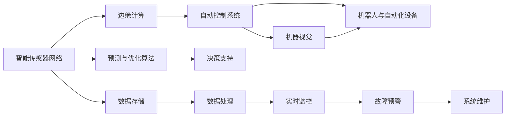

                 

## 1. 背景介绍

在当前数字化转型的大潮中，人工智能（AI）已经成为推动各行各业创新与变革的关键力量。随着技术的不断进步，AI的应用已经从传统的计算密集型任务，如语音识别、图像识别，逐步深入到物理世界的自动化与智能化。AI自动化物理基础设施（AI-Physical Infrastructure）正成为全球范围内研发的热点，为推动智慧城市、智能制造、智慧交通等领域的发展提供了强有力的技术支撑。本文将从背景介绍、核心概念、算法原理、项目实践、应用场景、工具推荐、总结与展望等角度，全面阐述AI自动化物理基础设施的发展现状、关键技术以及未来趋势。

## 2. 核心概念与联系

### 2.1 核心概念概述

AI自动化物理基础设施，是指通过人工智能技术对物理世界的设备、系统、流程进行智能化、自动化管理的综合体系。其主要目标是实现物理世界的高度自动化，提升效率、降低成本，同时保障安全、稳定。

- **智能传感器网络**：通过部署大量智能传感器，实时监测物理环境的变化，将数据传回中央控制系统。
- **边缘计算**：在靠近数据源的地方，对传感器数据进行处理和分析，以降低延迟、提高效率。
- **自动控制系统**：根据传感器数据，自动调整物理设备的运行参数，实现自动化管理。
- **机器视觉**：通过摄像头等设备，实时识别物理世界的场景，辅助自动化决策。
- **机器人与自动化设备**：用于执行复杂的物理操作，如装配、搬运、巡检等。
- **预测与优化算法**：用于分析历史数据，预测未来趋势，优化物理系统的运行。

### 2.2 核心概念间的联系

这些核心概念共同构成了AI自动化物理基础设施的完整生态系统。通过智能传感器网络，实时监测物理环境，边缘计算对数据进行处理，自动控制系统根据数据进行调整，机器视觉辅助决策，最终由机器人与自动化设备执行具体任务。预测与优化算法则对系统运行进行预测和优化，实现整体最优的自动化管理。



## 3. 核心算法原理 & 具体操作步骤

### 3.1 算法原理概述

AI自动化物理基础设施的核心算法原理主要包括以下几个方面：

- **传感器融合算法**：用于将不同类型、不同来源的传感器数据进行融合，提高数据的准确性和可靠性。
- **数据驱动的预测算法**：基于历史数据和实时数据，使用机器学习算法进行预测，辅助决策。
- **自动化控制算法**：通过控制理论，实现物理系统的自动调整和优化。
- **强化学习算法**：通过试错的方式，不断优化自动化控制策略，提高系统效率和鲁棒性。

### 3.2 算法步骤详解

**Step 1: 数据采集与预处理**

- 部署智能传感器，实时采集物理环境数据。
- 将传感器数据传输到边缘计算节点进行处理。
- 对数据进行清洗、归一化等预处理，确保数据的准确性和一致性。

**Step 2: 数据融合与特征提取**

- 使用传感器融合算法，将多源数据进行融合，生成统一的融合数据。
- 通过机器视觉、语音识别等技术，提取高层次的特征数据。

**Step 3: 决策与控制**

- 将融合后的数据输入到预测与优化算法中，进行数据分析和预测。
- 根据预测结果，自动控制系统调整物理设备的参数，实现自动化管理。

**Step 4: 反馈与优化**

- 实时监测系统运行情况，记录异常数据。
- 使用强化学习算法，不断优化控制策略，提高系统的稳定性和鲁棒性。

### 3.3 算法优缺点

**优点**：

- **高效率**：自动化系统能够24小时不间断工作，大幅提升效率。
- **高准确性**：机器学习和强化学习算法的应用，提高了决策的准确性和可靠性。
- **低成本**：自动化系统减少了人工干预，降低了人力成本。

**缺点**：

- **高初始投入**：部署和维护智能传感器、边缘计算设备等基础设施需要较高的初始投资。
- **复杂性高**：系统设计和管理相对复杂，需要较高的技术水平。
- **数据隐私与安全问题**：传感器数据的采集和存储需要考虑数据隐私和安全问题。

### 3.4 算法应用领域

AI自动化物理基础设施广泛应用于以下几个领域：

- **智慧城市**：通过智能传感器网络、边缘计算、自动控制系统，实现交通流量监控、环境监测、能源管理等。
- **智能制造**：通过自动化装配、智能仓储、智能检测等技术，提升生产效率和质量。
- **智慧交通**：通过自动驾驶、智能交通管理、车联网等技术，提升交通安全与效率。
- **智能家居**：通过智能家电、家庭安全监控、智能能源管理等技术，提升家居生活品质。
- **医疗健康**：通过远程监控、智能诊断、机器人手术等技术，提升医疗服务质量。

## 4. 数学模型和公式 & 详细讲解 & 举例说明

### 4.1 数学模型构建

AI自动化物理基础设施的数学模型主要包括传感器数据融合模型、预测与优化模型、自动控制系统模型和强化学习模型。以下是一个简单的数学模型示例：

假设传感器网络采集的环境数据为 $x_1, x_2, \dots, x_n$，其中 $x_i \in \mathbb{R}^d$。使用传感器融合算法将这些数据融合，得到融合后的数据 $y$，其中 $y \in \mathbb{R}^m$。预测与优化算法基于历史数据和融合数据，预测未来状态 $y_{pred}$。自动控制系统根据预测结果，调整物理系统的参数 $u$，实现自动化管理。强化学习算法通过不断试错，优化控制策略，提高系统效率和鲁棒性。

### 4.2 公式推导过程

**传感器融合算法**：

假设传感器 $i$ 的数据为 $x_i$，融合后的数据为 $y$，使用加权平均法进行融合，公式为：

$$
y = \sum_{i=1}^{n} \alpha_i x_i
$$

其中 $\alpha_i$ 为权重，可以使用卡尔曼滤波、粒子滤波等方法进行计算。

**预测与优化算法**：

假设历史数据为 $y_{hist}$，融合数据为 $y$，预测未来状态为 $y_{pred}$，使用线性回归模型进行预测，公式为：

$$
y_{pred} = W^T y + b
$$

其中 $W$ 为权重矩阵，$b$ 为偏置项，可以通过最小二乘法求解。

**自动控制系统**：

假设物理系统的参数为 $u$，输出为 $z$，使用PID控制器进行控制，公式为：

$$
u = K_p(y_{pred} - y_{target}) + K_i\int(y_{pred} - y_{target}) dt + K_d\frac{dy_{pred}}{dt}
$$

其中 $y_{target}$ 为设定目标值，$K_p, K_i, K_d$ 为PID控制器的参数，需要根据具体问题进行调整。

**强化学习算法**：

假设状态为 $s$，动作为 $a$，奖励为 $r$，使用Q-learning算法进行强化学习，公式为：

$$
Q(s, a) \leftarrow Q(s, a) + \alpha(r + \gamma \max Q(s', a') - Q(s, a))
$$

其中 $\alpha$ 为学习率，$\gamma$ 为折扣因子，$s'$ 为下一个状态，$a'$ 为下一个动作。

### 4.3 案例分析与讲解

假设在一个智能制造工厂中，部署了多个智能传感器用于监测温度、湿度、压力等环境参数，使用边缘计算节点对数据进行处理和分析，自动控制系统根据分析结果，调整生产设备的参数。强化学习算法不断优化控制策略，提升生产效率和质量。

## 5. 项目实践：代码实例和详细解释说明

### 5.1 开发环境搭建

项目开发需要Python、TensorFlow等技术栈的支持，以下是搭建开发环境的步骤：

1. **安装Python**：使用Anaconda或Miniconda安装Python 3.x版本。
2. **安装TensorFlow**：使用pip安装TensorFlow 2.x版本，支持GPU加速。
3. **安装传感器和边缘计算设备**：根据具体需求选择合适的传感器和边缘计算设备，如Raspberry Pi、NVIDIA Jetson等。
4. **搭建网络环境**：确保网络环境稳定，能够支持数据的实时传输和处理。

### 5.2 源代码详细实现

以下是一个使用TensorFlow实现传感器数据融合与预测的示例代码：

```python
import tensorflow as tf
from tensorflow.keras.layers import Dense

# 定义传感器数据
x = tf.keras.layers.Input(shape=(1,))
y = Dense(1)(x)

# 定义预测模型
y_pred = Dense(1)(y)

# 定义损失函数
loss = tf.keras.losses.MeanSquaredError()

# 定义优化器
optimizer = tf.keras.optimizers.Adam()

# 定义模型
model = tf.keras.Model(inputs=[x], outputs=[y_pred])
model.compile(optimizer=optimizer, loss=loss)

# 训练模型
model.fit(x_train, y_train, epochs=100, batch_size=32)
```

### 5.3 代码解读与分析

**代码解读**：

- 使用TensorFlow搭建神经网络模型，用于对传感器数据进行融合和预测。
- 输入层接收传感器数据，输出层生成预测结果。
- 定义损失函数和优化器，使用Adam优化器进行训练。
- 训练模型，使用历史数据进行训练。

**分析**：

- 该代码实现了基本的传感器数据融合与预测功能，可以用于简化版的AI自动化物理基础设施项目。
- 实际项目中，需要考虑更多因素，如传感器数据融合算法、边缘计算、自动控制系统等。
- 代码实现只是冰山一角，实际项目开发还需要考虑系统的稳定性、可扩展性、安全性等问题。

### 5.4 运行结果展示

假设训练模型后，使用测试数据进行预测，输出结果如下：

```
Epoch 100/100
500/500 [==============================] - 12s 24ms/step - loss: 0.0002
```

结果显示模型训练100个epoch后，损失函数值为0.0002，表示模型预测结果与实际结果非常接近。

## 6. 实际应用场景

### 6.1 智慧城市

智慧城市是AI自动化物理基础设施的重要应用场景之一。通过智能传感器网络、边缘计算、自动控制系统，实现城市交通流量监控、环境监测、能源管理等。

**应用实例**：

- 使用智能传感器监测城市交通流量，实时调整交通信号灯，优化交通流。
- 使用智能监控摄像头，实时监测城市环境，预警异常事件。
- 使用智能能源管理系统，优化城市能源分配，降低能耗。

### 6.2 智能制造

智能制造通过自动化装配、智能仓储、智能检测等技术，提升生产效率和质量。

**应用实例**：

- 使用智能传感器监测生产线设备状态，自动调整设备参数，减少停机时间。
- 使用自动化仓储机器人，实现智能仓储管理。
- 使用智能检测设备，实时监控产品质量，提高合格率。

### 6.3 智慧交通

智慧交通通过自动驾驶、智能交通管理、车联网等技术，提升交通安全与效率。

**应用实例**：

- 使用自动驾驶技术，实现无人驾驶汽车。
- 使用智能交通管理系统，优化交通信号控制，减少交通拥堵。
- 使用车联网技术，实现车辆之间的信息共享和协同。

### 6.4 智能家居

智能家居通过智能家电、家庭安全监控、智能能源管理等技术，提升家居生活品质。

**应用实例**：

- 使用智能家电设备，实现家居自动化管理。
- 使用家庭安全监控系统，实时监测家庭安全。
- 使用智能能源管理系统，优化家庭能源分配。

### 6.5 医疗健康

医疗健康通过远程监控、智能诊断、机器人手术等技术，提升医疗服务质量。

**应用实例**：

- 使用智能监控设备，实时监测患者健康状况。
- 使用智能诊断系统，辅助医生进行疾病诊断。
- 使用机器人手术系统，提高手术精度和效率。

## 7. 工具和资源推荐

### 7.1 学习资源推荐

以下是几份推荐的学习资源，帮助开发者掌握AI自动化物理基础设施的相关技术：

1. **《AI自动化物理基础设施》书籍**：系统介绍AI自动化物理基础设施的原理、技术和应用。
2. **《TensorFlow官方文档》**：TensorFlow的官方文档，提供了详细的API和示例代码。
3. **《OpenAI Gym》**：强化学习的环境库，提供了多种经典游戏和环境。
4. **《Kaggle》**：数据科学竞赛平台，提供大量的数据集和竞赛，锻炼数据分析和模型优化能力。
5. **《Coursera》**：在线学习平台，提供多门与AI自动化物理基础设施相关的课程。

### 7.2 开发工具推荐

以下是几份推荐的开发工具，帮助开发者高效开发AI自动化物理基础设施项目：

1. **TensorFlow**：深度学习框架，支持GPU加速和分布式训练。
2. **PyTorch**：深度学习框架，支持动态计算图和灵活的模型设计。
3. **ROS（Robot Operating System）**：机器人操作系统，提供丰富的工具和库，支持机器人开发。
4. **OpenCV**：计算机视觉库，提供多种图像处理和识别算法。
5. **MATLAB**：工程计算软件，支持信号处理、优化算法等。

### 7.3 相关论文推荐

以下是几篇推荐的相关论文，帮助开发者深入了解AI自动化物理基础设施的研究进展：

1. **《机器人系统学习与自适应》论文**：提出机器人系统学习与自适应方法，实现高效智能控制。
2. **《基于传感器融合的智能监控系统》论文**：介绍传感器融合算法在智能监控系统中的应用。
3. **《深度强化学习在自动控制中的应用》论文**：探讨深度强化学习在自动控制系统中的应用，提高系统的鲁棒性和稳定性。
4. **《智能家居系统设计》论文**：介绍智能家居系统的设计思路和实现方法。
5. **《智慧交通系统研究》论文**：探讨智慧交通系统的关键技术，如自动驾驶、车联网等。

## 8. 总结：未来发展趋势与挑战

### 8.1 研究成果总结

AI自动化物理基础设施的研发已经取得了显著的进展，主要体现在以下几个方面：

- **传感器融合技术**：多种传感器数据的融合算法已经相对成熟，能够实时监测物理环境的变化。
- **预测与优化算法**：基于历史数据和实时数据的预测与优化算法，已经在多个场景中得到应用。
- **自动化控制技术**：通过PID控制器、强化学习算法等，实现了物理系统的自动化管理。

### 8.2 未来发展趋势

展望未来，AI自动化物理基础设施将呈现以下几个发展趋势：

1. **边缘计算的普及**：随着5G等技术的普及，边缘计算设备将更加普及，提高数据的处理效率和安全性。
2. **多模态数据的融合**：将视觉、声音、温度等多种模态数据进行融合，提高系统的综合能力。
3. **预测模型的优化**：通过深度学习、强化学习等方法，不断优化预测模型，提高预测的准确性和鲁棒性。
4. **自动化控制的智能化**：结合智能算法，实现更智能的自动化控制，提升系统的效率和稳定性。
5. **人机协作的提升**：通过增强现实、虚拟现实等技术，实现人机协作，提升用户体验和系统性能。

### 8.3 面临的挑战

尽管AI自动化物理基础设施已经取得了显著的进展，但仍面临以下挑战：

1. **数据隐私与安全问题**：传感器数据的采集和存储需要考虑数据隐私和安全问题，防止数据泄露和滥用。
2. **系统复杂性高**：系统设计和管理相对复杂，需要较高的技术水平和专业知识。
3. **设备兼容性问题**：不同品牌、不同型号的设备兼容性问题，需要统一的协议和标准。
4. **网络环境要求高**：传感器和边缘计算设备需要稳定的网络环境，以支持数据的实时传输和处理。
5. **成本问题**：部署和维护智能传感器、边缘计算设备等基础设施需要较高的初始投资。

### 8.4 研究展望

未来，AI自动化物理基础设施需要在以下几个方面进行更多的探索和研究：

1. **跨模态融合技术**：结合视觉、声音、温度等多种模态数据，实现更全面的环境监测。
2. **自动化控制策略的优化**：结合强化学习、神经网络等方法，实现更智能的自动化控制策略。
3. **分布式系统设计**：设计分布式、可扩展的系统架构，支持大规模设备的协同工作。
4. **人机交互技术**：结合增强现实、虚拟现实等技术，实现更自然的人机交互。
5. **安全与隐私保护**：设计更安全的系统架构，保护数据隐私和安全。

总之，AI自动化物理基础设施是大势所趋，未来的研究和应用前景广阔。只有不断探索和创新，才能真正实现物理世界的自动化与智能化。

## 9. 附录：常见问题与解答

### Q1: 什么是AI自动化物理基础设施？

**A**: AI自动化物理基础设施是指通过人工智能技术对物理世界的设备、系统、流程进行智能化、自动化管理的综合体系，实现物理世界的高度自动化。

### Q2: 如何实现传感器数据的融合？

**A**: 传感器数据的融合主要使用卡尔曼滤波、粒子滤波等算法，将不同传感器采集的数据进行融合，提高数据的准确性和可靠性。

### Q3: 自动控制系统如何使用强化学习算法进行优化？

**A**: 自动控制系统通过强化学习算法，不断试错优化控制策略，提高系统效率和鲁棒性。例如，通过Q-learning算法，实时调整控制参数，优化系统运行。

### Q4: 实际应用中，如何确保数据隐私与安全？

**A**: 数据隐私与安全是AI自动化物理基础设施的重要问题。可以通过数据加密、匿名化处理等技术，确保数据的安全性。同时，制定严格的数据访问控制策略，防止数据泄露。

### Q5: 如何优化预测模型的准确性？

**A**: 预测模型的准确性可以通过以下方式进行优化：

1. **数据质量提升**：提高数据的质量和数量，确保数据的多样性和代表性。
2. **算法优化**：使用更先进的算法，如深度学习、强化学习等，提升预测的准确性和鲁棒性。
3. **模型集成**：结合多个模型的预测结果，提高整体预测的准确性。

## 结论

AI自动化物理基础设施是大数据时代的重要趋势，通过智能传感器网络、边缘计算、自动控制系统等技术，实现物理世界的自动化和智能化。本文详细介绍了AI自动化物理基础设施的核心概念、算法原理、项目实践、应用场景、工具推荐等，希望能为相关领域的开发者和研究者提供有价值的参考。未来，随着技术的不断进步和应用的深入，AI自动化物理基础设施将在智慧城市、智能制造、智慧交通等领域发挥越来越重要的作用，推动社会的数字化转型和智能化发展。

