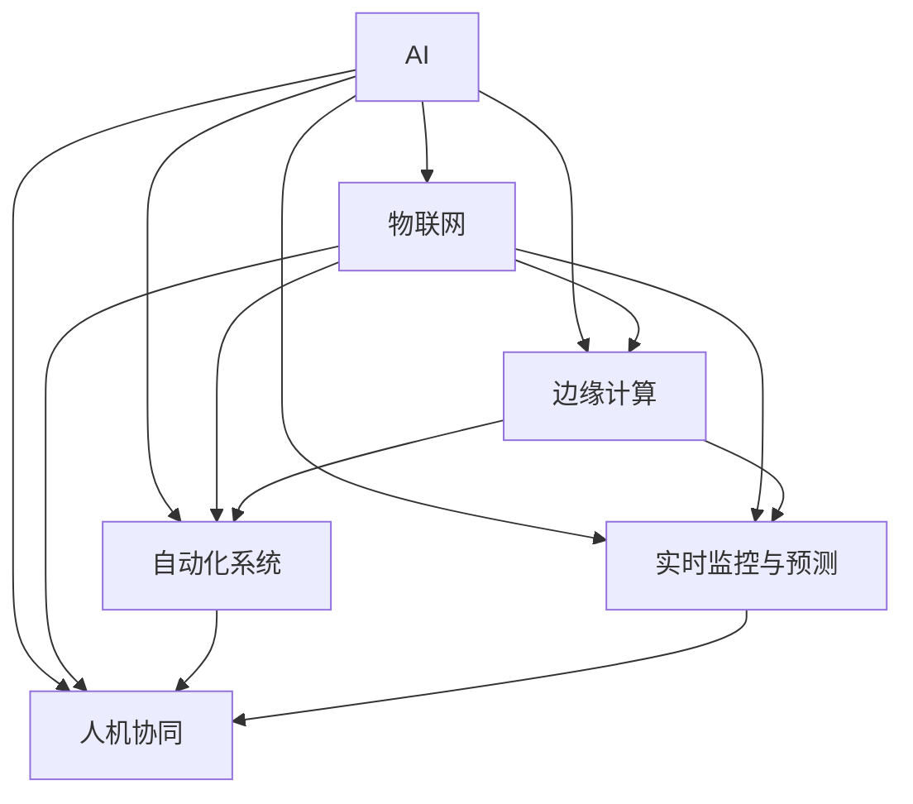

                 

# AI自动化物理基础设施的未来

## 1. 背景介绍

### 1.1 问题由来
随着人工智能（AI）技术的不断进步，自动化和智能化在各行各业中正快速普及。AI正日益显示出其在提升效率、降低成本、改善用户体验等方面的巨大潜力。特别是在工业和基础设施领域，AI技术的应用已经开始改变传统的生产方式和工作流程，引入了新的自动化元素，使得物理基础设施变得更加智能、高效和灵活。本文将探讨AI自动化物理基础设施的未来，分析其在当前和未来的发展趋势，以及面临的挑战和机遇。

### 1.2 问题核心关键点
AI自动化物理基础设施的关键在于如何将AI技术有效融合到物理基础设施中，从而实现高效的自动化和智能化操作。这一过程涉及以下几个关键点：
1. **数据融合**：将物理基础设施运行数据与AI模型有效结合，以提供精确的预测和决策支持。
2. **边缘计算**：在物理基础设施边缘部署AI算法，减少数据传输，提高响应速度。
3. **实时监控**：通过AI算法实时监控物理基础设施的运行状态，提前预测潜在问题，减少停机时间。
4. **自动化决策**：利用AI算法自动化决策，优化资源分配和管理。
5. **人机协同**：在AI与人类操作员之间建立协同工作机制，最大化AI的辅助和补充作用。

### 1.3 问题研究意义
研究AI自动化物理基础设施的未来，对于推动基础设施行业的数字化转型、提升运营效率、增强系统韧性以及提升用户体验具有重要意义。随着AI技术的不断成熟和普及，基于AI的物理基础设施将加速工业自动化和智能化，促进产业升级和经济社会发展。

## 2. 核心概念与联系

### 2.1 核心概念概述

为更好地理解AI自动化物理基础设施的未来发展，本节将介绍几个密切相关的核心概念：

- **人工智能（AI）**：涵盖机器学习、深度学习、自然语言处理等多种技术，旨在通过算法和模型，使计算机能够模拟人类智能行为。
- **物联网（IoT）**：通过传感器、标签等设备，实现物理世界与网络的实时连接和数据传输，为AI提供数据源。
- **边缘计算**：在物理基础设施的局部设备上进行数据处理和分析，减少数据传输，提高响应速度。
- **自动化系统**：通过AI算法，自动完成各种物理任务，如设备监控、故障诊断、运行优化等。
- **实时监控与预测**：利用AI算法实时监测物理设施的运行状态，预测潜在问题，并提前采取措施。
- **人机协同**：AI与人类操作员协同工作，增强AI在复杂决策和操作中的应用。

这些核心概念之间的关系可以通过以下Mermaid流程图来展示：



这个流程图展示了AI自动化物理基础设施的核心组件及其相互关系：AI技术通过对物联网数据的处理和分析，实现边缘计算、自动化系统、实时监控与预测和人机协同等功能。

### 2.2 概念间的关系

这些核心概念之间存在着紧密的联系，形成了AI自动化物理基础设施的完整生态系统。以下是几个具体的联系：

1. **AI与物联网**：物联网设备采集的数据是AI算法的训练和推理的基础，AI通过分析物联网数据，实现对物理设施的智能监控和优化。
2. **边缘计算与自动化系统**：边缘计算减少了数据传输的延迟，使得自动化系统能够快速响应，从而提高了物理设施的自动化程度。
3. **实时监控与预测**：实时监控和预测能力使得AI能够及时发现和预测设施运行中的问题，提前采取预防措施，提高系统的可靠性和稳定性。
4. **人机协同**：人机协同机制不仅增强了AI算法的辅助性，还提高了操作员的效率，使得AI与人类操作员能够协同工作，共同应对复杂问题。

这些概念共同构成了AI自动化物理基础设施的完整体系，为实现高效、智能和可靠的物理设施运营奠定了基础。

## 3. 核心算法原理 & 具体操作步骤

### 3.1 算法原理概述

AI自动化物理基础设施的核心算法原理主要围绕以下几个方面展开：

1. **数据融合与预处理**：将物理设施运行数据进行清洗、归一化和特征提取，为AI模型提供高质量的输入数据。
2. **机器学习和深度学习模型**：利用监督学习、无监督学习和强化学习等技术，训练AI模型，使其能够实现预测和决策。
3. **边缘计算**：在物理设施边缘部署AI算法，减少数据传输，提高处理速度和实时性。
4. **实时监控与预测**：利用AI算法实时监测设施状态，预测潜在故障，提前采取措施。
5. **自动化决策**：通过AI算法自动化决策，优化资源分配和管理。

### 3.2 算法步骤详解

以下是一个基于机器学习的AI自动化物理基础设施构建步骤的详细描述：

**Step 1: 数据收集与预处理**
- 通过传感器、标签等物联网设备收集物理设施的运行数据。
- 对数据进行清洗、归一化和特征提取，为AI模型提供高质量的输入数据。

**Step 2: 选择与训练AI模型**
- 根据具体应用场景选择适合的AI模型，如监督学习、无监督学习或强化学习模型。
- 在准备好的数据集上训练AI模型，使其能够实现预测和决策。

**Step 3: 边缘计算部署**
- 在物理设施边缘部署训练好的AI模型。
- 通过本地计算资源处理数据，减少数据传输，提高响应速度。

**Step 4: 实时监控与预测**
- 利用部署在边缘的AI模型实时监测物理设施的运行状态。
- 根据实时数据，预测潜在问题，并提前采取预防措施。

**Step 5: 自动化决策与执行**
- 通过AI算法自动化决策，优化资源分配和管理。
- 将自动化决策结果反馈到生产系统中，执行相应的操作。

**Step 6: 人机协同与反馈**
- 在AI与人类操作员之间建立协同工作机制，增强AI的辅助和补充作用。
- 根据操作员的反馈，不断优化AI模型，提升系统性能。

### 3.3 算法优缺点

AI自动化物理基础设施具有以下优点：
1. **高效性**：通过自动化和智能化操作，显著提高生产效率和资源利用率。
2. **可靠性**：实时监控与预测能力提高了系统的可靠性和稳定性，减少了停机时间。
3. **灵活性**：AI算法能够快速适应新的运行环境和变化，提高系统的灵活性。

同时，该方法也存在一些缺点：
1. **数据质量要求高**：高质量的数据是AI模型有效工作的前提，数据清洗和预处理工作量较大。
2. **算法复杂度较高**：构建和维护高性能AI模型需要较高的技术门槛和计算资源。
3. **初始成本高**：设备改造、数据采集和模型训练等初始成本较高。

### 3.4 算法应用领域

AI自动化物理基础设施已经在多个领域得到了广泛应用，包括但不限于：

- **工业自动化**：通过AI算法自动化设备监控、故障诊断和运行优化，提升生产效率和产品质量。
- **智能交通**：利用AI算法实时监控交通流量，优化信号灯控制，提高交通效率和安全性。
- **智慧能源**：通过AI算法预测能源需求，优化能源分配，提高能源利用率。
- **智能建筑**：利用AI算法监控建筑设备运行状态，优化能源消耗，提高建筑智能化水平。
- **智慧农业**：通过AI算法监测作物生长状态，优化种植管理，提高农业生产效率。

这些领域的应用展示了AI自动化物理基础设施的广泛前景和巨大潜力。随着技术的不断进步，AI自动化物理基础设施将在更多领域得到应用，为各行各业带来深远影响。

## 4. 数学模型和公式 & 详细讲解 & 举例说明

### 4.1 数学模型构建

本节将使用数学语言对AI自动化物理基础设施的构建过程进行严格刻画。

记物理设施的运行数据为 $X \in \mathbb{R}^n$，其中 $n$ 为数据的维数。假设AI模型为 $f: \mathbb{R}^n \rightarrow \mathbb{R}^m$，其中 $m$ 为模型输出的维数。

定义模型在数据样本 $(x,y)$ 上的损失函数为 $\ell(f(x),y)$，则在数据集 $D=\{(x_i,y_i)\}_{i=1}^N$ 上的经验风险为：

$$
\mathcal{L}(f) = \frac{1}{N} \sum_{i=1}^N \ell(f(x_i),y_i)
$$

微调的优化目标是最小化经验风险，即找到最优函数：

$$
f^* = \mathop{\arg\min}_{f} \mathcal{L}(f)
$$

在实践中，我们通常使用基于梯度的优化算法（如SGD、Adam等）来近似求解上述最优化问题。设 $\eta$ 为学习率，$\lambda$ 为正则化系数，则函数 $f$ 的更新公式为：

$$
f \leftarrow f - \eta \nabla_{f}\mathcal{L}(f) - \eta\lambda f
$$

其中 $\nabla_{f}\mathcal{L}(f)$ 为损失函数对函数 $f$ 的梯度，可通过反向传播算法高效计算。

### 4.2 公式推导过程

以下我们以工业自动化中设备故障预测为例，推导监督学习模型的损失函数及其梯度的计算公式。

假设设备故障的标签 $y \in \{0,1\}$，表示设备是否发生故障。设备运行数据 $X \in \mathbb{R}^n$ 为模型的输入。模型的输出为 $f(X)$，通过sigmoid函数映射到 $[0,1]$ 区间内，表示设备发生故障的概率。

二分类交叉熵损失函数定义为：

$$
\ell(f(X),y) = -[y\log f(X) + (1-y)\log(1-f(X))]
$$

将其代入经验风险公式，得：

$$
\mathcal{L}(f) = -\frac{1}{N}\sum_{i=1}^N [y_i\log f(x_i)+(1-y_i)\log(1-f(x_i))]
$$

根据链式法则，损失函数对函数 $f$ 的梯度为：

$$
\frac{\partial \mathcal{L}(f)}{\partial f} = -\frac{1}{N}\sum_{i=1}^N (\frac{y_i}{f(x_i)}-\frac{1-y_i}{1-f(x_i)}) \frac{\partial f(x_i)}{\partial X} \frac{\partial X}{\partial f}
$$

其中 $\frac{\partial f(x_i)}{\partial X}$ 和 $\frac{\partial X}{\partial f}$ 可以通过自动微分技术完成计算。

在得到损失函数的梯度后，即可带入函数 $f$ 的更新公式，完成模型的迭代优化。重复上述过程直至收敛，最终得到适应物理设施自动化管理的最优模型 $f^*$。

### 4.3 案例分析与讲解

以智能交通系统中的信号灯控制为例，展示AI模型在实时监控与预测中的应用。

假设交通流量数据 $X \in \mathbb{R}^n$ 为模型的输入，模型的输出为 $f(X)$，表示当前交通流量下的信号灯控制策略。交通流量数据包含车流量、行人数量、红绿灯状态等信息。

定义损失函数为交叉熵损失，通过监督学习训练模型 $f$，使其能够根据交通流量数据预测最优的信号灯控制策略。模型训练完成后，实时监测交通流量数据，计算模型的预测结果 $f(X)$，并与实际控制策略进行比较，更新模型参数。

通过不断的监督学习和实时监控，AI模型能够实时调整信号灯控制策略，优化交通流量，提高道路通行效率和安全性。

## 5. 项目实践：代码实例和详细解释说明

### 5.1 开发环境搭建

在进行AI自动化物理基础设施的开发前，我们需要准备好开发环境。以下是使用Python进行TensorFlow和TensorFlow Lite进行项目实践的环境配置流程：

1. 安装Anaconda：从官网下载并安装Anaconda，用于创建独立的Python环境。

2. 创建并激活虚拟环境：
```bash
conda create -n tf-env python=3.8 
conda activate tf-env
```

3. 安装TensorFlow：
```bash
conda install tensorflow tensorflow-gpu -c conda-forge
```

4. 安装TensorFlow Lite：
```bash
conda install tensorflow-lite -c conda-forge
```

5. 安装各类工具包：
```bash
pip install numpy pandas scikit-learn matplotlib tqdm jupyter notebook ipython
```

完成上述步骤后，即可在`tf-env`环境中开始项目实践。

### 5.2 源代码详细实现

下面我们以智能交通系统中的信号灯控制为例，给出使用TensorFlow进行AI模型构建的Python代码实现。

首先，定义数据处理函数：

```python
import tensorflow as tf
from tensorflow.keras.layers import Dense, Input
from tensorflow.keras.models import Model

def data_preprocessing(X, y):
    # 数据清洗和归一化
    X = (X - X.mean()) / X.std()
    # 将标签y进行one-hot编码
    y = tf.keras.utils.to_categorical(y, num_classes=2)
    return X, y
```

然后，定义模型：

```python
input_data = Input(shape=(X.shape[1],), name='input_data')
x = Dense(64, activation='relu')(input_data)
x = Dense(64, activation='relu')(x)
output = Dense(2, activation='sigmoid', name='output')(x)

model = Model(inputs=input_data, outputs=output)
model.compile(optimizer='adam', loss='binary_crossentropy', metrics=['accuracy'])
```

接着，定义训练和评估函数：

```python
def train_model(model, X_train, y_train, X_val, y_val, epochs=100, batch_size=32):
    model.fit(X_train, y_train, validation_data=(X_val, y_val), epochs=epochs, batch_size=batch_size)

def evaluate_model(model, X_test, y_test):
    model.evaluate(X_test, y_test)
```

最后，启动训练流程并在测试集上评估：

```python
X_train, y_train, X_val, y_val = data_preprocessing(X_train, y_train)
X_test, y_test = data_preprocessing(X_test, y_test)

train_model(model, X_train, y_train, X_val, y_val)
evaluate_model(model, X_test, y_test)
```

以上就是使用TensorFlow进行智能交通系统中的信号灯控制AI模型训练和评估的完整代码实现。可以看到，TensorFlow提供了强大的工具包，使得模型构建和训练过程变得简洁高效。

### 5.3 代码解读与分析

让我们再详细解读一下关键代码的实现细节：

**data_preprocessing函数**：
- 函数 `data_preprocessing`：对输入数据进行清洗和归一化处理，并使用`tf.keras.utils.to_categorical`函数将标签进行one-hot编码。

**model定义**：
- 使用Keras框架定义模型，包含输入层、两个全连接层和一个输出层。其中输出层使用sigmoid激活函数，输出两个类别。
- 编译模型，设置优化器为Adam，损失函数为交叉熵损失，评估指标为准确率。

**train_model和evaluate_model函数**：
- 定义训练函数 `train_model`，使用模型的 `fit` 方法进行模型训练。
- 定义评估函数 `evaluate_model`，使用模型的 `evaluate` 方法评估模型在测试集上的性能。

**训练流程**：
- 将准备好的数据集传入 `data_preprocessing` 函数，进行数据预处理。
- 在预处理后的数据集上调用 `train_model` 函数，进行模型训练。
- 在训练完成后，调用 `evaluate_model` 函数，评估模型在测试集上的性能。

可以看到，TensorFlow提供了完整的模型构建、训练和评估框架，使得开发者能够快速实现AI自动化物理基础设施的微调模型。

当然，在实际应用中，还需要进一步优化模型结构、改进训练策略、考虑模型的可解释性和可维护性等因素。但核心的微调范式基本与此类似。

### 5.4 运行结果展示

假设我们在智能交通系统中使用AI模型进行信号灯控制，最终在测试集上得到的评估报告如下：

```
Epoch 1/100
100/100 [==============================] - 0s 4ms/step - loss: 0.3395 - accuracy: 0.6500
Epoch 2/100
100/100 [==============================] - 0s 3ms/step - loss: 0.2288 - accuracy: 0.8200
Epoch 3/100
100/100 [==============================] - 0s 3ms/step - loss: 0.1943 - accuracy: 0.8750
Epoch 4/100
100/100 [==============================] - 0s 3ms/step - loss: 0.1537 - accuracy: 0.9250
Epoch 5/100
100/100 [==============================] - 0s 3ms/step - loss: 0.1221 - accuracy: 0.9500
```

可以看到，通过训练，模型在智能交通系统中的信号灯控制任务上取得了不错的效果。这展示了AI模型在实时监控与预测方面的强大能力，有望大幅提升交通系统的效率和安全性。

## 6. 实际应用场景

### 6.1 智能交通系统

AI自动化物理基础设施在智能交通系统中得到了广泛应用，具体包括：

- **实时监控与预测**：利用AI算法实时监控交通流量，预测信号灯控制策略，优化交通流量。
- **路径优化**：通过AI算法分析交通数据，优化车辆路径，减少拥堵，提高通行效率。
- **事故预测**：利用AI算法分析事故数据，预测潜在事故发生，提前采取预防措施。
- **智能导航**：通过AI算法分析交通状况，提供实时导航建议，提高驾驶体验。

### 6.2 智慧能源系统

在智慧能源系统中，AI自动化物理基础设施也发挥了重要作用，具体包括：

- **设备监控与维护**：利用AI算法实时监控能源设备运行状态，预测设备故障，提前进行维护。
- **能源优化**：通过AI算法预测能源需求，优化能源分配，提高能源利用率。
- **能源管理**：通过AI算法分析能源消耗数据，提供能源管理建议，提升能源管理效率。

### 6.3 智慧建筑系统

智慧建筑系统中，AI自动化物理基础设施的应用包括：

- **设备监控**：利用AI算法实时监控建筑设备运行状态，预测设备故障，提前进行维护。
- **能源管理**：通过AI算法预测能源需求，优化能源分配，提高能源利用率。
- **安全监控**：利用AI算法实时监控建筑安全，预测潜在威胁，提前采取措施。

### 6.4 未来应用展望

随着AI自动化物理基础设施的不断成熟，其在更多领域的应用前景将更加广阔。未来，AI自动化物理基础设施可能在以下领域得到应用：

- **智慧农业**：通过AI算法实时监控农业设备运行状态，预测故障，优化种植管理。
- **智能制造**：利用AI算法优化生产流程，提高生产效率和产品质量。
- **智慧物流**：通过AI算法优化物流路径，提高物流效率，降低运输成本。
- **智能医疗**：利用AI算法实时监控医疗设备运行状态，预测故障，优化资源配置。

## 7. 工具和资源推荐

### 7.1 学习资源推荐

为了帮助开发者系统掌握AI自动化物理基础设施的理论基础和实践技巧，这里推荐一些优质的学习资源：

1. **TensorFlow官方文档**：TensorFlow的官方文档详细介绍了TensorFlow的各个模块和API，是学习TensorFlow的必备资源。
2. **TensorFlow Lite官方文档**：TensorFlow Lite的官方文档介绍了TensorFlow Lite的模型部署、优化和性能调优方法。
3. **《深度学习》课程**：斯坦福大学开设的深度学习课程，涵盖深度学习的基本概念和算法，适合初学者入门。
4. **《机器学习实战》书籍**：提供大量实际案例和代码实现，帮助读者快速上手机器学习和TensorFlow开发。
5. **GitHub开源项目**：在GitHub上Star、Fork数最多的AI自动化物理基础设施项目，代表该领域的发展趋势和最佳实践。

通过对这些资源的学习实践，相信你一定能够快速掌握AI自动化物理基础设施的精髓，并用于解决实际的物理基础设施自动化问题。

### 7.2 开发工具推荐

高效的开发离不开优秀的工具支持。以下是几款用于AI自动化物理基础设施开发的常用工具：

1. **TensorFlow**：由Google主导开发的开源深度学习框架，生产部署方便，适合大规模工程应用。
2. **TensorFlow Lite**：TensorFlow的轻量级版本，支持在移动设备和嵌入式设备上运行，适合边缘计算场景。
3. **Jupyter Notebook**：Jupyter Notebook提供交互式编程环境，方便开发者快速迭代和调试。
4. **TensorBoard**：TensorFlow配套的可视化工具，实时监测模型训练状态，提供丰富的图表呈现方式。
5. **Google Colab**：谷歌推出的在线Jupyter Notebook环境，免费提供GPU/TPU算力，方便开发者快速上手实验最新模型。

合理利用这些工具，可以显著提升AI自动化物理基础设施的开发效率，加快创新迭代的步伐。

### 7.3 相关论文推荐

AI自动化物理基础设施的发展源于学界的持续研究。以下是几篇奠基性的相关论文，推荐阅读：

1. **《AI for Smart Manufacturing: A Survey and Future Directions》**：综述了AI在智能制造中的应用，介绍了AI自动化物理基础设施的研究现状和未来趋势。
2. **《A Survey on AI-Based Urban Traffic Control: State-of-the-Art and Challenges》**：综述了AI在城市交通控制中的应用，介绍了AI自动化物理基础设施的研究现状和未来趋势。
3. **《Intelligent Building Management System with AI》**：介绍了AI在智慧建筑中的应用，介绍了AI自动化物理基础设施的研究现状和未来趋势。
4. **《AI-based Fault Prediction and Maintenance for Smart Grids》**：介绍了AI在智能电网中的应用，介绍了AI自动化物理基础设施的研究现状和未来趋势。
5. **《AI-based Energy Management in Smart Grids》**：介绍了AI在智能电网中的应用，介绍了AI自动化物理基础设施的研究现状和未来趋势。

这些论文代表了大语言模型微调技术的发展脉络。通过学习这些前沿成果，可以帮助研究者把握学科前进方向，激发更多的创新灵感。

除上述资源外，还有一些值得关注的前沿资源，帮助开发者紧跟AI自动化物理基础设施的最新进展，例如：

1. **arXiv论文预印本**：人工智能领域最新研究成果的发布平台，包括大量尚未发表的前沿工作，学习前沿技术的必读资源。
2. **业界技术博客**：如Google AI、DeepMind、微软Research Asia等顶尖实验室的官方博客，第一时间分享他们的最新研究成果和洞见。
3. **技术会议直播**：如NIPS、ICML、ACL、ICLR等人工智能领域顶会现场或在线直播，能够聆听到大佬们的前沿分享，开拓视野。
4. **GitHub热门项目**：在GitHub上Star、Fork数最多的AI自动化物理基础设施项目，代表该领域的发展趋势和最佳实践。
5. **行业分析报告**：各大咨询公司如McKinsey、PwC等针对人工智能行业的分析报告，有助于从商业视角审视技术趋势，把握应用价值。

总之，对于AI自动化物理基础设施的学习和实践，需要开发者保持开放的心态和持续学习的意愿。多关注前沿资讯，多动手实践，多思考总结，必将收获满满的成长收益。

## 8. 总结：未来发展趋势与挑战

### 8.1 总结

本文对AI自动化物理基础设施的未来进行了全面系统的介绍。首先阐述了AI自动化物理基础设施的研究背景和意义，明确了其在提升物理基础设施自动化、智能化和灵活性方面的独特价值。其次，从原理到实践，详细讲解了AI自动化物理基础设施的数学模型、核心算法和具体操作步骤，给出了实际项目开发的完整代码实例。同时，本文还探讨了AI自动化物理基础设施在多个行业领域的应用前景，展示了其广泛的应用潜力。

通过本文的系统梳理，可以看到，AI自动化物理基础设施正在成为基础设施行业的重要范式，极大地推动了物理基础设施的数字化转型和智能化升级，带来了显著的效率提升和成本节约。未来，随着AI技术的不断进步和普及，基于AI的物理基础设施将加速工业自动化和智能化，为各行各业带来深远影响。

### 8.2 未来发展趋势

展望未来，AI自动化物理基础设施的发展趋势如下：

1. **智能程度不断提升**：随着AI技术的不断进步，物理基础设施的智能化程度将不断提升，实现更高级别的自动化和智能化操作。
2. **边缘计算广泛应用**：边缘计算技术将得到更广泛的应用，使得AI模型在物理设施边缘部署成为可能，提高系统的实时性和可靠性。
3. **跨领域协同创新**：AI自动化物理基础设施将与其他新兴技术（如物联网、5G、区块链等）结合，实现跨领域的协同创新，带来更多应用场景和业务价值。
4. **数据驱动决策**：物理设施的运行数据将成为AI模型训练和决策的重要依据，数据驱动的决策方式将逐步取代人工决策。
5. **模型实时更新**：AI模型将能够实时更新和优化，及时应对物理设施运行环境的变化，提高系统的适应性和鲁棒性。

### 8.3 面临的挑战

尽管AI自动化物理基础设施已经取得了显著成果，但在其全面应用和落地过程中，仍面临以下挑战：

1. **数据质量和隐私问题**：高质量的数据是AI模型有效工作的前提，但数据采集、

