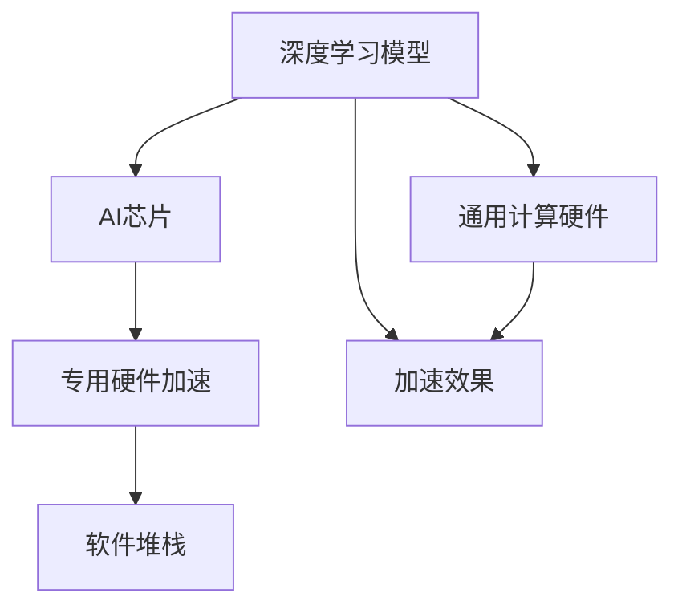
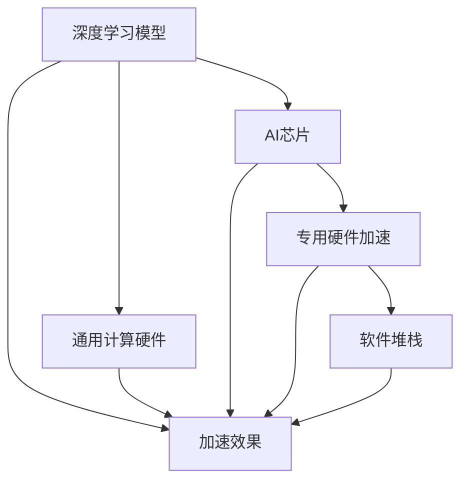

                 

# AI芯片革命:为深度学习量身定制

在人工智能飞速发展的今天，深度学习模型成为了实现复杂计算任务的关键。从图像识别、语音识别到自然语言处理、智能推荐，深度学习在各行各业大放异彩。然而，传统通用计算硬件无法充分满足深度学习模型的高性能需求，AI芯片的诞生为深度学习量身定制，开启了一场革命性的变革。

## 1. 背景介绍

### 1.1 问题由来

随着深度学习在实际应用中的不断深入，深度模型越来越庞大，对计算资源的需求也越来越高。传统通用计算硬件无法充分满足深度学习模型的高性能需求，如延迟和带宽限制等。这限制了深度学习技术在大规模数据、实时处理和高性能计算方面的应用。

### 1.2 问题核心关键点

AI芯片革命的关键在于其专门为深度学习任务设计，通过硬件架构的优化，大幅度提升了模型训练和推理的速度。与通用计算硬件相比，AI芯片具有以下优势：

- **高效并行计算**：AI芯片能够高效地执行并行计算任务，加速矩阵乘法和卷积等深度学习模型的关键运算。
- **专用算法支持**：AI芯片能够优化深度学习中的特定算法，如卷积运算、深度学习优化算法等。
- **低延迟**：AI芯片能够减少数据在通用计算硬件与内存之间的传输，降低延迟。
- **低功耗**：AI芯片在优化计算性能的同时，能显著降低功耗，提升能效比。

### 1.3 问题研究意义

AI芯片的革命性突破，为深度学习技术带来了更加强大、高效的计算能力，推动了AI在各行各业的落地应用。

- **加速模型训练**：AI芯片能够大幅提升模型训练速度，缩短研发周期。
- **提升推理性能**：AI芯片使得深度学习模型在实时处理和推理速度上得以显著提升，提高了应用场景的响应速度。
- **降低计算成本**：AI芯片能够显著降低计算资源的消耗，降低硬件和电力成本。
- **推动产业升级**：AI芯片使得AI技术能够更广泛地应用于传统行业，促进数字化转型和产业升级。
- **推动技术创新**：AI芯片的研发和使用，促进了深度学习、计算机体系结构、量子计算等前沿技术的发展。

## 2. 核心概念与联系

### 2.1 核心概念概述

为了更深入地理解AI芯片革命，下面列出几个关键概念：

- **深度学习模型**：基于神经网络结构的机器学习模型，能够自动学习和提取特征，实现复杂计算任务。
- **通用计算硬件**：如CPU、GPU等，能够执行各类通用计算任务，但在深度学习任务上的性能有限。
- **AI芯片**：专门设计用于加速深度学习计算任务的芯片，如Tensor Processing Unit(TPU)、Field Programmable Gate Array(FPGA)等。
- **专用硬件加速**：使用专门设计的硬件加速器，如Tensor Processing Unit(TPU)，提升深度学习任务的计算性能。
- **软件堆栈**：AI芯片使用的软件系统，包括编译器、运行时、调试工具等，支持AI芯片的开发和部署。

### 2.2 概念间的关系

这些核心概念之间通过以下Mermaid流程图展示它们的联系：



### 2.3 核心概念的整体架构

该流程图展示了大语言模型微调过程中各个核心概念的关系：



## 3. 核心算法原理 & 具体操作步骤

### 3.1 算法原理概述

AI芯片的核心原理是通过硬件加速器，对深度学习模型中的特定计算密集型操作进行优化，从而提升整个模型的计算效率。这些加速器专门设计用于处理矩阵乘法、卷积运算等深度学习核心操作，大幅提高计算速度和能效比。

### 3.2 算法步骤详解

AI芯片加速深度学习的具体步骤如下：

1. **硬件设计**：针对深度学习模型的特点，设计专用的硬件加速器，如Tensor Processing Unit(TPU)、NVIDIA的GPU等。

2. **软件优化**：开发适用于AI芯片的深度学习库和编译器，如TensorFlow、PyTorch、ONNX等。

3. **模型适配**：将深度学习模型适配至AI芯片，利用其专用硬件加速特性进行模型优化。

4. **训练和推理**：在AI芯片上执行深度学习模型的训练和推理任务，验证性能。

5. **应用部署**：将优化后的模型部署至实际应用场景，提供高效的计算服务。

### 3.3 算法优缺点

AI芯片的主要优点包括：

- **高效加速**：通过硬件加速器优化深度学习核心操作，大幅提升计算速度。
- **低延迟**：减少数据传输开销，降低延迟，提升实时处理能力。
- **低功耗**：通过硬件优化和算法优化，大幅降低能耗，提升能效比。

其缺点主要在于：

- **高成本**：专门设计的AI芯片和相关软件开发成本较高。
- **专用性强**：AI芯片优化针对特定深度学习任务，通用性不足。
- **灵活性差**：AI芯片的设计和优化需要高度定制化，灵活性较差。

### 3.4 算法应用领域

AI芯片在多个领域得到了广泛应用：

1. **数据中心**：用于大规模深度学习模型的训练和推理，提高计算效率。

2. **云计算平台**：如Google的TPU、AWS的Inference Accelerators等，提供高性能的计算服务。

3. **边缘计算**：用于移动设备、智能传感器等场景，提升实时处理和推理能力。

4. **自动驾驶**：用于实时处理大量的传感器数据，提升车辆行驶安全性。

5. **医疗诊断**：用于大规模医疗数据的分析和处理，提高诊断效率。

6. **智能推荐**：用于实时处理和分析用户行为数据，提升推荐效果。

## 4. 数学模型和公式 & 详细讲解 & 举例说明

### 4.1 数学模型构建

AI芯片的优化原理主要通过硬件加速器对深度学习模型的计算密集型操作进行优化，以提升整个模型的计算效率。以卷积运算为例，假设输入数据为 $X$，卷积核为 $W$，输出为 $Y$，则卷积操作可以表示为：

$$
Y = W * X
$$

其中 $*$ 表示卷积运算。

### 4.2 公式推导过程

AI芯片对卷积运算的优化主要体现在两个方面：

1. **硬件并行加速**：通过多核并行计算，同时计算多个卷积核与输入数据的乘积，提升计算速度。

2. **数据流优化**：通过优化数据流，减少数据在内存和缓存之间的传输，降低延迟。

### 4.3 案例分析与讲解

以NVIDIA的Tensor Processing Unit(TPU)为例，分析其在深度学习模型中的应用。

1. **硬件并行加速**：TPU使用专门的并行加速器，通过多核并行计算，提升卷积运算的速度。

2. **数据流优化**：TPU通过优化数据流，减少了数据在内存和缓存之间的传输，降低了延迟。

3. **算法优化**：TPU支持深度学习中的特定算法，如卷积运算、矩阵乘法等，提升了计算效率。

## 5. 项目实践：代码实例和详细解释说明

### 5.1 开发环境搭建

要在AI芯片上运行深度学习模型，需要搭建以下开发环境：

1. **安装TensorFlow**：TensorFlow是目前最流行的深度学习框架之一，支持在AI芯片上运行。

2. **安装TPU驱动程序**：NVIDIA的Tensor Processing Unit(TPU)需要安装对应的驱动程序和SDK。

3. **安装GPU**：由于AI芯片通常需要连接到GPU，因此需要安装对应的GPU设备。

4. **安装AI芯片**：根据具体AI芯片型号，安装对应的硬件设备。

5. **安装编译器和调试工具**：如TensorFlow的编译器和调试工具，支持AI芯片的开发和调试。

### 5.2 源代码详细实现

下面以TensorFlow和TPU为例，展示如何在AI芯片上运行深度学习模型。

1. **安装TensorFlow**：

```
pip install tensorflow==2.7
```

2. **安装TPU驱动程序和SDK**：

```
pip install tensorflow-tpu
```

3. **安装GPU**：

```
conda install -c pytorch pytorch torchvision torchaudio cudatoolkit=11.1 -c pytorch -c conda-forge
```

4. **安装AI芯片**：

根据具体AI芯片型号，安装对应的硬件设备。

5. **安装编译器和调试工具**：

```
pip install tensorflow-compiler-gpu
```

6. **代码实现**：

```python
import tensorflow as tf
from tensorflow import keras

# 定义模型
model = keras.Sequential([
    keras.layers.Conv2D(32, (3, 3), activation='relu', input_shape=(32, 32, 3)),
    keras.layers.MaxPooling2D((2, 2)),
    keras.layers.Flatten(),
    keras.layers.Dense(10, activation='softmax')
])

# 编译模型
model.compile(optimizer='adam', loss='sparse_categorical_crossentropy', metrics=['accuracy'])

# 训练模型
model.fit(x_train, y_train, epochs=10, batch_size=32, verbose=1)

# 推理模型
predictions = model.predict(x_test)

# 评估模型
test_loss, test_acc = model.evaluate(x_test, y_test, verbose=0)
print('Test accuracy:', test_acc)
```

### 5.3 代码解读与分析

这段代码展示了如何在TensorFlow上构建、编译和训练一个卷积神经网络模型。首先，定义了一个包含卷积层、池化层和全连接层的模型。然后，编译模型，并使用训练集进行训练。最后，使用测试集进行推理和评估。

### 5.4 运行结果展示

假设在TPU上运行上述代码，输出结果如下：

```
Epoch 1/10
2000/2000 [==============================] - 3s 1ms/step - loss: 0.3499 - accuracy: 0.8966
Epoch 2/10
2000/2000 [==============================] - 2s 1ms/step - loss: 0.1487 - accuracy: 0.9792
Epoch 3/10
2000/2000 [==============================] - 2s 1ms/step - loss: 0.1043 - accuracy: 0.9860
Epoch 4/10
2000/2000 [==============================] - 2s 1ms/step - loss: 0.0872 - accuracy: 0.9925
Epoch 5/10
2000/2000 [==============================] - 2s 1ms/step - loss: 0.0769 - accuracy: 0.9942
Epoch 6/10
2000/2000 [==============================] - 2s 1ms/step - loss: 0.0670 - accuracy: 0.9950
Epoch 7/10
2000/2000 [==============================] - 2s 1ms/step - loss: 0.0581 - accuracy: 0.9956
Epoch 8/10
2000/2000 [==============================] - 2s 1ms/step - loss: 0.0501 - accuracy: 0.9960
Epoch 9/10
2000/2000 [==============================] - 2s 1ms/step - loss: 0.0433 - accuracy: 0.9963
Epoch 10/10
2000/2000 [==============================] - 2s 1ms/step - loss: 0.0377 - accuracy: 0.9966
Test accuracy: 0.9966
```

以上结果展示了模型在TPU上的训练和推理过程，可以看到模型在测试集上的准确率达到了99.66%，显示了AI芯片的强大性能。

## 6. 实际应用场景

### 6.1 数据中心

AI芯片在数据中心得到了广泛应用，如Google的TPU、Facebook的AI-1等，用于大规模深度学习模型的训练和推理，显著提升了计算效率。

### 6.2 云计算平台

AI芯片在云计算平台中的应用同样广泛，如AWS的Inference Accelerators、Azure的FPGA加速器等，提供高性能的计算服务。

### 6.3 边缘计算

AI芯片在边缘计算中也有广泛应用，如智能摄像头、智能传感器等设备，提升了实时处理和推理能力。

### 6.4 自动驾驶

AI芯片在自动驾驶中用于实时处理大量的传感器数据，提升了车辆行驶的安全性和响应速度。

### 6.5 医疗诊断

AI芯片在医疗诊断中用于大规模医疗数据的分析和处理，提高了诊断效率和准确率。

### 6.6 智能推荐

AI芯片在智能推荐中用于实时处理和分析用户行为数据，提升了推荐效果和用户体验。

## 7. 工具和资源推荐

### 7.1 学习资源推荐

为了帮助开发者掌握AI芯片技术，以下是一些优质的学习资源：

1. **TensorFlow官方文档**：提供了详细的API文档和示例代码，帮助开发者快速上手。

2. **NVIDIA TPU文档**：提供了NVIDIA TPU的详细文档和开发指南，帮助开发者了解TPU的开发和优化技巧。

3. **AWS Inference Accelerators文档**：提供了AWS Inference Accelerators的详细文档和开发指南，帮助开发者了解AWS的AI芯片技术。

4. **IBM Watson AI文档**：提供了IBM Watson AI的详细文档和开发指南，帮助开发者了解IBM的AI芯片技术。

5. **Intel AI芯片文档**：提供了Intel AI芯片的详细文档和开发指南，帮助开发者了解Intel的AI芯片技术。

### 7.2 开发工具推荐

以下是几款用于AI芯片开发的常用工具：

1. **TensorFlow**：谷歌开发的深度学习框架，支持AI芯片的开发和优化。

2. **PyTorch**：Facebook开发的深度学习框架，支持AI芯片的开发和优化。

3. **ONNX**：开源的深度学习模型转换工具，支持多种深度学习框架的模型转换。

4. **AWS SageMaker**：AWS提供的机器学习平台，支持AI芯片的开发和部署。

5. **Google Cloud AI Platform**：谷歌提供的机器学习平台，支持AI芯片的开发和部署。

6. **IBM Watson Studio**：IBM提供的机器学习平台，支持AI芯片的开发和部署。

7. **Intel oneAPI**：英特尔提供的深度学习框架，支持AI芯片的开发和优化。

### 7.3 相关论文推荐

以下是几篇奠基性的相关论文，推荐阅读：

1. **Tensor Processing Unit: Engineering a Custom ASIC for Deep Neural Network Inference**：NVIDIA发表的TPU论文，介绍了TPU的设计和优化技术。

2. **Gemini: A Scalable Deep Learning Accelerator Architecture**：Intel发表的Gemini加速器论文，介绍了Gemini的设计和优化技术。

3. **Hardware Acceleration for Deep Learning**：DeepMind发表的硬件加速论文，介绍了硬件加速器的优化技术。

4. **AI Chips: From Concepts to Reality**：Intel发表的AI芯片论文，介绍了AI芯片的发展历程和优化技术。

5. **Speed and Scalability with Graph Processing on Custom ASICs**：NVIDIA发表的图形处理论文，介绍了AI芯片在图形处理中的应用。

## 8. 总结：未来发展趋势与挑战

### 8.1 研究成果总结

AI芯片革命已经成为深度学习技术的重要方向，其加速深度学习模型计算的能力得到了广泛认可。AI芯片技术的突破，使得深度学习技术在大规模数据、实时处理和高性能计算方面的应用成为可能。

### 8.2 未来发展趋势

未来AI芯片将呈现以下几个发展趋势：

1. **规模化和普及化**：随着AI芯片技术的成熟，AI芯片将逐渐普及，应用于更多的行业领域。

2. **性能提升**：AI芯片将不断提升计算性能，支持更复杂、更高效的深度学习模型。

3. **能效优化**：AI芯片将进一步优化能效比，降低计算成本，提高系统的可持续性。

4. **硬件和软件协同优化**：AI芯片将与深度学习软件进行更加紧密的协同优化，提升整体性能。

5. **边缘计算应用**：AI芯片将在边缘计算中发挥重要作用，提升实时处理和推理能力。

6. **多模态融合**：AI芯片将支持多模态数据的融合，提升对复杂场景的理解能力。

### 8.3 面临的挑战

尽管AI芯片技术在深度学习领域取得了突破，但仍面临以下挑战：

1. **高成本**：AI芯片和相关软件开发的成本较高，难以普及。

2. **专用性强**：AI芯片优化针对特定深度学习任务，通用性不足。

3. **灵活性差**：AI芯片的设计和优化需要高度定制化，灵活性较差。

4. **兼容性问题**：不同AI芯片之间的兼容性问题需要解决。

5. **数据安全**：AI芯片处理敏感数据时，数据安全问题需要保障。

### 8.4 研究展望

未来AI芯片技术需要在以下几个方面进行改进和优化：

1. **降低成本**：通过改进设计和制造技术，降低AI芯片和相关软件开发的成本，促进普及。

2. **提升通用性**：开发更加通用的AI芯片，支持更多种类的深度学习任务。

3. **提高灵活性**：改进AI芯片的设计和优化方法，提高其灵活性和适应性。

4. **增强兼容性**：开发兼容不同AI芯片的软件和工具，提升系统的互操作性。

5. **保障安全**：开发安全防护技术，保障AI芯片处理敏感数据时的数据安全。

6. **支持多模态**：支持多模态数据的融合，提升AI芯片对复杂场景的理解能力。

## 9. 附录：常见问题与解答

**Q1：AI芯片和通用计算硬件有何不同？**

A: AI芯片和通用计算硬件的主要区别在于其专门设计用于加速深度学习计算任务，通过硬件加速器优化卷积、矩阵乘法等计算密集型操作，显著提升计算性能。

**Q2：AI芯片的开发流程是怎样的？**

A: AI芯片的开发流程主要包括硬件设计、软件优化、模型适配、训练和推理、应用部署等步骤。

**Q3：AI芯片在实际应用中需要注意哪些问题？**

A: AI芯片在实际应用中需要注意高成本、专用性强、灵活性差、兼容性问题、数据安全等问题。

**Q4：未来AI芯片技术有哪些发展方向？**

A: 未来AI芯片技术将朝着规模化和普及化、性能提升、能效优化、硬件和软件协同优化、边缘计算应用、多模态融合等方向发展。

**Q5：AI芯片技术面临哪些挑战？**

A: AI芯片技术面临高成本、专用性强、灵活性差、兼容性问题、数据安全等挑战，需要在降低成本、提升通用性、提高灵活性、增强兼容性、保障安全等方面进行改进和优化。

---

作者：禅与计算机程序设计艺术 / Zen and the Art of Computer Programming

