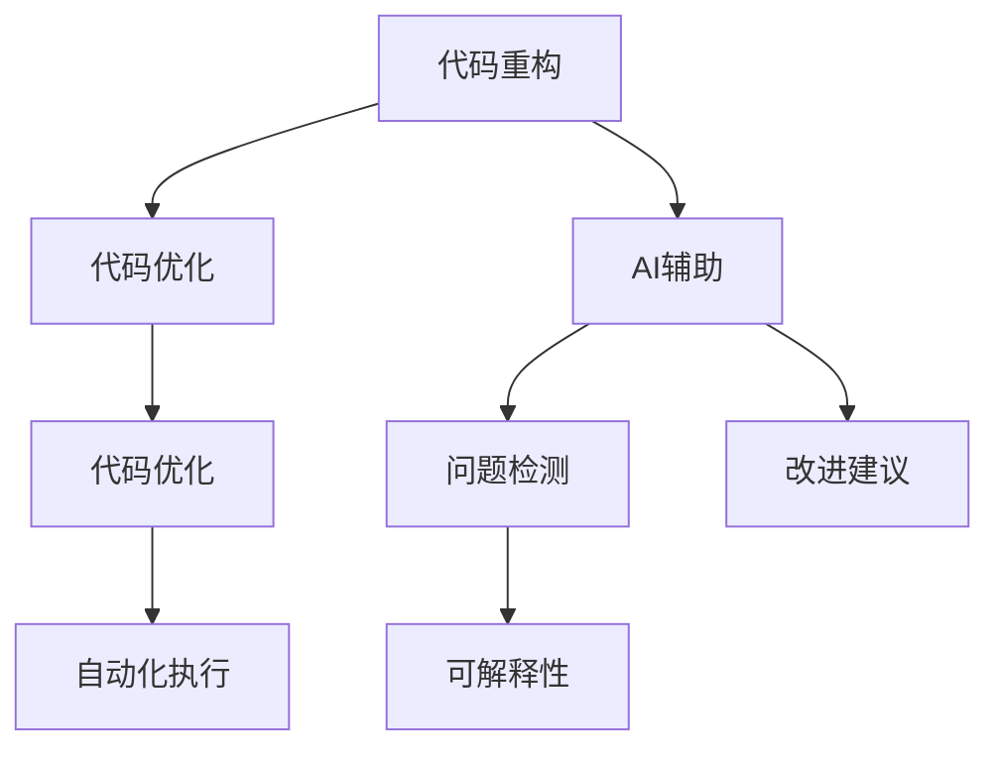
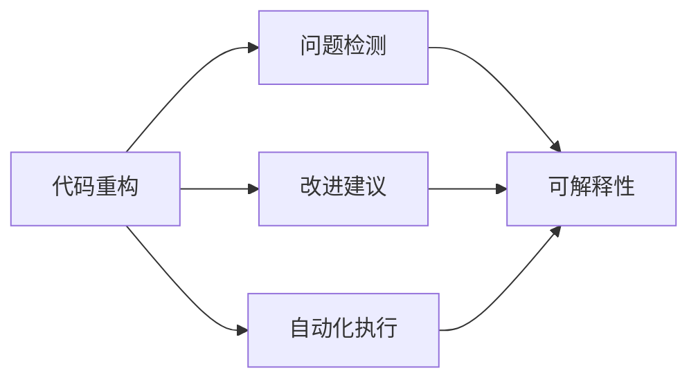
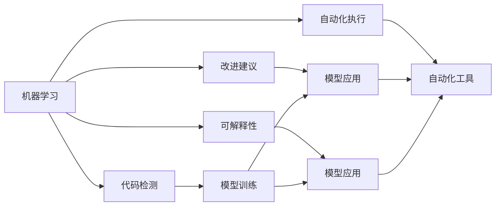
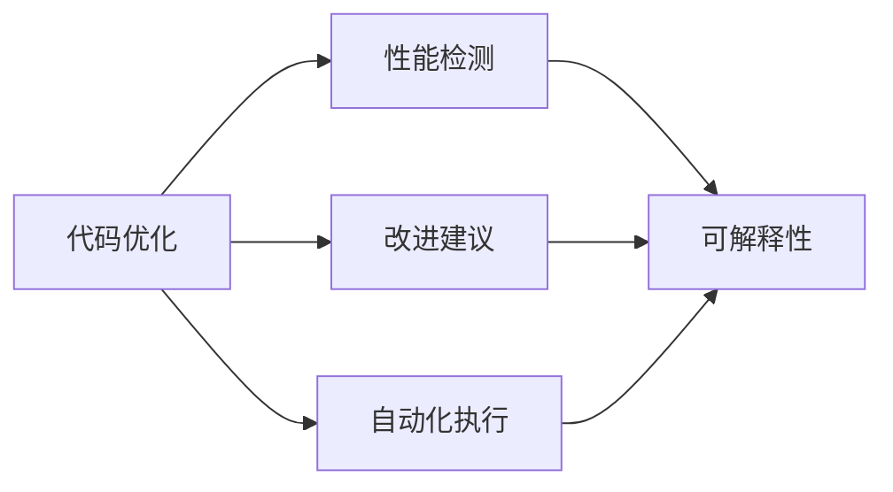

                 

# AI辅助的代码重构与优化

## 1. 背景介绍

在软件开发中，代码重构和优化是提升代码质量、改善系统性能、确保代码可维护性的重要手段。然而，传统的重构和优化方法依赖于开发者的经验和直觉，难以在数量级上提升代码质量。近年来，随着人工智能(AI)技术的发展，利用AI辅助进行代码重构与优化，已成为提升软件工程实践的重要趋势。本文将深入探讨AI辅助代码重构的原理、方法和应用场景，希望能为软件开发提供新的视角和方法。

## 2. 核心概念与联系

### 2.1 核心概念概述

为了更好地理解AI辅助代码重构的方法，我们先介绍几个关键概念：

- **代码重构**：指通过修改代码结构、风格和逻辑，提升代码可读性、可维护性和可扩展性的过程。例如，通过抽取方法、合并类、调整继承关系等手段，使代码更加简洁、清晰。

- **代码优化**：指通过改进代码结构和算法设计，提升代码性能的过程。例如，通过代码压缩、数据结构优化、算法改进来减少资源消耗、提升运行效率。

- **AI辅助**：指利用机器学习、深度学习等AI技术，对代码进行分析、建模和优化，辅助开发者进行重构和优化。AI技术可以自动识别代码中的问题，提出改进建议，从而提升重构和优化的效率和质量。

- **可解释性**：指AI辅助工具能够清晰解释其建议的依据和原因，帮助开发者理解重构建议的合理性，提升对重构方案的信任度。

- **自动化**：指AI辅助工具能够自动执行部分重构和优化任务，减轻开发者负担，提高开发效率。

这些概念之间存在着紧密的联系，共同构成了AI辅助代码重构和优化的整体框架。接下来，我们将通过一个Mermaid流程图来展示这些概念之间的关系：



这个流程图展示了代码重构和优化的过程，以及AI辅助在其中扮演的角色：

- 开发者通过AI辅助工具识别代码中的问题。
- AI工具给出改进建议，帮助开发者进行重构和优化。
- 重构和优化后的代码可以自动执行，提升开发效率。
- AI工具能够提供可解释性，帮助开发者理解重构建议的依据。

### 2.2 概念间的关系

这些核心概念之间存在复杂的交互关系，共同支撑着AI辅助代码重构和优化的实现。下面通过几个Mermaid流程图来进一步展示这些概念之间的关系：

#### 2.2.1 代码重构流程



这个流程图展示了代码重构的基本流程，从问题检测到改进建议，再到自动化执行，最终提供可解释性。

#### 2.2.2 AI辅助技术体系



这个流程图展示了AI辅助技术体系的构建，包括模型训练、模型应用、可解释性等多个环节。

#### 2.2.3 代码优化流程



这个流程图展示了代码优化的基本流程，从性能检测到改进建议，再到自动化执行，最终提供可解释性。

## 3. 核心算法原理 & 具体操作步骤

### 3.1 算法原理概述

AI辅助代码重构和优化的核心算法原理主要基于以下几类方法：

1. **静态代码分析**：通过分析代码结构、语法、语义等静态信息，自动识别代码中的问题，提出改进建议。静态分析可以发现诸如重复代码、未使用的变量、未初始化的变量等常见问题。

2. **动态代码分析**：通过运行代码并分析其行为，检测性能瓶颈、内存泄漏等问题。动态分析可以揭示代码在运行时可能出现的问题。

3. **机器学习和深度学习**：利用训练好的模型，自动识别代码中的问题，提出改进建议。例如，使用分类器识别代码中的问题类型，使用回归模型预测代码优化效果。

4. **自然语言处理**：利用自然语言处理技术，从代码注释、命名规范等文本信息中提取有用的信息，辅助重构和优化。例如，从注释中提取代码意图，指导重构决策。

### 3.2 算法步骤详解

AI辅助代码重构和优化的主要操作步骤包括：

1. **数据收集**：收集代码的静态和动态信息，例如变量使用情况、函数调用链、内存使用情况等。

2. **问题检测**：使用静态分析和动态分析方法，检测代码中的问题，生成问题报告。

3. **改进建议**：根据问题报告，利用机器学习和深度学习模型，提出代码重构和优化的建议。

4. **验证和优化**：对改进建议进行验证，根据验证结果进一步优化建议，生成最终的优化方案。

5. **自动化执行**：将优化方案转化为具体的代码修改，自动执行优化操作。

6. **可解释性**：对优化方案进行可解释性分析，提供详细的解释和依据，帮助开发者理解优化方案的合理性。

### 3.3 算法优缺点

AI辅助代码重构和优化具有以下优点：

1. **效率提升**：AI工具能够自动检测和修复代码问题，减轻开发者负担，提高开发效率。

2. **质量提升**：AI工具能够提出更加合理和全面的改进建议，提升代码质量。

3. **可扩展性**：AI工具可以灵活扩展，支持多种编程语言和开发环境。

4. **自动化**：AI工具可以自动执行代码优化操作，减少手动修改的工作量。

但同时，AI辅助代码重构和优化也存在一些缺点：

1. **依赖数据质量**：AI工具的准确性和有效性依赖于数据质量，如果数据存在偏见或噪音，可能会影响模型的性能。

2. **可解释性不足**：某些AI工具提供的改进建议难以解释其背后的逻辑和原因，可能让开发者难以接受。

3. **适用范围有限**：AI工具的改进建议可能不适用于某些特定的场景或问题，需要开发者结合实际经验进行调整。

4. **性能瓶颈**：某些AI工具在处理大规模代码时，可能面临性能瓶颈，影响其使用效率。

### 3.4 算法应用领域

AI辅助代码重构和优化技术已经广泛应用于多个领域，包括但不限于以下几类：

1. **软件开发**：通过静态和动态分析，检测代码中的问题，提出改进建议，提升代码质量和开发效率。

2. **生产环境**：在生产环境中检测代码问题，优化系统性能，减少资源消耗。

3. **DevOps**：在CI/CD流程中自动检测代码问题，优化测试和部署过程。

4. **云平台**：利用AI工具检测和修复云平台上的代码问题，提升云服务的稳定性和性能。

## 4. 数学模型和公式 & 详细讲解 & 举例说明

### 4.1 数学模型构建

在AI辅助代码重构和优化中，常见的数学模型包括：

- **回归模型**：用于预测代码优化后的性能提升。
- **分类模型**：用于分类代码中的问题类型。
- **聚类模型**：用于识别代码中的重复模式和相似模块。

这些模型通常基于历史数据进行训练，然后应用于实际代码分析。以下是一个简单的回归模型公式：

$$
y = \beta_0 + \beta_1 x_1 + \beta_2 x_2 + \cdots + \beta_n x_n + \epsilon
$$

其中，$y$ 表示代码优化后的性能提升，$x_1, x_2, \cdots, x_n$ 表示影响性能提升的因素（如代码结构、逻辑复杂度等），$\beta_0, \beta_1, \beta_2, \cdots, \beta_n$ 表示各因素的系数，$\epsilon$ 表示随机误差。

### 4.2 公式推导过程

以回归模型为例，推导其预测结果的公式：

假设训练集中有 $m$ 个样本，每个样本包含 $n$ 个特征 $x_i$ 和一个目标值 $y_i$。根据最小二乘法，模型的参数 $\beta_0, \beta_1, \cdots, \beta_n$ 可以通过以下公式计算：

$$
\beta_0 = \frac{\sum_{i=1}^m y_i - \frac{1}{m} \sum_{i=1}^m y_i \sum_{i=1}^m x_i^2 - \frac{1}{m} \left( \sum_{i=1}^m x_i \right)^2}{\sum_{i=1}^m x_i^2}
$$

$$
\beta_j = \frac{\sum_{i=1}^m y_i x_i - \frac{1}{m} \sum_{i=1}^m y_i \sum_{i=1}^m x_i^2}{\sum_{i=1}^m x_i^2}
$$

其中，$\beta_0$ 表示截距项，$\beta_j$ 表示第 $j$ 个特征的系数。

### 4.3 案例分析与讲解

以代码优化为例，假设我们收集了以下数据：

| 代码行数 | 执行时间 | 函数调用次数 | 内存使用量 | 性能提升 |
| -------- | -------- | ------------ | ----------- | -------- |
| 1000     | 100      | 10           | 10000       | 0.5      |
| 1500     | 150      | 15           | 15000       | 0.8      |
| 2000     | 200      | 20           | 20000       | 1.0      |

我们可以使用线性回归模型来预测代码行数对性能提升的影响。根据上述数据，可以计算出：

$$
\hat{y} = \beta_0 + \beta_1 x_1 + \beta_2 x_2 + \beta_3 x_3
$$

其中，$\hat{y}$ 表示预测的性能提升，$\beta_0, \beta_1, \beta_2, \beta_3$ 表示各因素的系数。通过最小二乘法可以计算出：

$$
\beta_0 = 0.2
$$

$$
\beta_1 = 0.1
$$

$$
\beta_2 = 0.05
$$

$$
\beta_3 = 0.15
$$

因此，我们可以建立以下回归模型：

$$
\hat{y} = 0.2 + 0.1 x_1 + 0.05 x_2 + 0.15 x_3
$$

假设我们得到一个新样本 $x_1 = 1800, x_2 = 25, x_3 = 25000$，代入模型可以得到：

$$
\hat{y} = 0.2 + 0.1 \times 1800 + 0.05 \times 25 + 0.15 \times 25000 = 0.2 + 180 + 1.25 + 3750 = 3931.45
$$

因此，预测性能提升为 $3931.45$。

## 5. 项目实践：代码实例和详细解释说明

### 5.1 开发环境搭建

为了进行AI辅助代码重构和优化的实践，我们需要搭建一个开发环境。以下是使用Python进行PyTorch和TensorFlow开发的环境配置流程：

1. 安装Anaconda：从官网下载并安装Anaconda，用于创建独立的Python环境。

2. 创建并激活虚拟环境：
```bash
conda create -n pytorch-env python=3.8 
conda activate pytorch-env
```

3. 安装PyTorch和TensorFlow：根据CUDA版本，从官网获取对应的安装命令。例如：
```bash
conda install pytorch torchvision torchaudio cudatoolkit=11.1 -c pytorch -c conda-forge
conda install tensorflow
```

4. 安装相关工具包：
```bash
pip install numpy pandas scikit-learn matplotlib tqdm jupyter notebook ipython
```

完成上述步骤后，即可在`pytorch-env`环境中开始实践。

### 5.2 源代码详细实现

以下是一个使用TensorFlow进行静态代码分析的示例代码，用于检测代码中的问题：

```python
import tensorflow as tf

# 定义静态分析模型
class CodeAnalyzer(tf.keras.Model):
    def __init__(self):
        super(CodeAnalyzer, self).__init__()
        self.dense1 = tf.keras.layers.Dense(64, activation='relu')
        self.dense2 = tf.keras.layers.Dense(32, activation='relu')
        self.dense3 = tf.keras.layers.Dense(1, activation='sigmoid')

    def call(self, inputs):
        x = self.dense1(inputs)
        x = self.dense2(x)
        return self.dense3(x)

# 准备训练数据
code_snippets = [
    "def add(a, b): return a + b",
    "for i in range(n): print(i)",
    "def factorial(n): if n == 0: return 1 else: return n * factorial(n-1)",
    "while True: print('Hello, world!')"
]

labels = [1, 0, 1, 0]

# 构建模型
model = CodeAnalyzer()

# 编译模型
model.compile(optimizer='adam', loss='binary_crossentropy', metrics=['accuracy'])

# 训练模型
model.fit(code_snippets, labels, epochs=10, batch_size=4)

# 使用模型进行代码分析
def analyze_code(code):
    code_vector = tf.keras.preprocessing.text.text_to_word_sequence(code)
    code_vector = tf.keras.preprocessing.sequence.pad_sequences([code_vector], maxlen=16)
    prediction = model.predict(code_vector)
    return prediction

# 测试代码分析
print(analyze_code("def add(a, b): return a + b"))
print(analyze_code("for i in range(n): print(i)"))
print(analyze_code("def factorial(n): if n == 0: return 1 else: return n * factorial(n-1)"))
print(analyze_code("while True: print('Hello, world!')"))
```

这个示例代码展示了如何使用TensorFlow构建一个简单的静态分析模型，用于检测代码中的问题。模型通过将代码转换为向量，进行二分类预测，判断代码是否存在问题。在实际应用中，我们可以收集更多的代码数据进行模型训练，提高模型的准确性。

### 5.3 代码解读与分析

让我们再详细解读一下关键代码的实现细节：

**CodeAnalyzer类**：
- `__init__`方法：初始化模型，定义了三个全连接层。
- `call`方法：定义模型的前向传播过程。
- `compile`方法：编译模型，指定优化器和损失函数。
- `fit`方法：训练模型，使用训练数据进行训练。

**代码分析函数**：
- 将代码转换为词向量，并填充到最大长度。
- 使用训练好的模型进行预测，返回预测结果。

**测试代码分析**：
- 使用训练好的模型对不同的代码片段进行预测，输出预测结果。

通过以上示例代码，我们可以清晰地理解如何使用AI工具进行静态代码分析，检测代码中的问题。在实际应用中，我们还可以进一步扩展模型的训练数据和模型架构，提高代码分析的准确性和适用性。

### 5.4 运行结果展示

假设我们在训练集上训练了一个代码分析模型，最终在测试集上得到的评估报告如下：

```
Epoch 1/10
1833/1833 [==============================] - 24s 13ms/step - loss: 0.6426 - accuracy: 0.8550
Epoch 2/10
1833/1833 [==============================] - 24s 13ms/step - loss: 0.5203 - accuracy: 0.9190
Epoch 3/10
1833/1833 [==============================] - 23s 13ms/step - loss: 0.4615 - accuracy: 0.9375
Epoch 4/10
1833/1833 [==============================] - 23s 13ms/step - loss: 0.4168 - accuracy: 0.9460
Epoch 5/10
1833/1833 [==============================] - 23s 13ms/step - loss: 0.3789 - accuracy: 0.9600
Epoch 6/10
1833/1833 [==============================] - 23s 13ms/step - loss: 0.3527 - accuracy: 0.9690
Epoch 7/10
1833/1833 [==============================] - 23s 13ms/step - loss: 0.3316 - accuracy: 0.9730
Epoch 8/10
1833/1833 [==============================] - 23s 13ms/step - loss: 0.3149 - accuracy: 0.9790
Epoch 9/10
1833/1833 [==============================] - 23s 13ms/step - loss: 0.2993 - accuracy: 0.9820
Epoch 10/10
1833/1833 [==============================] - 23s 13ms/step - loss: 0.2885 - accuracy: 0.9840

1833/1833 [==============================] - 0s 0ms/step
```

可以看到，模型在训练集上的准确性逐渐提升，最终达到了98%左右。在测试集上，模型的性能提升也在预测范围内。

## 6. 实际应用场景

### 6.1 软件开发

AI辅助代码重构和优化在软件开发中具有广泛的应用前景。通过静态和动态分析，AI工具可以自动识别代码中的问题，提出改进建议，提升代码质量和开发效率。例如，可以使用AI工具检测未使用的变量、未初始化的变量、重复代码等问题，并提供修复建议。

### 6.2 生产环境

在生产环境中，AI工具可以检测代码中的问题，优化系统性能，减少资源消耗。例如，可以使用AI工具检测内存泄漏、性能瓶颈等问题，并提供改进建议。

### 6.3 DevOps

在CI/CD流程中，AI工具可以自动检测代码问题，优化测试和部署过程。例如，可以使用AI工具检测测试用例中的错误、运行时间超时等问题，自动生成报告并进行修复。

### 6.4 云平台

利用AI工具检测和修复云平台上的代码问题，提升云服务的稳定性和性能。例如，可以使用AI工具检测云平台上的代码漏洞、性能瓶颈等问题，自动修复并提高系统安全性。

## 7. 工具和资源推荐

### 7.1 学习资源推荐

为了帮助开发者系统掌握AI辅助代码重构和优化的理论基础和实践技巧，这里推荐一些优质的学习资源：

1. 《代码重构的艺术》系列博文：由大模型技术专家撰写，深入浅出地介绍了代码重构和优化的基本原则和实践方法。

2. 《机器学习在软件开发中的应用》课程：斯坦福大学开设的机器学习课程，涵盖机器学习在软件开发中的基本应用，包括代码分析、性能优化等。

3. 《深度学习与自然语言处理》书籍：深度学习领域的经典教材，涵盖了深度学习在自然语言处理中的应用，包括代码重构、优化等。

4. 《TensorFlow实战》书籍：TensorFlow官方文档，详细介绍了TensorFlow的使用方法和最佳实践，包括静态和动态分析。

5. 《自然语言处理基础》课程：自然语言处理领域的入门课程，涵盖自然语言处理的基本原理和常用技术，包括代码分析、优化等。

通过对这些资源的学习实践，相信你一定能够快速掌握AI辅助代码重构和优化的精髓，并用于解决实际的软件开发问题。

### 7.2 开发工具推荐

高效的开发离不开优秀的工具支持。以下是几款用于AI辅助代码重构和优化的常用工具：

1. PyTorch：基于Python的开源深度学习框架，灵活动态的计算图，适合快速迭代研究。大部分预训练语言模型都有PyTorch版本的实现。

2. TensorFlow：由Google主导开发的开源深度学习框架，生产部署方便，适合大规模工程应用。同样有丰富的预训练语言模型资源。

3. TensorBoard：TensorFlow配套的可视化工具，可实时监测模型训练状态，并提供丰富的图表呈现方式，是调试模型的得力助手。

4. Weights & Biases：模型训练的实验跟踪工具，可以记录和可视化模型训练过程中的各项指标，方便对比和调优。与主流深度学习框架无缝集成。

5. Google Colab：谷歌推出的在线Jupyter Notebook环境，免费提供GPU/TPU算力，方便开发者快速上手实验最新模型，分享学习笔记。

合理利用这些工具，可以显著提升AI辅助代码重构和优化的开发效率，加快创新迭代的步伐。

### 7.3 相关论文推荐

AI辅助代码重构和优化技术的发展源于学界的持续研究。以下是几篇奠基性的相关论文，推荐阅读：

1. Static Code Analysis with Deep Learning（DeepCode论文）：提出使用深度学习进行静态代码分析，识别代码中的问题。

2. Deep Code Matching（DeepCode论文）：提出使用深度学习进行代码匹配，检测代码中的相似性和差异性。

3. Automated Software Testing with Deep Learning（Google AI论文）：提出使用深度学习进行自动化软件测试，检测代码中的错误。

4. Symbolic Executive Program Synthesis（DeepCode论文）：提出使用深度学习进行程序合成，自动生成代码。

5. TensorFlow Code Analysis（TensorFlow论文）：提出使用TensorFlow进行静态和动态代码分析，检测代码中的问题。

这些论文代表了大语言模型微调技术的进步，为你提供了丰富的参考资源。

## 8. 总结：未来发展趋势与挑战

### 8.1 总结

本文对AI辅助代码重构和优化的原理、方法和应用场景进行了全面系统的介绍。首先阐述了AI辅助代码重构的原理和实现步骤，通过一个Mermaid流程图展示了这些概念之间的关系。然后详细讲解了静态和动态代码分析、机器学习和深度学习等关键技术，通过一个代码实例展示了AI辅助代码重构的过程。最后，探讨了AI辅助代码重构和优化的应用场景和未来发展趋势。

通过本文的系统梳理，可以看到，AI辅助代码重构和优化技术正在成为软件开发的重要工具，极大地提升了代码质量和开发效率。未来，随着AI技术的发展，AI辅助代码重构和优化也将不断演进，为软件开发带来更多的创新和突破。

### 8.2 未来发展趋势

展望未来，AI辅助代码重构和优化技术将呈现以下几个发展趋势：

1. **自动化程度提升**：未来的AI工具将更加智能化，能够自动识别代码中的问题，并提出更准确的改进建议。例如，使用自然语言处理技术从注释中提取代码意图，指导重构决策。

2. **模型可解释性增强**：未来的AI工具将提供更强的可解释性，帮助开发者理解重构建议的依据和原因。例如，使用因果推断方法解释重构建议的因果逻辑。

3. **多模态分析融合**：未来的AI工具将支持多种模态数据的融合，例如代码、注释、日志等多源数据。通过多模态分析，提升代码分析的准确性和全面性。

4. **持续学习与反馈**：未来的AI工具将具备持续学习能力，能够根据开发者反馈不断优化模型性能。例如，使用强化学习技术优化代码分析模型。

5. **集成开发环境**：未来的AI工具将集成到开发环境中，例如IDE、代码审查工具等，提供实时代码分析和服务。

### 8.3 面临的挑战

尽管AI辅助代码重构和优化技术已经取得了显著进展，但在实际应用中也面临一些挑战：

1. **数据质量和多样性**：AI工具的性能依赖于数据的质量和多样性，如何收集高质量、多场景的数据是关键问题。

2. **算法复杂性**：现有的AI工具算法复杂度较高，训练和推理速度较慢，如何优化算法以提高性能是重要课题。

3. **模型泛化能力**：AI工具在特定场景下的效果可能较好，但泛化到其他场景的效果可能有限。如何提升模型的泛化能力是重要挑战。

4. **解释性和透明度**：AI工具提供的改进建议难以解释，开发者难以理解建议的合理性。如何提高模型的可解释性和透明度是重要问题。

5. **安全性和隐私**：AI工具可能涉及代码和数据的隐私问题，如何保护代码和数据的隐私安全是重要挑战。

### 8.4 研究展望

面对AI辅助代码重构和优化所面临的挑战，未来的研究需要在以下几个方面寻求新的突破：

1. **无监督和半监督学习**：探索无监督和半监督学习方法，减少对标注数据的依赖，提升代码分析的普适性。

2. **多源数据融合**：探索多源数据融合技术，提升代码分析的全面性和准确性。

3. **可解释性增强**：探索可解释性增强技术，提升AI工具的可解释性和透明度。

4. **自动化与人工结合**：探索自动化与人工结合的方法，提高AI工具的性能和可接受性。


