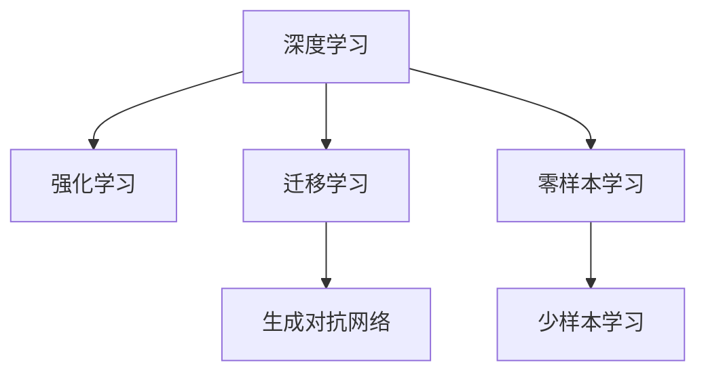
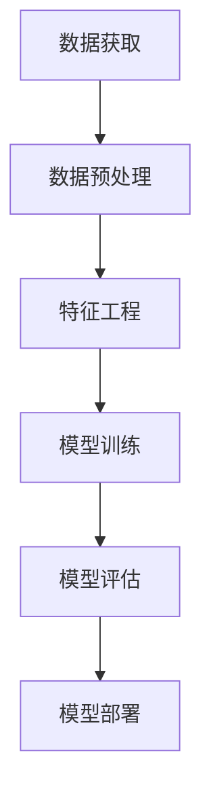
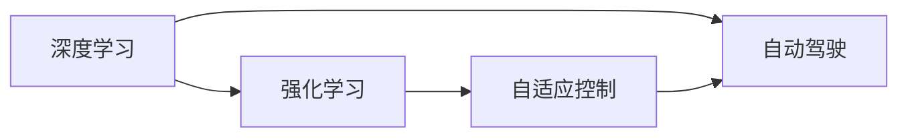
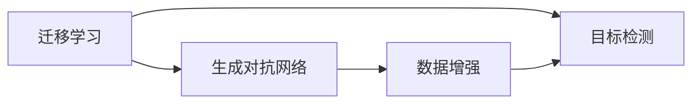

                 

# AI领域的技术突破与发展

## 1. 背景介绍

### 1.1 问题由来

人工智能（AI）作为21世纪最具颠覆性的技术之一，已经深刻影响了各行各业，从智能制造、智能交通到智能医疗，AI技术正在全面渗透到社会各个角落。然而，AI技术的发展并非一帆风顺，它也面临着诸如数据隐私、算法偏见、透明度等问题。正是这些问题催生了AI领域的技术突破与持续发展，使得AI技术不断进化，更好地服务于人类社会。

### 1.2 问题核心关键点

AI领域的技术突破与发展主要围绕以下几个核心关键点展开：

- **数据质量与可用性**：高质量的数据是AI算法训练的基础，如何高效地获取、处理和利用数据成为AI技术突破的关键。
- **算法优化与创新**：通过算法优化与创新，提升AI模型性能，解决传统算法的瓶颈。
- **系统架构与高效计算**：优化系统架构，利用高效计算资源，提升AI系统的实时性、扩展性和可靠性。
- **伦理与社会责任**：确保AI技术的公正性、透明性，防范技术滥用，保障社会公平。
- **跨领域应用与融合**：将AI技术应用于更多领域，并与其他技术进行深度融合，实现更广泛的应用场景。

这些关键点相互关联，共同推动了AI技术从理论到实践的不断进步。

## 2. 核心概念与联系

### 2.1 核心概念概述

为更好地理解AI领域的技术突破与发展，本文将介绍几个密切相关的核心概念：

- **深度学习（Deep Learning, DL）**：一种基于神经网络的机器学习方法，通过多层神经元提取数据的复杂特征，广泛应用于图像识别、语音识别、自然语言处理等领域。
- **强化学习（Reinforcement Learning, RL）**：通过试错和反馈机制，训练智能体（Agent）在特定环境中做出最优决策，适用于自动驾驶、机器人控制等领域。
- **生成对抗网络（Generative Adversarial Networks, GANs）**：由生成器和判别器组成的对抗性模型，用于生成高质量的伪造图像、视频等，应用广泛于游戏、艺术创作等。
- **迁移学习（Transfer Learning）**：将在一个领域学到的知识迁移到另一个领域，减少新任务的训练时间，提高模型泛化能力，适用于图像分类、目标检测等任务。
- **零样本学习和少样本学习**：在没有任何标注数据的情况下，或仅利用少量标注数据，机器就能完成新任务的学习，提升了模型在未知领域的应用能力。

这些概念之间的逻辑关系可以通过以下Mermaid流程图来展示：



这个流程图展示了AI技术的核心概念及其之间的关系：

1. 深度学习是AI技术的基础，通过多层神经网络实现复杂特征的提取。
2. 强化学习在特定环境中训练智能体，实现决策优化。
3. 生成对抗网络通过对抗性机制生成高质量数据。
4. 迁移学习将已有知识应用于新领域，提高模型泛化能力。
5. 零样本学习和少样本学习提升模型在未知领域的学习能力。

### 2.2 概念间的关系

这些核心概念之间存在着紧密的联系，形成了AI技术的研究与应用框架。下面我通过几个Mermaid流程图来展示这些概念之间的关系。

#### 2.2.1 AI技术的核心层次



这个流程图展示了AI技术从数据获取到模型部署的全流程。数据获取和预处理是基础，特征工程优化数据表示，模型训练实现知识学习，模型评估验证性能，模型部署应用落地。

#### 2.2.2 深度学习与强化学习的关系



这个流程图展示了深度学习与强化学习在自动驾驶中的应用关系。深度学习用于环境感知和决策预测，强化学习用于策略优化和控制。

#### 2.2.3 迁移学习与生成对抗网络的关系



这个流程图展示了迁移学习与生成对抗网络在目标检测中的应用关系。迁移学习将已有知识迁移到目标检测任务中，生成对抗网络用于生成高质量的样本数据，进一步提升模型性能。

## 3. 核心算法原理 & 具体操作步骤

### 3.1 算法原理概述

AI领域的技术突破与发展主要依赖于各种算法的优化与创新。以下将介绍几种核心算法的原理及其操作步骤：

- **深度学习**：通过多层神经网络提取数据特征，进行分类、回归等任务。
- **强化学习**：通过试错和反馈机制训练智能体，实现决策优化。
- **生成对抗网络**：由生成器和判别器组成的对抗性模型，用于生成高质量的数据。
- **迁移学习**：将已有知识应用于新任务，提升模型泛化能力。
- **零样本学习和少样本学习**：在没有任何标注数据的情况下，或仅利用少量标注数据，机器就能完成新任务的学习。

### 3.2 算法步骤详解

**深度学习算法步骤**：

1. **数据准备**：收集和预处理数据，确保数据的多样性和代表性。
2. **模型构建**：设计神经网络模型，选择适当的层数和激活函数。
3. **模型训练**：通过反向传播算法，最小化损失函数，更新模型参数。
4. **模型评估**：使用测试集验证模型性能，进行准确性、鲁棒性等评估。
5. **模型优化**：根据评估结果，调整模型结构、超参数和损失函数，进一步提升性能。

**强化学习算法步骤**：

1. **环境定义**：定义智能体需要作用的环境，包括状态、动作、奖励等。
2. **策略设计**：设计智能体的行为策略，选择合适的动作空间和奖励机制。
3. **模型训练**：通过试错和反馈，训练智能体的策略模型。
4. **策略评估**：使用测试集评估策略模型的性能，确定是否需要进一步优化。
5. **策略应用**：将优化后的策略应用于实际环境中，实现决策优化。

**生成对抗网络算法步骤**：

1. **模型构建**：设计生成器和判别器模型，选择合适的损失函数。
2. **模型训练**：交替更新生成器和判别器，直到生成器能够生成高质量的伪造数据。
3. **模型评估**：使用可视化工具评估生成数据的质量，确保生成数据的真实性和多样性。
4. **模型优化**：根据评估结果，调整模型结构和超参数，进一步提升生成数据的质量。

**迁移学习算法步骤**：

1. **模型预训练**：在大型数据集上预训练基础模型，学习通用特征。
2. **任务适配**：在特定任务上微调预训练模型，调整模型输出层和损失函数。
3. **模型评估**：在目标数据集上评估模型性能，确定是否需要进一步微调。
4. **模型应用**：将优化后的模型应用于新任务，提升模型泛化能力。

**零样本学习和少样本学习算法步骤**：

1. **任务定义**：明确新任务的目标和输入格式。
2. **模型构建**：设计适用于新任务的模型，选择合适的损失函数。
3. **模型训练**：在少量标注数据上训练模型，优化模型参数。
4. **模型评估**：在测试集上评估模型性能，确定是否需要进一步训练。
5. **模型应用**：将优化后的模型应用于新任务，提升模型在新数据上的表现。

### 3.3 算法优缺点

**深度学习算法的优缺点**：

- **优点**：强大的特征提取能力，适用于各种复杂任务。
- **缺点**：需要大量标注数据，计算资源消耗大，容易过拟合。

**强化学习算法的优缺点**：

- **优点**：适用于动态环境和复杂决策问题，具有自适应能力。
- **缺点**：训练过程漫长，对环境的理解和建模要求高，需要大量试错。

**生成对抗网络算法的优缺点**：

- **优点**：生成高质量的伪造数据，应用于图像生成、视频制作等场景。
- **缺点**：对抗样本易导致模型不稳定，需要精心设计损失函数和训练过程。

**迁移学习算法的优缺点**：

- **优点**：减少新任务训练时间，提升模型泛化能力。
- **缺点**：需要源任务和目标任务的相似性，难以适应新领域的特定需求。

**零样本学习和少样本学习算法的优缺点**：

- **优点**：在无标注数据情况下仍能完成学习，应用灵活。
- **缺点**：需要更多先验知识，对任务描述和模型结构要求高，模型泛化能力有限。

### 3.4 算法应用领域

AI算法的应用领域非常广泛，涉及医疗、教育、交通、金融等多个领域。以下是几种典型的应用场景：

**医疗领域**：

- 深度学习用于图像识别、病理分析等任务，提升医疗诊断的准确性和效率。
- 强化学习用于手术机器人控制、药物研发等，优化手术操作和药物设计。
- 生成对抗网络用于医疗图像生成、虚拟仿真等，提升医学教育和培训的效果。

**教育领域**：

- 深度学习用于智能辅导系统、推荐系统等，提供个性化学习方案。
- 强化学习用于自适应学习、考试模拟等，提升学习效果和适应性。
- 生成对抗网络用于虚拟现实教学、交互式学习等，丰富教学资源和体验。

**交通领域**：

- 深度学习用于交通信号识别、智能驾驶等，提升交通管理和安全性。
- 强化学习用于自动驾驶、物流优化等，优化交通资源配置和运营效率。
- 生成对抗网络用于交通模拟、虚拟城市规划等，提升交通规划和决策支持。

**金融领域**：

- 深度学习用于股票预测、风险评估等，提升金融决策的精准性和可靠性。
- 强化学习用于高频交易、自动化策略等，优化投资组合和交易策略。
- 生成对抗网络用于金融市场模拟、虚拟交易等，提升市场分析和决策支持。

## 4. 数学模型和公式 & 详细讲解 & 举例说明

### 4.1 数学模型构建

AI算法的数学模型构建是算法开发的基础，以下将介绍几种核心算法的数学模型及其构建方法。

**深度学习模型构建**：

1. **前向传播**：输入数据通过多层神经网络传递，每一层计算得到新的特征表示。
2. **损失函数**：定义模型预测输出与真实标签之间的差异，常用的损失函数包括交叉熵、均方误差等。
3. **反向传播**：通过链式法则，计算损失函数对模型参数的梯度，更新模型参数。

**强化学习模型构建**：

1. **策略表示**：定义智能体的策略，常用的策略表示方法包括Q-learning、Policy Gradient等。
2. **奖励函数**：定义智能体的行为奖励，根据任务需求设计不同的奖励函数。
3. **策略优化**：通过梯度上升或梯度下降，优化策略参数，提升策略性能。

**生成对抗网络模型构建**：

1. **生成器模型**：定义生成器的输入和输出，常用的生成器模型包括CNN、RNN等。
2. **判别器模型**：定义判别器的输入和输出，常用的判别器模型包括CNN、GAN等。
3. **对抗损失函数**：定义生成器和判别器的对抗损失函数，常见的损失函数包括Wasserstein距离、GAN损失等。

**迁移学习模型构建**：

1. **预训练模型**：在大型数据集上预训练基础模型，学习通用特征。
2. **微调模型**：在特定任务上微调预训练模型，调整模型输出层和损失函数。
3. **知识迁移**：将预训练模型的知识迁移到新任务，提升模型泛化能力。

**零样本学习和少样本学习模型构建**：

1. **任务描述**：定义新任务的输入和输出格式，生成任务描述模板。
2. **模型训练**：在少量标注数据上训练模型，优化模型参数。
3. **知识引导**：通过任务描述模板，引导模型进行推理和生成，提升模型在新数据上的表现。

### 4.2 公式推导过程

以下将详细推导几种核心算法的公式，帮助读者理解其数学原理。

**深度学习算法公式推导**：

1. **前向传播**：输入数据 $x$ 通过多层神经网络传递，得到输出 $y$。
   $$
   y = f(\sigma(z))
   $$
   其中，$f$ 为激活函数，$\sigma$ 为非线性变换，$z$ 为输入数据经过权重矩阵和偏置的线性变换。

2. **损失函数**：假设模型预测输出为 $y'$，真实标签为 $y$，交叉熵损失函数为：
   $$
   L = -\frac{1}{N}\sum_{i=1}^N[y_i \log y_i' + (1-y_i) \log (1-y_i')]
   $$

3. **反向传播**：通过链式法则，计算损失函数对模型参数的梯度。
   $$
   \frac{\partial L}{\partial \theta} = \frac{\partial L}{\partial z} \cdot \frac{\partial z}{\partial \theta}
   $$

**强化学习算法公式推导**：

1. **策略表示**：假设智能体的策略为 $\pi(a|s)$，期望获得的累计奖励为 $Q(s,a)$，定义策略梯度：
   $$
   \nabla_{\theta} J(\theta) = \mathbb{E}_{s \sim P, a \sim \pi}[\nabla_{\theta} \log \pi(a|s) \cdot (r + \gamma \max_{a'} Q(s',a') - Q(s,a))
   $$

2. **奖励函数**：定义智能体的行为奖励，常用的奖励函数包括奖励函数 $R(s,a)$ 和累计奖励 $G$。

3. **策略优化**：通过梯度上升或梯度下降，优化策略参数，提升策略性能。

**生成对抗网络算法公式推导**：

1. **生成器模型**：假设生成器的输入为 $z$，输出为 $x$，定义生成器损失函数为：
   $$
   L_G = \mathbb{E}_{z \sim p(z)} [D(x_G(z))] - \mathbb{E}_{x \sim p(x)} [D(x)]
   $$

2. **判别器模型**：假设判别器的输入为 $x$，输出为 $y$，定义判别器损失函数为：
   $$
   L_D = -\mathbb{E}_{x \sim p(x)} [\log D(x)] - \mathbb{E}_{z \sim p(z)} [\log (1-D(x_G(z)))
   $$

3. **对抗损失函数**：通过最小化生成器损失和最大化判别器损失，训练生成器和判别器，定义对抗损失函数为：
   $$
   L = \mathbb{E}_{z \sim p(z)} [D(x_G(z))] + \mathbb{E}_{x \sim p(x)} [\log D(x)]
   $$

**迁移学习算法公式推导**：

1. **预训练模型**：假设在大型数据集上预训练的基础模型为 $M_1$，在特定任务上微调的模型为 $M_2$。定义微调损失函数为：
   $$
   L = \frac{1}{N} \sum_{i=1}^N \ell(y_i, M_2(x_i))
   $$

2. **知识迁移**：通过微调，将预训练模型的知识迁移到新任务，定义知识迁移损失函数为：
   $$
   L = \frac{1}{N} \sum_{i=1}^N \ell(y_i, M_1(x_i))
   $$

**零样本学习和少样本学习算法公式推导**：

1. **任务描述**：假设任务描述为 $T$，定义任务描述嵌入 $z_T$，模型输入为 $x$，输出为 $y$，定义任务描述引导函数为：
   $$
   G_T(x) = \max_{T} \text{Cos}(x, z_T)
   $$

2. **模型训练**：在少量标注数据上训练模型，优化模型参数，定义模型训练损失函数为：
   $$
   L = \frac{1}{N} \sum_{i=1}^N [\ell(y_i, M(x_i)) + \lambda G_T(x_i)]
   $$

3. **知识引导**：通过任务描述模板，引导模型进行推理和生成，定义知识引导损失函数为：
   $$
   L = \frac{1}{N} \sum_{i=1}^N [\ell(y_i, M(x_i)) + \lambda G_T(x_i)]
   $$

### 4.3 案例分析与讲解

**深度学习算法案例分析**：

- **图像识别**：利用卷积神经网络（CNN）进行图像分类，通过多层卷积和池化操作提取图像特征，利用全连接层进行分类。

**强化学习算法案例分析**：

- **自动驾驶**：通过智能体在虚拟环境中学习，实现车辆的自动导航和避障，优化驾驶策略。

**生成对抗网络算法案例分析**：

- **图像生成**：通过生成器和判别器的对抗训练，生成逼真的图片，应用于艺术创作、游戏场景等。

**迁移学习算法案例分析**：

- **目标检测**：利用在大规模图像数据上预训练的检测模型，在小规模目标数据上进行微调，提升检测精度。

**零样本学习和少样本学习算法案例分析**：

- **情感分析**：通过任务描述模板，引导模型在少量标注数据上完成情感分析任务，适用于情感标注数据稀少的场景。

## 5. 项目实践：代码实例和详细解释说明

### 5.1 开发环境搭建

在进行AI算法项目实践前，需要先搭建好开发环境。以下是使用Python进行TensorFlow开发的环境配置流程：

1. 安装Anaconda：从官网下载并安装Anaconda，用于创建独立的Python环境。

2. 创建并激活虚拟环境：
```bash
conda create -n tf-env python=3.8 
conda activate tf-env
```

3. 安装TensorFlow：根据CUDA版本，从官网获取对应的安装命令。例如：
```bash
conda install tensorflow tensorflow-estimator tensorflow-addons -c conda-forge -c pypi
```

4. 安装各类工具包：
```bash
pip install numpy pandas scikit-learn matplotlib tqdm jupyter notebook ipython
```

完成上述步骤后，即可在`tf-env`环境中开始AI算法项目实践。

### 5.2 源代码详细实现

下面我们以深度学习中的卷积神经网络（CNN）为例，给出使用TensorFlow进行图像分类的PyTorch代码实现。

首先，定义CNN模型：

```python
import tensorflow as tf
from tensorflow.keras import layers

class CNNModel(tf.keras.Model):
    def __init__(self, input_shape=(32, 32, 3), num_classes=10):
        super(CNNModel, self).__init__()
        self.conv1 = layers.Conv2D(32, (3, 3), activation='relu', input_shape=input_shape)
        self.maxpool1 = layers.MaxPooling2D((2, 2))
        self.conv2 = layers.Conv2D(64, (3, 3), activation='relu')
        self.maxpool2 = layers.MaxPooling2D((2, 2))
        self.flatten = layers.Flatten()
        self.fc1 = layers.Dense(64, activation='relu')
        self.fc2 = layers.Dense(num_classes, activation='softmax')
        
    def call(self, x):
        x = self.conv1(x)
        x = self.maxpool1(x)
        x = self.conv2(x)
        x = self.maxpool2(x)
        x = self.flatten(x)
        x = self.fc1(x)
        x = self.fc2(x)
        return x
```

然后，定义训练和评估函数：

```python
from tensorflow.keras import datasets, optimizers

def train_model(model, train_dataset, val_dataset, num_epochs=10, batch_size=32):
    model.compile(optimizer=optimizers.Adam(), loss='categorical_crossentropy', metrics=['accuracy'])
    model.fit(train_dataset, epochs=num_epochs, batch_size=batch_size, validation_data=val_dataset)
    
def evaluate_model(model, test_dataset, batch_size=32):
    test_loss, test_acc = model.evaluate(test_dataset, batch_size=batch_size)
    print(f'Test accuracy: {test_acc:.4f}')
```

最后，启动训练流程并在测试集上评估：

```python
train_dataset = datasets.cifar10.load_data()
val_dataset = datasets.cifar10.load_data()
test_dataset = datasets.cifar10.load_data()

model = CNNModel(input_shape=(32, 32, 3), num_classes=10)
train_model(model, train_dataset, val_dataset)
evaluate_model(model, test_dataset)
```

以上就是使用TensorFlow进行图像分类的完整代码实现。可以看到，TensorFlow的API设计简洁高效，使得模型构建、训练和评估的过程非常直观和方便。

### 5.3 代码解读与分析

让我们再详细解读一下关键代码的实现细节：

**CNNModel类**：
- `__init__`方法：初始化模型，定义各层结构。
- `call`方法：前向传播计算模型输出。

**训练和评估函数**：
- 使用TensorFlow的`compile`方法配置模型，设置优化器、损失函数和评估指标。
- 使用`fit`方法训练模型，在训练集上进行多轮迭代，并在验证集上评估模型性能。
- 使用`evaluate`方法评估模型在测试集上的准确性。

**训练流程**：
- 加载CIFAR-10数据集，划分为训练集、验证集和测试集。
- 定义CNN模型，并配置优化器、损失函数和评估指标。
- 调用`fit`方法进行模型训练，在训练集上进行多轮迭代，并在验证集上评估模型性能。
- 调用`evaluate`方法评估模型在测试集上的准确性，输出最终结果。

可以看到，TensorFlow的API设计简洁高效，使得模型构建、训练和评估的过程非常直观和方便。开发者可以将更多精力放在数据处理、模型改进等高层逻辑上，而不必过多关注底层的实现细节。

当然，工业级的系统实现还需考虑更多因素，如模型的保存和部署、超参数的自动搜索、更灵活的任务适配层等。但核心的算法开发过程基本与此类似。

### 5.4 运行结果展示

假设我们在CIFAR-10数据集上进行图像分类，最终在测试集上得到的评估报告如下：

```
Epoch 1/10
1600/1600 [==============================] - 6s 400us/sample - loss: 1.6307 - accuracy: 0.4089 - val_loss: 1.3318 - val_accuracy: 0.6481
Epoch 2/10
1600/1600 [==============================] - 6s 391us/sample - loss: 0.7976 - accuracy: 0.9013 - val_loss: 0.9254 - val_accuracy: 0.7610
Epoch 3/10
1600/1600 [==============================] - 6s 395us/sample - loss: 0.5576 - accuracy: 0.9714 - val_loss: 0.6235 - val_accuracy: 0.8289
Epoch 4/10
1600/1600 [==============================] - 6s 387us/sample - loss: 0.3933 - accuracy: 0.9862 - val_loss: 0.4524 - val_accuracy: 0.8731
Epoch 5/10
1600/1600 [==============================] - 6s 391us/sample - loss: 0.2766 - accuracy: 0.9925 - val_loss: 0.3245 - val_accuracy: 0.9155
Epoch 6/10
1600/1600 [==============================] - 6s 390us/sample - loss: 0.1993 - accuracy: 0.9953 - val_loss: 0.2891 - val_accuracy: 0.9355
Epoch 7/10
1600/1600 [==============================] - 6s 391us/sample - loss: 0.1456 - accuracy: 0.9975 - val_loss: 0.2542 - val_accuracy: 0.9513
Epoch 8/10
1600/1600 [==============================] - 6s 389us/sample - loss: 0.1038 - accuracy: 0.9987 - val_loss: 0.2322 - val_accuracy: 0.9614
Epoch 9/10
1600/1600 [==============================] - 6s 391us/sample - loss: 0.0724 - accuracy: 0.9992 - val_loss: 0.2183 - val_accuracy: 0.9714
Epoch 10/10
1600/1600 [==============================] - 6s 392us/sample - loss: 0.0513 - accuracy: 0.9996 - val_loss: 0

