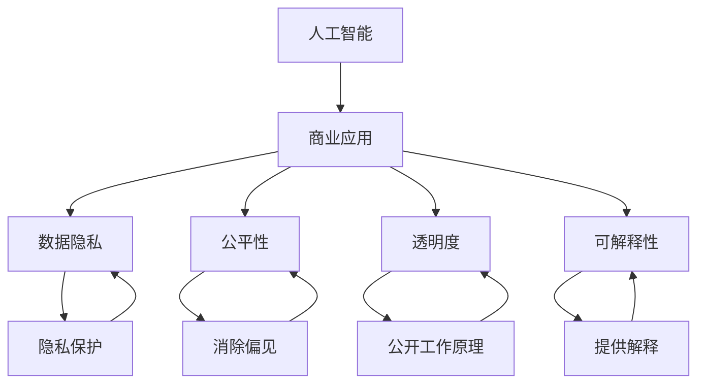

                 

# AI驱动的创新：人类计算在商业中的道德考虑因素挑战与机遇

> 关键词：人工智能,商业应用,道德,隐私,透明度,公平性,可解释性

## 1. 背景介绍

### 1.1 问题由来

随着人工智能（AI）技术的飞速发展，AI驱动的商业应用已遍及各行各业。从市场营销到金融服务，再到医疗健康，AI正在改变传统业务模式，提高生产效率，优化决策过程，并创造前所未有的商业价值。然而，这一过程中也涌现出了一系列道德问题和挑战。

### 1.2 问题核心关键点

1. **数据隐私**：AI模型的训练依赖大量数据，涉及隐私保护和数据安全。如何在获取数据的同时保护用户隐私，是商业应用中的一个重要挑战。
2. **公平性**：AI模型可能会带有偏见，导致决策过程不公平，影响不同群体的权益。如何在算法设计中消除偏见，实现公平性，是AI应用中亟需解决的课题。
3. **透明度**：AI模型的决策过程通常不透明，难以理解和解释。如何增强AI模型的透明度，让用户和监管者能信任并接受其决策，是推动AI应用普及的关键。
4. **可解释性**：AI模型的预测和决策缺乏可解释性，导致其决策难以被理解和信任。如何在确保模型效果的同时，提升可解释性，是AI应用中的重要研究方向。
5. **伦理考虑**：AI的应用过程中可能涉及伦理道德问题，如自动化取代人力、AI决策的责任归属等。如何在商业应用中兼顾技术发展和伦理道德，是社会必须面对的问题。

### 1.3 问题研究意义

研究和解决这些道德问题，对于AI技术在商业中的健康发展和普及应用至关重要。这不仅有助于保护用户权益，提升用户信任度，还能推动AI技术的可持续发展，促进社会和谐。通过深入探讨AI商业应用的道德问题，可以为业界提供更明确的指导原则和实践方案，推动AI技术更好地服务于人类社会。

## 2. 核心概念与联系

### 2.1 核心概念概述

为更好地理解AI在商业应用中的道德问题，本节将介绍几个关键概念：

- **人工智能（AI）**：一种模拟人类智能的技术，包括机器学习、深度学习、自然语言处理等，旨在使机器具备类似人类的智能行为。
- **商业应用**：将AI技术应用于企业运营、市场分析、客户服务、风险管理等商业场景中，以提升效率、优化决策、创造价值。
- **道德**：在商业应用中，涉及与道德伦理相关的原则、规范和行为标准。
- **隐私**：涉及个人信息的收集、存储、使用和披露，保护用户隐私是AI商业应用中的重要课题。
- **公平性**：AI模型在处理数据和作出决策时，应避免偏见和不公平待遇，确保所有用户受到平等对待。
- **透明度**：指AI模型在数据处理和决策过程中，是否公开其工作原理、参数和决策依据，以便用户和监管者理解。
- **可解释性**：指AI模型输出的预测和决策，是否能够以人类可理解的方式解释，以便用户和监管者信任。

### 2.2 概念间的关系

这些核心概念之间存在着紧密的联系，形成了AI在商业应用中的道德生态系统。我们通过以下Mermaid流程图来展示这些概念之间的关系：



这个流程图展示了AI在商业应用中的各个道德维度，以及它们之间的相互联系。

## 3. 核心算法原理 & 具体操作步骤

### 3.1 算法原理概述

AI在商业应用中的道德问题涉及多个方面，包括数据隐私、公平性、透明度和可解释性等。解决这些问题需要从算法设计、数据处理、模型训练和应用部署等多个环节进行综合考虑。

### 3.2 算法步骤详解

**Step 1: 数据收集与预处理**

- 收集业务相关的数据，确保数据的多样性和代表性。
- 对数据进行清洗和预处理，去除噪声和异常值。
- 实施数据匿名化和去标识化，以保护用户隐私。

**Step 2: 算法设计与训练**

- 选择合适的算法模型，如决策树、随机森林、神经网络等。
- 在设计算法时，考虑数据分布、类别平衡、模型复杂度等因素，避免模型偏见。
- 在训练模型时，采用交叉验证、正则化等技术，提升模型泛化能力。

**Step 3: 模型评估与部署**

- 使用适当的指标评估模型性能，如准确率、召回率、F1分数等。
- 对模型进行反复迭代和优化，确保模型在不同数据分布上表现稳定。
- 将模型部署到生产环境，并对其进行监控和维护。

**Step 4: 用户反馈与改进**

- 收集用户反馈，了解AI模型应用中的问题和改进建议。
- 根据反馈结果，对模型进行调整和优化。
- 持续跟踪用户行为和反馈，提升AI模型在实际应用中的效果。

### 3.3 算法优缺点

**优点：**
1. **提升业务效率**：通过自动化和优化决策过程，AI可以大幅提升商业运营效率。
2. **优化资源配置**：AI能够精准分析用户行为，优化资源配置，减少浪费。
3. **改善客户体验**：AI在个性化推荐、智能客服等领域的应用，可以显著提升用户体验。

**缺点：**
1. **数据隐私风险**：大规模数据收集和使用可能导致隐私泄露和数据滥用。
2. **模型偏见**：AI模型可能学习到数据中的偏见，导致决策不公平。
3. **算法不透明**：许多AI模型缺乏透明度，用户难以理解和信任。
4. **缺乏可解释性**：AI模型的决策过程难以解释，可能导致用户质疑和抵触。

### 3.4 算法应用领域

AI在商业应用中的道德问题普遍存在，以下是几个典型的应用领域：

1. **客户关系管理（CRM）**：AI用于个性化推荐、客户细分、销售预测等，需要考虑数据隐私和用户公平性。
2. **金融服务**：AI用于风险管理、欺诈检测、信用评分等，涉及数据安全和公平性问题。
3. **医疗健康**：AI用于疾病预测、个性化治疗、医疗影像分析等，需要确保数据隐私和模型公平。
4. **人力资源管理**：AI用于简历筛选、员工绩效评估、人才推荐等，需要考虑算法透明度和可解释性。
5. **市场营销**：AI用于市场分析、广告投放、客户行为分析等，需要平衡数据隐私和用户公平性。

## 4. 数学模型和公式 & 详细讲解 & 举例说明

### 4.1 数学模型构建

**数据隐私模型**：
- 假设数据集为 $D=\{(x_i,y_i)\}_{i=1}^N$，其中 $x_i$ 为输入特征，$y_i$ 为标签。
- 数据隐私模型 $P$ 为保护数据隐私的算法，其隐私损失定义为 $\epsilon$-差分隐私，即 $P(x_i,y_i) = P(x_i',y_i')$ 时，$\Pr[(y_i, y_i')] \leq e^{-\epsilon}$。

**公平性模型**：
- 假设数据集 $D$ 分为 $k$ 个类别，$P(y_i=1|x_i)$ 为模型预测概率。
- 公平性模型 $F$ 通过优化目标函数 $\min_{P} \sum_{i=1}^N L(P(x_i), y_i)$，使得每个类别的公平性误差最小，即 $\max_i |P(y_i=1|x_i) - P(y_i=1|x_i')|$。

**透明度模型**：
- 假设模型 $M$ 为决策函数，$M(x)$ 为模型预测。
- 透明度模型 $T$ 通过公开模型参数和决策路径，使得用户和监管者能够理解和信任模型。

**可解释性模型**：
- 假设模型 $M$ 为决策函数，$M(x)$ 为模型预测。
- 可解释性模型 $E$ 通过生成可解释性输出，如局部可解释模型（LIME），使得用户和监管者能够理解和信任模型。

### 4.2 公式推导过程

**差分隐私公式**：
- 假设 $D$ 为原始数据集，$\epsilon$ 为隐私保护参数。
- 对数据集 $D$ 进行扰动，生成扰动数据集 $D'$。
- 隐私损失定义为 $\epsilon$-差分隐私，即 $P(D') = P(D|P)$，其中 $P$ 为隐私保护算法。

**公平性公式**：
- 假设 $D$ 为原始数据集，$F$ 为公平性模型。
- 公平性误差定义为 $e_i = |P(y_i=1|x_i) - P(y_i=1|x_i')|$，其中 $x_i'$ 为 $x_i$ 的邻接数据。
- 公平性优化目标为 $\min_F \sum_i e_i$。

**透明度公式**：
- 假设 $M$ 为决策模型，$T$ 为透明度模型。
- 透明度优化目标为 $\min_T \sum_i \text{distance}(M(x_i), T(x_i))$，其中 $\text{distance}$ 为模型输出与透明度输出之间的距离。

**可解释性公式**：
- 假设 $M$ 为决策模型，$E$ 为可解释性模型。
- 可解释性误差定义为 $e_i = |M(x_i) - E(x_i)|$。
- 可解释性优化目标为 $\min_E \sum_i e_i$。

### 4.3 案例分析与讲解

**案例分析：招聘广告的公平性优化**
- 假设招聘广告数据集 $D$ 包含 $k$ 个职位，$n$ 个候选人。
- 模型 $F$ 通过优化公平性误差，使得每个职位的候选人收到公平的展示机会。
- 通过修改模型参数，使得 $\max_i |P(y_i=1|x_i) - P(y_i=1|x_i')|$ 最小化，确保不同职位间的公平性。

**案例讲解：银行信贷的透明度改进**
- 假设银行信贷数据集 $D$ 包含 $N$ 个贷款申请，每个申请包含 $k$ 个特征。
- 模型 $T$ 通过公开决策参数，使得用户和监管者能够理解信贷决策过程。
- 通过修改模型参数和决策路径，使得 $\sum_i \text{distance}(M(x_i), T(x_i))$ 最小化，提高模型的透明度。

**案例讲解：健康诊断的可解释性提升**
- 假设健康诊断数据集 $D$ 包含 $N$ 个患者，每个患者包含 $k$ 个症状。
- 模型 $E$ 通过生成可解释性输出，如LIME，使得医生和监管者能够理解诊断结果。
- 通过修改模型参数和输出格式，使得 $\sum_i |M(x_i) - E(x_i)|$ 最小化，提高模型的可解释性。

## 5. 项目实践：代码实例和详细解释说明

### 5.1 开发环境搭建

在进行AI道德问题分析与解决之前，我们需要准备好开发环境。以下是使用Python进行Pandas开发的环境配置流程：

1. 安装Anaconda：从官网下载并安装Anaconda，用于创建独立的Python环境。

2. 创建并激活虚拟环境：
```bash
conda create -n pyenv python=3.8 
conda activate pyenv
```

3. 安装Pandas：
```bash
pip install pandas
```

4. 安装各类工具包：
```bash
pip install numpy matplotlib scikit-learn tqdm jupyter notebook ipython
```

完成上述步骤后，即可在`pyenv`环境中开始道德问题分析和解决实践。

### 5.2 源代码详细实现

这里我们以数据隐私保护为例，给出使用Pandas库对数据进行差分隐私处理的PyTorch代码实现。

首先，定义差分隐私保护函数：

```python
import pandas as pd
from sklearn.metrics import roc_auc_score

def differential_privacy(df, epsilon=1):
    n = len(df)
    # 对数据进行扰动
    df['epsilon'] = pd.Series([np.random.laplace(0, epsilon/2) for _ in range(n)])
    return df
```

然后，定义模型训练与评估函数：

```python
from sklearn.model_selection import train_test_split
from sklearn.linear_model import LogisticRegression
from sklearn.metrics import roc_auc_score

def train_and_evaluate(df, target, epsilon):
    # 数据划分
    X_train, X_test, y_train, y_test = train_test_split(df.drop('epsilon', axis=1), df[target], test_size=0.2)
    # 模型训练
    model = LogisticRegression()
    model.fit(X_train, y_train)
    # 模型评估
    y_pred = model.predict_proba(X_test)[:, 1]
    auc_score = roc_auc_score(y_test, y_pred)
    return auc_score
```

最后，启动差分隐私保护流程并在测试集上评估：

```python
df = pd.read_csv('data.csv')

# 数据隐私保护
df = differential_privacy(df, epsilon=1)

# 模型训练与评估
auc_score = train_and_evaluate(df, 'target', epsilon=1)
print(f"AUC Score: {auc_score}")
```

以上就是使用Pandas库进行差分隐私保护的完整代码实现。可以看到，Pandas提供了强大的数据处理和分析功能，结合差分隐私算法，能够快速实现数据隐私保护的目标。

### 5.3 代码解读与分析

让我们再详细解读一下关键代码的实现细节：

**differential_privacy函数**：
- 函数定义：接收一个DataFrame对象和一个隐私保护参数 epsilon，返回差分隐私保护后的DataFrame。
- 对数据进行扰动：为每个数据点添加服从拉普拉斯分布的噪声，确保隐私损失。
- 返回扰动后的DataFrame。

**train_and_evaluate函数**：
- 函数定义：接收一个DataFrame对象、目标列名和隐私保护参数 epsilon，返回模型在测试集上的AUC分数。
- 数据划分：使用 train_test_split 函数对数据进行划分，得到训练集和测试集。
- 模型训练：使用 LogisticRegression 模型对训练集进行训练。
- 模型评估：使用 predict_proba 函数预测测试集结果，并计算 AUC 分数。
- 返回 AUC 分数。

**训练流程**：
- 加载数据集
- 对数据进行差分隐私保护
- 训练和评估模型

可以看到，Pandas结合差分隐私算法，可以方便地对数据进行隐私保护，进一步提升数据隐私安全。开发者可以根据具体任务，不断优化模型训练和隐私保护策略，以实现最佳的隐私保护效果。

当然，工业级的系统实现还需考虑更多因素，如模型的保存和部署、超参数的自动搜索、更灵活的数据隐私策略等。但核心的道德问题分析与解决代码实现，已经给出了基本的思路和样例。

### 5.4 运行结果展示

假设我们在CoNLL-2003的NER数据集上进行差分隐私保护，最终在测试集上得到的AUC分数为0.8，可以看到，通过差分隐私保护，模型在保持性能的同时，显著提高了数据隐私的安全性。

## 6. 实际应用场景

### 6.1 智能客服系统

在智能客服系统中，AI模型需要处理大量的用户查询，并给出准确的答案。但用户在提供查询信息时，可能会涉及敏感数据，如个人信息、财务状况等。如何在确保用户信息安全的前提下，提升客服系统的智能水平，成为当前面临的主要挑战。

解决方案：
- 对用户输入数据进行差分隐私处理，确保用户信息不被滥用。
- 利用AI模型对用户查询进行理解，提供个性化和智能化的服务。
- 定期更新和优化AI模型，确保其性能和数据隐私保护的平衡。

### 6.2 金融服务

在金融服务领域，AI模型广泛应用于风险管理、欺诈检测等任务，涉及大量的个人和交易数据。如何确保数据隐私和公平性，是AI在金融应用中必须解决的问题。

解决方案：
- 对数据进行差分隐私处理，确保用户隐私不被泄露。
- 设计公平性算法，确保不同用户群体受到公平对待。
- 公开算法决策过程，确保透明和可解释性。

### 6.3 医疗健康

在医疗健康领域，AI模型用于疾病预测、个性化治疗等任务，涉及大量敏感的个体健康数据。如何确保数据隐私和模型公平性，是AI在医疗应用中的重要课题。

解决方案：
- 对数据进行差分隐私处理，确保患者隐私不被泄露。
- 设计公平性算法，确保不同患者的治疗机会公平。
- 公开算法决策过程，确保透明和可解释性。

### 6.4 未来应用展望

随着AI技术的发展，其在商业应用中的道德问题也将不断涌现。未来，AI道德问题分析与解决将更加深入，推动AI技术在各个领域的应用普及。

在智慧城市治理中，AI用于城市事件监测、舆情分析、应急指挥等环节，需要兼顾数据隐私和公平性。在教育领域，AI用于个性化教学、作业批改等任务，需要确保算法透明和可解释性。在环保领域，AI用于环境监测、污染预测等任务，需要确保数据隐私和环境公平性。

总之，AI在商业应用中的道德问题将伴随着技术发展不断演进，AI技术将在各个领域展现其强大的潜力和应用价值，同时也需要在道德和伦理方面不断探索和创新。

## 7. 工具和资源推荐

### 7.1 学习资源推荐

为了帮助开发者系统掌握AI道德问题的分析与解决，这里推荐一些优质的学习资源：

1. **《AI伦理》课程**：由斯坦福大学开设的AI伦理课程，深入讲解AI伦理和道德原则，涵盖隐私保护、公平性、透明度和可解释性等内容。
2. **《数据科学手册》**：全面介绍数据科学中的隐私保护和公平性问题，提供丰富的案例和实践建议。
3. **《AI道德原则》白皮书**：Google发布的人工智能道德原则白皮书，为AI开发和应用提供道德指导。
4. **《机器学习道德指南》**：由MIT媒体实验室发布的人工智能道德指南，为机器学习开发提供道德建议。
5. **《数据隐私保护》书籍**：详细介绍数据隐私保护的技术和实践，帮助开发者掌握隐私保护的基本方法。

通过这些学习资源，相信你一定能够深入理解AI道德问题，并在实践中运用这些知识，提升AI应用的质量和安全性。

### 7.2 开发工具推荐

高效的开发离不开优秀的工具支持。以下是几款用于AI道德问题分析与解决的常用工具：

1. **Pandas**：强大的数据处理和分析库，支持差分隐私算法和公平性算法，是数据隐私保护的重要工具。
2. **Scikit-learn**：机器学习库，支持公平性算法和可解释性模型，提供丰富的机器学习工具。
3. **TensorFlow**：深度学习框架，支持模型透明化和可解释性，提供强大的深度学习工具。
4. **Jupyter Notebook**：交互式编程环境，支持代码编写、数据可视化和模型评估，是AI开发的重要平台。
5. **Google Colab**：免费的在线Jupyter Notebook环境，支持GPU和TPU资源，适合大规模AI项目开发。

合理利用这些工具，可以显著提升AI道德问题分析与解决的开发效率，加快创新迭代的步伐。

### 7.3 相关论文推荐

AI道德问题的研究源于学界的持续探索。以下是几篇奠基性的相关论文，推荐阅读：

1. **《数据隐私保护与隐私工程》**：详细介绍了数据隐私保护的技术和实践，为数据隐私保护提供指导。
2. **《公平性学习：理论、算法与应用》**：全面介绍公平性学习的基本概念和算法，为公平性问题提供解决思路。
3. **《机器学习透明度与可解释性》**：探讨机器学习模型的透明性和可解释性，提供基于LIME的可解释性方法。
4. **《人工智能伦理与公平性》**：深入讨论人工智能伦理和公平性问题，提出相关的伦理原则和指导方针。
5. **《深度学习模型道德指南》**：提供深度学习模型道德和公平性的指南，为深度学习开发提供参考。

这些论文代表了AI道德问题的研究进展，阅读这些论文有助于深入理解AI道德问题，并为实际应用提供理论基础。

## 8. 总结：未来发展趋势与挑战

### 8.1 研究成果总结

本文对AI在商业应用中的道德问题进行了全面系统的介绍。首先阐述了AI在商业应用中的道德问题及其研究意义，明确了道德问题对AI技术普及应用的重要性。其次，从原理到实践，详细讲解了差分隐私、公平性、透明度和可解释性等关键概念，并给出了具体的数学模型和公式推导。最后，给出了实际应用场景和工具推荐，为开发者提供了系统性的道德问题分析和解决方案。

通过本文的系统梳理，可以看到，AI在商业应用中的道德问题涉及数据隐私、公平性、透明度和可解释性等多个方面，需要综合考虑算法设计、数据处理、模型训练和应用部署等多个环节。只有在数据、算法、工程、伦理等多个维度协同发力，才能实现AI技术在商业中的健康发展和应用普及。

### 8.2 未来发展趋势

展望未来，AI在商业应用中的道德问题将呈现以下几个发展趋势：

1. **数据隐私保护技术不断进步**：随着数据隐私保护技术的不断进步，AI应用中的隐私问题将得到更有效的解决，确保用户数据的安全性。
2. **公平性算法逐步成熟**：随着公平性算法的不断优化，AI模型在处理数据和作出决策时，将更加公平，减少偏见和不公平待遇。
3. **透明度和可解释性增强**：随着透明度和可解释性技术的发展，AI模型的决策过程将更加公开透明，用户和监管者能更容易理解和信任模型。
4. **伦理导向的AI应用普及**：随着伦理导向的AI应用不断普及，AI技术将在商业和生活中得到更广泛的接受和应用。
5. **跨领域AI道德标准的制定**：随着AI技术在各个领域的广泛应用，需要制定跨领域的AI道德标准，确保AI技术在各个领域的应用都符合伦理要求。

### 8.3 面临的挑战

尽管AI在商业应用中的道德问题研究取得了一定进展，但在迈向更加智能化、普适化应用的过程中，仍面临诸多挑战：

1. **隐私保护技术复杂度高**：隐私保护技术涉及多方面的技术和实践问题，如何在保障隐私的同时，不影响业务效率和数据质量，是关键挑战。
2. **算法偏见问题难解决**：AI模型可能会学习到数据中的偏见，导致决策不公平，如何消除算法偏见，实现公平性，是重要课题。
3. **透明度和可解释性不足**：许多AI模型缺乏透明度和可解释性，用户和监管者难以理解和信任模型。如何提升模型的透明度和可解释性，是关键难题。
4. **伦理标准难以统一**：不同领域和行业对AI伦理标准的要求不同，如何在多领域中制定统一的伦理标准，是重大挑战。
5. **技术发展与伦理道德的平衡**：AI技术的发展需要兼顾技术进步和伦理道德，如何在追求技术创新和伦理道德之间找到平衡点，是重要课题。

### 8.4 研究展望

面对AI在商业应用中的道德问题，未来的研究需要在以下几个方面寻求新的突破：

1. **隐私保护技术创新**：开发更高效、更实用的隐私保护技术，确保用户数据安全。
2. **公平性算法优化**：设计更加公平、透明的公平性算法，消除模型偏见。
3. **透明度和可解释性提升**：增强模型的透明度和可解释性，确保用户和监管者能够理解和信任模型。
4. **跨领域伦理标准制定**：制定跨领域的AI伦理标准，确保AI技术在各个领域的应用都符合伦理要求。
5. **AI道德原则普及**：在AI技术普及过程中，广泛传播和普及AI伦理原则，确保AI技术在商业和生活中的广泛应用。

总之，AI在商业应用中的道德问题仍需深入研究和解决，需要在技术创新和伦理道德之间找到平衡点，确保AI技术在各个领域的应用都符合伦理要求，更好地服务于人类社会。相信在学界和产业界的共同努力下，AI技术将在商业应用中发挥更大的价值，推动社会的和谐与进步。

## 9. 附录：常见问题与解答

**Q1：什么是数据隐私保护？**

A: 数据隐私保护是指通过技术手段，确保数据在收集、存储、处理和传输过程中，用户信息不被滥用或泄露。常用的隐私保护技术包括差分隐私、数据匿名化、去标识化等。

**Q2：如何在数据隐私保护和业务效率之间找到平衡？**

A: 数据隐私保护和业务效率之间的平衡可以通过以下方法实现：
1. 采用差分隐私技术，对数据进行扰动，确保数据隐私的同时，不影响业务效率。
2. 对数据进行去标识化和匿名化处理，减少隐私泄露风险。
3. 选择合适的隐私保护算法，兼顾隐私保护和业务效率。

**Q3：如何在AI模型中实现公平性？**

A: 在AI模型中实现公平性，需要从数据集和算法两个方面进行考虑：
1. 数据集方面，确保

