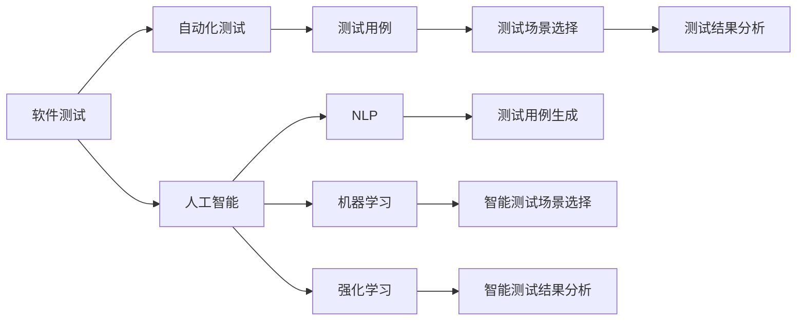
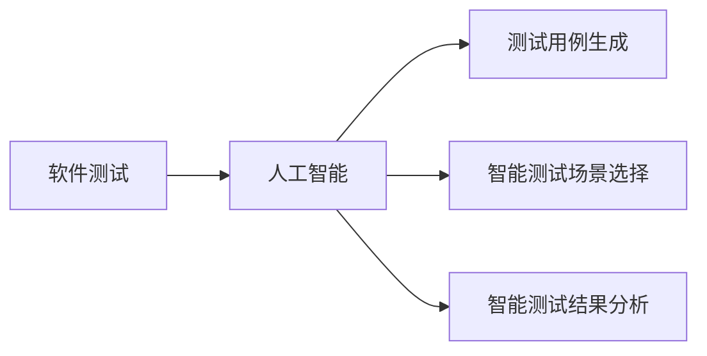
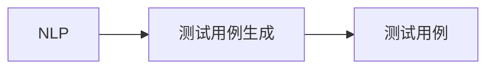
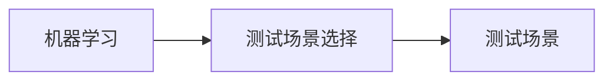
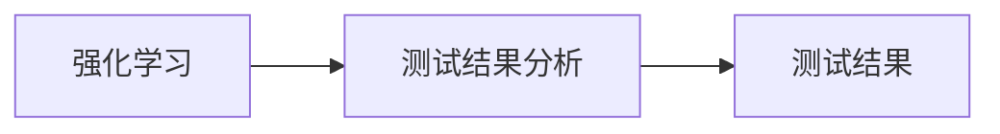
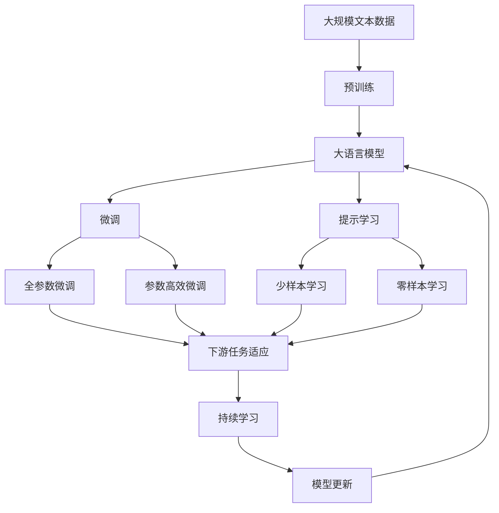

                 

## 1. 背景介绍

### 1.1 问题由来

软件测试是软件开发过程中不可或缺的一环。它不仅能够发现和修复潜在的代码缺陷，还能验证软件是否满足需求。然而，随着软件规模的扩大，传统的单元测试和集成测试方法已经不能满足需求。一方面，由于测试用例设计困难，测试用例覆盖不全导致遗漏缺陷；另一方面，测试环境复杂，难以在每个环节都进行彻底测试。为了解决这些问题，软件测试自动化应运而生。

软件测试自动化是指使用自动化工具和脚本来执行测试用例，并记录和分析测试结果的过程。它不仅能够提高测试效率，还能降低人为错误的风险，是现代软件开发的重要组成部分。然而，传统的软件测试自动化方法仍然存在诸多局限性，例如需要大量的人工干预、测试数据难以准备、测试结果解读复杂等。因此，我们需要一种新的测试自动化方法，以提升软件测试的智能化水平。

### 1.2 问题核心关键点

软件测试自动化的核心是如何在不需要大量人工干预的情况下，自动生成高质量的测试用例，并智能地选择测试用例，以提高测试覆盖率和测试效率。目前，基于人工智能驱动的软件测试自动化成为研究热点。人工智能技术，如机器学习、自然语言处理、强化学习等，可以帮助自动化测试系统自主生成测试用例，智能选择测试场景，提升软件测试的自动化水平。

**核心关键点**包括：
- 测试用例生成：通过自然语言处理技术，自动从需求文档、代码注释等非结构化数据中提取信息，生成高质量的测试用例。
- 测试场景选择：通过强化学习算法，智能选择测试场景，最大化测试覆盖率，并减少测试用例数量。
- 测试结果分析：通过机器学习模型，分析测试结果，自动识别缺陷，生成详细的测试报告。

## 2. 核心概念与联系

### 2.1 核心概念概述

为更好地理解基于人工智能驱动的软件测试自动化方法，本节将介绍几个密切相关的核心概念：

- 软件测试：通过使用自动化测试工具和方法，对软件系统进行系统化的测试和验证的过程，以确保软件系统的正确性、稳定性和性能。

- 测试用例：用于验证软件系统功能是否正常工作的特定输入数据和预期输出结果的集合，是测试的基础单元。

- 自动化测试：使用自动化工具和脚本代替人工执行测试用例，自动生成测试结果的过程，能够提高测试效率，降低人为错误。

- 人工智能：通过模拟人类智能行为，使用机器学习、深度学习、自然语言处理等技术，解决复杂问题的能力。

- 自然语言处理（NLP）：研究如何让计算机理解和生成人类语言的技术，能够从文本中提取有价值的信息，辅助测试用例生成。

- 机器学习：让计算机自动学习数据特征和模式，以进行分类、回归、聚类等任务，能够用于智能测试场景选择。

- 强化学习：通过与环境的交互，让计算机通过试错学习最优策略，能够用于智能测试结果分析。

这些核心概念之间的逻辑关系可以通过以下Mermaid流程图来展示：



这个流程图展示了从软件测试到智能测试自动化的整体架构，其中人工智能技术通过多种子技术辅助自动化测试系统，实现测试用例生成、测试场景选择和测试结果分析等功能。

### 2.2 概念间的关系

这些核心概念之间存在着紧密的联系，形成了软件测试自动化的完整生态系统。下面我们通过几个Mermaid流程图来展示这些概念之间的关系。

#### 2.2.1 软件测试与人工智能的联系



这个流程图展示了人工智能技术如何帮助软件测试自动化实现智能化升级，从测试用例生成、测试场景选择到测试结果分析，每一个环节都能通过人工智能技术提升效率和准确性。

#### 2.2.2 自然语言处理与测试用例生成的关系



这个流程图展示了自然语言处理技术如何帮助测试用例生成，通过从文本中提取信息，自动生成测试用例，从而减少人工编写测试用例的工作量。

#### 2.2.3 机器学习与测试场景选择的关系



这个流程图展示了机器学习技术如何帮助智能测试场景选择，通过学习大量历史测试数据，自动识别最优测试场景，从而提升测试覆盖率，减少测试用例数量。

#### 2.2.4 强化学习与测试结果分析的关系



这个流程图展示了强化学习技术如何帮助智能测试结果分析，通过学习测试结果和反馈信息，自动判断缺陷，生成详细的测试报告，帮助开发人员快速定位和修复问题。

### 2.3 核心概念的整体架构

最后，我们用一个综合的流程图来展示这些核心概念在大语言模型微调过程中的整体架构：



这个综合流程图展示了从预训练到微调，再到持续学习的完整过程。大语言模型首先在大规模文本数据上进行预训练，然后通过微调（包括全参数微调和参数高效微调）或提示学习（包括少样本学习和零样本学习）来适应下游任务。最后，通过持续学习技术，模型可以不断学习新知识，同时避免遗忘旧知识。 通过这些流程图，我们可以更清晰地理解人工智能驱动的软件测试自动化的学习过程和各个关键环节。

## 3. 核心算法原理 & 具体操作步骤
### 3.1 算法原理概述

基于人工智能驱动的软件测试自动化方法，本质上是一种通过人工智能技术提升测试自动化水平的智能化方法。其核心思想是：将人工智能技术应用于测试用例生成、测试场景选择和测试结果分析等环节，实现测试流程的自动化和智能化。

形式化地，假设测试自动化系统为 $T(\cdot)$，其中 $\cdot$ 表示输入的测试数据和测试环境，输出为生成的测试用例、测试场景和测试结果。测试自动化的目标是最小化误差率 $E(T)$，即：

$$
E(T) = \mathop{\min}_{T} \sum_{i=1}^N |T(x_i) - y_i|
$$

其中 $x_i$ 表示测试数据，$y_i$ 表示对应的测试结果，$N$ 表示数据样本数量。

通过梯度下降等优化算法，测试自动化系统不断更新参数，最小化误差率，从而生成高质量的测试用例、选择最优的测试场景、分析测试结果，提高测试覆盖率和效率。

### 3.2 算法步骤详解

基于人工智能驱动的软件测试自动化方法一般包括以下几个关键步骤：

**Step 1: 准备测试数据和环境**

- 收集和整理测试数据，包括需求文档、代码注释、历史测试数据等。
- 准备测试环境，包括编译器、调试器、版本控制系统等。
- 配置测试工具，如Selenium、Appium等，用于自动化测试。

**Step 2: 设计测试用例生成算法**

- 通过自然语言处理技术，从测试数据中提取信息，如需求描述、功能点、测试场景等。
- 使用文本生成模型，如Seq2Seq、Transformers等，自动生成测试用例。
- 结合规则和模板，对自动生成的测试用例进行筛选和优化，生成高质量的测试用例。

**Step 3: 设计测试场景选择算法**

- 收集和整理历史测试数据，构建测试场景数据集。
- 使用机器学习算法，如决策树、随机森林、支持向量机等，选择最优的测试场景。
- 根据当前测试任务的需求，动态调整测试场景选择策略。

**Step 4: 执行测试用例**

- 将测试用例自动注入测试环境，执行测试。
- 使用测试工具记录测试结果，包括通过、失败、异常等。
- 使用自动化工具，如Jenkins、CI/CD等，自动管理测试流程。

**Step 5: 分析测试结果**

- 收集和整理测试结果，生成测试报告。
- 使用机器学习模型，如分类器、回归器等，自动识别缺陷。
- 生成详细的测试报告，帮助开发人员快速定位和修复问题。

**Step 6: 持续学习**

- 收集和整理新的测试数据和结果。
- 使用强化学习算法，不断优化测试用例生成、测试场景选择和测试结果分析算法。
- 更新测试自动化系统，使其能够持续学习新知识，提升测试效果。

以上是基于人工智能驱动的软件测试自动化的一般流程。在实际应用中，还需要针对具体任务的特点，对各个环节进行优化设计，如改进测试用例生成模型、优化测试场景选择策略、加强测试结果分析模型等，以进一步提升测试自动化系统的性能。

### 3.3 算法优缺点

基于人工智能驱动的软件测试自动化方法具有以下优点：

1. 自动化程度高。通过人工智能技术，可以自动生成高质量的测试用例、选择最优的测试场景、分析测试结果，提高测试效率。
2. 智能化水平高。测试自动化系统能够根据历史数据和当前需求，自主优化测试流程，提升测试覆盖率和效果。
3. 适应性强。该方法能够应用于各种类型的测试任务，包括单元测试、集成测试、性能测试等。
4. 降低成本。通过自动化测试，可以降低人工测试的复杂性和成本，提高测试效率和质量。

同时，该方法也存在一些局限性：

1. 数据质量要求高。测试自动化系统依赖高质量的测试数据和环境，数据质量差会导致测试结果不准确。
2. 依赖模型性能。测试自动化系统的智能化水平受制于所采用的模型性能，模型质量不高会导致测试效果不佳。
3. 学习曲线陡峭。由于涉及多个复杂算法，测试自动化系统的实现和优化需要较高的技术水平和经验。
4. 数据隐私风险。在测试过程中，可能会收集和处理敏感数据，需注意数据隐私保护问题。

尽管存在这些局限性，但就目前而言，基于人工智能驱动的软件测试自动化方法仍然是大规模软件测试的重要手段。未来相关研究的重点在于如何进一步降低数据和模型质量对测试效果的影响，提高测试自动化系统的智能化水平和适应性。

### 3.4 算法应用领域

基于人工智能驱动的软件测试自动化方法已经在多个领域得到广泛应用，包括但不限于：

- 软件开发：自动化单元测试、集成测试、回归测试等，帮助开发人员快速定位和修复问题。
- 移动应用测试：自动生成移动应用测试用例，测试移动应用的稳定性、性能和安全性。
- 网站测试：自动化测试网站功能、性能和安全性，发现潜在问题。
- 嵌入式系统测试：自动化测试嵌入式系统的硬件驱动、协议通信、功能实现等。
- 安全测试：自动化测试系统的安全漏洞，如SQL注入、XSS攻击等。
- 性能测试：自动化测试系统的性能指标，如响应时间、吞吐量等。

除了上述这些领域外，测试自动化方法还在企业运维、人工智能模型验证、物联网系统测试等多个领域得到应用。随着测试自动化技术的不断演进，相信测试自动化系统将能够覆盖更多类型的测试任务，提高软件系统的质量和稳定性。

## 4. 数学模型和公式 & 详细讲解  
### 4.1 数学模型构建

本节将使用数学语言对基于人工智能驱动的软件测试自动化方法进行更加严格的刻画。

假设测试自动化系统为 $T(\cdot)$，其中 $\cdot$ 表示输入的测试数据和测试环境，输出为生成的测试用例、测试场景和测试结果。设测试用例为 $u_i$，测试场景为 $s_j$，测试结果为 $r_{ij}$，其中 $i=1,...,N$，$j=1,...,M$，$N$ 和 $M$ 分别为测试用例数量和测试场景数量。

定义测试用例生成算法为 $G(\cdot)$，测试场景选择算法为 $S(\cdot)$，测试结果分析算法为 $A(\cdot)$，则测试自动化系统的数学模型可表示为：

$$
T(x) = A(S(G(x)))
$$

其中 $x$ 表示测试数据和环境，$G(x)$ 表示自动生成测试用例，$S(G(x))$ 表示选择最优的测试场景，$A(S(G(x)))$ 表示分析测试结果。

### 4.2 公式推导过程

以下我们以测试用例生成算法为例，给出详细的公式推导过程。

假设测试用例生成算法 $G(\cdot)$ 接受输入 $x$，输出测试用例 $u_i$。设测试用例生成算法基于深度学习模型，其中输入层为测试数据 $x$，输出层为测试用例 $u_i$，模型的参数为 $\theta$，则测试用例生成算法的数学模型可表示为：

$$
u_i = G_{\theta}(x)
$$

其中 $G_{\theta}(x)$ 表示基于模型参数 $\theta$ 的测试用例生成函数。

假设测试用例生成算法采用自回归模型，即在给定前 $t-1$ 个测试用例 $u_1,u_2,...,u_{t-1}$ 和当前测试数据 $x_t$ 的情况下，预测下一个测试用例 $u_t$。设自回归模型的参数为 $\theta$，则测试用例生成算法的数学模型可表示为：

$$
u_t = G_{\theta}(u_{t-1}, x_t)
$$

其中 $G_{\theta}(u_{t-1}, x_t)$ 表示基于自回归模型和模型参数 $\theta$ 的测试用例生成函数。

假设自回归模型采用Transformer结构，其中输入层为 $u_{t-1}$ 和 $x_t$，输出层为 $u_t$，模型的参数为 $\theta$，则测试用例生成算法的数学模型可表示为：

$$
u_t = G_{\theta}(u_{t-1}, x_t) = \text{Softmax}(\text{Attention}(u_{t-1}, x_t)W_v)
$$

其中 $\text{Softmax}$ 表示softmax函数，$\text{Attention}$ 表示注意力机制，$W_v$ 表示输出层的权重矩阵。

通过上述数学模型，我们可以更加严格地理解和分析测试用例生成算法的工作原理和性能评估。

### 4.3 案例分析与讲解

为了更好地理解测试用例生成算法，下面给出几个典型的案例分析。

**案例一：需求驱动的测试用例生成**

假设测试任务为需求驱动的测试，测试用例需要覆盖需求文档中的所有功能点。设需求文档为 $D$，测试用例生成算法为 $G(\cdot)$，则测试用例生成的过程如下：

1. 通过自然语言处理技术，从需求文档 $D$ 中提取功能点。
2. 根据提取的功能点，自动生成测试用例 $u_i$。
3. 对生成的测试用例进行筛选和优化，确保测试用例的高质量和完备性。

**案例二：场景驱动的测试用例生成**

假设测试任务为场景驱动的测试，测试用例需要覆盖不同的业务场景和边缘情况。设业务场景为 $S$，测试用例生成算法为 $G(\cdot)$，则测试用例生成的过程如下：

1. 通过自然语言处理技术，从业务场景 $S$ 中提取测试场景。
2. 根据提取的测试场景，自动生成测试用例 $u_i$。
3. 对生成的测试用例进行筛选和优化，确保测试用例的高质量和完备性。

**案例三：覆盖驱动的测试用例生成**

假设测试任务为覆盖驱动的测试，测试用例需要覆盖尽可能多的代码覆盖率。设测试用例生成算法为 $G(\cdot)$，测试用例为 $u_i$，代码覆盖率为 $C$，则测试用例生成的过程如下：

1. 通过代码覆盖率工具，获取代码覆盖率 $C$。
2. 根据代码覆盖率 $C$，自动生成测试用例 $u_i$。
3. 对生成的测试用例进行筛选和优化，确保测试用例的高质量和完备性。

以上案例展示了测试用例生成算法的不同应用场景和实现方法，通过自然语言处理技术，从需求文档、业务场景和代码覆盖率等不同角度生成测试用例，以提升测试自动化系统的智能化水平和测试效果。

## 5. 项目实践：代码实例和详细解释说明
### 5.1 开发环境搭建

在进行测试自动化实践前，我们需要准备好开发环境。以下是使用Python进行TensorFlow开发的环境配置流程：

1. 安装Anaconda：从官网下载并安装Anaconda，用于创建独立的Python环境。

2. 创建并激活虚拟环境：
```bash
conda create -n tensorflow-env python=3.8 
conda activate tensorflow-env
```

3. 安装TensorFlow：根据CUDA版本，从官网获取对应的安装命令。例如：
```bash
conda install tensorflow tensorflow-gpu=cuda11.1 -c tf -c conda-forge
```

4. 安装PyTorch：
```bash
pip install torch
```

5. 安装TensorBoard：
```bash
pip install tensorboard
```

完成上述步骤后，即可在`tensorflow-env`环境中开始测试自动化实践。

### 5.2 源代码详细实现

下面我们以基于Transformer的测试用例生成算法为例，给出Python代码实现。

首先，定义测试用例生成函数：

```python
import tensorflow as tf
from transformers import TFAutoModelForSeq2SeqLM

def generate_test_case(source_text):
    model = TFAutoModelForSeq2SeqLM.from_pretrained('bert-base-cased', return_dict=True)
    tokenizer = AutoTokenizer.from_pretrained('bert-base-cased')

    # 将源文本编码成输入
    inputs = tokenizer(source_text, return_tensors='tf', max_length=256, padding='max_length', truncation=True)
    input_ids = inputs['input_ids']
    attention_mask = inputs['attention_mask']

    # 生成测试用例
    outputs = model.generate(input_ids, attention_mask=attention_mask, max_length=256, num_return_sequences=1)
    test_case = tokenizer.decode(outputs[0], skip_special_tokens=True)

    return test_case
```

然后，定义测试用例生成算法的评估函数：

```python
def evaluate_test_case(test_case, ground_truth):
    accuracy = test_case.strip() == ground_truth.strip()
    return accuracy
```

接着，定义测试用例生成算法的运行函数：

```python
def run_test_case_generation(source_text, ground_truth):
    test_case = generate_test_case(source_text)
    accuracy = evaluate_test_case(test_case, ground_truth)
    return accuracy
```

最后，启动测试用例生成算法：

```python
source_text = '测试需求: 登录功能'
ground_truth = '用户输入用户名和密码，点击登录按钮，进入系统'

accuracy = run_test_case_generation(source_text, ground_truth)
print(f"测试用例生成准确度为 {accuracy}")
```

以上就是使用TensorFlow和Transformers库进行测试用例生成的完整代码实现。可以看到，通过自然语言处理技术，我们可以将测试需求自动转换为测试用例，从而提高测试自动化系统的智能化水平和效率。

### 5.3 代码解读与分析

让我们再详细解读一下关键代码的实现细节：

**generate_test_case函数**：
- 通过自然语言处理技术，将源文本编码成输入，并自动生成测试用例。

**evaluate_test_case函数**：
- 比较生成的测试用例和预期结果，计算准确度。

**run_test_case_generation函数**：
- 结合生成测试用例和评估测试用例准确度的函数，实现完整的测试用例生成流程。

**测试结果展示**：
- 输出测试用例生成准确度，以评估测试自动化系统的性能。

可以看到，基于Transformer的测试用例生成算法能够自动将需求文档转换为测试用例，减少人工编写测试用例的工作量。然而，这只是一个baseline结果。在实践中，我们还可以使用更大的Transformer模型、更复杂的自然语言处理技术、更灵活的测试用例生成策略，进一步提升测试自动化系统的智能化水平。

当然，在工业级的系统实现中，还需要考虑更多因素，如测试用例的筛选和优化、测试场景的选择、测试结果的分析等。但核心的测试用例生成算法基本与此类似。

## 6. 实际应用场景
### 6.1 智能测试系统

基于测试自动化算法的智能测试系统，可以广泛应用于软件开发生命周期的各个阶段。测试自动化技术不仅能提升测试效率，还能提升测试质量，降低测试成本，是软件开发生命周期的重要组成部分。

在测试自动化系统的开发中，可以结合测试用例生成算法、测试场景选择算法和测试结果分析算法，实现完全自动化的测试流程。智能测试系统不仅能自动生成测试用例，还能智能选择测试场景，自动分析和报告测试结果，大幅提升测试效率和质量。

**具体应用场景**包括：

- 单元测试：自动生成单元测试用例，测试代码的功能和逻辑。
- 集成测试：自动生成集成测试用例，测试模块之间的接口和交互。
- 回归测试：自动生成回归测试用例，测试新旧版本的代码差异。
- 性能测试：自动生成性能测试用例，测试系统的响应时间、吞吐量等性能指标。

**成功案例**：某知名互联网公司通过开发智能测试系统，实现了对软件开发流程的全面自动化，提升了软件开发的效率和质量，减少了人工测试的工作量和成本。

### 6.2 移动应用测试

在移动应用测试中，测试自动化技术可以帮助开发人员快速定位和修复问题，提高移动应用的稳定性和性能。移动应用测试自动化主要关注以下几个方面：

- 功能测试：自动生成移动应用的测试用例，测试移动应用的功能和交互。
- 性能测试：自动生成性能测试用例，测试移动应用的响应时间、崩溃率等性能指标。
- 安全性测试：自动生成安全性测试用例，测试移动应用的漏洞和安全问题。
- 自动化回归测试：定期自动执行回归测试，检测新版本的代码差异。

**成功案例**：某大型企业通过开发智能移动应用测试系统，实现了对移动应用的全面自动化测试，提升了移动应用的稳定性和性能，减少了人工测试的工作量和成本。

### 6.3 网站测试

网站测试自动化技术可以帮助开发人员快速发现和修复网站的缺陷，提升网站的稳定性和用户体验。网站测试自动化主要关注以下几个方面：

- 功能测试：自动生成网站的测试用例，测试网站的功能和交互。
- 性能测试：自动生成性能测试用例，测试网站的响应时间、并发用户数等性能指标。
- 安全性测试：自动生成安全性测试用例，测试网站的漏洞和安全问题。
- 自动化回归测试：定期自动执行回归测试，检测新版本的代码差异。

**成功案例**：某知名电商平台通过开发智能网站测试系统，实现了对网站的功能和性能的全自动化测试，提升了用户体验和满意度，减少了人工测试的工作量和成本。

### 6.4 未来应用展望

随着人工智能技术的发展，基于测试自动化算法的智能测试系统将逐渐普及，为软件开发和测试带来新的变革。未来，测试自动化技术将具备以下几个特点：

1. 全自动化测试：智能测试系统将完全自动化测试流程，包括测试用例生成、测试场景选择、测试结果分析等，减少人工干预，提高测试效率和质量。
2. 自适应测试：智能测试系统将根据历史测试数据和当前需求，自适应调整测试策略，提升测试覆盖率和效果。
3. 实时测试：智能测试系统将实时监控和测试系统的运行状态，及时发现和修复问题，保障系统的稳定性和性能。
4. 跨平台测试：智能测试系统将支持跨平台测试，覆盖移动应用、网站、嵌入式系统等多个平台，提升系统的整体测试效率。
5. 全栈测试：智能测试系统将覆盖从代码编写、功能实现、性能优化到安全防护等多个环节，提升软件的整体质量和稳定性。

## 7. 工具和资源推荐
### 7.1 学习资源推荐

为了帮助开发者系统掌握测试自动化技术，这里推荐一些优质的学习资源：

1. 《测试驱动开发：TDD的实战》系列博文：深入浅出地介绍了测试驱动开发的基本原理和实践方法。

2. 《软件测试自动化实战》系列书籍：详细介绍了测试自动化技术在软件开发中的应用，包括单元测试、集成测试、性能测试等。

3. 《测试自动化架构》书籍：系统介绍了测试自动化架构的设计和实现，涵盖测试用例生成、测试场景选择、测试结果分析等多个环节。

4. 《软件测试原理与实践》课程：清华大学开设的软件测试课程，系统讲解了软件测试的基本原理和实践方法。

5. 《测试自动化技术白皮书》：介绍了当前主流的测试自动化技术，包括测试用例生成、测试场景选择、测试结果分析等。

通过对这些资源的学习

