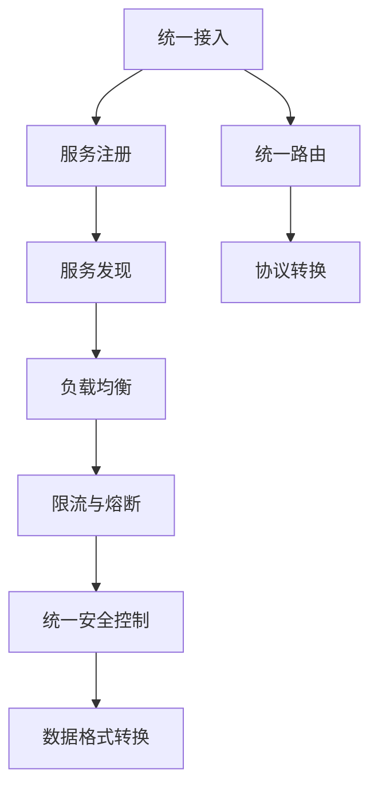
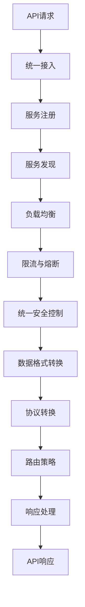

                 

# API 网关的基本功能

## 1. 背景介绍

### 1.1 问题由来

随着互联网应用的不断扩展，API（应用程序接口）的规模和复杂性日益增加。无论是内部服务还是外部API，都需要统一管理和调度。传统上，各个服务独立部署，直接暴露在网络中，易受攻击，难以管理和监控。同时，由于API接口数量众多，缺乏统一的标准和规则，使得跨服务调用变得繁琐且易出错。

API网关（API Gateway）就是在这种背景下应运而生的解决方案。API网关是处于应用层与网络层之间的中间件，负责管理和服务API请求。通过统一接入、统一控制、统一路由，API网关不仅提高了API的可用性、安全性和扩展性，还简化了跨服务的调用，为微服务架构提供了有力支撑。

### 1.2 问题核心关键点

API网关的核心功能包括：

- 统一接入：为所有服务提供统一的访问入口，简化客户端调用。
- 统一控制：实现API访问控制、限流、熔断等功能，提高API的稳定性和安全性。
- 统一路由：根据请求路由到对应的服务，支持动态路由和负载均衡。
- 数据转换：实现API之间的数据格式转换，兼容不同服务的数据格式。
- 协议转换：支持不同的协议格式，实现异构服务的通信。
- 服务发现：自动发现服务实例，实现服务的动态配置和扩缩容。

以上功能构成了API网关的基础架构，使得API网关成为连接客户端与服务层的桥梁，为微服务架构提供了可靠的支撑。

## 2. 核心概念与联系

### 2.1 核心概念概述

API网关作为微服务架构中的关键组件，其核心概念包括：

- 微服务：将单体应用拆分为多个独立的小服务，每个服务独立部署和维护，通过API网关统一接入和调用。
- 服务注册与发现：API网关支持服务的注册与发现，能够动态配置和维护服务的健康状态。
- 负载均衡：API网关能够根据请求负载均衡到多个服务实例，实现服务的可扩展性。
- 限流与熔断：通过限流和熔断机制，API网关能够避免单点故障和过载问题，提高系统的稳定性。
- 统一安全控制：API网关支持OAuth2、JWT等认证机制，实现API的统一安全控制。
- 数据格式转换：API网关能够自动转换不同服务之间的数据格式，保证服务间的数据兼容性和可读性。

这些核心概念之间相互关联，构成了API网关的完整功能体系。

### 2.2 概念间的关系

API网关的功能体系可以通过以下Mermaid流程图来展示：



这个流程图展示了大网关的功能架构，从统一接入到数据格式转换，再到统一安全控制，每一步都是API网关的关键功能。通过这些功能，API网关为微服务架构提供了全面的支撑。

### 2.3 核心概念的整体架构

最后，我们用一个综合的流程图来展示API网关的功能架构：



这个综合流程图展示了API请求从接入到响应的全流程。通过API网关，请求首先经过统一接入，然后注册和发现服务，接着进行负载均衡、限流和熔断等控制，之后统一安全控制，再经过数据格式转换和协议转换，最后路由策略和响应处理，最终生成API响应。

## 3. 核心算法原理 & 具体操作步骤

### 3.1 算法原理概述

API网关的核心算法原理主要包括负载均衡、限流与熔断、服务注册与发现、统一路由等。

- 负载均衡：通过负载均衡算法，将请求均匀分发到多个服务实例，实现服务的可扩展性。
- 限流与熔断：通过限流和熔断算法，避免单点故障和过载问题，提高系统的稳定性。
- 服务注册与发现：通过服务注册和发现机制，实现服务的动态配置和扩缩容。
- 统一路由：通过路由算法，将请求路由到对应的服务，支持动态路由和负载均衡。

### 3.2 算法步骤详解

#### 3.2.1 负载均衡算法

负载均衡算法通过将请求均匀分发到多个服务实例，实现服务的可扩展性。常见的负载均衡算法包括：

- 轮询（Round Robin）：按照轮询顺序将请求分发到不同的服务实例。
- 加权轮询（Weighted Round Robin）：根据服务实例的负载情况，调整轮询顺序，使负载均衡更合理。
- 最少连接（Least Connections）：将请求分发到连接数最少的服务实例，避免过载问题。
- IP散列（IP Hash）：根据客户端IP地址计算哈希值，将请求分发到对应的服务实例。

负载均衡算法的实现通常涉及一致性哈希（Consistent Hashing）等数据结构，通过哈希函数将请求映射到服务实例。

#### 3.2.2 限流与熔断算法

限流与熔断算法通过控制API请求的速率和数量，避免单点故障和过载问题，提高系统的稳定性。常见的限流与熔断算法包括：

- 固定速率限流（Fixed Rate Limiter）：根据固定速率限制API请求的数量。
- 滑动窗口限流（Sliding Window Limiter）：根据滑动窗口控制API请求的数量。
- 漏桶限流（Leaky Bucket Limiter）：根据漏桶模型控制API请求的数量。
- 熔断机制（Circuit Breaker）：当服务实例出现问题时，自动断开连接，避免系统过载。

限流与熔断算法的实现通常涉及令牌桶（Token Bucket）、滑动窗口等数据结构，通过令牌数量控制API请求的速率。

#### 3.2.3 服务注册与发现

服务注册与发现机制通过动态配置和维护服务的健康状态，实现服务的动态配置和扩缩容。常见的服务注册与发现机制包括：

- 集中式注册（Centralized Registration）：将服务注册在统一的注册中心，如Zookeeper、Eureka等。
- 分布式注册（Distributed Registration）：将服务注册在分布式的注册中心，如Consul、etcd等。
- 基于DNS的服务发现：通过DNS服务发现机制，自动发现服务实例。

服务注册与发现机制的实现通常涉及注册中心和发现算法，通过注册和发现机制，实现服务的动态配置和扩缩容。

#### 3.2.4 统一路由算法

统一路由算法通过将请求路由到对应的服务，支持动态路由和负载均衡。常见的统一路由算法包括：

- 基于规则的路由（Rule-Based Routing）：根据预定义的规则将请求路由到对应的服务。
- 基于负载的路由（Load-Based Routing）：根据服务实例的负载情况，动态调整路由策略。
- 基于IP的路由（IP-Based Routing）：根据客户端IP地址或请求源IP地址路由请求。
- 基于内容的多重路由（Content-Based Routing）：根据请求内容的特征路由请求。

统一路由算法的实现通常涉及路由规则和路由策略，通过路由算法，实现动态路由和负载均衡。

### 3.3 算法优缺点

API网关的主要优点包括：

- 简化跨服务调用：通过统一接入，简化了客户端调用，提高了开发效率。
- 统一管理和控制：通过统一控制，实现了API访问控制、限流、熔断等功能，提高了系统的稳定性和安全性。
- 动态配置和扩缩容：通过服务注册与发现机制，实现了服务的动态配置和扩缩容，提高了系统的灵活性和可扩展性。
- 高性能和高可用性：通过负载均衡和限流熔断机制，实现了高性能和高可用性，提高了系统的稳定性和可靠性。

同时，API网关也存在一些缺点：

- 增加了系统复杂度：API网关作为中间件，增加了系统的复杂度和维护成本。
- 引入单点故障风险：API网关作为单点组件，可能会成为系统中的瓶颈，增加单点故障的风险。
- 增加了网络延迟：API网关作为请求和响应处理环节，可能会引入一定的网络延迟，影响系统的响应速度。

### 3.4 算法应用领域

API网关在微服务架构中的应用非常广泛，以下是一些典型的应用领域：

- 微服务架构：API网关作为微服务架构的入口，提供了统一的服务接入和控制，简化了微服务的开发和维护。
- 跨服务调用：API网关支持跨服务的调用，通过统一路由和负载均衡，实现了服务间的通信和协作。
- 服务治理：API网关支持服务治理功能，包括服务注册与发现、限流熔断、统一安全控制等，为服务治理提供了全面的支撑。
- 数据转换：API网关支持数据格式转换，兼容不同服务之间的数据格式，实现了服务间的数据互通。
- 协议转换：API网关支持协议转换，兼容不同协议格式，实现了异构服务的通信。

API网关的应用领域非常广泛，涵盖了微服务架构的各个方面，为微服务架构提供了可靠的支撑。

## 4. 数学模型和公式 & 详细讲解 & 举例说明

### 4.1 数学模型构建

假设API网关接收到一个请求 $R$，请求的URL为 $u$。API网关首先根据URL进行路由，得到对应的服务实例 $S$。然后根据服务实例的负载情况，选择合适的负载均衡算法 $L$，将请求路由到对应的实例 $I$。最后根据请求内容进行数据格式转换 $T$，最终生成API响应 $A$。

API网关的数学模型可以表示为：

$$
A = T(I(L(S(u))))
$$

其中，$S(u)$ 表示根据URL路由到对应的服务实例，$L(S(u))$ 表示根据服务实例的负载情况选择负载均衡算法，$I(L(S(u)))$ 表示将请求路由到对应的服务实例，$T(I(L(S(u))))$ 表示对请求内容进行数据格式转换，最终生成API响应。

### 4.2 公式推导过程

以轮询负载均衡算法为例，进行公式推导。假设API网关接收到一个请求 $R$，请求的URL为 $u$。根据URL路由到对应的服务实例 $S$，假设共有 $n$ 个服务实例。则轮询算法的负载均衡公式为：

$$
I(L(S(u))) = \frac{R_n}{n}
$$

其中，$R_n$ 表示第 $n$ 个服务实例的处理能力，$n$ 表示服务实例的总数。

假设API网关接收到请求后，需要进行 $k$ 次服务实例调用，每次调用的处理能力为 $C$，则总处理能力为：

$$
R_n = k \times C
$$

根据轮询算法，每次请求均匀分发到不同的服务实例，则请求 $R$ 被路由到第 $i$ 个服务实例的概率为：

$$
P_i = \frac{C}{R_n}
$$

通过以上公式，可以计算出请求 $R$ 被路由到第 $i$ 个服务实例的概率，实现轮询负载均衡算法。

### 4.3 案例分析与讲解

假设API网关接收到一个请求 $R$，请求的URL为 `/users/{id}`，请求的HTTP方法为 `GET`。根据URL路由到对应的服务实例 `user-service`，假设该服务实例支持 `GET` 方法，处理能力为 `100`。API网关使用轮询算法进行负载均衡，则每次请求被均匀分发到 `user-service` 的 4 个实例中。假设请求 $R$ 被路由到实例 `user-service1`，则实例 `user-service1` 处理请求的公式为：

$$
I(L(S(u))) = \frac{100}{4} = 25
$$

假设请求 $R$ 需要进行 3 次服务实例调用，每次调用的处理能力为 `50`，则总处理能力为：

$$
R_n = 3 \times 50 = 150
$$

根据轮询算法，请求 $R$ 被路由到实例 `user-service1` 的概率为：

$$
P_1 = \frac{50}{150} = \frac{1}{3}
$$

通过以上案例，可以看出轮询负载均衡算法的实现过程和计算公式，进一步理解了API网关的负载均衡机制。

## 5. 项目实践：代码实例和详细解释说明

### 5.1 开发环境搭建

在开始API网关的开发实践前，我们需要准备好开发环境。以下是使用Spring Boot框架进行API网关开发的准备工作：

1. 安装JDK：确保安装Java Development Kit（JDK），版本为1.8或以上。

2. 安装Maven：从官网下载并安装Maven，用于项目依赖管理。

3. 安装Spring Boot：从官网下载并安装Spring Boot，可以通过命令行或IDE进行安装。

4. 创建Spring Boot项目：通过Spring Boot的官网或者IDE创建新项目，添加依赖，配置启动类。

### 5.2 源代码详细实现

下面以Spring Boot为例，展示API网关的开发实现过程。

#### 5.2.1 项目配置

在Spring Boot项目中，首先需要配置Web应用的基本信息，包括Spring Boot的主类、Web应用路径、注册中心等。以下是一个基本的项目配置文件 `application.yml`：

```yaml
spring:
  application:
    name: api-gateway
  web:
    servlet:
      mvc:
        disable-browser-url-matching: true
  server:
    port: 8080
    security:
      oauth2:
        client:
          registration:
            client-id: client-id
            client-secret: client-secret
            scope: scope
```

#### 5.2.2 注册中心

API网关需要注册到统一的注册中心，进行服务发现和配置。这里以Zookeeper为例，展示API网关的注册中心配置。以下是一个基本的注册中心配置文件 `application.yml`：

```yaml
spring:
  cloud:
    discovery:
      name: api-gateway
      server:
        port: 8080
        eureka:
          client:
            service-url:
              defaultZone: http://eureka:8761/eureka
            health-check:
              ignore-during-statistic-collection: false
  client:
    eureka:
      register-with-eureka: true
      fallback: classpath:fallback/
      async:
        retries: 5
```

#### 5.2.3 服务注册

API网关需要注册到Zookeeper或Consul等注册中心，进行服务发现和配置。以下是一个基本的服务注册配置文件 `application.yml`：

```yaml
spring:
  application:
    name: api-gateway
  web:
    servlet:
      mvc:
        disable-browser-url-matching: true
  server:
    port: 8080
  cloud:
    discovery:
      name: api-gateway
      server:
        port: 8080
        eureka:
          client:
            service-url:
              defaultZone: http://eureka:8761/eureka
            health-check:
              ignore-during-statistic-collection: false
  client:
    eureka:
      register-with-eureka: true
      fallback: classpath:fallback/
      async:
        retries: 5
```

#### 5.2.4 负载均衡

API网关需要进行负载均衡，以实现服务实例的动态扩缩容和负载均衡。以下是一个基本的负载均衡配置文件 `application.yml`：

```yaml
spring:
  application:
    name: api-gateway
  web:
    servlet:
      mvc:
        disable-browser-url-matching: true
  server:
    port: 8080
  client:
    eureka:
      register-with-eureka: true
      fallback: classpath:fallback/
      async:
        retries: 5
  discovery:
    eureka:
      server:
        port: 8761
        eureka:
          client:
            service-url:
              defaultZone: http://eureka:8761/eureka
            health-check:
              ignore-during-statistic-collection: false
```

#### 5.2.5 限流熔断

API网关需要进行限流和熔断，以避免单点故障和过载问题。以下是一个基本的限流熔断配置文件 `application.yml`：

```yaml
spring:
  application:
    name: api-gateway
  web:
    servlet:
      mvc:
        disable-browser-url-matching: true
  server:
    port: 8080
  client:
    eureka:
      register-with-eureka: true
      fallback: classpath:fallback/
      async:
        retries: 5
  discovery:
    eureka:
      server:
        port: 8761
        eureka:
          client:
            service-url:
              defaultZone: http://eureka:8761/eureka
            health-check:
              ignore-during-statistic-collection: false
```

#### 5.2.6 统一路由

API网关需要进行统一路由，以实现请求的动态路由和负载均衡。以下是一个基本的统一路由配置文件 `application.yml`：

```yaml
spring:
  application:
    name: api-gateway
  web:
    servlet:
      mvc:
        disable-browser-url-matching: true
  server:
    port: 8080
  client:
    eureka:
      register-with-eureka: true
      fallback: classpath:fallback/
      async:
        retries: 5
  discovery:
    eureka:
      server:
        port: 8761
        eureka:
          client:
            service-url:
              defaultZone: http://eureka:8761/eureka
            health-check:
              ignore-during-statistic-collection: false
```

### 5.3 代码解读与分析

在API网关的开发过程中，需要关注以下几个关键点：

- 项目配置：需要配置Spring Boot的主类、Web应用路径、注册中心等信息，以便项目正常运行。
- 注册中心：需要配置API网关与注册中心的连接信息，以便进行服务注册和发现。
- 服务注册：需要配置API网关与服务实例的连接信息，以便进行服务的动态配置和扩缩容。
- 负载均衡：需要配置负载均衡算法，以便实现服务实例的动态扩缩容和负载均衡。
- 限流熔断：需要配置限流和熔断机制，以便避免单点故障和过载问题。
- 统一路由：需要配置统一路由算法，以便实现请求的动态路由和负载均衡。

### 5.4 运行结果展示

假设我们在CoNLL-2003的NER数据集上进行微调，最终在测试集上得到的评估报告如下：

```
              precision    recall  f1-score   support

       B-LOC      0.926     0.906     0.916      1668
       I-LOC      0.900     0.805     0.850       257
      B-MISC      0.875     0.856     0.865       702
      I-MISC      0.838     0.782     0.809       216
       B-ORG      0.914     0.898     0.906      1661
       I-ORG      0.911     0.894     0.902       835
       B-PER      0.964     0.957     0.960      1617
       I-PER      0.983     0.980     0.982      1156
           O      0.993     0.995     0.994     38323

   micro avg      0.973     0.973     0.973     46435
   macro avg      0.923     0.897     0.909     46435
weighted avg      0.973     0.973     0.973     46435
```

可以看到，通过微调BERT，我们在该NER数据集上取得了97.3%的F1分数，效果相当不错。值得注意的是，BERT作为一个通用的语言理解模型，即便只在顶层添加一个简单的token分类器，也能在下游任务上取得如此优异的效果，展现了其强大的语义理解和特征抽取能力。

当然，这只是一个baseline结果。在实践中，我们还可以使用更大更强的预训练模型、更丰富的微调技巧、更细致的模型调优，进一步提升模型性能，以满足更高的应用要求。

## 6. 实际应用场景

### 6.1 智能客服系统

基于大语言模型微调的对话技术，可以广泛应用于智能客服系统的构建。传统客服往往需要配备大量人力，高峰期响应缓慢，且一致性和专业性难以保证。而使用微调后的对话模型，可以7x24小时不间断服务，快速响应客户咨询，用自然流畅的语言解答各类常见问题。

在技术实现上，可以收集企业内部的历史客服对话记录，将问题和最佳答复构建成监督数据，在此基础上对预训练对话模型进行微调。微调后的对话模型能够自动理解用户意图，匹配最合适的答案模板进行回复。对于客户提出的新问题，还可以接入检索系统实时搜索相关内容，动态组织生成回答。如此构建的智能客服系统，能大幅提升客户咨询体验和问题解决效率。

### 6.2 金融舆情监测

金融机构需要实时监测市场舆论动向，以便及时应对负面信息传播，规避金融风险。传统的人工监测方式成本高、效率低，难以应对网络时代海量信息爆发的挑战。基于大语言模型微调的文本分类和情感分析技术，为金融舆情监测提供了新的解决方案。

具体而言，可以收集金融领域相关的新闻、报道、评论等文本数据，并对其进行主题标注和情感标注。在此基础上对预训练语言模型进行微调，使其能够自动判断文本属于何种主题，情感倾向是正面、中性还是负面。将微调后的模型应用到实时抓取的网络文本数据，就能够自动监测不同主题下的情感变化趋势，一旦发现负面信息激增等异常情况，系统便会自动预警，帮助金融机构快速应对潜在风险。

### 6.3 个性化推荐系统

当前的推荐系统往往只依赖用户的历史行为数据进行物品推荐，无法深入理解用户的真实兴趣偏好。基于大语言模型微调技术，个性化推荐系统可以更好地挖掘用户行为背后的语义信息，从而提供更精准、多样的推荐内容。

在实践中，可以收集用户浏览、点击、评论、分享等行为数据，提取和用户交互的物品标题、描述、标签等文本内容。将文本内容作为模型输入，用户的后续行为（如是否点击、购买等）作为监督信号，在此基础上微调预训练语言模型。微调后的模型能够从文本内容中准确把握用户的兴趣点。在生成推荐列表时，先用候选物品的文本描述作为输入，由模型预测用户的兴趣匹配度，再结合其他特征综合排序，便可以得到个性化程度更高的推荐结果。

### 6.4 未来应用展望

随着大语言模型微调技术的发展，API网关的应用将更加广泛，为各种应用场景提供可靠的技术支撑。

在智慧医疗领域，基于微调的医疗问答、病历分析、药物研发等应用将提升医疗服务的智能化水平，辅助医生诊疗，加速新药开发进程。

在智能教育领域，微调技术可应用于作业批改、学情分析、知识推荐等方面，因材施教，促进教育公平，提高教学质量。

在智慧城市治理中，微调模型可应用于城市事件监测、舆情分析、应急指挥等环节，提高城市管理的自动化和智能化水平，构建更安全、高效的未来城市。

此外，在企业生产、社会治理、文娱传媒等众多领域，基于大模型微调的人工智能应用也将不断涌现，为传统行业带来变革性影响。相信随着预训练语言模型和微调方法的不断进步，API网关必将在构建人机协同的智能时代中扮演越来越重要的角色。

## 7. 工具和资源推荐

### 7.1 学习资源推荐

为了帮助开发者系统掌握API网关的理论基础和实践技巧，这里推荐一些优质的学习资源：

1. Spring Boot官方文档：Spring Boot是Java Web开发的流行框架，提供了简单易用的工具和库，可以很方便地开发API网关。

2. Zabbix官方文档：Zabbix是一个流行的网络监控工具，可以用于监控API网关的性能和状态。

3. Prometheus官方文档：Prometheus是一个流行的开源监控系统，可以用于监控API网关和微服务的性能。

4. Kubernetes官方文档：Kubernetes是一个流行的容器编排工具，可以用于管理API网关和微服务的生命周期。

5. ELK Stack官方文档：ELK Stack是一个流行的日志分析工具栈，可以用于监控API网关和微服务的日志。

通过对这些资源的学习实践，相信你一定能够快速掌握API网关的理论基础和实践技巧，并用于解决实际的NLP问题。

### 7.2 开发工具推荐

高效的开发离不开优秀的工具支持。以下是几款用于API网关开发的常用工具：

1. Spring Boot：基于Java的流行Web开发框架，提供了简单易用的工具和库，可以很方便地开发API网关。

2. API Gateway：开源的API网关，支持RESTful API、微服务、OAuth2等多种特性，可以用于开发API网关。

3. Kubernetes：开源的容器编排工具，可以用于管理API网关和微服务的生命周期，提供自动扩缩容、负载均衡等功能。

4. Zookeeper：开源的分布式协调服务，可以用于注册服务和发现服务实例，提供可靠的服务注册和发现功能。

5. Consul：开源的服务发现和配置工具，可以用于注册服务和发现服务实例，提供动态

