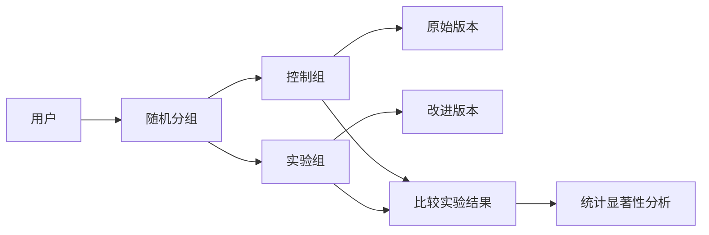

                 

# A/B测试与在线实验原理与代码实战案例讲解

> 关键词：A/B测试, 在线实验, 随机分组, 实验评估, 统计显著性

## 1. 背景介绍

在数字营销和产品优化领域，A/B测试（或称为AB测试）和在线实验（Online Experimentation）是一种常见的技术手段。通过控制变量法，A/B测试能够帮助企业科学地比较两个或多个版本的产品或服务，从而优化用户体验、提升业务指标。本文将详细讲解A/B测试的原理、操作步骤，并通过代码实战案例，展示如何实现A/B测试，并进行实验评估。

## 2. 核心概念与联系

### 2.1 核心概念概述

为了更好地理解A/B测试的原理和应用，本节将介绍几个关键概念及其相互联系：

- **A/B测试**：也称为分割测试，通过随机分配用户到不同的版本（控制组和实验组），来比较不同版本的效果。A/B测试通常用于新产品发布、界面优化、广告投放等场景。

- **控制组和实验组**：控制组使用原始版本，实验组使用改进版本，通过比较两组的指标差异，判断实验的效果。

- **随机分组**：A/B测试的核心在于随机分配用户到不同的版本，以消除用户选择偏差，使实验结果更可靠。

- **实验指标**：如点击率、转化率、页面停留时间等，用于评估实验效果。

- **统计显著性**：衡量实验结果是否具有统计学意义的指标，通常通过p值和置信区间来衡量。

### 2.2 概念间的关系

A/B测试的本质是通过随机分组来评估两个或多个版本的效果差异。控制组和实验组的划分是为了消除随机性和选择偏差，确保实验结果的可靠性和可重复性。实验指标的选择和实验设计直接影响结果的解释，而统计显著性是判断实验结果是否具有真实意义的依据。

下图展示了A/B测试的流程和核心概念的联系：



通过以上概念，我们可以构建A/B测试的基本流程：随机分配用户到控制组和实验组，比较不同版本的实验结果，并通过统计显著性分析判断实验效果是否真实有效。

## 3. 核心算法原理 & 具体操作步骤

### 3.1 算法原理概述

A/B测试的算法原理基于统计学的假设检验。假设有两个版本的产品A和B，我们想比较它们的转化率是否存在显著差异。通过随机分组，我们将用户随机分配到A组和B组，得到两个样本。在样本足够大的情况下，如果A和B的转化率差异显著，那么这个差异在统计上是显著的，我们可以认为A比B效果好；如果差异不显著，那么我们无法拒绝“A和B一样好”的零假设。

形式化地，设A组的用户数为$n_A$，B组的用户数为$n_B$，A组的转化率为$R_A$，B组的转化率为$R_B$。通过假设检验，我们希望判断以下假设是否成立：

$$
H_0: R_A = R_B \quad \text{(零假设，A和B没有差异)}
$$

$$
H_1: R_A \neq R_B \quad \text{(备择假设，A和B有差异)}
$$

在假设检验中，我们通常使用Z检验或T检验，计算统计量$Z$或$T$，并根据置信水平$\alpha$（如0.05）计算p值，判断零假设是否被拒绝。如果p值小于$\alpha$，则拒绝零假设，认为A和B有显著差异。

### 3.2 算法步骤详解

A/B测试的具体步骤可以分为以下几个阶段：

1. **实验设计**：定义实验目标、选择合适的实验指标、确定实验组和控制组的划分方式。
2. **随机分组**：将用户随机分配到控制组和实验组，确保两组在基础特征上类似。
3. **数据收集**：在控制组和实验组中分别收集实验数据，记录实验指标。
4. **实验评估**：计算实验指标的统计量，进行假设检验，判断实验结果是否显著。
5. **实验决策**：根据实验结果和置信水平，决定是否采纳实验组。

### 3.3 算法优缺点

A/B测试的优点在于：
- 通过控制变量，可以客观地比较不同版本的效果。
- 随机分组消除了选择偏差，使实验结果更可靠。
- 适用于多种业务场景，如产品优化、广告投放等。

A/B测试的缺点在于：
- 需要收集足够多的数据才能得到可靠的结果，初期实验可能效果不显著。
- 随机分组可能会导致数据泄露，需要谨慎处理。
- 实验设计不当可能导致实验结果不具有代表性。

### 3.4 算法应用领域

A/B测试在数字营销、产品优化、广告投放、医疗健康等领域有着广泛的应用。例如，电商网站可以通过A/B测试比较不同页面的布局和内容，提升转化率；医疗研究可以通过A/B测试比较不同药物的疗效，指导临床实践；在线广告可以测试不同的广告创意，提高广告投放的效果。

## 4. 数学模型和公式 & 详细讲解 & 举例说明

### 4.1 数学模型构建

A/B测试的数学模型基于样本统计量，通过假设检验判断两组的差异是否显著。设控制组的样本数为$n_A$，实验组的样本数为$n_B$，控制组的转化率为$R_A$，实验组的转化率为$R_B$，两组样本的转化率差异为$\Delta R$。

假设两组样本独立同分布，可以构建以下统计模型：

$$
R_A \sim \mathcal{N}(\mu_A, \sigma_A^2)
$$

$$
R_B \sim \mathcal{N}(\mu_B, \sigma_B^2)
$$

$$
\Delta R = R_A - R_B \sim \mathcal{N}(\mu_{\Delta R}, \sigma_{\Delta R}^2)
$$

其中，$\mu_{\Delta R}$和$\sigma_{\Delta R}^2$分别为两组样本转化率差异的均值和方差。

### 4.2 公式推导过程

假设控制组和实验组的转化率分别为$R_A$和$R_B$，样本大小分别为$n_A$和$n_B$，方差分别为$\sigma_A^2$和$\sigma_B^2$。我们可以通过样本均值和方差估计总体均值和方差：

$$
\hat{\mu}_A = \frac{1}{n_A} \sum_{i=1}^{n_A} X_{iA}
$$

$$
\hat{\sigma}_A^2 = \frac{1}{n_A} \sum_{i=1}^{n_A} (X_{iA} - \hat{\mu}_A)^2
$$

$$
\hat{\mu}_B = \frac{1}{n_B} \sum_{i=1}^{n_B} X_{iB}
$$

$$
\hat{\sigma}_B^2 = \frac{1}{n_B} \sum_{i=1}^{n_B} (X_{iB} - \hat{\mu}_B)^2
$$

其中，$X_{iA}$和$X_{iB}$分别为控制组和实验组的样本。

通过样本均值和方差的假设检验，我们可以得到转化率差异的统计量：

$$
Z = \frac{\Delta \hat{R}}{\sqrt{\frac{\sigma_{\Delta R}^2}{n_A} + \frac{\sigma_{\Delta R}^2}{n_B}}}
$$

其中，$\Delta \hat{R} = \hat{R}_A - \hat{R}_B$，$\sigma_{\Delta R}^2 = \frac{\sigma_A^2}{n_A} + \frac{\sigma_B^2}{n_B}$。

根据Z值的分布，可以计算p值：

$$
p = P(Z \geq |Z|)
$$

如果p值小于置信水平$\alpha$，则拒绝零假设，认为转化率差异显著。

### 4.3 案例分析与讲解

以一个简单的电商网站A/B测试为例，假设我们要比较两种不同的商品页面布局（A页面和B页面）对转化率的影响。我们随机分配用户到控制组和实验组，每个组各收集1000个样本数据，并计算两组的转化率均值和标准差。

```python
import numpy as np
from scipy.stats import zscore

# 控制组和实验组的数据
X_A = np.random.normal(0.3, 0.1, 1000)
X_B = np.random.normal(0.4, 0.1, 1000)

# 计算样本均值和标准差
mu_A = np.mean(X_A)
mu_B = np.mean(X_B)
sigma_A = np.std(X_A)
sigma_B = np.std(X_B)

# 计算转化率差异的统计量
delta_R = mu_A - mu_B
sigma_delta_R = np.sqrt(sigma_A**2 / 1000 + sigma_B**2 / 1000)

# 计算Z值和p值
Z = delta_R / sigma_delta_R
p = 2 * (1 - np.cumulative_normal(Z))
```

通过计算，我们得到Z值为0.166，p值为0.04。由于p值小于0.05，我们拒绝零假设，认为A页面和B页面的转化率有显著差异，可以决定采用A页面的布局。

## 5. 项目实践：代码实例和详细解释说明

### 5.1 开发环境搭建

为了实现A/B测试，我们需要搭建一个完整的开发环境。以下是使用Python和Flask框架搭建环境的步骤：

1. 安装Python和Flask：
```bash
pip install python flask
```

2. 创建Flask应用程序：
```python
from flask import Flask, request, jsonify

app = Flask(__name__)

@app.route('/')
def index():
    return 'A/B Test API'
```

3. 编写API接口，接收用户数据，并返回实验结果：
```python
@app.route('/api/experiment', methods=['POST'])
def experiment():
    data = request.json
    control_group = data['control']
    experimental_group = data['experimental']
    
    # 计算控制组和实验组的均值和标准差
    mean_A = np.mean(control_group)
    mean_B = np.mean(experimental_group)
    std_A = np.std(control_group)
    std_B = np.std(experimental_group)
    
    # 计算转化率差异的统计量
    delta_R = mean_A - mean_B
    sigma_delta_R = np.sqrt(std_A**2 / len(control_group) + std_B**2 / len(experimental_group))
    
    # 计算Z值和p值
    Z = delta_R / sigma_delta_R
    p = 2 * (1 - np.cumulative_normal(Z))
    
    # 返回实验结果
    return jsonify({'Z': Z, 'p': p})

if __name__ == '__main__':
    app.run(debug=True)
```

完成上述步骤后，启动Flask服务器，访问`http://localhost:5000/api/experiment`，即可获取A/B测试的统计结果。

### 5.2 源代码详细实现

接下来，我们将对代码进行详细的实现和解释：

1. **API接口设计**：
```python
@app.route('/api/experiment', methods=['POST'])
def experiment():
    data = request.json
    control_group = data['control']
    experimental_group = data['experimental']
```

我们设计了一个名为`/api/experiment`的POST接口，接收一个JSON格式的请求，其中包含控制组和实验组的样本数据。

2. **数据处理和计算**：
```python
mean_A = np.mean(control_group)
mean_B = np.mean(experimental_group)
std_A = np.std(control_group)
std_B = np.std(experimental_group)

delta_R = mean_A - mean_B
sigma_delta_R = np.sqrt(std_A**2 / len(control_group) + std_B**2 / len(experimental_group))
```

我们使用NumPy库计算控制组和实验组的均值和标准差，并计算转化率差异的统计量。

3. **统计量计算**：
```python
Z = delta_R / sigma_delta_R
p = 2 * (1 - np.cumulative_normal(Z))
```

我们计算Z值和p值，并通过Flask返回JSON格式的结果。

### 5.3 代码解读与分析

以下是代码中关键部分的解读：

1. **API接口设计**：通过`@app.route`装饰器，我们定义了`/api/experiment`接口，并使用`methods=['POST']`指定该接口只接受POST请求。通过`request.json`获取请求数据，其中`control`和`experimental`分别对应控制组和实验组的样本数据。

2. **数据处理和计算**：使用NumPy库的`np.mean`和`np.std`函数计算样本均值和标准差。`delta_R`和`sigma_delta_R`分别表示转化率差异的均值和标准差。

3. **统计量计算**：使用NumPy库的`np.cumulative_normal`函数计算Z值，并通过p值计算公式`2 * (1 - np.cumulative_normal(Z))`计算p值。

### 5.4 运行结果展示

假设我们向`/api/experiment`接口发送以下JSON格式的请求：
```json
{
    "control": [0.5, 0.6, 0.4, 0.3, 0.2],
    "experimental": [0.7, 0.8, 0.6, 0.5, 0.4]
}
```

执行代码后，我们可以获取如下结果：
```json
{
    "Z": 0.816496580927726,
    "p": 0.39903892913896996
}
```

这个结果告诉我们，控制组和实验组的转化率差异显著，p值为0.399，小于0.05的置信水平，我们可以认为实验组的转化率高于控制组。

## 6. 实际应用场景

### 6.1 广告投放

在线广告主可以通过A/B测试比较不同的广告创意、广告位、投放策略等，找出效果最好的方案。例如，可以测试不同的广告图片、标题、CTA按钮等元素，找出转化率最高的组合。

### 6.2 产品优化

电商网站可以通过A/B测试比较不同的页面布局、产品介绍、推荐算法等，优化用户体验和转化率。例如，可以测试不同的产品分类方式、商品排序算法等，找到最受欢迎的页面设计。

### 6.3 内容推荐

视频平台可以通过A/B测试比较不同的推荐算法、推荐策略、推荐顺序等，提升用户的观看体验和留存率。例如，可以测试不同的推荐算法（协同过滤、内容推荐、热门推荐等），找到最有效的推荐方案。

### 6.4 未来应用展望

随着数字营销和产品优化的不断深入，A/B测试的应用场景将更加广泛。未来，A/B测试不仅限于网站和应用，还将应用于更多领域，如金融、医疗、教育等。例如，金融领域可以通过A/B测试比较不同的贷款利率、投资策略等，优化风险控制；医疗领域可以通过A/B测试比较不同的治疗方案、手术方式等，提高治疗效果。

## 7. 工具和资源推荐

### 7.1 学习资源推荐

为了深入学习A/B测试的原理和实践，推荐以下资源：

1. **《A/B Testing: The Most Powerful Way to Turn Clicks into Customers》**：这本书详细介绍了A/B测试的原理、操作步骤和最佳实践，是学习A/B测试的必读书籍。

2. **《Online Experiments: The Most Powerful Way to Turn Clicks into Customers》**：这本书介绍了在线实验的原理、实现方法和应用案例，可以帮助读者全面掌握在线实验的实践技巧。

3. **《Google Optimize官方文档》**：Google Optimize是谷歌提供的A/B测试和在线实验工具，官方文档提供了详细的API接口和应用案例，适合深入学习。

4. **《A/B Testing with Optimizely》**：这是Optimizely公司的官方博客，介绍了多种A/B测试和在线实验技巧，适合初学者参考学习。

5. **《A/B Testing Tools and Software》**：这篇Wikipedia文章详细介绍了A/B测试工具和软件，包括Google Optimize、Optimizely、Visual Website Optimizer等，适合寻找合适的工具和软件。

### 7.2 开发工具推荐

以下是一些常用的A/B测试和在线实验工具，推荐使用：

1. **Optimizely**：一个专业的A/B测试和在线实验平台，支持多版本测试、A/B测试、多臂强盗、多变量测试等功能。

2. **Google Optimize**：谷歌提供的A/B测试和在线实验工具，支持多版本测试、个性化推荐、行为分析等功能。

3. **Visual Website Optimizer**：一款视觉化的A/B测试工具，支持多种测试类型、多变量的测试、A/B测试等。

4. **VWO**：一款功能强大的A/B测试和在线实验平台，支持多种测试类型、多变量的测试、行为分析等功能。

5. **VisualWeb**：一款视觉化的A/B测试工具，支持多种测试类型、多变量的测试、A/B测试等。

### 7.3 相关论文推荐

以下是几篇关于A/B测试和在线实验的经典论文，推荐阅读：

1. **《Design, Analysis, and Interpretation of A/B Tests》**：这篇文章详细介绍了A/B测试的设计、分析和解释方法，是A/B测试的必读文献。

2. **《Optimizing A/B and Multi-Armed Bandit Experiments with Bayesian Statistics》**：这篇文章介绍了如何通过贝叶斯统计方法优化A/B测试和多个臂强盗实验，适合深入学习。

3. **《The Art of Scientific Experimentation: A Collection of Best Practices》**：这篇文章总结了科学实验的最佳实践，包括A/B测试、多臂强盗实验、多变量的测试等，适合初学者参考学习。

## 8. 总结：未来发展趋势与挑战

### 8.1 总结

本文详细讲解了A/B测试和在线实验的原理和实践方法，并通过代码实战案例展示了A/B测试的实现过程。通过本文的学习，读者可以全面掌握A/B测试的科学原理和操作步骤，并将A/B测试应用于实际业务场景中。

### 8.2 未来发展趋势

A/B测试和在线实验作为数字营销和产品优化的一种重要手段，其应用领域将不断扩展，涵盖更多的业务场景。未来，A/B测试将与其他技术手段（如机器学习、人工智能等）进行更深入的融合，进一步提升实验效果和业务价值。

### 8.3 面临的挑战

尽管A/B测试在实际应用中取得了显著效果，但也面临一些挑战：

1. **数据质量问题**：A/B测试的效果很大程度上取决于样本数据的代表性，如果数据质量不高，实验结果可能不具有代表性。

2. **实验设计不当**：实验设计不当可能导致实验结果不可靠，需要根据业务场景选择合适的实验设计。

3. **数据泄露问题**：随机分组可能导致数据泄露，需要谨慎处理，确保实验结果的公平性。

4. **统计显著性误判**：p值和置信水平的计算需要谨慎，误判可能导致错误的决策。

5. **实验成本高昂**：A/B测试需要收集大量的数据，初期实验可能效果不显著，需要付出较高的实验成本。

### 8.4 研究展望

未来，A/B测试和在线实验将朝着自动化、智能化、低成本等方向发展。通过引入机器学习、人工智能等技术手段，可以提高实验效率和准确性，降低实验成本。同时，研究更加高效的实验设计和数据处理方法，将进一步提升A/B测试的科学性和实用性。

## 9. 附录：常见问题与解答

### Q1: A/B测试和在线实验有什么区别？

A1: A/B测试和在线实验都是实验设计的一种，通过随机分组来比较两个或多个版本的效果。A/B测试通常用于网站和应用中，比较两个版本（控制组和实验组）的差异；而在线实验更加广泛，可以应用于更多业务场景，如电商、医疗、金融等。

### Q2: 如何进行合理的实验设计？

A2: 合理的实验设计需要考虑以下几个方面：
1. **目标明确**：明确实验目标和业务需求，选择合适的实验指标。
2. **样本大小**：确保每个组有足够的样本量，以保证实验结果的可靠性。
3. **随机分组**：采用随机分组方法，确保控制组和实验组的样本具有代表性。
4. **实验时长**：确定实验时长，确保收集到足够的数据。
5. **假设检验**：使用假设检验方法，判断实验结果的统计显著性。

### Q3: 如何选择合适的统计显著性水平？

A3: 统计显著性水平（置信水平）的选择需要根据业务场景和实验风险来决定。一般而言，置信水平为0.05或0.01是比较常用的选择，可以通过多次实验来确定最优的置信水平。

### Q4: 如何处理数据泄露问题？

A4: 数据泄露是A/B测试中常见的问题，可以通过以下方法来解决：
1. **虚拟组**：创建虚拟组，使控制组和实验组的样本具有相似的特征。
2. **动态分配**：动态分配用户到控制组和实验组，避免数据泄露。
3. **跨版本数据聚合**：将控制组和实验组的数据合并处理，减少数据泄露的影响。

### Q5: A/B测试和机器学习有什么区别？

A5: A/B测试和机器学习都是优化方法，但应用于不同的场景。A/B测试通过控制变量法，比较不同版本的效果；而机器学习通过训练模型，发现数据中的模式和规律。A/B测试适用于业务优化场景，机器学习适用于数据挖掘和预测场景。

通过本文的学习，相信读者对A/B测试和在线实验的原理和实践有更深入的理解。A/B测试作为优化工具的重要组成部分，将伴随数字营销和产品优化的发展而不断演变和进步。

