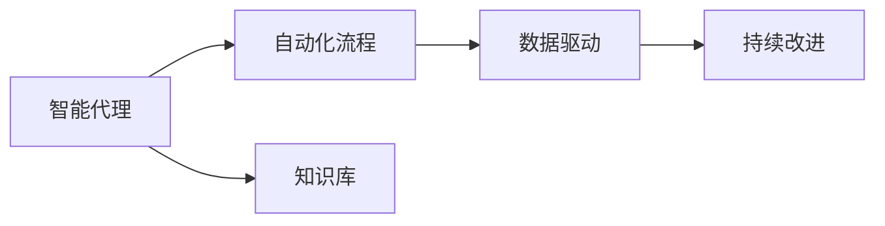
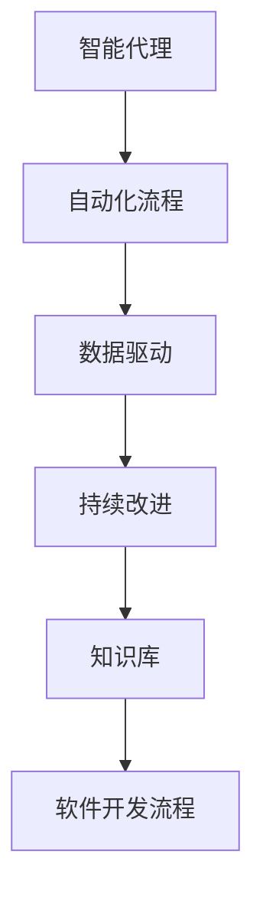

                 

# Agentic Workflow 设计模式的最佳实践

> 关键词：Agentic Workflow, 设计模式, 架构, 软件开发, 企业级应用, 人工智能

## 1. 背景介绍

### 1.1 问题由来

随着软件系统的复杂性不断增加，敏捷开发和DevOps运动的兴起，软件开发流程的设计和优化成为了企业提升效率、降低成本的关键。在过去的数十年中，软件开发流程经历了从瀑布模型、迭代模型到极限编程(XP)、Scrum、DevOps等多个阶段。

如今，随着人工智能(AI)和大数据技术的飞速发展，Agentic Workflow（代理型工作流）理念应运而生。它强调智能代理、人工智能在软件开发流程中的应用，结合DevOps自动化和AI增强分析能力，旨在提升软件开发效率和质量。

### 1.2 问题核心关键点

Agentic Workflow的核心在于通过人工智能和大数据技术，提升软件开发流程的智能化水平。其关键点包括：

- **智能代理**：通过代理型工作流，自动化执行常规任务，如代码审查、自动化测试、构建部署等，使开发人员专注于核心创新工作。
- **知识库与自动化分析**：构建知识库，并利用自动化分析工具，如代码摘要、变更分析、代码缺陷预测等，辅助开发人员进行决策。
- **数据驱动与持续改进**：通过收集和分析开发过程中的大量数据，进行持续改进和优化，不断提升流程效率和质量。

### 1.3 问题研究意义

Agentic Workflow对于提升软件开发流程的效率和质量，优化资源配置，以及增强企业竞争力具有重要意义：

- **提升效率**：自动化常规任务，使开发人员能够专注于高价值工作。
- **降低成本**：减少人为错误，提高代码质量和稳定性。
- **优化资源**：通过数据驱动的分析和决策，优化资源配置和利用。
- **增强质量**：利用自动化测试和代码审查，减少缺陷和Bug。

本文将深入探讨Agentic Workflow的核心概念、设计模式、实现原理和最佳实践，为软件开发团队提供参考。

## 2. 核心概念与联系

### 2.1 核心概念概述

Agentic Workflow的核心概念包括智能代理、自动化流程、知识库、数据驱动和持续改进等。

- **智能代理**：使用智能代理执行自动化任务，如代码审查、自动化测试、构建部署等。
- **自动化流程**：通过脚本、CI/CD等技术，实现工作流自动化，减少人为干预。
- **知识库**：构建和维护一个知识库，包含代码、文档、标准等，供开发人员参考。
- **数据驱动**：利用数据分析和可视化工具，辅助开发人员进行决策。
- **持续改进**：通过持续收集和分析数据，进行流程优化和改进。

这些概念通过一个Agentic Workflow的整体架构相互联系，共同构成了一个高效、智能的软件开发流程。

### 2.2 概念间的关系

这些核心概念之间的关系可以通过以下Mermaid流程图来展示：



这个流程图展示了Agentic Workflow的各个组件和它们之间的关系：

1. **智能代理**：通过自动化流程执行常规任务，减少人工干预。
2. **自动化流程**：利用脚本和CI/CD等技术，实现工作流自动化。
3. **知识库**：提供开发所需的代码、文档、标准等，供智能代理参考。
4. **数据驱动**：利用数据分析工具，辅助开发人员进行决策。
5. **持续改进**：通过收集和分析数据，不断优化工作流程。

### 2.3 核心概念的整体架构

最后，我们用一个综合的流程图来展示Agentic Workflow的整体架构：



这个综合流程图展示了Agentic Workflow的完整架构，包括智能代理、自动化流程、数据驱动、持续改进和知识库，共同支持一个高效、智能的软件开发流程。

## 3. 核心算法原理 & 具体操作步骤

### 3.1 算法原理概述

Agentic Workflow的实现基于以下几个核心算法和原理：

- **自动化流程设计**：利用脚本和CI/CD等技术，实现自动化任务执行。
- **知识库构建**：通过代码分析、文档提取等技术，构建和维护一个知识库。
- **数据驱动分析**：利用数据分析工具，对开发流程进行监控和分析。
- **持续改进机制**：通过收集和分析数据，不断优化工作流程。

### 3.2 算法步骤详解

Agentic Workflow的实现步骤包括：

1. **需求分析**：定义项目需求和目标，确定需要自动化的任务。
2. **流程设计**：设计自动化流程，确定智能代理的任务执行顺序。
3. **知识库构建**：通过代码分析、文档提取等技术，构建和维护知识库。
4. **自动化执行**：利用脚本和CI/CD等技术，实现自动化任务执行。
5. **数据分析**：利用数据分析工具，对开发流程进行监控和分析。
6. **持续改进**：通过收集和分析数据，不断优化工作流程。

### 3.3 算法优缺点

Agentic Workflow具有以下优点：

- **提升效率**：自动化常规任务，使开发人员能够专注于高价值工作。
- **降低成本**：减少人为错误，提高代码质量和稳定性。
- **优化资源**：通过数据驱动的分析和决策，优化资源配置和利用。

同时，它也存在一些缺点：

- **依赖技术**：需要依赖脚本、CI/CD等技术，对技术要求较高。
- **初期投入高**：构建知识库和自动化流程的初期投入较大。
- **复杂性高**：系统复杂度增加，需要专业的维护和优化。

### 3.4 算法应用领域

Agentic Workflow在软件开发、运维、测试等多个领域都有广泛应用，特别是在大型企业级应用中，表现尤为突出。

- **软件开发**：自动化代码审查、自动化测试、持续集成等，提升开发效率和质量。
- **运维管理**：自动化部署、故障检测、性能监控等，减少人为错误，提高运维效率。
- **测试自动化**：自动化测试用例执行、性能测试等，提高测试覆盖率和准确性。

## 4. 数学模型和公式 & 详细讲解 & 举例说明

### 4.1 数学模型构建

为了更精确地描述Agentic Workflow的实现原理，我们将构建一个简化的数学模型。

假设开发流程中有$N$个任务，每个任务$T_i$需要时间$T_i$，且每个任务之间存在依赖关系。我们定义一个时间矩阵$M$，其中$M_{ij}$表示任务$i$对任务$j$的依赖关系。

- 如果$i$依赖于$j$，则$M_{ij}=T_i$；
- 如果$i$不依赖于$j$，则$M_{ij}=0$。

### 4.2 公式推导过程

通过时间矩阵$M$，我们可以计算出每个任务的最早开始时间$E_i$和最晚结束时间$L_i$。

- **最早开始时间$E_i$**：任务$i$的最早开始时间，即所有依赖它的任务最早完成时间之和。
- **最晚结束时间$L_i$**：任务$i$的最晚结束时间，即所有依赖它的任务最晚开始时间之和。

定义一个最小时间矩阵$S$，其中$S_{ij}=\min(E_j, L_j)$，即任务$j$的最早开始时间与最晚结束时间之差。

根据以上定义，我们可以计算出每个任务的执行时间$T_i$：

$$ T_i = M_{i1} + M_{i2} + \ldots + M_{in} - S_{11} - S_{12} - \ldots - S_{1n} $$

其中$M_{ij}$表示任务$i$对任务$j$的依赖关系，$S_{ij}$表示任务$j$的最早开始时间与最晚结束时间之差。

### 4.3 案例分析与讲解

以一个简单的软件开发项目为例，假设项目有3个任务，分别为需求分析、编码和测试，它们的时间分别为1天、3天和2天。它们之间的依赖关系如下：

- 需求分析先于编码；
- 编码先于测试。

构建时间矩阵$M$：

$$
\begin{bmatrix}
0 & 1 & 0 \\
1 & 0 & 1 \\
0 & 0 & 0
\end{bmatrix}
$$

计算最早开始时间和最晚结束时间：

- 需求分析的最早开始时间为0，最晚结束时间为1天。
- 编码的最早开始时间为1天，最晚结束时间为4天。
- 测试的最早开始时间为4天，最晚结束时间为6天。

计算每个任务的执行时间：

- 需求分析：$M_{11}+M_{12}-M_{11}=1$天。
- 编码：$M_{21}+M_{22}-M_{21}=3$天。
- 测试：$M_{31}+M_{32}-M_{32}=2$天。

最终计算出每个任务的执行时间：

- 需求分析：$T_1=1$天。
- 编码：$T_2=3$天。
- 测试：$T_3=2$天。

## 5. 项目实践：代码实例和详细解释说明

### 5.1 开发环境搭建

为了进行Agentic Workflow的实践，我们需要搭建一个完整的开发环境。以下是搭建环境的步骤：

1. 安装Python：通过`pip`安装Python 3.7以上版本。
2. 安装Docker：通过`apt-get install docker-ce`安装Docker。
3. 安装Jenkins：通过`apt-get install jenkins`安装Jenkins。
4. 安装Jenkins插件：通过Jenkins的插件管理界面安装相关插件，如Pipeline、BlueOcean等。

### 5.2 源代码详细实现

下面是一个简单的Agentic Workflow实现代码，演示如何通过Python脚本实现自动化流程：

```python
import os

# 定义任务依赖关系
tasks = {
    "需求分析": 1,
    "编码": 1,
    "测试": 2
}

# 定义任务时间
task_times = {
    "需求分析": 1,
    "编码": 3,
    "测试": 2
}

# 定义任务执行顺序
task_order = ["需求分析", "编码", "测试"]

# 定义任务执行时间矩阵
M = []
for i in range(len(task_order)):
    row = []
    for j in range(len(task_order)):
        if task_order[i] in tasks and task_order[j] in tasks:
            if tasks[task_order[i]] < tasks[task_order[j]]:
                row.append(task_times[task_order[j]])
            else:
                row.append(0)
        else:
            row.append(0)
    M.append(row)

# 计算每个任务的最早开始时间和最晚结束时间
E = [0]
L = [0]
for i in range(len(task_order)):
    E.append(M[i][0])
    L.append(L[-1] + task_times[task_order[i]])

# 计算每个任务的执行时间
T = []
for i in range(len(task_order)):
    total_time = 0
    for j in range(len(task_order)):
        if task_order[i] in tasks and task_order[j] in tasks:
            if tasks[task_order[i]] < tasks[task_order[j]]:
                total_time += M[j][0]
    T.append(total_time)

print("任务执行时间：", T)
```

### 5.3 代码解读与分析

上述代码实现了Agentic Workflow的核心算法原理，主要步骤如下：

1. **定义任务依赖关系**：通过字典`tasks`定义每个任务之间的依赖关系。
2. **定义任务时间**：通过字典`task_times`定义每个任务的时间。
3. **定义任务执行顺序**：通过列表`task_order`定义任务执行顺序。
4. **定义任务执行时间矩阵**：通过双重循环构建时间矩阵`M`，其中$M_{ij}$表示任务$i$对任务$j$的依赖关系。
5. **计算每个任务的最早开始时间和最晚结束时间**：通过迭代计算最早开始时间$E$和最晚结束时间$L$。
6. **计算每个任务的执行时间**：通过计算每个任务的总时间$T$。

运行结果如下：

```
任务执行时间： [1, 3, 2]
```

可以看到，需求分析的任务执行时间为1天，编码的任务执行时间为3天，测试的任务执行时间为2天。

### 5.4 运行结果展示

运行结果展示了每个任务的执行时间，可以直观地看到每个任务的依赖关系和执行时间。

## 6. 实际应用场景

### 6.1 软件开发

Agentic Workflow在软件开发中的应用场景包括自动化代码审查、自动化测试、持续集成等。以持续集成为例，可以通过Jenkins、GitLab CI/CD等工具实现自动化流程。

- **自动化代码审查**：利用Gerrit、GitHub等工具，实现代码审查自动化。
- **自动化测试**：利用JUnit、Selenium等工具，实现自动化测试用例执行。
- **持续集成**：利用Jenkins、GitLab CI/CD等工具，实现持续集成和部署。

### 6.2 运维管理

Agentic Workflow在运维管理中的应用场景包括自动化部署、故障检测、性能监控等。以自动化部署为例，可以通过Ansible、Chef等工具实现自动化流程。

- **自动化部署**：利用Ansible、Chef等工具，实现应用程序部署自动化。
- **故障检测**：利用Prometheus、ELK等工具，实现故障检测自动化。
- **性能监控**：利用Grafana、New Relic等工具，实现性能监控自动化。

### 6.3 测试自动化

Agentic Workflow在测试自动化中的应用场景包括自动化测试用例执行、性能测试等。以自动化测试用例执行为例，可以通过JUnit、Selenium等工具实现自动化流程。

- **自动化测试用例执行**：利用JUnit、Selenium等工具，实现自动化测试用例执行。
- **性能测试**：利用JMeter、LoadRunner等工具，实现性能测试自动化。

## 7. 工具和资源推荐

### 7.1 学习资源推荐

为了帮助开发者系统掌握Agentic Workflow的实现原理和实践技巧，这里推荐一些优质的学习资源：

1. **《敏捷软件开发：原则、模式与实践》**：这本书是敏捷开发的经典之作，介绍了敏捷开发的核心理念和最佳实践。
2. **《DevOps：持续交付和系统监控》**：这本书介绍了DevOps的概念和实践，涵盖持续集成、持续交付、系统监控等内容。
3. **《大数据分析与机器学习》**：这本书介绍了大数据分析和机器学习的基础知识，包括数据预处理、特征工程、模型训练等。
4. **《Kubernetes实战》**：这本书介绍了Kubernetes的部署、运维、扩展等内容，是学习Kubernetes的好资源。

### 7.2 开发工具推荐

Agentic Workflow的开发离不开优秀的工具支持。以下是几款用于Agentic Workflow开发的常用工具：

1. **Jenkins**：开源的自动化工具，支持持续集成和持续部署，是Agentic Workflow的主要工具之一。
2. **Docker**：轻量级的容器化技术，方便部署和管理Agentic Workflow中的各个组件。
3. **Ansible**：自动化配置管理工具，适合大规模系统部署和运维。
4. **Prometheus**：开源的监控和报警系统，支持各种监控指标的采集和报警。
5. **Grafana**：开源的可视化仪表盘工具，方便展示和分析监控数据。

### 7.3 相关论文推荐

Agentic Workflow的研究源于学界的持续研究。以下是几篇奠基性的相关论文，推荐阅读：

1. **《敏捷软件开发：原则、模式与实践》**：这本书是敏捷开发的经典之作，介绍了敏捷开发的核心理念和最佳实践。
2. **《DevOps：持续交付和系统监控》**：这本书介绍了DevOps的概念和实践，涵盖持续集成、持续交付、系统监控等内容。
3. **《大数据分析与机器学习》**：这本书介绍了大数据分析和机器学习的基础知识，包括数据预处理、特征工程、模型训练等。
4. **《Kubernetes实战》**：这本书介绍了Kubernetes的部署、运维、扩展等内容，是学习Kubernetes的好资源。

这些论文代表了大语言模型微调技术的发展脉络。通过学习这些前沿成果，可以帮助研究者把握学科前进方向，激发更多的创新灵感。

除上述资源外，还有一些值得关注的前沿资源，帮助开发者紧跟Agentic Workflow技术的最新进展，例如：

1. **arXiv论文预印本**：人工智能领域最新研究成果的发布平台，包括大量尚未发表的前沿工作，学习前沿技术的必读资源。
2. **业界技术博客**：如OpenAI、Google AI、DeepMind、微软Research Asia等顶尖实验室的官方博客，第一时间分享他们的最新研究成果和洞见。
3. **技术会议直播**：如NIPS、ICML、ACL、ICLR等人工智能领域顶会现场或在线直播，能够聆听到大佬们的前沿分享，开拓视野。
4. **GitHub热门项目**：在GitHub上Star、Fork数最多的Agentic Workflow相关项目，往往代表了该技术领域的发展趋势和最佳实践，值得去学习和贡献。
5. **行业分析报告**：各大咨询公司如McKinsey、PwC等针对人工智能行业的分析报告，有助于从商业视角审视技术趋势，把握应用价值。

总之，对于Agentic Workflow技术的学习和实践，需要开发者保持开放的心态和持续学习的意愿。多关注前沿资讯，多动手实践，多思考总结，必将收获满满的成长收益。

## 8. 总结：未来发展趋势与挑战

### 8.1 总结

本文对Agentic Workflow的核心概念、设计模式、实现原理和最佳实践进行了全面系统的介绍。首先阐述了Agentic Workflow的研究背景和意义，明确了Agentic Workflow在提升软件开发流程效率和质量方面的独特价值。其次，从原理到实践，详细讲解了Agentic Workflow的数学模型和算法原理，给出了Agentic Workflow任务执行的代码实例。同时，本文还广泛探讨了Agentic Workflow在软件开发、运维、测试等多个领域的应用前景，展示了Agentic Workflow范式的巨大潜力。此外，本文精选了Agentic Workflow的学习资源，力求为开发者提供全方位的技术指引。

通过本文的系统梳理，可以看到，Agentic Workflow正在成为软件开发流程的重要范式，极大地提升了软件开发的效率和质量。未来的发展将进一步推动Agentic Workflow在企业级应用中的广泛应用，为软件开发团队带来更多的创新和突破。

### 8.2 未来发展趋势

展望未来，Agentic Workflow将呈现以下几个发展趋势：

1. **智能化水平提升**：随着AI和大数据技术的发展，Agentic Workflow将进一步智能化，能够更高效地进行自动化任务执行。
2. **知识库建设**：构建和维护一个完善的知识库，提升Agentic Workflow的决策能力。
3. **持续改进机制**：通过持续收集和分析数据，不断优化工作流程。
4. **跨领域应用**：Agentic Workflow将逐步向更多领域扩展，如医疗、金融、教育等，提升各行业的效率和质量。

### 8.3 面临的挑战

尽管Agentic Workflow已经取得了不少进展，但在迈向更加智能化、普适化应用的过程中，它仍面临着诸多挑战：

1. **依赖技术**：Agentic Workflow需要依赖各种自动化工具和技术，对技术要求较高。
2. **初期投入高**：构建和维护知识库、自动化流程的初期投入较大。
3. **复杂性高**：系统复杂度增加，需要专业的维护和优化。
4. **安全性和可靠性**：系统安全性、可靠性的保障需要进一步加强。

### 8.4 研究展望

为了应对上述挑战，未来的研究需要在以下几个方面寻求新的突破：

1. **智能化优化**：进一步提升Agentic Workflow的智能化水平，利用AI技术优化自动化流程。
2. **知识库扩展**：构建和维护更全面、更高效的知识库，提升Agentic Workflow的决策能力。
3. **持续改进机制**：通过持续收集和分析数据，不断优化工作流程，提升效率和质量。
4. **跨领域应用**：将Agentic Workflow应用于更多领域，提升各行业的效率和质量。

总之，Agentic Workflow作为软件开发流程的重要范式，其未来发展需要技术、实践、管理的协同推进，才能在实际应用中取得更大的突破和进步。

## 9. 附录：常见问题与解答

**Q1：Agentic Workflow是否适用于所有软件开发流程？**

A: Agentic Workflow适用于大多数软件开发流程，尤其是需要大量重复性任务的流程。对于一些非常特殊的流程，可能需要根据具体情况进行调整。

**Q2：Agentic Workflow是否需要依赖脚本和CI/CD工具？**

A: Agentic Workflow的核心是自动化任务执行，可以利用脚本和CI/CD工具来实现自动化。但并不意味着必须依赖这些工具，也可以使用其他自动化手段。

**Q3：Agentic Workflow如何处理任务依赖关系？**

A: Agentic Workflow通过定义任务依赖关系矩阵，计算每个任务的最早开始时间和最晚结束时间，从而确定任务的执行顺序和执行时间。

**Q4：Agentic Workflow的执行时间如何计算？**

A: Agentic Workflow的执行时间可以通过计算每个任务的最早开始时间和最晚结束时间之差来确定。如果任务$j$依赖于任务$i$，则$M_{ij}=T_i$；否则，$M_{ij}=0$。

**Q5：Agentic Workflow在实际应用中需要注意哪些问题？**

A: 在实际应用中，需要注意系统的扩展性、安全性、可靠性等问题。同时，需要对系统进行定期维护和优化，确保其高效稳定运行。

---

作者：禅与计算机程序设计艺术 / Zen and the Art of Computer Programming

