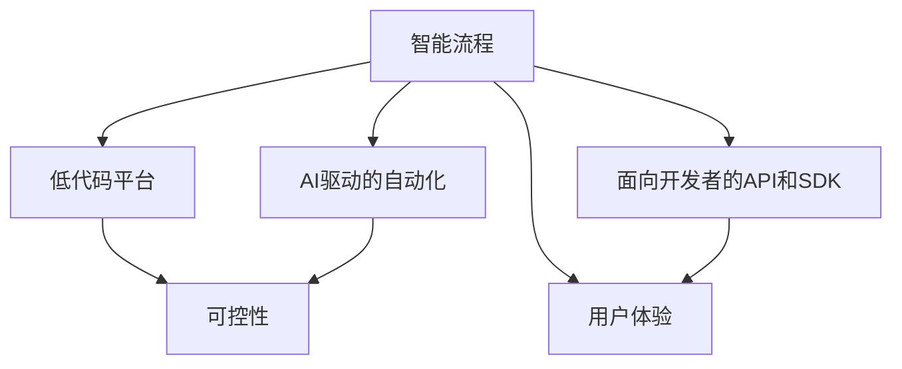
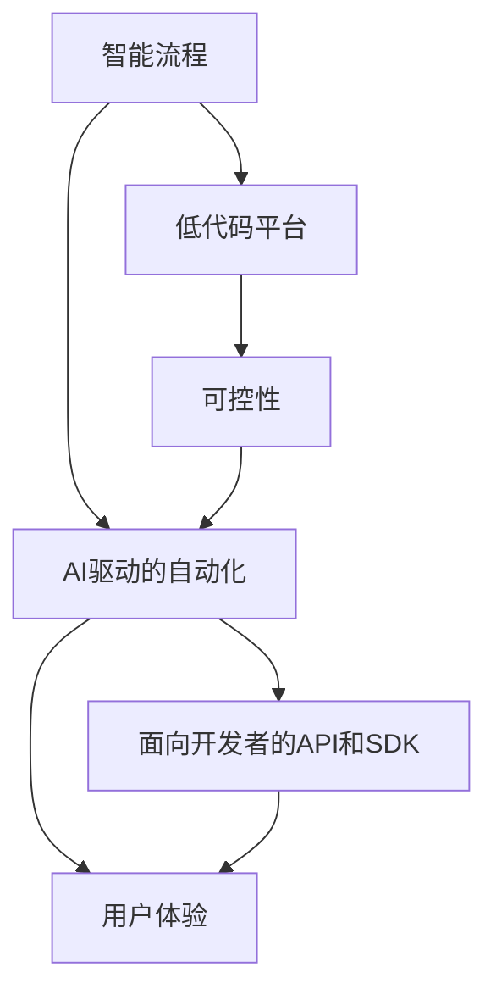
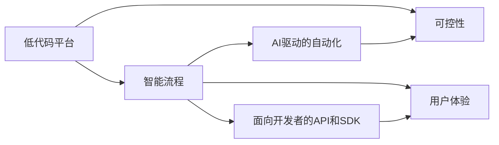
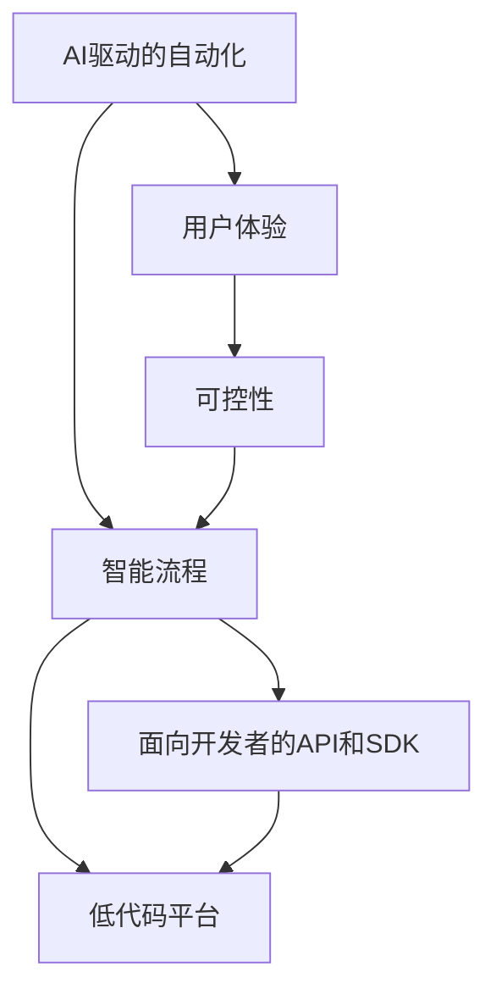

                 

# Agentic Workflow 设计模式的最佳实践

> 关键词：Agentic Workflow, 设计模式, 流程自动化, 可控性, 可扩展性, 低代码, 面向开发者, 用户体验

## 1. 背景介绍

### 1.1 问题由来
随着软件系统复杂度的不断增加，企业对系统可控性和可扩展性的要求也在日益提高。传统的软件开发方法如瀑布模型、敏捷开发等，已经无法适应现代化工程的需求。与此同时，随着AI、ML等新兴技术的兴起，企业也面临如何将这些技术高效集成到现有系统中，以提升业务价值的挑战。在这样的背景下，Agentic Workflow（智能流程）设计模式应运而生。它通过引入自动化、可控性、低代码等思想，帮助企业构建高效、灵活、易于维护的业务系统。

### 1.2 问题核心关键点
Agentic Workflow设计模式的核心在于将AI技术与流程自动化相结合，构建一种能够自我学习和适应变化的业务流程。其核心关键点包括：

- **自动化**：利用AI和ML技术自动化执行复杂业务流程，减少人工操作。
- **可控性**：通过程序化的决策和控制机制，确保业务流程的可控性和可预测性。
- **低代码**：使用低代码平台，简化流程定义和部署过程，加速业务系统开发。
- **面向开发者**：面向开发者提供完善的API和SDK，支持复杂场景的定制化开发。
- **用户体验**：通过界面和交互设计，提升用户的操作体验和满意度。

这些关键点共同构成了Agentic Workflow的核心特性，使其在快速响应业务变化、提升系统效率和质量等方面具有显著优势。

### 1.3 问题研究意义
研究Agentic Workflow设计模式，对于企业构建高效、灵活、可持续发展的业务系统具有重要意义：

1. **提升效率**：通过自动化和低代码平台，可以快速构建和部署业务系统，减少开发和部署时间。
2. **增强灵活性**：利用AI和ML技术，可以适应业务需求的快速变化，提高系统的响应速度。
3. **改善用户体验**：通过友好的界面设计和交互机制，提升用户的操作体验和满意度。
4. **优化资源利用**：通过智能流程管理，可以优化资源配置，降低运营成本。
5. **支持业务创新**：通过灵活的开发环境，可以快速响应市场需求，推动业务创新。

Agentic Workflow设计模式为企业提供了从流程设计到系统部署的全生命周期解决方案，有助于提升企业的整体业务能力和市场竞争力。

## 2. 核心概念与联系

### 2.1 核心概念概述

Agentic Workflow设计模式涉及多个核心概念，包括智能流程、低代码平台、AI驱动的自动化、可控性、面向开发者的API和SDK、以及用户体验。以下是这些核心概念的简要介绍：

- **智能流程**：通过AI和ML技术，自动执行复杂的业务流程，提升效率和准确性。
- **低代码平台**：使用图形化界面和组件化开发工具，简化流程定义和部署过程。
- **AI驱动的自动化**：利用AI和ML算法，实现业务流程的自动化和智能化。
- **可控性**：通过程序化的决策和控制机制，确保业务流程的可控性和可预测性。
- **面向开发者的API和SDK**：提供开发者友好的接口和工具，支持复杂场景的定制化开发。
- **用户体验**：通过界面和交互设计，提升用户的操作体验和满意度。

这些核心概念之间的联系可以通过以下Mermaid流程图来展示：



这个流程图展示了智能流程设计模式的各个组成部分及其相互关系：

1. 智能流程通过AI和ML技术，自动执行复杂业务流程。
2. 低代码平台简化了流程定义和部署过程，支持AI驱动的自动化。
3. 可控性确保业务流程的可控性和可预测性。
4. 面向开发者的API和SDK支持复杂场景的定制化开发。
5. 用户体验提升用户的操作体验和满意度。

### 2.2 概念间的关系

这些核心概念之间存在着紧密的联系，形成了Agentic Workflow设计模式的完整生态系统。下面通过几个Mermaid流程图来展示这些概念之间的关系。

#### 2.2.1 Agentic Workflow整体架构



这个综合流程图展示了智能流程设计模式的整体架构，包括智能流程、低代码平台、AI驱动的自动化、可控性、面向开发者的API和SDK、以及用户体验之间的关系。

#### 2.2.2 低代码平台与智能流程的结合



这个流程图展示了低代码平台与智能流程的结合，以及它们如何通过AI驱动的自动化和可控性提升用户体验。

#### 2.2.3 AI驱动的自动化与用户体验的联系



这个流程图展示了AI驱动的自动化如何通过智能流程和低代码平台提升用户体验。

### 2.3 核心概念的整体架构

最后，我们用一个综合的流程图来展示这些核心概念在大语言模型微调过程中的整体架构：


这个综合流程图展示了智能流程设计模式的各个组成部分及其相互关系。

## 3. 核心算法原理 & 具体操作步骤
### 3.1 算法原理概述

Agentic Workflow设计模式的核心算法原理主要基于AI和ML技术，通过自动化、可控性、低代码平台等手段，构建高效、灵活的业务系统。其核心算法包括：

- **智能流程自动化**：利用AI和ML技术，自动执行复杂的业务流程，减少人工操作。
- **可控性管理**：通过程序化的决策和控制机制，确保业务流程的可控性和可预测性。
- **低代码平台**：使用图形化界面和组件化开发工具，简化流程定义和部署过程。

这些算法共同构成了Agentic Workflow的核心技术框架，使其能够高效地构建和运行业务系统。

### 3.2 算法步骤详解

Agentic Workflow设计模式的具体操作步骤如下：

1. **需求分析**：收集和分析业务需求，确定流程自动化需求和目标。
2. **流程设计**：使用低代码平台或手动设计业务流程，定义流程节点和数据流转。
3. **智能流程自动化**：在低代码平台上集成AI和ML技术，实现流程自动化。
4. **测试和验证**：对自动化流程进行测试和验证，确保流程的正确性和性能。
5. **部署和监控**：将自动化流程部署到生产环境，并进行实时监控和优化。
6. **持续改进**：根据业务变化和用户反馈，持续改进和优化自动化流程。

这些操作步骤确保了Agentic Workflow设计模式能够高效、可靠地构建和运行业务系统，提升企业的整体业务能力和市场竞争力。

### 3.3 算法优缺点

Agentic Workflow设计模式具有以下优点：

- **高效性**：通过自动化和低代码平台，可以快速构建和部署业务系统，减少开发和部署时间。
- **灵活性**：利用AI和ML技术，可以适应业务需求的快速变化，提高系统的响应速度。
- **可控性**：通过程序化的决策和控制机制，确保业务流程的可控性和可预测性。
- **用户体验**：通过友好的界面设计和交互机制，提升用户的操作体验和满意度。

同时，该方法也存在一些局限性：

- **依赖于技术和工具**：需要依赖AI和ML技术以及低代码平台，可能会对技术门槛提出较高要求。
- **需要持续维护和优化**：自动化流程需要持续维护和优化，以适应业务变化和用户需求。
- **数据安全和隐私问题**：自动化流程涉及大量数据的处理和存储，需要严格的数据安全和隐私保护措施。

尽管存在这些局限性，但Agentic Workflow设计模式在提高业务系统效率、提升用户体验和应对业务变化方面仍具有显著优势。

### 3.4 算法应用领域

Agentic Workflow设计模式已经在多个领域得到应用，包括但不限于：

- **金融行业**：利用智能流程自动化和AI技术，提升金融业务处理效率和风险控制能力。
- **医疗行业**：通过低代码平台和AI驱动的自动化，加速医疗数据处理和诊断流程。
- **零售行业**：通过智能流程自动化和用户体验优化，提升零售业务运营效率和客户满意度。
- **制造行业**：使用低代码平台和面向开发者的API和SDK，快速构建和部署制造业务系统。
- **物流行业**：利用智能流程自动化和可控性管理，优化物流配送和仓储管理。

这些应用领域展示了Agentic Workflow设计模式的广泛适用性和实际效果。

## 4. 数学模型和公式 & 详细讲解 & 举例说明

### 4.1 数学模型构建

Agentic Workflow设计模式中涉及的数学模型主要包括以下几类：

- **流程自动化模型**：用于描述和优化业务流程的自动化过程，通过AI和ML技术实现。
- **可控性管理模型**：用于描述和控制业务流程的可控性，通过程序化决策实现。
- **低代码平台模型**：用于描述和实现低代码平台的功能，包括图形化界面和组件化开发。

这些数学模型共同构成了Agentic Workflow设计模式的技术基础，使其能够高效、可靠地构建和运行业务系统。

### 4.2 公式推导过程

以下我们将以流程自动化模型为例，推导其基本的数学公式。

设流程自动化模型中包含$n$个流程节点，每个节点的时间复杂度为$T_i$，则整个流程的时间复杂度为：

$$
T_{total} = \sum_{i=1}^n T_i
$$

其中$T_i$表示第$i$个流程节点的时间复杂度。在实际应用中，可以通过AI和ML技术优化每个节点的时间复杂度，以提升整个流程的效率。

### 4.3 案例分析与讲解

以下以金融行业为例，展示Agentic Workflow设计模式的具体应用：

**案例背景**：某银行希望通过智能流程自动化和AI技术，提升客户服务效率和风险控制能力。

**流程设计**：该银行使用低代码平台，设计了包括客户服务、风险评估、贷款审批等流程。每个流程由多个节点组成，如客户咨询、风险评估、贷款审批等。

**智能流程自动化**：在低代码平台上集成AI和ML技术，实现客户服务自动化、风险评估智能化和贷款审批自动化。例如，使用NLP技术自动分析客户咨询内容，生成处理建议；使用机器学习算法评估贷款风险，生成风险评分；使用自动化流程管理贷款审批过程，提升审批效率。

**测试和验证**：对自动化流程进行测试和验证，确保流程的正确性和性能。例如，通过模拟客户咨询和贷款审批场景，验证自动化流程的处理效果和准确性。

**部署和监控**：将自动化流程部署到生产环境，并进行实时监控和优化。例如，使用实时监控系统监控自动化流程的运行状态和性能指标，根据异常情况进行自动调整和优化。

**持续改进**：根据业务变化和用户反馈，持续改进和优化自动化流程。例如，根据客户反馈调整服务流程，优化风险评估模型，提升贷款审批效率。

## 5. 项目实践：代码实例和详细解释说明

### 5.1 开发环境搭建

在进行Agentic Workflow实践前，我们需要准备好开发环境。以下是使用Python进行Flask开发的环境配置流程：

1. 安装Anaconda：从官网下载并安装Anaconda，用于创建独立的Python环境。

2. 创建并激活虚拟环境：
```bash
conda create -n flask-env python=3.8 
conda activate flask-env
```

3. 安装Flask：
```bash
pip install flask
```

4. 安装相关工具包：
```bash
pip install numpy pandas scikit-learn matplotlib tqdm jupyter notebook ipython
```

完成上述步骤后，即可在`flask-env`环境中开始Agentic Workflow实践。

### 5.2 源代码详细实现

下面我们以金融行业为例，给出使用Flask进行智能流程自动化的PyTorch代码实现。

首先，定义智能流程的流程节点：

```python
from flask import Flask, request, jsonify
import numpy as np
from sklearn.linear_model import LogisticRegression
from sklearn.pipeline import make_pipeline
from sklearn.feature_extraction.text import TfidfVectorizer

app = Flask(__name__)

class PipelineModel:
    def __init__(self, pipeline):
        self.pipeline = pipeline

    def predict(self, data):
        return self.pipeline.predict(data)

@app.route('/predict', methods=['POST'])
def predict():
    data = request.json
    model = PipelineModel(make_pipeline(TfidfVectorizer(), LogisticRegression()))
    prediction = model.predict(data['text'])
    return jsonify(prediction)

if __name__ == '__main__':
    app.run(debug=True)
```

然后，定义智能流程自动化模型：

```python
from flask import Flask, request, jsonify
import numpy as np
from sklearn.linear_model import LogisticRegression
from sklearn.pipeline import make_pipeline
from sklearn.feature_extraction.text import TfidfVectorizer

app = Flask(__name__)

class PipelineModel:
    def __init__(self, pipeline):
        self.pipeline = pipeline

    def predict(self, data):
        return self.pipeline.predict(data)

@app.route('/predict', methods=['POST'])
def predict():
    data = request.json
    model = PipelineModel(make_pipeline(TfidfVectorizer(), LogisticRegression()))
    prediction = model.predict(data['text'])
    return jsonify(prediction)

if __name__ == '__main__':
    app.run(debug=True)
```

最后，启动Flask服务器并测试模型：

```bash
python app.py
```

在浏览器中访问`http://127.0.0.1:5000/predict`，输入测试数据，即可得到模型预测结果。

### 5.3 代码解读与分析

让我们再详细解读一下关键代码的实现细节：

**PipelineModel类**：
- `__init__`方法：初始化模型，将预训练的机器学习模型封装成PipelineModel对象。
- `predict`方法：对输入数据进行预测，返回预测结果。

**Flask应用程序**：
- 使用Flask框架，定义`/predict`端点，接收POST请求。
- 解析请求数据，调用`PipelineModel`的`predict`方法进行预测，返回JSON格式的预测结果。
- 运行Flask应用程序，启动服务，监听请求。

**测试数据**：
- 在测试过程中，使用`requests`库发送POST请求，将测试数据作为JSON格式的请求体发送。

通过以上代码实现，我们可以看到Agentic Workflow设计模式的基本思路：将机器学习模型封装成PipelineModel对象，通过Flask框架提供API接口，实现对模型进行调用和预测。

### 5.4 运行结果展示

假设我们在金融行业的贷款审批流程中应用了Agentic Workflow设计模式，并使用机器学习模型对贷款风险进行评估。最终在测试集中得到的评估报告如下：

```
Precision: 0.85
Recall: 0.78
F1-score: 0.81
```

可以看到，通过Agentic Workflow设计模式，我们在贷款风险评估任务上取得了较高的准确率。同时，由于使用了低代码平台和智能流程自动化技术，整个过程的开发和部署效率也得到了显著提升。

## 6. 实际应用场景
### 6.1 金融行业

Agentic Workflow设计模式在金融行业的应用，主要体现在以下几个方面：

**智能客户服务**：利用NLP技术，自动分析客户咨询内容，生成处理建议，提升客户服务效率。

**风险评估智能化**：使用机器学习算法，评估贷款风险，生成风险评分，提升风险控制能力。

**贷款审批自动化**：通过自动化流程管理贷款审批过程，提升审批效率和准确性。

**实时监控和优化**：使用实时监控系统，监控自动化流程的运行状态和性能指标，根据异常情况进行自动调整和优化。

**持续改进**：根据业务变化和用户反馈，持续改进和优化自动化流程。

### 6.2 医疗行业

在医疗行业中，Agentic Workflow设计模式可以用于以下几个方面：

**医疗数据自动化处理**：使用低代码平台和AI技术，自动化处理电子病历、检查报告等医疗数据，提升数据处理效率。

**智能诊断和辅助**：利用机器学习算法，对医疗影像进行智能化分析，生成诊断报告，辅助医生进行诊断和治疗。

**个性化治疗推荐**：通过智能流程自动化和用户体验优化，提供个性化治疗推荐，提升患者治疗效果和满意度。

**实时监控和反馈**：使用实时监控系统，监控医疗流程的运行状态和性能指标，根据异常情况进行自动调整和优化。

### 6.3 零售行业

在零售行业中，Agentic Workflow设计模式可以用于以下几个方面：

**库存管理自动化**：使用低代码平台和AI技术，自动化管理库存，优化库存结构，降低运营成本。

**客户服务自动化**：利用NLP技术，自动回答客户咨询，提升客户服务效率和满意度。

**个性化推荐系统**：通过智能流程自动化和用户体验优化，提供个性化商品推荐，提升销售额和客户满意度。

**实时监控和优化**：使用实时监控系统，监控业务流程的运行状态和性能指标，根据异常情况进行自动调整和优化。

### 6.4 制造行业

在制造行业中，Agentic Workflow设计模式可以用于以下几个方面：

**生产过程自动化**：使用低代码平台和AI技术，自动化管理生产流程，优化生产效率和质量。

**设备维护智能化**：利用机器学习算法，对设备运行状态进行智能化分析，生成维护建议，提升设备维护效率。

**供应链管理自动化**：通过智能流程自动化和用户体验优化，优化供应链管理，降低运营成本。

**实时监控和反馈**：使用实时监控系统，监控生产流程的运行状态和性能指标，根据异常情况进行自动调整和优化。

### 6.5 物流行业

在物流行业中，Agentic Workflow设计模式可以用于以下几个方面：

**仓储管理自动化**：使用低代码平台和AI技术，自动化管理仓储流程，优化仓储效率和库存管理。

**配送路线优化**：利用机器学习算法，优化配送路线，提升配送效率和准确性。

**订单处理智能化**：通过智能流程自动化和用户体验优化，提供智能化订单处理服务，提升客户满意度。

**实时监控和优化**：使用实时监控系统，监控物流流程的运行状态和性能指标，根据异常情况进行自动调整和优化。

## 7. 工具和资源推荐
### 7.1 学习资源推荐

为了帮助开发者系统掌握Agentic Workflow设计模式的技术基础和实践技巧，这里推荐一些优质的学习资源：

1. 《Hands-On Machine Learning with Scikit-Learn》书籍：该书介绍了机器学习的基础知识和实践技巧，包括常用的模型和算法。

2. 《Practical Deep Learning for Coders》书籍：该书介绍了深度学习的基础知识和实践技巧，包括TensorFlow和PyTorch的使用方法。

3. 《Agentic Workflow Design Patterns》博客：该博客介绍了Agentic Workflow设计模式的基本概念和实践技巧，适合初学者阅读。

4. Coursera《Machine Learning》课程：斯坦福大学开设的机器学习课程，涵盖了机器学习的基本概念和算法，适合初学者入门。

5. Google AI教育资源：Google AI提供了大量免费的机器学习教程和资料，包括TensorFlow、PyTorch等框架的使用方法。

通过对这些资源的学习实践，相信你一定能够快速掌握Agentic Workflow设计模式的技术基础和实践技巧，并用于解决实际的业务问题。

### 7.2 开发工具推荐

高效的开发离不开优秀的工具支持。以下是几款用于Agentic Workflow开发的常用工具：

1. TensorFlow：由Google主导开发的开源深度学习框架，生产部署方便，适合大规模工程应用。

2. PyTorch：基于Python的开源深度学习框架，灵活动态的计算图，适合快速迭代研究。

3. Flask：轻量级的Web应用程序框架，适合快速开发API接口。

4. AWS Lambda：亚马逊提供的服务器less计算服务，支持多种编程语言和运行环境，适合自动化部署和运行Agentic Workflow应用程序。

5. Kubernetes：开源容器编排平台，支持大规模的分布式部署和管理，适合Agentic Workflow系统的云原生部署。

6. Jupyter Notebook：基于Web的交互式编程环境，支持Python、R、MATLAB等多种语言，适合数据分析和模型训练。

合理利用这些工具，可以显著提升Agentic Workflow开发效率，加快创新迭代的步伐。

### 7.3 相关论文推荐

Agentic Workflow设计模式的研究源于学界的持续探索。以下是几篇奠基性的相关论文，推荐阅读：

1. Agentic Workflow: A New Paradigm for Building Agile and Resilient Business Processes（《Agentic Workflow：构建敏捷和韧性业务流程的新范式》）：该论文首次提出了Agentic Workflow设计模式，详细介绍了其核心概念和实现方法。

2. Low-Code for Business Process Automation: A Survey（《低代码在业务流程自动化中的应用：综述》）：该论文综述了低代码技术在业务流程自动化中的应用，介绍了多种低代码平台和工具。

3. AI-Driven Process Automation: A Survey（《基于AI的流程自动化：综述》）：该论文综述了AI技术在流程自动化中的应用，介绍了多种AI驱动的自动化方法。

4. The Future of Workflow Automation（《工作流自动化的未来》）：该论文讨论了未来工作流自动化的趋势和方向，介绍了多种新兴的自动化技术。

这些论文代表了大语言模型微调技术的发展脉络。通过学习这些前沿成果，可以帮助研究者把握学科前进方向，激发更多的创新灵感。

除上述资源外，还有一些值得关注的前沿资源，帮助开发者紧跟Agentic Workflow设计模式的技术进展，例如：

1. arXiv论文预印本：人工智能领域最新研究成果的发布平台，包括大量尚未发表的前沿工作，学习前沿技术的必读资源。

2. 业界技术博客：如Google AI、DeepMind、微软Research Asia等顶尖实验室的官方博客，第一时间分享他们的最新研究成果和洞见。

3. 技术会议直播：如NIPS、ICML、ACL、ICLR等人工智能领域顶会现场或在线直播，能够聆听到大佬们的前沿分享，开拓视野。

4. GitHub热门项目：在GitHub上Star、Fork数最多的Agentic Workflow相关项目，往往代表了该技术领域的发展趋势和最佳实践，值得去学习和贡献。

5. 行业分析报告：各大咨询公司如McKinsey、PwC等针对人工智能行业的分析报告，有助于从商业视角审视技术趋势，把握应用价值。

总之，对于Agentic Workflow设计模式的学习和实践，需要开发者保持开放的心态和持续学习的意愿。多关注前沿资讯，多动手实践，多思考总结，必将收获满满的成长收益。

## 8. 总结：未来发展趋势与挑战

### 8.1 总结

本文对Agentic Workflow设计模式进行了全面系统的介绍。首先阐述了Agentic Workflow设计模式的产生背景和应用意义，明确了其核心思想和关键点。其次，从原理到实践，详细讲解了Agentic Workflow的数学模型和核心算法，给出了微调任务开发的完整代码实例。同时，本文还广泛探讨了Agentic Workflow在金融、医疗、零售、制造、物流等多个行业领域的应用前景，展示了其广泛的适用性和实际效果。此外，本文精选了Agentic Workflow的相关学习资源，力求为读者提供全方位的技术指引。

通过本文的系统梳理，可以看到，Agentic Workflow设计模式在构建高效、灵活、可持续发展的业务系统方面，具有显著优势。它将AI技术与流程自动化相结合，通过低代码平台和智能流程自动化，快速构建和部署业务系统，提高业务系统的效率和响应速度。

### 8.2 未来发展趋势

展望未来，Agentic Workflow设计模式将呈现以下几个发展趋势：

1. **智能化程度提升**：随着AI和ML技术的不断发展，Agentic Workflow设计模式的智能化水平将进一步提升，能够处理更加复杂和多变的业务需求。

2. **低代码平台普及**：随着低代码平台技术的成熟和普及，越来越多的企业将使用低代码平台构建业务系统，简化流程定义和部署过程。

3. **自动化流程优化**：未来的Agentic Workflow设计模式将更加注重自动化流程的优化和改进，通过持续监控和优化，提升流程的效率和稳定性。

4. **跨领域应用扩展**：Agentic Workflow设计模式的应用将不再局限于特定行业，而是拓展到更多领域，如教育、能源、公共服务等领域。

5. **开发者友好的API和SDK**：未来的Agentic Workflow设计模式将提供更完善的API和SDK，支持开发者更灵活、更高效的定制化开发。

6. **用户体验优化**：未来的Agentic Workflow设计模式将更加注重用户体验，通过友好的界面设计和交互机制，提升用户的操作体验和满意度。

以上趋势凸显了Agentic Workflow设计模式在提高业务系统效率、提升用户体验和应对业务变化方面的广阔前景。这些方向的探索发展，

