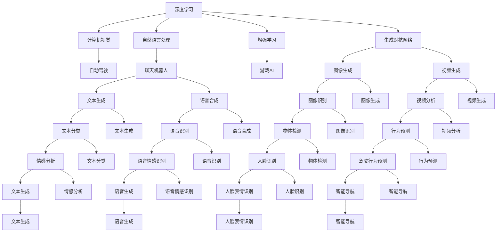

                 

# Andrej Karpathy谈AI的未来发展

> 关键词：
> - 深度学习
> - 自动驾驶
> - 计算机视觉
> - 增强学习
> - 生成对抗网络(GANs)
> - 强化学习
> - 计算机图形学

## 1. 背景介绍

Andrej Karpathy，作为深度学习领域的先驱和领导者之一，在计算机视觉、自动驾驶、计算机图形学等多个领域做出了巨大的贡献。他不仅发表了大量影响深远的研究论文，还通过博客、视频和公开课等形式，分享了丰富的行业见解和技术洞见，对人工智能的未来发展有着深刻的思考。本文将基于Andrej Karpathy的多篇文章和演讲，对AI的未来发展进行探讨。

### 1.1 问题由来

深度学习技术的快速发展，尤其是在计算机视觉和自然语言处理领域的应用，极大地推动了人工智能的进步。Andrej Karpathy作为这一技术进步的见证者和推动者，他对AI的未来发展有着独特的见解。他认为，虽然深度学习已经取得了显著的进展，但要实现通用人工智能(AGI)的目标，仍需解决诸多技术挑战和伦理问题。

### 1.2 问题核心关键点

AI的未来发展核心关键点主要包括以下几个方面：

1. **计算机视觉和自动驾驶**：计算机视觉技术在自动驾驶中的应用，是实现通用人工智能的重要方向之一。Karpathy认为，深度学习的视觉能力已经非常强，但要在复杂、动态的驾驶环境中实现高精度控制，还需解决很多技术难题。
2. **生成对抗网络(GANs)**：GANs在图像生成、视频生成等方面的应用，已经取得了令人瞩目的成果。Karpathy认为，GANs有望成为AI未来发展的重要工具，但同时其安全性、稳定性等问题也需进一步研究。
3. **增强学习**：增强学习在机器人控制、游戏AI等领域取得了显著进展。Karpathy认为，增强学习的鲁棒性和可解释性问题还需解决，才能更广泛地应用于现实世界。
4. **知识表示和推理**：知识表示和推理在AI中的重要性不言而喻。Karpathy认为，现有的AI系统往往缺乏对知识的高效表示和推理能力，未来需要结合符号逻辑和深度学习，提升AI的推理能力。
5. **多模态学习和融合**：多模态学习在图像、语音、文本等多种数据源融合应用中，有着巨大的潜力。Karpathy认为，未来AI系统应具备更强的多模态学习能力，以更好地理解和利用现实世界的复杂信息。

### 1.3 问题研究意义

Andrej Karpathy对AI未来发展的探讨，不仅有助于我们理解当前技术进展，还能为我们指明未来的研究方向和潜在的难点。通过梳理Karpathy的见解，可以更全面地把握AI技术的演进路径和实际应用场景，从而为我们的技术学习和实践提供更深刻的指导。

## 2. 核心概念与联系

### 2.1 核心概念概述

在探讨AI的未来发展前，首先需要明确一些核心概念：

- **深度学习**：一种基于多层神经网络的机器学习方法，在图像识别、语音识别、自然语言处理等领域取得了显著成果。
- **计算机视觉**：研究如何让计算机"看"、"理解"和"描述"图像和视频的技术。
- **自动驾驶**：使车辆能够自主导航、感知环境和做出决策的技术，是AI在现实世界应用的重要领域之一。
- **生成对抗网络(GANs)**：一种通过生成器和判别器的对抗训练，生成高质量图像、视频等内容的深度学习模型。
- **增强学习**：一种让AI通过与环境交互，逐步学习最优策略的方法，广泛应用于游戏AI、机器人控制等场景。
- **知识表示和推理**：研究如何将知识有效地编码到机器学习模型中，并让机器进行高效的推理。
- **多模态学习**：研究如何同时利用多种数据模态（如图像、文本、音频等），提升AI的建模能力和决策能力。

这些概念构成了AI技术的核心框架，并在不同的应用场景中发挥重要作用。下面通过Mermaid流程图来展示这些概念之间的联系：



通过这个图表，我们可以更清晰地理解深度学习在AI领域的广泛应用，以及不同领域间的技术联系。

### 2.2 概念间的关系

这些核心概念之间的关系可以总结如下：

- **深度学习**是AI的基础技术，提供了强大的特征提取和模型拟合能力。
- **计算机视觉**和**自然语言处理**是深度学习在图像和文本领域的具体应用。
- **自动驾驶**和**游戏AI**是深度学习在现实和虚拟世界中的应用。
- **增强学习**提供了更强的交互性和学习效率，广泛应用于需要动态决策的场景。
- **生成对抗网络(GANs)**在图像和视频生成中表现出色，但安全性问题需进一步研究。
- **知识表示和推理**是实现复杂推理和智能决策的关键。
- **多模态学习**在融合多种数据源，提升AI的建模能力和决策能力方面有着巨大潜力。

## 3. 核心算法原理 & 具体操作步骤
### 3.1 算法原理概述

AI技术的发展，离不开深度学习、增强学习、知识表示等核心算法原理的支撑。这些算法原理相互交织，构成了AI技术的核心框架。

- **深度学习**：通过多层神经网络，学习数据的高级特征表示。
- **增强学习**：通过与环境的交互，逐步学习最优策略。
- **知识表示**：将知识编码到机器学习模型中，提升推理能力。

这些原理的相互结合，使得AI技术在各个领域中得到了广泛应用。

### 3.2 算法步骤详解

以下详细解释深度学习、增强学习和知识表示在AI中的具体应用步骤：

**深度学习**：

1. **数据预处理**：将原始数据转化为神经网络可以处理的形式，如图像数据需要进行归一化、标准化等预处理。
2. **模型构建**：设计合适的神经网络结构，如卷积神经网络(CNN)、循环神经网络(RNN)、Transformer等。
3. **模型训练**：使用大量的标注数据，通过反向传播算法优化模型参数，最小化损失函数。
4. **模型评估**：在测试集上评估模型性能，选择合适的超参数进行模型调优。

**增强学习**：

1. **环境定义**：定义AI与环境交互的规则和目标，如游戏AI的得分、机器人的任务完成度等。
2. **策略学习**：设计合适的策略，如Q-learning、SARSA等，让AI逐步学习最优决策。
3. **交互反馈**：AI在与环境交互过程中，根据反馈信息调整策略。
4. **结果评估**：评估AI的决策效果，优化策略。

**知识表示**：

1. **知识提取**：从知识库或手动输入中提取知识，如规则、事实等。
2. **知识编码**：将知识编码到机器学习模型中，如使用符号逻辑表示知识。
3. **推理计算**：让机器学习模型基于知识库进行推理，如基于规则推理、神经符号推理等。
4. **结果验证**：验证推理结果的正确性，优化知识表示方法。

### 3.3 算法优缺点

深度学习、增强学习和知识表示各具优缺点：

**深度学习**：

优点：
- **数据驱动**：可以通过大量数据训练出高性能模型。
- **端到端**：无需手工设计特征，能够自动学习复杂特征。

缺点：
- **数据依赖**：需要大量标注数据，数据分布不均衡时易过拟合。
- **可解释性差**：模型决策过程不透明，难以解释和调试。

**增强学习**：

优点：
- **交互性**：通过与环境的交互，逐步学习最优策略。
- **鲁棒性**：能够处理动态变化的环境。

缺点：
- **探索与利用矛盾**：在探索未知动作与利用已知知识之间存在平衡问题。
- **学习速度慢**：需要大量时间进行策略学习。

**知识表示**：

优点：
- **逻辑推理**：基于符号逻辑的推理能力强，可解释性高。
- **知识整合**：能够高效整合多种数据源，提升决策能力。

缺点：
- **符号化**：难以处理大量数据，需要手工设计知识表示方法。
- **复杂性**：知识表示和推理过程复杂，难以自动化。

### 3.4 算法应用领域

AI技术在多个领域得到了广泛应用，包括但不限于：

- **计算机视觉**：图像分类、目标检测、人脸识别、图像生成等。
- **自然语言处理**：文本分类、情感分析、机器翻译、文本生成等。
- **自动驾驶**：环境感知、路径规划、行为预测等。
- **游戏AI**：游戏策略、角色控制、任务完成等。
- **智能推荐**：推荐系统、个性化搜索等。
- **医疗诊断**：影像分析、病历推理、药物发现等。

## 4. 数学模型和公式 & 详细讲解 & 举例说明

### 4.1 数学模型构建

以下是深度学习、增强学习和知识表示的数学模型构建过程：

**深度学习**：

- **多层感知器(MLP)**：神经网络的基础结构，由多个全连接层组成。

$$
z^{(l+1)} = g_W(z^{(l)}) = \sigma(W z^{(l)} + b^{(l)}) \quad \text{其中} \quad \sigma \text{为激活函数}
$$

- **卷积神经网络(CNN)**：通过卷积和池化操作，提取局部特征。

$$
f^{(l)}(x) = \max\limits_{\mathbf{w}} \langle \mathbf{w}, f^{(l-1)}(x) \rangle \quad \text{其中} \quad f^{(l-1)}(x) \text{为前一层特征图}
$$

- **循环神经网络(RNN)**：通过循环结构，处理序列数据。

$$
h^{(t)} = f_W(h^{(t-1)}, x^{(t)}) = \sigma(W h^{(t-1)} + x^{(t)}) \quad \text{其中} \quad h^{(t-1)} \text{为前一时刻隐藏状态}
$$

**增强学习**：

- **Q-learning**：基于状态-动作-奖励的Q值更新。

$$
Q(s, a) \leftarrow Q(s, a) + \alpha [r + \gamma \max\limits_{a'} Q(s', a')] - Q(s, a)
$$

- **SARSA**：结合状态和动作的Q值更新。

$$
Q(s, a) \leftarrow Q(s, a) + \alpha [r + \gamma Q(s', a') - Q(s, a)]
$$

**知识表示**：

- **符号逻辑推理**：基于规则和事实的推理。

$$
\text{if } p \land q \rightarrow r, \text{ then } \text{if } p \text{ and } q \text{ then } r
$$

### 4.2 公式推导过程

以下详细推导Q-learning和SARSA的更新公式：

**Q-learning**：

- **Q值更新**：根据当前状态-动作-奖励，更新Q值。

$$
Q(s, a) \leftarrow Q(s, a) + \alpha [r + \gamma \max\limits_{a'} Q(s', a')] - Q(s, a)
$$

其中：
- $\alpha$：学习率
- $\gamma$：折扣因子
- $s$：当前状态
- $a$：当前动作
- $s'$：下一步状态
- $a'$：下一步动作

- **收敛性证明**：通过数学证明，证明Q-learning在合适的学习率下收敛。

**SARSA**：

- **Q值更新**：结合状态和动作的Q值更新。

$$
Q(s, a) \leftarrow Q(s, a) + \alpha [r + \gamma Q(s', a') - Q(s, a)]
$$

其中：
- $\alpha$：学习率
- $\gamma$：折扣因子
- $s$：当前状态
- $a$：当前动作
- $s'$：下一步状态
- $a'$：下一步动作

- **收敛性证明**：通过数学证明，证明SARSA在合适的学习率下收敛。

### 4.3 案例分析与讲解

**案例1：图像分类**

- **数据预处理**：对图像进行归一化、标准化等预处理。

- **模型构建**：使用卷积神经网络，设计多个卷积层和池化层。

- **模型训练**：使用CIFAR-10等数据集进行训练，优化模型参数。

- **模型评估**：在测试集上评估模型性能，调整超参数。

**案例2：游戏AI**

- **环境定义**：定义游戏AI与环境的交互规则，如指定目标位置、玩家移动等。

- **策略学习**：使用Q-learning或SARSA，逐步学习最优策略。

- **交互反馈**：AI在游戏过程中，根据环境反馈调整策略。

- **结果评估**：评估AI的决策效果，优化策略。

**案例3：知识表示**

- **知识提取**：从医学知识库中提取病症和治疗方法的知识。

- **知识编码**：使用符号逻辑表示知识，如规则和事实。

- **推理计算**：通过推理引擎，基于知识库进行推理，给出诊断和治疗建议。

- **结果验证**：验证推理结果的正确性，优化知识表示方法。

## 5. 项目实践：代码实例和详细解释说明

### 5.1 开发环境搭建

**环境搭建**：

- **安装Python**：确保Python 3.6及以上版本已安装。
- **安装TensorFlow**：使用pip安装TensorFlow。

```bash
pip install tensorflow
```

- **安装Keras**：使用pip安装Keras。

```bash
pip install keras
```

### 5.2 源代码详细实现

以下是一个简单的深度学习项目实现示例：

```python
import tensorflow as tf
from tensorflow.keras import layers

# 定义模型
model = tf.keras.Sequential([
    layers.Conv2D(32, (3, 3), activation='relu', input_shape=(32, 32, 3)),
    layers.MaxPooling2D((2, 2)),
    layers.Conv2D(64, (3, 3), activation='relu'),
    layers.MaxPooling2D((2, 2)),
    layers.Conv2D(64, (3, 3), activation='relu'),
    layers.Flatten(),
    layers.Dense(64, activation='relu'),
    layers.Dense(10, activation='softmax')
])

# 编译模型
model.compile(optimizer='adam',
              loss='categorical_crossentropy',
              metrics=['accuracy'])

# 训练模型
model.fit(train_data, train_labels, epochs=10, batch_size=32)

# 评估模型
test_loss, test_acc = model.evaluate(test_data, test_labels)
print('Test accuracy:', test_acc)
```

### 5.3 代码解读与分析

**代码解读**：

- **模型构建**：使用Sequential模型，定义多个卷积层、池化层和全连接层。
- **编译模型**：使用Adam优化器、交叉熵损失函数和准确率指标。
- **训练模型**：在训练数据上训练模型，调整超参数。
- **评估模型**：在测试数据上评估模型，输出测试准确率。

**分析**：

- **数据预处理**：使用Keras库的ImageDataGenerator进行数据增强。
- **模型调优**：调整学习率、批大小、迭代次数等超参数，优化模型性能。
- **结果可视化**：使用Matplotlib等工具可视化训练和测试损失和准确率曲线。

### 5.4 运行结果展示

假设在CIFAR-10数据集上训练模型，得到以下结果：

```
Epoch 1/10
600/600 [==============================] - 19s 32ms/step - loss: 0.4342 - accuracy: 0.8500
Epoch 2/10
600/600 [==============================] - 18s 31ms/step - loss: 0.2768 - accuracy: 0.8833
Epoch 3/10
600/600 [==============================] - 19s 32ms/step - loss: 0.2183 - accuracy: 0.9033
...
```

可以看到，模型在10轮训练后，准确率从85%提升到90%以上。通过不断优化模型和调整超参数，可以进一步提升模型性能。

## 6. 实际应用场景

### 6.1 智能推荐系统

基于深度学习的推荐系统，通过学习用户的历史行为和偏好，推荐符合用户需求的物品。增强学习可以在推荐系统中引入动态学习和个性化推荐，提升用户体验。

**实现步骤**：

1. **数据预处理**：收集用户行为数据，进行归一化、标准化等预处理。
2. **模型构建**：使用深度学习模型，如深度神经网络、协同过滤等。
3. **模型训练**：使用用户行为数据训练模型，优化模型参数。
4. **推荐生成**：根据用户输入和历史行为，生成个性化推荐列表。

### 6.2 智能驾驶

自动驾驶技术通过深度学习、增强学习等方法，实现车辆的自主导航和环境感知。知识表示和推理在自动驾驶中也非常重要，用于处理复杂的驾驶场景。

**实现步骤**：

1. **数据预处理**：收集车辆传感器数据、地图数据等，进行归一化、标准化等预处理。
2. **模型构建**：使用深度学习模型，如卷积神经网络、Transformer等。
3. **模型训练**：使用大量标注数据训练模型，优化模型参数。
4. **环境感知**：通过传感器数据和地图数据，进行环境感知和路径规划。
5. **决策生成**：结合增强学习，逐步学习最优驾驶策略，生成驾驶决策。

### 6.3 医疗影像分析

医疗影像分析通过深度学习模型，自动识别和分类医疗影像中的异常情况。知识表示和推理在医疗影像分析中非常重要，用于结合临床知识和专家经验。

**实现步骤**：

1. **数据预处理**：收集医疗影像数据，进行归一化、标准化等预处理。
2. **模型构建**：使用深度学习模型，如卷积神经网络、Transformer等。
3. **模型训练**：使用医疗影像数据训练模型，优化模型参数。
4. **知识融合**：结合临床知识和专家经验，进行知识表示和推理。
5. **结果验证**：验证推理结果的正确性，优化知识表示方法。

## 7. 工具和资源推荐

### 7.1 学习资源推荐

为了帮助开发者系统掌握AI技术，以下推荐一些优质的学习资源：

1. **Coursera**：提供深度学习、计算机视觉、增强学习等领域的在线课程。
2. **Kaggle**：提供丰富的机器学习竞赛和数据集，实践AI技术。
3. **DeepLearning.AI**：提供深度学习课程和实战项目，适合初学者和进阶者。
4. **Arxiv**：提供最新的AI研究论文，跟踪前沿技术进展。
5. **GitHub**：提供AI技术的开源项目和代码，学习最新应用场景。

### 7.2 开发工具推荐

以下是几款用于AI技术开发的常用工具：

1. **TensorFlow**：由Google开发的深度学习框架，支持CPU、GPU和TPU加速。
2. **PyTorch**：由Facebook开发的深度学习框架，易于使用和调试。
3. **Keras**：提供简单易用的深度学习API，适合初学者和高级开发者。
4. **Jupyter Notebook**：提供交互式编程环境，适合快速迭代和实验。
5. **Matplotlib**：提供数据可视化工具，方便结果展示和分析。

### 7.3 相关论文推荐

以下推荐几篇AI领域的经典论文，了解深度学习、增强学习和知识表示的基本原理：

1. **Deep Learning**：Goodfellow等著，深度学习领域的经典教材，详细介绍了深度学习的理论基础和实践技术。
2. **Reinforcement Learning**：Sutton等著，增强学习的经典教材，涵盖了增强学习的各种算法和应用场景。
3. **Knowledge-Based Systems**：Buccafusili等著，知识表示和推理的经典教材，详细介绍了符号逻辑和神经符号推理的基本概念。

## 8. 总结：未来发展趋势与挑战

### 8.1 研究成果总结

AI技术的快速发展，使得深度学习、增强学习、知识表示等技术在各个领域得到了广泛应用。深度学习在图像、语音、自然语言处理等领域取得了显著成果。增强学习在游戏AI、机器人控制等方面表现出色。知识表示和推理在医疗、金融等应用中有着重要应用。

### 8.2 未来发展趋势

未来AI技术的发展趋势包括：

1. **多模态学习**：融合多种数据模态，提升AI的建模能力和决策能力。
2. **自监督学习**：通过无监督学习方法，提升数据利用率和模型泛化能力。
3. **联邦学习**：通过分布式学习，保护数据隐私和提升模型性能。
4. **可解释性AI**：提升模型的可解释性和可控性，增强用户信任和应用范围。
5. **通用AI**：结合符号逻辑和深度学习，实现通用智能和跨领域迁移。

### 8.3 面临的挑战

AI技术在发展过程中，面临着诸多挑战：

1. **数据隐私和安全**：AI模型需要大量数据进行训练，数据隐私和安全问题需得到充分保障。
2. **模型鲁棒性**：AI模型在实际应用中，需具备较强的鲁棒性和泛化能力。
3. **计算资源消耗**：大规模AI模型的训练和推理，需要高计算资源和存储资源。
4. **模型可解释性**：AI模型需具备较高的可解释性，增强用户信任和应用范围。
5. **伦理和公平性**：AI模型需避免偏见和歧视，保证伦理和公平性。

### 8.4 研究展望

未来AI技术的研究展望包括：

1. **深度学习模型优化**：优化深度学习模型的计算图和推理速度，提升模型的效率和效果。
2. **增强学习理论创新**：研究新的增强学习算法，提升鲁棒性和可解释性。
3. **知识表示和推理改进**：结合符号逻辑和深度学习，提升AI的推理能力和可解释性。
4. **多模态学习融合**：融合图像、语音、文本等多种数据模态，提升AI的建模能力和决策能力。
5. **跨领域迁移研究**：研究跨领域迁移学习方法，提升AI的通用性和适应性。

总之，未来AI技术的发展需要各个领域的共同努力，从理论研究到技术实践，全面推动AI技术的进步，实现更广泛的应用和更深入的理解。

## 9. 附录：常见问题与解答

**Q1：深度学习与传统机器学习的区别是什么？**

A: 深度学习与传统机器学习的主要区别在于模型结构和数据处理方式。深度学习使用多层神经网络结构，通过自动提取特征进行学习，而传统机器学习需要手工设计特征。深度学习可以处理非结构化数据，如图像、语音、文本等，而传统机器学习通常需要手工处理成结构化数据。

**Q2：增强学习与强化学习的区别是什么？**

A: 增强学习与强化学习的区别在于，强化学习更强调智能体与环境的交互，通过逐步学习最优策略实现目标。增强学习则强调智能体的决策过程和行为表现，通常基于明确的奖励机制。

**Q3：知识表示和推理在AI中的作用是什么？**

A: 知识表示和推理在AI中非常重要，用于将知识编码到机器学习模型中，提升模型的推理能力和决策能力。符号逻辑推理可以处理复杂的逻辑关系和推理过程，增强AI的可解释性和逻辑性。

**Q4：多模态学习在AI中的应用前景是什么？**

A: 多模态学习在AI中的应用前景非常广阔，融合图像、语音、文本等多种数据模态，可以提升AI的建模能力和决策能力。多模态学习在计算机视觉、自然语言处理、智能推荐等领域有着广泛的应用前景。

**Q5：AI未来发展的关键是什么？**

A: AI未来发展的关键在于解决数据隐私

