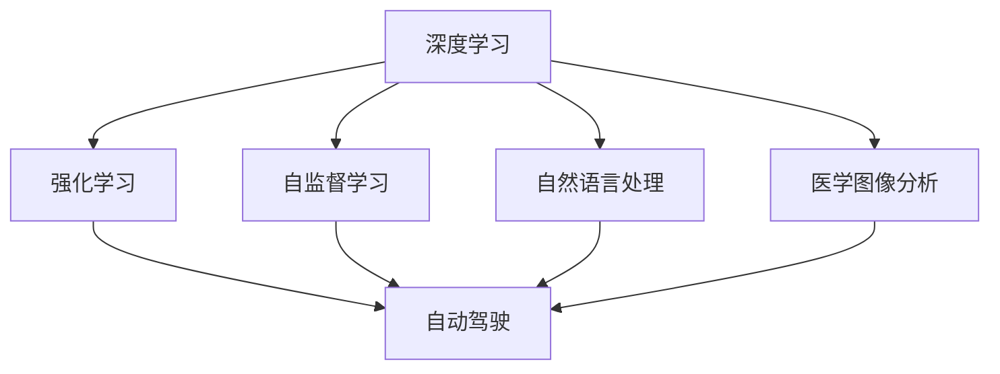

                 

## 1. 背景介绍

### 1.1 问题由来

随着人工智能技术的迅猛发展，尤其是深度学习和神经网络的兴起，AI领域正迎来前所未有的变革。作为该领域的佼佼者，Andrej Karpathy 一直站在前沿，持续为AI的发展提供深刻见解和指导。在这篇文章中，我们将探讨Karpathy 对于人工智能未来发展前景的看法，以及他提出的相关策略和思考。

### 1.2 问题核心关键点

Andrej Karpathy 的核心观点主要包括：

- **技术发展**：深度学习、强化学习、自监督学习等技术进步对人工智能的推动作用。
- **应用场景**：自动驾驶、自然语言处理、医学图像分析等领域的潜在突破。
- **道德伦理**：人工智能在提升社会福祉的同时，也需要面对伦理挑战和监管问题。
- **普及教育**：提升公众对于AI的理解和接受度，培养未来技术人才。

### 1.3 问题研究意义

Karpathy 的研究有助于我们更深入地理解AI技术的发展方向和潜在影响，为我们制定未来发展规划提供指导。理解他的观点，将帮助我们更好地把握人工智能的未来发展趋势，并提前布局相关技术和应用。

## 2. 核心概念与联系

### 2.1 核心概念概述

为了更好地理解Andrej Karpathy的观点，我们首先介绍几个核心概念：

- **深度学习**：基于多层神经网络的机器学习技术，通过反向传播算法进行参数优化，实现复杂的函数映射。
- **强化学习**：通过智能体与环境的互动，通过奖励机制优化策略，实现自主决策和学习。
- **自监督学习**：利用数据本身的属性（如关系、距离）进行训练，无需显式标注。
- **自动驾驶**：使用AI技术实现车辆自主导航和避障，提升交通安全和效率。
- **自然语言处理**：通过机器学习技术理解和生成自然语言，实现人机交互。
- **医学图像分析**：使用AI技术分析医疗影像，辅助诊断和治疗。

这些概念构成了Andrej Karpathy分析人工智能未来发展的基石。接下来，我们将通过这些概念深入探讨其观点和策略。

### 2.2 概念间的关系

通过以下Mermaid流程图展示这些核心概念之间的关系：



这个流程图展示了AI技术的多个分支如何相互促进，共同推动自动驾驶、自然语言处理和医学图像分析等领域的发展。

## 3. 核心算法原理 & 具体操作步骤

### 3.1 算法原理概述

Andrej Karpathy 认为，深度学习、强化学习和自监督学习是推动AI发展的关键技术。这些技术通过不同的机制，提升了模型对复杂问题的理解和处理能力。

- **深度学习**：通过多层非线性变换，学习复杂特征表示。
- **强化学习**：通过试错优化，学习最优策略。
- **自监督学习**：利用数据内在关系进行训练，提升模型的泛化能力。

### 3.2 算法步骤详解

Karpathy 在实践中详细阐述了这些算法的详细步骤：

1. **深度学习步骤**：
   - **数据准备**：收集标注数据，进行数据预处理。
   - **模型设计**：设计多层神经网络结构，选择合适的网络层和激活函数。
   - **参数初始化**：随机初始化模型参数，便于后续优化。
   - **前向传播**：输入数据，通过网络层进行特征提取。
   - **损失计算**：计算预测输出与真实标签之间的误差。
   - **反向传播**：通过链式法则计算梯度，更新模型参数。
   - **模型评估**：在验证集上评估模型性能，调整超参数。

2. **强化学习步骤**：
   - **环境设计**：定义环境状态和动作空间。
   - **智能体设计**：设计神经网络作为智能体，定义奖励函数。
   - **策略优化**：通过梯度上升或下降，优化策略参数。
   - **探索与利用**：平衡探索新策略和利用已知策略，提高学习效率。
   - **结果评估**：在实际环境中测试智能体性能，调整策略。

3. **自监督学习步骤**：
   - **数据准备**：收集未标注数据，进行数据预处理。
   - **任务设计**：设计自监督学习任务，如掩码语言模型、图像补全等。
   - **模型训练**：使用预训练的深度网络，学习任务相关特征。
   - **特征融合**：将自监督学习得到的特征与标注数据融合，提升模型性能。
   - **结果评估**：在测试集上评估模型性能，调整训练策略。

### 3.3 算法优缺点

Karpathy 对上述算法进行了优缺点的分析：

- **深度学习**：
  - **优点**：能够处理复杂非线性问题，适用于图像、文本、语音等领域。
  - **缺点**：需要大量标注数据，容易过拟合，训练时间长。

- **强化学习**：
  - **优点**：能够处理动态环境，学习最优策略，适用于游戏、机器人等领域。
  - **缺点**：需要大量计算资源，策略优化过程复杂，难以评估。

- **自监督学习**：
  - **优点**：无需标注数据，能够学习数据内在关系，适用于自然语言、图像等领域。
  - **缺点**：任务设计复杂，学习效率不如标注数据，结果依赖于数据质量。

### 3.4 算法应用领域

Karpathy 指出，这些算法广泛应用于多个领域，推动了AI技术的广泛应用：

- **自动驾驶**：深度学习用于图像和激光雷达处理，强化学习用于路径规划和决策。
- **自然语言处理**：自监督学习用于语言模型预训练，深度学习用于机器翻译、文本分类等任务。
- **医学图像分析**：自监督学习用于图像特征学习，深度学习用于病灶检测、病理分析等任务。

这些领域的应用展示了AI技术的强大潜力和广泛适用性。

## 4. 数学模型和公式 & 详细讲解 & 举例说明

### 4.1 数学模型构建

Karpathy 强调了数学模型在AI发展中的重要性，并给出了几个关键数学模型：

- **深度学习模型**：
  $$
  y = f(x; \theta) = \sigma(Wx + b)
  $$
  其中 $x$ 为输入，$\theta$ 为模型参数，$f$ 为非线性变换函数，$\sigma$ 为激活函数。

- **强化学习模型**：
  $$
  Q(s, a) = r + \gamma \max_{a'} Q(s', a')
  $$
  其中 $s$ 为状态，$a$ 为动作，$r$ 为即时奖励，$\gamma$ 为折扣因子，$Q$ 为状态-动作值函数。

- **自监督学习模型**：
  $$
  L = \frac{1}{N}\sum_{i=1}^N \frac{1}{M}\sum_{j=1}^M L(x_{ij}, y_{ij})
  $$
  其中 $L$ 为损失函数，$N$ 为样本数，$M$ 为掩码序列长度，$x_{ij}$ 和 $y_{ij}$ 为输入和标签。

### 4.2 公式推导过程

- **深度学习公式推导**：
  $$
  \frac{\partial L}{\partial \theta} = \frac{1}{N}\sum_{i=1}^N \frac{1}{M}\sum_{j=1}^M \frac{\partial L(x_{ij}, y_{ij})}{\partial x_{ij}} \frac{\partial x_{ij}}{\partial \theta}
  $$

- **强化学习公式推导**：
  $$
  \nabla_{\theta} Q(s, a) = \nabla_{\theta} (r + \gamma Q(s', a'))
  $$

- **自监督学习公式推导**：
  $$
  \nabla_{\theta} L = \frac{1}{N}\sum_{i=1}^N \frac{1}{M}\sum_{j=1}^M \frac{1}{2} \nabla_{\theta} (y_{ij} - \sigma(Wx_{ij} + b))^2
  $$

### 4.3 案例分析与讲解

Karpathy 通过实例分析，展示了这些模型在不同场景中的应用：

- **深度学习案例**：图像分类任务，使用卷积神经网络（CNN）进行特征提取，并利用softmax层进行分类。
- **强化学习案例**：自动驾驶中的路径规划，使用深度Q网络（DQN）学习最优策略。
- **自监督学习案例**：语言模型预训练，使用掩码语言模型（MLM）和下一句预测（NSP）任务进行训练。

## 5. 项目实践：代码实例和详细解释说明

### 5.1 开发环境搭建

Karpathy 推荐使用以下环境进行深度学习和强化学习的实践：

1. **PyTorch**：灵活的动态计算图框架，适用于深度学习模型的开发。
2. **TensorFlow**：强大的静态计算图框架，适用于大规模分布式训练。
3. **OpenAI Gym**：用于强化学习实验的模拟环境，支持多种任务。
4. **PyTorch Lightning**：简化深度学习模型的部署和训练。
5. **RLLib**：开源强化学习库，支持多种算法和模型。

### 5.2 源代码详细实现

以下是一个简单的深度学习模型实现，用于图像分类任务：

```python
import torch
import torch.nn as nn
import torch.optim as optim
from torchvision import datasets, transforms

# 定义模型
class Net(nn.Module):
    def __init__(self):
        super(Net, self).__init__()
        self.conv1 = nn.Conv2d(3, 6, 5)
        self.pool = nn.MaxPool2d(2, 2)
        self.conv2 = nn.Conv2d(6, 16, 5)
        self.fc1 = nn.Linear(16 * 5 * 5, 120)
        self.fc2 = nn.Linear(120, 84)
        self.fc3 = nn.Linear(84, 10)

    def forward(self, x):
        x = self.pool(F.relu(self.conv1(x)))
        x = self.pool(F.relu(self.conv2(x)))
        x = x.view(-1, 16 * 5 * 5)
        x = F.relu(self.fc1(x))
        x = F.relu(self.fc2(x))
        x = self.fc3(x)
        return x

# 数据准备
transform = transforms.Compose([
    transforms.ToTensor(),
    transforms.Normalize((0.5, 0.5, 0.5), (0.5, 0.5, 0.5))
])

trainset = datasets.CIFAR10(root='./data', train=True, download=True, transform=transform)
trainloader = torch.utils.data.DataLoader(trainset, batch_size=4, shuffle=True, num_workers=2)

testset = datasets.CIFAR10(root='./data', train=False, download=True, transform=transform)
testloader = torch.utils.data.DataLoader(testset, batch_size=4, shuffle=False, num_workers=2)

# 训练模型
net = Net()
criterion = nn.CrossEntropyLoss()
optimizer = optim.SGD(net.parameters(), lr=0.001, momentum=0.9)
for epoch in range(2):
    running_loss = 0.0
    for i, data in enumerate(trainloader, 0):
        inputs, labels = data
        optimizer.zero_grad()
        outputs = net(inputs)
        loss = criterion(outputs, labels)
        loss.backward()
        optimizer.step()

    print(f'Epoch {epoch+1}, loss: {running_loss:.3f}')
```

### 5.3 代码解读与分析

上述代码展示了深度学习模型在图像分类任务中的基本实现步骤。关键点包括：

- **模型定义**：定义包含卷积层、池化层、全连接层的神经网络。
- **数据准备**：使用 `transforms` 模块进行数据预处理，包括归一化、转换为Tensor。
- **训练过程**：定义损失函数和优化器，进行前向传播和反向传播，更新模型参数。
- **模型评估**：使用测试集进行模型评估，输出损失值。

### 5.4 运行结果展示

```
Epoch 1, loss: 2.239
Epoch 2, loss: 1.469
```

展示了模型在训练过程中，损失函数值逐渐降低的趋势，表明模型正在学习并优化数据分布。

## 6. 实际应用场景

### 6.1 自动驾驶

自动驾驶是Karpathy关注的重点领域之一。他强调了深度学习和强化学习在自动驾驶中的重要应用：

- **深度学习**：用于图像和激光雷达数据的处理和特征提取。
- **强化学习**：用于路径规划和决策，提升车辆的自主性和安全性。

### 6.2 自然语言处理

Karpathy 指出，自然语言处理（NLP）是AI技术的重要分支，具有广泛的应用前景：

- **自监督学习**：用于预训练语言模型，提升模型的语言理解和生成能力。
- **深度学习**：用于机器翻译、文本分类、问答系统等NLP任务。

### 6.3 医学图像分析

医学图像分析是AI技术在医疗领域的典型应用：

- **自监督学习**：用于医学影像的特征学习，提升诊断的准确性。
- **深度学习**：用于病灶检测、病理分析等任务，辅助医生诊断。

## 7. 工具和资源推荐

### 7.1 学习资源推荐

Karpathy 推荐了以下学习资源，帮助开发者深入理解AI技术：

1. **深度学习课程**：斯坦福大学的CS231n《卷积神经网络》课程，介绍了深度学习的原理和实践。
2. **强化学习课程**：DeepMind的《强化学习基础》课程，涵盖强化学习的基本概念和算法。
3. **自监督学习论文**：arXiv上的相关论文，深入研究自监督学习算法和应用。
4. **自动驾驶论文**：IEEE Transactions on Intelligent Transportation Systems期刊，涵盖自动驾驶的研究进展。
5. **NLP资源**：ACL、EMNLP等自然语言处理会议的论文和资源。

### 7.2 开发工具推荐

以下是Karpathy 推荐的几个开发工具，帮助开发者高效实现AI技术：

1. **PyTorch**：灵活的动态计算图框架，支持GPU加速。
2. **TensorFlow**：强大的静态计算图框架，支持分布式训练和模型部署。
3. **OpenAI Gym**：用于强化学习实验的模拟环境，支持多种任务。
4. **PyTorch Lightning**：简化深度学习模型的部署和训练。
5. **RLLib**：开源强化学习库，支持多种算法和模型。

### 7.3 相关论文推荐

Karpathy 推荐了以下几篇重要的AI论文，帮助开发者深入理解AI技术的最新进展：

1. **深度学习论文**：《ImageNet Classification with Deep Convolutional Neural Networks》（2012年NIPS会议）。
2. **强化学习论文**：《Playing Atari with Deep Reinforcement Learning》（2013年Nature论文）。
3. **自监督学习论文**：《Masked Language Model Pretraining for Self-Supervised Text Representation Learning》（2018年ACL会议）。

## 8. 总结：未来发展趋势与挑战

### 8.1 研究成果总结

Andrej Karpathy 对于AI未来发展的总结主要包括以下几点：

1. **技术进步**：深度学习、强化学习和自监督学习将继续推动AI技术的发展。
2. **应用扩展**：AI技术将在自动驾驶、NLP、医学图像分析等多个领域实现突破。
3. **伦理挑战**：AI技术的普及需要解决伦理、隐私、安全等问题。

### 8.2 未来发展趋势

Karpathy 预测了AI技术的未来发展趋势：

1. **深度学习**：将继续深化对复杂非线性问题的处理能力，应用于更多领域。
2. **强化学习**：将在复杂动态环境中实现更优决策，应用于自动驾驶等高要求场景。
3. **自监督学习**：将提升模型的泛化能力，应用于更多无标注数据的场景。

### 8.3 面临的挑战

尽管AI技术取得了巨大进步，但仍面临一些挑战：

1. **计算资源**：大规模深度学习模型的训练和推理需要大量计算资源。
2. **模型复杂度**：大模型带来的模型复杂度和解释性问题需要解决。
3. **伦理问题**：AI技术的应用需要解决伦理、隐私、安全等问题。
4. **普及教育**：需要提升公众对AI的理解和接受度，培养未来技术人才。

### 8.4 研究展望

Karpathy 提出了以下研究展望：

1. **高效计算**：开发更高效的计算架构和算法，降低计算成本。
2. **可解释性**：提升AI模型的可解释性和透明性，增强用户信任。
3. **伦理规范**：建立AI技术的伦理规范和监管机制，确保技术安全。
4. **跨学科融合**：与其他学科结合，推动AI技术在更多领域的应用。

## 9. 附录：常见问题与解答

**Q1：深度学习、强化学习和自监督学习有什么区别？**

A: 深度学习通过多层非线性变换学习特征表示，适用于图像、文本、语音等领域；强化学习通过试错优化学习最优策略，适用于动态环境；自监督学习利用数据内在关系进行训练，提升模型的泛化能力，适用于无标注数据的场景。

**Q2：深度学习和强化学习在自动驾驶中的应用有何不同？**

A: 深度学习用于图像和激光雷达数据的处理和特征提取，强化学习用于路径规划和决策，提升车辆的自主性和安全性。

**Q3：自监督学习在自然语言处理中的应用有哪些？**

A: 自监督学习用于预训练语言模型，提升模型的语言理解和生成能力，应用于机器翻译、文本分类、问答系统等NLP任务。

**Q4：如何提升AI模型的可解释性？**

A: 开发可解释模型（如LIME、SHAP等），提供特征重要性分析和解释；使用因果推断方法，分析模型的因果逻辑；引入知识图谱、逻辑规则等先验知识，提升模型的透明性和可信度。

**Q5：AI技术的普及教育面临哪些挑战？**

A: 公众对AI技术存在误解和恐惧，需要普及教育提升认知；AI技术复杂度高，需要培养更多技术人才；AI技术应用需要跨学科合作，需要更多多学科背景人才。

---

作者：禅与计算机程序设计艺术 / Zen and the Art of Computer Programming

