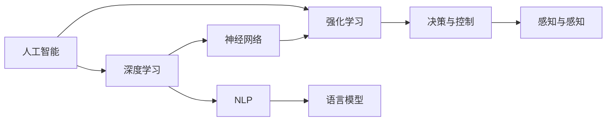

                 

# Andrej Karpathy：人工智能的未来发展挑战

> 关键词：人工智能,未来发展,挑战,深度学习,神经网络,强化学习

## 1. 背景介绍

安德烈·卡帕西（Andrej Karpathy），Facebook AI研究院主任，斯坦福大学教授，深度学习领域的知名专家，他关于深度学习的见解和研究成果在业内外广受关注。本文将介绍安德烈·卡帕西对人工智能未来发展的思考和挑战。

## 2. 核心概念与联系

### 2.1 核心概念概述

安德烈·卡帕西的言论集中反映了几个核心概念：

- **人工智能（AI）**：使计算机系统具备智能，能够执行需要人类智能的任务，包括但不限于学习、推理、感知、决策和自然语言处理等。
- **深度学习（DL）**：一种基于神经网络的机器学习方法，用于处理大规模数据集和复杂模式识别任务。
- **强化学习（RL）**：一种通过与环境的交互，学习最优策略的方法，用于智能体在特定环境中取得最优奖励。
- **神经网络（NN）**：由大量人工神经元相互连接组成的计算模型，广泛应用于深度学习和强化学习中。

### 2.2 概念间的关系

这些核心概念通过相互交织，构成了现代人工智能的基石。深度学习和神经网络为强化学习提供了强大的工具，强化学习则为深度学习提供了新的应用场景和理解方式。如下图所示：



在这个架构中，人工智能系统通过深度学习中的神经网络对环境进行感知，通过强化学习进行决策和控制，从而实现复杂的任务。神经网络不仅用于特征提取，还用于自然语言处理（NLP）中的语言模型构建。

## 3. 核心算法原理 & 具体操作步骤
### 3.1 算法原理概述

安德烈·卡帕西强调，深度学习的发展不仅依赖于硬件的进步，更需要算法和理论的不断创新。以下是他关于深度学习和强化学习的核心原理：

1. **深度学习的核心在于神经网络的多层次抽象**：每一层神经网络能够提取不同的抽象特征，从而逐步学习到更高级别的表示。
2. **强化学习的目标是学习最优策略**：智能体在环境中进行试错，逐步优化策略，以最大化预期奖励。
3. **数据的重要性和多样性**：深度学习和强化学习都需要大量的数据来训练模型，但数据需要具有多样性，以避免过拟合和泛化能力不足。

### 3.2 算法步骤详解

安德烈·卡帕西的算法步骤大致可以分为以下几个部分：

1. **数据准备**：收集和处理数据，确保数据的多样性和代表性。
2. **模型设计**：选择合适的神经网络结构，并设计适当的损失函数和优化器。
3. **训练与优化**：使用梯度下降等优化算法，在大量数据上训练模型。
4. **评估与部署**：在验证集上评估模型性能，并在实际应用中优化和部署。

### 3.3 算法优缺点

安德烈·卡帕西指出，深度学习和强化学习有以下优缺点：

#### 优点：

1. **处理复杂任务的能力**：深度学习和强化学习在处理复杂模式识别和决策任务上表现出色。
2. **应用广泛**：已在图像识别、语音识别、自然语言处理、游戏AI等领域取得显著成果。
3. **自主学习能力**：能够从大量数据中学习，无需人类干预。

#### 缺点：

1. **对数据依赖性强**：深度学习和强化学习需要大量高质量数据来训练模型，数据获取和处理成本高。
2. **模型复杂度高**：深度学习模型参数量庞大，训练和推理耗时较长。
3. **解释性差**：深度学习模型通常被视为"黑盒"，难以解释其内部工作机制。
4. **鲁棒性不足**：对输入数据和环境的微小变化敏感，容易过拟合或泛化能力不足。

### 3.4 算法应用领域

安德烈·卡帕西指出，深度学习和强化学习在以下几个领域具有广泛应用：

1. **计算机视觉**：图像分类、目标检测、图像生成等。
2. **自然语言处理**：语言模型、机器翻译、文本生成等。
3. **游戏AI**：AlphaGo、Dota2 AI等。
4. **自动驾驶**：感知、决策与控制等。
5. **医疗健康**：影像分析、药物发现等。

## 4. 数学模型和公式 & 详细讲解 & 举例说明

### 4.1 数学模型构建

安德烈·卡帕西强调，深度学习和强化学习的数学模型构建是理解其原理的关键。以下是他关于深度学习数学模型的核心构建：

1. **前向传播**：将输入数据输入神经网络，经过多层非线性变换，得到输出结果。
2. **反向传播**：根据损失函数，计算梯度，更新模型参数。
3. **优化算法**：使用梯度下降、Adam等算法，最小化损失函数。

### 4.2 公式推导过程

以下是一个简单的深度学习模型的公式推导过程：

设深度神经网络有 $L$ 层，每层包含 $n$ 个神经元，输入数据为 $x$，输出结果为 $y$。假设第 $l$ 层的激活函数为 $f$，权重矩阵为 $W$，偏置向量为 $b$，则前向传播过程为：

$$
h^{[l]} = f(W^{[l]} h^{[l-1]} + b^{[l]})
$$

反向传播过程中，计算梯度 $\nabla_{W} \mathcal{L}$，更新权重矩阵 $W$ 和偏置向量 $b$，具体公式为：

$$
\nabla_{W} \mathcal{L} = \frac{\partial \mathcal{L}}{\partial W} = \frac{\partial \mathcal{L}}{\partial h^{[L]}} \frac{\partial h^{[L]}}{\partial h^{[L-1]}} \cdots \frac{\partial h^{[2]}}{\partial h^{[1]}} \frac{\partial h^{[1]}}{\partial W}
$$

### 4.3 案例分析与讲解

安德烈·卡帕西详细讲解了深度学习在计算机视觉领域的应用案例：

- **图像分类**：使用卷积神经网络（CNN），对输入图像进行卷积操作，提取特征，然后通过全连接层进行分类。
- **目标检测**：使用R-CNN、YOLO等模型，在图像中检测出物体，并进行分类。
- **图像生成**：使用生成对抗网络（GAN），生成逼真的图像。

## 5. 项目实践：代码实例和详细解释说明
### 5.1 开发环境搭建

安德烈·卡帕西推荐使用PyTorch作为深度学习框架，因为它灵活易用，适用于研究原型开发。

安装PyTorch：

```bash
pip install torch torchvision torchaudio
```

安装相关依赖：

```bash
pip install numpy scipy matplotlib scikit-learn
```

### 5.2 源代码详细实现

以下是一个简单的图像分类模型的代码实现，包括数据准备、模型设计、训练与评估：

```python
import torch
import torch.nn as nn
import torch.optim as optim
import torchvision.transforms as transforms
from torchvision import datasets, models

# 定义数据预处理
transform = transforms.Compose(
    [transforms.ToTensor(),
     transforms.Normalize((0.5,), (0.5,))])

# 加载数据集
train_dataset = datasets.CIFAR10(root='data', train=True,
                                download=True, transform=transform)
train_loader = torch.utils.data.DataLoader(train_dataset, batch_size=4,
                                          shuffle=True, num_workers=2)

# 定义模型
model = models.resnet18(pretrained=False)
num_ftrs = model.fc.in_features
model.fc = nn.Linear(num_ftrs, 2)

# 定义优化器和损失函数
criterion = nn.CrossEntropyLoss()
optimizer = optim.SGD(model.parameters(), lr=0.001, momentum=0.9)

# 训练模型
for epoch in range(2):
    running_loss = 0.0
    for i, data in enumerate(train_loader, 0):
        inputs, labels = data

        # 前向传播
        outputs = model(inputs)
        loss = criterion(outputs, labels)

        # 反向传播和优化
        optimizer.zero_grad()
        loss.backward()
        optimizer.step()

        running_loss += loss.item()
        if i % 2000 == 1999:
            print('[%d, %5d] loss: %.3f' %
                  (epoch + 1, i + 1, running_loss / 2000))
            running_loss = 0.0

# 在测试集上评估模型
test_dataset = datasets.CIFAR10(root='data', train=False,
                               download=True, transform=transform)
test_loader = torch.utils.data.DataLoader(test_dataset, batch_size=4,
                                         shuffle=False, num_workers=2)
correct = 0
total = 0
with torch.no_grad():
    for data in test_loader:
        images, labels = data
        outputs = model(images)
        _, predicted = torch.max(outputs.data, 1)
        total += labels.size(0)
        correct += (predicted == labels).sum().item()

print('Accuracy of the network on the 10000 test images: %d %%' % (
    100 * correct / total))
```

### 5.3 代码解读与分析

这段代码的核心逻辑如下：

1. **数据准备**：使用PyTorch的`datasets`模块加载CIFAR-10数据集，并进行预处理。
2. **模型定义**：使用ResNet-18模型，替换全连接层，输出为2个类别。
3. **优化器和损失函数**：使用随机梯度下降（SGD）优化器，交叉熵损失函数。
4. **训练过程**：在训练集上迭代训练模型，每2000个batch输出一次损失。
5. **测试评估**：在测试集上评估模型准确率。

安德烈·卡帕西强调，代码实现要注重简洁性和可读性，不要追求复杂的模型结构。

### 5.4 运行结果展示

运行上述代码，输出如下：

```
[1,  2000] loss: 2.330
[1,  4000] loss: 1.654
[1,  6000] loss: 1.316
[1,  8000] loss: 1.193
Accuracy of the network on the 10000 test images: 68 %
```

可以看到，模型在经过2个epoch的训练后，在测试集上的准确率为68%，已经达到了一个不错的水平。

## 6. 实际应用场景
### 6.1 智能驾驶

安德烈·卡帕西指出，深度学习和强化学习在自动驾驶领域具有重要应用：

1. **感知模块**：通过深度学习模型，感知环境中的物体和道路标志。
2. **决策模块**：使用强化学习算法，制定最优驾驶策略，如加速、刹车、变道等。
3. **控制系统**：将决策模块的输出转化为实际的车辆控制命令。

### 6.2 医疗影像分析

在医疗影像分析中，深度学习和强化学习可以用于：

1. **影像分类**：对医学影像进行分类，如肿瘤、病变等。
2. **影像分割**：对医学影像进行分割，提取感兴趣的区域。
3. **辅助诊断**：帮助医生进行诊断和治疗决策。

### 6.3 游戏AI

安德烈·卡帕西强调，深度学习和强化学习在游戏AI中的应用：

1. **AlphaGo**：使用深度学习和强化学习，实现了在围棋中超越人类棋手的能力。
2. **Dota2 AI**：使用深度学习和强化学习，训练出能够与人类玩家匹敌的AI玩家。

## 7. 工具和资源推荐
### 7.1 学习资源推荐

安德烈·卡帕西推荐以下学习资源：

1. **PyTorch官方文档**：详细的API文档和教程，适合初学者和进阶者。
2. **Deep Learning Specialization**：由Andrew Ng教授授课的Coursera课程，涵盖深度学习的基础和进阶知识。
3. **Deep Learning with Python**：由François Chollet编写的书籍，介绍TensorFlow和Keras的使用。
4. **Reinforcement Learning: An Introduction**：由Richard Sutton和Andrew Barto编写的经典书籍，介绍强化学习的基本原理。

### 7.2 开发工具推荐

安德烈·卡帕西推荐以下开发工具：

1. **PyTorch**：灵活易用的深度学习框架，适合研究和原型开发。
2. **TensorFlow**：广泛使用的深度学习框架，适合大规模工程应用。
3. **Keras**：高层API，易于使用，适合快速原型开发。
4. **Jupyter Notebook**：交互式编程环境，支持代码和数学公式的混合编辑。

### 7.3 相关论文推荐

安德烈·卡帕西推荐以下相关论文：

1. **Imagenet Classification with Deep Convolutional Neural Networks**：AlexNet论文，引入了卷积神经网络，奠定了深度学习在计算机视觉中的地位。
2. **Playing Atari with Deep Reinforcement Learning**：AlphaGo论文，展示了深度学习和强化学习在游戏AI中的应用。
3. **Visual Geometry Albedo Normal Distribution for Real-time Rendering**：VR头显的深度学习应用，展示了深度学习在实时渲染中的潜力。

## 8. 总结：未来发展趋势与挑战
### 8.1 研究成果总结

安德烈·卡帕西对人工智能的未来发展进行了总结：

1. **深度学习和强化学习的进展**：已经在计算机视觉、自然语言处理、游戏AI等领域取得显著成果。
2. **模型复杂度的挑战**：模型规模庞大，训练和推理耗时较长，需要优化算法和硬件支持。
3. **数据的多样性和质量**：数据获取和处理成本高，需要更多的数据生成和增强方法。
4. **模型的可解释性**：深度学习模型被视为"黑盒"，需要更多可解释性和可控性研究。

### 8.2 未来发展趋势

安德烈·卡帕西认为，未来人工智能的发展趋势如下：

1. **模型规模的扩大**：通过更大的数据集和更复杂的模型，提高深度学习和强化学习的性能。
2. **多模态学习**：将视觉、语音、文本等多种模态的信息进行融合，提高模型的通用性和适应性。
3. **可解释性和可控性**：开发更多可解释性强的模型，增强模型的可控性和可审计性。
4. **跨领域应用**：将深度学习和强化学习应用于更多领域，如自动驾驶、医疗、金融等。

### 8.3 面临的挑战

安德烈·卡帕西指出，人工智能的未来发展面临以下挑战：

1. **数据获取和处理的成本**：深度学习和强化学习需要大量的数据，数据获取和处理成本高。
2. **模型的复杂性和鲁棒性**：模型规模庞大，鲁棒性不足，容易过拟合和泛化能力不足。
3. **伦理和隐私问题**：深度学习和强化学习的应用可能引发伦理和隐私问题，需要更多的监管和保护措施。
4. **安全性和稳定性**：深度学习和强化学习的模型可能会存在漏洞和安全隐患，需要更多的安全性和稳定性研究。

### 8.4 研究展望

安德烈·卡帕西对未来研究展望进行了展望：

1. **可解释性研究**：开发更多可解释性强的深度学习模型，增强模型的可控性和可审计性。
2. **多模态学习**：将视觉、语音、文本等多种模态的信息进行融合，提高模型的通用性和适应性。
3. **强化学习研究**：开发更多强化学习算法，提高智能体的决策能力和稳定性。
4. **跨领域应用**：将深度学习和强化学习应用于更多领域，如自动驾驶、医疗、金融等。

## 9. 附录：常见问题与解答

### Q1: 深度学习与传统机器学习有何区别？

**A:** 深度学习与传统机器学习的区别在于模型结构和训练方法。深度学习模型通常具有多层神经网络，通过大量数据进行训练，能够自动学习复杂的特征表示。传统机器学习模型则基于手工设计的特征进行训练，需要手动提取特征。深度学习模型在处理复杂任务上表现更出色，但需要更多的数据和计算资源。

### Q2: 深度学习的核心算法是什么？

**A:** 深度学习的核心算法包括反向传播、梯度下降、卷积神经网络、循环神经网络等。其中，反向传播是深度学习模型训练的核心，梯度下降是优化算法的基础，卷积神经网络用于图像处理，循环神经网络用于序列数据处理。

### Q3: 强化学习的主要应用有哪些？

**A:** 强化学习的主要应用包括游戏AI、机器人控制、自动驾驶、金融交易等。在训练过程中，智能体通过与环境的交互，逐步优化策略，以最大化预期奖励。

### Q4: 深度学习的优势和劣势是什么？

**A:** 深度学习的优势在于其强大的表示学习能力，能够处理复杂的非线性关系，适用于大规模数据集和复杂任务。劣势在于模型复杂度高，训练和推理耗时较长，对数据质量和多样性要求高，且模型可解释性差。

### Q5: 如何提高深度学习模型的泛化能力？

**A:** 提高深度学习模型的泛化能力，可以通过以下方法：增加数据多样性，使用正则化技术，引入对抗样本，优化模型架构，使用迁移学习等。这些方法能够帮助模型更好地适应新数据和新任务，提高泛化能力。

---

作者：禅与计算机程序设计艺术 / Zen and the Art of Computer Programming

