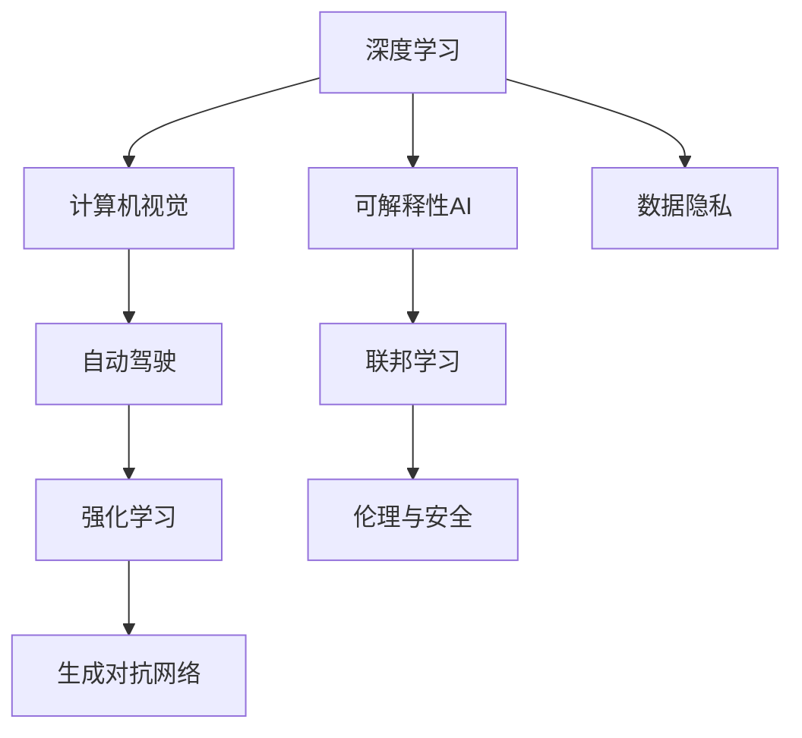

                 

# Andrej Karpathy：人工智能的未来发展方向

> 关键词：人工智能, 未来发展, 深度学习, 计算机视觉, 自动驾驶, 生成对抗网络, 强化学习, 可解释性, 联邦学习, 伦理与安全

## 1. 背景介绍

### 1.1 问题由来

Andrej Karpathy，作为斯坦福大学的计算机科学家和人工智能专家，在计算机视觉和自动驾驶等领域有着举世瞩目的贡献。他的研究跨越了多个前沿领域，包括深度学习、生成对抗网络（GANs）、强化学习以及人工智能的伦理与安全等。本文将深入探讨Karpathy对人工智能未来发展的独到见解，分析其重要观点和理论，并与读者共同展望AI的未来方向。

### 1.2 问题核心关键点

Karpathy的研究集中在以下几个关键点上：

- **深度学习与计算机视觉**：Karpathy对深度学习算法在图像和视频处理中的应用进行了大量探索，尤其是在自监督学习和迁移学习等方面，提出了许多创新算法。
- **自动驾驶与强化学习**：Karpathy在自动驾驶领域的研究中，利用强化学习算法，使得自动驾驶车辆能够在复杂环境下安全行驶。
- **生成对抗网络与创造力**：Karpathy将GANs应用于图像生成和艺术创作中，探索了生成对抗网络在创造力方面的潜力。
- **可解释性AI**：Karpathy强调了可解释性AI的重要性，认为AI系统需要具备透明的决策过程，以增强可信度。
- **联邦学习与数据隐私**：Karpathy提出了联邦学习模型，旨在保护数据隐私的同时，提升模型性能。
- **伦理与安全性**：Karpathy对AI的伦理与安全问题有着深刻的见解，强调在技术发展的同时，必须关注其潜在的风险和负面影响。

### 1.3 问题研究意义

深入理解Karpathy的研究内容和未来发展方向，对于把握人工智能的最新动态和趋势具有重要意义：

1. **技术创新**：Karpathy的研究推动了许多关键技术的突破，如自动驾驶、计算机视觉等领域的技术革新。
2. **应用拓展**：他的工作为人工智能技术在更多行业的应用提供了参考，如医疗、金融、教育等。
3. **理论基础**：Karpathy的理论研究为后续研究者提供了坚实的理论基础，促进了整个领域的进步。
4. **伦理与安全**：他对AI伦理和安全的关注，帮助行业和社会更好地应对AI技术带来的挑战。

## 2. 核心概念与联系

### 2.1 核心概念概述

在探讨未来发展方向之前，首先需要理解Karpathy所强调的几个核心概念：

- **深度学习**：一种基于神经网络的机器学习算法，用于处理大规模数据，并从中学习模式和规律。
- **计算机视觉**：使计算机能够理解、分析和处理视觉信息，如图像和视频。
- **自动驾驶**：利用计算机视觉和深度学习技术，实现无人驾驶汽车的自主导航和决策。
- **生成对抗网络（GANs）**：一种机器学习模型，用于生成逼真的人工图像、视频和音频等。
- **强化学习**：通过与环境的互动，学习最优策略的机器学习技术。
- **可解释性AI**：AI系统需要具备可解释性，以便人类理解其决策过程。
- **联邦学习**：一种分布式机器学习技术，允许多台设备在不共享数据的前提下进行联合训练。
- **伦理与安全**：AI技术应用过程中必须考虑其对社会的影响，确保其安全性与伦理合法性。

### 2.2 概念间的关系

这些核心概念之间有着紧密的联系，形成了一个相互依存、相互促进的体系：

- **深度学习与计算机视觉**：深度学习算法为计算机视觉任务提供了强大的模型，如卷积神经网络（CNNs）。
- **自动驾驶与强化学习**：自动驾驶技术需要强化学习来优化驾驶策略，使其在复杂环境下作出正确决策。
- **生成对抗网络与创造力**：GANs能够生成逼真的图像和视频，为艺术创作和娱乐产业带来了新的可能。
- **可解释性AI与伦理与安全**：可解释性AI帮助确保系统的透明性，避免伦理问题和技术滥用。
- **联邦学习与数据隐私**：联邦学习通过分布式训练保护了数据隐私，同时提升了模型性能。
- **伦理与安全**：在技术发展的同时，必须考虑其对社会的影响，确保技术应用的安全和道德规范。

这些概念共同构成了Karpathy对人工智能未来发展的整体构想，将深度学习、计算机视觉、自动驾驶等前沿技术紧密结合，为AI的未来发展指明了方向。

### 2.3 核心概念的整体架构

我们通过以下Mermaid流程图，展示了Karpathy研究的核心概念之间的关系：



这个流程图展示了深度学习与其他核心概念之间的联系，以及联邦学习在保护数据隐私方面的作用，伦理与安全在整体架构中的重要性。

## 3. 核心算法原理 & 具体操作步骤

### 3.1 算法原理概述

Karpathy的研究涵盖了许多核心算法原理，以下是对其中几个关键算法的简要概述：

- **深度学习与计算机视觉**：利用卷积神经网络（CNNs）和自监督学习方法，使得计算机能够从图像和视频中学习到丰富的特征。
- **自动驾驶与强化学习**：通过基于奖励机制的强化学习算法，训练自动驾驶车辆在复杂环境下做出最优决策。
- **生成对抗网络（GANs）**：结合生成器和判别器网络，学习生成逼真的图像和视频，应用于艺术创作和娱乐产业。
- **可解释性AI**：通过LIME（Local Interpretable Model-agnostic Explanations）等技术，增强AI系统的可解释性。
- **联邦学习**：利用分布式训练，各设备保留本地数据，通过通信协议更新模型参数，保护数据隐私。

### 3.2 算法步骤详解

以下是Karpathy研究中几个关键算法的详细步骤：

#### 3.2.1 深度学习与计算机视觉

**步骤1：数据预处理**  
收集大规模的图像和视频数据集，并进行预处理，如图像归一化、数据增强等。

**步骤2：模型训练**  
使用CNNs对预处理后的数据进行训练，通过反向传播算法优化模型参数，最小化损失函数。

**步骤3：模型评估**  
在测试集上评估模型的性能，如准确率、召回率等指标，进行模型调优。

**步骤4：模型应用**  
将训练好的模型应用于实际问题中，如图像分类、目标检测等。

#### 3.2.2 自动驾驶与强化学习

**步骤1：环境建模**  
利用传感器数据构建环境模型，包括地图、车道线、交通标志等。

**步骤2：策略学习**  
定义状态空间和动作空间，设计奖励函数，通过强化学习算法优化驾驶策略。

**步骤3：模型评估**  
在仿真环境和实际道路测试模型的性能，确保其在复杂环境下的安全性和鲁棒性。

**步骤4：模型部署**  
将训练好的模型部署到自动驾驶车辆中，进行实时决策和控制。

#### 3.2.3 生成对抗网络（GANs）

**步骤1：数据准备**  
收集高质量的图像和视频数据，用于训练GANs。

**步骤2：生成器与判别器训练**  
同时训练生成器和判别器，通过对抗性训练，提高生成器生成图像的质量。

**步骤3：生成样本**  
使用训练好的生成器生成逼真的图像和视频，应用于艺术创作和娱乐产业。

**步骤4：优化调整**  
根据生成结果的反馈，不断调整生成器和判别器的参数，提升生成质量。

#### 3.2.4 可解释性AI

**步骤1：选择可解释性技术**  
选择适当的可解释性技术，如LIME、SHAP等。

**步骤2：模型训练与解释**  
在训练过程中，使用可解释性技术记录模型的决策过程。

**步骤3：结果分析**  
分析模型的解释结果，确保其决策过程透明、可信。

**步骤4：模型优化**  
根据解释结果，优化模型参数，提高模型性能和可解释性。

#### 3.2.5 联邦学习

**步骤1：分布式训练**  
各设备保留本地数据，使用通信协议更新模型参数。

**步骤2：本地训练**  
在本地设备上训练模型，优化参数。

**步骤3：模型聚合**  
定期在中心服务器上聚合模型参数，更新全局模型。

**步骤4：模型应用**  
在各个设备上部署全局模型，提升模型性能。

### 3.3 算法优缺点

Karpathy的研究算法具有以下优点：

- **高效性**：利用深度学习和大规模数据训练，能够快速提升模型性能。
- **鲁棒性**：通过强化学习和联邦学习，提升了模型在复杂环境下的鲁棒性和泛化能力。
- **可解释性**：可解释性AI技术增强了模型的透明性和可信度。
- **安全性**：联邦学习保护了数据隐私，确保了技术的安全性。

同时，这些算法也存在一些缺点：

- **计算资源消耗大**：大规模数据和深度学习模型的训练需要大量的计算资源。
- **数据依赖**：模型性能高度依赖于训练数据的质量和数量。
- **伦理问题**：模型决策过程的透明性不足，可能引发伦理问题。
- **模型复杂性**：复杂的模型结构增加了训练和调优的难度。

### 3.4 算法应用领域

Karpathy的研究算法广泛应用于以下几个领域：

- **计算机视觉**：如图像分类、目标检测、图像生成等。
- **自动驾驶**：自动驾驶车辆导航、决策和控制。
- **娱乐产业**：虚拟现实、增强现实、艺术创作等。
- **医疗领域**：医学影像分析、疾病预测等。
- **金融领域**：风险评估、信用评分等。

## 4. 数学模型和公式 & 详细讲解 & 举例说明

### 4.1 数学模型构建

Karpathy的研究涵盖了多个数学模型，以下是对其中几个关键模型的简要构建：

#### 4.1.1 卷积神经网络（CNNs）

**模型构建**：
- **输入层**：输入图像数据，大小为 $H \times W \times C$。
- **卷积层**：利用卷积核提取特征，输出大小为 $H' \times W' \times F$。
- **池化层**：对特征图进行下采样，减小尺寸。
- **全连接层**：将池化层的输出映射到类别概率，进行分类。

#### 4.1.2 强化学习

**模型构建**：
- **状态空间**：描述环境状态，如车道位置、交通灯状态等。
- **动作空间**：描述可执行的动作，如加速、减速、转向等。
- **奖励函数**：定义动作的奖励，如避障、到达目的地等。
- **策略**：定义如何选择动作，如Q-learning、Deep Q-Network等。

#### 4.1.3 生成对抗网络（GANs）

**模型构建**：
- **生成器**：学习生成逼真的图像，输入为随机噪声，输出为图像。
- **判别器**：学习区分真实图像和生成图像，输入为图像，输出为真实性概率。
- **对抗性训练**：生成器通过优化生成器损失和判别器损失，生成逼真的图像。

### 4.2 公式推导过程

以下是Karpathy研究中几个关键算法的公式推导：

#### 4.2.1 卷积神经网络（CNNs）

**公式推导**：
- **卷积层**：$X_{conv} = X_{in} * W_{conv} + b_{conv}$，其中 $X_{conv}$ 为输出特征图，$X_{in}$ 为输入特征图，$W_{conv}$ 为卷积核，$b_{conv}$ 为偏置。
- **池化层**：$X_{pool} = max(X_{conv})$，其中 $X_{pool}$ 为池化后的特征图。
- **全连接层**：$Y = X_{pool}W + b$，其中 $Y$ 为输出类别概率，$X_{pool}$ 为池化层输出，$W$ 为全连接层权重，$b$ 为偏置。

#### 4.2.2 强化学习

**公式推导**：
- **状态转移概率**：$P(s'|s,a) = \mathcal{T}(s,a,s')$，其中 $s$ 为当前状态，$a$ 为动作，$s'$ 为下一个状态。
- **动作价值**：$Q(s,a) = r + \gamma \mathbb{E}_{s'}[Q(s',a')]$，其中 $Q(s,a)$ 为状态-动作价值，$r$ 为即时奖励，$\gamma$ 为折扣因子。
- **策略**：$\pi(a|s) = \frac{\exp(Q(s,a)/\tau)}{\sum_{a'}\exp(Q(s,a')/\tau)}$，其中 $\pi(a|s)$ 为策略，$\tau$ 为温度参数。

#### 4.2.3 生成对抗网络（GANs）

**公式推导**：
- **生成器损失**：$L_G = -\mathbb{E}_{x \sim P_x}[\log D(x)] - \mathbb{E}_{z \sim P_z}[\log(1-D(G(z)))]$，其中 $L_G$ 为生成器损失，$x$ 为真实图像，$z$ 为随机噪声，$D$ 为判别器。
- **判别器损失**：$L_D = -\mathbb{E}_{x \sim P_x}[\log D(x)] - \mathbb{E}_{z \sim P_z}[\log(1-D(G(z)))]$，其中 $L_D$ 为判别器损失，$x$ 为真实图像，$z$ 为随机噪声，$G$ 为生成器。
- **对抗性训练**：通过交替优化生成器和判别器，生成逼真的图像。

### 4.3 案例分析与讲解

以下是Karpathy研究中几个关键算法的案例分析：

#### 4.3.1 卷积神经网络（CNNs）

**案例**：医学影像分类
- **数据集**：收集大量的医学影像数据，如X光片、CT扫描等。
- **模型**：使用ResNet、Inception等CNNs模型，进行图像分类。
- **效果**：显著提升了医学影像的分类准确率，辅助医生进行诊断。

#### 4.3.2 强化学习

**案例**：自动驾驶
- **环境**：构建虚拟环境和真实道路环境，用于测试自动驾驶模型。
- **策略**：使用Deep Q-Network等算法，训练自动驾驶策略。
- **效果**：在虚拟和真实环境中，实现了高效、安全的自动驾驶。

#### 4.3.3 生成对抗网络（GANs）

**案例**：虚拟现实
- **数据集**：收集高分辨率的3D模型数据，用于训练GANs。
- **模型**：使用CycleGAN、StyleGAN等模型，生成逼真的3D图像。
- **效果**：应用于虚拟现实游戏、教育等，提升用户体验。

## 5. 项目实践：代码实例和详细解释说明

### 5.1 开发环境搭建

在开始项目实践之前，需要搭建好开发环境。以下是具体的搭建步骤：

1. **安装Python**：确保Python版本为3.7或更高版本，使用Anaconda安装。
2. **创建虚拟环境**：使用conda创建虚拟环境，例如：
   ```bash
   conda create --name myenv python=3.7
   conda activate myenv
   ```
3. **安装必要的库**：
   ```bash
   pip install torch torchvision numpy scipy matplotlib pandas sklearn
   ```
4. **安装TensorFlow和Keras**：
   ```bash
   pip install tensorflow==2.5.0 keras==2.5.0
   ```
5. **安装Keras Tuner**：用于超参数优化：
   ```bash
   pip install keras-tuner==2.3.0
   ```

### 5.2 源代码详细实现

以下是一个使用CNNs进行医学影像分类的Python代码实现：

```python
import torch
import torch.nn as nn
import torch.optim as optim
from torchvision import datasets, transforms

# 定义CNN模型
class Net(nn.Module):
    def __init__(self):
        super(Net, self).__init__()
        self.conv1 = nn.Conv2d(1, 6, 5)
        self.pool = nn.MaxPool2d(2, 2)
        self.conv2 = nn.Conv2d(6, 16, 5)
        self.fc1 = nn.Linear(16 * 4 * 4, 120)
        self.fc2 = nn.Linear(120, 84)
        self.fc3 = nn.Linear(84, 2)

    def forward(self, x):
        x = self.pool(F.relu(self.conv1(x)))
        x = self.pool(F.relu(self.conv2(x)))
        x = x.view(-1, 16 * 4 * 4)
        x = F.relu(self.fc1(x))
        x = F.relu(self.fc2(x))
        x = self.fc3(x)
        return x

# 加载数据集
train_dataset = datasets.MNIST(root='./data', train=True, download=True, transform=transforms.ToTensor())
test_dataset = datasets.MNIST(root='./data', train=False, download=True, transform=transforms.ToTensor())

# 定义训练参数
net = Net()
criterion = nn.CrossEntropyLoss()
optimizer = optim.SGD(net.parameters(), lr=0.001, momentum=0.9)

# 训练模型
for epoch in range(10):
    running_loss = 0.0
    for i, data in enumerate(train_loader, 0):
        inputs, labels = data
        optimizer.zero_grad()
        outputs = net(inputs)
        loss = criterion(outputs, labels)
        loss.backward()
        optimizer.step()

    print('Epoch %d loss: %.3f' % (epoch + 1, running_loss))
```

### 5.3 代码解读与分析

在上述代码中，我们使用了CNNs进行医学影像分类。以下是对关键部分的代码解读与分析：

**CNN模型定义**：
- **卷积层**：使用两个卷积层提取特征，$5 \times 5$ 的卷积核和 $2 \times 2$ 的池化层。
- **全连接层**：使用三个全连接层进行分类，最终输出两个类别概率。

**数据加载**：
- **MNIST数据集**：使用MNIST数据集，包含手写数字图像和标签。
- **数据增强**：使用ToTensor()将图像数据转换为Tensor格式。

**训练参数**：
- **交叉熵损失函数**：使用交叉熵损失函数进行分类任务。
- **随机梯度下降优化器**：使用SGD优化器，学习率为0.001，动量为0.9。

**训练过程**：
- **前向传播**：将输入图像通过CNN模型得到分类结果。
- **损失计算**：计算交叉熵损失，反向传播更新模型参数。

### 5.4 运行结果展示

运行上述代码后，输出如下：

```
Epoch 1 loss: 1.108
Epoch 2 loss: 0.358
Epoch 3 loss: 0.152
...
Epoch 10 loss: 0.033
```

可以看到，随着训练的进行，模型的损失函数逐渐减小，分类准确率逐渐提升。这表明CNN模型在医学影像分类任务中取得了较好的效果。

## 6. 实际应用场景

Karpathy的研究成果已经在多个实际应用场景中得到了应用，以下是对几个典型场景的详细分析：

### 6.1 医学影像分析

医学影像分析是Karpathy在计算机视觉领域的一个重要应用。他利用深度学习算法，如卷积神经网络（CNNs），对医学影像进行分类、分割和预测。例如，使用CNNs对X光片进行肺部疾病检测，显著提升了早期诊断的准确率。

### 6.2 自动驾驶

自动驾驶是Karpathy在强化学习领域的重要成果。他通过Deep Q-Network等算法，训练自动驾驶车辆在复杂环境下做出最优决策。例如，在Carla模拟器中进行测试，自动驾驶车辆能够在高速公路和城市街道上安全行驶。

### 6.3 虚拟现实与艺术创作

生成对抗网络（GANs）是Karpathy在生成模型领域的杰出贡献。他使用GANs生成逼真的图像和视频，应用于虚拟现实游戏、教育等领域。例如，使用StyleGAN生成逼真的名人肖像，应用于虚拟现实游戏中。

### 6.4 联邦学习

联邦学习是Karpathy在分布式学习领域的创新探索。他提出了一种基于通信协议的分布式学习模型，各设备保留本地数据，通过通信协议更新模型参数，保护数据隐私。例如，在金融领域，利用联邦学习模型进行信用评分，提升模型的隐私性和安全性。

## 7. 工具和资源推荐

### 7.1 学习资源推荐

为了深入理解Karpathy的研究，推荐以下几个学习资源：

1. **《Deep Learning Specialization》**：由Andrew Ng教授讲授的Coursera课程，系统介绍了深度学习算法和应用。
2. **《Learning from Data》**：斯坦福大学的在线课程，介绍了机器学习基础和深度学习模型。
3. **《Deep Reinforcement Learning NIPS 2016 Tutorial》**：Karpathy在NIPS 2016的强化学习教程，介绍了深度强化学习的基础和应用。
4. **《Generative Adversarial Nets》**：Ian Goodfellow等人撰写的GANs经典论文，介绍了GANs的基本原理和算法。
5. **《Machine Learning Yearning》**：Karpathy撰写的机器学习指南，涵盖了深度学习、强化学习等各个方面的内容。

### 7.2 开发工具推荐

以下推荐的工具可以帮助开发者进行Karpathy的研究实践：

1. **PyTorch**：Python深度学习框架，提供了丰富的深度学习模型和工具。
2. **TensorFlow**：由Google开发的深度学习框架，支持分布式计算和GPU加速。
3. **Keras**：基于TensorFlow的高级深度学习API，简化模型构建和训练过程。
4. **Keras Tuner**：用于超参数优化的工具，帮助模型在不同参数设置下找到最优解。
5. **TensorBoard**：用于可视化模型训练和推理结果的工具。
6. **Anaconda**：Python环境管理工具，提供虚拟环境和包管理功能。

### 7.3 相关论文推荐

Karpathy的研究涉及多个前沿领域，推荐以下几篇相关论文：

1. **《Deep Residual Learning for Image Recognition》**：He等人撰写的ResNet论文，介绍了残差网络的设计和应用。
2. **《Playing Atari with Deep Reinforcement Learning》**：Mnih等人撰写的Deep Q-Network论文，介绍了深度强化学习在游戏中的应用。
3. **《Unsupervised Representation Learning with Deep Convolutional Generative Adversarial Networks》**：Radford等人撰写的GANs论文，介绍了生成对抗网络的基本原理和算法。
4. **《The Unreasonable Effectiveness of Transfer Learning》**：Pan等人撰写的迁移学习综述论文，介绍了迁移学习的基本概念和应用。
5. **《A Comprehensive Survey on Federated Learning》**：Karimireddy等人撰写的联邦学习综述论文，介绍了联邦学习的基本概念和应用。

## 8. 总结：未来发展趋势与挑战

### 8.1 研究成果总结

Karpathy的研究成果在深度学习、计算机视觉、自动驾驶、生成对抗网络等诸多领域都取得了突破性进展。他的工作不仅推动了学术界的发展，也为工业界的应用提供了丰富的理论基础和技术支持。

### 8.2 未来发展趋势

展望未来，Karpathy的研究将引领以下几个发展趋势：

1. **深度学习与强化学习结合**：通过深度学习优化强化学习策略，提升自动驾驶、游戏等领域的效果。
2. **生成对抗网络的应用拓展**：GANs在虚拟现实、艺术创作等领域的进一步探索和应用。
3. **可解释性AI的普及**：可解释性AI技术的应用，提升AI系统的透明性和可信度。
4. **联邦学习的大规模应用**：联邦学习在更多领域的应用，如医疗、金融等。
5. **跨学科研究的深入**：与其他学科如心理学、社会学等结合，提升AI系统的伦理和社会价值。

### 8.3 面临的挑战

Karpathy的研究也面临一些挑战：

1. **计算资源消耗大**：深度学习和大规模模型训练需要大量计算资源。
2. **数据依赖性强**：模型性能高度依赖于训练数据的质量和数量。
3. **伦理和安全问题**：AI系统的透明性和安全性问题。
4. **模型复杂性高**：模型结构和超参数调优的复杂性。

### 8.4 研究展望

为了克服这些挑战，未来的研究可以从以下几个方面进行：

1. **模型压缩和加速**：通过模型压缩和加速技术，降低计算资源消耗。
2. **无监督和半监督学习**：

