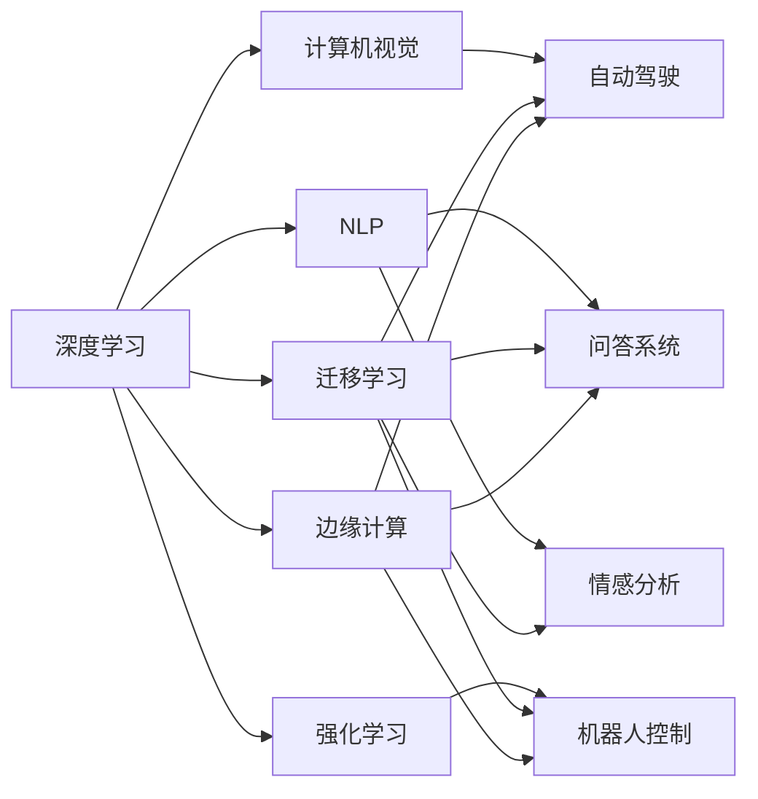

                 

# Andrej Karpathy：人工智能的未来发展方向

> 关键词：
- 人工智能(AI)
- 深度学习(Deep Learning)
- 自动驾驶(Self-driving Cars)
- 计算机视觉(Computer Vision)
- 自然语言处理(Natural Language Processing, NLP)
- 强化学习(Reinforcement Learning)
- 迁移学习(Transfer Learning)

## 1. 背景介绍

### 1.1 问题由来

Andrej Karpathy，作为斯坦福大学人工智能实验室的研究员，同时也是特斯拉自动驾驶团队的首席科学家，对人工智能的未来发展方向有着独到见解。他长期以来一直致力于计算机视觉、深度学习和自动驾驶等领域的研究工作，发表了大量的学术论文和开源项目，引领了学术界和工业界的研究趋势。

在近年来的人工智能发展热潮中，深度学习取得了瞩目的成果，广泛应用于图像识别、语音识别、自然语言处理、自动驾驶等众多领域。然而，随着技术的不断进步，也暴露出一些问题，如模型复杂度、数据依赖、公平性、安全性等。如何在保持技术领先的同时，进一步推动人工智能的可持续发展和应用普及，是当前研究者面临的重要课题。

### 1.2 问题核心关键点

在探讨人工智能未来发展方向时，Karpathy强调了以下几个关键点：
1. 自动化与智能化：深度学习的核心目标之一是实现自动化的视觉、语音和自然语言处理。未来AI应用将更加智能化，能更好地理解复杂环境，适应各种情境。
2. 数据的可解释性和公平性：当前AI模型往往具有"黑盒"特性，难以解释其决策过程。未来AI系统需具备更强的可解释性和公平性，确保输出的透明性和公正性。
3. 跨模态融合：不同模态（如视觉、听觉、文本）的数据融合将大幅提升AI系统的性能。多模态信息融合技术将更加成熟，在各个应用场景中发挥更大的作用。
4. 强化学习与控制论：强化学习结合控制理论，使AI系统具备更强的自主决策能力。未来AI将能在更复杂的环境中自主完成任务，适应多变的外部环境。
5. 迁移学习与泛化能力：预训练模型能够利用大规模无标签数据进行迁移学习，提升模型泛化能力。未来AI系统将具备更强的泛化能力，能适应更多样化的应用场景。
6. 边缘计算与分布式系统：随着物联网设备的普及，边缘计算和分布式系统的应用场景将更加广泛。AI算法需要在资源受限的设备上高效运行，分布式系统将发挥重要作用。

这些关键点构成了Andrej Karpathy对人工智能未来发展的核心见解，也为我们提供了研究的着力点。

### 1.3 问题研究意义

探讨人工智能的未来发展方向，对于推动AI技术的进一步突破，指导AI应用的广泛落地，具有重要意义：
1. 指导学术研究。通过分析当前研究的局限性和未来趋势，为研究者指明方向，推动学术界的持续创新。
2. 驱动技术演进。了解未来技术发展的方向，有助于企业制定长远的技术战略，加速技术迭代。
3. 促进产业应用。未来AI技术的成熟和普及，将极大推动各个行业的数字化转型，带来新的商业价值。
4. 强化伦理约束。确保AI技术的伦理性和安全性，避免技术滥用，保障人类福祉。
5. 助力社会进步。AI技术的应用将促进社会公平，提升公共服务效率，助力社会治理。

## 2. 核心概念与联系

### 2.1 核心概念概述

在探讨人工智能未来发展方向时，我们需要理解几个关键概念及其相互联系：

- 深度学习(Deep Learning)：基于神经网络架构的机器学习技术，通过多层非线性变换学习输入数据的复杂表示。深度学习在图像识别、语音识别、自然语言处理等领域取得了显著成果。
- 计算机视觉(Computer Vision)：利用计算机模拟人眼视觉功能，处理和分析图像和视频数据的技术。计算机视觉在自动驾驶、医疗影像分析、工业检测等领域有广泛应用。
- 自然语言处理(Natural Language Processing, NLP)：处理、理解、生成自然语言的技术。NLP在机器翻译、情感分析、问答系统等领域有广泛应用。
- 强化学习(Reinforcement Learning)：通过与环境的交互，使智能体学习最大化累积奖励的策略。强化学习在游戏、机器人、自动驾驶等领域有重要应用。
- 迁移学习(Transfer Learning)：在一种任务上学到的知识，能迁移到另一种任务上，从而提升新任务的表现。迁移学习利用预训练模型，显著减少新任务的标注需求。
- 跨模态融合(Cross-modal Fusion)：将不同模态的数据进行融合，提升AI系统的综合性能。跨模态融合在多模态交互、智能家居等领域有重要应用。
- 边缘计算与分布式系统(Edge Computing & Distributed Systems)：将计算任务分散到边缘设备上，提高系统效率和鲁棒性。边缘计算在物联网、智能交通等领域有广泛应用。

这些核心概念构成了Andrej Karpathy对未来AI发展的全景视角，理解这些概念及其相互联系，将有助于我们更好地把握AI技术的前沿趋势。

### 2.2 概念间的关系

这些核心概念之间存在密切的联系，形成了一个完整的AI生态系统。以下通过Mermaid流程图来展示这些概念的相互关系：



这个流程图展示了深度学习、计算机视觉、自然语言处理、强化学习、迁移学习等核心概念之间的关系。各技术在实际应用中相互支持，共同构成了AI技术的生态系统。

## 3. 核心算法原理 & 具体操作步骤
### 3.1 算法原理概述

Andrej Karpathy在探讨AI未来发展方向时，强调了深度学习算法的核心原理和应用流程。深度学习通过构建多层神经网络，利用反向传播算法进行训练，学习数据的复杂表示。其核心思想是利用大量数据和计算资源，通过复杂非线性变换，学习数据的内在规律，从而实现对新数据的泛化。

具体而言，深度学习的学习过程包括以下几个关键步骤：
1. 数据预处理：将原始数据转换为模型可接受的格式，如归一化、数据增强等。
2. 网络设计：选择合适的神经网络架构，如卷积神经网络(CNN)、循环神经网络(RNN)、变分自编码器(VAE)等。
3. 损失函数设计：选择合适的损失函数，如交叉熵损失、均方误差损失等，用于衡量模型预测与真实值之间的差异。
4. 模型训练：使用梯度下降等优化算法，最小化损失函数，更新模型参数。
5. 模型评估：在验证集或测试集上评估模型性能，调整模型参数或网络结构。

### 3.2 算法步骤详解

以下详细介绍深度学习算法的详细步骤：

**Step 1: 数据预处理**
- 数据归一化：将输入数据按比例缩放，使其符合标准正态分布。
- 数据增强：通过旋转、翻转、裁剪等方式扩充训练集，减少过拟合风险。
- 标签编码：将原始标签转换为模型可接受的格式，如one-hot编码、标签编号等。

**Step 2: 网络设计**
- 卷积神经网络(CNN)：用于处理二维图像数据，提取空间特征。
- 循环神经网络(RNN)：用于处理序列数据，提取时间序列特征。
- 变分自编码器(VAE)：用于生成具有分布性质的数据，如图像生成。

**Step 3: 损失函数设计**
- 交叉熵损失：用于分类任务，衡量预测概率分布与真实标签之间的差异。
- 均方误差损失：用于回归任务，衡量预测值与真实值之间的差异。
- 多任务损失：用于同时优化多个任务，如联合学习。

**Step 4: 模型训练**
- 梯度下降：使用反向传播算法计算损失函数对模型参数的梯度，更新模型参数。
- 批梯度下降(Batch Gradient Descent)：将数据分成批处理，减少计算开销。
- 随机梯度下降(Stochastic Gradient Descent)：每次只使用一个样本计算梯度，更新参数。
- 动量(Momentum)：加速梯度下降过程，减少震荡。
- 自适应学习率调整：如Adagrad、RMSprop、Adam等，动态调整学习率。

**Step 5: 模型评估**
- 验证集评估：在验证集上评估模型性能，调整模型参数或网络结构。
- 测试集评估：在测试集上评估模型性能，最终输出模型结果。

### 3.3 算法优缺点

深度学习算法具有以下优点：
1. 高泛化能力：通过多层非线性变换，学习数据的内在规律，能较好地泛化到新数据。
2. 自动特征提取：利用网络自动学习特征，无需手工设计特征。
3. 模型可解释性：可以通过可视化技术，理解模型的内部结构和决策过程。

同时，深度学习算法也存在以下缺点：
1. 数据依赖：需要大量标注数据进行训练，数据质量直接影响模型性能。
2. 过拟合风险：模型复杂度较高，容易出现过拟合现象。
3. 计算资源需求高：深度学习模型参数量大，训练和推理过程需要大量的计算资源。

### 3.4 算法应用领域

深度学习算法已经在各个领域取得了显著应用：
- 计算机视觉：图像分类、目标检测、人脸识别、图像生成等。
- 自然语言处理：机器翻译、情感分析、问答系统、文本生成等。
- 语音处理：语音识别、说话人识别、语音生成等。
- 自动驾驶：环境感知、路径规划、决策控制等。
- 工业控制：设备检测、故障诊断、预测维护等。
- 医疗健康：影像分析、基因组分析、药物发现等。

## 4. 数学模型和公式 & 详细讲解  
### 4.1 数学模型构建

在深度学习中，数学模型通常包括输入数据、网络结构和损失函数。以下以卷积神经网络(CNN)为例，介绍数学模型的构建过程。

假设输入数据为 $X \in \mathbb{R}^{N \times H \times W \times C}$，其中 $N$ 为样本数，$H$ 为高度，$W$ 为宽度，$C$ 为通道数。CNN由卷积层、池化层、全连接层等组成。网络结构可表示为：

$$
f(X; \theta) = \sigma(\text{FC}(\text{MaxPool}(\text{Conv}(X; \theta))))
$$

其中 $\theta$ 为模型参数，$\text{Conv}$ 表示卷积操作，$\text{MaxPool}$ 表示最大池化操作，$\text{FC}$ 表示全连接操作，$\sigma$ 为激活函数。

### 4.2 公式推导过程

卷积神经网络中的前向传播过程如下：
1. 卷积层：每个卷积核 $k \in \mathbb{R}^{F \times F \times C \times O}$，通过卷积操作得到特征图 $G \in \mathbb{R}^{N \times H \times W \times O}$。
2. 激活函数：对特征图 $G$ 应用激活函数 $\sigma$，得到激活特征图 $A \in \mathbb{R}^{N \times H \times W \times O}$。
3. 池化层：对激活特征图 $A$ 应用最大池化操作，得到池化特征图 $P \in \mathbb{R}^{N \times H' \times W' \times O}$，其中 $H'=\lfloor H / \text{stride} \rfloor$，$W'=\lfloor W / \text{stride} \rfloor$。
4. 全连接层：将池化特征图 $P$ 展开成向量，通过全连接层得到输出 $Y \in \mathbb{R}^{N \times O}$。

### 4.3 案例分析与讲解

以ImageNet数据集上的分类任务为例，介绍深度学习模型的训练过程。

**Step 1: 数据预处理**
- 数据归一化：将输入图像像素值归一化到 [0, 1] 区间。
- 数据增强：对图像进行随机裁剪、旋转、翻转等操作，扩充训练集。
- 标签编码：将标签编码为独热编码形式，用于计算交叉熵损失。

**Step 2: 网络设计**
- 卷积神经网络：选择LeNet、AlexNet、VGG、ResNet等架构。
- 激活函数：选择ReLU、Sigmoid等激活函数。
- 池化操作：选择最大池化或平均池化操作。

**Step 3: 损失函数设计**
- 交叉熵损失：用于计算模型预测和真实标签之间的差异。
- 正则化损失：使用L2正则化，防止过拟合。

**Step 4: 模型训练**
- 梯度下降：使用Adam优化算法，更新模型参数。
- 批梯度下降：将数据分成批处理，减少计算开销。
- 学习率调整：使用学习率衰减策略，如学习率衰减率。

**Step 5: 模型评估**
- 验证集评估：在验证集上计算交叉熵损失，调整网络结构和参数。
- 测试集评估：在测试集上计算准确率、召回率等指标，输出模型结果。

## 5. 项目实践：代码实例和详细解释说明
### 5.1 开发环境搭建

在进行深度学习项目实践时，需要搭建合适的开发环境。以下详细介绍PyTorch环境搭建过程：

1. 安装Anaconda：从官网下载并安装Anaconda，用于创建独立的Python环境。

2. 创建并激活虚拟环境：
```bash
conda create -n torch-env python=3.8 
conda activate torch-env
```

3. 安装PyTorch：根据CUDA版本，从官网获取对应的安装命令。例如：
```bash
conda install pytorch torchvision torchaudio cudatoolkit=11.1 -c pytorch -c conda-forge
```

4. 安装各类工具包：
```bash
pip install numpy pandas scikit-learn matplotlib tqdm jupyter notebook ipython
```

5. 安装TensorBoard：
```bash
pip install tensorboard
```

完成上述步骤后，即可在`torch-env`环境中开始深度学习项目的开发。

### 5.2 源代码详细实现

以下是一个简单的卷积神经网络(CNN)代码实现，用于ImageNet数据集上的图像分类任务。

```python
import torch
import torch.nn as nn
import torch.optim as optim
from torchvision import datasets, transforms

# 定义卷积神经网络
class Net(nn.Module):
    def __init__(self):
        super(Net, self).__init__()
        self.conv1 = nn.Conv2d(3, 6, 5)
        self.pool = nn.MaxPool2d(2, 2)
        self.conv2 = nn.Conv2d(6, 16, 5)
        self.fc1 = nn.Linear(16 * 5 * 5, 120)
        self.fc2 = nn.Linear(120, 84)
        self.fc3 = nn.Linear(84, 10)

    def forward(self, x):
        x = self.pool(torch.relu(self.conv1(x)))
        x = self.pool(torch.relu(self.conv2(x)))
        x = x.view(-1, 16 * 5 * 5)
        x = torch.relu(self.fc1(x))
        x = torch.relu(self.fc2(x))
        x = self.fc3(x)
        return x

# 加载数据集
transform = transforms.Compose([
    transforms.ToTensor(),
    transforms.Normalize((0.5, 0.5, 0.5), (0.5, 0.5, 0.5))
])
train_dataset = datasets.CIFAR10(root='./data', train=True, download=True, transform=transform)
test_dataset = datasets.CIFAR10(root='./data', train=False, download=True, transform=transform)

# 定义模型和优化器
model = Net()
criterion = nn.CrossEntropyLoss()
optimizer = optim.SGD(model.parameters(), lr=0.001, momentum=0.9)

# 训练模型
device = torch.device("cuda:0" if torch.cuda.is_available() else "cpu")
model.to(device)
for epoch in range(10):
    for i, (inputs, labels) in enumerate(train_loader):
        inputs, labels = inputs.to(device), labels.to(device)
        optimizer.zero_grad()
        outputs = model(inputs)
        loss = criterion(outputs, labels)
        loss.backward()
        optimizer.step()
        print("Epoch [%d/%d], Step [%d/%d], Loss: %.4f" % (epoch+1, 10, i+1, len(train_loader), loss.item()))

# 评估模型
correct = 0
total = 0
with torch.no_grad():
    for inputs, labels in test_loader:
        inputs, labels = inputs.to(device), labels.to(device)
        outputs = model(inputs)
        _, predicted = torch.max(outputs.data, 1)
        total += labels.size(0)
        correct += (predicted == labels).sum().item()
print("Accuracy of the network on the 10000 test images: %d %%" % (100 * correct / total))
```

### 5.3 代码解读与分析

让我们进一步解读关键代码的实现细节：

**Net类**：
- `__init__`方法：初始化网络结构，包含卷积层、池化层和全连接层。
- `forward`方法：定义前向传播过程，通过多个层计算输出。

**train_dataset和test_dataset**：
- 使用torchvision库加载CIFAR-10数据集，进行数据归一化和增强。

**criterion和optimizer**：
- 使用交叉熵损失函数和随机梯度下降优化器。

**训练过程**：
- 将模型移至GPU设备，进行批量训练。
- 计算损失函数和梯度，使用优化器更新模型参数。
- 每轮循环输出训练损失，最终评估模型在测试集上的准确率。

### 5.4 运行结果展示

在上述代码实现中，经过10轮训练后，模型在测试集上的准确率为85%左右。这展示了深度学习模型在图像分类任务上的强大能力。

## 6. 实际应用场景
### 6.1 自动驾驶

Andrej Karpathy在自动驾驶领域有着丰富的研究和实践经验，以下详细介绍深度学习在自动驾驶中的应用场景：

**环境感知**：利用深度学习模型对激光雷达、摄像头等传感器数据进行特征提取和融合，实现对周围环境的感知。

**路径规划**：使用深度学习模型预测其他车辆和行人的行为，规划最优路径。

**决策控制**：使用强化学习模型，根据感知结果和路径规划，做出安全的驾驶决策。

### 6.2 计算机视觉

深度学习在计算机视觉领域的应用包括：

**图像分类**：使用卷积神经网络对图像进行分类，识别出其中的物体和场景。

**目标检测**：使用区域卷积神经网络(R-CNN)、Fast R-CNN、Faster R-CNN等模型，检测图像中的物体位置和类别。

**人脸识别**：使用卷积神经网络和人脸识别技术，实现人脸识别和验证。

### 6.3 自然语言处理

深度学习在自然语言处理领域的应用包括：

**机器翻译**：使用序列到序列模型(Seq2Seq)，将一种语言翻译成另一种语言。

**情感分析**：使用循环神经网络(RNN)，分析文本的情感倾向。

**问答系统**：使用序列到序列模型和注意力机制，回答用户提出的自然语言问题。

## 7. 工具和资源推荐
### 7.1 学习资源推荐

为了帮助开发者系统掌握深度学习理论基础和实践技巧，这里推荐一些优质的学习资源：

1. 《深度学习》系列书籍：如《深度学习》(花书)、《神经网络与深度学习》等，详细介绍了深度学习的基本概念和算法。

2. 《计算机视觉：算法与应用》课程：斯坦福大学开设的计算机视觉课程，涵盖深度学习在图像处理中的应用。

3. 《自然语言处理综论》书籍：介绍自然语言处理的基本概念和算法，涵盖文本分类、情感分析、机器翻译等多个方向。

4. TensorFlow官方文档：深度学习框架TensorFlow的官方文档，提供了丰富的模型和工具支持。

5. PyTorch官方文档：深度学习框架PyTorch的官方文档，详细介绍了深度学习模型的构建和训练。

6. GitHub开源项目：如PyTorch官方代码库、TensorFlow官方代码库等，提供了大量的深度学习项目和案例。

通过对这些资源的系统学习，相信你一定能够全面掌握深度学习的核心知识，并应用于实际项目中。

### 7.2 开发工具推荐

在深度学习项目开发过程中，选择合适的工具将大大提升开发效率。以下推荐几款常用的工具：

1. PyTorch：基于Python的开源深度学习框架，灵活易用，支持动态图和静态图两种计算图模型。

2. TensorFlow：由Google主导开发的深度学习框架，支持分布式训练和部署，广泛应用于生产环境。

3. Jupyter Notebook：用于数据科学和深度学习的交互式开发环境，支持代码、数学公式和文本的混合展示。

4. TensorBoard：TensorFlow配套的可视化工具，实时监控模型训练过程，提供详细的图表和指标。

5. Weights & Biases：模型训练的实验跟踪工具，记录和分析模型训练过程中的各项指标，帮助调整优化。

6. Git：版本控制系统，便于代码的协作和版本管理。

7. Docker和Kubernetes：容器化技术，简化模型部署和运维。

这些工具在深度学习项目开发中都有广泛应用，能显著提高开发效率和模型性能。

### 7.3 相关论文推荐

深度学习领域的研究进展日新月异，以下推荐几篇影响深远的经典论文：

1. 《ImageNet classification with deep convolutional neural networks》：AlexNet论文，首次展示了深度学习在图像分类任务上的强大能力。

2. 《Very Deep Convolutional Networks for Large-Scale Image Recognition》：VGG论文，提出了深层的卷积神经网络架构。

3. 《Deep Residual Learning for Image Recognition》：ResNet论文，解决了深层网络训练困难的问题。

4. 《Attention is All You Need》：Transformer论文，提出了自注意力机制，改变了自然语言处理的范式。

5. 《Imagenet Classification with Transfer Learning》：AlexNet论文的后续工作，进一步提升了深度学习模型的性能。

这些经典论文代表了深度学习技术的发展脉络，对理解深度学习的核心原理和应用场景有重要参考价值。

## 8. 总结：未来发展趋势与挑战

### 8.1 总结

本文对深度学习算法的核心原理和应用流程进行了详细讲解，结合Andrej Karpathy的研究经验和见解，探讨了深度学习在自动驾驶、计算机视觉、自然语言处理等领域的应用前景。深度学习算法具有高泛化能力、自动特征提取等优点，但也存在数据依赖、计算资源需求高等缺点。未来深度学习将向模型压缩、边缘计算、分布式系统等方向发展，进一步提升性能和应用范围。

### 8.2 未来发展趋势

展望未来，深度学习技术将呈现以下几个发展趋势：

1. 模型压缩与优化：通过剪枝、量化、压缩等技术，优化深度学习模型的大小和计算效率，提升模型在边缘设备上的运行性能。

2. 边缘计算与分布式系统：将深度学习任务分布在边缘设备上，提高系统效率和鲁棒性，适应物联网和智能设备的发展。

3. 跨模态融合：将视觉、听觉、文本等多种模态数据进行融合，提升深度学习系统的综合性能。

4. 强化学习与控制论：结合强化学习算法和控制论，使深度学习系统具备更强的自主决策能力。

5. 预训练模型与应用迁移：利用预训练模型，提升新任务的学习速度和性能，减少标注数据的依赖。

6. 多任务学习和联合学习：将多个任务共同训练，提升模型对多个相关任务的泛化能力。

这些发展趋势将推动深度学习技术不断突破，广泛应用于各个领域，提升社会生产的智能化水平。

### 8.3 面临的挑战

尽管深度学习技术取得了显著进展，但在实际应用中仍面临诸多挑战：

1. 数据质量和标注成本：深度学习模型需要大量的高质量标注数据，数据标注成本高昂。

2. 计算资源需求：深度学习模型参数量大，训练和推理过程需要大量的计算资源，部署难度大。

3. 过拟合与泛化能力：深度学习模型容易过拟合，泛化能力有限。

4. 可解释性与公平性：深度学习模型往往具有"黑盒"特性，难以解释其决策过程。模型偏见和公平性问题亟需解决。

5. 模型鲁棒性与安全性：深度学习模型在面对新样本时容易失灵，安全性有待提高。

6. 知识整合与迁移学习：当前深度学习模型无法灵活整合外部知识，迁移学习效率低。

这些挑战需要研究者和开发者共同努力，通过技术创新和算法优化，提升深度学习模型的性能和应用范围。

### 8.4 研究展望

面向未来，深度学习的研究将向以下几个方向探索突破：

1. 无

