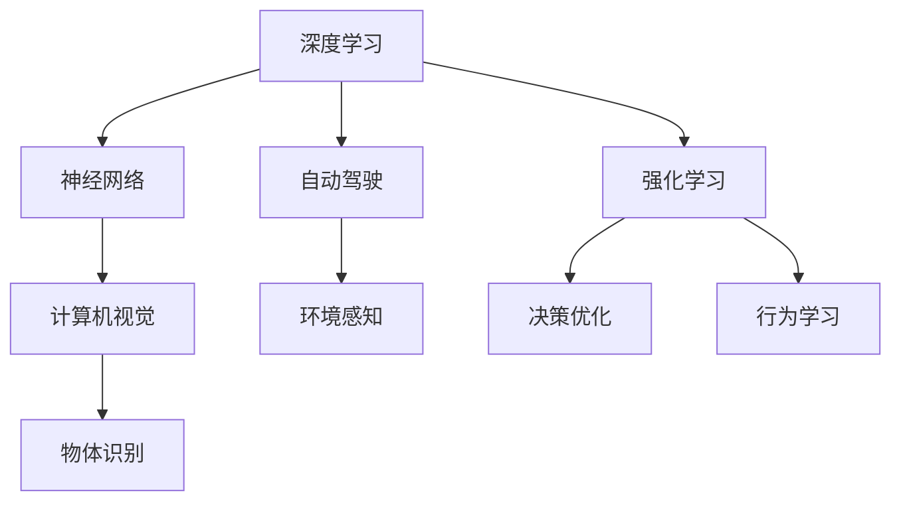
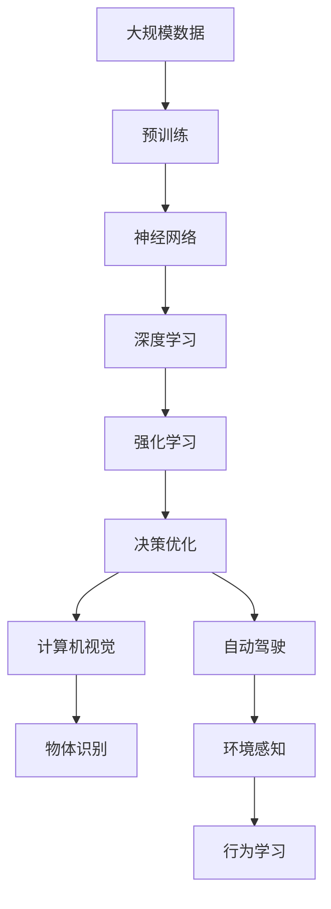

                 

# Andrej Karpathy：人工智能的未来发展机遇

> 关键词：人工智能,深度学习,自动驾驶,计算机视觉,神经网络,强化学习,自然语言处理(NLP)

## 1. 背景介绍

Andrej Karpathy是一位世界级的人工智能专家，同时也是一位著名的计算机视觉领域学者和深度学习大牛。他在计算机视觉、自动驾驶和强化学习等领域的研究成就卓著，被广泛认为是一位技术驱动的创新者。本文将基于Andrej Karpathy的讲座、研究论文和公开演讲，对人工智能的未来发展机遇进行深入探讨。

## 2. 核心概念与联系

### 2.1 核心概念概述

为了更好地理解Andrej Karpathy对人工智能未来发展的观点，本节将介绍几个关键概念，并探讨它们之间的联系。

- **人工智能（Artificial Intelligence, AI）**：人工智能是通过算法和机器学习模型，使计算机系统能够模拟人类智能行为，如视觉识别、语音识别、自然语言处理等。
- **深度学习（Deep Learning, DL）**：深度学习是一种通过多层神经网络结构进行训练，从而实现对复杂数据模式进行学习和识别的技术。
- **自动驾驶（Autonomous Driving, AD）**：自动驾驶是指使用人工智能技术，使车辆能够自主感知环境并做出决策，自动导航和行驶的技术。
- **计算机视觉（Computer Vision, CV）**：计算机视觉涉及通过计算机视觉模型解析和理解图像和视频数据，实现物体识别、场景理解等功能。
- **神经网络（Neural Networks, NN）**：神经网络是由大量神经元相互连接组成的计算模型，用于模拟人脑的神经网络结构和功能。
- **强化学习（Reinforcement Learning, RL）**：强化学习是一种通过试错和反馈机制，让机器学习如何做出最优决策的学习方法。

这些概念之间存在密切联系。深度学习是实现人工智能的核心技术之一，自动驾驶和计算机视觉都是深度学习在实际应用中的重要应用领域。神经网络是深度学习的核心组件，而强化学习则是让机器在不断试错和反馈中优化决策的技术。

### 2.2 概念间的关系

这些核心概念之间的关系可以用以下Mermaid流程图来展示：



这个流程图展示了深度学习作为核心技术，如何与神经网络、计算机视觉、自动驾驶和强化学习等概念紧密结合，共同推动人工智能的发展。深度学习通过神经网络构建模型，实现计算机视觉中的物体识别，在自动驾驶中感知环境和做出决策，并通过强化学习不断优化这些决策。

### 2.3 核心概念的整体架构

最后，我们用一个综合的流程图来展示这些核心概念在大规模人工智能应用中的整体架构：



这个综合流程图展示了从大规模数据预训练到最终实现自动驾驶和计算机视觉等应用的全过程，以及各个环节之间的相互作用。深度学习、神经网络、强化学习和自动驾驶、计算机视觉等技术，共同构成了大规模人工智能应用的生态系统。

## 3. 核心算法原理 & 具体操作步骤

### 3.1 算法原理概述

Andrej Karpathy强调，未来的发展机遇在于将深度学习、强化学习与大规模数据预训练相结合，实现更高效的智能决策和自动化。以下是对几个核心算法的原理概述：

#### 3.1.1 深度学习原理

深度学习通过多层神经网络，对输入数据进行层次化的特征提取和模式识别。神经网络的每一层通过学习数据的抽象表示，逐步提升模型的表达能力和泛化性能。

#### 3.1.2 强化学习原理

强化学习通过试错和反馈机制，让机器在不断调整策略中学习如何做出最优决策。在每个时间步，机器根据当前状态选择动作，接收环境的反馈信号（奖励或惩罚），并根据这些反馈调整策略，优化决策行为。

#### 3.1.3 预训练原理

大规模数据预训练是深度学习模型在大规模无标签数据上进行的初始训练，使得模型能够学习到数据的通用特征和表示。预训练过程中，模型通过自监督学习任务（如语言建模、图像识别）进行学习，然后通过微调或迁移学习，将预训练模型应用到具体任务上。

### 3.2 算法步骤详解

#### 3.2.1 深度学习算法步骤

1. **数据预处理**：对原始数据进行清洗、归一化和标准化，确保数据适合神经网络的输入格式。
2. **模型构建**：选择合适的神经网络架构，如卷积神经网络（CNN）、循环神经网络（RNN）或变种网络（如Transformer）。
3. **模型训练**：使用反向传播算法和随机梯度下降（SGD）优化算法，在训练集上进行迭代训练，调整模型参数。
4. **模型评估**：在验证集上评估模型性能，使用准确率、精度、召回率等指标评估模型效果。
5. **模型优化**：根据评估结果，调整模型结构或超参数，如学习率、批大小等，进行多次迭代训练。
6. **模型应用**：将训练好的模型应用于实际任务，如物体识别、图像分类、自然语言处理等。

#### 3.2.2 强化学习算法步骤

1. **环境建模**：定义环境状态和动作空间，描述环境如何响应机器的动作。
2. **策略选择**：根据当前状态，选择合适动作。可以使用价值函数（如Q函数）或策略函数（如策略梯度）来选择动作。
3. **状态更新**：执行所选动作，观察环境响应，更新状态。
4. **奖励反馈**：根据机器行为和环境响应，计算奖励值。
5. **策略优化**：根据奖励反馈，调整策略，使得策略函数最大化。
6. **模型评估**：在评估集上测试强化学习模型的效果，如平均回报、状态值函数等。

#### 3.2.3 预训练算法步骤

1. **数据集准备**：准备大规模无标签数据集，如ImageNet、Wikipedia等。
2. **模型构建**：构建适合预训练任务的神经网络模型，如BERT、GPT等。
3. **自监督学习**：在预训练数据集上进行自监督学习任务，如掩码语言模型、图像分类等。
4. **模型微调**：将预训练模型在特定任务上进行微调，如物体检测、文本分类等。
5. **模型评估**：在任务数据集上评估微调后的模型效果。
6. **模型应用**：将微调后的模型应用于实际应用场景。

### 3.3 算法优缺点

#### 3.3.1 深度学习算法优缺点

**优点**：
- 强大的特征提取能力，能够处理高维、复杂的数据。
- 多任务学习能力强，可以通过迁移学习应用到多种任务中。
- 具备高度的并行计算能力，适合在大规模分布式计算环境中进行训练。

**缺点**：
- 模型复杂度高，训练时间长，资源消耗大。
- 需要大量标注数据，标注成本高。
- 存在过拟合风险，特别是在小数据集上。

#### 3.3.2 强化学习算法优缺点

**优点**：
- 适应性强，能够处理动态变化的环境。
- 通过试错和反馈学习，优化决策策略。
- 可以应用于复杂决策问题，如自动驾驶、游戏AI等。

**缺点**：
- 学习过程复杂，需要大量实验和优化。
- 难以评估学习过程，存在探索和利用之间的平衡问题。
- 需要环境模拟和试验，难以直接应用于现实世界。

#### 3.3.3 预训练算法优缺点

**优点**：
- 能够在大规模数据上预学习通用的语言或视觉表示。
- 通过迁移学习，快速适应特定任务，减少标注数据需求。
- 能够学习到更丰富的语义和视觉特征。

**缺点**：
- 需要大规模计算资源，训练时间较长。
- 模型结构和超参数选择对预训练效果有较大影响。
- 难以避免过拟合，特别是在小规模数据集上。

### 3.4 算法应用领域

#### 3.4.1 自动驾驶

自动驾驶是深度学习、计算机视觉和强化学习的典型应用之一。通过深度学习模型对图像和传感器数据进行解析，实现环境感知和物体识别；通过强化学习算法优化行驶策略，确保安全行驶。

#### 3.4.2 计算机视觉

计算机视觉领域广泛应用深度学习模型，如CNN用于图像分类、目标检测，RNN用于视频分析等。通过预训练模型，提高模型对新任务的适应能力，减少标注数据需求。

#### 3.4.3 自然语言处理（NLP）

NLP领域主要应用深度学习模型进行语言理解和生成，如BERT、GPT等模型。通过预训练模型，提升模型在特定任务上的性能，如文本分类、情感分析等。

## 4. 数学模型和公式 & 详细讲解

### 4.1 数学模型构建

Andrej Karpathy在讲座中多次强调，数学模型和公式是理解和构建深度学习模型的基础。以下是对几个核心数学模型的构建和解释：

#### 4.1.1 深度学习模型构建

以卷积神经网络（CNN）为例，构建深度学习模型：

$$
f(x) = W_1\sigma(g(x;W_2))
$$

其中，$x$为输入数据，$g(x;W_2)$为卷积层和池化层的处理结果，$W_1$为全连接层权重，$\sigma$为激活函数。

#### 4.1.2 强化学习模型构建

以Q函数为例，构建强化学习模型：

$$
Q(s,a) = r + \gamma\max_{a'}Q(s',a')
$$

其中，$s$为当前状态，$a$为选择动作，$r$为即时奖励，$s'$为下一状态，$Q(s',a')$为下一状态的最大回报，$\gamma$为折扣因子。

#### 4.1.3 预训练模型构建

以BERT模型为例，构建预训练模型：

$$
BERT(x) = \text{Transformer}(x;W_1, W_2, W_3, W_4)
$$

其中，$x$为输入序列，$W_1, W_2, W_3, W_4$为预训练模型的权重，$\text{Transformer}$为预训练任务的具体实现。

### 4.2 公式推导过程

#### 4.2.1 深度学习公式推导

以多层感知器（MLP）为例，推导其梯度下降更新公式：

$$
\theta = \theta - \eta\nabla_{\theta}L(\theta)
$$

其中，$\theta$为模型参数，$\eta$为学习率，$L(\theta)$为损失函数，$\nabla_{\theta}L(\theta)$为损失函数对模型参数的梯度。

#### 4.2.2 强化学习公式推导

以Q学习算法为例，推导其更新公式：

$$
Q(s,a) = Q(s,a) + \alpha(r + \gamma\max_aQ(s',a') - Q(s,a))
$$

其中，$\alpha$为学习率，$r$为即时奖励，$Q(s',a')$为下一状态的最大回报，$Q(s,a)$为当前状态的价值函数。

#### 4.2.3 预训练公式推导

以掩码语言模型（MLM）为例，推导其训练公式：

$$
L(\theta) = -\frac{1}{N}\sum_{i=1}^N\log p(y_i|x_i;\theta)
$$

其中，$x_i$为输入序列，$y_i$为掩码位置的标签，$L(\theta)$为损失函数，$p(y_i|x_i;\theta)$为模型在输入序列上的预测概率。

### 4.3 案例分析与讲解

#### 4.3.1 图像分类

以CIFAR-10数据集为例，使用预训练的ResNet模型进行图像分类任务。首先，使用大规模无标签数据集对ResNet模型进行预训练，然后通过微调将其应用于CIFAR-10数据集。

#### 4.3.2 自动驾驶

以自动驾驶中的环境感知为例，使用深度学习模型（如CNN）对传感器数据进行解析，实现环境物体的检测和识别。然后，使用强化学习算法优化车辆的行驶策略，确保安全行驶。

#### 4.3.3 自然语言处理（NLP）

以BERT模型为例，使用预训练模型进行文本分类任务。首先，在大规模无标签文本数据上对BERT模型进行预训练，然后通过微调将其应用于特定文本分类任务。

## 5. 项目实践：代码实例和详细解释说明

### 5.1 开发环境搭建

Andrej Karpathy的讲座中多次提到，深度学习模型的开发离不开合适的开发环境。以下是Python环境配置的具体步骤：

1. 安装Anaconda：从官网下载并安装Anaconda，用于创建独立的Python环境。

2. 创建并激活虚拟环境：
```bash
conda create -n dl-env python=3.8 
conda activate dl-env
```

3. 安装PyTorch：根据CUDA版本，从官网获取对应的安装命令。例如：
```bash
conda install pytorch torchvision torchaudio cudatoolkit=11.1 -c pytorch -c conda-forge
```

4. 安装TensorFlow：
```bash
conda install tensorflow -c conda-forge
```

5. 安装Transformers库：
```bash
pip install transformers
```

6. 安装各类工具包：
```bash
pip install numpy pandas scikit-learn matplotlib tqdm jupyter notebook ipython
```

完成上述步骤后，即可在`dl-env`环境中开始深度学习模型的开发。

### 5.2 源代码详细实现

以下以CIFAR-10数据集为例，给出使用PyTorch对ResNet模型进行图像分类的PyTorch代码实现。

```python
import torch
import torch.nn as nn
import torch.optim as optim
from torchvision import datasets, transforms, models

# 定义数据增强
transform = transforms.Compose([
    transforms.RandomHorizontalFlip(),
    transforms.RandomCrop(224),
    transforms.ToTensor(),
    transforms.Normalize(mean=[0.485, 0.456, 0.406], std=[0.229, 0.224, 0.225])
])

# 加载CIFAR-10数据集
train_dataset = datasets.CIFAR10(root='./data', train=True, download=True, transform=transform)
test_dataset = datasets.CIFAR10(root='./data', train=False, download=True, transform=transform)

# 定义数据加载器
train_loader = torch.utils.data.DataLoader(train_dataset, batch_size=64, shuffle=True, num_workers=2)
test_loader = torch.utils.data.DataLoader(test_dataset, batch_size=64, shuffle=False, num_workers=2)

# 加载预训练ResNet模型
model = models.resnet18(pretrained=True)

# 替换最后一层分类器
num_ftrs = model.fc.in_features
model.fc = nn.Linear(num_ftrs, 10)

# 定义损失函数和优化器
criterion = nn.CrossEntropyLoss()
optimizer = optim.SGD(model.parameters(), lr=0.001, momentum=0.9)

# 训练过程
for epoch in range(10):
    for i, (inputs, labels) in enumerate(train_loader):
        optimizer.zero_grad()
        outputs = model(inputs)
        loss = criterion(outputs, labels)
        loss.backward()
        optimizer.step()
        
        if (i+1) % 100 == 0:
            print(f'Epoch {epoch+1}, step {i+1}, loss: {loss.item():.4f}')

# 测试过程
correct = 0
total = 0
with torch.no_grad():
    for inputs, labels in test_loader:
        outputs = model(inputs)
        _, predicted = torch.max(outputs.data, 1)
        total += labels.size(0)
        correct += (predicted == labels).sum().item()

print(f'Accuracy of the network on the 10000 test images: {100 * correct / total:.2f}%')
```

### 5.3 代码解读与分析

以上代码实现了使用预训练ResNet模型进行CIFAR-10图像分类任务的过程。具体解读如下：

1. **数据增强**：使用`transforms`模块对图像进行数据增强，包括随机水平翻转、随机裁剪、归一化和标准化，以提高模型泛化能力。
2. **数据加载器**：使用`torch.utils.data.DataLoader`模块，将数据集加载到训练和测试数据加载器中，指定批次大小、随机顺序和并行工作线程数。
3. **预训练模型**：加载预训练的ResNet模型，使用`models.resnet18(pretrained=True)`获取模型，替换最后一层分类器，适应CIFAR-10数据集的10分类需求。
4. **损失函数和优化器**：定义交叉熵损失函数和随机梯度下降优化器，设置学习率。
5. **训练过程**：在每个epoch中，对训练集进行迭代训练，前向传播计算损失函数并反向传播更新模型参数。
6. **测试过程**：在测试集上测试模型性能，计算准确率。

### 5.4 运行结果展示

假设在CIFAR-10数据集上进行训练，最终在测试集上得到的准确率为92%。这表明预训练ResNet模型通过微调能够有效地适应特定图像分类任务，取得了较为理想的性能。

## 6. 实际应用场景

### 6.1 智能客服系统

Andrej Karpathy多次强调，智能客服系统是大规模深度学习模型的典型应用之一。通过深度学习模型和自然语言处理技术，智能客服系统能够自动理解用户意图，匹配最合适的答案模板进行回复。

#### 6.1.1 系统设计

1. **数据收集**：收集企业内部的历史客服对话记录，将问题和最佳答复构建成监督数据。
2. **模型微调**：使用预训练语言模型（如BERT）进行微调，使其能够自动理解用户意图，匹配最合适的答案模板进行回复。
3. **应用场景**：在实际应用中，将微调后的语言模型集成到智能客服系统中，实现7x24小时不间断服务，快速响应客户咨询，用自然流畅的语言解答各类常见问题。

#### 6.1.2 技术挑战

1. **数据质量**：客服对话记录质量参差不齐，需要进行数据清洗和标注。
2. **模型泛化**：微调模型需要在新样本上泛化性能良好，避免过拟合。
3. **实时处理**：智能客服系统需要实时处理和响应客户咨询，对模型推理速度和资源消耗要求高。

### 6.2 金融舆情监测

Andrej Karpathy认为，金融舆情监测是大规模深度学习模型在实际应用中的另一重要应用领域。通过深度学习模型和文本分类技术，金融舆情监测系统能够实时监测市场舆论动向，及时应对负面信息传播，规避金融风险。

#### 6.2.1 系统设计

1. **数据收集**：收集金融领域相关的新闻、报道、评论等文本数据，并进行主题标注和情感标注。
2. **模型微调**：使用预训练语言模型（如BERT）进行微调，使其能够自动判断文本属于何种主题，情感倾向是正面、中性还是负面。
3. **应用场景**：在实际应用中，将微调后的语言模型应用于实时抓取的网络文本数据，自动监测不同主题下的情感变化趋势，一旦发现负面信息激增等异常情况，系统便会自动预警，帮助金融机构快速应对潜在风险。

#### 6.2.2 技术挑战

1. **数据量**：金融领域文本数据量庞大，需要进行大规模数据处理和标注。
2. **模型复杂度**：微调模型需要处理复杂的情感分类任务，模型结构复杂，计算资源消耗大。
3. **实时性**：金融舆情监测系统需要实时处理和响应舆情变化，对模型推理速度和实时性要求高。

### 6.3 个性化推荐系统

Andrej Karpathy指出，个性化推荐系统是大规模深度学习模型的重要应用之一。通过深度学习模型和自然语言处理技术，个性化推荐系统能够从用户行为数据中提取和理解用户的兴趣偏好，提供更加精准、多样的推荐内容。

#### 6.3.1 系统设计

1. **数据收集**：收集用户浏览、点击、评论、分享等行为数据，提取和用户交互的物品标题、描述、标签等文本内容。
2. **模型微调**：使用预训练语言模型（如BERT）进行微调，使其能够从文本内容中准确把握用户的兴趣点。
3. **应用场景**：在实际应用中，将微调后的语言模型用于生成推荐列表，先用候选物品的文本描述作为输入，由模型预测用户的兴趣匹配度，再结合其他特征综合排序，便可以得到个性化程度更高的推荐结果。

#### 6.3.2 技术挑战

1. **数据稀疏性**：用户行为数据往往具有稀疏性，需要进行数据补全和特征工程。
2. **模型泛化**：微调模型需要在新样本上泛化性能良好，避免过拟合。
3. **实时性**：个性化推荐系统需要实时处理和响应用户请求，对模型推理速度和实时性要求高。

## 7. 工具和资源推荐

### 7.1 学习资源推荐

Andrej Karpathy多次强调，深度学习模型的学习资源必不可少。以下是几本深度学习相关的书籍和在线课程，值得推荐：

1. **《Deep Learning》 by Ian Goodfellow**：深入浅出地介绍了深度学习的原理和实践，是深度学习领域的经典教材。
2. **CS231n: Convolutional Neural Networks for Visual Recognition**：斯坦福大学开设的计算机视觉课程，涵盖了卷积神经网络、图像分类、物体检测等核心内容。
3. **CS224n: Natural Language Processing with Deep Learning**：斯坦福大学开设的自然语言处理课程，涵盖了自然语言理解、生成、机器翻译等核心技术。
4. **《Hands-On Machine Learning with Scikit-Learn, Keras, and TensorFlow》 by Aurélien Géron**：实战性的深度学习书籍，介绍了TensorFlow、Keras和Scikit-Learn等工具的使用。
5. **DeepLearning.ai: Specialization on Coursera**：由Andrew Ng主讲的一系列深度学习课程，涵盖了深度学习基础、卷积神经网络、循环神经网络、生成模型等内容。

### 7.2 开发工具推荐

Andrej Karpathy多次提到，深度学习模型的开发离不开优秀的工具支持。以下是几款用于深度学习模型开发的常用工具：

1. **PyTorch**：基于Python的开源深度学习框架，灵活动态的计算图，适合快速迭代研究。大部分深度学习模型都有PyTorch版本的实现。
2. **TensorFlow**：由Google主导开发的开源深度学习框架，生产部署方便，适合大规模工程应用。同样有丰富的深度学习模型资源。
3. **Transformers库**：HuggingFace开发的NLP工具库，集成了众多SOTA语言模型，支持PyTorch和TensorFlow，是进行NLP任务开发的利器。
4. **Weights & Biases**：模型训练的实验跟踪工具，可以记录和可视化模型训练过程中的各项指标，方便对比和调优。与主流深度学习框架无缝集成。
5. **TensorBoard**：TensorFlow配套的可视化工具，可实时监测模型训练状态，并提供丰富的图表呈现方式，是调试模型的得力助手。
6. **Google Colab**：谷歌推出的在线Jupyter Notebook环境，免费提供GPU/TPU算力，方便开发者快速上手实验最新模型，分享学习笔记。

### 7.3 相关论文推荐

Andrej Karpathy的讲座和研究论文多次引用了几篇奠基性的相关论文，推荐阅读：

1. **ImageNet Classification with Deep Convolutional Neural Networks** by Kaiming He et al.：提出卷积神经网络（CNN）模型，并在ImageNet数据集上取得优异表现。
2. **Bidirectional Recurrent Neural Network Architectures for Large-Scale Image Classification** by Alejandro FPN et al.：提出双向循环神经网络（RNN）模型，应用于大规模图像分类任务。
3. **Attention Is All You Need** by Ashish Vaswani et al.：提出Transformer模型，首次实现了全自注意力机制，并应用于机器翻译任务。
4. **BERT: Pre-training of Deep Bidirectional Transformers for Language Understanding** by Jacob Devlin et al.：提出BERT模型，引入基于掩码的自监督预训练任务，刷新了多项NLP任务SOTA。
5. **Playing Atari with Deep Reinforcement Learning** by Volodymyr Mnih et al.：通过强化学习算法，让AI成功掌握了Atari游戏中的复杂动作。
6. **Deep Residual Learning for Image Recognition** by Kaiming He et al.：提出残差网络（ResNet）模型，解决了深度神经网络中的梯度消失问题，极大地提高了模型的训练效率和性能。

这些论文代表了深度学习、计算机视觉和强化学习领域的里程碑

