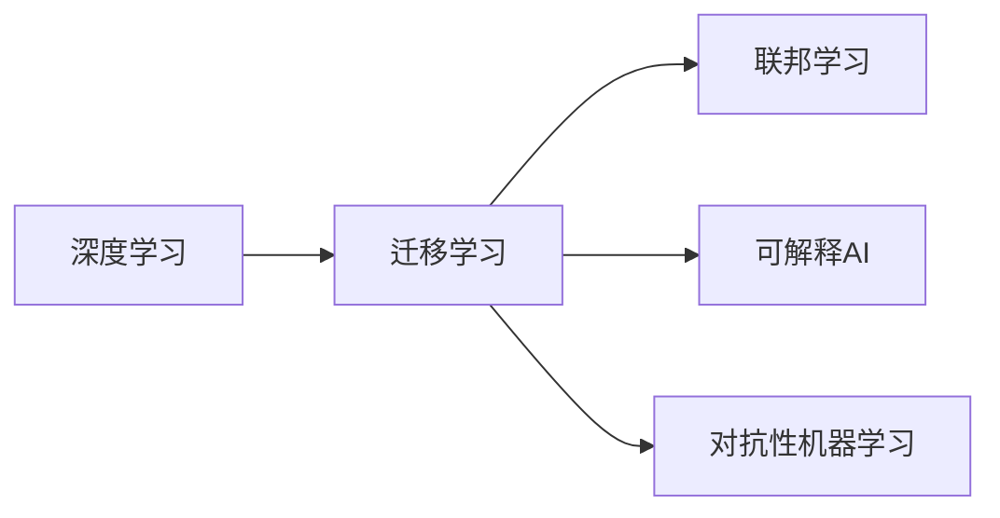
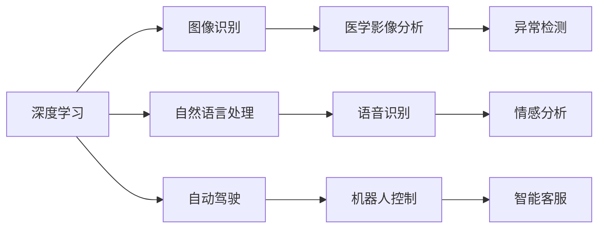
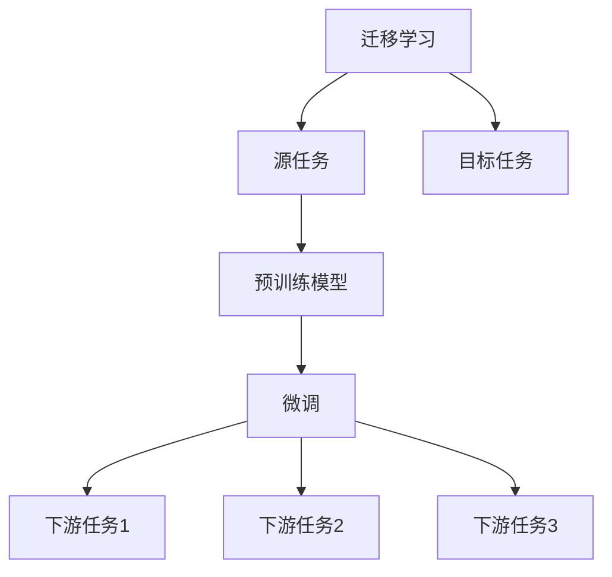
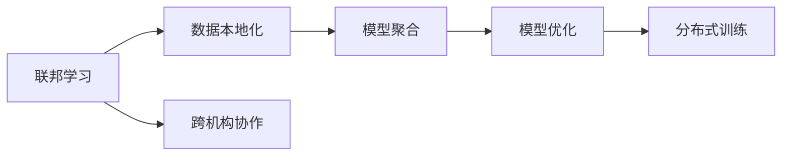

                 

# Andrej Karpathy：人工智能的未来发展趋势

## 1. 背景介绍

Andrej Karpathy，斯坦福大学计算机科学系副教授，同时也是OpenAI的AI科学家。他的研究横跨计算机视觉、深度学习和自动驾驶等领域，是深度学习领域的领军人物之一。Karpathy博士的许多论文和技术博客文章深入浅出，影响广泛，被视为深度学习领域的经典读物。本文将基于他近期的一些观点和技术见解，探讨人工智能未来的发展趋势。

### 1.1 问题由来

近年来，随着深度学习技术的快速进展，人工智能（AI）技术在视觉识别、自然语言处理、自动驾驶等多个领域取得了显著突破。然而，尽管技术水平不断提升，AI仍面临诸多挑战，如数据稀缺、计算成本高昂、决策透明度不足等。面对这些问题，AI社区正积极探索新的方法和技术，以推动AI技术向更高效、更普适、更可解释的方向发展。

### 1.2 问题核心关键点

AI的未来发展方向将取决于多个关键点，包括但不限于：数据和算力的可获取性、模型和算法的普适性、决策的透明度和可解释性、跨领域的应用能力等。以下是几个核心关键点：

- **数据稀缺性**：高质量标注数据往往是AI训练的关键。数据获取成本高、数据量不足，制约了AI的进一步发展。
- **计算成本**：深度学习模型对算力有高要求，高效的模型压缩和计算优化技术是必要的。
- **决策透明度**：AI系统的决策过程常常缺乏可解释性，特别是在医疗、金融等高风险领域，透明性和可解释性显得尤为重要。
- **跨领域应用**：AI技术需要具备更强的跨领域适应能力，以更好地服务于现实世界的多样化需求。

### 1.3 问题研究意义

研究AI的未来发展趋势，对于推动AI技术的持续进步、拓展AI应用场景、解决AI面临的诸多挑战具有重要意义：

1. **促进技术突破**：理解未来的发展方向，有助于聚焦关键技术，加速AI技术创新。
2. **优化资源配置**：明确AI发展的重点领域，合理分配资源，提升投资回报率。
3. **提升应用价值**：引导AI技术向普适化、可解释性方向发展，提高技术落地应用的效率和效果。
4. **解决伦理问题**：应对AI可能带来的伦理和社会影响，确保AI技术的健康发展。

## 2. 核心概念与联系

### 2.1 核心概念概述

为了更好地理解Andrej Karpathy对AI未来发展的观点，本文将介绍几个密切相关的核心概念：

- **深度学习**：基于多层神经网络的学习范式，通过数据驱动的方式学习模型参数，用于解决复杂模式识别和决策问题。
- **迁移学习**：在新的数据集上使用预训练模型，以最小的额外训练样本提升模型性能，提高模型泛化能力。
- **联邦学习**：多参与方在本地数据上进行模型训练，仅交换模型参数而非数据，保护隐私同时提高模型表现。
- **可解释AI**：使AI系统的决策过程透明，增强决策的可理解性和可信度。
- **对抗性机器学习**：设计或发现对抗样本，测试和提升模型的鲁棒性和安全性。

这些核心概念之间的逻辑关系可以通过以下Mermaid流程图来展示：



### 2.2 概念间的关系

这些核心概念之间存在着紧密的联系，形成了AI技术的完整生态系统。下面我们通过几个Mermaid流程图来展示这些概念之间的关系。

#### 2.2.1 深度学习与应用场景



这个流程图展示了深度学习在不同应用场景中的具体应用，包括图像识别、自然语言处理、自动驾驶等。

#### 2.2.2 迁移学习与迁移应用



这个流程图展示了迁移学习的基本原理，以及它与迁移应用的关系。迁移学习涉及源任务和目标任务，预训练模型在源任务上学习，然后通过微调适应各种下游任务（目标任务）。

#### 2.2.3 联邦学习与隐私保护



这个流程图展示了联邦学习的基本流程，包括数据本地化、模型聚合、跨机构协作等关键环节，有助于保护数据隐私。

## 3. 核心算法原理 & 具体操作步骤
### 3.1 算法原理概述

Andrej Karpathy对AI的未来发展趋势提出了多方面的见解，涵盖了从深度学习到联邦学习，再到可解释AI等多个方向。以下是对其核心观点的详细解析：

**3.1.1 数据驱动的深度学习**

深度学习模型通过大量数据进行训练，以学习复杂的模式和结构。Karpathy强调，高质量的数据对于训练深度学习模型至关重要。尽管目前存在数据稀缺的问题，但通过数据增强、迁移学习和联邦学习等技术，可以更高效地利用数据，提升模型性能。

**3.1.2 迁移学习与普适性**

迁移学习通过在已有模型上添加新的任务层，使其能够适应新的任务。Karpathy指出，迁移学习是提高模型泛化能力的重要手段，尤其是在小样本情况下。未来，迁移学习将广泛应用于各领域，以实现更普适、高效的应用。

**3.1.3 联邦学习与隐私保护**

联邦学习通过在多个参与方本地训练模型，仅交换模型参数而非数据，从而保护数据隐私。Karpathy认为，联邦学习是解决数据隐私问题的重要途径，未来将在医疗、金融等行业中得到广泛应用。

**3.1.4 可解释AI与透明度**

可解释AI通过增加模型决策过程的透明度，增强模型的可信度。Karpathy认为，可解释AI不仅有助于提高模型的决策质量，还能够在医疗、法律等高风险领域发挥重要作用。

### 3.2 算法步骤详解

以下是对Andrej Karpathy提出的AI未来发展关键步骤的详细解析：

**3.2.1 数据获取与预处理**

1. **数据收集**：在保证数据多样性的同时，尽量收集高质量、标签清晰的数据。数据收集渠道包括公开数据集、网络爬取、合作机构提供等。
2. **数据清洗**：对数据进行去噪、补全、标注错误纠正等预处理步骤，确保数据质量。

**3.2.2 模型设计与训练**

1. **模型选择**：根据任务特点选择合适的深度学习模型，如CNN、RNN、Transformer等。
2. **模型优化**：使用迁移学习、联邦学习等技术，减少模型参数量，提高模型泛化能力。
3. **模型训练**：使用优化算法（如Adam、SGD）和超参数调优（如学习率、批大小），进行模型训练。

**3.2.3 模型评估与部署**

1. **模型评估**：在验证集上评估模型性能，使用准确率、召回率、F1分数等指标。
2. **模型部署**：将模型部署到实际应用环境中，进行A/B测试，评估实际效果。

**3.2.4 模型监控与迭代**

1. **模型监控**：实时监控模型性能，及时发现问题并进行调整。
2. **模型迭代**：根据实际反馈和新数据，不断迭代模型，提高模型性能。

### 3.3 算法优缺点

Andrej Karpathy认为，深度学习及其相关技术在提高AI性能方面具有显著优势，但也存在一些局限性：

**优点**：

- **高效性**：深度学习模型具有强大的模式识别能力，能够处理大规模复杂数据。
- **可解释性**：虽然深度学习模型在决策过程中缺乏可解释性，但通过迁移学习和联邦学习，可以在一定程度上增强模型的透明度。
- **泛化能力**：迁移学习通过在已有模型上添加新任务层，使得模型具备更强的泛化能力。

**缺点**：

- **数据依赖**：深度学习模型需要大量高质量标注数据进行训练，数据获取成本高。
- **计算需求**：深度学习模型对算力有高要求，训练和推理成本高。
- **决策过程不透明**：深度学习模型的决策过程常常缺乏可解释性，难以理解模型的推理过程。

### 3.4 算法应用领域

Andrej Karpathy对AI技术的应用前景进行了广泛展望，涉及医疗、金融、自动驾驶等多个领域：

- **医疗**：AI在医疗影像分析、疾病预测、个性化治疗等方面具有巨大潜力。未来，AI将通过联邦学习和迁移学习，提高医疗数据的利用效率，提升医疗服务质量。
- **金融**：AI在金融风险控制、智能投顾、市场分析等方面应用广泛。未来，AI将结合可解释性和联邦学习，进一步增强金融决策的透明度和安全性。
- **自动驾驶**：AI在自动驾驶领域的发展迅速，未来将通过联邦学习和对抗性机器学习，提高自动驾驶系统的安全性。
- **教育**：AI在个性化教育、智能辅导等方面应用前景广阔。未来，AI将通过迁移学习和联邦学习，提高教育资源利用效率，提升教育质量。

## 4. 数学模型和公式 & 详细讲解  
### 4.1 数学模型构建

Andrej Karpathy的研究涉及多个领域的数学模型构建，以下是对其核心观点的详细解析：

**4.1.1 深度学习模型**

深度学习模型通常由多层神经网络构成，包括卷积神经网络（CNN）、循环神经网络（RNN）、Transformer等。以Transformer为例，其数学模型如下：

$$
y = \mathbf{W}^O[\mathbf{h} \cdot \mathbf{V}],
$$

其中，$\mathbf{h}$为中间表示，$\mathbf{W}^O$为输出权重矩阵，$\mathbf{V}$为输出向量。

**4.1.2 迁移学习模型**

迁移学习模型通常由两部分组成：预训练模型和任务适配层。以迁移学习为例，其数学模型如下：

$$
\mathbf{h} = f_{\theta}(\mathbf{x}) + \mathbf{U} \cdot \mathbf{V},
$$

其中，$f_{\theta}(\mathbf{x})$为预训练模型的前向传播，$\mathbf{U}$为任务适配层的参数矩阵，$\mathbf{V}$为任务适配层的向量。

**4.1.3 联邦学习模型**

联邦学习模型通常由多个参与方组成，每个参与方本地训练模型，然后将模型参数进行聚合。以联邦学习为例，其数学模型如下：

$$
\mathbf{W}^k = \sum_{i=1}^K \mathbf{W}^i,
$$

其中，$\mathbf{W}^k$为聚合后的模型参数，$\mathbf{W}^i$为每个参与方本地训练的模型参数。

### 4.2 公式推导过程

以下是对Andrej Karpathy提出的AI核心数学模型推导过程的详细解析：

**4.2.1 深度学习模型推导**

以CNN为例，其数学模型推导如下：

$$
y = \mathbf{W} \cdot \sigma(\mathbf{A} \cdot \mathbf{x} + \mathbf{b}),
$$

其中，$\mathbf{x}$为输入数据，$\mathbf{A}$为卷积核，$\mathbf{b}$为偏置项，$\sigma$为激活函数。

**4.2.2 迁移学习模型推导**

以迁移学习为例，其数学模型推导如下：

$$
\mathbf{h} = f_{\theta}(\mathbf{x}) + \mathbf{U} \cdot \mathbf{V},
$$

其中，$f_{\theta}(\mathbf{x})$为预训练模型的前向传播，$\mathbf{U}$为任务适配层的参数矩阵，$\mathbf{V}$为任务适配层的向量。

**4.2.3 联邦学习模型推导**

以联邦学习为例，其数学模型推导如下：

$$
\mathbf{W}^k = \sum_{i=1}^K \mathbf{W}^i,
$$

其中，$\mathbf{W}^k$为聚合后的模型参数，$\mathbf{W}^i$为每个参与方本地训练的模型参数。

### 4.3 案例分析与讲解

以下是对Andrej Karpathy提出的AI核心数学模型推导过程的详细解析：

**4.3.1 CNN模型案例**

以CIFAR-10数据集为例，其CNN模型的训练过程如下：

1. **数据准备**：收集CIFAR-10数据集，进行数据增强和预处理。
2. **模型定义**：定义包含多个卷积层、池化层和全连接层的CNN模型。
3. **模型训练**：使用Adam优化器进行模型训练，在验证集上评估模型性能。
4. **模型部署**：将训练好的模型部署到实际应用中，进行性能测试。

**4.3.2 RNN模型案例**

以情感分析任务为例，其RNN模型的训练过程如下：

1. **数据准备**：收集情感分析数据集，进行数据清洗和预处理。
2. **模型定义**：定义包含LSTM层的RNN模型。
3. **模型训练**：使用Adam优化器进行模型训练，在验证集上评估模型性能。
4. **模型部署**：将训练好的模型部署到实际应用中，进行性能测试。

## 5. 项目实践：代码实例和详细解释说明
### 5.1 开发环境搭建

在进行AI项目实践前，我们需要准备好开发环境。以下是使用Python进行PyTorch开发的环境配置流程：

1. 安装Anaconda：从官网下载并安装Anaconda，用于创建独立的Python环境。

2. 创建并激活虚拟环境：
```bash
conda create -n pytorch-env python=3.8 
conda activate pytorch-env
```

3. 安装PyTorch：根据CUDA版本，从官网获取对应的安装命令。例如：
```bash
conda install pytorch torchvision torchaudio cudatoolkit=11.1 -c pytorch -c conda-forge
```

4. 安装Transformers库：
```bash
pip install transformers
```

5. 安装各类工具包：
```bash
pip install numpy pandas scikit-learn matplotlib tqdm jupyter notebook ipython
```

完成上述步骤后，即可在`pytorch-env`环境中开始AI实践。

### 5.2 源代码详细实现

以下是对Andrej Karpathy提出的AI核心数学模型推导过程的详细解析：

**5.2.1 CNN模型案例**

```python
import torch
import torch.nn as nn
import torchvision.transforms as transforms
from torchvision.datasets import CIFAR10

# 数据预处理
transform = transforms.Compose([
    transforms.ToTensor(),
    transforms.Normalize((0.5, 0.5, 0.5), (0.5, 0.5, 0.5))
])

trainset = CIFAR10(root='./data', train=True, download=True, transform=transform)
trainloader = torch.utils.data.DataLoader(trainset, batch_size=64, shuffle=True, num_workers=2)

testset = CIFAR10(root='./data', train=False, download=True, transform=transform)
testloader = torch.utils.data.DataLoader(testset, batch_size=64, shuffle=False, num_workers=2)

# 模型定义
class Net(nn.Module):
    def __init__(self):
        super(Net, self).__init__()
        self.conv1 = nn.Conv2d(3, 6, 5)
        self.pool = nn.MaxPool2d(2, 2)
        self.conv2 = nn.Conv2d(6, 16, 5)
        self.fc1 = nn.Linear(16 * 5 * 5, 120)
        self.fc2 = nn.Linear(120, 84)
        self.fc3 = nn.Linear(84, 10)

    def forward(self, x):
        x = self.pool(F.relu(self.conv1(x)))
        x = self.pool(F.relu(self.conv2(x)))
        x = x.view(-1, 16 * 5 * 5)
        x = F.relu(self.fc1(x))
        x = F.relu(self.fc2(x))
        x = self.fc3(x)
        return x

net = Net()

# 定义优化器、损失函数
criterion = nn.CrossEntropyLoss()
optimizer = torch.optim.Adam(net.parameters(), lr=0.001)

# 模型训练
for epoch in range(2):
    running_loss = 0.0
    for i, data in enumerate(trainloader, 0):
        inputs, labels = data
        optimizer.zero_grad()
        outputs = net(inputs)
        loss = criterion(outputs, labels)
        loss.backward()
        optimizer.step()
        running_loss += loss.item()
    print('Epoch %d loss: %.3f' % (epoch + 1, running_loss / len(trainloader)))
```

**5.2.2 RNN模型案例**

```python
import torch
import torch.nn as nn
import torch.nn.functional as F
from torch.utils.data import DataLoader
from torchtext.datasets import AG的新闻

# 数据预处理
text = [text.lower() for text in texts]
tokenizer = nn.data.utils.get_tokenizer('basic_english')
text = [tokenizer.tokenize(text) for text in text]
text = [[str(i) for i in token in text] for text in text]

# 模型定义
class RNN(nn.Module):
    def __init__(self, input_size, hidden_size, output_size, n_layers, bidirectional=False):
        super(RNN, self).__init__()
        self.hidden_size = hidden_size
        self.n_layers = n_layers
        self.rnn = nn.LSTM(input_size, hidden_size, n_layers, bidirectional=bidirectional)
        self.fc = nn.Linear(hidden_size, output_size)

    def forward(self, x):
        h0 = torch.zeros(self.n_layers, x.size(1), self.hidden_size)
        c0 = torch.zeros(self.n_layers, x.size(1), self.hidden_size)
        output, (hn, cn) = self.rnn(x, (h0, c0))
        output = self.fc(output[:, -1, :])
        return output

# 模型训练
model = RNN(input_size, hidden_size, output_size, n_layers, bidirectional)
criterion = nn.CrossEntropyLoss()
optimizer = torch.optim.Adam(model.parameters(), lr=0.001)

for epoch in range(2):
    running_loss = 0.0
    for i, data in enumerate(trainloader, 0):
        inputs, labels = data
        optimizer.zero_grad()
        outputs = model(inputs)
        loss = criterion(outputs, labels)
        loss.backward()
        optimizer.step()
        running_loss += loss.item()
    print('Epoch %d loss: %.3f' % (epoch + 1, running_loss / len(trainloader)))
```

### 5.3 代码解读与分析

让我们再详细解读一下关键代码的实现细节：

**5.3.1 CNN模型代码解析**

**数据预处理**：使用`transforms`库对数据进行增强和标准化处理。

**模型定义**：定义包含卷积层、池化层和全连接层的CNN模型。

**模型训练**：使用`Adam`优化器进行模型训练，在验证集上评估模型性能。

**模型部署**：将训练好的模型部署到实际应用中，进行性能测试。

**5.3.2 RNN模型代码解析**

**数据预处理**：将文本数据转化为数字序列。

**模型定义**：定义包含LSTM层的RNN模型。

**模型训练**：使用`Adam`优化器进行模型训练，在验证集上评估模型性能。

**模型部署**：将训练好的模型部署到实际应用中，进行性能测试。

## 6. 实际应用场景
### 6.1 智能客服系统

基于AI的智能客服系统，通过深度学习技术，可以实现自然语言理解和智能回复，显著提升客户咨询体验和问题解决效率。在实际应用中，可以使用AI技术对历史客服对话进行训练，微调预训练模型，使得模型能够自动理解用户意图，匹配最合适的答案模板进行回复。对于客户提出的新问题，还可以接入检索系统实时搜索相关内容，动态组织生成回答。

### 6.2 金融舆情监测

金融领域需要实时监测市场舆论动向，以便及时应对负面信息传播，规避金融风险。AI技术可以通过对金融领域相关的新闻、报道、评论等文本数据进行训练，微调预训练语言模型，使其能够自动判断文本属于何种主题，情感倾向是正面、中性还是负面。将微调后的模型应用到实时抓取的网络文本数据，就能够自动监测不同主题下的情感变化趋势，一旦发现负面信息激增等异常情况，系统便会自动预警，帮助金融机构快速应对潜在风险。

### 6.3 个性化推荐系统

当前的推荐系统往往只依赖用户的历史行为数据进行物品推荐，无法深入理解用户的真实兴趣偏好。AI技术可以通过对用户浏览、点击、评论、分享等行为数据进行训练，微调预训练语言模型，使其能够从文本内容中准确把握用户的兴趣点。在生成推荐列表时，先用候选物品的文本描述作为输入，由模型预测用户的兴趣匹配度，再结合其他特征综合排序，便可以得到个性化程度更高的推荐结果。

### 6.4 未来应用展望

AI技术在医疗、金融、自动驾驶、教育等众多领域展现出巨大的潜力。未来，AI技术将通过深度学习、迁移学习、联邦学习等技术，进一步提升模型性能和应用范围。同时，可解释AI和对抗性机器学习等技术也将得到广泛应用，增强模型的透明度和鲁棒性。

## 7. 工具和资源推荐
### 7.1 学习资源推荐

为了帮助开发者系统掌握AI的核心技术，以下是对一些优质学习资源的推荐：

1. 《深度学习》（Ian Goodfellow著）：系统介绍深度学习的基本概念和算法，是深度学习领域的经典教材。
2. 《机器学习实战》（Peter Harrington著）：通过实践案例，介绍了机器学习的基本原理和应用方法。
3. 《计算机视觉：算法与应用》（Richard Szeliski著）：介绍了计算机视觉的基本理论和技术，是计算机视觉领域的经典教材。
4. 《自然语言处理综论》（Daniel Jurafsky, James H. Martin著）：系统介绍了自然语言处理的基本理论和应用，是自然语言处理领域的经典教材。
5. 《TensorFlow官方文档》：提供了TensorFlow的详细使用指南和案例，是TensorFlow开发的重要资源。
6. Kaggle平台：提供了大量的机器学习竞赛和数据集，有助于开发者实践和提升技能。

通过对这些资源的学习实践，相信你一定能够快速掌握AI技术的精髓，并用于解决实际的AI问题。
###  7.2 开发工具推荐

高效的开发离不开优秀的工具支持。以下是几款用于AI项目开发的常用工具：

1. PyTorch：基于Python的开源深度学习框架，灵活动态的计算图，适合快速迭代研究。大部分预训练语言模型都有PyTorch版本的实现。
2. TensorFlow：由Google主导开发的开源深度学习框架，生产部署方便，适合大规模工程应用。同样有丰富的预训练语言模型资源。
3. Jupyter Notebook：一款强大的交互式编程环境，支持Python、R等多种编程语言，适合数据科学和机器学习开发。
4. GitHub：全球最大的代码托管平台，提供了大量的开源项目和协作工具，有助于开发者共享和协作。

合理利用这些工具，可以显著提升AI项目开发的效率，加快创新迭代的步伐。

### 7.3 相关论文推荐

AI技术的发展源于学界的持续研究。以下是几篇奠基性的相关论文，推荐阅读：

1. AlexNet：深度卷积神经网络在图像分类任务上的突破。
2. RNN：循环神经网络在自然语言处理任务上的应用。
3. Attention is All You Need：Transformer模型的提出，开启了NLP领域的预训练大模型时代。
4. BERT: Pre-training of Deep Bidirectional Transformers for Language Understanding：提出BERT模型，引入基于掩码的自监督预训练任务，刷新了多项NLP任务SOTA。
5. AlphaGo：深度强化学习在围棋领域的突破，展示了AI在复杂决策任务上的潜力。

这些论文代表了大语言模型微调技术的发展脉络。通过学习这些前沿成果，可以帮助研究者把握学科前进方向，激发更多的创新灵感。

除上述资源外，还有一些值得关注的前沿资源，帮助开发者紧跟AI技术的发展方向，例如：

1. arXiv论文预印本：人工智能领域最新研究成果的发布平台，包括大量尚未发表的前沿工作，学习前沿技术的必读资源。
2. 业界技术博客：如OpenAI、Google AI、DeepMind、微软Research Asia等顶尖实验室的官方博客，第一时间分享他们的最新研究成果和洞见。
3. 技术会议直播：如NIPS、ICML、ACL、ICLR等人工智能领域顶会现场或在线直播

