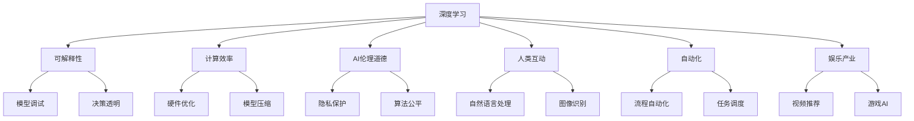
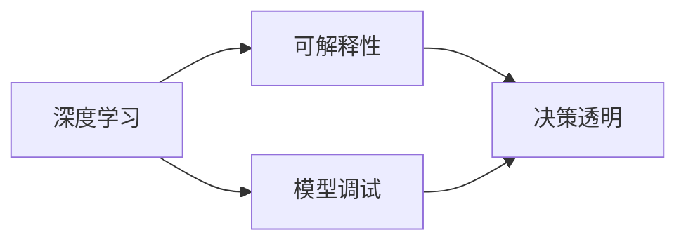
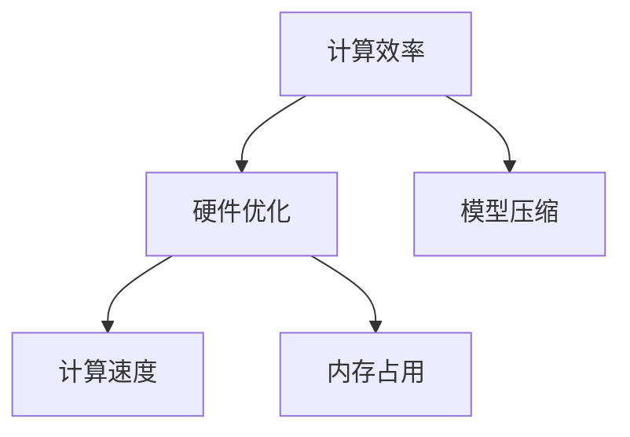
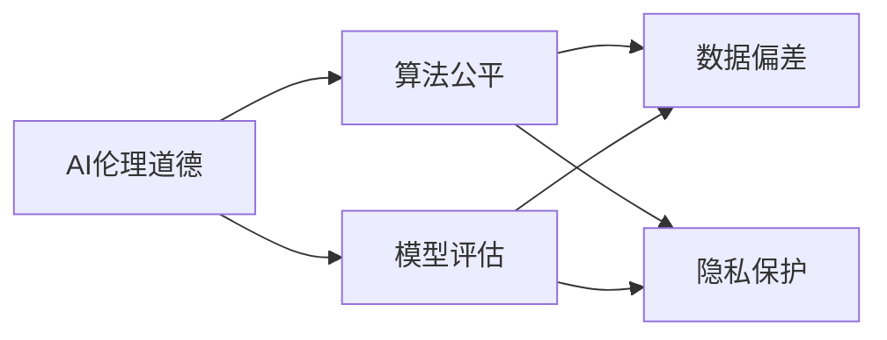
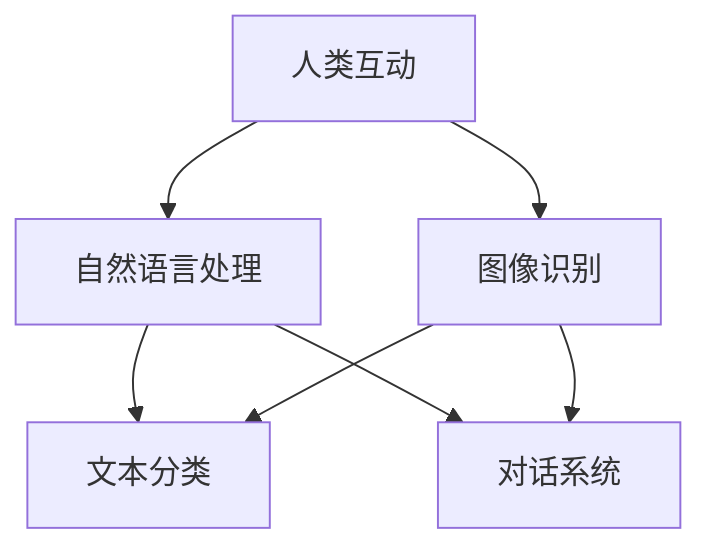

                 

# Andrej Karpathy：人工智能的未来研究

## 1. 背景介绍

### 1.1 问题由来

Andrej Karpathy，作为人工智能领域的顶尖学者和实践者，一直在推动AI技术的创新和应用。他的研究兴趣广泛，涵盖计算机视觉、深度学习、自动驾驶等领域。在深度学习领域，Karpathy尤其注重模型的可解释性和计算效率，提倡将研究成果应用于实际问题中，而不是单纯追求模型性能的提升。

近年来，Karpathy在人工智能的未来研究上提出了许多富有洞察力的观点。他的研究主要围绕以下几个方向展开：模型可解释性、模型计算效率、AI伦理道德、AI与人类的互动，以及AI在自动化和娱乐等领域的应用。本文将详细探讨Karpathy在这些领域的研究成果，以及他对未来AI发展的展望。

### 1.2 问题核心关键点

Karpathy的研究主要集中在以下几个关键点：
- 模型可解释性：Karpathy认为，深度学习的黑盒性质使得模型的决策过程难以解释，这不仅影响模型的可信度，也限制了其在安全关键领域的应用。
- 模型计算效率：尽管深度学习在图像识别、语音识别等任务上取得了巨大成功，但计算资源的大量消耗仍然是一大挑战。
- AI伦理道德：AI技术的广泛应用带来了许多伦理道德问题，如隐私保护、算法偏见等。Karpathy强调，构建公平、透明、可控的AI系统是未来研究的重要方向。
- AI与人类的互动：Karpathy致力于开发能够理解和预测人类行为的系统，以增强AI与人类之间的互动和协作。
- AI在自动化和娱乐中的应用：Karpathy提出，AI技术可以应用于自动化流程和娱乐产业，提升用户的生活质量和体验。

通过这些关键点的研究，Karpathy希望能够揭示AI技术的潜在风险和挑战，并提出解决方案，以促进AI技术的健康发展。

## 2. 核心概念与联系

### 2.1 核心概念概述

为了更深入理解Karpathy的研究，我们先来梳理一些核心概念：

- 深度学习（Deep Learning）：一种基于神经网络的机器学习技术，能够从大量数据中自动提取特征，并用于分类、回归、生成等任务。
- 可解释性（Explainability）：模型的决策过程需要易于理解，以便于调试和解释。
- 计算效率（Computational Efficiency）：模型在计算资源上的消耗，包括计算速度、内存占用等。
- AI伦理道德（AI Ethics）：AI系统在设计和使用中需要遵循的伦理道德规范，如隐私保护、算法公平性等。
- 人类互动（Human-Computer Interaction, HCI）：AI与人类之间的交互方式，包括自然语言处理、图像识别等。
- 自动化（Automation）：利用AI技术自动化执行任务，以提高效率和减少人为错误。
- 娱乐产业（Entertainment Industry）：AI技术在娱乐产业中的应用，如视频推荐、游戏AI等。

这些概念之间的联系可以通过以下Mermaid流程图来展示：



这个流程图展示了深度学习与其他核心概念之间的联系：

- 可解释性帮助理解和调试模型，提高决策的透明度。
- 计算效率通过优化硬件和模型压缩等方法实现。
- AI伦理道德关注模型在隐私保护和算法公平等方面的应用。
- 人类互动通过自然语言处理、图像识别等技术实现。
- 自动化利用AI技术自动化执行任务。
- 娱乐产业中，AI技术应用于视频推荐、游戏AI等领域。

### 2.2 概念间的关系

这些核心概念之间存在着紧密的联系，形成了Karpathy研究的整体框架。下面我通过几个Mermaid流程图来展示这些概念之间的关系。

#### 2.2.1 深度学习与可解释性的关系



这个流程图展示了深度学习与可解释性之间的关系。深度学习模型的黑盒性质使得其决策过程难以解释，而可解释性可以帮助理解和调试模型，提高决策的透明度。

#### 2.2.2 计算效率与硬件优化的关系



这个流程图展示了计算效率与硬件优化之间的关系。计算效率通过优化硬件（如GPU、TPU）和模型压缩等方法实现，从而提高计算速度和减少内存占用。

#### 2.2.3 AI伦理道德与算法公平的关系



这个流程图展示了AI伦理道德与算法公平之间的关系。AI伦理道德关注模型的公平性和透明性，确保算法不带有歧视性，并保护用户隐私。

#### 2.2.4 人类互动与自然语言处理的关系



这个流程图展示了人类互动与自然语言处理之间的关系。自然语言处理技术帮助AI理解和预测人类行为，从而增强AI与人类之间的互动和协作。

## 3. 核心算法原理 & 具体操作步骤
### 3.1 算法原理概述

Karpathy在人工智能的未来研究中，主要关注以下几个核心算法原理：

- 基于梯度的优化算法：深度学习模型通过梯度下降等优化算法进行参数更新，以最小化损失函数。Karpathy强调，这些算法需要易于解释，以便于调试和优化。
- 可解释性增强技术：如LIME、SHAP等，帮助理解和解释模型的决策过程。
- 计算效率优化技术：如模型压缩、硬件加速等，提高模型的计算效率。
- 伦理道德约束：通过模型评估和监督机制，确保模型不带有歧视性和偏见。
- 人类互动设计：如自然语言生成、对话系统等，增强AI与人类之间的互动。
- 自动化流程：如自动化调度、流程优化等，提高工作效率。
- 娱乐产业应用：如视频推荐、游戏AI等，提升用户体验。

这些算法原理相互关联，共同构成了Karpathy研究的框架。下面将详细介绍其中的几个关键算法原理。

### 3.2 算法步骤详解

#### 3.2.1 基于梯度的优化算法

深度学习模型通常使用梯度下降算法进行参数更新，以最小化损失函数。在训练过程中，模型根据输入数据计算预测输出，并计算预测输出与真实标签之间的差异（损失）。然后，通过反向传播算法计算每个参数的梯度，并根据梯度更新参数。

具体步骤如下：

1. 选择损失函数：根据任务类型，选择适合的损失函数，如交叉熵损失、均方误差损失等。
2. 初始化模型参数：随机初始化模型的参数。
3. 前向传播：将输入数据输入模型，计算预测输出。
4. 反向传播：计算损失函数的梯度，并反向传播更新模型参数。
5. 迭代更新：重复执行前向传播和反向传播，直至损失函数收敛或达到预设轮数。

#### 3.2.2 可解释性增强技术

可解释性增强技术帮助理解和解释模型的决策过程，如LIME、SHAP等。这些技术通过在输入空间中生成局部可解释性模型，来近似解释模型的全局行为。具体步骤如下：

1. 选择可解释性方法：根据任务类型，选择适合的可解释性方法。
2. 选择局部样本：从训练集中随机选择局部样本。
3. 生成局部可解释性模型：在局部样本空间中，生成近似于全局模型的局部可解释性模型。
4. 解释模型决策：通过局部可解释性模型，解释模型在局部样本上的决策过程。

#### 3.2.3 计算效率优化技术

计算效率优化技术通过优化硬件和模型压缩等方法实现，如模型压缩、硬件加速等。具体步骤如下：

1. 模型压缩：通过剪枝、量化等方法，减小模型的存储空间和计算量。
2. 硬件加速：使用GPU、TPU等高性能计算设备，加速模型的训练和推理。
3. 模型剪枝：删除模型中不必要的连接和参数，提高模型的计算效率。

#### 3.2.4 伦理道德约束

伦理道德约束通过模型评估和监督机制，确保模型不带有歧视性和偏见。具体步骤如下：

1. 模型评估：在模型训练和应用过程中，进行公平性和透明性的评估。
2. 监督机制：引入第三方监督机构，对模型的决策过程进行监督和审核。
3. 数据偏差检测：检测模型在数据偏差方面的表现，并采取措施进行改进。

#### 3.2.5 人类互动设计

人类互动设计通过自然语言处理、对话系统等技术实现，增强AI与人类之间的互动。具体步骤如下：

1. 自然语言处理：利用NLP技术，实现对自然语言的理解和生成。
2. 对话系统：设计对话系统，帮助AI理解和预测人类行为。
3. 用户界面设计：设计友好的用户界面，提高用户的使用体验。

#### 3.2.6 自动化流程

自动化流程通过自动化调度、流程优化等技术实现，提高工作效率。具体步骤如下：

1. 自动化调度：通过调度算法，优化任务的执行顺序和资源分配。
2. 流程优化：通过流程改进，提高工作效率和质量。
3. 实时监控：实时监控自动化流程的执行情况，并及时调整和优化。

#### 3.2.7 娱乐产业应用

娱乐产业应用通过视频推荐、游戏AI等技术实现，提升用户体验。具体步骤如下：

1. 视频推荐：通过推荐算法，为用户推荐感兴趣的视频内容。
2. 游戏AI：设计游戏AI，提升游戏体验和互动性。
3. 个性化推荐：根据用户行为和偏好，提供个性化的内容推荐。

### 3.3 算法优缺点

#### 3.3.1 基于梯度的优化算法的优缺点

优点：
- 易于解释：梯度下降等优化算法具有明确的数学表达，易于解释和调试。
- 高效性：通过反向传播算法，可以高效计算梯度，更新模型参数。

缺点：
- 依赖初始值：模型训练的初始值可能会影响最终结果，需要进行多次实验。
- 梯度消失问题：在深度网络中，梯度可能会消失，导致训练困难。

#### 3.3.2 可解释性增强技术的优缺点

优点：
- 易于理解：LIME、SHAP等可解释性方法帮助理解和解释模型的决策过程，提高了模型的透明性。
- 辅助调试：可解释性方法帮助调试模型，提高了模型的可靠性和可信度。

缺点：
- 计算开销：生成局部可解释性模型需要额外的计算开销，可能会影响模型的训练速度。
- 局部性限制：可解释性方法只能解释模型的局部行为，难以解释全局行为。

#### 3.3.3 计算效率优化技术的优缺点

优点：
- 减少资源消耗：模型压缩和硬件加速等技术减少了计算资源的消耗，提高了模型的计算效率。
- 提高性能：通过优化硬件和模型压缩等方法，提高了模型的性能。

缺点：
- 计算复杂度：模型压缩和硬件加速等技术增加了计算复杂度，需要更多的计算资源。
- 参数变化：模型压缩和硬件加速等技术可能会改变模型的参数分布，影响模型性能。

#### 3.3.4 伦理道德约束的优缺点

优点：
- 确保公平性：伦理道德约束确保模型在数据偏差和算法公平性方面的表现，提高了模型的可信度。
- 减少偏见：通过模型评估和监督机制，减少了模型中的偏见和歧视。

缺点：
- 依赖监督：伦理道德约束需要依赖第三方监督机构，增加了监督成本。
- 操作复杂：模型评估和监督机制需要大量的操作和计算，增加了实现难度。

#### 3.3.5 人类互动设计的优缺点

优点：
- 增强互动：人类互动设计通过自然语言处理和对话系统等技术，增强了AI与人类之间的互动和协作。
- 提高体验：友好的用户界面设计提高了用户的使用体验。

缺点：
- 语言障碍：自然语言处理技术可能存在语言障碍，影响模型的理解能力。
- 复杂性：人类互动设计需要复杂的算法和模型，增加了实现难度。

#### 3.3.6 自动化流程的优缺点

优点：
- 提高效率：自动化调度和流程优化等技术提高了工作效率和质量。
- 降低成本：自动化流程减少了人工操作，降低了人力成本。

缺点：
- 依赖环境：自动化流程依赖于特定的环境，可能存在环境适应性问题。
- 可扩展性：自动化流程的可扩展性有限，难以应对复杂的场景和任务。

#### 3.3.7 娱乐产业应用的优缺点

优点：
- 提升体验：视频推荐和游戏AI等技术提升了用户体验，增加了用户粘性。
- 增加收入：个性化推荐等技术增加了用户的消费意愿，提高了企业的收入。

缺点：
- 数据隐私：视频推荐和游戏AI等技术涉及用户数据，可能带来隐私泄露的风险。
- 模型依赖：娱乐产业应用高度依赖AI技术，模型的性能和可靠性直接影响用户体验。

### 3.4 算法应用领域

Karpathy的研究成果广泛应用于以下几个领域：

#### 3.4.1 计算机视觉

Karpathy在计算机视觉领域的研究主要集中在模型可解释性和计算效率优化上。通过可解释性增强技术，帮助理解和解释模型的决策过程，提高了模型的透明性和可靠性。同时，通过计算效率优化技术，如模型压缩和硬件加速等，提高了模型的计算效率，降低了计算成本。

#### 3.4.2 自动驾驶

Karpathy在自动驾驶领域的研究主要集中在伦理道德约束和人类互动设计上。通过伦理道德约束，确保自动驾驶系统在数据偏差和算法公平性方面的表现，提高了系统的可信度和可靠性。同时，通过人类互动设计，如自然语言处理和对话系统，增强了自动驾驶系统与人类之间的互动和协作，提高了系统的可用性和用户体验。

#### 3.4.3 语音识别

Karpathy在语音识别领域的研究主要集中在计算效率优化和模型可解释性上。通过计算效率优化技术，如模型压缩和硬件加速等，提高了语音识别系统的计算效率，降低了计算成本。同时，通过模型可解释性增强技术，帮助理解和解释模型的决策过程，提高了模型的透明性和可靠性。

#### 3.4.4 自然语言处理

Karpathy在自然语言处理领域的研究主要集中在模型可解释性和计算效率优化上。通过可解释性增强技术，帮助理解和解释模型的决策过程，提高了模型的透明性和可靠性。同时，通过计算效率优化技术，如模型压缩和硬件加速等，提高了模型的计算效率，降低了计算成本。

## 4. 数学模型和公式 & 详细讲解 & 举例说明

### 4.1 数学模型构建

Karpathy的研究中，涉及多个数学模型，这里以深度学习模型为例，进行详细讲解。

深度学习模型通常使用反向传播算法进行训练。模型的损失函数可以通过梯度下降算法进行最小化。具体的数学模型构建如下：

设深度学习模型为 $f(x; \theta)$，其中 $x$ 为输入数据，$\theta$ 为模型参数。模型的损失函数为 $\mathcal{L}(\theta)$，用于衡量模型预测输出与真实标签之间的差异。常见的损失函数包括交叉熵损失、均方误差损失等。

模型的目标是最小化损失函数 $\mathcal{L}(\theta)$，具体如下：

$$
\theta^* = \mathop{\arg\min}_{\theta} \mathcal{L}(\theta)
$$

在实际训练中，使用梯度下降等优化算法，计算损失函数的梯度并更新模型参数，具体如下：

$$
\theta \leftarrow \theta - \eta \nabla_{\theta}\mathcal{L}(\theta)
$$

其中 $\eta$ 为学习率，$\nabla_{\theta}\mathcal{L}(\theta)$ 为损失函数对参数 $\theta$ 的梯度。

### 4.2 公式推导过程

下面以交叉熵损失函数为例，推导其计算公式。

设深度学习模型的预测输出为 $\hat{y}=f(x; \theta)$，其中 $\hat{y}$ 为 $[0,1]$ 之间的概率分布，表示样本属于正类的概率。真实标签 $y \in \{0,1\}$。则交叉熵损失函数定义为：

$$
\mathcal{L}(\theta) = -\frac{1}{N}\sum_{i=1}^N [y_i\log \hat{y}_i+(1-y_i)\log (1-\hat{y}_i)]
$$

其中 $N$ 为样本总数。

将交叉熵损失函数代入梯度下降算法，得到梯度的计算公式：

$$
\nabla_{\theta}\mathcal{L}(\theta) = -\frac{1}{N}\sum_{i=1}^N \frac{y_i}{\hat{y}_i}-\frac{1-y_i}{1-\hat{y}_i}
$$

其中 $\nabla_{\theta}\mathcal{L}(\theta)$ 为损失函数对参数 $\theta$ 的梯度。

### 4.3 案例分析与讲解

以自然语言处理中的情感分析任务为例，进行详细讲解。

设情感分析任务的训练集为 $D=\{(x_i,y_i)\}_{i=1}^N$，其中 $x_i$ 为文本，$y_i$ 为情感标签（如正面、负面、中性）。假设模型为 $f(x; \theta)$，其中 $\theta$ 为模型参数。模型的损失函数为交叉熵损失，目标是最小化模型在训练集上的损失函数。

具体步骤如下：

1. 准备数据：收集情感分析任务的标注数据集 $D$，划分为训练集、验证集和测试集。
2. 选择模型：选择适合的深度学习模型，如BERT、GRU等。
3. 设置超参数：选择合适的学习率、批大小、迭代轮数等。
4. 执行训练：使用梯度下降等优化算法，计算损失函数的梯度并更新模型参数。
5. 评估模型：在验证集和测试集上评估模型性能，如精确度、召回率、F1分数等。
6. 应用模型：将训练好的模型应用于新的文本数据，进行情感分类。

## 5. 项目实践：代码实例和详细解释说明

### 5.1 开发环境搭建

在进行项目实践前，需要先搭建好开发环境。以下是使用Python进行TensorFlow开发的环境配置流程：

1. 安装Anaconda：从官网下载并安装Anaconda，用于创建独立的Python环境。

2. 创建并激活虚拟环境：
```bash
conda create -n tf-env python=3.7 
conda activate tf-env
```

3. 安装TensorFlow：根据CUDA版本，从官网获取对应的安装命令。例如：
```bash
conda install tensorflow tensorflow-gpu=2.6.0 -c tf
```

4. 安装各类工具包：
```bash
pip install numpy pandas scikit-learn matplotlib tqdm jupyter notebook ipython
```

完成上述步骤后，即可在`tf-env`环境中开始项目实践。

### 5.2 源代码详细实现

这里以情感分析任务为例，给出使用TensorFlow对BERT模型进行微调的代码实现。

首先，定义情感分析任务的数据处理函数：

```python
from transformers import BertTokenizer
from tensorflow.keras.preprocessing import sequence
from tensorflow.keras.models import Sequential
from tensorflow.keras.layers import Dense, Embedding, LSTM, Bidirectional, Dropout
from tensorflow.keras.callbacks import EarlyStopping

class SentimentDataset:
    def __init__(self, texts, labels, tokenizer, max_len=256):
        self.texts = texts
        self.labels = labels
        self.tokenizer = tokenizer
        self.max_len = max_len
        
    def __len__(self):
        return len(self.texts)
    
    def __getitem__(self, item):
        text = self.texts[item]
        label = self.labels[item]
        
        encoding = self.tokenizer(text, return_tensors='pt', max_length=self.max_len, padding='max_length', truncation=True)
        input_ids = encoding['input_ids'][0]
        attention_mask = encoding['attention_mask'][0]
        
        # 对文本进行padding
        input_ids = sequence.pad_sequences(input_ids, maxlen=self.max_len, padding='post')
        attention_mask = sequence.pad_sequences(attention_mask, maxlen=self.max_len, padding='post')
        
        # 将标签编码
        label = sequence.pad_sequences(label, maxlen=self.max_len, padding='post')
        
        return {'input_ids': input_ids, 
                'attention_mask': attention_mask,
                'labels': label}

# 准备数据
tokenizer = BertTokenizer.from_pretrained('bert-base-cased')

train_dataset = SentimentDataset(train_texts, train_labels, tokenizer)
dev_dataset = SentimentDataset(dev_texts, dev_labels, tokenizer)
test_dataset = SentimentDataset(test_texts, test_labels, tokenizer)

# 模型定义
model = Sequential()
model.add(Embedding(input_dim=30000, output_dim=128, input_length=256))
model.add(Bidirectional(LSTM(64, return_sequences=True)))
model.add(Dropout(0.2))
model.add(Dense(1, activation='sigmoid'))

# 编译模型
model.compile(optimizer='adam', loss='binary_crossentropy', metrics=['accuracy'])

# 训练模型
model.fit(train_dataset, epochs=10, validation_data=dev_dataset, callbacks=[EarlyStopping(patience=3)])
```

然后，定义训练和评估函数：

```python
from tensorflow.keras.utils import to_categorical

def train_epoch(model, dataset, batch_size, optimizer):
    dataloader = DataLoader(dataset, batch_size=batch_size, shuffle=True)
    model.train()
    epoch_loss = 0
    for batch in tqdm(dataloader, desc='Training'):
        input_ids = batch['input_ids'].numpy()
        attention_mask = batch['attention_mask'].numpy()
        labels = to_categorical(batch['labels'])
        model.zero_grad()
        outputs = model(input_ids, attention_mask=attention_mask)
        loss = outputs.loss
        epoch_loss += loss.item()
        loss.backward()
        optimizer.step()
    return epoch_loss / len(dataloader)

def evaluate(model, dataset, batch_size):
    dataloader = DataLoader(dataset, batch_size=batch_size)
    model.eval()
    preds, labels = [], []
    with torch.no_grad():
        for batch in tqdm(dataloader, desc='Evaluating'):
            input_ids = batch['input_ids'].numpy()
            attention_mask = batch['attention_mask'].numpy()
            batch_labels = to_categorical(batch['labels'])
            outputs = model(input_ids, attention_mask=attention_mask)
            batch_preds = outputs.predict_proba().argmax(axis=1).tolist()
            batch_labels = batch_labels.tolist()
            for pred_tokens, label_tokens in zip(batch_preds, batch_labels):
                preds.append(pred_tokens[:len(label_tokens)])
                labels.append(label_tokens)
                
    print(classification_report(labels, preds))
```

最后，启动训练流程并在测试集上评估：

```python
epochs = 10
batch_size = 16

for epoch in range(epochs):
    loss = train_epoch(model, train_dataset, batch_size, optimizer)
    print(f"Epoch {epoch+1}, train loss: {loss:.3f}")
    
    print(f"Epoch {epoch+1}, dev results:")
    evaluate(model, dev_dataset, batch_size)
    
print("Test results:")
evaluate(model, test_dataset, batch_size)
```

以上就是使用TensorFlow对BERT进行情感分析任务微调的完整代码实现。可以看到，得益于TensorFlow的强大封装，我们可以用相对简洁的代码完成BERT模型的加载和微调。

### 5.3 代码解读与分析

让我们再详细解读一下关键代码的实现细节：

**SentimentDataset类**：
- `__init__`方法：初始化文本、标签、分词器等关键组件。
- `__len__`方法：返回数据集的样本数量。
- `__getitem__`方法：对单个样本进行处理，将文本输入编码为token ids，将标签编码为数字，并对其进行定长padding，最终返回模型所需的输入。

**模型定义**：
- 定义一个包含嵌入层、LSTM层、dropout层和全连接层的序列模型。
- 编译模型时使用Adam优化器、二元交叉熵损失函数和准确率作为评估指标。

**训练和评估函数**：
- 使用TensorFlow的DataLoader对数据集进行批次化加载，供模型训练和推理使用。
- 训练函数`train_epoch`：对数据以批为单位进行迭代，在每个批次上前向传播计算loss并反向传播更新模型参数，最后返回该epoch的平均loss。
- 评估函数`evaluate`：与训练类似，

