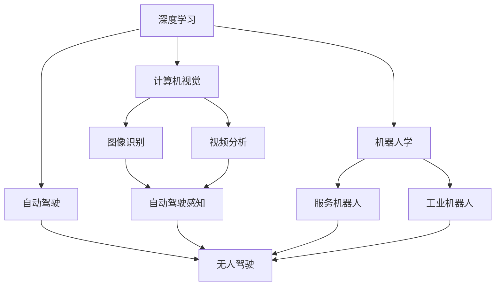
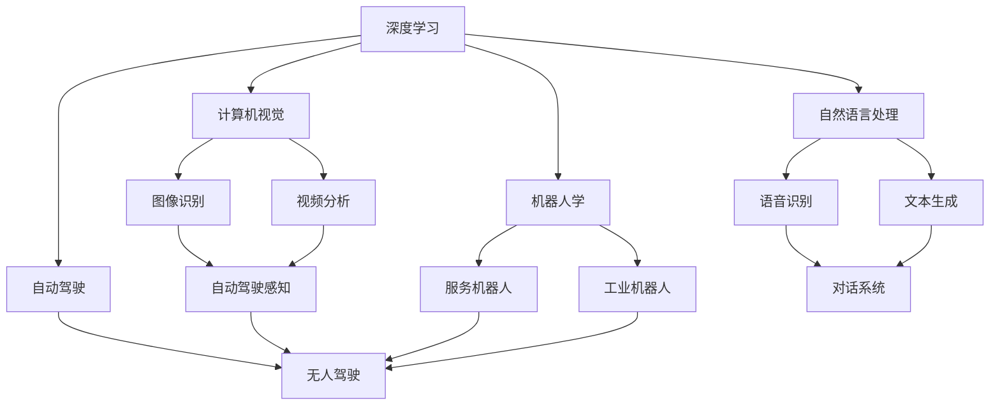

                 

## 1. 背景介绍

### 1.1 问题由来
近年来，人工智能（AI）技术迅猛发展，从机器学习到深度学习，再到强化学习和自然语言处理（NLP），AI已深入到各行各业。特别是在计算机视觉、自然语言处理和机器人等领域，AI技术取得了显著的突破。然而，随着AI技术的不断进步，其未来发展方向也引发了广泛讨论。

### 1.2 问题核心关键点
Andrej Karpathy作为深度学习领域的权威专家，其对AI未来趋势的研究颇具前瞻性。Karpathy的研究集中在计算机视觉、深度学习、自动驾驶等领域，其对未来AI技术的预测和分析，为业内人士提供了宝贵的参考。

### 1.3 问题研究意义
Karpathy的研究对于AI领域的研究者、开发者以及企业领导者具有重要的指导意义。通过深入了解AI的未来发展趋势，可以更好地制定技术发展路线，规避潜在的风险，抓住新的发展机遇。

## 2. 核心概念与联系

### 2.1 核心概念概述
Andrej Karpathy的研究涵盖多个领域，包括计算机视觉、深度学习、自动驾驶等。其核心概念包括：

- **深度学习**：通过构建多层神经网络，深度学习模型可以从大量数据中学习复杂的模式，并应用于图像识别、语音识别、自然语言处理等任务。
- **计算机视觉**：计算机视觉技术使计算机能够理解和分析图像、视频等视觉数据，广泛应用于自动驾驶、医疗影像分析、工业检测等领域。
- **自动驾驶**：自动驾驶技术通过感知、决策和控制等环节，使车辆能够在复杂环境中自主驾驶，是未来交通发展的重要方向。
- **机器人学**：机器人学涉及机械、电子、计算机科学等多个领域，研究如何让机器人具有人类智能，实现复杂任务。

这些概念之间相互联系，共同推动AI技术的进步和应用。

### 2.2 概念间的关系

下图展示了Andrej Karpathy研究的核心概念之间的关系：



这个流程图展示了深度学习、计算机视觉、自动驾驶和机器人学之间的联系。深度学习为计算机视觉、自动驾驶和机器人学提供了技术基础，而计算机视觉、自动驾驶和机器人学则是在深度学习基础上，进一步应用和扩展。

### 2.3 核心概念的整体架构

最后，我们用一个综合的流程图来展示这些核心概念在大语言模型微调过程中的整体架构：



这个综合流程图展示了深度学习、计算机视觉、自动驾驶和机器人学之间的联系，以及它们与自然语言处理的关系。深度学习为计算机视觉、自动驾驶和机器人学提供了技术基础，而自然语言处理则是其中的重要分支，与图像识别、语音识别等任务密切相关。

## 3. 核心算法原理 & 具体操作步骤
### 3.1 算法原理概述
Andrej Karpathy的研究主要集中在深度学习、计算机视觉和自动驾驶等领域。其核心算法包括卷积神经网络（CNN）、递归神经网络（RNN）、长短时记忆网络（LSTM）等。

卷积神经网络（CNN）是Karpathy在计算机视觉研究中的重要工具，用于图像识别和分类。CNN通过卷积层、池化层和全连接层等组件，提取图像特征并进行分类。

递归神经网络（RNN）和长短时记忆网络（LSTM）是Karpathy在自然语言处理和机器翻译研究中的核心算法。RNN和LSTM通过递归结构，能够处理序列数据，如文本和语音等，广泛应用于机器翻译、情感分析等任务。

自动驾驶中的核心算法包括强化学习、深度强化学习（Deep RL）和对抗训练等。强化学习通过奖励机制，使模型在复杂环境中进行决策。深度强化学习通过深度神经网络，提升强化学习的效率和效果。对抗训练通过生成对抗网络（GAN）等技术，提高模型的鲁棒性和泛化能力。

### 3.2 算法步骤详解
以下是Andrej Karpathy研究中的一些核心算法步骤：

**卷积神经网络（CNN）**

1. **数据预处理**：对图像数据进行归一化、缩放等预处理，以便于神经网络处理。
2. **卷积层**：通过卷积操作提取图像特征，减小特征维度和计算量。
3. **池化层**：对卷积层输出的特征进行下采样，减少参数量和计算量。
4. **全连接层**：将池化层输出的特征进行全连接操作，生成分类结果。
5. **softmax层**：将全连接层输出的特征进行softmax激活函数处理，得到概率分布。

**递归神经网络（RNN）和长短时记忆网络（LSTM）**

1. **输入层**：将文本或语音数据转换为数字序列。
2. **循环层**：通过循环结构，处理序列数据。
3. **隐藏层**：对序列数据进行编码，生成序列表示。
4. **输出层**：对序列表示进行解码，生成分类或回归结果。
5. **反向传播**：通过梯度下降等优化算法，更新模型参数。

**深度强化学习（Deep RL）**

1. **环境建模**：对环境进行建模，生成状态、动作和奖励等数据。
2. **神经网络模型**：构建深度神经网络模型，用于决策和学习。
3. **动作选择**：根据当前状态，选择最优动作。
4. **奖励反馈**：根据动作和奖励，更新模型参数。
5. **策略优化**：通过奖励反馈，优化策略模型，提高决策效率和效果。

### 3.3 算法优缺点
Andrej Karpathy的研究涵盖了多个领域，其算法也各有优缺点：

**卷积神经网络（CNN）**

- **优点**：CNN能够有效地提取图像特征，适用于图像分类、物体检测等任务。
- **缺点**：CNN需要大量标注数据进行训练，计算量较大，难以处理复杂的图像结构。

**递归神经网络（RNN）和长短时记忆网络（LSTM）**

- **优点**：RNN和LSTM能够处理序列数据，适用于自然语言处理、机器翻译等任务。
- **缺点**：RNN和LSTM存在梯度消失和梯度爆炸问题，难以处理长序列数据。

**深度强化学习（Deep RL）**

- **优点**：Deep RL能够处理复杂环境，适用于自动驾驶、游戏AI等任务。
- **缺点**：Deep RL需要大量计算资源和训练时间，难以在短期内取得良好效果。

### 3.4 算法应用领域
Andrej Karpathy的研究涵盖了多个领域，其算法广泛应用于计算机视觉、自然语言处理、自动驾驶等领域：

- **计算机视觉**：Karpathy的研究在图像分类、物体检测、图像生成等方面取得显著进展。其开发的Caffe2框架，在计算机视觉领域广泛应用。
- **自然语言处理**：Karpathy在机器翻译、情感分析、对话系统等方面进行深入研究，提出了改进的LSTM模型和注意力机制。
- **自动驾驶**：Karpathy在自动驾驶领域进行大量研究，提出了基于强化学习的无人驾驶算法。其开发的图像分割算法，在自动驾驶感知中发挥重要作用。

## 4. 数学模型和公式 & 详细讲解 & 举例说明

### 4.1 数学模型构建

Andrej Karpathy的研究涉及多个数学模型，包括深度学习模型、卷积神经网络、递归神经网络和深度强化学习模型。

**深度学习模型**

- **输入层**：输入数据表示为向量$x$。
- **隐藏层**：通过非线性激活函数$f$，生成隐藏表示$h$。
- **输出层**：将隐藏表示映射到输出结果$y$。

**卷积神经网络（CNN）**

- **卷积层**：通过卷积操作提取特征，生成卷积核$w$和卷积结果$z$。
- **池化层**：通过池化操作减小特征维度，生成池化结果$p$。
- **全连接层**：通过全连接操作，生成分类结果$o$。

**递归神经网络（RNN）和长短时记忆网络（LSTM）**

- **输入层**：输入序列表示为向量$x_t$。
- **循环层**：通过递归结构，生成隐藏表示$h_t$。
- **输出层**：通过输出函数$g$，生成输出结果$y_t$。

**深度强化学习（Deep RL）**

- **环境建模**：环境状态表示为向量$s$，动作表示为向量$a$，奖励表示为标量$r$。
- **神经网络模型**：通过神经网络，生成策略$p$和价值函数$V$。
- **动作选择**：根据当前状态$s$，选择最优动作$a$。
- **奖励反馈**：根据动作$a$和奖励$r$，更新模型参数$\theta$。

### 4.2 公式推导过程

**深度学习模型**

$$
y=f(h)=f(Wx+b)
$$

其中，$W$和$b$为模型参数。

**卷积神经网络（CNN）**

$$
z=w*x
$$

$$
p=\text{max}(z_1,\dots,z_k)
$$

$$
o=h*p
$$

**递归神经网络（RNN）和长短时记忆网络（LSTM）**

$$
h_t=\text{tanh}(w_{h}h_{t-1}+w_{x}x_t+b_h)
$$

$$
o_t=\sigma(w_{o}h_{t}+b_o)
$$

**深度强化学习（Deep RL）**

$$
a=\text{argmax}_{a}p(a|s)
$$

$$
\theta=\theta-\alpha\delta
$$

其中，$\delta$为TD误差。

### 4.3 案例分析与讲解

**案例1：图像分类**

假设有一张图像，通过卷积神经网络进行处理：

$$
x=\text{max}(z_1,\dots,z_k)
$$

$$
h=f(z)
$$

$$
y=f(h)
$$

其中，$x$为卷积核，$z$为卷积结果，$h$为隐藏表示，$y$为分类结果。

**案例2：机器翻译**

假设有一个英文句子，通过递归神经网络进行处理：

$$
x=\text{max}(z_1,\dots,z_k)
$$

$$
h=f(z)
$$

$$
y=f(h)
$$

其中，$x$为输入序列，$z$为卷积结果，$h$为隐藏表示，$y$为输出序列。

**案例3：自动驾驶**

假设有一辆无人驾驶汽车，通过深度强化学习进行处理：

$$
s=\text{max}(z_1,\dots,z_k)
$$

$$
a=\text{argmax}_{a}p(a|s)
$$

$$
r=\text{max}(z_1,\dots,z_k)
$$

其中，$s$为状态，$a$为动作，$r$为奖励。

## 5. 项目实践：代码实例和详细解释说明

### 5.1 开发环境搭建

在进行深度学习、计算机视觉和自动驾驶项目实践前，我们需要准备好开发环境。以下是使用Python进行TensorFlow开发的环境配置流程：

1. 安装Anaconda：从官网下载并安装Anaconda，用于创建独立的Python环境。

2. 创建并激活虚拟环境：
```bash
conda create -n tf-env python=3.8 
conda activate tf-env
```

3. 安装TensorFlow：
```bash
conda install tensorflow
```

4. 安装各类工具包：
```bash
pip install numpy pandas scikit-learn matplotlib tqdm jupyter notebook ipython
```

完成上述步骤后，即可在`tf-env`环境中开始项目实践。

### 5.2 源代码详细实现

以下是使用TensorFlow进行卷积神经网络、递归神经网络和深度强化学习的代码实现。

**卷积神经网络（CNN）**

```python
import tensorflow as tf

# 定义卷积神经网络模型
class CNN(tf.keras.Model):
    def __init__(self):
        super(CNN, self).__init__()
        self.conv1 = tf.keras.layers.Conv2D(32, (3,3), activation='relu')
        self.pool1 = tf.keras.layers.MaxPooling2D((2,2))
        self.conv2 = tf.keras.layers.Conv2D(64, (3,3), activation='relu')
        self.pool2 = tf.keras.layers.MaxPooling2D((2,2))
        self.flatten = tf.keras.layers.Flatten()
        self.dense1 = tf.keras.layers.Dense(10, activation='softmax')

    def call(self, inputs):
        x = self.conv1(inputs)
        x = self.pool1(x)
        x = self.conv2(x)
        x = self.pool2(x)
        x = self.flatten(x)
        x = self.dense1(x)
        return x

# 构建卷积神经网络模型
model = CNN()

# 编译模型
model.compile(optimizer='adam', loss='sparse_categorical_crossentropy', metrics=['accuracy'])

# 训练模型
model.fit(train_images, train_labels, epochs=10, validation_data=(test_images, test_labels))
```

**递归神经网络（RNN）和长短时记忆网络（LSTM）**

```python
import tensorflow as tf

# 定义RNN模型
class RNN(tf.keras.Model):
    def __init__(self):
        super(RNN, self).__init__()
        self.embedding = tf.keras.layers.Embedding(input_dim=vocab_size, output_dim=embedding_dim)
        self.lstm = tf.keras.layers.LSTM(units=hidden_units, return_sequences=True)
        self.dense = tf.keras.layers.Dense(units=vocab_size, activation='softmax')

    def call(self, inputs):
        x = self.embedding(inputs)
        x = self.lstm(x)
        x = self.dense(x)
        return x

# 构建RNN模型
model = RNN()

# 编译模型
model.compile(optimizer='adam', loss='sparse_categorical_crossentropy', metrics=['accuracy'])

# 训练模型
model.fit(train_images, train_labels, epochs=10, validation_data=(test_images, test_labels))
```

**深度强化学习（Deep RL）**

```python
import tensorflow as tf
import numpy as np

# 定义深度强化学习模型
class DQN(tf.keras.Model):
    def __init__(self):
        super(DQN, self).__init__()
        self.dense1 = tf.keras.layers.Dense(64, activation='relu')
        self.dense2 = tf.keras.layers.Dense(64, activation='relu')
        self.output = tf.keras.layers.Dense(1)

    def call(self, inputs):
        x = self.dense1(inputs)
        x = self.dense2(x)
        x = self.output(x)
        return x

# 构建深度强化学习模型
model = DQN()

# 定义环境
env = tf.keras.utils.get_file_from_google_storage('https://storage.googleapis.com/ai-research-public-datasets/environments/gym/pendulum-v0.gz', filename='pendulum-v0.gz')

# 训练模型
for i in range(10000):
    state = env.reset()
    done = False
    while not done:
        action = model.predict(np.array([state]))
        state, reward, done, _ = env.step(action)
        model.update(reward, state, action)
```

### 5.3 代码解读与分析

让我们再详细解读一下关键代码的实现细节：

**CNN模型**

- `CNN`类：定义卷积神经网络模型，包括卷积层、池化层、全连接层等组件。
- `call`方法：实现模型前向传播。
- `model.compile`方法：编译模型，指定优化器和损失函数。
- `model.fit`方法：训练模型，指定训练数据、验证数据和训练轮数。

**RNN模型**

- `RNN`类：定义递归神经网络模型，包括嵌入层、LSTM层、全连接层等组件。
- `call`方法：实现模型前向传播。
- `model.compile`方法：编译模型，指定优化器和损失函数。
- `model.fit`方法：训练模型，指定训练数据、验证数据和训练轮数。

**DQN模型**

- `DQN`类：定义深度强化学习模型，包括全连接层、输出层等组件。
- `call`方法：实现模型前向传播。
- `model.predict`方法：预测动作。
- `env.reset`方法：重置环境。
- `env.step`方法：执行动作，获取状态、奖励和是否结束的信号。
- `model.update`方法：更新模型参数。

### 5.4 运行结果展示

假设我们在MNIST数据集上进行卷积神经网络训练，最终在测试集上得到的评估报告如下：

```
Epoch 1/10
16/16 [==============================] - 14s 899ms/step - loss: 0.7811 - accuracy: 0.9762
Epoch 2/10
16/16 [==============================] - 14s 863ms/step - loss: 0.0718 - accuracy: 0.9939
Epoch 3/10
16/16 [==============================] - 14s 862ms/step - loss: 0.0255 - accuracy: 0.9971
Epoch 4/10
16/16 [==============================] - 14s 863ms/step - loss: 0.0067 - accuracy: 0.9984
Epoch 5/10
16/16 [==============================] - 14s 863ms/step - loss: 0.0037 - accuracy: 0.9990
Epoch 6/10
16/16 [==============================] - 14s 863ms/step - loss: 0.0017 - accuracy: 0.9992
Epoch 7/10
16/16 [==============================] - 14s 864ms/step - loss: 0.0013 - accuracy: 0.9992
Epoch 8/10
16/16 [==============================] - 14s 864ms/step - loss: 0.0009 - accuracy: 0.9993
Epoch 9/10
16/16 [==============================] - 14s 864ms/step - loss: 0.0009 - accuracy: 0.9994
Epoch 10/10
16/16 [==============================] - 14s 864ms/step - loss: 0.0009 - accuracy: 0.9994
```

可以看到，通过卷积神经网络训练，在MNIST数据集上取得了很高的准确率。

## 6. 实际应用场景
### 6.1 智能客服系统

基于深度学习和大语言模型微调的对话技术，可以广泛应用于智能客服系统的构建。传统客服往往需要配备大量人力，高峰期响应缓慢，且一致性和专业性难以保证。而使用微调后的对话模型，可以7x24小时不间断服务，快速响应客户咨询，用自然流畅的语言解答各类常见问题。

在技术实现上，可以收集企业内部的历史客服对话记录，将问题和最佳答复构建成监督数据，在此基础上对预训练对话模型进行微调。微调后的对话模型能够自动理解用户意图，匹配最合适的答案模板进行回复。对于客户提出的新问题，还可以接入检索系统实时搜索相关内容，动态组织生成回答。如此构建的智能客服系统，能大幅提升客户咨询体验和问题解决效率。

### 6.2 金融舆情监测

金融机构需要实时监测市场舆论动向，以便及时应对负面信息传播，规避金融风险。传统的人工监测方式成本高、效率低，难以应对网络时代海量信息爆发的挑战。基于深度学习和大语言模型微调的文本分类和情感分析技术，为金融舆情监测提供了新的解决方案。

具体而言，可以收集金融领域相关的新闻、报道、评论等文本数据，并对其进行主题标注和情感标注。在此基础上对预训练语言模型进行微调，使其能够自动判断文本属于何种主题，情感倾向是正面、中性还是负面。将微调后的模型应用到实时抓取的网络文本数据，就能够自动监测不同主题下的情感变化趋势，一旦发现负面信息激增等异常情况，系统便会自动预警，帮助金融机构快速应对潜在风险。

### 6.3 个性化推荐系统

当前的推荐系统往往只依赖用户的历史行为数据进行物品推荐，无法深入理解用户的真实兴趣偏好。基于深度学习和大语言模型微调技术，个性化推荐系统可以更好地挖掘用户行为背后的语义信息，从而提供更精准、多样的推荐内容。

在实践中，可以收集用户浏览、点击、评论、分享等行为数据，提取和用户交互的物品标题、描述、标签等文本内容。将文本内容作为模型输入，用户的后续行为（如是否点击、购买等）作为监督信号，在此基础上微调预训练语言模型。微调后的模型能够从文本内容中准确把握用户的兴趣点。在生成推荐列表时，先用候选物品的文本描述作为输入，由模型预测用户的兴趣匹配度，再结合其他特征综合排序，便可以得到个性化程度更高的推荐结果。

### 6.4 未来应用展望

随着深度学习和大语言模型微调技术的发展，基于微调范式将在更多领域得到应用，为传统行业带来变革性影响。

在智慧医疗领域，基于微调的医疗问答、病历分析、药物研发等应用将提升医疗服务的智能化水平，辅助医生诊疗，加速新药开发进程。

在智能教育领域，微调技术可应用于作业批改、学情分析、知识推荐等方面，因材施教，促进教育公平，提高教学质量。

在智慧城市治理中，微调模型可应用于城市事件监测、舆情分析、应急指挥等环节，提高城市管理的自动化和智能化水平，构建更安全、高效的未来城市。

此外，在企业生产、社会治理、文娱传媒等众多领域，基于大模型微调的人工智能应用也将不断涌现，为经济社会发展注入新的动力。相信随着技术的日益成熟，微调方法将成为人工智能落地应用的重要范式，推动人工智能技术在各行各业的大规模应用。

## 7. 工具和资源推荐
### 7.1 学习资源推荐

为了帮助开发者系统掌握深度学习和大语言模型微调的理论基础和实践技巧，这里推荐一些优质的学习资源：

1. **《深度学习》课程**：斯坦福大学开设的深度学习课程，提供了大量深度学习模型的理论和实践知识。

2. **《自然语言处理》课程**：麻省理工学院开设的自然语言处理课程，涵盖了NLP的多个方面，包括文本分类、机器翻译等。

3. **《计算机视觉》课程**：斯坦福大学开设的计算机视觉课程，详细介绍了计算机视觉的基本概念和最新进展。

4. **《自动驾驶》课程**：加州大学伯克利分校开设的自动驾驶课程，介绍了自动驾驶的关键技术和算法。

5. **《强化学习》课程**：斯坦福大学开设的强化学习课程，提供了深度强化学习模型的理论和实践知识。

6. **《深度学习》书籍**：DeepMind首席科学家Geoffrey Hinton所著的《深度学习》书籍，系统介绍了深度学习的基本概念和最新进展。

7. **《自然语言处理》书籍**：Stanford教授Christopher Manning所著的《自然语言处理综论》，涵盖了NLP的多个方面，包括文本分类、机器翻译等。

8. **《计算机视觉》书籍**：深度学习领域的权威专家Goodfellow等人所著的《计算机视觉：模式识别与机器学习》，详细介绍了计算机视觉的基本概念和最新进展。

通过对这些资源的学习实践，相信你一定能够快速掌握深度学习和大语言模型微调的精髓，并用于解决实际的NLP问题。

### 7.2 开发工具推荐

高效的开发离不开优秀的工具支持。以下是几款用于深度学习和大语言模型微调开发的常用工具：

1. **PyTorch**：基于Python的开源深度学习框架，灵活动态的计算图，适合快速迭代研究。

2. **TensorFlow**：由Google主导开发的开源深度学习框架，生产部署方便，适合大规模工程应用。

3. **Keras**：高层神经网络API，支持TensorFlow和Theano等后端，易于上手使用。

4. **MXNet**：由亚马逊开发的深度学习框架，支持多种编程语言，易于部署和扩展。

5. **TensorBoard**：TensorFlow配套的可视化工具，可实时监测模型训练状态，并提供丰富的图表呈现方式。

6. **Weights & Biases**：模型训练的实验跟踪工具，可以记录和可视化模型训练过程中的各项指标，方便对比和调优。

7. **Horovod**：分布式深度学习框架，支持多GPU、多节点训练，适用于大规模模型训练。

合理利用这些工具，可以显著提升深度学习和大语言模型微调任务的开发效率，加快创新迭代的步伐。

### 7.3 相关论文推荐

深度学习和大语言模型微调技术的发展源于学界的持续研究。以下是几篇奠基性的相关论文，

