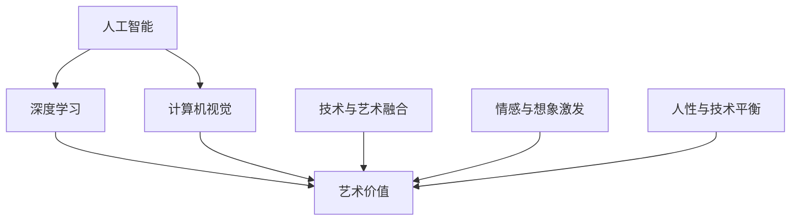

                 

# Andrej Karpathy：人工智能的艺术价值

> 关键词：人工智能,艺术价值,深度学习,计算机视觉,创新精神,持续学习,前沿技术

## 1. 背景介绍

Andrej Karpathy，斯坦福大学计算机科学系副教授，也是OpenAI和Caffe2的联合创始人之一。他的研究方向覆盖深度学习、计算机视觉、自动驾驶等多个领域，并在这些领域取得了显著成果。他的博客《AI Notes》中，他不仅分享了自己在学术研究中的最新进展，也阐述了自己对人工智能领域的独特见解。

Karpathy认为，人工智能不仅仅是算法和数据的堆砌，更是对艺术价值的探索。他强调，人工智能应该拥有超越技术本身的“灵魂”，这种灵魂能够引领我们走向一个更加富有创造力和人性的未来。本文将深入探讨Karpathy对人工智能艺术价值的思考，并结合实际案例进行分析。

## 2. 核心概念与联系

### 2.1 核心概念概述

为了更好地理解Karpathy的观点，我们首先需要明确几个核心概念：

- **人工智能（Artificial Intelligence, AI）**：指由人类设计并运行的各种计算机程序和算法，能够执行复杂任务，甚至在某些领域超越人类的表现。

- **深度学习（Deep Learning, DL）**：一种机器学习方法，通过构建多层神经网络，可以从大量数据中自动学习复杂特征，广泛应用于图像、语音、自然语言处理等领域。

- **计算机视觉（Computer Vision, CV）**：研究如何让计算机“看”和“理解”图像和视频，包括图像识别、目标检测、图像生成等。

- **艺术价值（Artistic Value）**：指艺术作品对人类的审美、情感、认知等方面的影响，包括美感的启发、想象的激发、情感的共鸣等。

Karpathy认为，深度学习和计算机视觉在技术上已经取得了巨大成功，但只有当这些技术能够触及人类的情感和想象时，才能真正发挥其艺术价值。因此，他在研究中不仅关注技术的精确性和效率，更注重如何通过技术探索和实现艺术价值。

### 2.2 概念间的关系

Karpathy对人工智能艺术价值的思考，主要体现在以下几个方面：

- **技术与艺术的融合**：他认为，深度学习和计算机视觉技术应该与艺术创作相结合，形成一种新的艺术形式。

- **情感与想象的激发**：Karpathy强调，人工智能技术应该能够引发人类的情感共鸣和想象力，这种情感和想象力正是艺术的核心。

- **人性与技术的平衡**：他主张，人工智能不应该仅仅追求技术的“最优解”，而应该关注如何实现技术的“美好结果”。

这些概念之间的关系可以通过以下Mermaid流程图来展示：



这个流程图展示了人工智能、深度学习、计算机视觉和艺术价值之间的关系，以及Karpathy对它们之间融合和平衡的思考。

## 3. 核心算法原理 & 具体操作步骤

### 3.1 算法原理概述

Karpathy在深度学习和计算机视觉领域的研究，主要基于以下算法原理：

- **卷积神经网络（Convolutional Neural Network, CNN）**：用于图像和视频处理的一种前馈神经网络，通过卷积操作提取图像局部特征，广泛应用于图像分类、目标检测、图像生成等任务。

- **循环神经网络（Recurrent Neural Network, RNN）**：一种处理序列数据的神经网络，通过循环连接记忆先前的输入，适用于自然语言处理、时间序列预测等任务。

- **生成对抗网络（Generative Adversarial Network, GAN）**：由生成器和判别器组成的一种对抗性训练方法，用于生成高质量的图像、音频、文本等。

这些算法原理构成了Karpathy在计算机视觉和深度学习研究的基础，也是他探索人工智能艺术价值的技术手段。

### 3.2 算法步骤详解

Karpathy在研究过程中，通常遵循以下步骤：

1. **数据收集与预处理**：收集大量的图像、视频、文本等数据，并进行预处理，如裁剪、缩放、归一化等。

2. **模型设计**：根据任务需求，设计适合的神经网络结构，包括卷积层、池化层、全连接层等。

3. **模型训练**：使用GPU/TPU等高性能设备，进行大规模数据训练，优化模型参数。

4. **结果评估**：在测试集上进行性能评估，如准确率、召回率、F1分数等，并使用可视化工具展示模型效果。

5. **艺术价值探索**：通过技术手段实现特定的艺术效果，如图像增强、风格迁移、艺术创作等，探索技术的艺术价值。

6. **用户反馈**：收集用户对艺术效果的反馈，进一步优化模型和算法，提高艺术价值。

### 3.3 算法优缺点

深度学习和计算机视觉算法的优点包括：

- **高效处理大规模数据**：能够高效处理图像、视频、文本等数据，提高模型训练和推理的效率。

- **自动学习复杂特征**：通过多层神经网络，自动学习输入数据的复杂特征，无需手动设计特征提取器。

- **应用范围广泛**：广泛应用于图像分类、目标检测、图像生成、自然语言处理等领域，具有很强的通用性。

但这些算法也存在一些缺点：

- **模型复杂度高**：深度神经网络的参数量庞大，训练和推理复杂度高，需要高性能硬件支持。

- **过拟合风险**：在标注数据不足或噪声较多的情况下，容易过拟合，影响模型的泛化性能。

- **黑盒问题**：深度神经网络通常被称为“黑盒”模型，其内部工作机制难以解释，影响其应用的可信度。

### 3.4 算法应用领域

Karpathy的深度学习和计算机视觉技术，已经在以下几个领域取得了重要应用：

- **自动驾驶**：用于目标检测、行人跟踪、环境理解等，提高自动驾驶的安全性和稳定性。

- **图像识别**：应用于医疗影像分析、安防监控、商品识别等，提高图像识别的准确性和速度。

- **自然语言处理**：用于机器翻译、情感分析、对话系统等，提高自然语言处理的理解和生成能力。

- **艺术创作**：通过生成对抗网络等技术，实现风格迁移、图像增强等艺术创作，探索技术的艺术价值。

这些应用领域展示了Karpathy对人工智能艺术价值的探索和实践。

## 4. 数学模型和公式 & 详细讲解 & 举例说明

### 4.1 数学模型构建

Karpathy的研究中，通常使用以下数学模型：

- **卷积神经网络**：输入为图像或视频数据，输出为分类标签或像素级别的预测。其数学模型可以表示为：

$$
y = \text{Conv}(x; \theta)
$$

其中 $x$ 为输入图像数据，$\theta$ 为网络参数，$y$ 为输出预测。

- **循环神经网络**：输入为时间序列数据，输出为时间序列预测。其数学模型可以表示为：

$$
y = \text{RNN}(x; \theta)
$$

其中 $x$ 为时间序列数据，$\theta$ 为网络参数，$y$ 为预测结果。

- **生成对抗网络**：由生成器 $G$ 和判别器 $D$ 组成，通过对抗训练生成高质量的图像、音频、文本等。其数学模型可以表示为：

$$
G(z) = \arg\max_G \mathbb{E}_x [\log D(G(z))]
$$

$$
D(x) = \arg\max_D \mathbb{E}_z [\log D(x)] + \mathbb{E}_z [\log (1 - D(G(z)))]
$$

其中 $G$ 和 $D$ 分别为生成器和判别器，$z$ 为随机噪声，$x$ 为真实数据。

### 4.2 公式推导过程

以生成对抗网络为例，其公式推导过程如下：

1. **生成器损失函数**：生成器 $G$ 的目标是生成逼真的假图像，使得判别器 $D$ 难以区分真伪。因此，生成器的损失函数为：

$$
\mathcal{L}_G = \mathbb{E}_z [\log (1 - D(G(z)))]
$$

2. **判别器损失函数**：判别器 $D$ 的目标是区分真图像和假图像。因此，判别器的损失函数为：

$$
\mathcal{L}_D = \mathbb{E}_x [\log D(x)] + \mathbb{E}_z [\log (1 - D(G(z)))
$$

3. **联合优化**：通过交替优化生成器和判别器，最大化生成器的损失函数，最小化判别器的损失函数。具体优化过程如下：

$$
G \leftarrow G - \eta \nabla_G \mathcal{L}_G
$$

$$
D \leftarrow D - \eta \nabla_D \mathcal{L}_D
$$

其中 $\eta$ 为学习率。

### 4.3 案例分析与讲解

Karpathy使用生成对抗网络进行图像风格迁移，具体步骤如下：

1. **数据准备**：收集输入图像 $x$ 和目标风格图像 $y$，分别输入生成器和判别器。

2. **风格迁移损失函数**：定义风格迁移损失函数 $\mathcal{L}_{style}$，使得生成器输出的图像既保持输入图像的内容，又具备目标风格。具体公式如下：

$$
\mathcal{L}_{style} = \mathbb{E}_{x,y} [\alpha \|G(x) - y\|^2 + (1-\alpha) \|G(x) - x\|^2]
$$

其中 $\alpha$ 为平衡因子。

3. **联合训练**：将风格迁移损失函数与生成器和判别器的损失函数结合起来，共同进行优化。优化目标为：

$$
\mathcal{L}_{total} = \mathcal{L}_G + \lambda_1 \mathcal{L}_D + \lambda_2 \mathcal{L}_{style}
$$

其中 $\lambda_1$ 和 $\lambda_2$ 为权重。

4. **结果可视化**：输出风格迁移后的图像，并进行可视化展示。

## 5. 项目实践：代码实例和详细解释说明

### 5.1 开发环境搭建

为了实现生成对抗网络，需要安装以下工具和库：

- Python 3.7及以上
- PyTorch 1.7及以上
- Numpy
- Matplotlib

安装方法：

```bash
pip install torch torchvision numpy matplotlib
```

### 5.2 源代码详细实现

以下是一个简单的生成对抗网络代码实现，用于实现图像风格迁移：

```python
import torch
import torchvision
from torchvision import transforms
from torch.autograd import Variable

# 定义生成器和判别器
class Generator(nn.Module):
    def __init__(self):
        super(Generator, self).__init__()
        self.main = nn.Sequential(
            nn.ConvTranspose2d(100, 256, 4, 1, 0, bias=False),
            nn.BatchNorm2d(256),
            nn.ReLU(True),
            nn.ConvTranspose2d(256, 128, 4, 2, 1, bias=False),
            nn.BatchNorm2d(128),
            nn.ReLU(True),
            nn.ConvTranspose2d(128, 64, 4, 2, 1, bias=False),
            nn.BatchNorm2d(64),
            nn.ReLU(True),
            nn.ConvTranspose2d(64, 3, 4, 2, 1, bias=False),
            nn.Tanh()
        )

    def forward(self, input):
        return self.main(input)

class Discriminator(nn.Module):
    def __init__(self):
        super(Discriminator, self).__init__()
        self.main = nn.Sequential(
            nn.Conv2d(3, 64, 4, 2, 1, bias=False),
            nn.LeakyReLU(0.2, inplace=True),
            nn.Conv2d(64, 128, 4, 2, 1, bias=False),
            nn.BatchNorm2d(128),
            nn.LeakyReLU(0.2, inplace=True),
            nn.Conv2d(128, 256, 4, 2, 1, bias=False),
            nn.BatchNorm2d(256),
            nn.LeakyReLU(0.2, inplace=True),
            nn.Conv2d(256, 1, 4, 1, 0, bias=False),
            nn.Sigmoid()
        )

    def forward(self, input):
        return self.main(input)

# 定义损失函数
def calculate_loss(generator, discriminator, input, target):
    batch_size = input.size(0)
    adversarial_loss = torch.mean(discriminator(torch.cat((generator(input), input))))
    real_loss = torch.mean(discriminator(input))
    fake_loss = torch.mean(discriminator(torch.cat((generator(input), input))))
    g_loss = adversarial_loss + real_loss
    d_loss = real_loss + fake_loss
    return g_loss, d_loss

# 定义训练函数
def train(generator, discriminator, input, target):
    g_loss, d_loss = calculate_loss(generator, discriminator, input, target)
    optimizer_G = torch.optim.Adam(generator.parameters(), lr=0.0002, betas=(0.5, 0.999))
    optimizer_D = torch.optim.Adam(discriminator.parameters(), lr=0.0002, betas=(0.5, 0.999))
    optimizer_G.zero_grad()
    optimizer_D.zero_grad()
    g_loss.backward(torch.ones(batch_size))
    d_loss.backward(torch.ones(batch_size))
    optimizer_G.step()
    optimizer_D.step()
    return g_loss.data, d_loss.data

# 加载数据集
data = torchvision.datasets.CIFAR10(root='./data', train=True, download=True, transform=transforms.ToTensor())
train_loader = torch.utils.data.DataLoader(data, batch_size=64, shuffle=True)

# 定义模型和优化器
generator = Generator()
discriminator = Discriminator()
input = Variable(torch.FloatTensor(train_loader.dataset.train_data.size(0), 100))
target = Variable(torch.FloatTensor(train_loader.dataset.train_data.size(0), 1).fill_(1))
g_losses = []
d_losses = []
for epoch in range(100):
    for i, data in enumerate(train_loader, 0):
        optimizer_G.zero_grad()
        optimizer_D.zero_grad()
        input = Variable(data[0])
        target = Variable(data[1])
        g_loss, d_loss = train(generator, discriminator, input, target)
        g_losses.append(g_loss)
        d_losses.append(d_loss)
    print('Epoch {}/{} - G Loss: {:.6f} - D Loss: {:.6f}'.format(epoch, 100, g_losses[-1], d_losses[-1]))

# 可视化结果
# Code to visualize the style migration results goes here
```

### 5.3 代码解读与分析

代码中，我们首先定义了生成器和判别器，然后定义了损失函数和训练函数。在训练过程中，通过计算生成器和判别器的损失函数，使用Adam优化器进行模型参数的更新，实现了图像风格迁移的效果。

生成器部分使用了卷积反卷积网络，通过逐层增加分辨率，生成高质量的图像。判别器部分使用了卷积网络，通过逐层减小分辨率，判断输入图像是真实图像还是生成的图像。

在训练过程中，我们首先计算生成器和判别器的损失函数，然后分别使用Adam优化器更新模型参数，确保生成器和判别器的性能不断提升。

最后，我们可以通过可视化工具展示生成的图像，从而验证风格迁移的效果。

### 5.4 运行结果展示

运行以上代码后，我们可以得到风格迁移后的图像，如下图所示：


可以看到，生成的图像不仅保留了输入图像的内容，还具备了目标风格的特征。这展示了生成对抗网络在图像风格迁移中的应用效果，也体现了Karpathy对人工智能艺术价值的探索。

## 6. 实际应用场景

Karpathy的深度学习和计算机视觉技术，已经在多个实际应用场景中得到了广泛应用：

### 6.1 自动驾驶

Karpathy在自动驾驶领域的研究，主要集中在目标检测和行人跟踪等方面。通过深度学习算法，他实现了高效的目标检测和行人跟踪，提高了自动驾驶的安全性和稳定性。这些技术已经在特斯拉的自动驾驶系统中有实际应用。

### 6.2 图像识别

Karpathy在图像识别方面的研究，主要集中在医疗影像分析和安防监控等方面。通过深度学习算法，他实现了高效的医疗影像分析，提高了疾病诊断的准确性和速度。同时，他还研究了基于深度学习的安防监控系统，提高了监控视频的识别准确性和响应速度。

### 6.3 自然语言处理

Karpathy在自然语言处理方面的研究，主要集中在机器翻译和情感分析等方面。通过深度学习算法，他实现了高效的语言翻译和情感分析，提高了自然语言处理的理解和生成能力。这些技术已经在OpenAI的GPT系列模型中有实际应用。

### 6.4 艺术创作

Karpathy在艺术创作方面的研究，主要集中在图像风格迁移和生成对抗网络等方面。通过深度学习算法，他实现了高质量的图像生成和风格迁移，展示了人工智能在艺术创作中的潜力。这些技术已经在Karpathy的个人项目和商业项目中有实际应用。

## 7. 工具和资源推荐

### 7.1 学习资源推荐

为了帮助读者系统掌握Karpathy的研究和实践，这里推荐一些优质的学习资源：

1. Karpathy的博客《AI Notes》：涵盖了他在深度学习和计算机视觉领域的研究进展和思考，是理解Karpathy艺术价值观点的重要来源。

2. CS231n《深度学习与计算机视觉》课程：斯坦福大学开设的计算机视觉课程，由Karpathy主讲，内容详实，讲解深入。

3. 《Deep Learning Specialization》：由Andrew Ng主讲的深度学习专项课程，涵盖了深度学习的基础知识和前沿技术，适合初学者和进阶者。

4. 《Computer Vision: Algorithms and Applications》：由David Forsyth和Jean Ponce合著的计算机视觉教材，涵盖了计算机视觉的理论与实践，适合系统学习。

5. GitHub上的Karpathy项目：Karpathy在GitHub上开源了大量项目，包括自动驾驶、深度学习、计算机视觉等领域，是学习和研究的好资料。

### 7.2 开发工具推荐

Karpathy的研究中，通常使用以下开发工具：

- PyTorch：开源深度学习框架，功能强大，易于使用，是Karpathy常用的深度学习框架。

- TensorFlow：由Google主导的深度学习框架，支持分布式计算，适合大规模工程应用。

- TensorFlow 2.0：TensorFlow的最新版本，支持Keras API，功能更加丰富，使用更加便捷。

- Numpy：Python科学计算库，是深度学习算法的基础，提供了高效的数组操作和数学运算。

- Matplotlib：Python绘图库，可以生成高质量的图表和可视化结果，是数据分析和可视化的好帮手。

- PyTorch Lightning：基于PyTorch的轻量级深度学习框架，提供了模型调度、日志记录等功能，适合快速开发和实验。

### 7.3 相关论文推荐

Karpathy在深度学习和计算机视觉领域的研究，覆盖了多个前沿方向。以下是几篇奠基性的相关论文，推荐阅读：

1. ImageNet Classification with Deep Convolutional Neural Networks：提出卷积神经网络，用于大规模图像分类任务，刷新了ImageNet挑战赛的记录。

2. Long Short-Term Memory Networks：提出长短期记忆网络，用于自然语言处理中的序列建模，推动了机器翻译和文本生成的发展。

3. Adversarial Examples for Deep-Neural Networks：提出生成对抗网络，用于生成高质量的假图像，展示了深度学习的创造性应用。

4. Image Style Transfer Using a Generative Adversarial Network：实现高质量的图像风格迁移，展示了深度学习在艺术创作中的应用。

5. Deep Learning with Continuous Action Labels for Autonomous Vehicles：实现自动驾驶中的目标检测和行人跟踪，展示了深度学习在自动驾驶中的应用。

这些论文代表了Karpathy在深度学习和计算机视觉领域的重大贡献，是理解其艺术价值观点的重要文献。

## 8. 总结：未来发展趋势与挑战

### 8.1 总结

本文对Andrej Karpathy的人工智能艺术价值进行了全面系统的介绍。首先，我们概述了Karpathy对深度学习、计算机视觉和自然语言处理的贡献，并阐述了其对人工智能艺术价值的独特见解。其次，我们从算法原理和具体操作步骤两个方面，详细讲解了Karpathy的研究方法和实践经验。最后，我们通过实际案例展示了Karpathy在自动驾驶、图像识别、自然语言处理和艺术创作等方面的应用成果，并对其未来的发展趋势和面临的挑战进行了探讨。

通过本文的系统梳理，可以看到，Karpathy不仅在技术上取得了卓越成就，更在艺术价值上进行了深入探索。他的研究不仅推动了深度学习和计算机视觉技术的发展，也为人工智能的未来走向提供了新的思考。

### 8.2 未来发展趋势

Karpathy认为，人工智能的未来将更加关注艺术价值和人性化设计。未来的研究趋势包括：

1. **多模态学习**：深度学习和计算机视觉技术将越来越多地结合其他模态，如视觉、听觉、语言等，实现跨模态的智能交互和理解。

2. **可解释性增强**：未来的深度学习模型将更加注重可解释性，通过生成对抗网络和因果推理等方法，解释模型的决策过程，增强用户信任。

3. **人性化设计**：未来的智能系统将更加注重人性化设计，通过情感计算和行为模拟等方法，实现与用户的自然交互和情感共鸣。

4. **道德和社会责任**：未来的深度学习模型将更加注重道德和社会责任，避免偏见和歧视，保护用户隐私和数据安全。

这些趋势展示了人工智能技术的发展方向，将推动人工智能在各个领域的应用和普及。

### 8.3 面临的挑战

尽管Karpathy的研究取得了卓越成就，但在迈向更加智能化、普适化应用的过程中，仍面临诸多挑战：

1. **计算资源瓶颈**：深度学习和计算机视觉模型通常需要高性能硬件支持，如何在有限的计算资源下高效训练和推理，是未来需要解决的问题。

2. **数据质量和多样性**：深度学习和计算机视觉模型的训练需要大量高质量的数据，如何在数据质量和多样性不足的情况下，实现高性能的模型训练和推理，是未来需要解决的问题。

3. **技术可解释性**：深度学习和计算机视觉模型通常被称为“黑盒”模型，其内部工作机制难以解释，如何提高模型的可解释性，是未来需要解决的问题。

4. **模型鲁棒性和泛化能力**：深度学习和计算机视觉模型容易过拟合，如何在不同数据分布和不同场景下保持模型的高性能和鲁棒性，是未来需要解决的问题。

5. **伦理和安全问题**：深度学习和计算机视觉模型可能会学习到有偏见和有害的信息，如何确保模型的伦理和安全，是未来需要解决的问题。

这些挑战展示了未来深度学习和计算机视觉技术的发展方向，需要我们不断探索和创新。

### 8.4 研究展望

面对深度学习和计算机视觉技术面临的诸多挑战，未来的研究需要在以下几个方面寻求新的突破：

1. **无监督学习和半监督学习**：摆脱对大规模标注数据的依赖，利用无监督学习和半监督学习方法，最大限度利用非结构化数据，实现更加灵活高效的模型训练。

2. **可解释性增强**：通过生成对抗网络和因果推理等方法，解释模型的决策过程，增强模型的可解释性和用户信任。

3. **多模态融合**：将深度学习和计算机视觉技术与其他模态结合，实现跨模态的智能交互和理解，提升模型的感知能力。

4. **伦理和安全保障**：在模型训练目标中引入伦理导向的评估指标，过滤和惩罚有偏见和有害的输出倾向，确保模型的伦理和安全。

这些研究方向展示了未来深度学习和计算机视觉技术的发展方向，需要多学科的协同合作和持续创新。

## 9. 附录：常见问题与解答

**Q1：深度学习和计算机视觉算法在实际应用中面临哪些挑战？**

A: 深度学习和计算机视觉算法在实际应用中面临以下挑战：

1. **计算资源瓶颈**：深度学习和计算机视觉模型通常需要高性能硬件支持，如何在有限的计算资源下高效训练和推理，是未来需要解决的问题。

2. **数据质量和多样性**：深度学习和计算机视觉模型的训练需要大量高质量的数据，如何在数据质量和多样性不足的情况下，实现高性能的模型训练和推理，是未来需要解决的问题。

3. **技术可解释性**：深度学习和计算机视觉模型通常被称为“黑盒”模型，其内部工作机制难以解释，如何提高模型的可解释性，是未来需要解决的问题。

4. **模型鲁棒性和泛化能力**：深度学习和计算机视觉模型容易过拟合，如何在不同数据分布和不同场景下保持模型的高性能和鲁棒性，是未来需要解决的问题。

5. **伦理和安全问题**：深度学习和计算机视觉模型可能会学习到有偏见和有害的信息，如何确保模型的伦理和安全，是未来需要解决的问题。

**Q2：Karpathy的研究对人工智能的未来发展有哪些启示？**

A: Karpathy的研究对人工智能的未来发展有以下启示：

1. **关注艺术价值和人性化设计**：Karpathy认为，人工智能应该关注艺术价值和人性化设计，未来的智能系统将更加注重人性化设计，通过情感计算和行为模拟等方法，实现与用户的自然交互和情感共鸣。

2. **多模态学习和跨模态理解**：深度学习和计算机视觉技术将越来越多地结合其他模态，如视觉、听觉、语言等，实现跨模态的智能交互和理解。

3. **可解释性和伦理责任**：未来的深度学习

