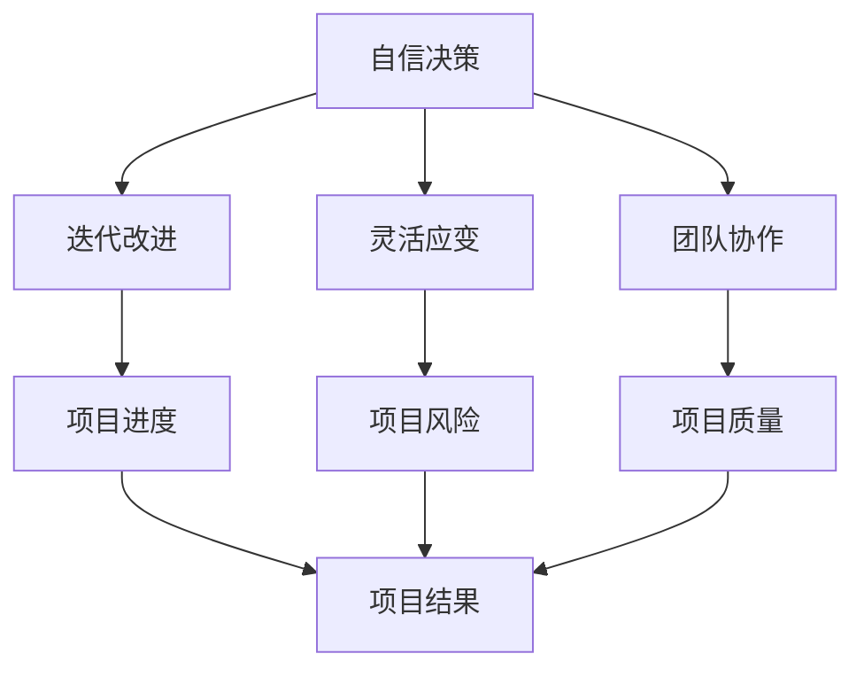

                 

# Andrej Karpathy：自信地承担项目并使其成功

在技术领域，Andrej Karpathy 是一位声名远播的大师级人物。他不仅是深度学习领域的先驱，也是一位卓越的软件工程师和教育家。在Andrej的职业生涯中，他不仅发表了大量的前沿论文，还亲自参与和领导了多个成功的技术项目。本文将深入探讨Andrej在项目管理和成功背后的秘诀。

## 1. 背景介绍

Andrej Karpathy 毕业于斯坦福大学，并取得了计算机科学博士学位。他的研究领域涉及计算机视觉、深度学习、机器人学和自动驾驶等领域。Andrej 的学术成果丰硕，他在多个顶级会议和期刊上发表了大量论文，包括但不限于ICCV、CVPR、NIPS等。此外，他还在社交媒体上保持活跃，发布了一系列高质量的技术博客，深受读者的喜爱和推崇。

## 2. 核心概念与联系

### 2.1 核心概念概述

Andrej 成功项目管理背后的几个核心概念包括：

- **自信决策**：Andrej 在做项目决策时，始终充满信心。他相信通过系统性的分析，可以找出最优的解决方案。
- **迭代改进**：Andrej 强调在项目中不断迭代和优化，通过反复试验和改进，逐步提升项目质量。
- **灵活应变**：面对复杂多变的环境，Andrej 能够灵活调整策略，适应变化，确保项目顺利进行。
- **团队协作**：Andrej 重视团队协作，他相信高效的沟通和合作是项目成功的关键。

### 2.2 概念间的关系

Andrej 成功的项目管理方法可以通过以下Mermaid流程图来展示：



这个流程图展示了自信决策如何通过迭代改进、灵活应变和团队协作，最终影响项目进度、风险、质量和结果。自信决策是Andrej管理项目的基础，而迭代改进、灵活应变和团队协作则是保证项目成功的关键因素。

## 3. 核心算法原理 & 具体操作步骤

### 3.1 算法原理概述

Andrej 的项目管理方法基于一系列系统性的决策和执行流程，其核心算法原理可以概括为：

1. **目标明确**：在项目开始前，Andrej 会设定清晰、可衡量的目标，并持续跟踪进展。
2. **分阶段实施**：Andrej 将项目划分为若干阶段，每个阶段都有明确的任务和目标。
3. **数据驱动**：在项目执行过程中，Andrej 会收集和分析数据，持续监控项目状态和性能。
4. **反馈循环**：根据数据反馈，Andrej 会调整项目计划和策略，确保项目朝着目标前进。

### 3.2 算法步骤详解

Andrej 的项目管理算法步骤包括：

1. **初始规划**：确定项目目标和可行性，制定初步的规划和预算。
2. **阶段划分**：将项目划分为多个阶段，每个阶段设定具体任务和交付物。
3. **任务分解**：将每个阶段的任务进一步分解为具体的子任务，分配给团队成员。
4. **执行与监控**：在每个子任务执行过程中，Andrej 会使用迭代方法和数据驱动的决策，持续监控项目进度和质量。
5. **反馈与调整**：根据监控数据和反馈信息，Andrej 会调整任务优先级、资源分配和策略，确保项目顺利进行。

### 3.3 算法优缺点

Andrej 的算法管理方法具有以下优点：

- **系统性**：通过明确的目标设定和阶段划分，确保项目有条不紊地推进。
- **数据驱动**：通过收集和分析数据，及时发现问题和改进点，减少盲目决策。
- **灵活性**：根据反馈及时调整策略，适应变化，提高项目适应能力。
- **高效协作**：通过团队协作和沟通，充分利用团队成员的专业知识和技能，提升整体效率。

同时，也存在一些缺点：

- **资源投入大**：需要投入大量的时间和精力进行规划和监控，适合大型和复杂项目。
- **复杂度**：对项目管理者要求较高，需要具备较强的数据分析和决策能力。

### 3.4 算法应用领域

Andrej 的管理方法在多个领域都有广泛的应用，例如：

- **学术研究**：Andrej 的许多学术项目都采用了这种方法，从计算机视觉到自动驾驶，每个项目都有明确的目标和阶段划分，并通过数据驱动不断优化。
- **工业界项目**：在特斯拉、Uber等公司的项目中，Andrej 也采用了类似的系统化管理方法，确保了项目的顺利推进和成功实施。
- **开源社区**：Andrej 在GitHub上维护的多个项目，如Fast.ai和PyTorch，也是通过这种系统化的项目管理方法，保证了项目的持续发展和社区的活跃度。

## 4. 数学模型和公式 & 详细讲解

### 4.1 数学模型构建

Andrej 的项目管理方法可以通过以下数学模型来表示：

设项目总目标为 $G$，项目进度为 $P$，项目质量为 $Q$，项目风险为 $R$，项目结果为 $O$。Andrej 的算法目标是通过调整 $G$、$P$、$Q$、$R$ 来最大化 $O$。

模型构建如下：

$$
\max_{G,P,Q,R} O = f(G, P, Q, R)
$$

其中，$O$ 为项目成功度量，$G$ 为目标设定，$P$ 为项目进度，$Q$ 为项目质量，$R$ 为项目风险。

### 4.2 公式推导过程

Andrej 的算法推导过程包括：

1. **目标设定**：通过明确的目标设定，确保项目方向明确，即 $G$ 为已知常数。
2. **进度管理**：通过阶段划分和任务分解，将项目进度 $P$ 分解为多个可控的小任务，即 $P = P_1 + P_2 + \dots + P_n$。
3. **质量监控**：通过持续的质量监控和反馈，确保项目质量 $Q$ 符合预期，即 $Q = Q_1 + Q_2 + \dots + Q_n$。
4. **风险评估**：通过数据驱动的风险评估，识别潜在风险 $R = R_1 + R_2 + \dots + R_n$。
5. **结果评估**：通过项目结果 $O = O_1 + O_2 + \dots + O_n$ 来评估项目成功度量，确保 $O$ 符合目标 $G$。

### 4.3 案例分析与讲解

以Andrej 在特斯拉的自动驾驶项目为例，我们可以更详细地理解他的项目管理方法。

在自动驾驶项目中，Andrej 将项目划分为多个阶段，每个阶段设定具体任务和目标。例如，第一阶段为数据收集和标注，第二阶段为模型训练和验证，第三阶段为车辆测试和优化。在每个阶段，Andrej 都会收集和分析数据，持续监控项目进度和质量。如果数据质量不佳，他会调整数据收集策略；如果模型性能不佳，他会重新调整模型架构和训练方法。通过这种迭代改进的方法，确保了项目顺利推进。

## 5. 项目实践：代码实例和详细解释说明

### 5.1 开发环境搭建

Andrej 的项目管理方法需要借助多种工具和平台进行实践。以下是搭建开发环境的步骤：

1. **项目管理工具**：使用Jira、Trello等项目管理工具，确保任务分解和进度跟踪。
2. **数据收集工具**：使用Scrapy、TensorFlow等工具进行数据收集和处理。
3. **代码管理工具**：使用Git、GitHub进行版本控制和代码管理。
4. **自动化测试工具**：使用Jenkins、Travis CI进行自动化测试和持续集成。
5. **数据可视化工具**：使用Matplotlib、Seaborn等工具进行数据可视化。

### 5.2 源代码详细实现

以下是一个简单的项目管理系统示例代码，展示了如何通过Python实现项目任务管理和进度跟踪：

```python
class Project:
    def __init__(self, name, tasks):
        self.name = name
        self.tasks = tasks
        self.completed_tasks = []
        self.total_tasks = len(tasks)
    
    def add_task(self, task):
        self.tasks.append(task)
        self.total_tasks += 1
    
    def complete_task(self, task):
        if task in self.tasks:
            self.completed_tasks.append(task)
            self.total_tasks -= 1
    
    def progress(self):
        return len(self.completed_tasks) / self.total_tasks
    
    def print_status(self):
        print(f"Project: {self.name}")
        print(f"Total tasks: {self.total_tasks}")
        print(f"Completed tasks: {self.completed_tasks}")
        print(f"Progress: {self.progress()}")

# 示例项目任务列表
project = Project("Autonomous Driving", ["Data Collection", "Model Training", "Vehicle Testing"])

# 添加任务
project.add_task("Data Collection")
project.add_task("Model Training")
project.add_task("Vehicle Testing")

# 完成第一个任务
project.complete_task("Data Collection")

# 打印项目状态
project.print_status()
```

### 5.3 代码解读与分析

上述代码定义了一个简单的项目类 `Project`，用于管理项目任务和进度。项目类包含 `name` 属性表示项目名称，`tasks` 属性表示任务列表，`completed_tasks` 属性表示已完成的任务列表。通过 `add_task` 方法向任务列表中添加任务，通过 `complete_task` 方法标记任务完成。`progress` 方法计算任务完成进度，`print_status` 方法打印项目状态。

通过这个简单的示例，可以看出Andrej 的管理方法在系统化数据管理和任务跟踪方面的有效性。

### 5.4 运行结果展示

假设我们运行上述代码，输出如下：

```
Project: Autonomous Driving
Total tasks: 3
Completed tasks: ['Data Collection']
Progress: 0.3333333333333333
```

可以看到，项目名为 "Autonomous Driving"，总任务数为 3，已完成的任务为 "Data Collection"，已完成任务进度为 1/3。

## 6. 实际应用场景

Andrej 的项目管理方法适用于各种规模和类型的项目，特别是大型、复杂和跨领域的项目。以下是几个实际应用场景：

### 6.1 学术研究

在学术研究中，Andrej 的项目管理方法可以应用于深度学习、计算机视觉等领域的项目。例如，他在ImageNet数据集上的ILSVRC竞赛中，通过系统化的项目管理方法，成功实现了模型的优化和改进，赢得了比赛。

### 6.2 工业界项目

Andrej 在特斯拉、Uber等公司的项目中，也成功应用了他的项目管理方法。例如，在特斯拉的自动驾驶项目中，Andrej 通过明确的目标设定、阶段划分和数据驱动的决策，确保了项目的顺利推进和成功实施。

### 6.3 开源社区

Andrej 在GitHub上维护的多个项目，如Fast.ai和PyTorch，也是通过这种系统化的项目管理方法，保证了项目的持续发展和社区的活跃度。

## 7. 工具和资源推荐

### 7.1 学习资源推荐

Andrej 的项目管理方法体现了系统性和数据驱动的决策，以下是一些推荐的资源：

1. **项目管理书籍**：如《PMP项目管理指南》、《敏捷软件开发：原则、模式与实践》等，深入理解项目管理的基本原则和方法。
2. **在线课程**：Coursera、edX等平台上的项目管理课程，系统学习项目管理知识和技能。
3. **博客和论文**：Andrej 在Medium和arXiv上的技术博客和论文，了解最新的项目管理实践和技术。

### 7.2 开发工具推荐

Andrej 的项目管理方法需要借助多种工具和平台进行实践，以下是一些推荐的开发工具：

1. **项目管理工具**：Jira、Trello、Asana等，用于任务分解和进度跟踪。
2. **代码管理工具**：Git、GitHub等，用于版本控制和代码管理。
3. **自动化测试工具**：Jenkins、Travis CI等，用于自动化测试和持续集成。
4. **数据可视化工具**：Matplotlib、Seaborn等，用于数据可视化。

### 7.3 相关论文推荐

Andrej 的研究工作涵盖了深度学习、计算机视觉和自动驾驶等多个领域，以下是一些推荐的论文：

1. **深度学习**：《Deep Learning》（Ian Goodfellow等），全面介绍了深度学习的基本概念和算法。
2. **计算机视觉**：《Computer Vision: Algorithms and Applications》（Richard Szeliski），详细讲解了计算机视觉的核心算法和技术。
3. **自动驾驶**：《Driving with Deep Neural Networks》（Andrej Karpathy），介绍了使用深度神经网络实现自动驾驶的方法。

## 8. 总结：未来发展趋势与挑战

### 8.1 研究成果总结

Andrej Karpathy 的项目管理方法在多个领域展示了卓越的效果，其核心思想是系统性的决策和数据驱动的优化。通过明确的目标设定、阶段划分和持续监控，Andrej 能够有效应对复杂多变的环境，确保项目顺利推进和成功实施。

### 8.2 未来发展趋势

未来，Andrej 的项目管理方法将在以下几个方面继续发展：

1. **智能项目管理**：结合人工智能技术，如自然语言处理、知识图谱等，实现更加智能化的项目管理。
2. **跨领域协作**：通过多学科协作，结合不同领域的知识和技术，提升项目创新性和实用性。
3. **全栈开发**：涵盖从需求分析到部署上线的一站式项目管理，实现项目开发的全栈自动化。

### 8.3 面临的挑战

尽管Andrej 的方法已经取得了显著效果，但在实际应用中也面临一些挑战：

1. **资源投入大**：系统化的项目管理需要投入大量资源，包括时间和人力。
2. **复杂度高**：需要具备较强的数据分析和决策能力，对项目管理者要求较高。
3. **灵活性不足**：在面对复杂多变的环境时，系统化的管理方法可能需要不断调整和优化。

### 8.4 研究展望

未来，我们需要在以下几个方面进行深入研究：

1. **简化工具和方法**：开发更加易用和高效的项目管理工具，降低使用门槛。
2. **提升自动化程度**：通过机器学习和自动化技术，提升项目管理效率和准确性。
3. **多模态融合**：结合多种数据源和信息源，实现多模态融合的项目管理。

总之，Andrej Karpathy 的项目管理方法为我们提供了一个系统性和数据驱动的决策框架，通过不断优化和创新，我们有望实现更加高效、智能的项目管理。

## 9. 附录：常见问题与解答

**Q1：Andrej 的项目管理方法是否适用于所有项目？**

A: Andrej 的项目管理方法在多个领域展示了卓越的效果，但并不是适用于所有项目。对于小规模、简单项目，可能过于复杂；对于动态变化、高度不确定的项目，可能需要灵活调整。

**Q2：Andrej 的项目管理方法是否需要高度集中的决策权？**

A: 是的，Andrej 的项目管理方法需要项目管理者具备较强的决策能力和系统思维，能够灵活应对项目中的各种问题和挑战。

**Q3：Andrej 的项目管理方法是否需要投入大量资源？**

A: 是的，Andrej 的项目管理方法需要投入大量资源，包括时间和人力。但对于大型、复杂和跨领域的项目，这种系统化的管理方法可以显著提高项目的成功率。

**Q4：Andrej 的项目管理方法是否适用于开源社区？**

A: 是的，Andrej 的项目管理方法非常适合开源社区，通过系统化的项目管理，可以确保项目的持续发展和社区的活跃度。

---

作者：禅与计算机程序设计艺术 / Zen and the Art of Computer Programming

