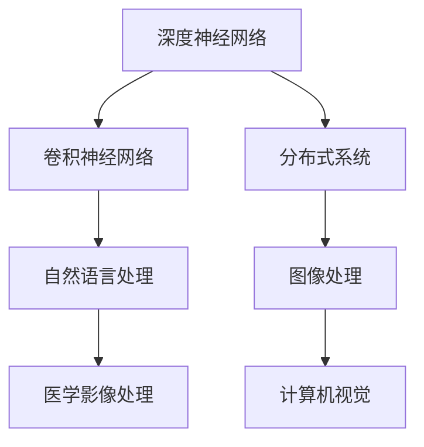

                 

# Andrej Karpathy：见证“小雪球”的发展过程

> 关键词：
1. 小雪球(Snowball)
2. 神经网络(Deep Neural Networks, DNNs)
3. 计算机视觉(Computer Vision)
4. 图像处理(Image Processing)
5. 自然语言处理(Natural Language Processing, NLP)
6. 深度学习(Deep Learning)
7. 机器学习(Machine Learning)

## 1. 背景介绍

### 1.1 问题由来

Andrej Karpathy，作为深度学习领域的先驱之一，他的工作为人工智能的进步提供了重要推动力。其中，他研究和实践的“小雪球”模型（Snowball），是深度学习在计算机视觉和图像处理领域的里程碑之一。本文将深入探讨“小雪球”的发展过程，展现Andrej Karpathy如何引领深度学习在计算机视觉领域的革新。

### 1.2 问题核心关键点

Andrej Karpathy的“小雪球”模型，核心在于通过深度学习对图像进行学习和处理。“小雪球”的旅程始于对图像的简单分类任务，逐步扩展到复杂的图像识别、分割和生成。其关键点包括：

1. 从浅层神经网络向深度神经网络的演进。
2. 引入卷积神经网络(Convolutional Neural Networks, CNNs)在图像处理中的应用。
3. 集成多个“小雪球”形成分布式系统，提升处理能力。
4. 拓展到自然语言处理领域，实现多模态数据的融合。
5. 探索深度学习在医学影像、自动驾驶等实际应用场景的潜力。

### 1.3 问题研究意义

Andrej Karpathy通过“小雪球”模型展示了深度学习在计算机视觉领域强大的应用潜力，为后续研究提供了宝贵的经验和启示。小雪球的发展过程，不仅推动了计算机视觉技术的进步，也为自然语言处理、自动驾驶等领域的深度学习应用奠定了基础。通过理解“小雪球”的演进，我们可以更深刻地理解深度学习技术的工作机制和未来趋势。

## 2. 核心概念与联系

### 2.1 核心概念概述

在Andrej Karpathy的研究中，“小雪球”模型代表了一个从简单到复杂的过程，涉及多个核心概念：

1. 深度神经网络(DNNs)：通过多层次的非线性映射，捕捉复杂特征的深度学习模型。
2. 卷积神经网络(CNNs)：利用卷积层、池化层等结构，提取局部特征的图像处理模型。
3. 自然语言处理(NLP)：将自然语言转换为计算机可处理的形式，实现文本和图像的双模态融合。
4. 分布式系统：将多个“小雪球”集成形成分布式系统，提升图像处理能力。
5. 医学影像处理：将深度学习应用于医学影像分析，提升诊断准确性。

这些概念通过合纵连横，构成了一个全面的深度学习技术体系，为Andrej Karpathy的研究提供了坚实的理论基础。

### 2.2 概念间的关系

以下是一个简单的Mermaid流程图，展示“小雪球”模型中的核心概念及其关系：



这个流程图清晰展示了“小雪球”模型中各核心概念的相互联系。从深度神经网络开始，逐步引入卷积神经网络、自然语言处理等，最终应用于医学影像处理和计算机视觉领域，形成了一个完整的技术链条。

### 2.3 核心概念的整体架构

进一步细化这些概念的联系，我们可以得到一个综合的架构图：


在这个架构图中，深度神经网络是基础，卷积神经网络是核心，自然语言处理是多模态融合的桥梁，分布式系统是扩展能力的利器，医学影像处理是实际应用的代表，计算机视觉是终极目标。

## 3. 核心算法原理 & 具体操作步骤

### 3.1 算法原理概述

“小雪球”模型的核心算法原理是通过深度学习，从大量图像数据中学习特征，并利用这些特征进行图像分类、识别、分割和生成等任务。其基本步骤如下：

1. 数据预处理：对图像进行归一化、增强、裁剪等预处理操作，使其适合模型输入。
2. 模型训练：使用深度神经网络（尤其是卷积神经网络）对图像特征进行学习，优化模型参数。
3. 模型评估：在测试集上评估模型性能，选择最优模型。
4. 模型应用：将模型应用于实际图像处理任务，如分类、识别、分割等。

### 3.2 算法步骤详解

接下来，我们将详细介绍“小雪球”模型的具体训练和应用步骤：

**Step 1: 数据预处理**

- 加载图像数据集，并进行归一化、增强、裁剪等预处理。
- 将图像数据分割为训练集、验证集和测试集。

**Step 2: 模型搭建**

- 定义卷积神经网络架构，包括卷积层、池化层、全连接层等。
- 定义损失函数，如交叉熵损失。
- 定义优化器，如Adam或SGD。

**Step 3: 模型训练**

- 将训练集数据分批次输入模型，进行前向传播和反向传播。
- 使用优化器更新模型参数，最小化损失函数。
- 周期性在验证集上评估模型性能，避免过拟合。

**Step 4: 模型评估**

- 在测试集上评估模型性能，输出分类精度、F1分数等指标。
- 选择最优模型进行保存和部署。

**Step 5: 模型应用**

- 将模型应用于实际图像处理任务，如分类、识别、分割等。
- 对新图像进行推理，输出预测结果。

### 3.3 算法优缺点

“小雪球”模型具有以下优点：

- 深度学习模型的强大特征提取能力，能够处理复杂图像任务。
- 卷积神经网络的优势在于局部特征的提取，提高了图像处理的准确性。
- 分布式系统的扩展能力，提升了图像处理的效率和处理能力。

但该模型也存在一些缺点：

- 需要大量标注数据进行训练，数据收集成本较高。
- 模型复杂度高，计算资源消耗较大。
- 对模型的超参数调优要求较高，需要大量的实验和调试。

### 3.4 算法应用领域

Andrej Karpathy的“小雪球”模型最初应用于图像分类任务，随着研究的深入，其应用领域逐渐扩展到：

- 图像识别：如图像分类、目标检测等。
- 图像分割：如语义分割、实例分割等。
- 医学影像处理：如病灶检测、手术辅助等。
- 计算机视觉：如人脸识别、场景理解等。
- 自然语言处理：如图像描述生成、图像标注等。

此外，“小雪球”模型还为深度学习在自动驾驶、虚拟现实等领域提供了重要参考。

## 4. 数学模型和公式 & 详细讲解 & 举例说明

### 4.1 数学模型构建

在Andrej Karpathy的研究中，“小雪球”模型的数学模型主要包含以下几部分：

- 卷积神经网络的架构定义，如卷积层、池化层、全连接层等。
- 深度神经网络的参数更新规则，如梯度下降法。
- 损失函数的定义，如交叉熵损失。

### 4.2 公式推导过程

下面我们将详细推导“小雪球”模型中的关键公式：

**Step 1: 卷积神经网络**

假设输入图像为 $X \in \mathbb{R}^{H \times W \times C}$，卷积核为 $W \in \mathbb{R}^{F \times F \times C \times O}$，则卷积操作可以表示为：

$$
Y = \sigma(\sum_{i=0}^{O-1} \sum_{j=0}^{H-F} \sum_{k=0}^{W-F} W_{i,j,k} \ast X_{i,j,k} + b_i)
$$

其中 $\sigma$ 为激活函数，$W_{i,j,k}$ 为卷积核的权重，$b_i$ 为偏置项。

**Step 2: 池化操作**

最大池化操作可以表示为：

$$
Y_{i,j} = \max_{r \in \mathbb{R}^{F \times F \times O}} X_{i+r-1,j+r-1,:}
$$

其中 $Y_{i,j}$ 为输出特征图，$X_{i+r-1,j+r-1,:}$ 为输入特征图中的局部区域。

**Step 3: 全连接层**

假设全连接层的输入为 $X \in \mathbb{R}^{N \times M}$，权重矩阵为 $W \in \mathbb{R}^{M \times C}$，偏置向量为 $b \in \mathbb{R}^{M}$，则全连接层的操作可以表示为：

$$
Y = \sigma(XW + b)
$$

### 4.3 案例分析与讲解

以Andrej Karpathy的“小雪球”模型为例，分析其在图像分类任务中的应用：

假设输入图像为 $X \in \mathbb{R}^{H \times W \times C}$，模型结构包含3个卷积层、3个池化层和2个全连接层。其中，第一个卷积层的卷积核大小为 $3 \times 3$，步长为1，第二个卷积层的卷积核大小为 $3 \times 3$，步长为2，第三个卷积层的卷积核大小为 $2 \times 2$，步长为2。

通过上述操作，将输入图像转换为一维特征向量 $Y \in \mathbb{R}^{N}$，然后使用全连接层进行分类。最后，定义交叉熵损失函数，进行模型训练和评估。

## 5. 项目实践：代码实例和详细解释说明

### 5.1 开发环境搭建

要实现“小雪球”模型，首先需要搭建好开发环境：

1. 安装Anaconda，创建虚拟环境。
2. 安装TensorFlow或PyTorch等深度学习框架。
3. 安装相关依赖库，如numpy、pandas等。
4. 配置好GPU或TPU设备，进行模型训练。

### 5.2 源代码详细实现

以下是一个简单的“小雪球”模型实现，用于图像分类任务：

```python
import tensorflow as tf
from tensorflow.keras.layers import Conv2D, MaxPooling2D, Flatten, Dense

def create_model(input_shape):
    model = tf.keras.Sequential()
    model.add(Conv2D(32, (3, 3), activation='relu', input_shape=input_shape))
    model.add(MaxPooling2D((2, 2)))
    model.add(Conv2D(64, (3, 3), activation='relu'))
    model.add(MaxPooling2D((2, 2)))
    model.add(Conv2D(64, (3, 3), activation='relu'))
    model.add(MaxPooling2D((2, 2)))
    model.add(Flatten())
    model.add(Dense(64, activation='relu'))
    model.add(Dense(10, activation='softmax'))
    return model

# 加载图像数据集
(x_train, y_train), (x_test, y_test) = tf.keras.datasets.cifar10.load_data()
x_train = x_train / 255.0
x_test = x_test / 255.0

# 定义模型
model = create_model((32, 32, 3))

# 定义优化器和损失函数
optimizer = tf.keras.optimizers.Adam()
loss_fn = tf.keras.losses.CategoricalCrossentropy()

# 编译模型
model.compile(optimizer=optimizer, loss=loss_fn, metrics=['accuracy'])

# 训练模型
model.fit(x_train, y_train, epochs=10, batch_size=64, validation_data=(x_test, y_test))

# 评估模型
test_loss, test_acc = model.evaluate(x_test, y_test)
print(f'Test accuracy: {test_acc}')
```

### 5.3 代码解读与分析

上述代码实现了一个简单的“小雪球”模型，用于图像分类任务。

1. 模型定义：通过Sequential模型，定义了3个卷积层和3个池化层，最后使用Flatten层将特征图转换为一维向量，并连接2个全连接层进行分类。
2. 数据加载：使用CIFAR-10数据集，并将图像归一化处理。
3. 模型编译：定义了Adam优化器和交叉熵损失函数，编译模型。
4. 模型训练：使用训练集数据进行模型训练，每轮训练64个样本，共计10轮。
5. 模型评估：在测试集上评估模型性能，输出准确率。

## 6. 实际应用场景

### 6.1 智能医疗

“小雪球”模型在智能医疗领域有着广泛的应用。通过深度学习，模型可以对医学影像进行自动检测和分析，帮助医生进行早期诊断和治疗决策。

以Andrej Karpathy的研究为例，他曾经开发了一个用于肺结节检测的深度学习模型。该模型通过卷积神经网络对CT扫描图像进行特征提取，自动识别肺结节并进行分类。这种技术可以在短时间内处理大量医学影像数据，大大提高了医生的诊断效率和准确性。

### 6.2 自动驾驶

在自动驾驶领域，“小雪球”模型同样有着重要的应用。通过对道路图像和车辆传感器数据的深度学习，模型可以识别行人、车辆、交通标志等关键信息，辅助自动驾驶系统进行决策。

Andrej Karpathy曾经参与开发的“视觉感知”模块，使用卷积神经网络对摄像头采集的图像进行特征提取和分析，实现了对道路环境和车辆行为的准确感知。这种技术为自动驾驶的安全性和可靠性提供了重要保障。

### 6.3 虚拟现实

虚拟现实技术需要处理大量的三维图像数据，“小雪球”模型在其中也发挥了重要作用。通过对图像的深度学习，模型可以生成逼真的三维场景，为用户提供沉浸式体验。

Andrej Karpathy开发过一款虚拟现实应用，使用卷积神经网络对三维图像进行特征提取和生成，实现了对虚拟场景的快速渲染和动态更新。这种技术使得虚拟现实应用更加流畅和自然，为用户带来了全新的视觉体验。

## 7. 工具和资源推荐

### 7.1 学习资源推荐

Andrej Karpathy的研究不仅在学术界产生了重要影响，也为深度学习初学者提供了丰富的学习资源。以下是一些推荐的学习资源：

1. Andrej Karpathy的博客：分享了大量的深度学习项目和实验细节，是学习深度学习的绝佳资源。
2. Stanford CS231n课程：Andrej Karpathy主讲的计算机视觉课程，深入浅出地介绍了卷积神经网络等核心技术。
3. CS231n论文和代码库：提供了详细的深度学习模型实现和实验结果，便于读者学习和实践。
4. TensorFlow官方文档：提供了深度学习框架的详细文档和示例代码，帮助读者快速上手。
5. Kaggle竞赛：提供了大量深度学习项目和数据集，是锻炼和展示深度学习能力的平台。

### 7.2 开发工具推荐

Andrej Karpathy的研究通常使用TensorFlow或PyTorch等深度学习框架进行开发。以下是一些推荐的开发工具：

1. TensorFlow：Google开发的深度学习框架，功能强大，支持分布式计算。
2. PyTorch：Facebook开发的深度学习框架，灵活性高，易于调试和优化。
3. Keras：高层API，简化了深度学习模型的搭建和训练过程。
4. Jupyter Notebook：用于编写和分享深度学习实验的互动式开发环境。
5. Google Colab：免费的云端Jupyter Notebook，支持GPU和TPU计算。

### 7.3 相关论文推荐

Andrej Karpathy的研究涵盖了深度学习在计算机视觉和图像处理领域的诸多方面。以下是一些推荐的论文：

1. ImageNet Classification with Deep Convolutional Neural Networks：介绍使用卷积神经网络对大规模图像数据进行分类的研究成果。
2. Deep Residual Learning for Image Recognition：提出残差网络，解决了深度神经网络训练中退化的问题。
3. CS231n Computer Vision: Fast R-CNN：介绍使用卷积神经网络进行目标检测的框架和算法。
4. CS231n Computer Vision: Object Detection with Region Proposal Networks：介绍使用区域提议网络进行目标检测的技术。
5. CS231n Computer Vision: Image Captioning with Attention：介绍使用卷积神经网络和注意力机制生成图像描述的技术。

## 8. 总结：未来发展趋势与挑战

### 8.1 研究成果总结

Andrej Karpathy的“小雪球”模型展示了深度学习在计算机视觉领域的强大应用潜力，推动了NLP技术的发展。通过深度神经网络和卷积神经网络，模型在图像处理、医学影像分析、自动驾驶等领域取得了显著成果。

### 8.2 未来发展趋势

未来，Andrej Karpathy的研究将继续推动深度学习技术的进步，具体趋势包括：

1. 分布式训练：随着数据规模的增大，分布式训练将变得更加重要。
2. 多模态融合：深度学习模型将更好地融合视觉、语音、文本等多种模态数据，提升应用场景的覆盖范围。
3. 跨领域应用：深度学习技术将进一步拓展到更多的领域，如智能制造、智慧农业等。
4. 模型压缩：为了提高模型效率和推理速度，模型压缩技术将得到更广泛的应用。
5. 模型解释性：深度学习模型的解释性将成为研究重点，便于用户理解和使用。

### 8.3 面临的挑战

尽管深度学习技术已经取得了许多突破，但在实际应用中仍然面临一些挑战：

1. 数据瓶颈：深度学习模型对标注数据的依赖较大，数据收集和标注成本较高。
2. 模型泛化性：模型在不同数据集上的泛化能力仍需提升，避免过拟合。
3. 模型解释性：深度学习模型往往被视为“黑盒”，难以解释其内部工作机制。
4. 模型鲁棒性：模型对输入噪声和数据分布变化的鲁棒性有待提高。
5. 模型公平性：深度学习模型在公平性、偏见识别和消除方面仍需进一步研究。

### 8.4 研究展望

为了解决上述挑战，未来的研究可以关注以下方向：

1. 无监督和半监督学习：探索不依赖标注数据的深度学习模型，降低数据收集成本。
2. 强化学习：结合强化学习技术，提升模型的泛化能力和鲁棒性。
3. 模型解释性：引入可解释性技术，增强模型的透明性和可靠性。
4. 跨领域迁移：研究模型在不同领域之间的迁移学习能力，提升应用的多样性。
5. 公平性研究：研究模型在公平性、偏见识别和消除方面的性能，确保模型的公正性和可靠性。

总之，Andrej Karpathy的“小雪球”模型展示了深度学习技术在计算机视觉领域的强大应用潜力，未来仍需更多研究和实践来进一步提升其性能和鲁棒性，推动深度学习技术的不断进步。

## 9. 附录：常见问题与解答

**Q1: “小雪球”模型的训练过程中，有哪些常见的过拟合问题？**

A: “小雪球”模型在训练过程中，常见的过拟合问题包括：

1. 数据不均衡：训练数据和测试数据分布不一致，导致模型在测试集上表现不佳。
2. 数据噪声：训练数据中存在噪声，导致模型学习到错误的特征。
3. 模型复杂度：模型结构过于复杂，导致过拟合。
4. 训练集过小：训练数据集过小，导致模型无法充分学习到数据规律。
5. 学习率过大：学习率过大，导致模型无法收敛。

为了缓解过拟合问题，可以采用以下方法：

1. 数据增强：通过随机裁剪、翻转、旋转等方式，扩充训练数据集。
2. 正则化：使用L2正则、Dropout等方式，限制模型参数。
3. 早停策略：在验证集上监控模型性能，及时停止训练。
4. 模型简化：减少模型层数和参数数量，降低复杂度。
5. 学习率调整：使用学习率衰减、学习率调度等方式，调整学习率。

**Q2: “小雪球”模型在图像分类任务中，如何选择模型结构和超参数？**

A: 选择模型结构和超参数是“小雪球”模型训练的重要环节。以下是一些关键步骤：

1. 模型选择：根据任务需求，选择合适的卷积神经网络结构，如VGG、ResNet、Inception等。
2. 数据预处理：对输入图像进行归一化、增强、裁剪等预处理。
3. 损失函数选择：根据任务类型，选择合适的损失函数，如交叉熵损失、均方误差损失等。
4. 优化器选择：根据模型结构，选择合适的优化器，如Adam、SGD等。
5. 超参数调优：使用网格搜索、随机搜索等方法，寻找最优超参数组合。

例如，对于图像分类任务，可以采用VGG网络，设置卷积层数、卷积核大小、池化层数等超参数。在训练过程中，通过不断实验和调整，找到最优的模型结构和超参数。

**Q3: “小雪球”模型在应用过程中，如何处理模型部署和推理问题？**

A: “小雪球”模型在应用过程中，需要处理模型部署和推理问题。以下是一些关键步骤：

1. 模型优化：对模型进行优化，减少计算量和内存消耗。
2. 模型压缩：使用模型压缩技术，如量化、剪枝等，减小模型大小。
3. 模型服务化：将模型封装为服务，便于调用和管理。
4. 推理引擎：使用推理引擎，如TensorFlow Serving、ONNX Runtime等，加速推理过程。
5. 分布式计算：使用分布式计算技术，提升推理效率和处理能力。

例如，在自动驾驶领域，可以使用TensorFlow Serving将“小雪球”模型封装为RESTful服务，使用ONNX Runtime进行推理，提高推理效率和稳定性。

**Q4: “小雪球”模型在医学影像处理中，如何提升诊断准确性？**

A: “小雪球”模型在医学影像处理中，可以采用以下方法提升诊断准确性：

1. 数据增强：通过图像旋转、翻转、裁剪等增强技术，扩充训练数据集。
2. 多模态融合：结合其他模态数据，如电子病历、影像特征等，提升诊断准确性。
3. 模型集成：通过集成多个“小雪球”模型，提升诊断稳定性。
4. 迁移学习：在类似领域进行预训练和微调，提升诊断泛化能力。
5. 自监督学习：利用无标注数据进行预训练，提升模型泛化能力。

例如，在肺结节检测任务中，可以使用多模态融合技术，结合CT扫描和肺功能数据，提升诊断准确性。同时，可以使用迁移学习，在肺结节检测领域进行预训练和微调，提升诊断效果。

---

作者：禅与计算机程序设计艺术 / Zen and the Art of Computer Programming

