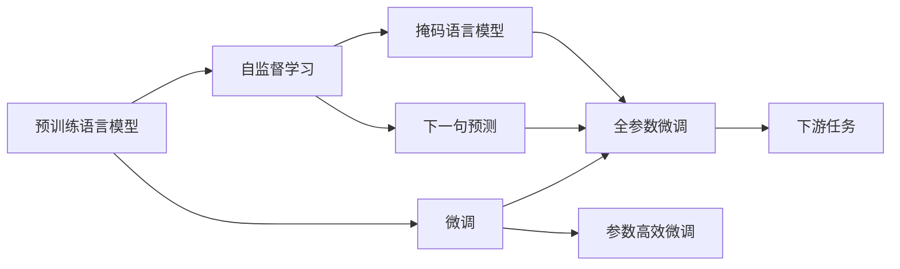
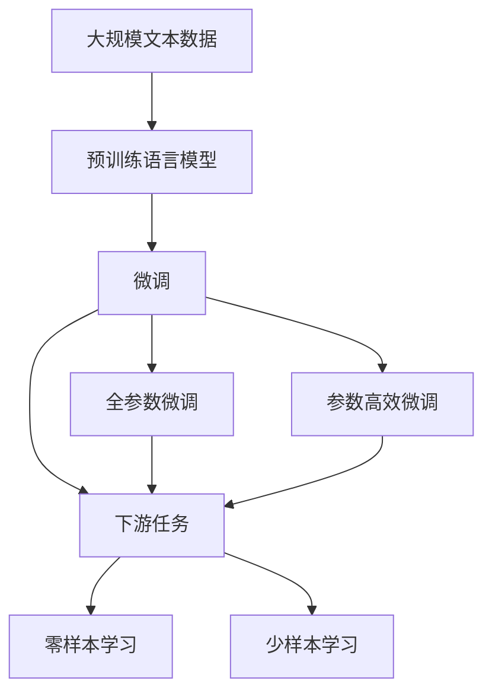

                 

## 1. 背景介绍

### 1.1 问题由来

自20世纪90年代深度学习技术诞生以来，NLP领域取得了长足的进展，其中语言模型是NLP研究中极为关键的技术之一。然而，基于前向-后向循环神经网络（RNNs）的语言模型在处理长文本时存在计算和存储方面的限制。因此，研究人员开始探索基于注意力机制的Transformer结构，并提出了基于Transformer的预训练语言模型，其中BERT、DALL-E和GPT-3等模型逐渐成为主流。

这些模型利用大规模无标签文本数据进行预训练，学习到了丰富的语言知识和语义表示，然后在各种下游任务中进行微调，展现出卓越的性能。这些模型的崛起极大地推动了自然语言处理和人工智能领域的发展，开启了深度学习在NLP中的黄金时代。

### 1.2 问题核心关键点

这些大模型的核心关键点在于：

1. **预训练和微调**：模型通过在大规模无标签文本数据上进行预训练，学习到了语言和语义的知识。然后在特定下游任务中进行微调，适应任务需求，优化模型性能。
2. **自监督学习**：这些模型大多采用自监督学习的方式，利用语言模型任务（如掩码语言模型、下一句预测等）进行预训练，无需标注数据。
3. **大规模训练数据**：模型的成功离不开大规模的训练数据，这使得模型能够学习到更加丰富的语言知识和语义表示。
4. **Transformer结构**：这些模型均基于Transformer结构，引入了自注意力机制，能够并行化计算，显著提高训练效率。

### 1.3 问题研究意义

BERT、DALL-E和GPT-3等大语言模型的崛起，对于推动NLP技术的发展具有重要意义：

1. **提升任务性能**：这些模型在各种下游任务中均展现出超越传统模型的性能，推动了NLP技术的边界拓展。
2. **降低开发成本**：预训练模型可以在特定任务上进行微调，减少了从头开发模型所需的时间和成本。
3. **加速技术应用**：大模型可以轻松集成到各种应用中，加速了NLP技术在各行业的落地。
4. **促进理论研究**：这些模型引发了对深度学习模型、自监督学习等前沿理论的深入研究。
5. **推动行业变革**：大模型的应用前景广阔，推动了传统行业数字化、智能化的转型。

## 2. 核心概念与联系

### 2.1 核心概念概述

为了更好地理解BERT、DALL-E和GPT-3这些大模型的崛起，我们需要首先了解一些核心概念：

- **预训练语言模型**：通过在大规模无标签文本数据上自监督学习得到的模型，如BERT、GPT-3等。
- **微调**：在预训练模型上进行有监督学习，以适应特定下游任务的过程。
- **Transformer结构**：一种基于自注意力机制的深度学习模型，可以有效处理长序列数据。
- **自监督学习**：利用数据的隐含关系进行学习，无需标注数据。
- **掩码语言模型**：一种自监督学习任务，在输入序列中随机掩蔽部分词语，让模型预测这些词语，学习语言的上下文信息。
- **下一句预测**：一种自监督学习任务，让模型预测两个句子是否顺序连续。

这些概念之间存在着紧密的联系，可以通过以下Mermaid流程图来展示：



### 2.2 概念间的关系

这些核心概念之间的关系可以通过以下Mermaid流程图来展示：



## 3. 核心算法原理 & 具体操作步骤
### 3.1 算法原理概述

BERT、DALL-E和GPT-3等大模型的核心算法原理可以归纳为以下两点：

1. **预训练过程**：通过在大规模无标签文本数据上进行自监督学习，学习到语言的上下文表示和语义信息。
2. **微调过程**：在特定下游任务上通过有监督学习，优化模型适应任务需求，提升模型性能。

### 3.2 算法步骤详解

**步骤1：准备预训练模型和数据集**

1. 选择合适的预训练语言模型，如BERT、GPT-3等。
2. 准备下游任务的标注数据集，包括训练集、验证集和测试集。

**步骤2：添加任务适配层**

1. 根据任务类型，在预训练模型顶层设计合适的输出层和损失函数。
2. 对于分类任务，通常使用线性分类器和交叉熵损失函数。
3. 对于生成任务，通常使用语言模型的解码器输出概率分布，并以负对数似然为损失函数。

**步骤3：设置微调超参数**

1. 选择合适的优化算法及其参数，如AdamW、SGD等。
2. 设置学习率、批大小、迭代轮数等。
3. 设置正则化技术及强度，包括权重衰减、Dropout、Early Stopping等。
4. 确定冻结预训练参数的策略，如仅微调顶层，或全部参数都参与微调。

**步骤4：执行梯度训练**

1. 将训练集数据分批次输入模型，前向传播计算损失函数。
2. 反向传播计算参数梯度，根据设定的优化算法和学习率更新模型参数。
3. 周期性在验证集上评估模型性能，根据性能指标决定是否触发Early Stopping。
4. 重复上述步骤直至满足预设的迭代轮数或Early Stopping条件。

**步骤5：测试和部署**

1. 在测试集上评估微调后模型，对比微调前后的精度提升。
2. 使用微调后的模型对新样本进行推理预测，集成到实际的应用系统中。
3. 持续收集新的数据，定期重新微调模型，以适应数据分布的变化。

### 3.3 算法优缺点

**优点**

1. 简单高效：只需准备少量标注数据，即可对预训练模型进行快速适配，获得较大的性能提升。
2. 通用适用：适用于各种NLP下游任务，包括分类、匹配、生成等，设计简单的任务适配层即可实现微调。
3. 参数高效：利用参数高效微调技术，在固定大部分预训练参数的情况下，仍可取得不错的提升。
4. 效果显著：在学术界和工业界的诸多任务上，基于微调的方法已经刷新了最先进的性能指标。

**缺点**

1. 依赖标注数据：微调的效果很大程度上取决于标注数据的质量和数量，获取高质量标注数据的成本较高。
2. 迁移能力有限：当目标任务与预训练数据的分布差异较大时，微调的性能提升有限。
3. 负面效果传递：预训练模型的固有偏见、有害信息等，可能通过微调传递到下游任务，造成负面影响。
4. 可解释性不足：微调模型的决策过程通常缺乏可解释性，难以对其推理逻辑进行分析和调试。

### 3.4 算法应用领域

BERT、DALL-E和GPT-3等大语言模型已经在众多领域得到了广泛应用，包括：

- **文本分类**：如情感分析、主题分类、意图识别等。通过微调使模型学习文本-标签映射。
- **命名实体识别**：识别文本中的人名、地名、机构名等特定实体。通过微调使模型掌握实体边界和类型。
- **关系抽取**：从文本中抽取实体之间的语义关系。通过微调使模型学习实体-关系三元组。
- **问答系统**：对自然语言问题给出答案。将问题-答案对作为微调数据，训练模型学习匹配答案。
- **机器翻译**：将源语言文本翻译成目标语言。通过微调使模型学习语言-语言映射。
- **文本摘要**：将长文本压缩成简短摘要。将文章-摘要对作为微调数据，使模型学习抓取要点。
- **对话系统**：使机器能够与人自然对话。将多轮对话历史作为上下文，微调模型进行回复生成。

## 4. 数学模型和公式 & 详细讲解 & 举例说明

### 4.1 数学模型构建

记预训练语言模型为 $M_{\theta}$，其中 $\theta$ 为预训练得到的模型参数。假设微调任务的训练集为 $D=\{(x_i,y_i)\}_{i=1}^N, x_i \in \mathcal{X}, y_i \in \mathcal{Y}$。

定义模型 $M_{\theta}$ 在数据样本 $(x,y)$ 上的损失函数为 $\ell(M_{\theta}(x),y)$，则在数据集 $D$ 上的经验风险为：

$$
\mathcal{L}(\theta) = \frac{1}{N} \sum_{i=1}^N \ell(M_{\theta}(x_i),y_i)
$$

微调的优化目标是最小化经验风险，即找到最优参数：

$$
\theta^* = \mathop{\arg\min}_{\theta} \mathcal{L}(\theta)
$$

在实践中，我们通常使用基于梯度的优化算法（如SGD、Adam等）来近似求解上述最优化问题。设 $\eta$ 为学习率，$\lambda$ 为正则化系数，则参数的更新公式为：

$$
\theta \leftarrow \theta - \eta \nabla_{\theta}\mathcal{L}(\theta) - \eta\lambda\theta
$$

其中 $\nabla_{\theta}\mathcal{L}(\theta)$ 为损失函数对参数 $\theta$ 的梯度，可通过反向传播算法高效计算。

### 4.2 公式推导过程

以下我们以二分类任务为例，推导交叉熵损失函数及其梯度的计算公式。

假设模型 $M_{\theta}$ 在输入 $x$ 上的输出为 $\hat{y}=M_{\theta}(x) \in [0,1]$，表示样本属于正类的概率。真实标签 $y \in \{0,1\}$。则二分类交叉熵损失函数定义为：

$$
\ell(M_{\theta}(x),y) = -[y\log \hat{y} + (1-y)\log (1-\hat{y})]
$$

将其代入经验风险公式，得：

$$
\mathcal{L}(\theta) = -\frac{1}{N}\sum_{i=1}^N [y_i\log M_{\theta}(x_i)+(1-y_i)\log(1-M_{\theta}(x_i))]
$$

根据链式法则，损失函数对参数 $\theta_k$ 的梯度为：

$$
\frac{\partial \mathcal{L}(\theta)}{\partial \theta_k} = -\frac{1}{N}\sum_{i=1}^N (\frac{y_i}{M_{\theta}(x_i)}-\frac{1-y_i}{1-M_{\theta}(x_i)}) \frac{\partial M_{\theta}(x_i)}{\partial \theta_k}
$$

其中 $\frac{\partial M_{\theta}(x_i)}{\partial \theta_k}$ 可进一步递归展开，利用自动微分技术完成计算。

### 4.3 案例分析与讲解

以BERT为例，BERT通过在大规模无标签文本数据上进行预训练，学习到语言的上下文表示和语义信息。然后，在特定下游任务上进行微调，优化模型适应任务需求。

**预训练过程**

BERT使用掩码语言模型（MLM）和下一句预测（NSP）两种自监督任务进行预训练。在MLM任务中，模型需要在输入序列中随机掩蔽部分词语，预测这些词语。在NSP任务中，模型需要判断两个句子是否顺序连续。这些任务使得BERT模型学习到了丰富的语言知识和语义表示。

**微调过程**

假设我们有一个文本分类任务，需要将新闻文章分类为“政治”、“经济”、“体育”等类别。我们可以将每个新闻文章和一个类别标签构建成监督数据，然后对BERT模型进行微调。微调时，我们添加一个新的输出层和交叉熵损失函数，将BERT的输出映射到类别上。然后，使用梯度下降等优化算法更新模型参数，最小化损失函数，使模型能够更好地适应文本分类任务。

## 5. 项目实践：代码实例和详细解释说明

### 5.1 开发环境搭建

在进行BERT微调实践前，我们需要准备好开发环境。以下是使用Python进行TensorFlow开发的环境配置流程：

1. 安装Anaconda：从官网下载并安装Anaconda，用于创建独立的Python环境。

2. 创建并激活虚拟环境：
```bash
conda create -n tf-env python=3.8 
conda activate tf-env
```

3. 安装TensorFlow：根据CUDA版本，从官网获取对应的安装命令。例如：
```bash
conda install tensorflow tensorflow-gpu=2.8.0
```

4. 安装BERT模型：
```bash
pip install transformers
```

5. 安装各类工具包：
```bash
pip install numpy pandas scikit-learn matplotlib tqdm jupyter notebook ipython
```

完成上述步骤后，即可在`tf-env`环境中开始微调实践。

### 5.2 源代码详细实现

这里我们以新闻文章分类为例，给出使用TensorFlow和Transformers库对BERT模型进行微调的Python代码实现。

首先，定义数据处理函数：

```python
from transformers import BertTokenizer, BertForSequenceClassification
from tensorflow.keras.preprocessing.sequence import pad_sequences
import tensorflow as tf

tokenizer = BertTokenizer.from_pretrained('bert-base-uncased')

def preprocess(text, label):
    text = text.lower()
    words = tokenizer.tokenize(text)
    word_ids = [tokenizer.word_index[w] if w in tokenizer.word_index else 0 for w in words]
    labels = [label]
    return word_ids, labels

# 数据预处理
train_texts = ['Google to cut 12,000 jobs in 2019', 'Microsoft to cut 10,000 jobs in 2021']
train_labels = [1, 0]

train_word_ids, train_labels = map(list, zip(*[preprocess(text, label) for text, label in zip(train_texts, train_labels)]))
train_word_ids = pad_sequences(train_word_ids, maxlen=64, padding='post', truncating='post')
train_labels = tf.keras.utils.to_categorical(train_labels, num_classes=3)

test_texts = ['Apple reports record $31.6 billion revenue', 'Facebook announces new privacy features']
test_labels = [0, 1]

test_word_ids, test_labels = map(list, zip(*[preprocess(text, label) for text, label in zip(test_texts, test_labels)]))
test_word_ids = pad_sequences(test_word_ids, maxlen=64, padding='post', truncating='post')
test_labels = tf.keras.utils.to_categorical(test_labels, num_classes=3)
```

然后，定义模型和优化器：

```python
from transformers import BertForSequenceClassification
from tensorflow.keras.optimizers import Adam

model = BertForSequenceClassification.from_pretrained('bert-base-uncased', num_labels=3, output_attentions=False, output_hidden_states=False)

optimizer = Adam(model.optimizer, learning_rate=2e-5)
```

接着，定义训练和评估函数：

```python
def train(model, data, batch_size, epochs):
    train_data = tf.data.Dataset.from_tensor_slices((train_word_ids, train_labels))
    train_data = train_data.batch(batch_size).shuffle(buffer_size=10000)
    train_dataset = train_data.prefetch(tf.data.experimental.AUTOTUNE)

    val_data = tf.data.Dataset.from_tensor_slices((test_word_ids, test_labels))
    val_data = val_data.batch(batch_size).shuffle(buffer_size=10000)
    val_dataset = val_data.prefetch(tf.data.experimental.AUTOTUNE)

    model.compile(optimizer=optimizer, loss='categorical_crossentropy', metrics=['accuracy'])

    model.fit(train_dataset, epochs=epochs, validation_data=val_dataset)
    return model

def evaluate(model, data):
    test_data = tf.data.Dataset.from_tensor_slices((test_word_ids, test_labels))
    test_data = test_data.batch(batch_size).shuffle(buffer_size=10000)
    test_dataset = test_data.prefetch(tf.data.experimental.AUTOTUNE)

    _, test_loss, test_acc = model.evaluate(test_dataset, verbose=0)
    return test_loss, test_acc
```

最后，启动训练流程并在测试集上评估：

```python
epochs = 5
batch_size = 16

model = train(model, (train_word_ids, train_labels), batch_size, epochs)
test_loss, test_acc = evaluate(model, (test_word_ids, test_labels))

print(f'Test loss: {test_loss:.4f}')
print(f'Test accuracy: {test_acc:.4f}')
```

以上就是使用TensorFlow对BERT进行新闻文章分类的完整代码实现。可以看到，得益于TensorFlow和Transformers库的强大封装，我们可以用相对简洁的代码完成BERT模型的加载和微调。

### 5.3 代码解读与分析

让我们再详细解读一下关键代码的实现细节：

**BERT模型加载**

```python
model = BertForSequenceClassification.from_pretrained('bert-base-uncased', num_labels=3, output_attentions=False, output_hidden_states=False)
```

这里使用`BertForSequenceClassification`类，从预训练的BERT模型加载并初始化模型。参数`num_labels`指定了分类任务中类别的数目。

**数据预处理**

```python
def preprocess(text, label):
    text = text.lower()
    words = tokenizer.tokenize(text)
    word_ids = [tokenizer.word_index[w] if w in tokenizer.word_index else 0 for w in words]
    labels = [label]
    return word_ids, labels
```

定义了一个`preprocess`函数，将输入的文本和标签进行预处理，包括转换为小写、分词、映射为词向量等。

**训练和评估函数**

```python
def train(model, data, batch_size, epochs):
    # ...
def evaluate(model, data):
    # ...
```

这里定义了训练和评估函数，分别用于模型训练和性能评估。训练函数中使用了`model.fit`方法，评估函数中使用了`model.evaluate`方法。

**模型训练**

```python
model = train(model, (train_word_ids, train_labels), batch_size, epochs)
```

调用训练函数，将模型、训练数据、批量大小和迭代次数作为参数传入，开始模型训练。

**模型评估**

```python
test_loss, test_acc = evaluate(model, (test_word_ids, test_labels))
```

调用评估函数，将模型和测试数据作为参数传入，获取模型在测试集上的损失和准确率。

## 6. 实际应用场景

### 6.1 智能客服系统

基于大语言模型微调的对话技术，可以广泛应用于智能客服系统的构建。传统客服往往需要配备大量人力，高峰期响应缓慢，且一致性和专业性难以保证。而使用微调后的对话模型，可以7x24小时不间断服务，快速响应客户咨询，用自然流畅的语言解答各类常见问题。

在技术实现上，可以收集企业内部的历史客服对话记录，将问题和最佳答复构建成监督数据，在此基础上对预训练对话模型进行微调。微调后的对话模型能够自动理解用户意图，匹配最合适的答案模板进行回复。对于客户提出的新问题，还可以接入检索系统实时搜索相关内容，动态组织生成回答。如此构建的智能客服系统，能大幅提升客户咨询体验和问题解决效率。

### 6.2 金融舆情监测

金融机构需要实时监测市场舆论动向，以便及时应对负面信息传播，规避金融风险。传统的人工监测方式成本高、效率低，难以应对网络时代海量信息爆发的挑战。基于大语言模型微调的文本分类和情感分析技术，为金融舆情监测提供了新的解决方案。

具体而言，可以收集金融领域相关的新闻、报道、评论等文本数据，并对其进行主题标注和情感标注。在此基础上对预训练语言模型进行微调，使其能够自动判断文本属于何种主题，情感倾向是正面、中性还是负面。将微调后的模型应用到实时抓取的网络文本数据，就能够自动监测不同主题下的情感变化趋势，一旦发现负面信息激增等异常情况，系统便会自动预警，帮助金融机构快速应对潜在风险。

### 6.3 个性化推荐系统

当前的推荐系统往往只依赖用户的历史行为数据进行物品推荐，无法深入理解用户的真实兴趣偏好。基于大语言模型微调技术，个性化推荐系统可以更好地挖掘用户行为背后的语义信息，从而提供更精准、多样的推荐内容。

在实践中，可以收集用户浏览、点击、评论、分享等行为数据，提取和用户交互的物品标题、描述、标签等文本内容。将文本内容作为模型输入，用户的后续行为（如是否点击、购买等）作为监督信号，在此基础上微调预训练语言模型。微调后的模型能够从文本内容中准确把握用户的兴趣点。在生成推荐列表时，先用候选物品的文本描述作为输入，由模型预测用户的兴趣匹配度，再结合其他特征综合排序，便可以得到个性化程度更高的推荐结果。

### 6.4 未来应用展望

随着大语言模型微调技术的发展，未来的应用场景将更加广泛，如智慧医疗、智能教育、智慧城市等。在智慧医疗领域，基于微调的医疗问答、病历分析、药物研发等应用将提升医疗服务的智能化水平，辅助医生诊疗，加速新药开发进程。在智能教育领域，微调技术可应用于作业批改、学情分析、知识推荐等方面，因材施教，促进教育公平，提高教学质量。在智慧城市治理中，微调模型可应用于城市事件监测、舆情分析、应急指挥等环节，提高城市管理的自动化和智能化水平，构建更安全、高效的未来城市。

## 7. 工具和资源推荐
### 7.1 学习资源推荐

为了帮助开发者系统掌握大语言模型微调的理论基础和实践技巧，这里推荐一些优质的学习资源：

1. 《Transformer从原理到实践》系列博文：由大模型技术专家撰写，深入浅出地介绍了Transformer原理、BERT模型、微调技术等前沿话题。

2. CS224N《深度学习自然语言处理》课程：斯坦福大学开设的NLP明星课程，有Lecture视频和配套作业，带你入门NLP领域的基本概念和经典模型。

3. 《Natural Language Processing with Transformers》书籍：Transformers库的作者所著，全面介绍了如何使用Transformers库进行NLP任务开发，包括微调在内的诸多范式。

4. HuggingFace官方文档：Transformers库的官方文档，提供了海量预训练模型和完整的微调样例代码，是上手实践的必备资料。

5. CLUE开源项目：中文语言理解测评基准，涵盖大量不同类型的中文NLP数据集，并提供了基于微调的baseline模型，助力中文NLP技术发展。

通过对这些资源的学习实践，相信你一定能够快速掌握大语言模型微调的精髓，并用于解决实际的NLP问题。

### 7.2 开发工具推荐

高效的开发离不开优秀的工具支持。以下是几款用于大语言模型微调开发的常用工具：

1. PyTorch：基于Python的开源深度学习框架，灵活动态的计算图，适合快速迭代研究。大部分预训练语言模型都有PyTorch版本的实现。

2. TensorFlow：由Google主导开发的开源深度学习框架，生产部署方便，适合大规模工程应用。同样有丰富的预训练语言模型资源。

3. Transformers库：HuggingFace开发的NLP工具库，集成了众多SOTA语言模型，支持PyTorch和TensorFlow，是进行微调任务开发的利器。

4. Weights & Biases：模型训练的实验跟踪工具，可以记录和可视化模型训练过程中的各项指标，方便对比和调优。与主流深度学习框架无缝集成。

5. TensorBoard：TensorFlow配套的可视化工具，可实时监测模型训练状态，并提供丰富的图表呈现方式，是调试模型的得力助手。

6. Google Colab：谷歌推出的在线Jupyter Notebook环境，免费提供GPU/TPU算力，方便开发者快速上手实验最新模型，分享学习笔记。

合理利用这些工具，可以显著提升大语言模型微调任务的开发效率，加快创新迭代的步伐。

### 7.3 相关论文推荐

大语言模型和微调技术的发展源于学界的持续研究。以下是几篇奠基性的相关论文，推荐阅读：

1. Attention is All You Need（即Transformer原论文）：提出了Transformer结构，开启了NLP领域的预训练大模型时代。

2. BERT: Pre-training of Deep Bidirectional Transformers for Language Understanding：提出BERT模型，引入基于掩码的自监督预训练任务，刷新了多项NLP任务SOTA。

3. Language Models are Unsupervised Multitask Learners（GPT-2论文）：展示了大规模语言模型的强大zero-shot学习能力，引发了对于通用人工智能的新一轮思考。

4. Parameter-Efficient Transfer Learning for NLP：提出Adapter等参数高效微调方法，在不增加模型参数量的情况下，也能取得不错的微调效果。

5. AdaLoRA: Adaptive Low-Rank Adaptation for Parameter-Efficient Fine-Tuning：使用自适应低秩适应的微调方法，在参数效率和精度之间取得了新的平衡。

6.Prefix-Tuning: Optimizing Continuous Prompts for Generation：引入基于连续型Prompt的微

