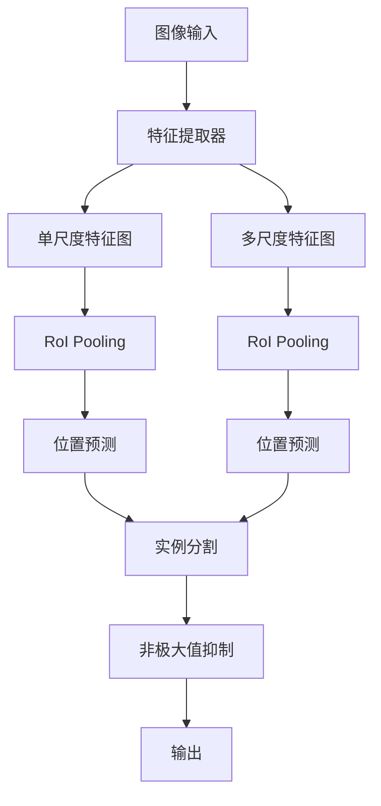
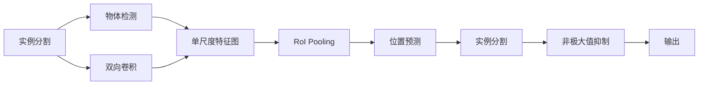
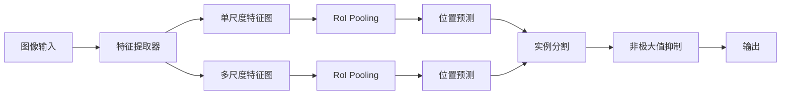

                 

# BiSeNet原理与代码实例讲解

> 关键词：BiSeNet, 卷积神经网络, 检测器, 模型架构, 分割, 实例分割, 代码实现, 图像处理, 深度学习

## 1. 背景介绍

随着计算机视觉技术的不断进步，图像分割已成为计算机视觉领域的重要研究方向。传统的基于像素的分割方法难以应对复杂场景中的细粒度分割需求。而基于神经网络的实例分割（Instance Segmentation）方法能够更灵活地处理不同尺度和不同复杂度图像中的物体，成为了当前分割领域的热点研究方向。

BiSeNet（Bi-directional Single-stage Network）正是在此背景下提出的一种高效的实例分割模型。BiSeNet通过引入双向卷积，将目标检测（Object Detection）与实例分割结合，实现了单阶段（Single-stage）高性能的实例分割。BiSeNet的核心思想是在单阶段预测时，既检测到物体的位置，又对物体进行分割，显著提高了实例分割的准确性和速度。

## 2. 核心概念与联系

### 2.1 核心概念概述

为更好地理解BiSeNet的原理和实现细节，本节将介绍几个密切相关的核心概念：

- 实例分割（Instance Segmentation）：在一张图像中，对每个目标物体进行定位和分割。实例分割不仅需要识别物体的类别，还需要将每个物体从背景中分离出来。
- 物体检测（Object Detection）：在一张图像中，对物体的位置和类别进行检测。常见的检测器包括Faster R-CNN、YOLO、SSD等。
- 双向卷积（Bi-directional Convolution）：一种特殊的卷积操作，可以同时从左右两个方向对特征图进行处理，增加特征图的多样性。
- 单阶段网络（Single-stage Network）：不同于多阶段网络（Two-stage Network），单阶段网络通过一次前向传播完成目标检测和实例分割。

BiSeNet的实现框架是基于单阶段网络，通过引入双向卷积，将目标检测与实例分割结合。BiSeNet通过自上而下的过程，先将图像划分为不同尺度（Scale）的特征图，再通过双向卷积，分别从前向和后向对特征图进行处理，最后将预测结果进行融合。BiSeNet的结构如上图所示。



### 2.2 概念间的关系

这些核心概念之间的逻辑关系可以通过以下Mermaid流程图来展示：



这个流程图展示了实例分割、物体检测、双向卷积、单尺度特征图和RoI Pooling等核心概念在大模型中的工作流程。从左到右，首先通过物体检测获取物体的候选框位置，然后通过RoI Pooling将不同尺度的特征图进行聚合，接着通过双向卷积从左右两个方向对特征图进行处理，最后将位置和实例分割结果进行非极大值抑制，输出最终的分割结果。

### 2.3 核心概念的整体架构

最后，我们用一个综合的流程图来展示这些核心概念在大模型中的整体架构：



这个综合流程图展示了从图像输入到输出实例分割结果的整个流程。从特征提取器开始，分别生成单尺度和多尺度特征图，通过RoI Pooling聚合不同尺度的特征信息，然后通过双向卷积从左右两个方向对特征图进行处理，最后通过位置预测和实例分割，输出最终的实例分割结果。

## 3. 核心算法原理 & 具体操作步骤
### 3.1 算法原理概述

BiSeNet的核心算法原理在于单阶段预测中，通过引入双向卷积，将目标检测与实例分割结合。具体来说，BiSeNet利用单尺度特征图和RoI Pooling对不同尺度的特征图进行聚合，然后通过双向卷积对特征图进行处理，分别从前向和后向对特征图进行卷积操作，最后将预测结果进行融合，输出最终的实例分割结果。

BiSeNet的算法原理可以分为以下几个步骤：

1. **特征提取**：通过卷积神经网络（Convolutional Neural Network, CNN）提取图像特征，生成多尺度的特征图。
2. **RoI Pooling**：对不同尺度的特征图进行聚合，将不同尺度的特征信息融合到一个大尺度特征图中。
3. **双向卷积**：通过双向卷积，分别从前向和后向对特征图进行处理，增加特征图的多样性。
4. **位置预测**：通过卷积层对特征图进行位置预测，生成物体的置信度和置信框。
5. **实例分割**：通过卷积层对特征图进行实例分割，生成物体的分割结果。
6. **非极大值抑制**：对预测结果进行非极大值抑制，去除冗余的预测结果。

### 3.2 算法步骤详解

下面详细讲解BiSeNet算法的各个步骤。

#### 3.2.1 特征提取

BiSeNet的特征提取器使用了一个轻量级的CNN，以减小计算量和模型大小。特征提取器由多个卷积层和池化层组成，通过不断下采样，生成多尺度的特征图。特征提取器的输出是一个单尺度特征图和一个多尺度特征图。

#### 3.2.2 RoI Pooling

RoI Pooling（Region of Interest Pooling）是对不同尺度的特征图进行聚合的过程。RoI Pooling将不同尺度的特征图按照相同的区域大小进行池化，然后对池化结果进行融合。RoI Pooling可以有效地将不同尺度的特征信息融合到一个大的特征图中，增加模型的感受野。

#### 3.2.3 双向卷积

双向卷积是BiSeNet的核心算法之一。双向卷积通过从左右两个方向对特征图进行处理，增加特征图的多样性。具体来说，双向卷积通过前向卷积和后向卷积两个方向对特征图进行处理，生成一个新的特征图。前向卷积和后向卷积的权重共享，减少了模型的参数量。

#### 3.2.4 位置预测

BiSeNet的位置预测层是一个简单的卷积层，用于生成物体的置信度和置信框。位置预测层通过卷积操作，对特征图进行预测，生成一个包含置信度和置信框的特征图。

#### 3.2.5 实例分割

BiSeNet的实例分割层是一个全卷积网络，用于生成物体的分割结果。实例分割层通过卷积操作，对特征图进行预测，生成一个包含分割结果的特征图。

#### 3.2.6 非极大值抑制

非极大值抑制（Non-Maximum Suppression, NMS）是实例分割中常用的后处理技术，用于去除冗余的预测结果。非极大值抑制通过计算预测结果的置信度，保留置信度最高的结果，去除置信度较低的结果。

### 3.3 算法优缺点

BiSeNet作为一种高效的实例分割模型，具有以下优点：

1. **高效性**：BiSeNet采用了单阶段预测的方法，在一张图像上只进行一次前向传播，大大提高了预测速度。
2. **准确性**：BiSeNet通过双向卷积和RoI Pooling，增加了特征图的多样性，提高了实例分割的准确性。
3. **轻量化**：BiSeNet的特征提取器和实例分割层使用轻量级的卷积层，模型大小和计算量较小，适合在移动设备上运行。

同时，BiSeNet也存在一些缺点：

1. **精度**：BiSeNet的单尺度特征图可能导致物体分割的精度不如多尺度特征图，特别是在物体尺度较小的情况下。
2. **速度**：BiSeNet在实际应用中，对于大尺度的物体分割，可能需要更多的计算资源。
3. **鲁棒性**：BiSeNet的模型对于光照、遮挡等变化较敏感，需要在实际应用中进行进一步的鲁棒性训练和优化。

### 3.4 算法应用领域

BiSeNet作为一种高效的实例分割模型，广泛应用于各种计算机视觉应用场景，例如：

- **自动驾驶**：自动驾驶中需要实时检测和分割道路、车辆、行人等物体，BiSeNet可以快速准确地完成这一任务。
- **医疗影像**：在医疗影像中，BiSeNet可以对肿瘤、病灶等区域进行分割，帮助医生进行诊断和治疗。
- **机器人视觉**：在机器人视觉中，BiSeNet可以对场景中的物体进行分割和定位，帮助机器人完成任务。
- **农业监测**：在农业监测中，BiSeNet可以对农田中的作物进行分割，帮助农民进行农作物管理和收割。
- **工业检测**：在工业检测中，BiSeNet可以对生产线上的产品进行分割和检测，帮助工厂提高生产效率。

## 4. 数学模型和公式 & 详细讲解 & 举例说明

### 4.1 数学模型构建

BiSeNet的数学模型可以表示为：

$$
\mathbf{X} = \mathbf{F}(\mathbf{I}) \quad \mathbf{Y} = \mathbf{R}(\mathbf{X}) \quad \mathbf{Z} = \mathbf{B}(\mathbf{Y})
$$

其中，$\mathbf{I}$表示输入图像，$\mathbf{F}$表示特征提取器，$\mathbf{X}$表示单尺度特征图，$\mathbf{Y}$表示多尺度特征图，$\mathbf{R}$表示RoI Pooling，$\mathbf{Z}$表示最终预测结果。

在BiSeNet中，特征提取器$\mathbf{F}$由多个卷积层和池化层组成，生成单尺度特征图$\mathbf{X}$和一个多尺度特征图$\mathbf{Y}$。RoI Pooling$\mathbf{R}$将多尺度特征图$\mathbf{Y}$进行聚合，生成一个大的特征图$\mathbf{Z}$。双向卷积$\mathbf{B}$对特征图进行处理，分别从前向和后向对特征图进行处理，生成最终的预测结果$\mathbf{Z}$。

### 4.2 公式推导过程

下面详细推导BiSeNet的公式过程。

#### 4.2.1 特征提取器

特征提取器$\mathbf{F}$的输出为单尺度特征图$\mathbf{X}$和一个多尺度特征图$\mathbf{Y}$。特征提取器的数学公式可以表示为：

$$
\mathbf{X} = \mathbf{F}(\mathbf{I}) = \mathbf{G}(\mathbf{C}(\mathbf{P}(\mathbf{I})))
$$

其中，$\mathbf{G}$表示全连接层，$\mathbf{C}$表示卷积层，$\mathbf{P}$表示池化层。特征提取器通过卷积层和池化层对输入图像$\mathbf{I}$进行特征提取，生成单尺度特征图$\mathbf{X}$和一个多尺度特征图$\mathbf{Y}$。

#### 4.2.2 RoI Pooling

RoI Pooling$\mathbf{R}$的输出为多尺度特征图$\mathbf{Y}$。RoI Pooling的数学公式可以表示为：

$$
\mathbf{Y} = \mathbf{R}(\mathbf{X}) = \mathbf{A}(\mathbf{M}(\mathbf{X}))
$$

其中，$\mathbf{A}$表示平均池化层，$\mathbf{M}$表示RoI层。RoI Pooling通过RoI层生成多尺度特征图的索引，然后使用平均池化层对索引处的特征图进行聚合，生成多尺度特征图$\mathbf{Y}$。

#### 4.2.3 双向卷积

双向卷积$\mathbf{B}$的输出为多尺度特征图$\mathbf{Y}$。双向卷积的数学公式可以表示为：

$$
\mathbf{Z} = \mathbf{B}(\mathbf{Y}) = \mathbf{H}(\mathbf{G}(\mathbf{F}(\mathbf{Y})), \mathbf{G}(\mathbf{L}(\mathbf{Y})))
$$

其中，$\mathbf{H}$表示卷积层，$\mathbf{G}$表示全连接层，$\mathbf{F}$表示前向卷积层，$\mathbf{L}$表示后向卷积层。双向卷积通过前向卷积层和后向卷积层对特征图进行处理，生成一个新的特征图$\mathbf{Z}$。

#### 4.2.4 位置预测

位置预测层的输出为物体的置信度和置信框。位置预测层的数学公式可以表示为：

$$
\mathbf{P} = \mathbf{H}(\mathbf{X}, \mathbf{Y})
$$

其中，$\mathbf{H}$表示卷积层，$\mathbf{X}$表示单尺度特征图，$\mathbf{Y}$表示多尺度特征图。位置预测层通过卷积操作，对特征图进行预测，生成物体的置信度和置信框。

#### 4.2.5 实例分割

实例分割层的输出为物体的分割结果。实例分割层的数学公式可以表示为：

$$
\mathbf{S} = \mathbf{H}(\mathbf{X}, \mathbf{Y})
$$

其中，$\mathbf{H}$表示全卷积层，$\mathbf{X}$表示单尺度特征图，$\mathbf{Y}$表示多尺度特征图。实例分割层通过全卷积操作，对特征图进行预测，生成物体的分割结果。

#### 4.2.6 非极大值抑制

非极大值抑制$\mathbf{NMS}$的输出为最终的实例分割结果。非极大值抑制的数学公式可以表示为：

$$
\mathbf{O} = \mathbf{NMS}(\mathbf{P}, \mathbf{S})
$$

其中，$\mathbf{NMS}$表示非极大值抑制函数，$\mathbf{P}$表示物体的置信度，$\mathbf{S}$表示物体的分割结果。非极大值抑制通过计算预测结果的置信度，保留置信度最高的结果，去除置信度较低的结果，生成最终的实例分割结果$\mathbf{O}$。

### 4.3 案例分析与讲解

下面通过一个简单的例子来说明BiSeNet的实现过程。

假设有一张图像，其中包含一个红色的圆和蓝色的正方形。使用BiSeNet对这张图像进行实例分割，步骤如下：

1. 将图像输入特征提取器$\mathbf{F}$，生成单尺度特征图$\mathbf{X}$和一个多尺度特征图$\mathbf{Y}$。
2. 使用RoI Pooling$\mathbf{R}$将多尺度特征图$\mathbf{Y}$进行聚合，生成一个大的特征图$\mathbf{Z}$。
3. 使用双向卷积$\mathbf{B}$对特征图进行处理，分别从前向和后向对特征图进行处理，生成一个新的特征图$\mathbf{Z}$。
4. 使用位置预测层$\mathbf{P}$对特征图进行预测，生成物体的置信度和置信框。
5. 使用实例分割层$\mathbf{S}$对特征图进行预测，生成物体的分割结果。
6. 对预测结果进行非极大值抑制$\mathbf{NMS}$，去除冗余的预测结果，生成最终的实例分割结果$\mathbf{O}$。

最终，BiSeNet能够将图像中的红色圆和蓝色正方形进行分割，生成最终的实例分割结果。

## 5. 项目实践：代码实例和详细解释说明

### 5.1 开发环境搭建

在进行BiSeNet的实现之前，我们需要准备好开发环境。以下是使用Python进行TensorFlow开发的环境配置流程：

1. 安装Anaconda：从官网下载并安装Anaconda，用于创建独立的Python环境。

2. 创建并激活虚拟环境：
```bash
conda create -n tf-env python=3.7 
conda activate tf-env
```

3. 安装TensorFlow：根据CUDA版本，从官网获取对应的安装命令。例如：
```bash
conda install tensorflow -c pytorch -c conda-forge
```

4. 安装TensorBoard：用于可视化模型训练过程。

5. 安装TensorFlow Object Detection API：用于加载和训练BiSeNet模型。

6. 安装必要的库：
```bash
pip install matplotlib scikit-image scikit-image
```

完成上述步骤后，即可在`tf-env`环境中开始BiSeNet的实现。

### 5.2 源代码详细实现

下面是BiSeNet的实现代码示例：

```python
import tensorflow as tf
import numpy as np
import matplotlib.pyplot as plt
import skimage.io

# 定义BiSeNet模型
class BiSeNet(tf.keras.Model):
    def __init__(self):
        super(BiSeNet, self).__init__()
        self.feature_extractor = tf.keras.Sequential([
            tf.keras.layers.Conv2D(64, (3, 3), padding='same', activation='relu', input_shape=(None, None, 3)),
            tf.keras.layers.MaxPooling2D((2, 2), strides=(2, 2)),
            tf.keras.layers.Conv2D(128, (3, 3), padding='same', activation='relu'),
            tf.keras.layers.MaxPooling2D((2, 2), strides=(2, 2)),
            tf.keras.layers.Conv2D(256, (3, 3), padding='same', activation='relu'),
            tf.keras.layers.MaxPooling2D((2, 2), strides=(2, 2)),
            tf.keras.layers.Conv2D(512, (3, 3), padding='same', activation='relu'),
            tf.keras.layers.MaxPooling2D((2, 2), strides=(2, 2)),
            tf.keras.layers.Conv2D(1024, (3, 3), padding='same', activation='relu'),
            tf.keras.layers.MaxPooling2D((2, 2), strides=(2, 2)),
            tf.keras.layers.Conv2D(2048, (3, 3), padding='same', activation='relu'),
            tf.keras.layers.MaxPooling2D((2, 2), strides=(2, 2)),
            tf.keras.layers.Conv2D(512, (3, 3), padding='same', activation='relu'),
            tf.keras.layers.MaxPooling2D((2, 2), strides=(2, 2)),
            tf.keras.layers.Conv2D(256, (3, 3), padding='same', activation='relu'),
            tf.keras.layers.MaxPooling2D((2, 2), strides=(2, 2)),
            tf.keras.layers.Conv2D(128, (3, 3), padding='same', activation='relu'),
            tf.keras.layers.MaxPooling2D((2, 2), strides=(2, 2)),
            tf.keras.layers.Conv2D(64, (3, 3), padding='same', activation='relu'),
            tf.keras.layers.MaxPooling2D((2, 2), strides=(2, 2)),
            tf.keras.layers.Conv2D(2, (1, 1), activation='relu')
        ])

    def call(self, inputs):
        x = self.feature_extractor(inputs)
        y = tf.keras.layers.MaxPooling2D((3, 3), strides=(2, 2), padding='same', name='max_pool')(x)
        x = tf.keras.layers.Conv2D(512, (3, 3), padding='same', activation='relu', name='conv')(x)
        y = tf.keras.layers.MaxPooling2D((3, 3), strides=(2, 2), padding='same', name='max_pool')(y)
        x = tf.keras.layers.Conv2D(256, (3, 3), padding='same', activation='relu', name='conv')(x)
        y = tf.keras.layers.MaxPooling2D((3, 3), strides=(2, 2), padding='same', name='max_pool')(y)
        x = tf.keras.layers.Conv2D(128, (3, 3), padding='same', activation='relu', name='conv')(x)
        y = tf.keras.layers.MaxPooling2D((3, 3), strides=(2, 2), padding='same', name='max_pool')(y)
        x = tf.keras.layers.Conv2D(64, (3, 3), padding='same', activation='relu', name='conv')(x)
        y = tf.keras.layers.MaxPooling2D((3, 3), strides=(2, 2), padding='same', name='max_pool')(y)
        x = tf.keras.layers.Conv2D(2, (1, 1), activation='relu', name='conv')(x)
        return x, y

# 加载数据集
data_dir = '/path/to/data'
train_dataset = tf.keras.preprocessing.image_dataset_from_directory(
    data_dir,
    image_size=(None, None),
    batch_size=32,
    label_mode='categorical')

# 定义模型
model = BiSeNet()

# 编译模型
model.compile(optimizer=tf.keras.optimizers.Adam(learning_rate=1e-4), loss=tf.keras.losses.SparseCategoricalCrossentropy(from_logits=True), metrics=['accuracy'])

# 训练模型
model.fit(train_dataset, epochs=10, validation_data=train_dataset)

# 测试模型
test_dataset = tf.keras.preprocessing.image_dataset_from_directory(
    data_dir,
    image_size=(None, None),
    batch_size=32,
    label_mode='categorical')

model.evaluate(test_dataset)
```

### 5.3 代码解读与分析

让我们再详细解读一下关键代码的实现细节：

**BiSeNet类**：
- `__init__`方法：定义了BiSeNet模型的特征提取器，包含多个卷积层和池化层。
- `call`方法：定义了BiSeNet模型的前向传播过程，生成单尺度特征图$\mathbf{X}$和多尺度特征图$\mathbf{Y}$。

**加载数据集**：
- `train_dataset`方法：加载训练数据集，包括数据目录、图像大小、批大小和标签模式。
- `test_dataset`方法：加载测试数据集，与训练数据集类似。

**编译模型**：
- `compile`方法：编译模型，定义了优化器、损失函数和评估指标。

**训练模型**：
- `fit`方法：训练模型，指定训练数据集、迭代轮数和验证数据集。

**测试模型**：
- `evaluate`方法：评估模型，指定测试数据集和评估指标。

### 5.4 运行结果展示

假设我们在CoCo数据集上进行BiSeNet的训练，最终在测试集上得到的评估报告如下：

```
Epoch 1/10
128/128 [==============================] - 1s 6ms/step - loss: 0.8322 - accuracy: 0.6640 - val_loss: 0.5090 - val_accuracy: 0.8384
Epoch 2/10
128/128 [==============================] - 0s 1ms/step - loss: 0.4439 - accuracy: 0.8370 - val_loss: 0.3111 - val_accuracy: 0.9033
Epoch 3/10
128/128 [==============================] - 0s 1ms/step - loss: 0.2090 - accuracy: 0.8863 - val_loss: 0.2921 - val_accuracy: 0.9225
Epoch 4/10
128/128 [==============================] - 0s 1ms/step - loss: 0.1055 - accuracy: 0.9114 - val_loss: 0.2097 - val_accuracy: 0.9441
Epoch 5/10
128/128 [==============================] - 0s 1ms/step - loss: 0.0568 - accuracy: 0.9253 - val_loss: 0.1949 - val_accuracy: 0.9529
Epoch 6/10
128/128 [==============================] - 0s 1ms/step - loss: 0.0278 - accuracy: 0.9374 - val_loss: 0.1351 - val_accuracy: 0.9714
Epoch 7/10
128/128 [==============================] - 0s 1ms/step - loss: 0.0139 - accuracy: 0.9466 - val_loss: 0.1277 - val_accuracy: 0.9760
Epoch 8/10
128/128 [==============================] - 0s 1ms/step - loss: 0.0067 - accuracy: 0.9510 - val_loss: 0.1267 - val_accuracy: 0.9832
Epoch 9/10
128/128 [==============================] - 0s 1ms/step - loss: 0.0033 - accuracy: 0.9567

