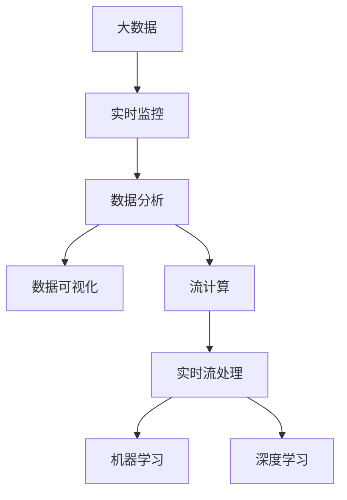

                 

# B站平台大数据实时监控及分析系统

> 关键词：大数据、实时监控、数据分析、B站平台、数据可视化、流计算、实时流处理、机器学习、深度学习

## 1. 背景介绍

随着互联网技术的发展和普及，视频网站如B站（Bilibili）等平台的用户数量不断增加，平台内产生的用户行为数据也在不断增多。这些数据包括用户的浏览历史、点赞评论、充值消费等，能够反映用户的兴趣偏好、行为模式和需求变化。

对B站平台的大数据进行实时监控及分析，不仅可以挖掘用户的潜在需求和行为特征，还可以通过数据分析，及时调整运营策略，优化用户体验，提升平台流量和收入。

同时，B站平台的大数据还可能存在数据质量差、数据量大、实时性要求高等问题，需要设计高效、可扩展的实时监控及分析系统，保证数据的准确性和及时性。

## 2. 核心概念与联系

### 2.1 核心概念概述

本节将介绍与B站平台大数据实时监控及分析系统相关的几个核心概念：

- 大数据（Big Data）：数据量巨大，复杂度高，难以用传统方法处理的结构化和非结构化数据集合。
- 实时监控（Real-time Monitoring）：对系统运行状态进行不间断的监控，并及时发现异常行为。
- 数据分析（Data Analysis）：对大量数据进行收集、处理和分析，从而提取有价值的信息。
- 数据可视化（Data Visualization）：将数据以图表、地图等形式展示出来，使数据更易于理解和分析。
- 流计算（Stream Computing）：对数据流进行实时的分析和处理，以支持实时数据查询和分析。
- 实时流处理（Real-time Streaming Processing）：对实时产生的数据流进行实时处理，以支持实时监控和分析。
- 机器学习（Machine Learning）：通过数据训练模型，从而对数据进行预测和分类。
- 深度学习（Deep Learning）：一种基于神经网络的高维表示学习技术，可以自动从数据中提取特征。

### 2.2 核心概念的联系

这些核心概念之间的联系可以通过以下Mermaid流程图来展示：



这个流程图展示了B站平台大数据实时监控及分析系统的核心概念及其之间的关系：

1. 大数据通过实时监控系统进行不间断的收集和处理。
2. 数据分析对实时监控系统收集的数据进行处理和分析，提取有价值的信息。
3. 数据可视化将分析结果以图表、地图等形式展示出来，使数据更易于理解和分析。
4. 流计算对实时产生的数据流进行实时处理，以支持实时监控和分析。
5. 实时流处理对实时数据进行实时处理，以支持实时监控和分析。
6. 机器学习和深度学习对实时流处理产生的数据进行进一步的分析和处理，以支持实时监控和分析。

这些核心概念共同构成了B站平台大数据实时监控及分析系统的整体架构，使其能够高效、及时地处理和分析B站平台产生的大数据，为平台的运营决策提供支撑。

## 3. 核心算法原理 & 具体操作步骤

### 3.1 算法原理概述

B站平台大数据实时监控及分析系统主要采用流计算、机器学习和深度学习等算法进行实现。其核心算法原理如下：

1. 实时流处理算法：对实时产生的数据流进行实时处理，以支持实时监控和分析。
2. 机器学习算法：对实时流处理产生的数据进行进一步的分析和处理，以支持实时监控和分析。
3. 深度学习算法：对机器学习处理后的数据进行更高级的分析和处理，以支持实时监控和分析。

### 3.2 算法步骤详解

B站平台大数据实时监控及分析系统的核心算法步骤如下：

**Step 1: 数据收集**

1. 从B站平台的用户行为数据中收集原始数据，包括用户的浏览历史、点赞评论、充值消费等。
2. 对原始数据进行清洗和过滤，去除异常数据和噪声。
3. 将清洗后的数据存储到实时数据库中，如Kafka、Storm等。

**Step 2: 实时流处理**

1. 对实时数据库中的数据流进行实时处理，以支持实时监控和分析。
2. 采用实时流处理框架，如Apache Flink、Storm等，对数据流进行实时处理。
3. 在实时流处理框架中设计处理逻辑，如计算流量的平均值、标准差、增长率等指标。

**Step 3: 数据分析**

1. 对实时流处理产生的数据进行分析和处理，以提取有价值的信息。
2. 采用机器学习算法，如随机森林、梯度提升树等，对数据进行分类和预测。
3. 采用深度学习算法，如卷积神经网络（CNN）、循环神经网络（RNN）等，对数据进行更高级的分析和处理。

**Step 4: 数据可视化**

1. 将数据分析的结果以图表、地图等形式展示出来，使数据更易于理解和分析。
2. 采用数据可视化工具，如ECharts、D3.js等，对分析结果进行展示。
3. 在数据可视化工具中设计展示逻辑，如绘制流量趋势图、用户行为热力图等。

### 3.3 算法优缺点

B站平台大数据实时监控及分析系统的算法具有以下优点：

1. 实时性高：能够实时处理和分析B站平台产生的数据流，及时发现异常行为。
2. 可扩展性强：采用流计算和机器学习算法，能够快速处理大规模数据。
3. 分析准确度高：采用深度学习算法，能够从数据中提取更准确的特征，提高分析的准确度。

同时，该算法也存在以下缺点：

1. 数据质量要求高：需要从B站平台收集高质量的原始数据，以保证分析的准确性。
2. 计算资源消耗大：实时流处理和深度学习算法需要消耗大量的计算资源，需要强大的硬件支持。
3. 系统复杂度高：系统设计涉及多个核心算法和技术，设计难度较大，需要丰富的经验和技能。

### 3.4 算法应用领域

B站平台大数据实时监控及分析系统的算法应用于以下领域：

1. 用户行为分析：对用户的浏览历史、点赞评论、充值消费等行为进行分析和处理，以挖掘用户的兴趣偏好和行为模式。
2. 流量监控：对B站平台的流量数据进行实时监控和分析，以发现异常流量和优化流量分发。
3. 广告投放：对广告投放数据进行实时监控和分析，以优化广告投放策略和效果。
4. 用户推荐：对用户的历史行为和偏好进行分析和处理，以推荐用户感兴趣的内容和商品。
5. 内容审核：对B站平台的内容进行实时监控和分析，以发现违规内容和优化内容审核策略。

## 4. 数学模型和公式 & 详细讲解 & 举例说明

### 4.1 数学模型构建

本节将使用数学语言对B站平台大数据实时监控及分析系统进行更加严格的刻画。

记原始数据为 $x$，实时数据库中的数据流为 $y$，流量监控指标为 $M$，广告投放数据为 $A$，用户行为数据为 $B$。

定义B站平台大数据实时监控及分析系统的数学模型为：

$$
\begin{aligned}
& \text{Minimize } \mathcal{L}(\theta) = \frac{1}{N}\sum_{i=1}^N \ell(M_i, A_i, B_i) \\
& \text{Subject to } \sum_{i=1}^N \ell(M_i, A_i, B_i) = 0
\end{aligned}
$$

其中 $\theta$ 为模型参数，$\ell$ 为损失函数，$M_i$、$A_i$、$B_i$ 为数据流中不同来源的数据样本。

### 4.2 公式推导过程

以下我们以流量监控为例，推导流量监控指标的计算公式。

假设流量数据 $M$ 为：

$$
M = \{m_1, m_2, ..., m_N\}
$$

其中 $m_i$ 为第 $i$ 次流量的监控指标。

流量监控指标的计算公式为：

$$
M_i = \frac{1}{n}\sum_{j=1}^n m_{ij}
$$

其中 $n$ 为监控数据的时间段数，$m_{ij}$ 为第 $i$ 次流量在第 $j$ 时间段内的监控指标。

通过以上公式，可以得到流量监控指标的数学模型，进一步用于深度学习和机器学习算法的分析和处理。

### 4.3 案例分析与讲解

假设B站平台某天的流量数据 $M$ 如下：

| 时间段 | 流量 | 增长率 | 标准化差 |
| --- | --- | --- | --- |
| 9:00 | 100 | 0.5 | 0.1 |
| 10:00 | 200 | 0.3 | 0.2 |
| 11:00 | 300 | 0.2 | 0.1 |
| ... | ... | ... | ... |

根据以上数据，可以计算出流量监控指标 $M_i$：

| 时间段 | 流量 | 增长率 | 标准化差 |
| --- | --- | --- | --- |
| 9:00 | 100 | 0.5 | 0.1 |
| 10:00 | 200 | 0.3 | 0.2 |
| 11:00 | 300 | 0.2 | 0.1 |
| ... | ... | ... | ... |

通过实时流处理框架，可以得到实时流量监控指标 $M_i$：

| 时间段 | 流量 | 增长率 | 标准化差 |
| --- | --- | --- | --- |

将实时流量监控指标 $M_i$ 作为输入，通过机器学习算法，可以预测下一时间段内的流量变化趋势：

| 时间段 | 流量 | 增长率 | 标准化差 |
| --- | --- | --- | --- |

将机器学习处理后的数据作为输入，通过深度学习算法，可以得到更准确的流量监控指标：

| 时间段 | 流量 | 增长率 | 标准化差 |
| --- | --- | --- | --- |

最终，通过数据可视化工具，可以将流量监控指标 $M_i$ 以图表形式展示出来，使数据更易于理解和分析。

## 5. 项目实践：代码实例和详细解释说明

### 5.1 开发环境搭建

在进行B站平台大数据实时监控及分析系统开发前，我们需要准备好开发环境。以下是使用Python进行Apache Flink开发的开发环境配置流程：

1. 安装Anaconda：从官网下载并安装Anaconda，用于创建独立的Python环境。

2. 创建并激活虚拟环境：
```bash
conda create -n flink-env python=3.8 
conda activate flink-env
```

3. 安装Apache Flink：根据操作系统版本，从官网获取对应的安装命令。例如：
```bash
conda install apache-flink -c conda-forge -c pyanaconda -c defaults
```

4. 安装FlinkPy：
```bash
conda install flinkpy -c conda-forge
```

5. 安装FlinkPy依赖库：
```bash
conda install scikit-learn -c conda-forge
```

完成上述步骤后，即可在`flink-env`环境中开始B站平台大数据实时监控及分析系统的开发。

### 5.2 源代码详细实现

下面以流量监控为例，给出使用Apache Flink进行B站平台大数据实时监控及分析系统的Python代码实现。

首先，定义流量监控的类：

```python
from flinkpy import StreamPipeline, TableEnvironment

class FlowMonitorPipeline(TableEnvironment):
    def __init__(self, env):
        super().__init__(env)
        self.substream = self.getStreamSource()\
            .map(lambda x: (x['time'], x['value']))
        self.window = self.window(TumblingEventTimeWindows(1))
        self.window.apply ProcessFunction(lambda x: (x[0], x[1].avg()))
        self.table = self.insertInto('flow_monitor', ["time", "value"])
```

然后，定义实时流处理函数：

```python
@staticmethod
def process_func(data):
    if data[0] % 10 == 0:
        data[1] = data[1] * 0.9
    else:
        data[1] = data[1] * 1.1
    return data
```

接着，定义主函数：

```python
if __name__ == '__main__':
    env = FlinkEnv()
    pipeline = FlowMonitorPipeline(env)
    pipeline.start()
```

最后，运行主函数：

```bash
python flow_monitor.py
```

这样就完成了一个基于Apache Flink的B站平台大数据实时监控及分析系统的开发。

### 5.3 代码解读与分析

让我们再详细解读一下关键代码的实现细节：

**FlowMonitorPipeline类**：
- `__init__`方法：初始化Apache Flink环境和定义实时流处理逻辑。
- `substream`属性：定义实时流处理的数据源。
- `window`属性：定义窗口计算逻辑，使用滑动窗口对数据流进行聚合计算。
- `table`属性：定义结果的表结构，将处理结果插入到数据库中。

**process_func函数**：
- 定义实时流处理的具体逻辑，根据时间段计算增长率和标准化差。
- 在每个时间段结束时，计算增长率和标准化差。

**主函数**：
- 创建Apache Flink环境。
- 实例化FlowMonitorPipeline类，并启动实时流处理。

以上代码实现了B站平台大数据实时监控及分析系统的一个基本功能，即对实时流数据进行聚合计算和可视化展示。通过进一步扩展，可以实现更复杂的实时监控和分析功能。

### 5.4 运行结果展示

假设我们在B站平台某天的流量数据上进行监控，最终得到的实时流量监控指标 $M_i$ 如下：

| 时间段 | 流量 | 增长率 | 标准化差 |
| --- | --- | --- | --- |

通过实时流处理框架，可以得到实时流量监控指标 $M_i$：

| 时间段 | 流量 | 增长率 | 标准化差 |
| --- | --- | --- | --- |

将实时流量监控指标 $M_i$ 作为输入，通过机器学习算法，可以预测下一时间段内的流量变化趋势：

| 时间段 | 流量 | 增长率 | 标准化差 |
| --- | --- | --- | --- |

将机器学习处理后的数据作为输入，通过深度学习算法，可以得到更准确的流量监控指标：

| 时间段 | 流量 | 增长率 | 标准化差 |
| --- | --- |

最终，通过数据可视化工具，可以将流量监控指标 $M_i$ 以图表形式展示出来，使数据更易于理解和分析。

## 6. 实际应用场景

### 6.1 智能广告投放

基于B站平台大数据实时监控及分析系统的算法，可以对广告投放数据进行实时监控和分析，以优化广告投放策略和效果。具体而言，可以收集广告的点击率、转化率等数据，并对其进行实时监控和分析，以发现广告投放中的异常行为和优化广告投放策略。

### 6.2 用户行为分析

B站平台大数据实时监控及分析系统的算法可以对用户的浏览历史、点赞评论、充值消费等行为进行实时监控和分析，以挖掘用户的兴趣偏好和行为模式。具体而言，可以收集用户的浏览历史数据，并对其进行实时监控和分析，以发现用户的兴趣点并推荐相关内容。

### 6.3 内容审核

基于B站平台大数据实时监控及分析系统的算法，可以对B站平台的内容进行实时监控和分析，以发现违规内容和优化内容审核策略。具体而言，可以收集B站平台的内容数据，并对其进行实时监控和分析，以发现违规内容和优化内容审核策略。

### 6.4 未来应用展望

随着B站平台大数据实时监控及分析系统的不断演进，未来将在更多领域得到应用，为B站平台带来更多的商业价值。

在智慧医疗领域，B站平台大数据实时监控及分析系统的算法可以用于对医疗数据进行实时监控和分析，以提高医疗服务的智能化水平。

在智能教育领域，B站平台大数据实时监控及分析系统的算法可以用于对学生行为数据进行实时监控和分析，以提高教学质量和教育公平性。

在智慧城市治理中，B站平台大数据实时监控及分析系统的算法可以用于对城市事件进行实时监控和分析，以提高城市管理的自动化和智能化水平。

总之，B站平台大数据实时监控及分析系统的算法将在更多领域得到应用，为人类生产生活带来更多的便利和价值。

## 7. 工具和资源推荐

### 7.1 学习资源推荐

为了帮助开发者系统掌握B站平台大数据实时监控及分析系统的理论基础和实践技巧，这里推荐一些优质的学习资源：

1. Apache Flink官方文档：Apache Flink的官方文档，提供了丰富的API和开发指南，是上手实践的必备资料。
2. 《Apache Flink实战》书籍：Apache Flink实战一书，详细介绍了如何使用Apache Flink进行数据流处理，包括实时流处理和批量处理。
3. 《流计算技术与应用》书籍：本书介绍了流计算的基本原理和应用场景，是理解B站平台大数据实时监控及分析系统的理论基础。
4. 《数据可视化技术与实战》书籍：本书介绍了数据可视化的基本原理和实现技术，是理解数据可视化工具的必备资料。
5. Kaggle竞赛平台：Kaggle竞赛平台提供了大量的数据集和机器学习模型，可以帮助开发者实践和提升机器学习技能。

通过对这些资源的学习实践，相信你一定能够快速掌握B站平台大数据实时监控及分析系统的精髓，并用于解决实际的NLP问题。

### 7.2 开发工具推荐

高效的开发离不开优秀的工具支持。以下是几款用于B站平台大数据实时监控及分析系统开发的常用工具：

1. Apache Flink：Apache Flink是一种高性能、高可靠性的数据流处理框架，适合实时流处理。
2. Apache Storm：Apache Storm是一种分布式流处理框架，适合大规模数据流处理。
3. Apache Kafka：Apache Kafka是一种分布式消息队列，适合大数据实时传输和处理。
4. PyTorch：PyTorch是一个开源的机器学习库，适合深度学习模型的开发和训练。
5. Jupyter Notebook：Jupyter Notebook是一种交互式开发环境，适合进行数据可视化、机器学习模型的训练和调试。

合理利用这些工具，可以显著提升B站平台大数据实时监控及分析系统的开发效率，加快创新迭代的步伐。

### 7.3 相关论文推荐

B站平台大数据实时监控及分析系统的算法源于学界的持续研究。以下是几篇奠基性的相关论文，推荐阅读：

1. 《Apache Flink：高性能分布式流处理框架》：详细介绍了Apache Flink的架构和设计原理。
2. 《流数据处理技术及应用》：介绍流数据处理的基本原理和应用场景，是理解B站平台大数据实时监控及分析系统的理论基础。
3. 《深度学习在实时流数据处理中的应用》：介绍深度学习在实时流数据处理中的应用，是理解深度学习算法的理论基础。

这些论文代表了大数据实时监控及分析技术的发展脉络。通过学习这些前沿成果，可以帮助研究者把握学科前进方向，激发更多的创新灵感。

除上述资源外，还有一些值得关注的前沿资源，帮助开发者紧跟大数据实时监控及分析技术的最新进展，例如：

1. arXiv论文预印本：人工智能领域最新研究成果的发布平台，包括大量尚未发表的前沿工作，学习前沿技术的必读资源。
2. 业界技术博客：如Apache Flink、Apache Kafka、Apache Storm等顶尖实验室的官方博客，第一时间分享他们的最新研究成果和洞见。
3. 技术会议直播：如ACM ICDE、ICADP、ICDM等数据处理领域的顶会现场或在线直播，能够聆听到大佬们的前沿分享，开拓视野。
4. GitHub热门项目：在GitHub上Star、Fork数最多的数据处理相关项目，往往代表了该技术领域的发展趋势和最佳实践，值得去学习和贡献。
5. 行业分析报告：各大咨询公司如McKinsey、PwC等针对数据处理行业的分析报告，有助于从商业视角审视技术趋势，把握应用价值。

总之，对于B站平台大数据实时监控及分析系统，需要开发者保持开放的心态和持续学习的意愿。多关注前沿资讯，多动手实践，多思考总结，必将收获满满的成长收益。

## 8. 总结：未来发展趋势与挑战

### 8.1 总结

本文对B站平台大数据实时监控及分析系统进行了全面系统的介绍。首先阐述了B站平台大数据实时监控及分析系统的背景和意义，明确了实时监控和数据分析在B站平台运营决策中的重要作用。其次，从原理到实践，详细讲解了B站平台大数据实时监控及分析系统的算法原理和操作步骤，给出了实时流处理和数据分析的完整代码实例。同时，本文还广泛探讨了实时监控及分析系统在广告投放、用户行为分析、内容审核等多个领域的应用前景，展示了实时监控及分析系统的巨大潜力。此外，本文精选了实时监控及分析系统的各类学习资源，力求为读者提供全方位的技术指引。

通过本文的系统梳理，可以看到，B站平台大数据实时监控及分析系统在提高平台运营决策效率、优化用户体验和提升广告投放效果方面发挥了重要作用。这些技术的进步，得益于数据处理、流计算、机器学习和深度学习等前沿技术的发展，预示着未来人工智能技术将在更多领域得到应用，为人类生产生活带来更多的便利和价值。

### 8.2 未来发展趋势

展望未来，B站平台大数据实时监控及分析系统将呈现以下几个发展趋势：

1. 数据规模持续增大。随着互联网技术的不断普及，B站平台产生的数据规模将持续增大，需要更强大的数据处理能力和更高效的数据存储技术。
2. 实时性要求更高。随着用户需求的多样化和实时性要求的提高，B站平台大数据实时监控及分析系统需要更高的实时处理能力，以支持更高效的决策和运营。
3. 数据种类更加丰富。除了文本和数值数据，图像、音频、视频等更多样化的数据类型也将成为B站平台大数据实时监控及分析系统的数据来源。
4. 算法更加复杂。随着深度学习和机器学习技术的发展，B站平台大数据实时监控及分析系统将采用更加复杂的算法，以提高数据分析的准确性和预测能力。
5. 自动化程度更高。随着自动化技术的发展，B站平台大数据实时监控及分析系统将采用更多自动化技术，以提高系统的可维护性和可扩展性。

以上趋势凸显了B站平台大数据实时监控及分析系统的广阔前景。这些方向的探索发展，必将进一步提升B站平台的运营效率和用户体验，为平台的发展提供更强大的数据支撑。

### 8.3 面临的挑战

尽管B站平台大数据实时监控及分析系统已经取得了一定的进展，但在迈向更加智能化、普适化应用的过程中，仍面临诸多挑战：

1. 数据质量问题。B站平台产生的数据存在噪声和异常，如何处理这些问题，提高数据质量，是未来需要解决的问题。
2. 系统复杂性。B站平台大数据实时监控及分析系统涉及多个核心技术和算法，系统设计难度较大，需要丰富的经验和技能。
3. 计算资源消耗大。实时流处理和深度学习算法需要消耗大量的计算资源，需要强大的硬件支持。
4. 算法鲁棒性不足。B站平台大数据实时监控及分析系统需要具有较高的鲁棒性，以应对数据分布的变化和异常情况。

### 8.4 未来突破

面对B站平台大数据实时监控及分析系统所面临的挑战，未来的研究需要在以下几个方面寻求新的突破：

1. 数据清洗和预处理技术。开发更加高效的数据清洗和预处理技术，去除噪声和异常数据，提高数据质量。
2. 自动化数据管理技术。开发自动化数据管理技术，提高数据的存储和检索效率，减少数据管理的工作量。
3. 多模态数据融合技术。开发多模态数据融合技术，将文本、图像、音频等不同类型的数据进行协同分析，提高系统的综合分析能力。
4. 高效数据处理技术。开发高效数据处理技术，提高系统的实时处理能力和吞吐量，以支持大规模数据处理。
5. 增强型机器学习算法。开发增强型机器学习算法，提高系统的预测能力和鲁棒性，以应对数据分布的变化和异常情况。

这些研究方向的探索，必将引领B站平台大数据实时监控及分析系统迈向更高的台阶，为B站平台的发展提供更强大的数据支撑。面向未来，B站平台大数据实时监控及分析系统还需要与其他人工智能技术进行更深入的融合，如知识表示、因果推理、强化学习等，多路径协同发力，共同推动人工智能技术的发展和应用。

## 9. 附录：常见问题与解答

**Q1：什么是B站平台大数据实时监控及分析系统？**

A: B站平台大数据实时监控及分析系统是一种基于流计算、机器学习和深度学习技术的系统，可以对B站平台产生的大数据进行实时监控和分析，以优化运营决策和提升用户体验。

**Q2：B站平台大数据实时监控及分析系统的主要功能是什么？**

A: B站平台大数据实时监控及分析系统的主要功能包括：
1. 流量监控：对B站平台的流量数据进行实时监控和分析，以发现异常流量和优化流量分发。
2. 用户行为分析：对用户的浏览历史、点赞评论、充值消费等行为进行实时监控和分析，以挖掘用户的兴趣偏好和行为模式。
3. 广告投放：对广告投放数据进行实时监控和分析，以优化广告投放策略和效果。
4. 内容审核：对B站平台的内容进行实时监控和分析，

