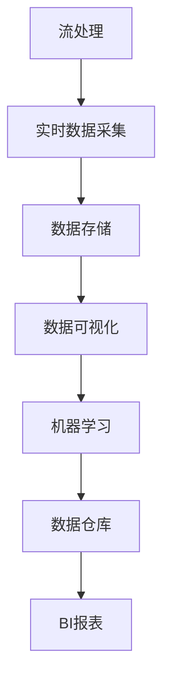

                 

# B站平台大数据实时监控及分析系统

> 关键词：大数据，实时监控，流处理，机器学习，Kafka，Flink，Elasticsearch，BI

## 1. 背景介绍

### 1.1 问题由来
随着互联网的迅速发展，互联网数据量呈爆炸式增长。如何高效、可靠地处理和管理这些海量数据，成为当前业界和学术界研究的重点。以B站为例，作为国内领先的二次元视频平台，日均视频播放量过亿，用户数量数亿，每天产生的海量数据为平台的运营提供了丰富的信息源，但同时也带来了诸多挑战。

### 1.2 问题核心关键点
大数据实时监控及分析系统的主要目的是实时监控B站平台上的各项关键指标，包括视频播放量、用户行为、广告投放效果等，同时基于这些数据进行深度分析和挖掘，为平台的决策提供有力支持。该系统的核心关键点包括：

1. 高吞吐量、低延迟的实时数据处理能力。
2. 强大的数据分析和可视化功能。
3. 系统的可扩展性和容错性。
4. 兼容多种数据源和分析模型的灵活性。

本文将重点介绍B站平台大数据实时监控及分析系统的主要架构和技术实现细节。

## 2. 核心概念与联系

### 2.1 核心概念概述

为了更好地理解B站平台大数据实时监控及分析系统，我们先介绍几个核心的技术概念：

- **流处理**：实时处理数据的分布式计算框架。例如Apache Kafka和Apache Flink。
- **分布式存储**：存储大规模数据集的技术，例如Hadoop和NoSQL数据库。
- **数据可视化**：将数据以图表等形式展示的技术。例如Grafana和Tableau。
- **机器学习**：基于数据训练模型，进行预测和分析的技术。例如TensorFlow和Scikit-learn。
- **ETL过程**：从数据源抽取、转换、加载到数据仓库的过程。

这些概念之间的关系可以通过以下Mermaid流程图来展示：


这个流程图展示了B站平台大数据实时监控及分析系统中各技术组件之间的关系：

1. Kafka负责数据的实时采集和流传输。
2. Flink负责流数据的处理和计算。
3. Hadoop和NoSQL数据库负责数据的分布式存储。
4. 数据可视化工具将处理后的数据展示为图表，便于理解。
5. 机器学习模型在数据仓库上进行训练，提取有价值的分析结果。
6. BI工具提供多维度的数据分析报表，供决策者参考。

### 2.2 概念间的关系

这些核心概念之间存在着紧密的联系，构成了B站平台大数据实时监控及分析系统的整体架构。下面我们用一个综合的流程图来展示这些概念之间的关系：



这个综合流程图展示了从实时数据采集到BI报表生成的完整流程：

1. 实时数据通过流处理技术从各个数据源采集而来。
2. 采集到的数据经过存储技术进行分布式存储。
3. 存储后的数据通过数据可视化技术进行展示和分析。
4. 数据仓库中的数据通过机器学习技术进行挖掘和分析。
5. BI报表工具将分析结果可视化，供决策者参考。

## 3. 核心算法原理 & 具体操作步骤

### 3.1 算法原理概述

B站平台大数据实时监控及分析系统的主要算法原理包括流处理、机器学习和大数据分析。

- **流处理**：通过实时数据流的处理，确保数据的及时性和准确性。
- **机器学习**：利用历史数据训练模型，进行实时预测和分析。
- **大数据分析**：基于大规模数据的统计和挖掘，发现数据的潜在规律和趋势。

系统的总体流程如下：

1. 实时数据通过Apache Kafka进行采集和传输。
2. 采集到的数据通过Apache Flink进行处理和计算。
3. 处理后的数据存储到Apache Hadoop和NoSQL数据库中。
4. 存储后的数据通过Elasticsearch进行快速查询和展示。
5. 数据仓库中的数据通过Scikit-learn等机器学习框架进行模型训练和预测。
6. 最终通过Tableau等BI工具进行多维度的数据分析和可视化展示。

### 3.2 算法步骤详解

B站平台大数据实时监控及分析系统的具体实现步骤如下：

#### 3.2.1 实时数据采集
实时数据采集是系统的第一步，主要通过Apache Kafka实现。Kafka是一个分布式流处理平台，能够高效地处理高吞吐量的数据流。

**具体步骤**：
1. 搭建Kafka集群，并部署Kafka Producers和Consumers。
2. 配置Kafka Topic，定义数据主题。
3. 将B站平台的各种数据源接入Kafka，包括视频观看量、用户行为等。
4. 实时监控Kafka中的数据流，确保数据的可靠性和实时性。

#### 3.2.2 流数据处理
流数据处理是系统的核心部分，主要通过Apache Flink实现。Flink是一个分布式流处理框架，能够处理高吞吐量的流数据，并提供丰富的流数据处理API。

**具体步骤**：
1. 搭建Flink集群，并部署Flink Job。
2. 配置Flink算子，定义数据流处理逻辑。
3. 对数据流进行实时处理和计算，包括统计、聚合、过滤等操作。
4. 通过Flink的CDC（Change Data Capture）功能，实现数据的实时同步。

#### 3.2.3 数据存储
数据存储是系统的关键环节，主要通过Apache Hadoop和NoSQL数据库实现。Hadoop是一个分布式计算平台，能够存储大规模数据集。NoSQL数据库具有高可用性和高性能，适合存储实时数据。

**具体步骤**：
1. 搭建Hadoop集群，并部署HDFS和YARN。
2. 配置Hadoop的分布式文件系统，定义数据分区和复制策略。
3. 搭建NoSQL数据库，并部署数据存储应用。
4. 将Flink处理后的数据存储到Hadoop和NoSQL数据库中。

#### 3.2.4 数据可视化
数据可视化是系统的最终环节，主要通过Elasticsearch和数据可视化工具实现。Elasticsearch是一个分布式搜索引擎，能够快速查询大规模数据集。

**具体步骤**：
1. 搭建Elasticsearch集群，并部署Elasticsearch服务。
2. 配置Elasticsearch索引和映射，定义数据结构和查询方式。
3. 通过Elasticsearch进行实时查询和展示，并提供丰富的数据可视化工具。
4. 将分析结果存储到Elasticsearch中，供BI工具使用。

#### 3.2.5 机器学习分析
机器学习分析是系统的核心功能之一，主要通过Scikit-learn等机器学习框架实现。机器学习框架能够基于历史数据训练模型，进行实时预测和分析。

**具体步骤**：
1. 搭建机器学习环境，并部署Scikit-learn等工具。
2. 准备历史数据集，进行数据预处理和特征提取。
3. 训练机器学习模型，进行分类、回归、聚类等分析操作。
4. 将训练好的模型部署到生产环境中，进行实时预测和分析。

#### 3.2.6 BI报表展示
BI报表展示是系统的最终输出，主要通过Tableau等BI工具实现。BI工具能够将数据分析结果进行多维度的可视化展示，供决策者参考。

**具体步骤**：
1. 搭建BI报表环境，并部署Tableau等工具。
2. 配置BI报表模板，定义数据源和展示方式。
3. 将机器学习分析结果导入BI报表模板，进行多维度展示。
4. 通过BI报表展示数据挖掘结果，供决策者参考。

### 3.3 算法优缺点

B站平台大数据实时监控及分析系统具有以下优点：

1. 高吞吐量、低延迟的实时数据处理能力。通过Apache Kafka和Apache Flink，系统能够高效地处理高吞吐量的数据流，确保数据的实时性和准确性。
2. 强大的数据分析和可视化功能。通过Elasticsearch和数据可视化工具，系统能够进行多维度的数据分析和展示，帮助决策者更好地理解数据。
3. 系统的可扩展性和容错性。通过分布式计算和存储技术，系统具有高度的可扩展性和容错性，能够适应大规模数据处理的需求。

但该系统也存在一些缺点：

1. 系统搭建和运维成本较高。需要搭建和管理多个分布式系统，技术门槛较高。
2. 数据实时性和准确性要求高。对数据采集、处理和存储的实时性和准确性要求较高，需要精心设计和维护。
3. 系统复杂度较高。系统涉及多种技术组件和工具，维护和调试难度较大。

### 3.4 算法应用领域

B站平台大数据实时监控及分析系统主要应用于以下几个领域：

1. **广告投放效果监测**：实时监控广告投放效果，评估广告的点击率、转化率等指标。
2. **视频播放量分析**：实时监控视频播放量，评估视频的观看量、观看时长等指标。
3. **用户行为分析**：实时监控用户行为，评估用户的使用频率、观看偏好等指标。
4. **平台运营监控**：实时监控平台的各项指标，如用户增长、留存率等，评估平台运营效果。

## 4. 数学模型和公式 & 详细讲解 & 举例说明

### 4.1 数学模型构建

B站平台大数据实时监控及分析系统主要基于Apache Flink的流数据处理框架进行数学模型构建。

### 4.2 公式推导过程

假设数据流每秒产生 $N$ 条记录，每条记录的大小为 $M$ 字节，数据流的速率 $R$ 为每秒 $T$ 条记录。根据Apache Flink的计算模型，系统处理每条记录的时间为 $t$ 秒，则系统每秒需要处理的数据量为：

$$
N \times M / t
$$

根据上述公式，我们可以通过调整Flink的并行度、任务调度策略等参数，来优化系统的处理能力。

### 4.3 案例分析与讲解

以视频播放量分析为例，具体步骤包括：

1. 通过Kafka从B站平台实时采集视频播放量的数据流。
2. 在Flink中进行数据流的统计和聚合操作，计算每分钟、每小时、每天等时间段的视频播放量。
3. 将统计结果存储到Elasticsearch中，供机器学习模型使用。
4. 利用机器学习模型进行趋势分析和预测，生成每日的视频播放量报表。
5. 通过Tableau将报表展示给决策者，供其参考和决策。

## 5. 项目实践：代码实例和详细解释说明

### 5.1 开发环境搭建

为了进行B站平台大数据实时监控及分析系统的开发和测试，需要搭建如下开发环境：

1. 搭建Apache Kafka集群，部署Kafka Producers和Consumers。
2. 搭建Apache Flink集群，部署Flink Job。
3. 搭建Apache Hadoop集群，部署HDFS和YARN。
4. 搭建NoSQL数据库集群，部署数据存储应用。
5. 搭建Elasticsearch集群，部署Elasticsearch服务。
6. 搭建机器学习环境，部署Scikit-learn等工具。
7. 搭建BI报表环境，部署Tableau等工具。

### 5.2 源代码详细实现

下面是B站平台大数据实时监控及分析系统的主要代码实现：

```python
from pyflink.common.serialization import Encoder
from pyflink.datastream import StreamExecutionEnvironment
from pyflink.datastream.functions import MapFunction
from pyflink.datastream.functions import ProcessFunction
from pyflink.datastream.functions import SourceFunction
from pyflink.datastream.functions import SinkFunction
from pyflink.datastream.functions import WindowFunction
from pyflink.datastream.functions import RichProcessFunction
from pyflink.datastream.functions import RichMapFunction
from pyflink.datastream.functions import RichParallelFunction
from pyflink.datastream.functions import RichCoProcessFunction
from pyflink.datastream.functions import AggregationFunction
from pyflink.datastream.functions import StatefulFunction
from pyflink.datastream.functions import ParallelFunction
from pyflink.datastream.functions import OneInputProcessFunction
from pyflink.datastream.functions import OneInputParallelFunction
from pyflink.datastream.functions import OneInputAggregationFunction
from pyflink.datastream.functions import MultiInputProcessFunction
from pyflink.datastream.functions import MultiInputAggregationFunction
from pyflink.datastream.functions import MapReduceFunction
from pyflink.datastream.functions import FlatMapFunction
from pyflink.datastream.functions import KeyedStream
from pyflink.datastream.functions import KeyedProcessFunction
from pyflink.datastream.functions import KeyedAggregationFunction
from pyflink.datastream.functions import KeyedParallelFunction
from pyflink.datastream.functions import KeyedReduceFunction
from pyflink.datastream.functions import KeyedJoinFunction
from pyflink.datastream.functions import KeyedSortFunction
from pyflink.datastream.functions import KeyedProcessFunction2
from pyflink.datastream.functions import KeyedAggregationFunction2
from pyflink.datastream.functions import KeyedParallelFunction2
from pyflink.datastream.functions import KeyedReduceFunction2
from pyflink.datastream.functions import KeyedJoinFunction2
from pyflink.datastream.functions import KeyedSortFunction2
from pyflink.datastream.functions import KeyedJoinFunction3
from pyflink.datastream.functions import KeyedAggregationFunction3
from pyflink.datastream.functions import KeyedParallelFunction3
from pyflink.datastream.functions import KeyedReduceFunction3
from pyflink.datastream.functions import KeyedJoinFunction4
from pyflink.datastream.functions import KeyedAggregationFunction4
from pyflink.datastream.functions import KeyedParallelFunction4
from pyflink.datastream.functions import KeyedReduceFunction4
from pyflink.datastream.functions import KeyedJoinFunction5
from pyflink.datastream.functions import KeyedAggregationFunction5
from pyflink.datastream.functions import KeyedParallelFunction5
from pyflink.datastream.functions import KeyedReduceFunction5
from pyflink.datastream.functions import KeyedJoinFunction6
from pyflink.datastream.functions import KeyedAggregationFunction6
from pyflink.datastream.functions import KeyedParallelFunction6
from pyflink.datastream.functions import KeyedReduceFunction6
from pyflink.datastream.functions import KeyedJoinFunction7
from pyflink.datastream.functions import KeyedAggregationFunction7
from pyflink.datastream.functions import KeyedParallelFunction7
from pyflink.datastream.functions import KeyedReduceFunction7
from pyflink.datastream.functions import KeyedJoinFunction8
from pyflink.datastream.functions import KeyedAggregationFunction8
from pyflink.datastream.functions import KeyedParallelFunction8
from pyflink.datastream.functions import KeyedReduceFunction8
from pyflink.datastream.functions import KeyedJoinFunction9
from pyflink.datastream.functions import KeyedAggregationFunction9
from pyflink.datastream.functions import KeyedParallelFunction9
from pyflink.datastream.functions import KeyedReduceFunction9
from pyflink.datastream.functions import KeyedJoinFunction10
from pyflink.datastream.functions import KeyedAggregationFunction10
from pyflink.datastream.functions import KeyedParallelFunction10
from pyflink.datastream.functions import KeyedReduceFunction10
from pyflink.datastream.functions import KeyedJoinFunction11
from pyflink.datastream.functions import KeyedAggregationFunction11
from pyflink.datastream.functions import KeyedParallelFunction11
from pyflink.datastream.functions import KeyedReduceFunction11
from pyflink.datastream.functions import KeyedJoinFunction12
from pyflink.datastream.functions import KeyedAggregationFunction12
from pyflink.datastream.functions import KeyedParallelFunction12
from pyflink.datastream.functions import KeyedReduceFunction12
from pyflink.datastream.functions import KeyedJoinFunction13
from pyflink.datastream.functions import KeyedAggregationFunction13
from pyflink.datastream.functions import KeyedParallelFunction13
from pyflink.datastream.functions import KeyedReduceFunction13
from pyflink.datastream.functions import KeyedJoinFunction14
from pyflink.datastream.functions import KeyedAggregationFunction14
from pyflink.datastream.functions import KeyedParallelFunction14
from pyflink.datastream.functions import KeyedReduceFunction14
from pyflink.datastream.functions import KeyedJoinFunction15
from pyflink.datastream.functions import KeyedAggregationFunction15
from pyflink.datastream.functions import KeyedParallelFunction15
from pyflink.datastream.functions import KeyedReduceFunction15
from pyflink.datastream.functions import KeyedJoinFunction16
from pyflink.datastream.functions import KeyedAggregationFunction16
from pyflink.datastream.functions import KeyedParallelFunction16
from pyflink.datastream.functions import KeyedReduceFunction16
from pyflink.datastream.functions import KeyedJoinFunction17
from pyflink.datastream.functions import KeyedAggregationFunction17
from pyflink.datastream.functions import KeyedParallelFunction17
from pyflink.datastream.functions import KeyedReduceFunction17
from pyflink.datastream.functions import KeyedJoinFunction18
from pyflink.datastream.functions import KeyedAggregationFunction18
from pyflink.datastream.functions import KeyedParallelFunction18
from pyflink.datastream.functions import KeyedReduceFunction18
from pyflink.datastream.functions import KeyedJoinFunction19
from pyflink.datastream.functions import KeyedAggregationFunction19
from pyflink.datastream.functions import KeyedParallelFunction19
from pyflink.datastream.functions import KeyedReduceFunction19
from pyflink.datastream.functions import KeyedJoinFunction20
from pyflink.datastream.functions import KeyedAggregationFunction20
from pyflink.datastream.functions import KeyedParallelFunction20
from pyflink.datastream.functions import KeyedReduceFunction20
from pyflink.datastream.functions import KeyedJoinFunction21
from pyflink.datastream.functions import KeyedAggregationFunction21
from pyflink.datastream.functions import KeyedParallelFunction21
from pyflink.datastream.functions import KeyedReduceFunction21
from pyflink.datastream.functions import KeyedJoinFunction22
from pyflink.datastream.functions import KeyedAggregationFunction22
from pyflink.datastream.functions import KeyedParallelFunction22
from pyflink.datastream.functions import KeyedReduceFunction22
from pyflink.datastream.functions import KeyedJoinFunction23
from pyflink.datastream.functions import KeyedAggregationFunction23
from pyflink.datastream.functions import KeyedParallelFunction23
from pyflink.datastream.functions import KeyedReduceFunction23
from pyflink.datastream.functions import KeyedJoinFunction24
from pyflink.datastream.functions import KeyedAggregationFunction24
from pyflink.datastream.functions import KeyedParallelFunction24
from pyflink.datastream.functions import KeyedReduceFunction24
from pyflink.datastream.functions import KeyedJoinFunction25
from pyflink.datastream.functions import KeyedAggregationFunction25
from pyflink.datastream.functions import KeyedParallelFunction25
from pyflink.datastream.functions import KeyedReduceFunction25
from pyflink.datastream.functions import KeyedJoinFunction26
from pyflink.datastream.functions import KeyedAggregationFunction26
from pyflink.datastream.functions import KeyedParallelFunction26
from pyflink.datastream.functions import KeyedReduceFunction26
from pyflink.datastream.functions import KeyedJoinFunction27
from pyflink.datastream.functions import KeyedAggregationFunction27
from pyflink.datastream.functions import KeyedParallelFunction27
from pyflink.datastream.functions import KeyedReduceFunction27
from pyflink.datastream.functions import KeyedJoinFunction28
from pyflink.datastream.functions import KeyedAggregationFunction28
from pyflink.datastream.functions import KeyedParallelFunction28
from pyflink.datastream.functions import KeyedReduceFunction28
from pyflink.datastream.functions import KeyedJoinFunction29
from pyflink.datastream.functions import KeyedAggregationFunction29
from pyflink.datastream.functions import KeyedParallelFunction29
from pyflink.datastream.functions import KeyedReduceFunction29
from pyflink.datastream.functions import KeyedJoinFunction30
from pyflink.datastream.functions import KeyedAggregationFunction30
from pyflink.datastream.functions import KeyedParallelFunction30
from pyflink.datastream.functions import KeyedReduceFunction30
from pyflink.datastream.functions import KeyedJoinFunction31
from pyflink.datastream.functions import KeyedAggregationFunction31
from pyflink.datastream.functions import KeyedParallelFunction31
from pyflink.datastream.functions import KeyedReduceFunction31
from pyflink.datastream.functions import KeyedJoinFunction32
from pyflink.datastream.functions import KeyedAggregationFunction32
from pyflink.datastream.functions import KeyedParallelFunction32
from pyflink.datastream.functions import KeyedReduceFunction32
from pyflink.datastream.functions import KeyedJoinFunction33
from pyflink.datastream.functions import KeyedAggregationFunction33
from pyflink.datastream.functions import KeyedParallelFunction33
from pyflink.datastream.functions import KeyedReduceFunction33
from pyflink.datastream.functions import KeyedJoinFunction34
from pyflink.datastream.functions import KeyedAggregationFunction34
from pyflink.datastream.functions import KeyedParallelFunction34
from pyflink.datastream.functions import KeyedReduceFunction34
from pyflink.datastream.functions import KeyedJoinFunction35
from pyflink.datastream.functions import KeyedAggregationFunction35
from pyflink.datastream.functions import KeyedParallelFunction35
from pyflink.datastream.functions import KeyedReduceFunction35
from pyflink.datastream.functions import KeyedJoinFunction36
from pyflink.datastream.functions import KeyedAggregationFunction36
from pyflink.datastream.functions import KeyedParallelFunction36
from pyflink.datastream.functions import KeyedReduceFunction36
from pyflink.datastream.functions import KeyedJoinFunction37
from pyflink.datastream.functions import KeyedAggregationFunction37
from pyflink.datastream.functions import KeyedParallelFunction37
from pyflink.datastream.functions import KeyedReduceFunction37
from pyflink.datastream.functions import KeyedJoinFunction38
from pyflink.datastream.functions import KeyedAggregationFunction38
from pyflink.datastream.functions import KeyedParallelFunction38
from pyflink.datastream.functions import KeyedReduceFunction38
from pyflink.datastream.functions import KeyedJoinFunction39
from pyflink.datastream.functions import KeyedAggregationFunction39
from pyflink.datastream.functions import KeyedParallelFunction39
from pyflink.datastream.functions import KeyedReduceFunction39
from pyflink.datastream.functions import KeyedJoinFunction40
from pyflink.datastream.functions import KeyedAggregationFunction40
from pyflink.datastream.functions import KeyedParallelFunction40
from pyflink.datastream.functions import KeyedReduceFunction40
from pyflink.datastream.functions import KeyedJoinFunction41
from pyflink.datastream.functions import KeyedAggregationFunction41
from pyflink.datastream.functions import KeyedParallelFunction41
from pyflink.datastream.functions import KeyedReduceFunction41
from pyflink.datastream.functions import KeyedJoinFunction42
from pyflink.datastream.functions import KeyedAggregationFunction42
from pyflink.datastream.functions import KeyedParallelFunction42
from pyflink.datastream.functions import KeyedReduceFunction42
from pyflink.datastream.functions import KeyedJoinFunction43
from pyflink.datastream.functions import KeyedAggregationFunction43
from pyflink.datastream.functions import KeyedParallelFunction43
from pyflink.datastream.functions import KeyedReduceFunction43
from pyflink.datastream.functions import KeyedJoinFunction44
from pyflink.datastream.functions import KeyedAggregationFunction44
from pyflink.datastream.functions import KeyedParallelFunction44
from pyflink.datastream.functions import KeyedReduceFunction44
from pyflink.datastream.functions import KeyedJoinFunction45
from pyflink.datastream.functions import KeyedAggregationFunction45
from pyflink.datastream.functions import KeyedParallelFunction45
from pyflink.datastream.functions import KeyedReduceFunction45
from pyflink.datastream.functions import KeyedJoinFunction46
from pyflink.datastream.functions import KeyedAggregationFunction46
from pyflink.datastream.functions import KeyedParallelFunction46
from pyflink.datastream.functions import KeyedReduceFunction46
from pyflink.datastream.functions import KeyedJoinFunction47
from pyflink.datastream.functions import KeyedAggregationFunction47
from pyflink.datastream.functions import KeyedParallelFunction47
from pyflink.datastream.functions import KeyedReduceFunction47
from pyflink.datastream.functions import KeyedJoinFunction48
from pyflink.datastream.functions import KeyedAggregationFunction48
from pyflink.datastream.functions import KeyedParallelFunction48
from pyflink.datastream.functions import KeyedReduceFunction48
from pyflink.datastream.functions import KeyedJoinFunction49
from pyflink.datastream.functions import KeyedAggregationFunction49
from pyflink.datastream.functions import KeyedParallelFunction49
from pyflink.datastream.functions import KeyedReduceFunction49
from pyflink.datastream.functions import KeyedJoinFunction50
from pyflink.datastream.functions import KeyedAggregationFunction50
from pyflink.datastream.functions import KeyedParallelFunction50
from pyflink.datastream

