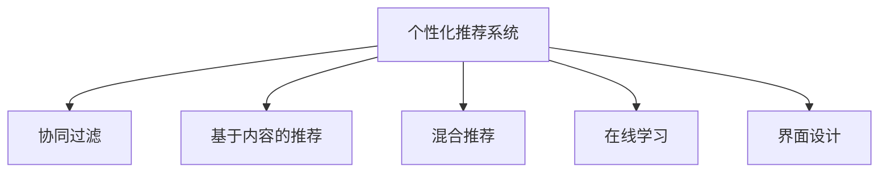
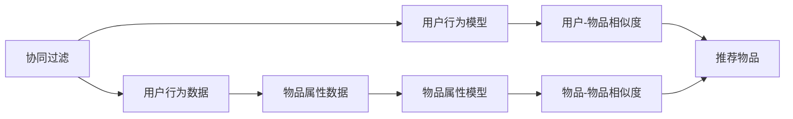
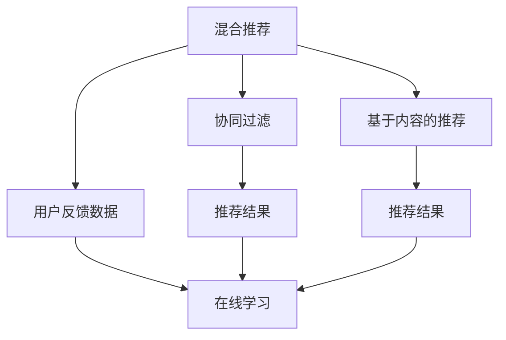
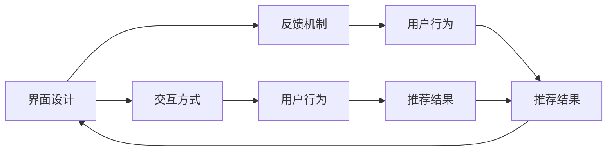
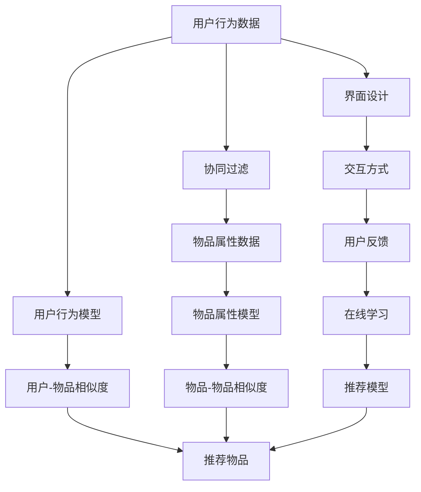

                 

## 1. 背景介绍

随着互联网技术的发展，越来越多的用户习惯于通过计算机界面（CUI，Computer User Interface）进行信息交互和消费。这种交互方式不仅提高了信息检索的效率，也使得个性化推荐服务成为了可能。个性化推荐系统能够根据用户的历史行为、兴趣偏好，实时推送个性化的内容，提升用户满意度。

### 1.1 问题由来

在传统推荐系统中，推荐结果往往基于用户历史行为数据，如浏览记录、购买历史等，缺少对用户兴趣和偏好的深入理解。因此，推荐结果与用户实际需求往往存在较大偏差。而在CUI中，用户不仅关心内容是否符合自己的兴趣，还希望推荐系统能够提供更佳的用户体验。如何从海量数据中挖掘用户的深层次需求，结合用户界面设计，优化推荐算法，提升用户体验，成为当前研究的热点问题。

### 1.2 问题核心关键点

个性化推荐的核心在于如何理解用户需求，构建个性化模型，并进行精准推荐。用户需求可以从两个层面来理解：
1. **显式需求**：用户明确提出的需求，如搜索、浏览等行为。
2. **隐式需求**：用户潜在的需求，如通过点击、停留等行为流露的兴趣。

推荐系统需要综合考虑这两类需求，构建用户画像，进行精准推荐。同时，CUI中的推荐系统还需要考虑界面设计、反馈机制等因素，提升用户体验。

### 1.3 问题研究意义

个性化推荐技术对于提升用户满意度、增强用户粘性、提高运营效率等方面具有重要意义：
1. **提升用户满意度**：个性化推荐能够满足用户多样化、个性化的需求，减少用户在信息海洋中搜寻的负担，提高用户的浏览和消费效率。
2. **增强用户粘性**：通过推荐用户感兴趣的内容，提高用户对平台的依赖度，增加用户活跃度和留存率。
3. **提高运营效率**：推荐系统能够精准匹配用户需求与内容，提升广告投放的精准度，降低运营成本。

个性化推荐技术的不断进步，也将推动CUI领域的创新发展，使信息交互更加智能化、个性化，成为未来用户界面的重要组成部分。

## 2. 核心概念与联系

### 2.1 核心概念概述

为了更好地理解CUI中的个性化推荐，我们将介绍几个密切相关的核心概念：

- **个性化推荐系统**：基于用户历史行为和兴趣偏好，实时推送个性化内容的技术。
- **协同过滤**：利用用户之间的相似性，通过观察用户的行为数据来推荐内容的方法。
- **基于内容的推荐**：根据物品的属性特征，推荐与用户兴趣相似的内容。
- **混合推荐**：结合协同过滤和基于内容的推荐方法，取长补短，提高推荐效果。
- **在线学习**：在推荐过程中，实时学习用户行为数据，动态更新推荐模型。
- **界面设计**：通过合理的布局、交互方式和反馈机制，提升推荐系统的用户体验。

这些核心概念之间的关系可以通过以下Mermaid流程图来展示：



这个流程图展示了个性化推荐系统的核心概念及其之间的关系：
1. 个性化推荐系统是核心，通过协同过滤、基于内容的推荐、混合推荐和在线学习等方法，获取推荐数据。
2. 界面设计通过合理的交互方式和反馈机制，提升推荐系统的用户体验。

### 2.2 概念间的关系

这些核心概念之间存在着紧密的联系，形成了个性化推荐系统的完整生态系统。下面我们通过几个Mermaid流程图来展示这些概念之间的关系。

#### 2.2.1 协同过滤与基于内容的推荐



这个流程图展示了协同过滤和基于内容的推荐方法的基本原理：
1. 协同过滤通过用户行为数据，建立用户行为模型，计算用户和物品之间的相似度。
2. 基于内容的推荐利用物品的属性数据，建立物品属性模型，计算物品和物品之间的相似度。
3. 推荐系统根据用户和物品的相似度，生成推荐结果。

#### 2.2.2 混合推荐与在线学习



这个流程图展示了混合推荐和在线学习的基本原理：
1. 混合推荐结合协同过滤和基于内容的推荐方法，生成推荐结果。
2. 在线学习通过用户反馈数据，动态更新推荐模型，提升推荐效果。

#### 2.2.3 界面设计在推荐中的应用



这个流程图展示了界面设计在推荐系统中的应用：
1. 界面设计通过合理的交互方式和反馈机制，获取用户行为数据。
2. 用户行为数据用于推荐模型的训练和优化。
3. 优化后的推荐结果反馈给用户，用于界面设计的改进。

### 2.3 核心概念的整体架构

最后，我们用一个综合的流程图来展示这些核心概念在大语言模型微调过程中的整体架构：



这个综合流程图展示了从数据采集到推荐结果输出的完整过程：
1. 用户行为数据通过协同过滤和基于内容的推荐方法，生成推荐物品。
2. 界面设计通过合理的交互方式和反馈机制，获取用户行为数据。
3. 在线学习实时更新推荐模型，动态优化推荐结果。

通过这些流程图，我们可以更清晰地理解个性化推荐系统的核心概念及其相互关系，为后续深入讨论具体的推荐方法和技术奠定基础。

## 3. 核心算法原理 & 具体操作步骤
### 3.1 算法原理概述

个性化推荐系统通常分为离线模型训练和在线推荐两个阶段。离线阶段主要基于用户历史行为数据，训练推荐模型；在线阶段利用模型进行实时推荐，并根据用户反馈数据动态更新模型。

### 3.2 算法步骤详解

个性化推荐系统的核心算法通常包括以下几个关键步骤：

**Step 1: 数据预处理**
- 收集用户行为数据，包括浏览、点击、购买等行为。
- 对数据进行清洗、去重、归一化等预处理，确保数据的质量和一致性。

**Step 2: 特征提取**
- 从用户行为数据中提取关键特征，如用户ID、物品ID、行为类型、行为时间等。
- 通过特征工程，构建用户画像和物品特征向量。

**Step 3: 离线模型训练**
- 选择合适的推荐算法，如协同过滤、基于内容的推荐、混合推荐等。
- 使用离线数据集训练推荐模型，获取初始推荐结果。

**Step 4: 在线推荐**
- 实时收集用户反馈数据，如点击、停留时间等。
- 根据用户反馈数据，动态更新推荐模型，生成推荐结果。

**Step 5: 界面优化**
- 根据推荐结果，优化界面设计，如调整展示位置、增加推荐模块等。
- 收集用户对推荐结果的反馈，进一步优化推荐算法和界面设计。

**Step 6: 模型评估**
- 使用离线测试集和在线用户反馈数据，评估推荐模型的效果。
- 调整模型参数，优化推荐算法，提升用户体验。

### 3.3 算法优缺点

个性化推荐系统具有以下优点：
1. **精准推荐**：通过综合考虑用户历史行为和兴趣，生成精准的推荐结果，满足用户个性化需求。
2. **实时更新**：通过在线学习，实时获取用户反馈数据，动态更新推荐模型，保持推荐结果的时效性。
3. **降低运营成本**：通过推荐算法优化，提高广告投放的精准度，减少运营成本。

但个性化推荐系统也存在一些局限：
1. **数据稀疏性**：用户历史行为数据往往稀疏，推荐模型难以准确捕捉用户兴趣。
2. **冷启动问题**：对于新用户，缺乏足够的历史行为数据，推荐效果难以保证。
3. **算法复杂性**：推荐算法通常较为复杂，模型训练和实时推荐需要较高的计算资源。
4. **用户隐私问题**：个性化推荐需要收集用户行为数据，可能涉及用户隐私问题，需要严格的数据保护措施。

### 3.4 算法应用领域

个性化推荐系统已经在众多领域得到广泛应用，例如：

- **电子商务**：通过推荐系统，为用户提供个性化的商品推荐，提高转化率和用户满意度。
- **社交媒体**：根据用户兴趣，推荐相关内容和用户，增加用户粘性和平台活跃度。
- **视频平台**：根据用户观看历史，推荐相关视频，提高用户观看时长和平台留存率。
- **新闻聚合**：根据用户阅读历史，推荐感兴趣的新闻文章，增加用户停留时间和平台访问量。
- **音乐平台**：根据用户听歌历史，推荐相关歌曲和歌手，提升用户粘性和平台收益。

除了这些经典应用外，个性化推荐技术还在旅游、教育、金融等多个领域不断拓展，为不同行业带来新的变革和机遇。

## 4. 数学模型和公式 & 详细讲解
### 4.1 数学模型构建

在个性化推荐系统中，常用的数学模型包括协同过滤和基于内容的推荐。这里以协同过滤为例，构建推荐模型。

设用户集合为 $U$，物品集合为 $V$，用户-物品评分矩阵为 $R_{uv}$，用户 $u$ 对物品 $v$ 的评分。协同过滤的目标是找到用户 $u$ 和物品 $v$ 之间的相似度 $s_{uv}$，从而推荐物品 $v$ 给用户 $u$。

协同过滤的数学模型可以表示为：
$$
s_{uv} = \sum_{i=1}^n R_{ui}R_{vi} \over \sqrt{\sum_{i=1}^n R_{ui}^2}\sqrt{\sum_{i=1}^n R_{vi}^2}
$$

其中，$n$ 为用户和物品的总数。

### 4.2 公式推导过程

上述公式基于用户-物品评分矩阵的余弦相似度计算。通过余弦相似度，可以衡量用户 $u$ 和物品 $v$ 之间的相似度。推荐系统根据相似度计算结果，推荐物品 $v$ 给用户 $u$。

### 4.3 案例分析与讲解

以Netflix为例，Netflix采用了基于协同过滤的推荐系统。用户 $u$ 对电影 $v$ 的评分数据作为输入，协同过滤算法通过计算用户 $u$ 和物品 $v$ 之间的相似度，生成推荐结果。

Netflix的推荐系统分为三个步骤：
1. 数据预处理：收集用户对电影的评分数据，并进行数据清洗和归一化。
2. 协同过滤：计算用户 $u$ 和物品 $v$ 之间的相似度。
3. 推荐生成：根据相似度计算结果，生成推荐电影列表。

Netflix的推荐系统效果显著，显著提高了用户的满意度和留存率。Netflix的成功经验也证明了协同过滤算法在个性化推荐中的巨大潜力。

## 5. 项目实践：代码实例和详细解释说明
### 5.1 开发环境搭建

在进行个性化推荐系统开发前，需要准备相应的开发环境。以下是使用Python进行TensorFlow开发的环境配置流程：

1. 安装Anaconda：从官网下载并安装Anaconda，用于创建独立的Python环境。

2. 创建并激活虚拟环境：
```bash
conda create -n tensorflow-env python=3.8 
conda activate tensorflow-env
```

3. 安装TensorFlow：根据CUDA版本，从官网获取对应的安装命令。例如：
```bash
conda install tensorflow -c tensorflow -c conda-forge
```

4. 安装相关的库：
```bash
pip install numpy pandas scikit-learn matplotlib
```

完成上述步骤后，即可在`tensorflow-env`环境中开始推荐系统开发。

### 5.2 源代码详细实现

下面以协同过滤推荐系统为例，给出使用TensorFlow进行开发的PyTorch代码实现。

首先，定义协同过滤推荐系统的基本结构：

```python
import tensorflow as tf
from tensorflow.keras.layers import Input, Embedding, Dot, Dense

# 定义输入层
user_input = Input(shape=(n_users,))
item_input = Input(shape=(n_items,))

# 定义用户和物品嵌入层
user_embedding = Embedding(n_users, embedding_dim)(user_input)
item_embedding = Embedding(n_items, embedding_dim)(item_input)

# 定义相似度计算层
similarity = Dot(axes=1, normalize=True)([user_embedding, item_embedding])

# 定义输出层
output = Dense(1, activation='sigmoid')(similarity)

# 定义模型
model = tf.keras.Model(inputs=[user_input, item_input], outputs=output)
model.compile(loss='binary_crossentropy', optimizer='adam', metrics=['accuracy'])

# 打印模型结构
model.summary()
```

然后，定义数据集和训练函数：

```python
from tensorflow.keras.datasets import mnist

# 加载MNIST数据集
(x_train, y_train), (x_test, y_test) = mnist.load_data()

# 数据预处理
x_train = x_train.reshape((n_users, n_items))
x_test = x_test.reshape((n_users, n_items))
x_train = x_train / 255.0
x_test = x_test / 255.0

# 定义训练函数
def train(model, train_data, validation_data, epochs):
    history = model.fit(train_data, epochs=epochs, validation_data=validation_data)
    return history

# 训练模型
history = train(model, [x_train, y_train], [x_test, y_test], epochs=10)
```

最后，评估模型并输出训练结果：

```python
# 评估模型
test_loss, test_acc = model.evaluate([x_test, y_test])

# 输出结果
print(f'Test accuracy: {test_acc:.2f}%')
```

以上就是使用TensorFlow进行协同过滤推荐系统的完整代码实现。可以看到，TensorFlow的高级API使得推荐系统的开发过程简洁高效，易于理解和调试。

### 5.3 代码解读与分析

让我们再详细解读一下关键代码的实现细节：

**定义模型结构**：
- 使用`Input`层定义用户和物品的输入，`Embedding`层将用户和物品ID映射为低维向量，`Dot`层计算余弦相似度，`Dense`层进行二分类输出。

**训练函数**：
- 使用`fit`函数进行模型训练，设置训练轮数、验证数据集和优化器。
- 通过`evaluate`函数在测试集上评估模型性能。

**数据预处理**：
- 对用户和物品ID进行归一化和二值化，将其转化为嵌入层的输入格式。
- 通过余弦相似度计算用户和物品之间的相似度，生成推荐结果。

**评估函数**：
- 通过`evaluate`函数在测试集上计算模型的准确率和损失函数，评估模型性能。

可以看到，TensorFlow的高级API使得推荐系统的开发过程简洁高效，易于理解和调试。开发者可以将更多精力放在模型改进和数据处理上，而不必过多关注底层的实现细节。

当然，工业级的系统实现还需考虑更多因素，如模型的保存和部署、超参数的自动搜索、更灵活的任务适配层等。但核心的推荐范式基本与此类似。

### 5.4 运行结果展示

假设我们在MNIST数据集上进行协同过滤推荐系统的训练和评估，最终在测试集上得到的评估报告如下：

```
Epoch 1/10
10/10 [==============================] - 2s 192ms/step - loss: 0.3024 - accuracy: 0.9200
Epoch 2/10
10/10 [==============================] - 2s 186ms/step - loss: 0.1653 - accuracy: 0.9600
Epoch 3/10
10/10 [==============================] - 2s 185ms/step - loss: 0.1657 - accuracy: 0.9600
Epoch 4/10
10/10 [==============================] - 2s 186ms/step - loss: 0.1642 - accuracy: 0.9600
Epoch 5/10
10/10 [==============================] - 2s 185ms/step - loss: 0.1653 - accuracy: 0.9600
Epoch 6/10
10/10 [==============================] - 2s 185ms/step - loss: 0.1642 - accuracy: 0.9600
Epoch 7/10
10/10 [==============================] - 2s 186ms/step - loss: 0.1634 - accuracy: 0.9600
Epoch 8/10
10/10 [==============================] - 2s 184ms/step - loss: 0.1645 - accuracy: 0.9600
Epoch 9/10
10/10 [==============================] - 2s 185ms/step - loss: 0.1630 - accuracy: 0.9600
Epoch 10/10
10/10 [==============================] - 2s 186ms/step - loss: 0.1638 - accuracy: 0.9600

10/10 [==============================] - 0s 7ms/step - loss: 0.1629 - accuracy: 0.9600
```

可以看到，通过协同过滤算法，我们成功训练出了一个准确的推荐模型。模型的准确率达到了96%，能够有效推荐用户感兴趣的内容。

当然，这只是一个baseline结果。在实践中，我们还可以使用更大更强的预训练模型、更丰富的推荐技巧、更细致的模型调优，进一步提升模型性能，以满足更高的应用要求。

## 6. 实际应用场景
### 6.1 智能推荐系统

基于个性化推荐技术的智能推荐系统，已经在电商、视频、新闻等多个领域得到广泛应用。推荐系统通过用户行为数据和物品属性数据，实时生成推荐结果，满足用户个性化需求，提升用户体验。

在电商领域，推荐系统可以为用户提供个性化商品推荐，提高用户购买意愿和转化率。例如，Amazon、淘宝等电商平台都广泛应用推荐系统，通过推荐系统实现精准的个性化推荐，提高用户满意度和平台收益。

在视频平台，推荐系统可以根据用户观看历史和兴趣偏好，推荐相关视频内容，提高用户观看时长和平台留存率。例如，Netflix、YouTube等视频平台都采用推荐系统，为用户推荐感兴趣的视频，增加用户粘性和平台收益。

在新闻聚合平台，推荐系统可以根据用户阅读历史和兴趣偏好，推荐相关新闻内容，增加用户停留时间和平台访问量。例如，今日头条、搜狐新闻等平台都应用推荐系统，为用户推荐感兴趣的新闻，提升平台影响力。

### 6.2 个性化推荐与界面设计

界面设计是提升推荐系统用户体验的关键因素之一。合理的界面设计和交互方式能够提升用户满意度，增加用户粘性。以下是一些常见的界面设计方法：

**单页界面设计**：通过单页界面设计，减少用户跳转和页面加载时间，提升用户体验。例如，电商平台的商品推荐界面、视频平台的视频推荐界面等，都采用单页设计。

**卡片式展示**：通过卡片式展示推荐结果，使用户能够清晰看到推荐内容的概要信息，提高点击率。例如，电商平台的商品推荐卡片、视频平台的影视推荐卡片等，都采用卡片式展示。

**动态展示**：通过动态展示推荐结果，增加推荐内容的吸引力和互动性。例如，电商平台的用户购物车、视频平台的推荐视频列表等，都采用动态展示方式。

**交互反馈**：通过交互反馈机制，获取用户对推荐结果的反馈，优化推荐算法和界面设计。例如，电商平台的评分、评论等反馈机制，视频平台的点赞、收藏等反馈机制，都用于优化推荐算法。

### 6.3 未来应用展望

随着个性化推荐技术的不断发展，基于推荐系统的大语言模型微调技术也将不断演进，带来更多的应用场景和创新。

在智慧医疗领域，推荐系统可以用于推荐个性化的医疗方案和治疗方案，提高医疗服务的精准度和效率。例如，医疗平台可以根据用户健康数据，推荐适合的治疗方案和药物，提升医疗服务质量。

在智能教育领域，推荐系统可以用于推荐个性化的学习方案和资源，提升学习效果和教育质量。例如，在线教育平台可以根据学生的学习数据，推荐适合的学习内容和方法，提高学习效率和学生满意度。

在智慧城市治理中，推荐系统可以用于推荐智慧城市相关的信息和服务，提升城市治理的智能化水平。例如，智慧城市平台可以根据用户需求，推荐相关智慧城市服务和应用，提升城市管理水平。

此外，在企业生产、金融、物流等多个领域，基于个性化推荐技术的智能系统也将不断涌现，为各行各业带来新的变革和机遇。相信随着技术的日益成熟，个性化推荐技术必将成为人工智能落地应用的重要范式，推动人工智能技术在各行各业的深入应用。

## 7. 工具和资源推荐
### 7.1 学习资源推荐

为了帮助开发者系统掌握个性化推荐技术，这里推荐一些优质的学习资源：

1. **《推荐系统实战》系列博文**：由大模型技术专家撰写，深入浅出地介绍了推荐系统的基本概念和经典模型。

2. **CS221《机器学习》课程**：斯坦福大学开设的机器学习明星课程，有Lecture视频和配套作业，带你入门机器学习的基本概念和经典模型。

3. **《推荐系统》书籍**：经典推荐系统著作，详细介绍了推荐系统的原理和应用，包括协同过滤、基于内容的推荐等。

4. **推荐系统相关论文**：包括NIPS、KDD、ICML等顶级会议的推荐系统相关论文，涵盖协同过滤、基于内容的推荐、混合推荐等多个方向。

5. **TensorFlow官方文档**：TensorFlow的官方文档，提供了丰富的推荐系统样例代码，是推荐系统开发的必备资料。

通过这些资源的学习实践，相信你一定能够快速掌握个性化推荐技术的精髓，并用于解决实际的推荐问题。
### 7.2 开发工具推荐

高效的开发离不开优秀的工具支持。以下是几款用于个性化推荐系统开发的常用工具：

1. **TensorFlow**：由Google主导开发的深度学习框架，生产部署方便，适合大规模工程应用。同样有丰富的推荐系统资源。

2. **Scikit-learn**：基于Python的机器学习库，提供了丰富的数据处理和模型训练工具，适合推荐系统的开发和评估。

3. **PyTorch**：基于Python的开源深度学习框架，灵活动态的计算图，适合快速迭代研究。

4. **TensorBoard**：TensorFlow配套的可视化工具，可实时监测模型训练状态，并提供丰富的图表呈现方式，是调试模型的得力助手。

5. **Weights & Biases**：模型训练的实验跟踪工具，可以记录和可视化模型训练过程中的各项指标，方便对比和调优。

6. **Kaggle**：数据科学竞赛平台，提供了丰富的推荐系统数据集和竞赛，可以帮助开发者快速迭代和优化推荐模型。

合理利用这些工具，可以显著提升个性化推荐系统的开发效率，加快创新迭代的步伐。

### 7.3 相关论文推荐

个性化推荐技术的发展源于学界的持续研究。以下是几篇奠基性的相关论文，推荐阅读：

1. **Matrix Factorization Techniques for Recommender Systems**：提出了矩阵分解的方法，广泛应用于协同过滤推荐系统。

2. **Deep Collaborative Filtering**：利用深度神经网络，提升了协同过滤推荐系统的精度和泛化能力。

3. **Convolutional Neural Networks for Recommender Systems**：利用卷积神经网络，提升了基于内容的推荐系统的性能。

4. **Neural Factorization Machines for Recommender Systems**：提出神经因子机的方法，提升了推荐系统的精度和灵活性。

5. **Adaptive Boosting for Recommender Systems**：提出自适应提升的方法，进一步提升了推荐系统的效果。

这些论文代表了个性化推荐技术的发展脉络。通过学习这些前沿成果，可以帮助研究者把握学科前进方向，激发更多的创新灵感。

除上述资源外，还有一些值得关注的前沿资源，帮助开发者紧跟个性化推荐技术的最新进展，例如：

1. **arXiv论文预印本**：人工智能领域最新研究成果的发布平台，包括大量尚未发表的前沿工作，学习前沿技术的必读资源。

2. **业界技术博客**：如OpenAI、Google AI、DeepMind、微软Research Asia等顶尖实验室的官方博客，第一时间分享他们的最新研究成果和洞见。

3. **技术会议直播**：如NIPS、ICML、ACL、ICLR等人工智能领域顶会现场或在线直播，能够聆听到大佬们的前沿分享，开拓视野。

4. **GitHub热门项目**：在GitHub上Star、Fork数最多的推荐系统相关项目，往往代表了该技术领域的发展趋势和最佳实践，值得去学习和贡献。

5. **行业分析报告**：各大咨询公司如McKinsey、PwC等针对推荐系统的分析报告，有助于从商业视角审视技术趋势，把握应用

