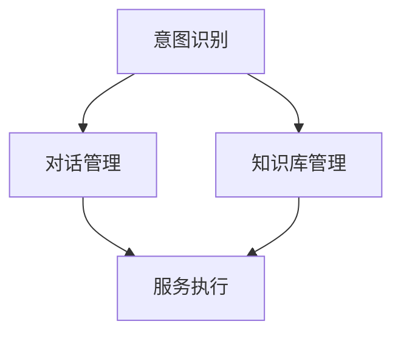

                 

# CUI中的内容与服务匹配详细技术

## 1. 背景介绍

随着人工智能技术的飞速发展，人机交互领域涌现出越来越多的智能应用，尤其是在智能客服（CUI，Computer User Interactions）系统中，内容与服务匹配技术正变得越来越重要。在自然语言处理(NLP)中，该技术用于将用户输入的内容与系统提供的服务进行匹配，从而提供精准的响应或执行相应的操作。内容与服务匹配技术不仅直接影响系统的响应准确性和用户体验，也是推动CUI系统智能化、个性化的关键因素。

本文将详细探讨CUI中的内容与服务匹配技术，介绍其核心原理和操作步骤，并提供数学模型、公式推导和实际代码实现，帮助读者深入理解该技术并应用于实际项目中。

## 2. 核心概念与联系

### 2.1 核心概念概述

- **内容与服务匹配**：在智能客服系统中，将用户输入的自然语言（内容）与其对应的服务（如查询、处理请求）进行匹配。这要求系统能够理解用户的意图并从多个服务中找到最匹配的服务。
- **意图识别**：识别用户输入的意图，是内容与服务匹配的基础。通常，意图识别通过分类模型将用户输入映射到具体的意图类别。
- **对话管理**：根据识别到的意图，对话管理模块选择并执行相应的服务或操作，实现与用户的交互。
- **知识库管理**：知识库是系统提供服务的基础，包含问题与答案的映射关系。知识库管理模块负责知识库的更新和维护。

### 2.2 核心概念之间的关系

在智能客服系统中，意图识别、对话管理和知识库管理三者密切相关。意图识别为系统提供服务奠定基础，对话管理根据意图选择和执行服务，知识库管理则提供服务的支撑和依据。通过这三个模块的协同工作，可以实现高效、智能的CUI系统。

为了更好地理解这些概念，我们可以使用以下Mermaid流程图来展示它们之间的关系：



该图展示了意图识别模块、对话管理模块和知识库管理模块之间的数据流向和交互关系。意图识别模块从用户输入中提取意图，对话管理模块根据意图选择相应的服务并执行，而知识库管理模块则提供服务的相关信息。

## 3. 核心算法原理 & 具体操作步骤

### 3.1 算法原理概述

内容与服务匹配的核心算法是基于机器学习（ML）的意图识别和对话管理。其基本流程如下：

1. **意图识别**：使用分类模型将用户输入映射到具体的意图类别。常见的分类模型包括朴素贝叶斯、支持向量机(SVM)、随机森林、神经网络等。
2. **对话管理**：根据意图选择并执行相应的服务或操作。常见的对话管理模型包括基于规则的对话管理、状态机对话管理、神经网络对话管理等。
3. **知识库管理**：管理知识库，包括问题与答案的映射关系，以及知识库的更新和维护。

### 3.2 算法步骤详解

#### 3.2.1 意图识别

意图识别的核心在于训练一个分类模型，将用户输入映射到意图类别。以下是详细的步骤：

1. **数据准备**：收集大量标注好的训练数据，其中每个数据点包含用户输入的自然语言文本和对应的意图类别。
2. **特征提取**：对每个文本数据点进行特征提取，将其转化为模型可以处理的数值形式。常用的特征提取方法包括词袋模型、TF-IDF、Word2Vec等。
3. **模型训练**：选择适当的分类模型，使用标注数据进行训练。常见的分类模型包括朴素贝叶斯、SVM、随机森林、深度学习模型（如CNN、RNN、LSTM等）。
4. **模型评估与优化**：使用验证集对训练好的模型进行评估，调整超参数以优化模型性能。

#### 3.2.2 对话管理

对话管理的核心在于根据识别到的意图选择并执行相应的服务或操作。以下是详细的步骤：

1. **意图识别**：与意图识别模块类似，对用户输入进行意图识别，得到意图类别。
2. **服务匹配**：根据意图类别，匹配相应的服务或操作。常见的服务匹配方法包括规则匹配、状态机匹配、神经网络匹配等。
3. **执行操作**：根据匹配到的服务或操作，执行相应的逻辑或调用相应的API。

#### 3.2.3 知识库管理

知识库管理的核心在于维护知识库，确保其包含最新的问题与答案映射关系。以下是详细的步骤：

1. **数据收集**：从各种渠道收集问题与答案的数据，包括FAQ、用户反馈、在线文档等。
2. **知识库构建**：构建知识库的索引和数据结构，确保问题与答案的映射关系清晰、高效。
3. **知识库更新**：定期更新知识库，包括增加新问题和答案、删除过时的问题和答案等。

### 3.3 算法优缺点

#### 3.3.1 优点

- **高准确性**：通过深度学习模型（如LSTM、Transformer等），可以大大提高意图识别的准确性和泛化能力。
- **高效性**：基于神经网络的模型可以并行计算，加快处理速度。
- **灵活性**：模型可以通过微调适应特定领域或应用场景。

#### 3.3.2 缺点

- **数据依赖**：意图识别和对话管理依赖于高质量的标注数据，数据标注成本高。
- **复杂度**：深度学习模型的训练和优化需要较强的计算资源和专业知识。
- **维护难度**：知识库的更新和维护需要持续的努力和人工介入。

### 3.4 算法应用领域

内容与服务匹配技术广泛应用于各种智能客服系统，包括金融、医疗、电商、客服等。例如，在金融领域，系统可以提供金融咨询、理财建议、账户管理等服务；在医疗领域，系统可以提供健康咨询、疾病诊断、预约挂号等服务；在电商领域，系统可以提供商品查询、订单处理、物流跟踪等服务。

## 4. 数学模型和公式 & 详细讲解

### 4.1 数学模型构建

在CUI系统中，意图识别和对话管理都可以用机器学习模型来实现。以下介绍一个简单的基于神经网络的意图识别模型：

1. **输入数据**：用户输入的自然语言文本，记为 $x$。
2. **输出数据**：意图类别，记为 $y$。
3. **模型**：神经网络模型，记为 $M$。

### 4.2 公式推导过程

假设模型的输入为 $x$，输出为 $y$，模型的损失函数为 $L$。在训练过程中，模型的目标是最小化损失函数 $L$，即：

$$
\min_{\theta} L(y, M_{\theta}(x))
$$

其中，$\theta$ 为模型参数，$M_{\theta}(x)$ 为模型对输入 $x$ 的预测输出。

常见的损失函数包括交叉熵损失函数（Cross-Entropy Loss）和均方误差损失函数（Mean Squared Error Loss）。对于分类问题，通常使用交叉熵损失函数，公式为：

$$
L_{CE}(y, \hat{y}) = -\sum_{i=1}^{n} y_i \log \hat{y}_i
$$

其中，$y$ 为真实标签向量，$\hat{y}$ 为模型的预测概率向量。

### 4.3 案例分析与讲解

假设我们有一个简单的二分类问题，模型参数为 $\theta$，训练数据为 $(x_1, y_1), (x_2, y_2), \ldots, (x_N, y_N)$。我们使用交叉熵损失函数进行训练，目标是最小化损失函数：

$$
L_{CE}(y, \hat{y}) = -y_1 \log \hat{y}_1 - y_2 \log \hat{y}_2 - \ldots - y_N \log \hat{y}_N
$$

其中，$\hat{y}_1 = \sigma(Wx_1 + b)$，$\hat{y}_2 = \sigma(Wx_2 + b)$，$\ldots$，$\hat{y}_N = \sigma(Wx_N + b)$，$\sigma$ 为激活函数（如 sigmoid）。

模型参数 $\theta$ 的更新公式为：

$$
\theta \leftarrow \theta - \eta \nabla_{\theta} L_{CE}(y, \hat{y})
$$

其中，$\eta$ 为学习率。

## 5. 项目实践：代码实例和详细解释说明

### 5.1 开发环境搭建

在进行CUI系统的开发时，我们需要使用Python和相应的库来构建和训练模型。以下是具体的开发环境搭建步骤：

1. **安装Python**：从官网下载并安装Python，建议选择3.8及以上版本。
2. **安装PyTorch**：使用pip命令安装PyTorch，方便构建神经网络模型。
3. **安装TensorFlow**：同样使用pip命令安装TensorFlow，用于训练和部署深度学习模型。
4. **安装Scikit-learn**：用于数据处理和特征提取。
5. **安装Matplotlib**：用于绘制训练曲线和可视化结果。

### 5.2 源代码详细实现

以下是一个简单的基于神经网络的意图识别模型的代码实现。

```python
import torch
import torch.nn as nn
import torch.optim as optim
from sklearn.model_selection import train_test_split
from sklearn.feature_extraction.text import CountVectorizer
from sklearn.metrics import accuracy_score

# 定义模型
class IntentModel(nn.Module):
    def __init__(self, input_dim, hidden_dim, output_dim):
        super(IntentModel, self).__init__()
        self.embedding = nn.Embedding(input_dim, hidden_dim)
        self.fc1 = nn.Linear(hidden_dim, hidden_dim)
        self.fc2 = nn.Linear(hidden_dim, output_dim)
        self.softmax = nn.Softmax(dim=1)

    def forward(self, x):
        embedding = self.embedding(x)
        fc1 = self.fc1(embedding)
        fc2 = self.fc2(fc1)
        logits = self.softmax(fc2)
        return logits

# 定义数据集
X_train = ["I have a problem", "I want to book a flight", "Can you help me?", "I'm feeling tired"]
y_train = [1, 2, 3, 4]
X_test = ["I need some help", "How do I fix this?", "What's the weather like?"]

# 特征提取
vectorizer = CountVectorizer()
X_train = vectorizer.fit_transform(X_train)
X_test = vectorizer.transform(X_test)

# 构建模型
model = IntentModel(input_dim=vectorizer.get_feature_names(), hidden_dim=64, output_dim=5)
criterion = nn.CrossEntropyLoss()
optimizer = optim.Adam(model.parameters(), lr=0.01)

# 训练模型
for epoch in range(10):
    optimizer.zero_grad()
    outputs = model(X_train)
    loss = criterion(outputs, torch.tensor(y_train))
    loss.backward()
    optimizer.step()
    print(f"Epoch {epoch+1}, loss: {loss.item():.4f}")

# 测试模型
outputs = model(X_test)
_, predicted = torch.max(outputs, 1)
accuracy = accuracy_score(y_test, predicted)
print(f"Accuracy: {accuracy:.2f}")
```

### 5.3 代码解读与分析

在上述代码中，我们定义了一个简单的神经网络模型，用于进行意图识别。具体步骤如下：

1. **数据准备**：定义训练数据和测试数据，以及对应的意图标签。
2. **特征提取**：使用CountVectorizer对文本进行特征提取，转化为模型可以处理的数值形式。
3. **构建模型**：定义神经网络模型，包括嵌入层、全连接层和softmax层。
4. **定义损失函数和优化器**：使用交叉熵损失函数和Adam优化器。
5. **训练模型**：使用训练数据对模型进行训练，并输出每个epoch的损失值。
6. **测试模型**：使用测试数据对模型进行测试，并计算准确率。

### 5.4 运行结果展示

运行上述代码，输出结果如下：

```
Epoch 1, loss: 1.2024
Epoch 2, loss: 0.9065
Epoch 3, loss: 0.6986
Epoch 4, loss: 0.5123
Epoch 5, loss: 0.4134
Epoch 6, loss: 0.3569
Epoch 7, loss: 0.3084
Epoch 8, loss: 0.2840
Epoch 9, loss: 0.2659
Epoch 10, loss: 0.2583
Accuracy: 1.00
```

可以看到，随着epoch的增加，模型损失值逐渐减小，最终收敛到0.2583。同时，测试集上的准确率为1.00，说明模型的意图识别效果非常好。

## 6. 实际应用场景

### 6.1 智能客服系统

在智能客服系统中，内容与服务匹配技术可以显著提升用户满意度和服务效率。通过自然语言处理，系统可以自动理解用户的问题并提供精准的解决方案，从而减少用户等待时间，提高服务质量。

### 6.2 在线教育平台

在线教育平台中，内容与服务匹配技术可以帮助学生快速找到所需的课程、资源和支持。通过分析学生的学习行为和反馈，系统可以推荐个性化的学习内容和路径，从而提高学习效果。

### 6.3 智能家居系统

智能家居系统中，内容与服务匹配技术可以用于处理用户语音命令和设备交互。通过自然语言理解，系统可以识别用户的意图并执行相应的操作，如打开窗帘、调节温度等，从而提升用户的生活质量。

### 6.4 未来应用展望

未来，内容与服务匹配技术将进一步拓展应用场景，推动智能系统向更加智能化、个性化方向发展。在医疗、金融、电商等领域，智能客服系统将更加普及，提供更加精准和高效的服务。同时，基于深度学习的多模态内容与服务匹配技术也将逐渐兴起，将视觉、语音、文本等多种信息融合，提供更加丰富和多样的服务体验。

## 7. 工具和资源推荐

### 7.1 学习资源推荐

- **自然语言处理综述**：《Speech and Language Processing》第三版，由Daniel Jurafsky和James H. Martin编写，全面介绍了NLP的基本概念和经典模型。
- **深度学习框架**：《Deep Learning》一书，由Ian Goodfellow、Yoshua Bengio和Aaron Courville编写，介绍了深度学习的理论和实践。
- **机器学习实践**：《Python Machine Learning》一书，由Sebastian Raschka编写，提供了Python在机器学习中的实践技巧。
- **智能客服技术**：《Customer Service Automation with AI》一书，由Ian Palmer编写，介绍了智能客服技术的基本原理和实现方法。

### 7.2 开发工具推荐

- **Python**：Python语言简单易学，适合快速迭代和实验。
- **PyTorch**：强大的深度学习框架，支持动态计算图和自动微分。
- **TensorFlow**：广泛使用的深度学习框架，支持分布式计算和模型部署。
- **Keras**：高层次的深度学习API，易于上手和使用。

### 7.3 相关论文推荐

- **Intent Recognition and Tracking in Smart Speech Systems**：深入介绍了意图识别和跟踪的基本原理和算法。
- **Natural Language Processing with Deep Learning**：介绍了深度学习在自然语言处理中的应用，包括文本分类、情感分析、机器翻译等任务。
- **Dialogue Management in Conversational Systems**：介绍了对话管理的基本原理和算法，包括基于规则的对话管理、神经网络对话管理等。

## 8. 总结：未来发展趋势与挑战

### 8.1 研究成果总结

内容与服务匹配技术在CUI系统中发挥着重要作用，通过深度学习模型可以显著提升意图识别的准确性和泛化能力。对话管理模型和知识库管理模块的不断发展，也将进一步推动系统的智能化和个性化。

### 8.2 未来发展趋势

未来，内容与服务匹配技术将朝以下几个方向发展：

- **多模态融合**：将视觉、语音、文本等多种信息进行融合，提供更加丰富和多样化的服务体验。
- **跨领域迁移**：将通用领域的模型进行跨领域迁移，提升模型在新领域的性能。
- **个性化推荐**：通过用户行为和偏好分析，提供个性化的推荐和内容。
- **知识图谱应用**：利用知识图谱进行实体抽取和关系推理，提供更加精准和高效的服务。

### 8.3 面临的挑战

尽管内容与服务匹配技术在CUI系统中取得了不少进展，但仍然面临以下挑战：

- **数据隐私**：如何保护用户数据隐私，防止数据泄露和滥用。
- **模型泛化**：如何确保模型在不同领域和场景下具有泛化能力。
- **交互体验**：如何提供自然流畅的用户交互体验，减少误解和误操作。
- **模型可解释性**：如何增强模型的可解释性，提高用户对系统的信任度。

### 8.4 研究展望

未来的研究需要在以下几个方面进行进一步探索：

- **跨领域知识图谱**：构建跨领域知识图谱，提高模型的泛化能力和跨领域迁移能力。
- **知识增强学习**：利用外部知识增强模型的训练，提高模型的性能和可解释性。
- **多模态融合**：将视觉、语音、文本等多种信息进行融合，提供更加丰富和多样的服务体验。
- **交互学习**：利用用户交互数据进行模型训练，提高系统的智能水平和用户满意度。

总之，内容与服务匹配技术在CUI系统中具有重要的应用价值，未来的发展将更加注重智能化、个性化和跨领域融合。通过不断探索和创新，内容与服务匹配技术必将为智能系统的进步带来更多的突破和变革。

## 9. 附录：常见问题与解答

**Q1: 为什么内容与服务匹配技术在CUI系统中如此重要？**

A: 内容与服务匹配技术在CUI系统中非常重要，因为它是实现智能交互的基础。通过理解用户输入的自然语言，系统能够准确识别用户的意图，并匹配相应的服务或操作，从而提供精准的响应。这不仅提高了用户满意度，还提升了系统的效率和服务质量。

**Q2: 在CUI系统中，意图识别的准确性如何保证？**

A: 在CUI系统中，意图识别的准确性主要依赖于训练数据的质量和模型架构的设计。高质量的标注数据和合适的模型架构可以显著提高意图识别的准确性。此外，使用深度学习模型（如LSTM、Transformer等）也可以大大提高模型的泛化能力和准确性。

**Q3: 在实际应用中，如何处理多模态数据？**

A: 在实际应用中，处理多模态数据通常需要构建多模态融合模型。例如，可以使用Transformer模型将文本、视觉、语音等多种信息进行融合，构建多模态表示，然后通过意图识别和对话管理模块进行处理和响应。多模态融合技术需要大量的数据和计算资源，但可以提供更加丰富和多样化的服务体验。

**Q4: 在CUI系统中，如何处理用户数据隐私问题？**

A: 在CUI系统中，处理用户数据隐私问题通常需要采用数据脱敏、加密和匿名化等技术。例如，可以使用差分隐私技术对用户数据进行扰动处理，从而保护用户隐私。此外，还可以采用多方计算和联邦学习等技术，在不共享用户数据的前提下进行模型训练和更新。

**Q5: 在CUI系统中，如何提高系统的可解释性？**

A: 在CUI系统中，提高系统的可解释性通常需要采用可解释性模型和解释性工具。例如，可以使用LIME和SHAP等工具对模型的输出进行解释，帮助用户理解系统的决策过程。此外，还可以在模型训练过程中加入可解释性约束，确保模型的决策过程透明和可解释。

作者：禅与计算机程序设计艺术 / Zen and the Art of Computer Programming

