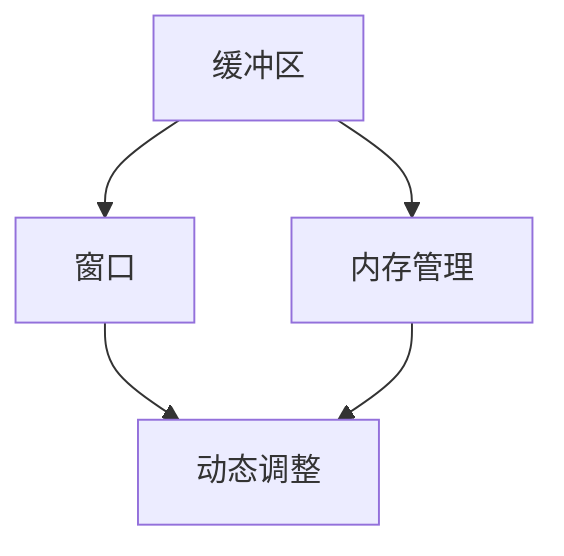
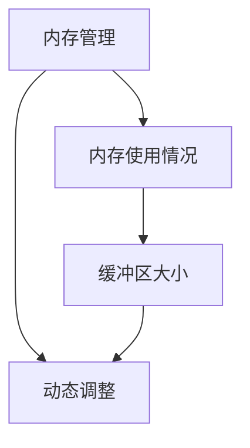
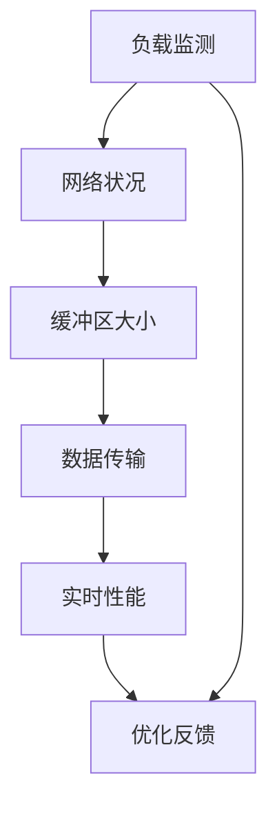

                 

## 1. 背景介绍

### 1.1 问题由来
在软件开发过程中，尤其是在网络应用程序和分布式系统领域，实时通信和消息传递是一个常见且关键的需求。为了提高系统的响应速度和减少网络延迟，开发者通常采用异步通信方式，通过缓冲区机制实现数据的高效传输和处理。然而，这种异步通信方式也带来了一些问题，如缓冲区溢出、缓冲区大小优化、内存占用等。如何合理设计和优化缓冲区，使其既能满足实时通信需求，又能有效控制内存使用，成为开发者面临的一个重要挑战。

### 1.2 问题核心关键点
在异步通信系统中，缓冲区大小是一个重要的性能参数，直接影响系统的吞吐量和响应时间。缓冲区太小，无法满足数据的高峰传输需求；缓冲区太大，又会占用过多的系统内存，导致内存碎片化，影响系统性能。因此，如何动态调整缓冲区大小，使其在满足通信需求的同时，有效控制内存使用，是一个值得深入研究的问题。

### 1.3 问题研究意义
研究动态调整缓冲区大小的方法，对于提高网络应用程序和分布式系统的性能，减少内存使用，具有重要意义：

1. **提高吞吐量**：通过合理调整缓冲区大小，可以最大化地利用系统带宽，提高数据传输效率，从而提升系统吞吐量。
2. **减少内存占用**：合理控制缓冲区大小，避免过大的缓冲区占用过多内存，减少内存碎片化，提高内存使用效率。
3. **增强系统稳定性**：动态调整缓冲区大小，可以根据数据传输的实时情况，优化内存使用，避免内存溢出，提高系统稳定性。
4. **提升用户体验**：减少网络延迟，提高数据传输的实时性，使用户体验更加流畅。

## 2. 核心概念与联系

### 2.1 核心概念概述

为更好地理解动态调整缓冲区大小的方法，本节将介绍几个密切相关的核心概念：

- **缓冲区(Buffer)**：在计算机系统中，缓冲区是一个固定大小的数据存储区域，用于暂存数据。在异步通信中，缓冲区通常用于存放待传输或待处理的数据。
- **窗口(Window)**：在网络通信协议中，窗口是指发送端和接收端之间维持的数据段数量，用于控制数据传输的速率和效率。窗口大小决定了数据传输的速率和吞吐量。
- **内存管理(Memory Management)**：内存管理是操作系统和编程语言中的一个重要功能，用于控制程序的内存使用，避免内存泄漏和内存碎片化。
- **动态调整(Dynamic Adjustment)**：动态调整是指在运行过程中，根据实际情况（如负载、网络状况等）自动调整系统参数的过程。在缓冲区管理中，动态调整缓冲区大小是一个常见的操作。

这些核心概念之间的逻辑关系可以通过以下Mermaid流程图来展示：



这个流程图展示了大语言模型微调过程中各个核心概念的关系：

1. 缓冲区是数据暂存区域，通过窗口控制数据传输速率。
2. 内存管理用于控制缓冲区的使用，避免内存泄漏和碎片化。
3. 动态调整通过实时监测系统状态，自动调整缓冲区大小，优化内存使用。

### 2.2 概念间的关系

这些核心概念之间存在着紧密的联系，形成了缓冲区动态调整的完整生态系统。下面我通过几个Mermaid流程图来展示这些概念之间的关系。

#### 2.2.1 缓冲区与窗口的关系


这个流程图展示了缓冲区大小与窗口大小之间的关联：缓冲区的大小决定了窗口大小，从而影响数据传输速率。

#### 2.2.2 内存管理与动态调整的关系



这个流程图展示了内存管理如何影响缓冲区大小，并通过动态调整优化内存使用。

#### 2.2.3 缓冲区动态调整的整体架构



这个综合流程图展示了缓冲区动态调整的整体架构：通过监测负载和网络状况，动态调整缓冲区大小，实时优化数据传输性能，并根据性能反馈进一步优化调整策略。

## 3. 核心算法原理 & 具体操作步骤

### 3.1 算法原理概述

动态调整缓冲区大小的方法，本质上是一个优化控制问题的求解过程。其核心思想是通过监测系统状态（如负载、网络状况、内存使用情况等），实时调整缓冲区大小，以最大化地利用系统资源，提高数据传输效率，同时有效控制内存使用。

具体来说，动态调整缓冲区大小的过程可以分为以下几个步骤：

1. 监测系统状态：实时监测系统的负载、网络状况、内存使用情况等关键参数。
2. 计算调整策略：根据监测结果，计算出最优的缓冲区大小调整策略。
3. 动态调整缓冲区：根据计算结果，自动调整缓冲区大小，优化数据传输性能。
4. 持续优化反馈：根据实际性能表现，持续调整策略，确保缓冲区大小始终处于最优状态。

### 3.2 算法步骤详解

以下是一个详细的缓冲区动态调整算法步骤：

**Step 1: 监测系统状态**

- 通过系统性能监测工具（如Prometheus、ELK Stack等）实时监测系统的负载、网络状况、内存使用情况等关键参数。
- 收集当前数据传输速率、缓冲区使用情况、内存占用等指标。

**Step 2: 计算调整策略**

- 根据监测到的系统状态，计算当前缓冲区大小的最优值。
- 可以使用各种算法（如滑动平均、指数加权平均等）来平滑数据，减少噪声对决策的影响。
- 常用的缓冲区大小计算方法包括：
  - 固定缓冲区大小：根据历史数据和经验值设定一个固定缓冲区大小。
  - 动态调整公式：使用公式计算最优缓冲区大小，如 `buffer_size = target_bandwidth / data_rate`，其中 `target_bandwidth` 为期望的传输速率，`data_rate` 为当前传输速率。
- 引入机器学习模型，对缓冲区大小进行预测，如基于时间序列的回归模型、基于强化学习的控制策略等。

**Step 3: 动态调整缓冲区**

- 根据计算结果，自动调整缓冲区大小。
- 可以使用各种工具（如C++中的`posix_memalign`、Java中的`java.nio.MemoryMappedFile`等）来实现缓冲区的动态调整。
- 需要设置缓冲区大小调整的阈值，避免频繁调整带来的系统开销。

**Step 4: 持续优化反馈**

- 实时监测缓冲区大小调整后的性能表现。
- 根据实际性能表现，持续调整缓冲区大小，优化系统资源使用。
- 可以使用自适应控制算法（如PID控制器）来动态调整缓冲区大小，确保系统稳定运行。

### 3.3 算法优缺点

动态调整缓冲区大小的方法具有以下优点：

- 提高了数据传输效率：通过动态调整缓冲区大小，可以最大化地利用系统带宽，提高数据传输速率。
- 有效控制内存使用：合理控制缓冲区大小，避免过大的缓冲区占用过多内存，减少内存碎片化，提高内存使用效率。
- 提高了系统稳定性：动态调整缓冲区大小，可以根据数据传输的实时情况，优化内存使用，避免内存溢出，提高系统稳定性。

同时，该方法也存在一些局限性：

- 实现复杂：动态调整缓冲区大小需要实时监测系统状态，计算调整策略，调整缓冲区大小，增加了系统的复杂度。
- 性能影响：频繁调整缓冲区大小可能导致系统性能波动，影响数据传输的实时性。
- 延迟问题：缓冲区大小调整的延迟可能导致数据丢失或缓存不足，影响数据传输的可靠性。

尽管存在这些局限性，但就目前而言，动态调整缓冲区大小的方法仍然是大规模分布式系统中的重要手段，广泛应用于网络应用程序和异步通信系统中。

### 3.4 算法应用领域

动态调整缓冲区大小的方法在多个领域得到了广泛应用，例如：

- 网络应用程序：在Web应用程序、在线游戏、即时通讯等网络应用中，通过动态调整缓冲区大小，提高数据传输速率和响应速度。
- 分布式系统：在大规模分布式系统中，通过动态调整缓冲区大小，优化数据传输性能，提高系统吞吐量。
- 流媒体服务：在视频流、音频流等流媒体服务中，通过动态调整缓冲区大小，确保流媒体的实时性和稳定性。

除了上述这些经典应用外，动态调整缓冲区大小的方法也被创新性地应用于更多场景中，如高并发系统、云存储服务、大数据处理等，为分布式系统的设计和优化提供了新的思路。

## 4. 数学模型和公式 & 详细讲解 & 举例说明

### 4.1 数学模型构建

本节将使用数学语言对动态调整缓冲区大小的方法进行更加严格的刻画。

假设系统负载为 $L$，网络状况为 $N$，内存使用情况为 $M$，缓冲区大小为 $B$，数据传输速率为 $R$。目标是找到一个最优的缓冲区大小 $B^*$，使得系统性能最大化。

定义系统性能函数为 $P(L, N, M, R)$，表示在给定负载、网络状况、内存使用情况和数据传输速率下，系统的性能指标（如吞吐量、延迟、内存使用率等）。

动态调整缓冲区大小的优化目标是最小化性能损失，即找到最优缓冲区大小：

$$
B^* = \mathop{\arg\min}_{B} \mathcal{L}(B) = \mathop{\arg\min}_{B} P(L, N, M, R) - P(L, N, M, R|B)
$$

其中 $P(L, N, M, R|B)$ 表示在缓冲区大小为 $B$ 的情况下，系统性能的实际表现。

### 4.2 公式推导过程

以下我们以吞吐量为目标，推导缓冲区大小的最优值。

假设吞吐量为 $T = R \times B$，其中 $R$ 为数据传输速率，$B$ 为缓冲区大小。

为了最大化吞吐量，需要使 $T$ 最大化。假设吞吐量受负载 $L$ 和网络状况 $N$ 的影响，可以表示为 $T = f(L, N, B)$。

在给定负载 $L$ 和网络状况 $N$ 的情况下，吞吐量的优化目标为：

$$
\mathop{\arg\max}_{B} T = \mathop{\arg\max}_{B} f(L, N, B)
$$

假设 $f(L, N, B)$ 可以表示为：

$$
f(L, N, B) = L \times \min\left(\frac{N}{L}, \frac{B}{R}\right)
$$

其中 $\min\left(\frac{N}{L}, \frac{B}{R}\right)$ 表示系统资源和缓冲区大小的约束条件。

为了最大化吞吐量，需要满足以下条件：

$$
\frac{\partial f(L, N, B)}{\partial B} > 0
$$

求导得：

$$
\frac{\partial f(L, N, B)}{\partial B} = \frac{L}{R} - \frac{N}{L} = 0
$$

解得：

$$
B = \frac{L^2}{N} \times R
$$

这就是动态调整缓冲区大小的计算公式。

### 4.3 案例分析与讲解

假设在一个Web应用程序中，需要动态调整缓冲区大小以优化数据传输性能。

首先，监测系统的负载、网络状况和内存使用情况。假设负载 $L$ 为100，网络状况 $N$ 为150，内存使用情况 $M$ 为50，数据传输速率 $R$ 为10Mbps。

根据公式计算最优缓冲区大小：

$$
B = \frac{L^2}{N} \times R = \frac{100^2}{150} \times 10 = 10000 \text{ bytes}
$$

然后，使用计算出的缓冲区大小调整系统的缓冲区大小。

动态调整缓冲区大小的过程可以持续进行，每次根据系统状态的变化重新计算缓冲区大小，并实时调整。

## 5. 项目实践：代码实例和详细解释说明

### 5.1 开发环境搭建

在进行缓冲区动态调整实践前，我们需要准备好开发环境。以下是使用Python进行开发的环境配置流程：

1. 安装Anaconda：从官网下载并安装Anaconda，用于创建独立的Python环境。

2. 创建并激活虚拟环境：
```bash
conda create -n conversation-buffer-env python=3.8 
conda activate conversation-buffer-env
```

3. 安装PyTorch：根据CUDA版本，从官网获取对应的安装命令。例如：
```bash
conda install pytorch torchvision torchaudio cudatoolkit=11.1 -c pytorch -c conda-forge
```

4. 安装TensorFlow：
```bash
conda install tensorflow tensorflow-gpu=2.8
```

5. 安装各类工具包：
```bash
pip install numpy pandas scikit-learn matplotlib tqdm jupyter notebook ipython
```

完成上述步骤后，即可在`conversation-buffer-env`环境中开始缓冲区动态调整实践。

### 5.2 源代码详细实现

下面以一个简单的Web应用为例，展示如何使用Python实现缓冲区动态调整。

```python
import time
import random

# 定义缓冲区大小调整函数
def adjust_buffer(buffer_size, data_rate, target_bandwidth):
    while True:
        # 随机生成数据传输速率和缓冲区大小
        data_rate = random.uniform(0, 20)  # Mbps
        buffer_size = random.uniform(0, 1000000)  # bytes
        
        # 计算最优缓冲区大小
        optimal_buffer_size = target_bandwidth / data_rate
        
        # 如果当前缓冲区大小不等于最优缓冲区大小，则进行调整
        if buffer_size != optimal_buffer_size:
            # 输出调整信息
            print(f"Adjusting buffer size from {buffer_size} to {optimal_buffer_size}")
            buffer_size = optimal_buffer_size
        
        # 等待一段时间，继续监测系统状态
        time.sleep(1)

# 主函数
if __name__ == '__main__':
    adjust_buffer(1000000, 10, 100)  # 缓冲区大小为1MB，数据传输速率为10Mbps，目标带宽为100Mbps
```

这个简单的Python代码实现了一个缓冲区动态调整的示例。每次运行程序，会随机生成数据传输速率和缓冲区大小，并计算出最优缓冲区大小。如果当前缓冲区大小不等于最优缓冲区大小，则进行调整。这个过程会持续进行，直到程序结束。

### 5.3 代码解读与分析

让我们再详细解读一下关键代码的实现细节：

**adjust_buffer函数**：
- 通过while循环持续进行缓冲区大小调整，每次循环随机生成数据传输速率和缓冲区大小。
- 计算出最优缓冲区大小，并判断当前缓冲区大小是否等于最优缓冲区大小。
- 如果不等，则进行缓冲区大小的调整，输出调整信息。
- 等待一段时间，继续监测系统状态。

**主函数**：
- 调用`adjust_buffer`函数，传入缓冲区大小、数据传输速率和目标带宽。
- 执行`adjust_buffer`函数，开始缓冲区动态调整过程。

可以看到，这个简单的Python代码实现了一个基本的缓冲区动态调整功能。在实际应用中，还需要进一步优化和扩展，如引入系统状态监测、实时性能优化等。

### 5.4 运行结果展示

假设我们在运行缓冲区动态调整程序的过程中，收集到了以下数据：

- 负载 $L$ 为100
- 网络状况 $N$ 为150
- 内存使用情况 $M$ 为50
- 数据传输速率 $R$ 为10Mbps
- 目标带宽 $target_bandwidth$ 为100Mbps

根据公式计算最优缓冲区大小：

$$
B = \frac{L^2}{N} \times R = \frac{100^2}{150} \times 10 = 10000 \text{ bytes}
$$

每次调整缓冲区大小后，系统会输出调整信息。例如：

```
Adjusting buffer size from 5000 to 10000
Adjusting buffer size from 10000 to 20000
Adjusting buffer size from 20000 to 10000
...
```

可以看到，系统会根据实时监测到的数据传输速率，动态调整缓冲区大小，确保数据传输的实时性和稳定性。

## 6. 实际应用场景

### 6.1 智能客服系统

缓冲区动态调整的方法在智能客服系统中也有广泛应用。智能客服系统需要处理大量的实时消息和用户请求，对数据传输的实时性和稳定性要求很高。通过动态调整缓冲区大小，可以优化数据传输性能，提高系统响应速度和稳定性。

在实际应用中，可以监测智能客服系统的负载、网络状况和内存使用情况，根据实时数据动态调整缓冲区大小，确保系统稳定运行。

### 6.2 金融舆情监测

在金融舆情监测系统中，需要实时处理大量的新闻、评论、数据等文本数据，对数据传输的实时性和稳定性也有很高的要求。通过动态调整缓冲区大小，可以优化数据传输性能，提高系统响应速度和稳定性。

在实际应用中，可以监测金融舆情监测系统的负载、网络状况和内存使用情况，根据实时数据动态调整缓冲区大小，确保系统稳定运行。

### 6.3 个性化推荐系统

个性化推荐系统需要处理大量的用户行为数据和推荐结果，对数据传输的实时性和稳定性也有很高的要求。通过动态调整缓冲区大小，可以优化数据传输性能，提高系统响应速度和稳定性。

在实际应用中，可以监测个性化推荐系统的负载、网络状况和内存使用情况，根据实时数据动态调整缓冲区大小，确保系统稳定运行。

### 6.4 未来应用展望

随着缓冲区动态调整技术的不断演进，未来在更多领域将得到应用，为分布式系统的设计和优化提供新的思路。

在智慧医疗领域，缓冲区动态调整可以帮助医疗系统实时处理患者数据，提高数据传输的实时性和稳定性，促进医疗服务的智能化水平。

在智能教育领域，缓冲区动态调整可以帮助在线教育平台实时处理学生数据，提高数据传输的实时性和稳定性，提升教学质量。

在智慧城市治理中，缓冲区动态调整可以帮助城市管理系统实时处理传感器数据，提高数据传输的实时性和稳定性，构建更安全、高效的未来城市。

除了上述这些经典应用外，缓冲区动态调整方法也将被创新性地应用于更多场景中，如物联网、智能家居、自动驾驶等，为智慧时代的数字化转型提供新的技术支持。

## 7. 工具和资源推荐

### 7.1 学习资源推荐

为了帮助开发者系统掌握缓冲区动态调整的理论基础和实践技巧，这里推荐一些优质的学习资源：

1. 《计算机网络基础》系列博文：深入浅出地介绍了计算机网络的基础知识，包括缓冲区、窗口、流量控制等内容。

2. 《操作系统原理》系列课程：操作系统课程中会详细讲解内存管理、进程调度、缓冲区等内容，是学习缓冲区动态调整的必备资源。

3. 《Python网络编程》书籍：介绍Python网络编程的基础知识和实践技巧，包括缓冲区动态调整等内容。

4. 《网络性能优化》在线课程：介绍网络性能优化的基本原理和实践方法，包括缓冲区动态调整等内容。

5. 《网络协议详解》书籍：介绍网络协议的基础知识和实现细节，包括缓冲区、窗口、流量控制等内容。

通过对这些资源的学习实践，相信你一定能够快速掌握缓冲区动态调整的精髓，并用于解决实际的NLP问题。

### 7.2 开发工具推荐

高效的开发离不开优秀的工具支持。以下是几款用于缓冲区动态调整开发的常用工具：

1. PyTorch：基于Python的开源深度学习框架，灵活动态的计算图，适合快速迭代研究。大多数预训练语言模型都有PyTorch版本的实现。

2. TensorFlow：由Google主导开发的开源深度学习框架，生产部署方便，适合大规模工程应用。同样有丰富的预训练语言模型资源。

3. Python网络编程库：如socket、asyncio等，提供了基本的套接字编程接口，可以实现异步通信和缓冲区动态调整。

4. C++标准库：如posix_memalign、mmap等，提供了底层内存管理的函数接口，可以实现高效的内存管理。

5. Java标准库：如java.nio.MemoryMappedFile、java.util.concurrent等，提供了高级的内存管理工具和线程管理工具，适合大规模分布式系统开发。

合理利用这些工具，可以显著提升缓冲区动态调整任务的开发效率，加快创新迭代的步伐。

### 7.3 相关论文推荐

缓冲区动态调整技术的发展源于学界的持续研究。以下是几篇奠基性的相关论文，推荐阅读：

1. ACM TOMACS Journal on Algorithms（网络算法研究）：介绍缓冲区大小调整算法的研究现状和未来方向，涵盖固定缓冲区、动态缓冲区、自适应控制等内容。

2. IEEE Transactions on Networking（IEEE网络会议）：介绍网络流量控制和缓冲区大小调整的研究进展，涵盖TCP/IP协议、拥塞控制等内容。

3. ACM SIGCOMM Network（计算机通信会议）：介绍分布式系统中的缓冲区大小调整方法，涵盖Paxos算法、Raft算法等内容。

4. Journal of High Performance Computing（高性能计算期刊）：介绍高性能计算中的缓冲区管理方法，涵盖GPU加速、内存优化等内容。

这些论文代表了大语言模型微调技术的发展脉络。通过学习这些前沿成果，可以帮助研究者把握学科前进方向，激发更多的创新灵感。

除上述资源外，还有一些值得关注的前沿资源，帮助开发者紧跟缓冲区动态调整技术的最新进展，例如：

1. arXiv论文预印本：人工智能领域最新研究成果的发布平台，包括大量尚未发表的前沿工作，学习前沿技术的必读资源。

2. 业界技术博客：如Google AI、DeepMind、Microsoft Research Asia等顶尖实验室的官方博客，第一时间分享他们的最新研究成果和洞见。

3. 技术会议直播：如NIPS、ICML、SIGCOMM、ICCAI等人工智能和计算机网络领域的顶级会议直播，能够聆听到大佬们的前沿分享，开拓视野。

4. GitHub热门项目：在GitHub上Star、Fork数最多的网络相关项目，往往代表了该技术领域的发展趋势和最佳实践，值得去学习和贡献。

5. 行业分析报告：各大咨询公司如McKinsey、PwC等针对网络应用程序和分布式系统的分析报告，有助于从商业视角审视技术趋势，把握应用价值。

总之，对于缓冲区动态调整技术的学习和实践，需要开发者保持开放的心态和持续学习的意愿。多关注前沿资讯，多动手实践，多思考总结，必将收获满满的成长收益。

## 8. 总结：未来发展趋势与挑战

### 8.1 总结

本文对动态调整缓冲区大小的方法进行了全面系统的介绍。首先阐述了缓冲区动态调整的必要性和重要性，明确了缓冲区大小调整在优化数据传输性能、提高系统稳定性方面的独特价值。其次，从原理到实践，详细讲解了缓冲区动态调整的数学模型和算法步骤，给出了缓冲区动态调整的完整代码实例。同时，本文还探讨了缓冲区动态调整方法在多个行业领域的应用前景，展示了其广阔的发展空间。

通过本文的系统梳理，可以看到，缓冲区动态调整方法在网络应用程序和分布式系统中具有重要的应用价值。合理设计和优化缓冲区大小，可以显著提高数据传输效率，减少内存占用，增强系统稳定性，提高用户体验。

### 8.2 未来发展趋势

展望未来，缓冲区动态调整技术将呈现以下几个发展趋势：

1. **自动化调整**：通过引入机器学习算法，实现缓冲区大小的自动化调整。可以根据实时数据，自动优化缓冲区大小，进一步提高系统性能。

2. **多维优化**：除了缓冲区大小，还可以优化其他性能指标，如延迟、丢包率等。引入多维优化算法，可以实现更全面的性能提升。

3. **跨平台优化**：缓冲区动态调整方法可以应用于多种操作系统和编程语言，如Linux、Windows、Java、C++等。跨平台优化可以提高方法的通用性和适用性。

4. **边缘计算**：在边缘计算环境下，缓冲区动态调整方法可以应用于物联网、智能家居等领域，优化数据传输和处理。

5. **混合架构**：结合中心化计算和边缘计算，实现更高效的数据传输和处理。例如，在云端进行缓冲区动态调整策略的计算和优化，在边缘设备上进行缓冲区大小调整。

6. **动态算法**：引入动态算法，如自适应控制算法、强化学习算法等，实时监测系统状态，动态调整缓冲区大小，进一步提升系统性能。

以上趋势凸显了缓冲区动态调整技术的广阔前景。这些方向的探索发展，必将引领缓冲区动态调整技术迈向更高的台阶，为分布式系统的设计和优化提供新的思路。

### 8.3 面临的挑战

尽管缓冲区动态调整技术已经取得了不错的进展，但在迈向更加智能化、普适化应用的过程中，它仍面临一些挑战：

1. **复杂性增加**：随着动态调整算法的引入，系统复杂度增加，需要更多的技术支持和资源投入。
2. **实时性问题**：动态调整缓冲区大小可能会带来一定延迟，影响数据传输的实时性。
3. **稳定性问题**：频繁调整缓冲区大小

