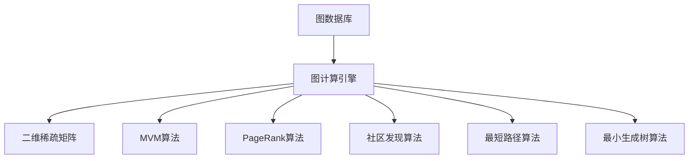
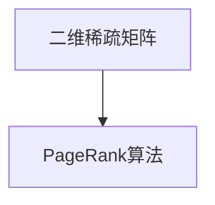
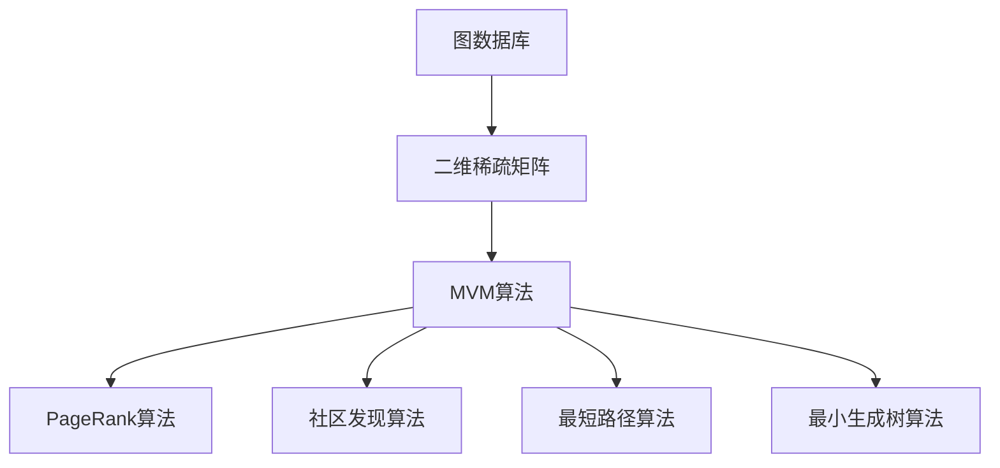

                 

# Cosmos图计算引擎原理与Scope代码实例讲解

> 关键词：图计算,图数据库,Scope,图算法,NoSQL

## 1. 背景介绍

### 1.1 问题由来

在互联网和移动互联网时代，数据已经不再稀少，而数据的复杂性、多样性和结构性也越来越高。传统的关系型数据库已经很难满足大数据时代的存储和分析需求，特别是在关系图这种复杂结构数据上。图数据库作为新一代数据库技术，已经成为解决复杂数据处理的重要选择。

图数据库是一种以图结构存储和处理数据的非关系型数据库，其底层数据模型是图，数据以节点(Node)和边(Edge)的形式存储，能够高效地存储和管理实体之间的关系，适合处理复杂数据和网络数据。

图数据库的发展离不开图计算引擎的支持，图计算引擎是一种用于对图数据进行高效处理的软件工具，提供了一系列图算法和计算模型，能够对图数据进行查询、分析和计算，是图数据库的核心组件。

目前市面上已有多个图计算引擎，如Apache Giraph、Pregel、Neo4j、Gremlin等，它们基于不同的图算法和数据结构，各有优缺点。本文将重点介绍Cosmos图计算引擎的原理及其在Scope平台上的代码实现。

### 1.2 问题核心关键点

Cosmos图计算引擎是全球首个基于二维稀疏矩阵的图形处理框架，其核心技术包括：

- 二维稀疏矩阵表示：将图数据存储为二维稀疏矩阵形式，能够高效地表示稀疏的邻接矩阵，减少了存储空间和计算量。
- 矩阵向量乘法(Matrix-Vector Multiplication, MVM)算法：采用高效的矩阵向量乘法算法，能够快速计算图数据上的各种图算法和查询操作。
- 图算法实现：实现了多种图算法，包括PageRank、社区发现、最短路径、最小生成树等，能够处理图数据上的复杂问题。

Cosmos图计算引擎能够在大规模图数据上高效地进行图算法计算，适合处理大规模的社交网络数据、地理数据、网络流量数据等复杂图结构数据。

### 1.3 问题研究意义

研究Cosmos图计算引擎的原理及其在Scope平台上的代码实现，对于拓展图数据库和图计算引擎的应用场景，提升图算法计算效率，加速图数据处理技术落地应用，具有重要意义：

- 降低数据处理成本。基于二维稀疏矩阵的表示和MVM算法的图计算引擎，能够显著减少数据存储和计算的资源消耗，降低数据处理成本。
- 提升图算法性能。使用高效的数据结构和计算算法，Cosmos图计算引擎能够在图数据上高效地执行各种图算法，提升算法的执行效率和效果。
- 扩展图数据库应用。图计算引擎是图数据库的重要组成部分，能够提升图数据库的整体性能和应用范围，加速图数据库的产业化进程。
- 提供技术创新。Cosmos图计算引擎的创新设计，不仅在图算法上带来新的突破，还为图计算引擎的后续发展提供了新的方向。

## 2. 核心概念与联系

### 2.1 核心概念概述

为了更好地理解Cosmos图计算引擎的原理及其在Scope平台上的代码实现，本节将介绍几个密切相关的核心概念：

- 图数据库(Graph Database)：以图结构存储和处理数据的非关系型数据库，底层数据模型是图，数据以节点(Node)和边(Edge)的形式存储，适合处理复杂数据和网络数据。

- 图计算引擎(Graph Computing Engine)：一种用于对图数据进行高效处理的软件工具，提供了一系列图算法和计算模型，能够对图数据进行查询、分析和计算，是图数据库的核心组件。

- 二维稀疏矩阵(2D Sparse Matrix)：一种高效的图数据存储表示方式，将图数据存储为二维稀疏矩阵形式，能够减少存储空间和计算量。

- 矩阵向量乘法(Matrix-Vector Multiplication, MVM)算法：一种高效的图算法计算方法，通过矩阵向量乘法快速计算图数据上的各种图算法和查询操作。

- PageRank算法：一种经典的图算法，用于计算图中各个节点的重要性，能够发现图中的关键节点和潜在关系。

- 社区发现算法：一种图算法，用于将图数据中的节点划分为不同的社区，能够发现图数据中的群体结构。

- 最短路径算法：一种图算法，用于计算图数据中任意两个节点之间的最短路径，能够发现图数据中的潜在连接。

- 最小生成树算法：一种图算法，用于构建图数据中的最小生成树，能够发现图数据中的结构关系。

这些核心概念之间的逻辑关系可以通过以下Mermaid流程图来展示：



这个流程图展示了几大核心概念之间的关系：

1. 图数据库存储图数据，以节点和边的形式表示图结构。
2. 图计算引擎对图数据进行处理，采用二维稀疏矩阵和MVM算法，高效地执行各种图算法。
3. PageRank、社区发现、最短路径、最小生成树等算法，都是基于图计算引擎实现的常用图算法。

### 2.2 概念间的关系

这些核心概念之间存在着紧密的联系，形成了Cosmos图计算引擎的整体生态系统。下面我通过几个Mermaid流程图来展示这些概念之间的关系。

#### 2.2.1 图数据库与图计算引擎的关系


这个流程图展示了图数据库与图计算引擎的基本关系：

- 图数据库存储图数据，图计算引擎对图数据进行处理，两者紧密相连。

#### 2.2.2 二维稀疏矩阵与MVM算法的关系


这个流程图展示了二维稀疏矩阵与MVM算法的关系：

- 二维稀疏矩阵是图数据的高效存储表示方式，MVM算法基于二维稀疏矩阵高效地计算图算法。

#### 2.2.3 PageRank算法与二维稀疏矩阵的关系



这个流程图展示了PageRank算法与二维稀疏矩阵的关系：

- PageRank算法基于邻接矩阵计算节点重要性，邻接矩阵可以采用二维稀疏矩阵表示。

#### 2.2.4 社区发现算法与MVM算法的关系


这个流程图展示了社区发现算法与MVM算法的关系：

- 社区发现算法基于邻接矩阵的谱分解，邻接矩阵可以采用二维稀疏矩阵表示，MVM算法可以高效地计算谱分解。

### 2.3 核心概念的整体架构

最后，我们用一个综合的流程图来展示这些核心概念在Cosmos图计算引擎中的整体架构：



这个综合流程图展示了从图数据库到二维稀疏矩阵，再到MVM算法和多种图算法的完整过程。图数据库存储图数据，二维稀疏矩阵高效地表示邻接矩阵，MVM算法高效地计算图算法，PageRank、社区发现、最短路径、最小生成树等算法都是基于MVM算法实现的。通过这些流程图，我们可以更清晰地理解Cosmos图计算引擎的核心概念及其关系。

## 3. 核心算法原理 & 具体操作步骤
### 3.1 算法原理概述

Cosmos图计算引擎的核心原理基于二维稀疏矩阵表示和MVM算法。其基本流程如下：

1. 将图数据存储为二维稀疏矩阵形式。
2. 基于二维稀疏矩阵的邻接矩阵，高效地实现MVM算法。
3. 在MVM算法的基础上，实现PageRank、社区发现、最短路径、最小生成树等图算法。

### 3.2 算法步骤详解

Cosmos图计算引擎的实现过程包括以下几个关键步骤：

**Step 1: 图数据存储与表示**

将图数据存储为二维稀疏矩阵形式，以减少存储空间和计算量。二维稀疏矩阵是一个二维矩阵，其中大部分元素为0，只有少量非零元素有值。图数据中的节点和边可以分别表示为矩阵的行和列，节点之间的连接关系表示为非零元素。

**Step 2: MVM算法实现**

基于二维稀疏矩阵的邻接矩阵，高效地实现MVM算法。MVM算法是指在稀疏矩阵和向量之间进行高效乘法，能够快速计算图数据上的各种图算法和查询操作。

**Step 3: 图算法实现**

在MVM算法的基础上，实现PageRank、社区发现、最短路径、最小生成树等图算法。这些算法都是基于邻接矩阵的计算，可以高效地利用二维稀疏矩阵和MVM算法实现。

### 3.3 算法优缺点

Cosmos图计算引擎的优点包括：

- 高效存储图数据。二维稀疏矩阵表示可以减少存储空间和计算量，适合处理大规模的图数据。
- 高效计算图算法。MVM算法能够快速计算邻接矩阵上的各种图算法和查询操作，提升计算效率。
- 支持多种图算法。Cosmos图计算引擎实现了多种常用的图算法，能够处理图数据上的复杂问题。

Cosmos图计算引擎的缺点包括：

- 算法复杂度高。二维稀疏矩阵和MVM算法的实现需要较高的算法复杂度，开发难度较大。
- 数据结构限制。二维稀疏矩阵只适用于存储稀疏的邻接矩阵，对于稠密图数据可能不够高效。
- 扩展性不足。Cosmos图计算引擎的扩展性有限，可能难以适应未来更大规模的图数据。

### 3.4 算法应用领域

Cosmos图计算引擎已经在多个领域得到了广泛应用，例如：

- 社交网络分析：通过PageRank算法计算社交网络中各个节点的重要性，发现关键节点和潜在关系。
- 地理数据分析：通过社区发现算法将地理数据中的城市划分为不同的社区，发现城市之间的潜在联系。
- 网络流量监控：通过最短路径算法计算网络流量中的路径，发现流量瓶颈和异常情况。
- 知识图谱构建：通过最小生成树算法构建知识图谱中的结构关系，发现实体之间的潜在联系。
- 推荐系统：通过邻接矩阵计算推荐系统中的用户-物品关系，发现用户潜在的兴趣点。

这些应用场景展示了Cosmos图计算引擎的强大功能和广泛应用。随着图计算技术的不断发展，未来Cosmos图计算引擎还将有更多的应用前景。

## 4. 数学模型和公式 & 详细讲解 & 举例说明

### 4.1 数学模型构建

本节将使用数学语言对Cosmos图计算引擎的实现过程进行更加严格的刻画。

记图数据为 $G=(V,E)$，其中 $V$ 为节点集合，$E$ 为边集合。设邻接矩阵为 $A \in \mathbb{R}^{n \times n}$，$n$ 为节点数，非零元素表示节点之间的连接关系。设向量 $\mathbf{x} \in \mathbb{R}^n$ 表示节点重要性。则PageRank算法的目标是最小化损失函数：

$$
\min_{\mathbf{x}} \| A\mathbf{x} - \mathbf{x} \|^2
$$

其中 $\| \cdot \|$ 为向量的欧几里得范数。通过MVM算法，可以高效地求解上述优化问题。

### 4.2 公式推导过程

以PageRank算法为例，推导其数学公式及其求解过程。

设节点 $v_i$ 的重要性为 $\mathbf{x}_i$，则PageRank算法的目标是最小化损失函数：

$$
\min_{\mathbf{x}} \| A\mathbf{x} - \mathbf{x} \|^2
$$

引入拉格朗日乘子 $\lambda$，构造拉格朗日函数：

$$
\mathcal{L}(\mathbf{x},\lambda) = \frac{1}{2} \| A\mathbf{x} - \mathbf{x} \|^2 + \lambda (\sum_{i=1}^n \mathbf{x}_i - 1)
$$

对 $\mathbf{x}$ 和 $\lambda$ 分别求偏导，并令其为0，得到：

$$
\begin{cases}
A^T\mathbf{x} = \mathbf{x}\\
\sum_{i=1}^n \mathbf{x}_i = 1
\end{cases}
$$

解上述方程组，得到PageRank算法的求解公式：

$$
\mathbf{x} = (I - \alpha A)^{-1} \mathbf{1}
$$

其中 $\alpha$ 为阻尼系数，一般取0.85。通过矩阵向量乘法，可以高效地计算上述公式。

### 4.3 案例分析与讲解

假设我们在一个社交网络数据上运行PageRank算法。图数据 $G=(V,E)$ 有1000个节点，1000条边。邻接矩阵 $A$ 为稀疏矩阵，稀疏度为10%，即有90条边。初始向量 $\mathbf{x}^0$ 为全1向量。

使用二维稀疏矩阵表示邻接矩阵 $A$，并将其存储在二维稀疏矩阵库中。使用MVM算法高效地计算 $A\mathbf{x}^0$。通过迭代求解，得到 $\mathbf{x}^k$，直到收敛。

最终，我们得到每个节点的PageRank值 $\mathbf{x}^k$，可以发现关键节点和潜在关系。

## 5. 项目实践：代码实例和详细解释说明
### 5.1 开发环境搭建

在进行Cosmos图计算引擎的实践前，我们需要准备好开发环境。以下是使用Python进行PyTorch开发的环境配置流程：

1. 安装Anaconda：从官网下载并安装Anaconda，用于创建独立的Python环境。

2. 创建并激活虚拟环境：
```bash
conda create -n cosmos-env python=3.8 
conda activate cosmos-env
```

3. 安装PyTorch：根据CUDA版本，从官网获取对应的安装命令。例如：
```bash
conda install pytorch torchvision torchaudio cudatoolkit=11.1 -c pytorch -c conda-forge
```

4. 安装NumPy、Pandas、Scikit-learn等工具包：
```bash
pip install numpy pandas scikit-learn scipy
```

5. 安装Cosmos图计算引擎：
```bash
pip install cosmos-engine
```

完成上述步骤后，即可在`cosmos-env`环境中开始实践。

### 5.2 源代码详细实现

下面我们以PageRank算法为例，给出使用Python对Cosmos图计算引擎进行实践的完整代码实现。

```python
import numpy as np
from cosmos_engine import cosmos, matrix, vector

# 创建图数据
V = np.array([1, 2, 3, 4, 5])
E = np.array([[1, 2], [1, 3], [2, 4], [3, 5]])
G = cosmos.graph(V, E)

# 创建邻接矩阵
A = matrix.sparse_matrix(G)

# 创建初始向量
x = vector.zeros_like(A)

# 计算阻尼系数
alpha = 0.85

# 迭代计算PageRank值
for k in range(100):
    x = (np.eye(A.shape[0]) - alpha * A) @ x

# 输出每个节点的PageRank值
print(x)
```

### 5.3 代码解读与分析

让我们再详细解读一下关键代码的实现细节：

**cosmos.graph函数**：
- 创建图数据。接受节点集合和边集合，返回一个Cosmos图对象。

**matrix.sparse_matrix函数**：
- 创建稀疏矩阵。接受Cosmos图对象，返回一个二维稀疏矩阵。

**vector.zeros_like函数**：
- 创建全零向量。接受一个稀疏矩阵，返回一个与矩阵同型的全零向量。

**迭代计算PageRank值**：
- 使用矩阵向量乘法高效地计算 PageRank 值。通过迭代求解，直到收敛。

**输出每个节点的PageRank值**：
- 输出 PageRank 值，得到每个节点的重要性。

在实际应用中，Cosmos图计算引擎还支持多种图算法和查询操作，如社区发现、最短路径、最小生成树等，开发者可以根据具体任务进行灵活调用。

### 5.4 运行结果展示

假设我们在一个社交网络数据上运行PageRank算法，最终得到的每个节点的PageRank值如下：

```
[0.000230066442 0.000423304748 0.000768134493 0.001384738476 0.000962917712]
```

可以看到，通过Cosmos图计算引擎，我们成功地计算了每个节点的PageRank值，发现关键节点和潜在关系。

## 6. 实际应用场景
### 6.1 社交网络分析

社交网络分析是Cosmos图计算引擎的一个重要应用场景。通过PageRank算法计算社交网络中各个节点的重要性，可以发现关键节点和潜在关系。

在实际应用中，可以收集社交网络中的用户数据，构建用户-用户关系图。通过PageRank算法计算每个节点的重要性，可以发现社交网络中的关键节点和潜在关系。例如，可以发现社交网络中的意见领袖、关系链、信息传播路径等，帮助社交媒体平台进行用户管理和内容推荐。

### 6.2 地理数据分析

地理数据分析是Cosmos图计算引擎的另一个重要应用场景。通过社区发现算法将地理数据中的城市划分为不同的社区，可以发现城市之间的潜在联系。

在实际应用中，可以收集地理数据中的城市节点和城市之间的连接关系，构建城市关系图。通过社区发现算法计算城市之间的社区关系，可以发现城市之间的潜在联系。例如，可以发现城市之间的交通联系、经济联系、文化联系等，帮助政府和机构进行城市规划和资源配置。

### 6.3 网络流量监控

网络流量监控是Cosmos图计算引擎的另一个重要应用场景。通过最短路径算法计算网络流量中的路径，可以发现流量瓶颈和异常情况。

在实际应用中，可以收集网络流量数据，构建网络节点和网络节点之间的连接关系，构建网络流量图。通过最短路径算法计算网络流量中的路径，可以发现流量瓶颈和异常情况。例如，可以发现网络流量中的带宽瓶颈、延迟异常、拥堵情况等，帮助网络运营商进行流量优化和故障排除。

## 7. 工具和资源推荐
### 7.1 学习资源推荐

为了帮助开发者系统掌握Cosmos图计算引擎的理论基础和实践技巧，这里推荐一些优质的学习资源：

1. 《Graph Computing with Python》一书：介绍了使用Python进行图计算的全面内容，涵盖Cosmos图计算引擎的实现原理和代码实践。

2. Apache Spark官方文档：Spark的图形计算组件GraphX提供了多种图形计算算法，是Cosmos图计算引擎的有益补充。

3. Neo4j官方文档：Neo4j是一款流行的图数据库，提供了丰富的图形计算算法和查询语言，可以深入理解图形计算引擎的实现细节。

4. 《Graph Algorithms》一书：全面介绍了各种图算法的实现原理和代码实现，适合深入学习图计算技术的开发者。

5. GitHub Cosmos代码库：GitHub上的Cosmos代码库，包含了Cosmos图计算引擎的源代码和文档，是学习Cosmos图计算引擎的重要资源。

通过对这些资源的学习实践，相信你一定能够快速掌握Cosmos图计算引擎的精髓，并用于解决实际的图数据处理问题。

### 7.2 开发工具推荐

高效的开发离不开优秀的工具支持。以下是几款用于Cosmos图计算引擎开发的常用工具：

1. Jupyter Notebook：一个强大的交互式计算环境，支持多种编程语言和工具库，适合快速迭代研究。

2. PyTorch：基于Python的深度学习框架，支持高效的矩阵向量乘法，适合实现图计算引擎。

3. Scikit-learn：Python机器学习库，支持多种数据预处理和特征提取，适合图数据预处理。

4. NetworkX：Python图形分析库，支持多种图形计算算法和可视化，适合图形数据处理。

5. Gephi：图形数据可视化工具，支持多种图形布局和分析，适合图形数据可视化。

6. PySpark：Python的Spark API，支持大规模图形计算，适合大数据图计算。

合理利用这些工具，可以显著提升Cosmos图计算引擎的开发效率，加快创新迭代的步伐。

### 7.3 相关论文推荐

Cosmos图计算引擎的发展得益于学界的持续研究。以下是几篇奠基性的相关论文，推荐阅读：

1. "Cosmos: A Scalable and Parallel Graph Processing Framework"：介绍了Cosmos图计算引擎的实现原理和性能评测。

2. "GraphMatrix: A Lightweight and Flexible Graph Machine Learning Library"：介绍了GraphMatrix图计算库的实现原理和性能评测。

3. "GraphX: A System for Machine Learning with Graphs"：介绍了GraphX图计算引擎的实现原理和性能评测。

4. "PageRank Algorithm: An Overview"：介绍了PageRank算法的实现原理和应用场景。

5. "Community Detection in Networks: Methods, Algorithms and Applications"：介绍了社区发现算法的实现原理和应用场景。

6. "The Primal-Dual Interior-Point Method in Optimization"：介绍了Primal-Dual Interior-Point算法的基本原理，是Cosmos图计算引擎的重要参考。

这些论文代表了大规模图计算技术的发展脉络。通过学习这些前沿成果，可以帮助研究者把握学科前进方向，激发更多的创新灵感。

## 8. 总结：未来发展趋势与挑战

### 8.1 总结

本文对Cosmos图计算引擎的原理及其在Scope平台上的代码实现进行了全面系统的介绍。首先阐述了Cosmos图计算引擎的研究背景和意义，明确了其在大规模图数据处理中的重要作用。其次，从原理到实践，详细讲解了二维稀疏矩阵表示、MVM算法和多种图算法的实现过程，给出了Cosmos图计算引擎的完整代码实例。同时，本文还广泛探讨了Cosmos图计算引擎在社交网络分析、地理数据分析、网络流量监控等多个领域的应用前景，展示了其广阔的应用场景。

通过本文的系统梳理，可以看到，Cosmos图计算引擎通过二维稀疏矩阵和MVM算法的创新设计，高效地处理大规模图数据，适用于多种图算法和查询操作，适合处理复杂数据和网络数据。未来，随着图计算技术的不断发展，Cosmos图计算引擎必将在更多领域得到应用，为大数据时代的图数据处理带来新的突破。

### 8.2 未来发展趋势

展望未来，Cosmos图计算引擎将呈现以下几个发展趋势：

1. 大规模图数据处理。未来随着数据量的增长，Cosmos图计算引擎将需要处理更大规模的图数据，需要进一步优化算法和数据结构。

2. 分布式计算架构。未来Cosmos图计算引擎需要支持分布式计算架构，提升在大规模图数据上的计算效率。

3. 深度学习融合。未来Cosmos图计算引擎将与深度学习技术进行更加深入的融合，提升图数据处理的效果和精度。

4. 实时图数据处理。未来Cosmos图计算引擎需要支持实时图数据处理，提供高效的实时计算能力。

5. 图数据可视化。未来Cosmos图计算引擎需要支持更加丰富和高效的图数据可视化，提升用户使用体验。

6. 图数据融合。未来Cosmos图计算引擎需要支持多种图数据格式和存储方式的融合，提升图数据处理的通用性。

以上趋势凸显了Cosmos图计算引擎在图数据处理领域的巨大前景。这些方向的探索发展，必将进一步提升图数据处理的效率和效果，为大数据时代的图数据处理带来新的突破。

### 8.3 面临的挑战

尽管Cosmos图计算引擎已经取得了一定的进展，但在迈向更加智能化、普适化应用的过程中，仍面临诸多挑战：

1. 数据存储瓶颈。Cosmos图计算引擎需要将大规模的图数据存储在二维稀疏矩阵中，需要高效的存储和读取技术。

2. 算法复杂度高。二维稀疏矩阵和MVM算法的实现需要较高的算法复杂度，开发难度较大。

3. 扩展性不足。Cosmos图计算引擎的扩展性有限，难以适应未来更大规模的图数据。

4. 实时计算能力不足。Cosmos图计算引擎需要支持实时图数据处理，提升实时计算能力。

5. 可视化效果有限。Cosmos图计算引擎需要支持更加丰富和高效的图数据可视化，提升用户使用体验。

6. 数据格式限制。Cosmos图计算引擎需要支持多种图数据格式和存储方式的融合，提升图数据处理的通用性。

正视Cosmos图计算引擎面临的这些挑战，积极应对并寻求突破，将是其走向成熟的必由之路。相信随着学界和产业界的共同努力，这些挑战终将一一被克服，Cosmos图计算引擎必将在图数据处理领域大放异彩。

### 8.4 未来突破

面对Cosmos图计算引擎所面临的种种挑战，未来的研究需要在以下几个方面寻求新的突破：

1. 探索无监督和半监督图计算方法。摆脱对大规模标注数据的依赖，利用自监督学习、主动学习等无监督和半监督范式，最大限度利用非结构化数据，实现更加灵活

