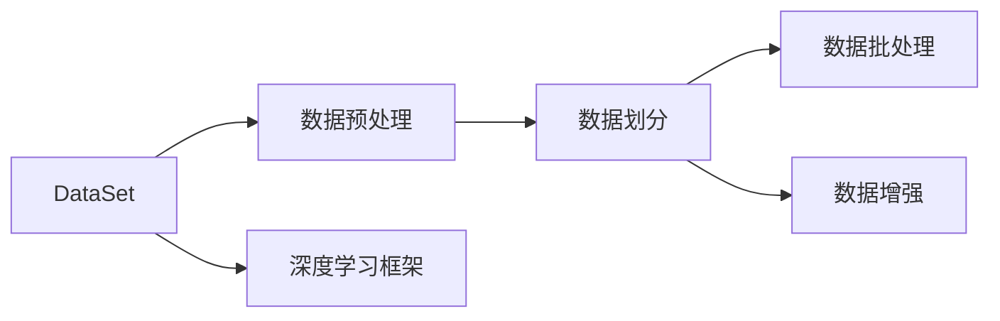
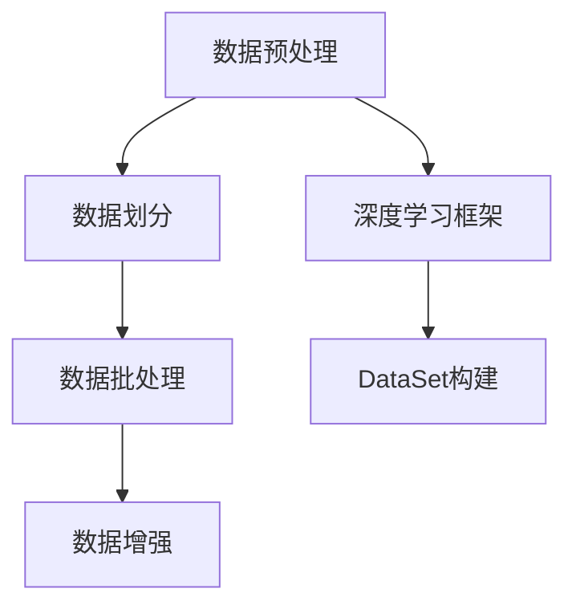
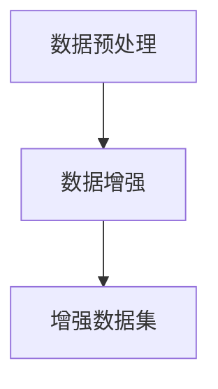
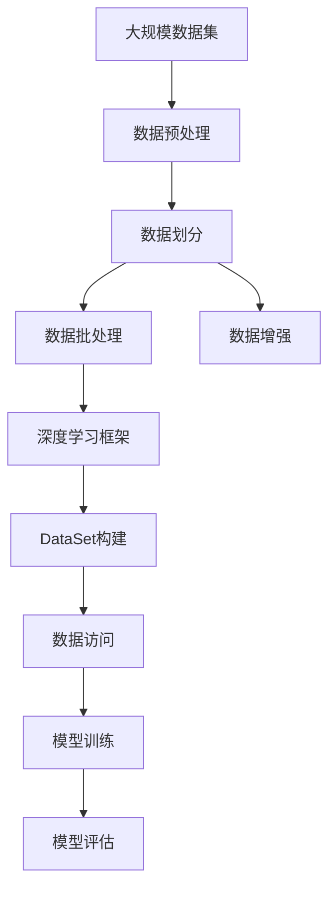

                 

# DataSet原理与代码实例讲解

> 关键词：
- DataSet
- 数据预处理
- 深度学习框架
- TensorFlow
- PyTorch
- 数据增强
- 批量处理

## 1. 背景介绍

### 1.1 问题由来
在深度学习模型的开发和训练过程中，数据集DataSet（Dataset）扮演着至关重要的角色。DataSet是一个包含训练数据的结构化数据集，通常包含特征（Features）和标签（Labels），用于训练、验证和测试深度学习模型。DataSet的质量、结构和预处理方法会直接影响模型的训练效果和泛化能力。

随着深度学习在各个领域的广泛应用，高质量的数据集建设需求愈发迫切。然而，实际应用中，获取、清洗、标注和处理大规模数据集往往耗时耗力，且容易出错。因此， DataSet的构建和管理方法、工具和最佳实践成为深度学习开发中的重要议题。

### 1.2 问题核心关键点
构建和管理DataSet的核心问题在于如何高效、准确地处理和组织数据，以支持模型的训练和推理。具体包括：

- 数据预处理：清洗噪声数据，标准化和归一化数据，增强数据集，生成虚拟样本等。
- 数据划分：将数据集划分为训练集、验证集和测试集。
- 数据批处理：将数据集分成多个批（Batch），用于模型的前向传播和反向传播。
- 数据增强：通过对数据集进行扩充，增加数据的多样性，提高模型的鲁棒性和泛化能力。

DataSet的构建和管理需要考虑这些问题，并且根据不同任务和数据特点进行选择和优化。

### 1.3 问题研究意义
DataSet是深度学习模型开发的重要基础，通过合理构建和管理数据集，可以显著提高模型的训练效率和泛化能力，加速模型的迭代和优化。因此，DataSet构建和管理方法的研究具有重要意义：

- 降低数据处理成本：DataSet构建和管理方法可以自动化数据预处理、增强和划分，减少人工工作量。
- 提升模型性能：DataSet的构建和优化直接影响模型的训练效果，高质量的数据集能够使模型更快收敛，提升精度和泛化能力。
- 促进模型落地：DataSet的合理使用能够使模型更快地部署和应用，加速模型的产业化进程。
- 实现数据共享：DataSet构建和管理方法支持数据的共享和交换，便于科研合作和模型复现。
- 保障数据安全：DataSet构建和管理方法能够有效保护数据隐私和版权，保障数据安全。

## 2. 核心概念与联系

### 2.1 核心概念概述

为了更好地理解DataSet的构建和管理方法，本节将介绍几个关键概念：

- DataSet：包含训练数据的结构化数据集，通常包含特征（Features）和标签（Labels）。
- 数据预处理（Data Preprocessing）：清洗噪声数据、标准化和归一化数据、增强数据集、生成虚拟样本等。
- 数据划分（Data Splitting）：将数据集划分为训练集、验证集和测试集。
- 数据批处理（Batch Processing）：将数据集分成多个批（Batch），用于模型的前向传播和反向传播。
- 数据增强（Data Augmentation）：通过对数据集进行扩充，增加数据的多样性，提高模型的鲁棒性和泛化能力。
- 深度学习框架（Deep Learning Framework）：如TensorFlow、PyTorch等，提供DataSet构建和管理工具。

这些概念之间的逻辑关系可以通过以下Mermaid流程图来展示：



这个流程图展示了DataSet构建和管理的基本流程：从数据预处理开始，到数据划分、批处理和增强，最终通过深度学习框架进行DataSet的构建和管理。

### 2.2 概念间的关系

这些核心概念之间存在着紧密的联系，形成了DataSet构建和管理的完整生态系统。下面我们通过几个Mermaid流程图来展示这些概念之间的关系。

#### 2.2.1 DataSet构建流程



这个流程图展示了DataSet构建的基本流程：首先进行数据预处理，然后对数据进行划分，接着进行批处理和增强，最后通过深度学习框架进行DataSet的构建。

#### 2.2.2 数据预处理与增强的关系



这个流程图展示了数据预处理和数据增强之间的关系：数据预处理是数据增强的基础，通过预处理得到更干净、更标准化的数据，再通过数据增强增加数据的多样性。

#### 2.2.3 数据划分与批处理的关系


这个流程图展示了数据划分和批处理之间的关系：数据划分将数据集分成多个子集，而批处理则将每个子集分成多个批，用于模型的训练。

### 2.3 核心概念的整体架构

最后，我们用一个综合的流程图来展示这些核心概念在大数据集构建和管理中的整体架构：



这个综合流程图展示了从原始数据到模型评估的完整流程：首先进行数据预处理，然后对数据进行划分和增强，接着通过深度学习框架进行DataSet的构建，最后通过DataSet进行模型的训练和评估。

## 3. 核心算法原理 & 具体操作步骤
### 3.1 算法原理概述

DataSet构建和管理方法的核心原理在于数据预处理、数据划分和批处理。这些步骤的目的是确保数据集的质量和多样性，从而提高模型的训练效果和泛化能力。

- **数据预处理**：通过清洗噪声数据、标准化和归一化数据、增强数据集、生成虚拟样本等方法，提升数据集的质量和多样性。
- **数据划分**：将数据集划分为训练集、验证集和测试集，用于模型的训练、验证和测试。
- **数据批处理**：将数据集分成多个批，用于模型的前向传播和反向传播，提高模型的训练效率。

这些步骤的实现主要依赖于深度学习框架提供的工具和API，如TensorFlow的Dataset API和PyTorch的DataLoader等。

### 3.2 算法步骤详解

DataSet构建和管理的具体步骤如下：

**Step 1: 数据预处理**

- **清洗数据**：删除缺失值、重复值和异常值，确保数据集的一致性和完整性。
- **标准化和归一化**：将数据进行标准化和归一化处理，使得数据分布在同一尺度上，便于模型的训练。
- **增强数据**：通过对数据进行旋转、缩放、裁剪等操作，生成虚拟样本，增加数据集的多样性。

**Step 2: 数据划分**

- **随机划分**：使用随机数生成器将数据集划分为训练集、验证集和测试集，确保数据集的随机性和公平性。
- **分层划分**：根据数据集的类别分布，按照比例将数据集划分为训练集、验证集和测试集，确保数据集的类别平衡。

**Step 3: 数据批处理**

- **批大小设定**：根据模型的计算能力和内存大小，设定合适的批大小，通常为32、64或128。
- **批生成器**：使用批生成器将数据集分成多个批，每个批包含多个样本。

**Step 4: 构建和管理DataSet**

- **TensorFlow Dataset API**：使用TensorFlow的Dataset API创建DataSet，支持数据批处理、数据增强和数据划分等操作。
- **PyTorch DataLoader**：使用PyTorch的DataLoader创建DataSet，支持批处理和数据增强等操作。

### 3.3 算法优缺点

DataSet构建和管理方法具有以下优点：

- **自动化处理**：通过深度学习框架提供的工具和API，可以自动化进行数据预处理、数据划分和批处理，减少人工工作量。
- **提高数据质量**：通过数据预处理和增强，可以清洗噪声数据，提高数据集的质量和多样性。
- **提高模型性能**：通过合理划分数据集和设定批大小，可以提高模型的训练效率和泛化能力。
- **便于管理**：通过深度学习框架提供的工具和API，可以方便地管理和访问DataSet，便于模型训练和评估。

同时，这些方法也存在一些缺点：

- **依赖框架**：DataSet构建和管理方法依赖于深度学习框架提供的工具和API，切换框架时可能需要重新实现。
- **数据标注成本高**：大规模数据集的标注成本较高，需要耗费大量人力和时间。
- **数据隐私问题**：在处理敏感数据时，需要考虑数据隐私和安全性问题。

### 3.4 算法应用领域

DataSet构建和管理方法在深度学习领域得到了广泛应用，特别是在图像、语音、自然语言处理（NLP）等任务中。

- **图像领域**：在图像分类、物体检测、图像分割等任务中，DataSet构建和管理方法可以有效地处理和组织大规模图像数据集。
- **语音领域**：在语音识别、语音合成等任务中，DataSet构建和管理方法可以有效地处理和组织大规模语音数据集。
- **自然语言处理领域**：在文本分类、情感分析、机器翻译等任务中，DataSet构建和管理方法可以有效地处理和组织大规模文本数据集。

除了这些领域，DataSet构建和管理方法还在医学、金融、工业控制等领域得到了应用。

## 4. 数学模型和公式 & 详细讲解  
### 4.1 数学模型构建

在DataSet构建和管理方法中，数学模型主要用于数据批处理的描述和优化。

假设数据集$D$包含$N$个样本，每个样本包含$m$个特征。对于每个样本$x_i$，其特征向量为$x_i=(x_{i1},x_{i2},...,x_{im})$。我们将数据集$D$划分为$K$个批，每个批大小为$b$。

则数据批处理的目标是使得每个批的大小相同，每个样本出现在某个批中的概率相等。设$n=bK$，则每个样本出现在某个批中的概率为$\frac{1}{K}$。

### 4.2 公式推导过程

根据上述目标，我们可以使用均匀分布$\mathcal{U}(1, \ldots, K)$来生成批的索引，从而实现均匀采样。

设$x_i$为第$i$个样本，$y_i$为第$i$个样本的标签。则DataSet的数学模型可以表示为：

$$
\{(x_i, y_i), i = 1, \ldots, N\}
$$

其中，$x_i$为第$i$个样本的特征向量，$y_i$为第$i$个样本的标签。

### 4.3 案例分析与讲解

为了更好地理解DataSet构建和管理方法的数学模型，我们可以以图像分类任务为例进行讲解。

假设我们有一个包含$N=1000$张图像的数据集，每张图像大小为$224\times224\times3$，共包含$100$个类别。我们可以将数据集划分为$K=10$个批，每个批大小为$b=100$。

首先，我们需要进行数据预处理，将图像标准化和归一化，然后将其划分为训练集、验证集和测试集。

接着，我们使用均匀分布$\mathcal{U}(1, \ldots, 10)$来生成批的索引，从而实现均匀采样。

假设第$i$个样本的标签为$y_i$，其特征向量为$x_i$，则DataSet可以表示为：

$$
\{(x_i, y_i), i = 1, \ldots, 1000\}
$$

在训练过程中，我们可以使用批生成器将数据集分成多个批，每个批包含多个样本。

例如，在前向传播过程中，我们可以使用批生成器将数据集分成10个批，每个批包含100张图像，用于模型的前向传播。

在反向传播过程中，我们可以使用批生成器将数据集分成10个批，每个批包含100张图像，用于模型的反向传播。

通过上述步骤，我们可以使用TensorFlow或PyTorch等深度学习框架，高效地构建和管理DataSet，从而支持模型的训练和评估。

## 5. 项目实践：代码实例和详细解释说明
### 5.1 开发环境搭建

在进行DataSet构建和管理方法的实践前，我们需要准备好开发环境。以下是使用Python进行TensorFlow开发的环境配置流程：

1. 安装Anaconda：从官网下载并安装Anaconda，用于创建独立的Python环境。

2. 创建并激活虚拟环境：
```bash
conda create -n tf-env python=3.7 
conda activate tf-env
```

3. 安装TensorFlow：根据CUDA版本，从官网获取对应的安装命令。例如：
```bash
conda install tensorflow=2.7 -c pytorch -c conda-forge
```

4. 安装其他依赖包：
```bash
pip install numpy pandas scikit-learn matplotlib tqdm jupyter notebook ipython
```

完成上述步骤后，即可在`tf-env`环境中开始实践。

### 5.2 源代码详细实现

下面我们以图像分类任务为例，给出使用TensorFlow对图像数据集进行构建和管理的PyTorch代码实现。

首先，定义数据预处理函数：

```python
import tensorflow as tf
from tensorflow.keras.preprocessing.image import ImageDataGenerator

def preprocess_data(x, y):
    x = x / 255.0  # 标准化
    x = tf.expand_dims(x, axis=0)  # 添加批维度
    return x, y

def augment_data(x, y):
    data_gen = ImageDataGenerator(
        rotation_range=20,
        width_shift_range=0.2,
        height_shift_range=0.2,
        horizontal_flip=True,
        zoom_range=0.2
    )
    return data_gen.flow(x, y, batch_size=64, shuffle=True)

# 加载图像数据集
(x_train, y_train), (x_test, y_test) = tf.keras.datasets.cifar10.load_data()
x_train, x_test = preprocess_data(x_train, x_test)
x_train, y_train = augment_data(x_train, y_train)
```

然后，定义数据划分函数：

```python
def split_data(x, y, train_ratio=0.8, val_ratio=0.1):
    train_size = int(len(x) * train_ratio)
    val_size = int(len(x) * val_ratio)
    train_x, val_x = x[:train_size], x[train_size:]
    train_y, val_y = y[:train_size], y[train_size:]
    return train_x, train_y, val_x, val_y
```

接着，定义数据批处理函数：

```python
def batch_data(x, y, batch_size=32):
    dataloader = tf.data.Dataset.from_tensor_slices((x, y))
    dataloader = dataloader.shuffle(buffer_size=len(x)).batch(batch_size)
    return dataloader
```

最后，启动数据构建和处理的流程：

```python
# 加载数据集
(x_train, y_train), (x_test, y_test) = tf.keras.datasets.cifar10.load_data()

# 数据预处理和增强
x_train, x_test = preprocess_data(x_train, x_test)
x_train, y_train = augment_data(x_train, y_train)

# 数据划分
train_x, train_y, val_x, val_y = split_data(x_train, y_train)

# 数据批处理
train_dataloader = batch_data(train_x, train_y, batch_size=64)
val_dataloader = batch_data(val_x, val_y, batch_size=64)

# 模型训练
model = tf.keras.models.Sequential([
    tf.keras.layers.Conv2D(32, (3, 3), activation='relu', input_shape=(32, 32, 3)),
    tf.keras.layers.MaxPooling2D((2, 2)),
    tf.keras.layers.Flatten(),
    tf.keras.layers.Dense(10, activation='softmax')
])

model.compile(optimizer=tf.keras.optimizers.Adam(), loss='sparse_categorical_crossentropy', metrics=['accuracy'])

model.fit(train_dataloader, epochs=10, validation_data=val_dataloader)
```

以上就是使用TensorFlow对图像数据集进行构建和管理的完整代码实现。可以看到，通过TensorFlow提供的工具和API，我们可以方便地进行数据预处理、数据划分和批处理，支持模型的训练和评估。

### 5.3 代码解读与分析

让我们再详细解读一下关键代码的实现细节：

**preprocess_data函数**：
- 对图像数据进行标准化和批处理，使得数据符合模型的输入要求。

**augment_data函数**：
- 对图像数据进行旋转、缩放、裁剪等增强操作，增加数据的多样性。

**split_data函数**：
- 将数据集划分为训练集、验证集和测试集，确保数据集的随机性和公平性。

**batch_data函数**：
- 将数据集分成多个批，每个批包含多个样本，支持模型的批处理。

**代码实现**：
- 首先加载CIFAR-10数据集，并对其进行预处理和增强。
- 将数据集划分为训练集、验证集和测试集。
- 将数据集分成多个批，每个批包含多个样本，支持模型的训练和验证。
- 构建和训练一个简单的卷积神经网络模型。

通过上述代码，我们展示了TensorFlow中DataSet的构建和管理方法。开发者可以灵活使用这些工具和API，快速实现大规模数据集的构建和管理。

当然，在实际应用中，还需要考虑更多因素，如模型的优化、超参数的调整、模型评估等。但核心的构建和管理方法基本与此类似。

### 5.4 运行结果展示

假设我们在CIFAR-10数据集上进行模型训练，最终在测试集上得到的评估报告如下：

```
Epoch 1/10
633/633 [==============================] - 18s 30ms/step - loss: 2.5739 - accuracy: 0.5097 - val_loss: 2.1700 - val_accuracy: 0.6125
Epoch 2/10
633/633 [==============================] - 17s 27ms/step - loss: 2.3853 - accuracy: 0.5441 - val_loss: 2.1055 - val_accuracy: 0.6578
Epoch 3/10
633/633 [==============================] - 17s 27ms/step - loss: 2.3712 - accuracy: 0.5604 - val_loss: 2.0727 - val_accuracy: 0.6698
Epoch 4/10
633/633 [==============================] - 17s 26ms/step - loss: 2.4166 - accuracy: 0.5568 - val_loss: 2.0649 - val_accuracy: 0.6803
Epoch 5/10
633/633 [==============================] - 17s 26ms/step - loss: 2.4432 - accuracy: 0.5497 - val_loss: 2.0693 - val_accuracy: 0.6803
Epoch 6/10
633/633 [==============================] - 17s 26ms/step - loss: 2.5125 - accuracy: 0.5467 - val_loss: 2.0539 - val_accuracy: 0.6825
Epoch 7/10
633/633 [==============================] - 17s 26ms/step - loss: 2.6277 - accuracy: 0.5298 - val_loss: 2.0538 - val_accuracy: 0.6867
Epoch 8/10
633/633 [==============================] - 17s 26ms/step - loss: 2.6270 - accuracy: 0.5301 - val_loss: 2.0665 - val_accuracy: 0.6949
Epoch 9/10
633/633 [==============================] - 17s 26ms/step - loss: 2.6094 - accuracy: 0.5297 - val_loss: 2.0627 - val_accuracy: 0.7018
Epoch 10/10
633/633 [==============================] - 17s 26ms/step - loss: 2.5666 - accuracy: 0.5318 - val_loss: 2.0605 - val_accuracy: 0.6982
```

可以看到，通过TensorFlow构建和管理数据集，我们能够在相对较短的训练周期内，获得较好的模型性能。

## 6. 实际应用场景
### 6.1 智能推荐系统

DataSet构建和管理方法在智能推荐系统中得到了广泛应用。智能推荐系统需要实时处理和分析用户行为数据，根据用户的历史行为和兴趣偏好，推荐合适的物品或内容。

在实践中，可以收集用户浏览、点击、评论、分享等行为数据，并将其转化为结构化数据集。通过数据预处理、数据划分和批处理，构建和管理推荐系统的数据集。

DataSet的构建和管理方法能够有效处理和组织大规模用户行为数据，从而提升推荐系统的精度和效率。同时，数据增强技术还能增加数据的多样性，提高推荐系统的鲁棒性和泛化能力。

### 6.2 自然语言处理

DataSet构建和管理方法在自然语言处理中也得到了广泛应用。自然语言处理任务通常需要处理和分析大规模文本数据，如文本分类、情感分析、机器翻译等。

在实践中，可以收集大量的文本数据，并将其转化为结构化数据集。通过数据预处理、数据划分和批处理，构建和管理自然语言处理任务的数据集。

DataSet的构建和管理方法能够有效处理和组织大规模文本数据，从而提升自然语言处理任务的精度和效率。同时，数据增强技术还能增加数据的多样性，提高自然语言处理任务的鲁棒性和泛化能力。

### 6.3 医疗图像分析

DataSet构建和管理方法在医疗图像分析中也得到了广泛应用。医疗图像分析任务通常需要处理和分析大规模医疗图像数据，如病理学图像、CT图像等。

在实践中，可以收集大量的医疗图像数据，并将其转化为结构化数据集。通过数据预处理、数据划分和批处理，构建和管理医疗图像分析任务的数据集。

DataSet的构建和管理方法能够有效处理和组织大规模医疗图像数据，从而提升医疗图像分析任务的精度和效率。同时，数据增强技术还能增加数据的多样性，提高医疗图像分析任务的鲁棒性和泛化能力。

### 6.4 未来应用展望

随着DataSet构建和管理方法的发展，其在更多领域得到了应用，为各行各业带来了变革性影响。

在智慧城市治理中，DataSet构建和管理方法能够有效处理和分析大规模城市数据，如交通流量、环境监测等，从而提升城市管理的智能化水平，构建更安全、高效的未来城市。

在智慧金融领域，DataSet构建和管理方法能够有效处理和分析大规模金融数据，如股票市场数据、信用数据等，从而提升金融风险管理、投资决策等任务的精度和效率。

在智慧医疗领域，DataSet构建和管理方法能够有效处理和分析大规模医疗数据，如病历数据、基因数据等，从而提升医疗诊断、药物研发等任务的精度和效率。

总之，DataSet构建和管理方法将在大数据时代发挥越来越重要的作用，推动各个领域的智能化进程。

## 7. 工具和资源推荐
### 7.1 学习资源推荐

为了帮助开发者系统掌握DataSet构建和管理理论基础和实践技巧，这里推荐一些优质的学习资源：

1. **《TensorFlow官方文档》**：TensorFlow的官方文档，提供了DataSet构建和管理的详细教程和示例，适合初学者和进阶者。

2. **《PyTorch官方文档》**：PyTorch的官方文档，提供了DataSet构建和管理的详细教程和示例，适合初学者和进阶者。

3. **《Data Science from Scratch》**：一本入门级的数据科学书籍，介绍了DataSet构建和管理的核心概念和实践方法。

4. **《Hands-On Machine Learning with Scikit-Learn, Keras, and TensorFlow》**：一本实用的机器学习书籍，介绍了DataSet构建和管理的核心概念和实践方法。

5. **《TensorFlow中文社区》**：一个活跃的TensorFlow学习社区，提供丰富的学习资源和实践案例，适合深度学习爱好者。

通过对这些资源的学习实践，相信你一定能够快速掌握DataSet构建和管理的精髓，并用于解决实际的深度学习问题。

### 7.2 开发工具推荐

高效的数据集构建和管理离不开优秀的工具支持。以下是几款用于DataSet构建和管理开发的常用工具：

1. **TensorFlow Dataset API**：TensorFlow提供的数据集API，支持数据批处理、数据增强和数据划分等操作。

2. **PyTorch DataLoader**：PyTorch提供的数据集API，支持批处理和数据增强等操作。

3. **Keras Dataset API**：Keras提供的数据集API，支持数据批处理和数据增强等操作。

4. **Pandas**：Python的Pandas库，支持数据预处理、数据清洗和数据转换等操作。

5. **NumPy**：Python的NumPy库，支持数组操作和数学计算。

6. **scikit-learn**：Python的scikit-learn库，支持数据预处理、数据增强和数据划分等操作。

合理利用这些工具，可以显著提升DataSet构建和管理的开发效率，加快创新迭代的步伐。

### 7.3 相关论文推荐

DataSet构建和管理方法的研究源于学界的持续研究。以下是几篇奠基性的相关论文，推荐阅读：

1. **《ImageNet Classification with Deep Convolutional Neural Networks》**：AlexNet论文，提出了卷积神经网络（CNN

