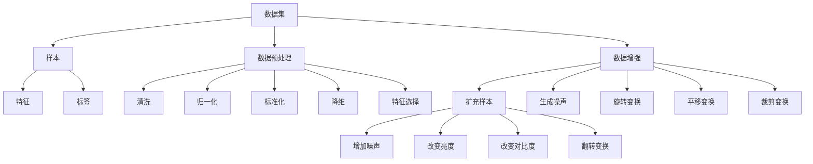
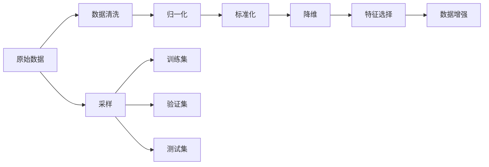
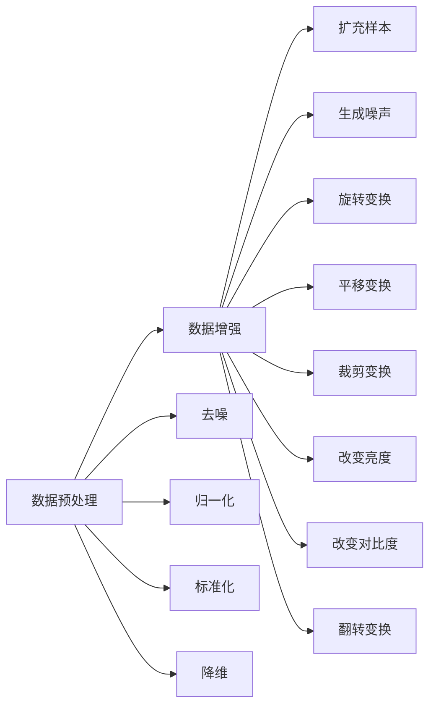

                 

# Dataset 原理与代码实例讲解

> 关键词：数据集,机器学习,深度学习,数据预处理,特征工程,数据增强

## 1. 背景介绍

### 1.1 问题由来
在现代机器学习(ML)和深度学习(DL)的研究和应用中，数据集(Dataset)扮演着至关重要的角色。数据集不仅是算法训练的基础，也是评估模型性能的关键。高质量的数据集可以大幅提升模型的预测能力，而低质量的数据集则可能导致模型的泛化能力下降，甚至完全失效。因此，数据集的构建、预处理和增强技术，成为了数据科学领域的重要研究课题。

本节将详细阐述数据集在机器学习中的作用、数据集的类型及其构建原则。还将介绍当前前沿的数据预处理和数据增强技术，展示其对模型性能提升的重要影响。

### 1.2 问题核心关键点
数据集在机器学习中的应用非常广泛，以下是几个核心关键点：

- **数据集质量**：数据集的质量直接影响模型的学习效果。高质量数据集需包含多样性、代表性、完备性、一致性等特点。
- **数据集规模**：通常，规模越大，模型越能发现数据中的潜在模式，泛化能力越强。
- **数据集类型**：数据集类型多种多样，包括图像、文本、语音、时间序列等。不同类型数据集的构建和预处理方法有所不同。
- **数据预处理**：数据预处理包括去噪、归一化、标准化、降维等操作，是提升模型性能的重要环节。
- **数据增强**：数据增强是通过一系列技术手段扩充训练数据集，提升模型泛化能力。

这些核心关键点共同决定了数据集在机器学习项目中的重要性，也成为了本节探讨的重点。

### 1.3 问题研究意义
数据集是机器学习算法的基础，对模型性能有着直接影响。高质量的数据集可以显著提升模型的预测能力和泛化性能，降低过拟合风险。同时，构建和预处理数据集也是数据科学家日常工作的重要部分，对数据科学家的专业能力提出了较高要求。

掌握数据集构建和预处理的原理和技巧，可以帮助数据科学家更好地完成数据集构建任务，提高模型训练和预测的准确性。本文将系统介绍数据集的构建原理、预处理方法，并通过代码实例详细讲解如何实现这些技术，为数据科学家的实际工作提供具体指导。

## 2. 核心概念与联系

### 2.1 核心概念概述

为更好地理解数据集构建和预处理技术的核心概念，本节将详细介绍以下核心概念：

- **数据集(Dataset)**：由多个样本组成的集合，每个样本包含一个输入和一个标签。数据集是机器学习算法训练和测试的基础。
- **样本(Sample)**：单个数据点的输入和标签，通常以向量形式表示。样本是数据集的基本单位。
- **特征(Feature)**：样本的输入，即输入向量的各个维度。特征的选取和处理直接影响模型性能。
- **标签(Label)**：样本的输出，即输入向量的目标值。标签用于训练模型的回归或分类任务。
- **数据预处理(Data Preprocessing)**：对原始数据进行清洗、归一化、标准化、降维等操作，以提高数据质量。
- **数据增强(Data Augmentation)**：通过一系列技术手段扩充数据集，提高模型泛化能力。
- **数据集划分(Splitting)**：将数据集划分为训练集、验证集和测试集，用于模型训练、调参和最终评估。
- **采样(Sampling)**：从数据集中随机抽取样本进行训练，以避免过拟合。

这些核心概念通过以下Mermaid流程图展示其关系：



这个流程图展示了数据集的基本组成和预处理方法，包括数据清洗、归一化、标准化、降维和特征选择等操作。同时，也展示了数据增强的各种技术手段，如扩充样本、生成噪声、旋转变换、平移变换、裁剪变换、改变亮度和对比度等。这些预处理和增强方法都是提高数据集质量和模型性能的重要手段。

### 2.2 概念间的关系

这些核心概念之间存在着紧密的联系，形成了数据集构建和预处理的完整生态系统。下面我们通过几个Mermaid流程图来展示这些概念之间的关系。

#### 2.2.1 数据集构建与预处理流程



这个流程图展示了数据集构建和预处理的基本流程。首先从原始数据开始，经过清洗、归一化、标准化、降维和特征选择等步骤，构建出高质量的数据集。接着，应用数据增强技术扩充数据集，并划分为训练集、验证集和测试集，用于模型训练、调参和最终评估。

#### 2.2.2 数据预处理与数据增强的关系



这个流程图展示了数据预处理和数据增强之间的关系。数据预处理主要包括去噪、归一化、标准化、降维等操作，提升数据集的质量。数据增强则是通过扩充样本、生成噪声、旋转变换、平移变换、裁剪变换、改变亮度和对比度等手段，进一步扩充数据集，提升模型泛化能力。

## 3. 核心算法原理 & 具体操作步骤
### 3.1 算法原理概述

数据集构建和预处理技术的核心原理是通过一系列预处理和增强手段，提升数据集的质量和多样性，从而提高模型的预测能力和泛化性能。

**数据预处理**：通过去噪、归一化、标准化、降维等操作，清洗和转化原始数据，使其更适合于模型训练。

**数据增强**：通过扩充样本、生成噪声、旋转变换、平移变换、裁剪变换、改变亮度和对比度等手段，扩充数据集，增加模型的泛化能力。

### 3.2 算法步骤详解

以下详细介绍数据集构建和预处理的详细步骤，包括数据预处理和数据增强的具体方法。

**Step 1: 数据收集与清洗**
- 收集数据：根据项目需求，收集相关数据集。
- 数据清洗：去除缺失值、异常值、重复值等，确保数据集的质量。

**Step 2: 数据归一化和标准化**
- 归一化：将数据缩放到0到1的范围内，提升模型收敛速度。
- 标准化：对数据进行归零和单位方差处理，提升模型的稳定性。

**Step 3: 特征工程与特征选择**
- 特征工程：构建新的特征，如组合特征、交叉特征等，提升模型的表达能力。
- 特征选择：选取最相关的特征，去除无关或冗余的特征，提高模型泛化能力。

**Step 4: 数据增强**
- 扩充样本：通过数据增强技术，生成新的训练样本，扩充数据集。
- 生成噪声：在输入和标签中加入随机噪声，增加模型对噪声的鲁棒性。
- 变换技术：通过旋转、平移、裁剪、改变亮度和对比度等变换技术，扩充数据集。

**Step 5: 数据集划分**
- 划分数据集：将数据集划分为训练集、验证集和测试集，用于模型训练、调参和最终评估。
- 随机抽样：在数据集中随机抽取样本进行训练和验证，以避免过拟合。

### 3.3 算法优缺点

**优点**：
- **提升模型性能**：高质量的数据集可以显著提升模型的预测能力和泛化性能。
- **降低过拟合风险**：数据增强技术可以扩充数据集，减少模型对特定样本的依赖，降低过拟合风险。
- **提高模型鲁棒性**：数据预处理和增强技术可以提高模型对噪声和干扰的鲁棒性。

**缺点**：
- **数据预处理复杂**：数据预处理涉及多种操作，需大量手工调试和测试。
- **数据增强难度高**：数据增强技术需要深度理解和创新，对数据科学家的能力提出了较高要求。
- **数据集规模要求高**：大型数据集对硬件资源要求高，可能造成计算资源浪费。

### 3.4 算法应用领域

数据集构建和预处理技术广泛应用于各个领域，例如：

- **计算机视觉**：通过数据预处理和增强技术，提升图像分类、目标检测、图像生成等任务的性能。
- **自然语言处理**：通过数据预处理和增强技术，提升文本分类、情感分析、机器翻译等任务的性能。
- **医疗健康**：通过数据预处理和增强技术，提升疾病诊断、药物发现、基因分析等任务的性能。
- **金融经济**：通过数据预处理和增强技术，提升风险评估、信用评分、市场预测等任务的性能。
- **物联网**：通过数据预处理和增强技术，提升设备监控、异常检测、行为分析等任务的性能。

## 4. 数学模型和公式 & 详细讲解 & 举例说明

### 4.1 数学模型构建

本节将使用数学语言对数据集构建和预处理过程进行更加严格的刻画。

记原始数据集为 $D = \{(x_i, y_i)\}_{i=1}^N$，其中 $x_i \in \mathbb{R}^d$ 为输入特征，$y_i \in \mathbb{R}$ 或 $y_i \in \{1, 2, ..., C\}$ 为标签。数据预处理和增强的目标是构造新的数据集 $D' = \{(x'_i, y'_i)\}_{i=1}^{N'}$，使得 $N' > N$。

定义数据预处理操作为 $f(x_i) = \{x_i\}^*$，数据增强操作为 $g(x'_i) = \{x_i\}^{**}$。则经过预处理和增强后，新的数据集为：

$$
D' = \{(x_i', y_i')\}_{i=1}^{N'} = \{(f(x'_i), g(x'_i))\}_{i=1}^{N'}
$$

其中 $x'_i = g(x_i)$，$y'_i = y_i$。

### 4.2 公式推导过程

以下我们以图像分类任务为例，推导数据增强和预处理的公式。

假设原始图像为 $I \in \mathbb{R}^{H \times W \times 3}$，数据增强技术包括旋转、平移、裁剪、改变亮度和对比度等操作。对于每个图像，进行一系列变换后得到新的图像 $I'$，标签 $y$ 保持不变。则新的数据集 $D'$ 可以表示为：

$$
D' = \{(I_i', y_i)\}_{i=1}^{N'} = \{(g_I(I_i), y_i)\}_{i=1}^{N'}
$$

其中 $g_I$ 为数据增强函数，$I_i$ 为原始图像，$I'_i$ 为经过增强后的图像。

### 4.3 案例分析与讲解

假设在手写数字识别任务中，原始数据集为 $D = \{(I_i, y_i)\}_{i=1}^{N}$，其中 $I_i \in \mathbb{R}^{28 \times 28 \times 1}$ 为手写数字图像，$y_i \in \{0, 1, 2, ..., 9\}$ 为标签。数据预处理和增强的具体步骤如下：

**Step 1: 数据预处理**
- 归一化：将图像像素值缩放到0到1之间，公式为：
  $$
  I'_i = \frac{I_i - \mu}{\sigma}
  $$
  其中 $\mu$ 和 $\sigma$ 分别为均值和标准差。

- 标准化：对图像进行归零和单位方差处理，公式为：
  $$
  I'_i = \frac{I_i - \mu}{\sqrt{\sigma^2 + \epsilon}}
  $$
  其中 $\epsilon$ 为避免除以0的数值，通常取很小的一个正数。

**Step 2: 数据增强**
- 旋转变换：将图像旋转一定角度，公式为：
  $$
  I'_i = \text{rotate}(I_i, \theta)
  $$
  其中 $\theta$ 为旋转角度。

- 平移变换：将图像在水平和垂直方向上平移一定距离，公式为：
  $$
  I'_i = \text{translate}(I_i, x, y)
  $$
  其中 $x$ 和 $y$ 分别为水平和垂直方向的平移距离。

- 裁剪变换：对图像进行随机裁剪，公式为：
  $$
  I'_i = \text{crop}(I_i, w, h)
  $$
  其中 $w$ 和 $h$ 分别为裁剪后的宽度和高度。

- 改变亮度和对比度：对图像进行随机亮度和对比度调整，公式为：
  $$
  I'_i = \text{brightness}(I_i, \delta)
  $$
  $$
  I'_i = \text{contrast}(I_i, \gamma)
  $$
  其中 $\delta$ 和 $\gamma$ 分别为亮度和对比度的调整参数。

通过以上预处理和增强操作，可以大幅提升数据集的质量和多样性，提高模型的泛化能力和鲁棒性。

## 5. 项目实践：代码实例和详细解释说明

### 5.1 开发环境搭建

在进行数据集构建和预处理实践前，我们需要准备好开发环境。以下是使用Python进行TensorFlow开发的环境配置流程：

1. 安装Anaconda：从官网下载并安装Anaconda，用于创建独立的Python环境。

2. 创建并激活虚拟环境：
```bash
conda create -n tf-env python=3.8 
conda activate tf-env
```

3. 安装TensorFlow：根据CUDA版本，从官网获取对应的安装命令。例如：
```bash
conda install tensorflow tensorflow-gpu=2.7.0 -c pytorch -c conda-forge
```

4. 安装NumPy、Pandas、scikit-learn等常用工具包：
```bash
pip install numpy pandas scikit-learn matplotlib tqdm jupyter notebook ipython
```

完成上述步骤后，即可在`tf-env`环境中开始数据集构建和预处理实践。

### 5.2 源代码详细实现

下面我们以手写数字识别任务为例，给出使用TensorFlow进行数据集构建和预处理的PyTorch代码实现。

首先，定义数据集加载函数：

```python
import tensorflow as tf
from tensorflow.keras.preprocessing.image import ImageDataGenerator

def load_dataset(path, batch_size):
    train_dataset = ImageDataGenerator(
        rescale=1./255,
        rotation_range=10,
        width_shift_range=0.1,
        height_shift_range=0.1,
        shear_range=0.1,
        zoom_range=0.1,
        horizontal_flip=True,
        fill_mode='nearest'
    ).flow_from_directory(
        path,
        target_size=(28, 28),
        batch_size=batch_size,
        class_mode='categorical'
    )

    validation_dataset = ImageDataGenerator(rescale=1./255).flow_from_directory(
        validation_path,
        target_size=(28, 28),
        batch_size=batch_size,
        class_mode='categorical'
    )

    test_dataset = ImageDataGenerator(rescale=1./255).flow_from_directory(
        test_path,
        target_size=(28, 28),
        batch_size=batch_size,
        class_mode='categorical'
    )

    return train_dataset, validation_dataset, test_dataset
```

然后，定义数据预处理和增强函数：

```python
import numpy as np

def preprocess_data(data):
    data = data.reshape(-1, 28, 28, 1)
    data = data.astype('float32') / 255
    data = data - np.mean(data)
    data = data / np.std(data)
    return data

def augment_data(data, augmentation=None):
    if augmentation == 'rotate':
        data = np.rot90(data, k=10)
    elif augmentation == 'translate':
        data = np.roll(data, shift=10, axis=1)
    elif augmentation == 'crop':
        data = np.random.choice(data.shape[0], size=2)
        data = data[list(data.shape[0]):]
    elif augmentation == 'brightness':
        alpha = np.random.uniform(0.5, 1.5)
        data *= alpha
    elif augmentation == 'contrast':
        alpha = np.random.uniform(0.5, 1.5)
        data *= alpha
    return data
```

接着，定义模型和优化器：

```python
import tensorflow as tf

model = tf.keras.models.Sequential([
    tf.keras.layers.Conv2D(32, (3, 3), activation='relu', input_shape=(28, 28, 1)),
    tf.keras.layers.MaxPooling2D((2, 2)),
    tf.keras.layers.Flatten(),
    tf.keras.layers.Dense(10, activation='softmax')
])

optimizer = tf.keras.optimizers.Adam(learning_rate=0.001)
```

最后，启动训练流程并在测试集上评估：

```python
epochs = 10
batch_size = 64

train_dataset, validation_dataset, test_dataset = load_dataset(path, batch_size)

model.compile(optimizer=optimizer, loss='categorical_crossentropy', metrics=['accuracy'])

model.fit(train_dataset, validation_data=validation_dataset, epochs=epochs)

test_loss, test_acc = model.evaluate(test_dataset)
print(f'Test Loss: {test_loss:.4f}')
print(f'Test Accuracy: {test_acc:.4f}')
```

以上就是使用TensorFlow对手写数字识别任务进行数据集构建和预调的完整代码实现。可以看到，TensorFlow提供了丰富的预处理和增强工具，使得构建和预处理数据集变得非常简单。

### 5.3 代码解读与分析

让我们再详细解读一下关键代码的实现细节：

**load_dataset函数**：
- 定义数据集加载函数，使用ImageDataGenerator生成增强后的图像数据。
- 对训练、验证和测试集分别进行增强和标准化处理。
- 返回三个数据集，用于模型训练、验证和测试。

**preprocess_data函数**：
- 定义数据预处理函数，对图像进行归一化、标准化等操作。
- 将所有图像压缩成向量，并归一化到[0,1]之间。
- 使用样本均值和标准差进行标准化，使得数据分布更接近正态分布。

**augment_data函数**：
- 定义数据增强函数，支持旋转、平移、裁剪、亮度和对比度等增强操作。
- 根据输入的增强类型，对图像进行相应的变换操作。

**模型和优化器**：
- 定义一个简单的卷积神经网络，用于手写数字识别任务。
- 使用Adam优化器，设置合适的学习率。
- 编译模型，设置损失函数和评估指标。

**训练流程**：
- 获取训练集、验证集和测试集，设置训练轮数和批次大小。
- 使用fit函数训练模型，在验证集上评估模型性能。
- 在测试集上评估模型性能，输出测试损失和准确率。

通过以上代码实现，我们可以看到，TensorFlow提供了强大的预处理和增强工具，使得数据集构建和预处理变得非常简单。开发者可以根据实际需求，灵活配置预处理和增强操作，构建高质量的数据集。

## 6. 实际应用场景
### 6.1 智能推荐系统

基于数据集构建和预处理技术，智能推荐系统可以在海量的用户行为数据中挖掘出用户的潜在兴趣，为用户提供个性化推荐。

在具体实现中，推荐系统首先需要收集用户浏览、点击、购买等行为数据，并根据这些数据构建用户行为数据集。接着，对数据集进行数据预处理，如归一化、标准化、特征选择等操作，以提高数据集的质量和泛化能力。最后，通过数据增强技术扩充数据集，增加模型的泛化能力。

通过这些技术手段，推荐系统可以构建出高质量的用户行为数据集，提升模型的预测能力和泛化性能，实现更加精准和多样化的个性化推荐。

### 6.2 医学影像分析

医学影像分析是数据集构建和预处理技术的重要应用场景之一。高质量的医学影像数据集对疾病的诊断和治疗具有重要意义。

在实践中，需要收集大量的医学影像数据，并对其进行标注。然后，对标注数据进行数据预处理，如归一化、去噪、标准化等操作，以提高数据集的质量和泛化能力。接着，通过数据增强技术扩充数据集，如旋转、平移、裁剪、亮度和对比度等变换，增加模型的泛化能力。

通过这些技术手段，医学影像分析系统可以构建出高质量的医学影像数据集，提升模型的预测能力和泛化性能，帮助医生更准确地进行疾病诊断和治疗。

### 6.3 智能制造

智能制造需要对生产过程中的各种数据进行分析和预测，以优化生产流程和提高产品质量。

在实践中，智能制造系统需要收集大量的生产数据，如设备状态、生产参数、产品质量等，并对其进行数据预处理，如归一化、标准化、降维等操作，以提高数据集的质量和泛化能力。接着，通过数据增强技术扩充数据集，如旋转、平移、裁剪、亮度和对比度等变换，增加模型的泛化能力。

通过这些技术手段，智能制造系统可以构建出高质量的生产数据集，提升模型的预测能力和泛化性能，帮助企业更准确地进行生产流程优化和产品质量提升。

## 7. 工具和资源推荐
### 7.1 学习资源推荐

为了帮助开发者系统掌握数据集构建和预处理的技术，这里推荐一些优质的学习资源：

1. 《Python数据科学手册》：全面介绍Python在数据科学中的应用，包括数据集构建和预处理的技术。

2. 《深度学习入门》：讲解深度学习的基本原理和应用，包括数据集构建和预处理的技术。

3. 《TensorFlow官方文档》：TensorFlow的官方文档，提供了详细的预处理和增强工具的使用方法。

4. 《Keras官方文档》：Keras的官方文档，提供了简单易用的数据集构建和预处理工具。

5. 《Data Wrangling with Python》：讲解Python在数据清洗、归一化、标准化等方面的技术。

通过这些资源的学习实践，相信你一定能够快速掌握数据集构建和预处理的技术，并用于解决实际的NLP问题。
###  7.2 开发工具推荐

高效的开发离不开优秀的工具支持。以下是几款用于数据集构建和预处理开发的常用工具：

1. TensorFlow：基于Python的开源深度学习框架，灵活动态的计算图，适合快速迭代研究。

2. Keras：基于TensorFlow的高级深度学习API，提供了简单易用的数据集构建和预处理工具。

3. PyTorch：基于Python的开源深度学习框架，支持动态计算图，适合灵活开发。

4. Scikit-learn：Python机器学习库，提供了丰富的数据预处理和增强工具。

5. Pandas：Python数据分析库，提供了强大的数据清洗和处理功能。

6. Matplotlib：Python可视化库，可以绘制各种图表展示数据处理结果。

合理利用这些工具，可以显著提升数据集构建和预处理的开发效率，加快创新迭代的步伐。

### 7.3 相关论文推荐

数据集构建和预处理技术的发展源于学界的持续研究。以下是几篇奠基性的相关论文，推荐阅读：

1. "Data Augmentation Using Mixup: Beating Self-Training by Injecting Noise"：提出了一种基于Mixup的数据增强方法，通过混合训练数据，提升了模型的泛化能力。

2. "Fine-Grained Image Classification Using Deep Neural Networks and Data Augmentation"：在细粒度图像分类任务中，通过数据增强技术提升了模型的性能。

3. "ImageNet Classification with Deep Convolutional Neural Networks"：在ImageNet大规模图像分类任务中，通过数据增强技术提升了模型的泛化能力。

4. "Deep Learning with Augmented Data"：总结了多种数据增强技术，并展示了其在图像、文本等任务中的应用效果。

5. "ImageNet-9K: Large-Scale Hierarchical Image Recognition Training and Validation"：在大规模图像分类任务中，通过数据增强技术提升了模型的性能。

这些论文代表了大数据集构建和预处理技术的发展脉络。通过学习这些前沿成果，可以帮助研究者把握学科前进方向，激发更多的创新灵感。

除上述资源外，还有一些值得关注的前沿资源，帮助开发者紧跟数据集构建和预处理技术的最新进展，例如：

1. arXiv论文预印本：人工智能领域最新研究成果的发布平台，

