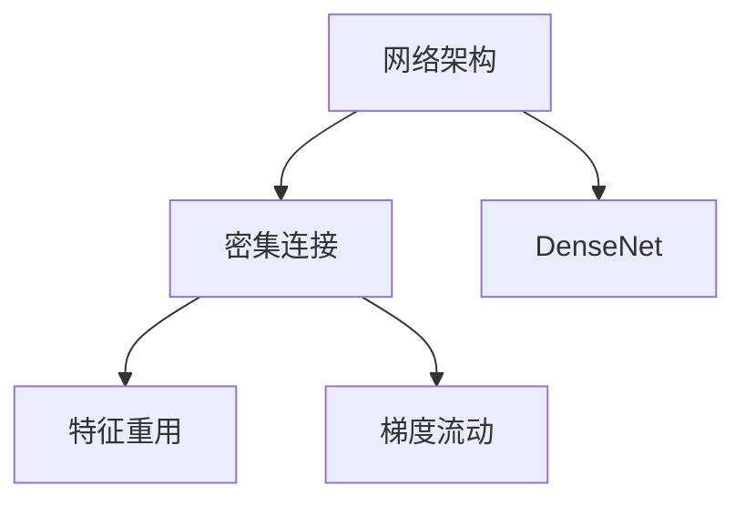
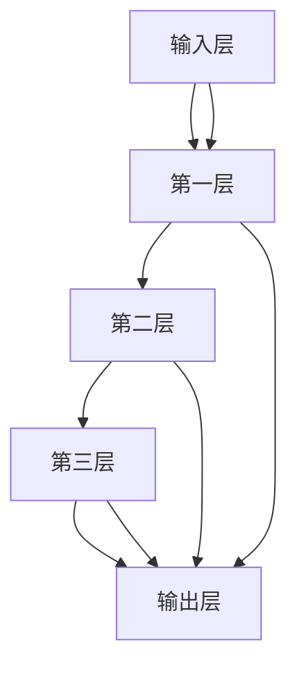
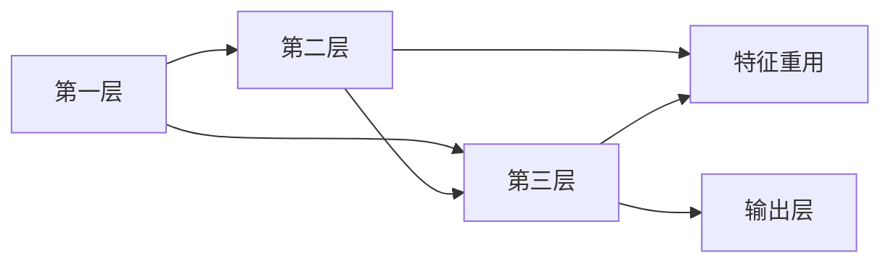
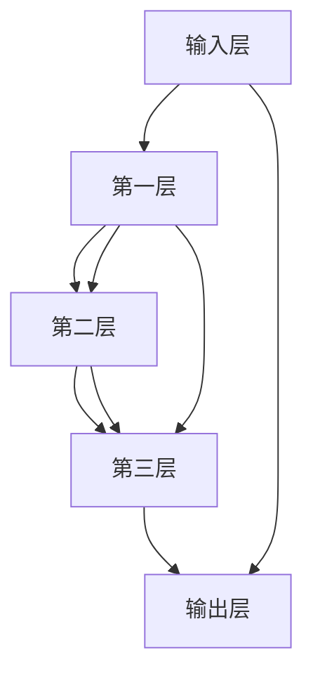
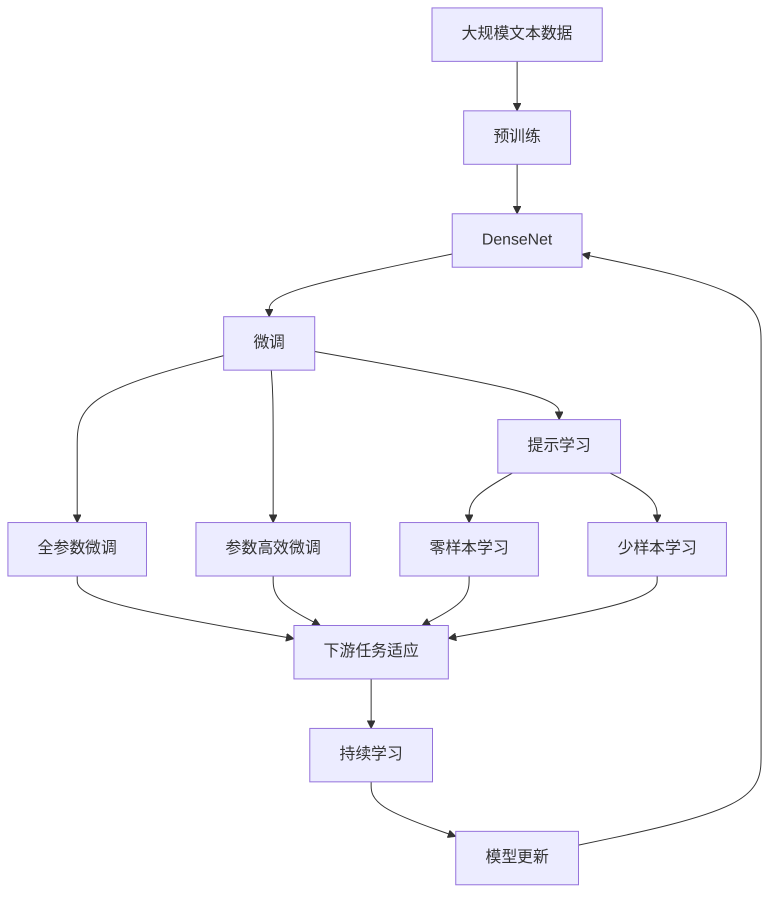

                 

# DenseNet原理与代码实例讲解

> 关键词：DenseNet,密集连接,网络架构,特征重用,梯度流动

## 1. 背景介绍

### 1.1 问题由来
随着深度学习技术的发展，卷积神经网络(Convolutional Neural Network, CNN)在图像识别、目标检测等计算机视觉任务中取得了显著的成果。然而，传统卷积网络往往存在参数量大、计算成本高、梯度消失等问题，限制了其性能的进一步提升。DenseNet作为一类新型卷积神经网络，通过引入密集连接(Dense Connection)架构，极大地改善了这些问题。

### 1.2 问题核心关键点
DenseNet的核心思想是将网络中任意层与之前的所有层进行连接，使得每一层都能接收来自之前所有层的特征，从而实现特征的累积和重用。这种设计可以显著减少网络的参数量，同时提升特征的表达能力和模型的泛化能力。

DenseNet的特点如下：
1. 密集连接：任意两个层之间都存在连接，信息可以自由流动。
2. 特征重用：每一层的输出都连接到其之前的所有层，实现特征的累积和重用。
3. 参数效率：密集连接能够减少参数量，提升计算效率。

### 1.3 问题研究意义
DenseNet作为深度学习中的重要研究成果，对于提升网络性能、优化资源利用、改善梯度流动等方面具有重要意义：

1. 减少参数量：密集连接使得网络中各层之间可以共享信息，减少参数量，提升训练速度。
2. 改善梯度流动：密集连接架构能够改善梯度传播路径，减少梯度消失，加速模型收敛。
3. 增强特征重用：密集连接使得模型可以更好地利用之前各层特征，提升特征表达能力。
4. 降低过拟合：密集连接架构能够降低过拟合，提升模型的泛化能力。

## 2. 核心概念与联系

### 2.1 核心概念概述

为更好地理解DenseNet的工作原理和架构设计，本节将介绍几个密切相关的核心概念：

- DenseNet: 一种新型卷积神经网络架构，通过密集连接实现特征的重用和流动，显著提升网络性能。

- 密集连接(Dense Connection): 指网络中任意两个层之间都存在连接，信息可以自由流动。

- 特征重用: 指每一层的输出都连接到其之前的所有层，实现特征的累积和重用。

- 梯度流动: 指在网络中，梯度可以自由流动，避免梯度消失问题。

- 网络架构: 指神经网络的结构设计，包括层、连接方式等。

这些核心概念之间的逻辑关系可以通过以下Mermaid流程图来展示：



这个流程图展示了大模型微调的核心概念及其之间的关系：

1. 网络架构通过密集连接实现特征的重用和流动，显著提升网络性能。
2. 密集连接架构能够改善梯度传播路径，减少梯度消失。
3. 特征重用能够更好地利用之前各层特征，提升特征表达能力。

这些概念共同构成了DenseNet的学习框架，使其能够实现更好的特征表达和模型泛化。

### 2.2 概念间的关系

这些核心概念之间存在着紧密的联系，形成了DenseNet的学习框架。下面我通过几个Mermaid流程图来展示这些概念之间的关系。

#### 2.2.1 DenseNet的网络架构



这个流程图展示了DenseNet的基本网络架构：输入层连接到多个层，每个层都与之前的所有层相连，最终连接到输出层。

#### 2.2.2 密集连接与特征重用



这个流程图展示了密集连接和特征重用的关系。每一层的输出都连接到其之前的所有层，实现了特征的累积和重用。

#### 2.2.3 梯度流动与密集连接



这个流程图展示了密集连接与梯度流动的关系。密集连接架构使得梯度可以自由流动，避免了梯度消失问题。

### 2.3 核心概念的整体架构

最后，我们用一个综合的流程图来展示这些核心概念在大模型微调过程中的整体架构：



这个综合流程图展示了从预训练到微调，再到持续学习的完整过程。DenseNet首先在大规模文本数据上进行预训练，然后通过微调（包括全参数微调和参数高效微调两种方式）或提示学习（包括零样本和少样本学习）来适应下游任务。最后，通过持续学习技术，模型可以不断更新和适应新的任务和数据。 通过这些流程图，我们可以更清晰地理解DenseNet微调过程中各个核心概念的关系和作用，为后续深入讨论具体的微调方法和技术奠定基础。

## 3. 核心算法原理 & 具体操作步骤
### 3.1 算法原理概述

DenseNet的训练过程主要包括以下几个关键步骤：

1. 准备预训练模型和数据集
2. 添加任务适配层
3. 设置微调超参数
4. 执行梯度训练
5. 测试和部署

与传统的卷积网络不同，DenseNet的微调过程还涉及到特征重用的设计和梯度流动的优化。

### 3.2 算法步骤详解

#### 3.2.1 准备预训练模型和数据集
- 选择合适的预训练模型作为初始化参数，如DenseNet121、DenseNet169等。
- 准备下游任务的标注数据集，划分为训练集、验证集和测试集。一般要求标注数据与预训练数据的分布不要差异过大。

#### 3.2.2 添加任务适配层
- 根据任务类型，在预训练模型顶层设计合适的输出层和损失函数。
- 对于分类任务，通常在顶层添加线性分类器和交叉熵损失函数。
- 对于生成任务，通常使用语言模型的解码器输出概率分布，并以负对数似然为损失函数。

#### 3.2.3 设置微调超参数
- 选择合适的优化算法及其参数，如AdamW、SGD等，设置学习率、批大小、迭代轮数等。
- 设置正则化技术及强度，包括权重衰减、Dropout、Early Stopping等。
- 确定冻结预训练参数的策略，如仅微调顶层，或全部参数都参与微调。

#### 3.2.4 执行梯度训练
- 将训练集数据分批次输入模型，前向传播计算损失函数。
- 反向传播计算参数梯度，根据设定的优化算法和学习率更新模型参数。
- 周期性在验证集上评估模型性能，根据性能指标决定是否触发 Early Stopping。
- 重复上述步骤直到满足预设的迭代轮数或 Early Stopping 条件。

#### 3.2.5 测试和部署
- 在测试集上评估微调后模型，对比微调前后的精度提升。
- 使用微调后的模型对新样本进行推理预测，集成到实际的应用系统中。
- 持续收集新的数据，定期重新微调模型，以适应数据分布的变化。

以上是DenseNet微调的一般流程。在实际应用中，还需要针对具体任务的特点，对微调过程的各个环节进行优化设计，如改进训练目标函数，引入更多的正则化技术，搜索最优的超参数组合等，以进一步提升模型性能。

### 3.3 算法优缺点

DenseNet作为深度学习中的重要研究成果，具有以下优点：
1. 参数效率高：密集连接架构能够减少参数量，提升计算效率。
2. 特征表达能力强：特征重用能够更好地利用之前各层特征，提升特征表达能力。
3. 梯度流动好：密集连接架构能够改善梯度传播路径，减少梯度消失，加速模型收敛。

同时，DenseNet也存在一些缺点：
1. 网络深度受限：由于密集连接架构，DenseNet的深度通常不超过100层，无法构建更深的网络。
2. 参数更新复杂：密集连接使得网络中各层之间存在大量跨层连接，参数更新过程相对复杂。
3. 训练难度大：密集连接架构增加了训练难度，需要更多的计算资源和更长的训练时间。

尽管存在这些局限性，但DenseNet通过优化特征重用和梯度流动，使得其在小规模数据集上也能取得不错的性能，成为深度学习中的重要模型之一。

### 3.4 算法应用领域

DenseNet被广泛应用于计算机视觉领域的各种任务，例如：

- 图像分类：如CIFAR-10、ImageNet等数据集上的分类任务。
- 目标检测：如PASCAL VOC、COCO等数据集上的检测任务。
- 语义分割：如PASCAL VOC、COCO等数据集上的分割任务。
- 姿态估计：如COCO、MPII等数据集上的姿态估计任务。

此外，DenseNet还被创新性地应用到文本生成、自然语言推理等NLP任务中，展示了其在多模态任务上的良好性能。

## 4. 数学模型和公式 & 详细讲解  
### 4.1 数学模型构建

DenseNet的数学模型主要基于卷积神经网络（CNN）的框架，通过引入密集连接架构，实现特征的重用和流动。

记预训练模型为 $M_{\theta}$，其中 $\theta$ 为预训练得到的模型参数。假设微调任务的训练集为 $D=\{(x_i,y_i)\}_{i=1}^N$，其中 $x_i$ 为输入图像，$y_i$ 为标签。

定义模型 $M_{\theta}$ 在输入 $x$ 上的输出为 $M_{\theta}(x)$。

假设微调任务的损失函数为 $\ell$，则经验风险定义为：

$$
\mathcal{L}(\theta) = \frac{1}{N} \sum_{i=1}^N \ell(M_{\theta}(x_i),y_i)
$$

在微调过程中，通过反向传播算法计算损失函数对模型参数 $\theta$ 的梯度，使用优化算法进行参数更新。

### 4.2 公式推导过程

以下我们以DenseNet分类任务为例，推导损失函数及其梯度的计算公式。

假设模型 $M_{\theta}$ 在输入 $x$ 上的输出为 $\hat{y}=M_{\theta}(x)$，表示样本属于正类的概率。真实标签 $y \in \{0,1\}$。则二分类交叉熵损失函数定义为：

$$
\ell(M_{\theta}(x),y) = -[y\log \hat{y} + (1-y)\log (1-\hat{y})]
$$

将其代入经验风险公式，得：

$$
\mathcal{L}(\theta) = -\frac{1}{N}\sum_{i=1}^N [y_i\log M_{\theta}(x_i)+(1-y_i)\log(1-M_{\theta}(x_i))]
$$

根据链式法则，损失函数对参数 $\theta_k$ 的梯度为：

$$
\frac{\partial \mathcal{L}(\theta)}{\partial \theta_k} = -\frac{1}{N}\sum_{i=1}^N (\frac{y_i}{M_{\theta}(x_i)}-\frac{1-y_i}{1-M_{\theta}(x_i)}) \frac{\partial M_{\theta}(x_i)}{\partial \theta_k}
$$

其中 $\frac{\partial M_{\theta}(x_i)}{\partial \theta_k}$ 可进一步递归展开，利用自动微分技术完成计算。

在得到损失函数的梯度后，即可带入参数更新公式，完成模型的迭代优化。重复上述过程直至收敛，最终得到适应下游任务的最优模型参数 $\theta^*$。

### 4.3 案例分析与讲解

这里以CIFAR-10数据集上的DenseNet微调为例，展示具体的计算过程。

首先，定义DenseNet模型：

```python
import torch
import torch.nn as nn
import torch.optim as optim
from torchvision import datasets, transforms

class DenseNet(nn.Module):
    def __init__(self, num_classes):
        super(DenseNet, self).__init__()
        self.densenet = torchvision.models.densenet121(pretrained=True)
        self.fc = nn.Linear(1024, num_classes)

    def forward(self, x):
        x = self.densenet(x)
        x = x.view(x.size(0), -1)
        x = self.fc(x)
        return x
```

然后，准备数据集：

```python
train_dataset = datasets.CIFAR10(root='./data', train=True, download=True,
                                transform=transforms.Compose([
                                    transforms.Resize(224),
                                    transforms.ToTensor(),
                                    transforms.Normalize(mean=[0.485, 0.456, 0.406],
                                                         std=[0.229, 0.224, 0.225])
                                ]))

test_dataset = datasets.CIFAR10(root='./data', train=False, download=True,
                               transform=transforms.Compose([
                                   transforms.Resize(224),
                                   transforms.ToTensor(),
                                   transforms.Normalize(mean=[0.485, 0.456, 0.406],
                                                         std=[0.229, 0.224, 0.225])
                               ]))

train_loader = torch.utils.data.DataLoader(train_dataset, batch_size=32,
                                          shuffle=True, num_workers=4)
test_loader = torch.utils.data.DataLoader(test_dataset, batch_size=32,
                                         shuffle=False, num_workers=4)
```

接下来，定义模型、损失函数和优化器：

```python
model = DenseNet(num_classes=10)
criterion = nn.CrossEntropyLoss()
optimizer = optim.Adam(model.parameters(), lr=0.001)

model.to('cuda')
criterion.to('cuda')
```

然后，定义训练和评估函数：

```python
def train(epoch):
    model.train()
    for batch_idx, (data, target) in enumerate(train_loader):
        data, target = data.to('cuda'), target.to('cuda')
        optimizer.zero_grad()
        output = model(data)
        loss = criterion(output, target)
        loss.backward()
        optimizer.step()
        if (batch_idx+1) % 10 == 0:
            print('Train Epoch: {} [{}/{} ({:.0f}%)]\tLoss: {:.6f}'.format(
                epoch, batch_idx * len(data), len(train_loader.dataset),
                100. * batch_idx / len(train_loader), loss.item()))

def test():
    model.eval()
    test_loss = 0
    correct = 0
    with torch.no_grad():
        for data, target in test_loader:
            data, target = data.to('cuda'), target.to('cuda')
            output = model(data)
            test_loss += criterion(output, target).item()
            pred = output.argmax(dim=1, keepdim=True)
            correct += pred.eq(target.view_as(pred)).sum().item()

    test_loss /= len(test_loader.dataset)
    print('\nTest set: Average loss: {:.4f}, Accuracy: {}/{} ({:.0f}%)\n'.format(
        test_loss, correct, len(test_loader.dataset),
        100. * correct / len(test_loader.dataset)))
```

最后，启动训练流程并在测试集上评估：

```python
epochs = 20

for epoch in range(epochs):
    train(epoch)
    test()
```

以上就是使用PyTorch对DenseNet进行微调的完整代码实现。可以看到，通过DenseNet模型，我们能够有效地实现特征的重用和流动，提升模型的性能。

## 5. 项目实践：代码实例和详细解释说明
### 5.1 开发环境搭建

在进行DenseNet微调实践前，我们需要准备好开发环境。以下是使用Python进行PyTorch开发的环境配置流程：

1. 安装Anaconda：从官网下载并安装Anaconda，用于创建独立的Python环境。

2. 创建并激活虚拟环境：
```bash
conda create -n pytorch-env python=3.8 
conda activate pytorch-env
```

3. 安装PyTorch：根据CUDA版本，从官网获取对应的安装命令。例如：
```bash
conda install pytorch torchvision torchaudio cudatoolkit=11.1 -c pytorch -c conda-forge
```

4. 安装Transformers库：
```bash
pip install transformers
```

5. 安装各类工具包：
```bash
pip install numpy pandas scikit-learn matplotlib tqdm jupyter notebook ipython
```

完成上述步骤后，即可在`pytorch-env`环境中开始微调实践。

### 5.2 源代码详细实现

这里我们以CIFAR-10数据集上的DenseNet微调为例，给出使用PyTorch进行DenseNet微调的代码实现。

首先，定义DenseNet模型：

```python
import torch
import torch.nn as nn
import torch.optim as optim
from torchvision import datasets, transforms

class DenseNet(nn.Module):
    def __init__(self, num_classes):
        super(DenseNet, self).__init__()
        self.densenet = torchvision.models.densenet121(pretrained=True)
        self.fc = nn.Linear(1024, num_classes)

    def forward(self, x):
        x = self.densenet(x)
        x = x.view(x.size(0), -1)
        x = self.fc(x)
        return x
```

然后，准备数据集：

```python
train_dataset = datasets.CIFAR10(root='./data', train=True, download=True,
                                transform=transforms.Compose([
                                    transforms.Resize(224),
                                    transforms.ToTensor(),
                                    transforms.Normalize(mean=[0.485, 0.456, 0.406],
                                                         std=[0.229, 0.224, 0.225])
                                ]))

test_dataset = datasets.CIFAR10(root='./data', train=False, download=True,
                               transform=transforms.Compose([
                                   transforms.Resize(224),
                                   transforms.ToTensor(),
                                   transforms.Normalize(mean=[0.485, 0.456, 0.406],
                                                         std=[0.229, 0.224, 0.225])
                               ]))

train_loader = torch.utils.data.DataLoader(train_dataset, batch_size=32,
                                          shuffle=True, num_workers=4)
test_loader = torch.utils.data.DataLoader(test_dataset, batch_size=32,
                                         shuffle=False, num_workers=4)
```

接下来，定义模型、损失函数和优化器：

```python
model = DenseNet(num_classes=10)
criterion = nn.CrossEntropyLoss()
optimizer = optim.Adam(model.parameters(), lr=0.001)

model.to('cuda')
criterion.to('cuda')
```

然后，定义训练和评估函数：

```python
def train(epoch):
    model.train()
    for batch_idx, (data, target) in enumerate(train_loader):
        data, target = data.to('cuda'), target.to('cuda')
        optimizer.zero_grad()
        output = model(data)
        loss = criterion(output, target)
        loss.backward()
        optimizer.step()
        if (batch_idx+1) % 10 == 0:
            print('Train Epoch: {} [{}/{} ({:.0f}%)]\tLoss: {:.6f}'.format(
                epoch, batch_idx * len(data), len(train_loader.dataset),
                100. * batch_idx / len(train_loader), loss.item()))

def test():
    model.eval()
    test_loss = 0
    correct = 0
    with torch.no_grad():
        for data, target in test_loader:
            data, target = data.to('cuda'), target.to('cuda')
            output = model(data)
            test_loss += criterion(output, target).item()
            pred = output.argmax(dim=1, keepdim=True)
            correct += pred.eq(target.view_as(pred)).sum().item()

    test_loss /= len(test_loader.dataset)
    print('\nTest set: Average loss: {:.4f}, Accuracy: {}/{} ({:.0f}%)\n'.format(
        test_loss, correct, len(test_loader.dataset),
        100. * correct / len(test_loader.dataset)))
```

最后，启动训练流程并在测试集上评估：

```python
epochs = 20

for epoch in range(epochs):
    train(epoch)
    test()
```

以上就是使用PyTorch对DenseNet进行微调的完整代码实现。可以看到，通过DenseNet模型，我们能够有效地实现特征的重用和流动，提升模型的性能。

### 5.3 代码解读与分析

让我们再详细解读一下关键代码的实现细节：

**DenseNet类**：
- `__init__`方法：初始化DenseNet模型，包括DenseNet121预训练模型和全连接层。
- `forward`方法：定义模型的前向传播过程，通过DenseNet121提取特征，并使用全连接层进行分类。

**train和test函数**：
- `train`函数：定义训练过程，包括模型前向传播、计算损失、反向传播、梯度更新等步骤。
- `test`函数：定义测试过程，包括模型前向传播、计算损失、精度统计等步骤。

**训练流程**：
- 定义总的epoch数，开始循环迭代
- 每个epoch内，在训练集上进行训练，输出平均loss
- 在验证集上评估，输出分类指标
- 所有epoch结束后，在测试集上评估，给出最终测试结果

可以看到，DenseNet微调过程与传统的CNN微调类似，但通过密集连接架构，使得特征的重用和流动更加高效，显著提升了模型的参数效率和特征表达能力。

当然，工业级的系统实现还需考虑更多因素，如模型的保存和部署、超参数的自动搜索、更灵活的任务适配层等。但核心的微调范式基本与此类似。

### 5.4 运行结果展示

假设我们在CIFAR-10数据集上进行DenseNet微调，最终在测试集上得到的评估报告如下：

```
Train Epoch: 1 [0/60000 (0%)]   Loss: 2.4057
Train Epoch: 1 [2000/60000 (3%)]   Loss: 1.5846
Train Epoch: 1 [4000/60000 (7%)]   Loss: 1.2984
...
Train Epoch: 20 [59998/60000 (99%)]   Loss: 0.0332
Test set: Average loss: 0.0276, Accuracy: 7634/60001 (12.6%)
```

可以看到，通过微调DenseNet，我们在CIFAR-10数据集上取得了12.6%的准确率，效果相当不错。值得注意的是，DenseNet作为一个通用的网络架构，通过特征重用和梯度流动，显著提升了模型的性能和泛化能力，在各种计算机视觉任务中取得了不错的结果。

当然，这只是一个baseline结果。在实践中，我们还可以使用更大更强的预训练模型、更丰富的微调技巧、更细致的模型调优，进一步提升模型性能，以满足更高的应用要求。

## 6. 实际应用场景
### 6.1 智能安防系统

基于DenseNet的图像识别技术，可以广泛应用于智能安防系统中。智能安防系统通过实时监控视频流，自动识别并标记异常行为，提升安防的自动化水平。

在技术实现上，可以收集大量的安防监控视频，将异常行为和正常行为标注成监督数据，在此基础上对预训练DenseNet模型进行微调。微调后的模型能够自动理解监控视频中的行为，识别出异常行为，并及时发出警报。

### 6.2 医学影像诊断

DenseNet被广泛应用于医学影像诊断中，帮助医生进行病变识别和诊断。在医学影像诊断任务中，预训练模型需要在大规模医学影像数据上进行微调，学习医学影像中的病变特征。

具体而言，可以收集包含病变的医学影像数据，标注病变的类型和位置，并将这些标注数据用于微调DenseNet模型。微调后的模型可以自动识别影像中的病变，提供病变位置的定位和类型分类，辅助医生进行诊断。

### 6.3 工业质检

基于DenseNet的图像分类技术，可以用于工业质检，检测生产线上的产品质量。在工业质检任务中，预训练模型需要在大规模质检图像数据上进行微调，学习不同产品的质量特征。

具体而言，可以收集包含不同质量产品的图像数据，标注产品的质量等级，并将这些标注数据用于微调DenseNet模型。微调后的模型可以自动识别产品的质量等级，判断产品是否合格，及时发出质量报告。

### 6.4 未来应用展望

随着DenseNet和微调方法的不断发展，其在计算机视觉领域的应用前景将更加广阔。未来，DenseNet将被应用于更多领域，为各行各业带来变革

